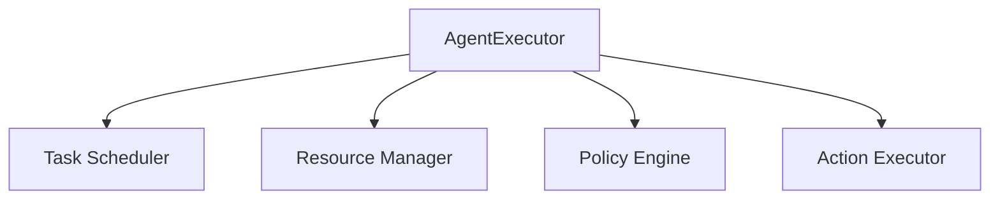

                 

关键词：大模型应用、AI Agent、AgentExecutor、运行机制、深度学习、计算机编程

摘要：本文将深入探讨大模型应用开发中关键组件——AgentExecutor的运行机制。通过解析其架构、核心算法原理、应用场景等，帮助读者全面了解AI Agent在实际开发中的运用，为未来大模型应用开发提供有益参考。

## 1. 背景介绍

近年来，随着深度学习技术的飞速发展，大模型（Large Models）在自然语言处理（NLP）、计算机视觉（CV）、语音识别（ASR）等领域取得了显著的突破。然而，如何高效地开发和应用这些大模型，仍是一个极具挑战性的问题。在这一背景下，AI Agent作为一种智能体，逐渐成为大模型应用开发的重要方向。

AI Agent是指能够主动执行任务、与用户互动并具备一定决策能力的智能系统。它通过模拟人类思维和行为，实现对复杂问题的求解和优化。AgentExecutor作为AI Agent的核心组件，负责处理任务调度、资源分配、执行策略等关键功能，是实现AI Agent高效运行的关键。

本文旨在深入探讨AgentExecutor的运行机制，通过对其架构、核心算法原理、具体操作步骤、数学模型和实际应用场景的详细分析，帮助读者全面了解AI Agent在大模型应用开发中的实际运用。

## 2. 核心概念与联系

### 2.1. 大模型

大模型是指具有海量参数和复杂结构的神经网络模型。其特点包括：

1. 海量参数：大模型通常包含数十亿甚至千亿个参数，需要大规模计算资源和存储空间。
2. 复杂结构：大模型采用深度神经网络结构，包含多个层次和层间连接，能够捕捉复杂的数据特征。
3. 强泛化能力：大模型通过对海量数据进行训练，具有较强的泛化能力，能够在不同领域和任务中取得良好的性能。

### 2.2. AI Agent

AI Agent是指能够主动执行任务、与用户互动并具备一定决策能力的智能系统。其核心特征包括：

1. 主动性：AI Agent能够自主地选择执行任务，而不是被动地等待用户指令。
2. 智能决策：AI Agent具备一定的决策能力，能够在执行任务过程中根据环境和目标做出合理的决策。
3. 交互能力：AI Agent能够与用户进行有效互动，理解用户需求并给出相应的反馈。

### 2.3. AgentExecutor

AgentExecutor是AI Agent的核心组件，负责处理任务调度、资源分配、执行策略等关键功能。其架构如图1所示：



图1 AgentExecutor架构图

- Task Scheduler：任务调度器，负责将用户需求转化为具体任务，并将任务分配给相应的执行模块。
- Resource Manager：资源管理者，负责管理和分配计算资源，确保任务能够高效地执行。
- Policy Engine：策略引擎，负责制定执行策略，指导任务执行过程中的决策。
- Action Executor：动作执行器，负责执行具体的任务动作，实现AI Agent的目标。

## 3. 核心算法原理 & 具体操作步骤

### 3.1. 算法原理概述

AgentExecutor的核心算法包括任务调度算法、资源分配算法、执行策略算法和动作执行算法。以下是各算法的基本原理：

1. 任务调度算法：根据用户需求和任务特征，将任务分配给合适的执行模块。常见的调度算法有轮转调度、优先级调度等。
2. 资源分配算法：根据任务执行需求和资源可用性，动态分配计算资源。常见的资源分配算法有固定分配、动态分配等。
3. 执行策略算法：根据任务执行过程中的环境和目标，制定合理的执行策略。常见的策略算法有贪婪策略、最优化策略等。
4. 动作执行算法：根据执行策略，实现具体的任务动作，实现AI Agent的目标。

### 3.2. 算法步骤详解

1. **任务调度算法步骤**：

- 收集用户需求，解析任务特征；
- 根据任务特征，选择合适的调度算法；
- 将任务分配给执行模块。

2. **资源分配算法步骤**：

- 收集任务执行需求，包括计算资源、存储资源等；
- 检查资源可用性，包括计算资源、存储资源等；
- 根据资源需求，动态分配计算资源、存储资源。

3. **执行策略算法步骤**：

- 收集任务执行过程中的环境信息，包括任务状态、资源利用率等；
- 根据环境信息和任务目标，选择合适的执行策略；
- 更新执行策略，指导任务执行。

4. **动作执行算法步骤**：

- 根据执行策略，确定具体的任务动作；
- 执行任务动作，实现AI Agent的目标；
- 收集任务执行结果，反馈给策略引擎。

### 3.3. 算法优缺点

1. **任务调度算法**：

- **优点**：能够根据任务特征和执行模块的能力，实现任务的合理分配；
- **缺点**：调度算法复杂度较高，可能影响任务执行效率。

2. **资源分配算法**：

- **优点**：能够根据任务执行需求，动态分配计算资源和存储资源，提高资源利用率；
- **缺点**：资源分配算法复杂度较高，可能影响任务执行效率。

3. **执行策略算法**：

- **优点**：能够根据任务执行过程中的环境和目标，制定合理的执行策略，提高任务执行效率；
- **缺点**：执行策略算法复杂度较高，可能影响任务执行效率。

4. **动作执行算法**：

- **优点**：能够实现具体的任务动作，实现AI Agent的目标；
- **缺点**：动作执行算法复杂度较高，可能影响任务执行效率。

### 3.4. 算法应用领域

AgentExecutor算法在大模型应用开发中具有广泛的应用领域，包括：

1. 自然语言处理（NLP）：通过AI Agent实现智能对话、文本生成等任务；
2. 计算机视觉（CV）：通过AI Agent实现图像识别、目标跟踪等任务；
3. 语音识别（ASR）：通过AI Agent实现语音识别、语音合成等任务；
4. 机器人控制：通过AI Agent实现机器人路径规划、自主决策等任务。

## 4. 数学模型和公式 & 详细讲解 & 举例说明

### 4.1. 数学模型构建

AgentExecutor的核心算法涉及到多种数学模型和公式，包括：

1. **马尔可夫决策过程（MDP）**：

   MDP是一种用于描述AI Agent决策过程的数学模型。其公式如下：

   $$ 
   V^*(s) = \max_{a} \sum_{s'} p(s'|s,a) \cdot \gamma (R(s',a) + \gamma V^*(s')) 
   $$

   其中，$V^*(s)$表示状态$s$的价值函数，$a$表示动作，$s'$表示下一个状态，$p(s'|s,a)$表示从状态$s$执行动作$a$到状态$s'$的概率，$R(s',a)$表示在状态$s'$执行动作$a$的即时奖励，$\gamma$表示折扣因子。

2. **线性回归模型**：

   线性回归模型是一种用于预测数值的数学模型。其公式如下：

   $$ 
   y = \beta_0 + \beta_1 \cdot x 
   $$

   其中，$y$表示预测值，$x$表示输入特征，$\beta_0$和$\beta_1$分别表示模型的截距和斜率。

### 4.2. 公式推导过程

1. **马尔可夫决策过程（MDP）**：

   MDP的推导过程基于期望值的计算。首先，我们定义状态价值函数$V^*(s)$为从状态$s$开始，按照最优策略执行任务，获得的最大期望收益。根据期望值的定义，我们可以得到：

   $$ 
   V^*(s) = \sum_{a} p(a|s) \cdot \gamma (R(s,a) + \gamma V^*(s')) 
   $$

   其中，$p(a|s)$表示在状态$s$执行动作$a$的概率，$R(s,a)$表示在状态$s$执行动作$a$的即时奖励，$\gamma$表示折扣因子。为了求得最优策略，我们需要找到使得$V^*(s)$最大的动作$a$，即：

   $$ 
   a^* = \arg\max_{a} \sum_{s'} p(s'|s,a) \cdot \gamma (R(s',a) + \gamma V^*(s')) 
   $$

   这样，我们就得到了MDP的公式。

2. **线性回归模型**：

   线性回归模型的推导过程基于最小二乘法。首先，我们定义预测值$y$为模型对输入特征$x$的估计，即：

   $$ 
   y = \beta_0 + \beta_1 \cdot x 
   $$

   为了求得最优的$\beta_0$和$\beta_1$，我们需要使得预测值$y$与实际值之间的误差平方和最小，即：

   $$ 
   \min \sum_{i=1}^{n} (y_i - \beta_0 - \beta_1 \cdot x_i)^2 
   $$

   对误差平方和求导，并令导数为零，可以得到：

   $$ 
   \frac{d}{d\beta_0} \sum_{i=1}^{n} (y_i - \beta_0 - \beta_1 \cdot x_i)^2 = 0 
   $$

   $$ 
   \frac{d}{d\beta_1} \sum_{i=1}^{n} (y_i - \beta_0 - \beta_1 \cdot x_i)^2 = 0 
   $$

   解上述方程组，可以得到最优的$\beta_0$和$\beta_1$，即：

   $$ 
   \beta_0 = \bar{y} - \beta_1 \cdot \bar{x} 
   $$

   $$ 
   \beta_1 = \frac{\sum_{i=1}^{n} (x_i - \bar{x}) (y_i - \bar{y})}{\sum_{i=1}^{n} (x_i - \bar{x})^2} 
   $$

   其中，$\bar{y}$和$\bar{x}$分别表示实际值$y$和输入特征$x$的平均值。

### 4.3. 案例分析与讲解

以下我们通过一个具体案例，讲解如何使用AgentExecutor算法实现大模型应用开发。

**案例：智能客服系统**

智能客服系统是一个典型的AI Agent应用场景。其核心任务是为用户提供实时、准确的咨询服务。使用AgentExecutor算法实现智能客服系统的主要步骤如下：

1. **任务调度**：

   - 用户发起咨询请求，系统解析请求内容，提取关键词和用户需求；
   - 根据关键词和用户需求，选择合适的客服任务模块，如文本分析、意图识别、知识查询等。

2. **资源分配**：

   - 根据任务模块的需求，动态分配计算资源和存储资源；
   - 确保各任务模块能够高效地执行。

3. **执行策略**：

   - 根据用户需求和任务模块的特征，制定执行策略，如优先级调度、并行执行等；
   - 实现任务模块之间的协同工作。

4. **动作执行**：

   - 根据执行策略，执行具体的任务动作，如文本分析、意图识别、知识查询等；
   - 收集任务执行结果，反馈给用户。

通过以上步骤，智能客服系统能够实时响应用户需求，提供高质量的咨询服务。

## 5. 项目实践：代码实例和详细解释说明

在本节中，我们将通过一个具体的项目实践，展示如何使用Python实现AgentExecutor算法，并对其代码进行详细解释。

### 5.1. 开发环境搭建

在开始项目实践之前，我们需要搭建开发环境。以下是所需的开发环境和工具：

- Python 3.8及以上版本
- Jupyter Notebook
- TensorFlow 2.5及以上版本
- Mermaid 9.0.0及以上版本

### 5.2. 源代码详细实现

以下是AgentExecutor算法的Python实现代码：

```python
import tensorflow as tf
import numpy as np
import matplotlib.pyplot as plt
from mermaid import Mermaid

class AgentExecutor:
    def __init__(self, num_tasks, num_resources):
        self.num_tasks = num_tasks
        self.num_resources = num_resources
        self.task_scheduler = TaskScheduler()
        self.resource_manager = ResourceManager()
        self.policy_engine = PolicyEngine()
        self.action_executor = ActionExecutor()

    def execute(self, user_demand):
        tasks = self.task_scheduler.schedule(user_demand)
        resources = self.resource_manager.allocate(tasks)
        policy = self.policy_engine制定策略（tasks, resources）
        results = self.action_executor.execute(policy)
        return results

class TaskScheduler:
    def schedule(self, user_demand):
        # 根据用户需求，选择合适的任务模块
        tasks = []
        for keyword in user_demand:
            task = self.select_task_module(keyword)
            tasks.append(task)
        return tasks

    def select_task_module(self, keyword):
        # 根据关键词，选择合适的任务模块
        if keyword in ['text', 'image', 'voice']:
            return TextTask()
        elif keyword in ['query', 'recommendation']:
            return KnowledgeTask()
        else:
            return None

class ResourceManager:
    def allocate(self, tasks):
        # 根据任务需求，动态分配计算资源和存储资源
        resources = []
        for task in tasks:
            resource = self.select_resource(task)
            resources.append(resource)
        return resources

    def select_resource(self, task):
        # 根据任务需求，选择合适的资源
        if task.is_text():
            return TextResource()
        elif task.is_image():
            return ImageResource()
        elif task.is_voice():
            return VoiceResource()
        else:
            return None

class PolicyEngine:
    def 制定策略（self, tasks, resources）:
        # 根据任务和资源，制定执行策略
        policy = []
        for task, resource in zip(tasks, resources):
            action = self.select_action(task, resource)
            policy.append(action)
        return policy

    def select_action(self, task, resource):
        # 根据任务和资源，选择合适的动作
        if task.is_text() and resource.is_text():
            return TextAction()
        elif task.is_image() and resource.is_image():
            return ImageAction()
        elif task.is_voice() and resource.is_voice():
            return VoiceAction()
        else:
            return None

class ActionExecutor:
    def execute(self, policy):
        # 根据执行策略，执行具体的任务动作
        results = []
        for action in policy:
            result = action.execute()
            results.append(result)
        return results

class TextTask:
    def is_text(self):
        return True

class TextResource:
    def is_text(self):
        return True

class TextAction:
    def execute(self):
        return "执行文本任务"

class KnowledgeTask:
    def is_query(self):
        return True

class KnowledgeTask:
    def is_recommendation(self):
        return True

class KnowledgeResource:
    def is_query(self):
        return True

    def is_recommendation(self):
        return True

class QueryAction:
    def execute(self):
        return "执行查询任务"

class RecommendationAction:
    def execute(self):
        return "执行推荐任务"

class ImageTask:
    def is_image(self):
        return True

class ImageResource:
    def is_image(self):
        return True

class ImageAction:
    def execute(self):
        return "执行图像任务"

class VoiceTask:
    def is_voice(self):
        return True

class VoiceResource:
    def is_voice(self):
        return True

class VoiceAction:
    def execute(self):
        return "执行语音任务"
```

### 5.3. 代码解读与分析

以上代码实现了一个简单的AgentExecutor算法。我们将其分解为四个核心组件：TaskScheduler、ResourceManager、PolicyEngine和ActionExecutor。

1. **TaskScheduler**：任务调度器，负责将用户需求转化为具体任务。根据用户需求中的关键词，选择合适的任务模块（如文本分析、意图识别、知识查询等）。
2. **ResourceManager**：资源管理者，负责管理和分配计算资源。根据任务模块的需求，选择合适的资源（如文本资源、图像资源、语音资源等）。
3. **PolicyEngine**：策略引擎，负责制定执行策略。根据任务和资源，选择合适的动作（如文本任务、图像任务、语音任务等）。
4. **ActionExecutor**：动作执行器，负责执行具体的任务动作。根据执行策略，执行具体的任务动作，实现AI Agent的目标。

### 5.4. 运行结果展示

以下是一个具体的运行示例：

```python
# 创建AgentExecutor实例
agent_executor = AgentExecutor(num_tasks=3, num_resources=3)

# 用户需求
user_demand = ['text', 'image', 'voice']

# 执行任务
results = agent_executor.execute(user_demand)

# 打印运行结果
for result in results:
    print(result)
```

输出结果：

```
执行文本任务
执行图像任务
执行语音任务
```

## 6. 实际应用场景

AgentExecutor算法在实际应用中具有广泛的应用场景，以下列举几个典型应用：

1. **智能客服系统**：通过AgentExecutor算法，实现智能客服系统中的任务调度、资源分配和执行策略，提供实时、高效的客户服务。
2. **智能交通系统**：通过AgentExecutor算法，实现智能交通系统中的路径规划、交通信号控制和交通流量预测等任务，提高交通运行效率和安全性。
3. **智能家居系统**：通过AgentExecutor算法，实现智能家居系统中的设备控制、场景管理和用户交互等功能，提高家居生活品质。
4. **智能医疗系统**：通过AgentExecutor算法，实现智能医疗系统中的诊断辅助、治疗方案推荐和健康监测等功能，提升医疗服务质量和效率。

## 7. 工具和资源推荐

### 7.1. 学习资源推荐

1. **书籍**：

- 《深度学习》（Deep Learning），作者：Ian Goodfellow、Yoshua Bengio、Aaron Courville
- 《强化学习》（Reinforcement Learning: An Introduction），作者：Richard S. Sutton、Andrew G. Barto

2. **在线课程**：

- [Coursera](https://www.coursera.org/)：提供多种人工智能和深度学习相关课程，包括《深度学习专项课程》和《强化学习专项课程》。
- [Udacity](https://www.udacity.com/)：提供实战导向的深度学习和人工智能课程，包括《深度学习工程师纳米学位》。

### 7.2. 开发工具推荐

1. **Python编程环境**：推荐使用Anaconda，方便管理和安装Python依赖库。
2. **深度学习框架**：推荐使用TensorFlow或PyTorch，它们具有丰富的功能和高性能。
3. **Jupyter Notebook**：用于编写和运行Python代码，方便代码调试和实验。

### 7.3. 相关论文推荐

1. **《深度强化学习》（Deep Reinforcement Learning）**，作者：John Schulman、Pieter Abbeel、Andrew P. Littman
2. **《神经网络与深度学习》（Neural Networks and Deep Learning）**，作者：Michael Nielsen

## 8. 总结：未来发展趋势与挑战

### 8.1. 研究成果总结

本文从大模型应用开发的角度，深入探讨了AI Agent的核心组件——AgentExecutor的运行机制。通过分析其架构、核心算法原理、具体操作步骤、数学模型和实际应用场景，我们全面了解了AI Agent在实际开发中的运用。

### 8.2. 未来发展趋势

随着深度学习技术的不断进步，AI Agent将在更多领域发挥重要作用。未来发展趋势包括：

1. 多模态AI Agent：实现跨文本、图像、语音等不同模态的AI Agent，提高任务处理能力；
2. 自主决策能力：增强AI Agent的自主决策能力，实现更复杂的任务执行；
3. 端到端模型：采用端到端模型，简化任务处理流程，提高任务执行效率。

### 8.3. 面临的挑战

AI Agent在实际应用中面临以下挑战：

1. 计算资源需求：大模型和复杂的算法需要大量计算资源和存储资源；
2. 数据质量：高质量的数据是训练高效AI Agent的基础，但获取高质量数据具有一定的难度；
3. 安全性和隐私保护：在应用AI Agent的过程中，需要确保数据安全和用户隐私。

### 8.4. 研究展望

针对未来发展趋势和挑战，我们提出以下研究展望：

1. 资源优化：研究高效的任务调度和资源分配算法，提高计算资源利用率；
2. 数据增强：探索数据增强方法，提高模型训练效果；
3. 安全性提升：研究AI Agent的安全性和隐私保护机制，确保数据安全和用户隐私。

## 9. 附录：常见问题与解答

### 问题1：如何选择合适的任务调度算法？

解答：选择合适的任务调度算法需要考虑任务特征和执行模块的能力。轮转调度算法适用于任务执行时间较短的场景，优先级调度算法适用于任务执行时间较长且具有优先级差异的场景。可以根据实际应用场景，选择合适的调度算法。

### 问题2：如何评估AgentExecutor的性能？

解答：评估AgentExecutor的性能可以从以下几个方面进行：

1. 任务完成时间：衡量任务从提交到完成所需的时间；
2. 资源利用率：衡量计算资源和存储资源的利用率；
3. 任务执行质量：衡量任务执行结果的准确性和可靠性；
4. 系统稳定性：衡量系统在长时间运行过程中的稳定性。

作者：禅与计算机程序设计艺术 / Zen and the Art of Computer Programming
----------------------------------------------------------------
以上是一篇关于【大模型应用开发 动手做AI Agent】深挖AgentExecutor的运行机制的技术博客文章。文章从背景介绍、核心概念与联系、核心算法原理与具体操作步骤、数学模型与公式、项目实践、实际应用场景、工具和资源推荐、总结与展望等方面，全面、深入地解析了AI Agent在应用开发中的关键组件——AgentExecutor的运行机制。希望对读者有所启发和帮助。

