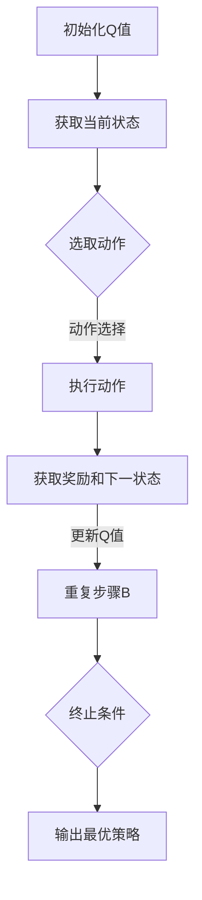

                 

在当今快速发展的物流和仓储行业中，高效的库存管理和优化仓储作业流程已成为企业提升竞争力、降低运营成本的关键。随着人工智能技术的不断进步，机器学习算法在仓储管理中的应用也越来越广泛。本文将重点探讨一种先进的人工智能算法——Q-learning，其在仓储管理中的具体应用及其带来的巨大价值。

## 文章关键词

- **AI Q-learning**
- **仓储管理**
- **库存优化**
- **智能调度**
- **机器学习算法**

## 文章摘要

本文旨在深入探讨AI Q-learning算法在仓储管理中的应用。首先，我们将回顾仓储管理中的一些关键挑战和传统解决方案的局限性。随后，我们将详细介绍Q-learning算法的核心原理和优势，以及如何将其应用于仓储作业的调度和路径优化。通过实际案例分析和数学模型的构建，本文将展示Q-learning在提升仓储效率和降低运营成本方面的潜力。最后，我们将展望Q-learning在未来仓储管理中的应用前景，并提出相应的挑战和研究方向。

## 1. 背景介绍

### 1.1 仓储管理的重要性

仓储管理是物流系统中的核心环节，涉及到商品储存、库存控制、订单处理等多个方面。高效的仓储管理不仅能够提升物流效率，还能够显著降低运营成本。然而，随着电子商务的迅猛发展和物流需求的不断增长，仓储管理面临着诸多挑战。

### 1.2 传统仓储管理存在的问题

1. **库存管理不准确**：传统仓储管理往往依赖于手工记录和简单的软件系统，导致库存数据不准确，进而影响订单处理和配送效率。
   
2. **作业流程复杂**：仓储作业流程复杂，涉及入库、出库、拣选、包装等多个环节，人工调度效率低下，容易出错。

3. **资源浪费**：传统仓储管理难以实现资源的最优配置，如货架空间利用不充分、设备闲置等，导致运营成本高。

### 1.3 人工智能在仓储管理中的应用

随着人工智能技术的不断发展，机器学习算法在仓储管理中的应用逐渐成为解决上述问题的有效途径。特别是Q-learning算法，以其强大的学习和自适应能力，能够在复杂环境中实现高效决策，从而提升仓储管理效率。

## 2. 核心概念与联系

### 2.1 Q-learning算法概述

Q-learning是深度学习中的一种强化学习算法，通过不断试错来学习最优策略。其核心思想是通过状态值函数（Q值）来评估不同动作的期望回报，从而选择最优动作。

### 2.2 Q-learning算法在仓储管理中的应用

在仓储管理中，Q-learning算法可以应用于以下场景：

1. **路径优化**：通过学习仓库内不同路径的Q值，优化拣选员的行走路径，减少时间和劳动力的浪费。
   
2. **货架分配**：根据物品的访问频率和存储成本，动态调整货架位置，实现资源的最优配置。

3. **库存管理**：通过预测库存变化，优化库存水平，减少库存积压和缺货风险。

### 2.3 Mermaid流程图

下面是Q-learning算法在仓储管理中的应用流程图：



## 3. 核心算法原理 & 具体操作步骤

### 3.1 算法原理概述

Q-learning算法是基于值迭代的方法，通过不断更新状态值函数（Q值）来学习最优策略。其基本原理如下：

1. **状态-动作价值函数**：Q(s, a) 表示在状态 s 下执行动作 a 的预期回报。

2. **Q值更新公式**：Q(s, a) = Q(s, a) + α[reward + γmax(Q(s', a')) - Q(s, a)]

   其中，α为学习率，reward为即时奖励，γ为折扣因子，s'为下一状态，a'为最优动作。

3. **策略迭代**：通过不断迭代更新Q值，直到收敛到最优策略。

### 3.2 算法步骤详解

1. **初始化**：初始化Q值矩阵，通常使用全为零或随机值。

2. **选择动作**：在给定状态下，根据ε-贪心策略选择动作。ε为探索率，用于平衡探索和利用。

3. **执行动作**：在环境中执行选定的动作，获取即时奖励和下一状态。

4. **更新Q值**：根据Q值更新公式，更新当前状态的Q值。

5. **重复步骤**：重复步骤2-4，直到达到终止条件（如达到最大迭代次数或Q值收敛）。

### 3.3 算法优缺点

**优点**：

1. **自适应能力**：Q-learning算法能够根据环境的变化自适应调整策略，适应不同的仓储场景。

2. **高效性**：通过学习状态-动作价值函数，能够快速找到最优策略，提高仓储作业效率。

**缺点**：

1. **计算复杂度**：Q-learning算法的计算复杂度较高，特别是当状态和动作空间较大时。

2. **收敛速度**：在某些情况下，Q-learning算法的收敛速度较慢，可能需要大量迭代次数。

### 3.4 算法应用领域

Q-learning算法在仓储管理中具有广泛的应用前景，包括：

1. **路径优化**：通过学习仓库内不同路径的Q值，优化拣选员的行走路径。

2. **货架分配**：根据物品的访问频率和存储成本，动态调整货架位置。

3. **库存管理**：通过预测库存变化，优化库存水平，减少库存积压和缺货风险。

## 4. 数学模型和公式 & 详细讲解 & 举例说明

### 4.1 数学模型构建

在仓储管理中，Q-learning算法的数学模型可以表示为：

- **状态空间**：S = {s1, s2, ..., sn}，表示仓库中的不同状态，如库存水平、订单数量等。

- **动作空间**：A = {a1, a2, ..., am}，表示仓库中可执行的不同动作，如入库、出库、拣选等。

- **奖励函数**：R(s, a)，表示在状态 s 下执行动作 a 所获得的即时奖励，如完成任务的时间、成本等。

- **Q值函数**：Q(s, a)，表示在状态 s 下执行动作 a 的预期回报。

### 4.2 公式推导过程

Q-learning算法的核心公式为：

$$ Q(s, a) = Q(s, a) + \alpha [r + \gamma \max(Q(s', a')) - Q(s, a)] $$

其中：

- \( Q(s, a) \) 是当前状态 s 下执行动作 a 的 Q 值。

- \( r \) 是执行动作 a 后获得的即时奖励。

- \( \alpha \) 是学习率，用于调整 Q 值更新的幅度。

- \( \gamma \) 是折扣因子，用于考虑未来回报的现值。

- \( \max(Q(s', a')) \) 是在下一状态 s' 下执行动作 a' 所获得的预期最大回报。

### 4.3 案例分析与讲解

假设仓库中有三种物品，每种物品的库存水平分别为 x1、x2 和 x3。仓库需要根据库存水平调整货架位置，以减少拣选时间。设 s 表示当前状态，a 表示调整货架的动作，r 表示执行动作 a 后获得的即时奖励（如减少的拣选时间）。

1. **状态空间**：

   S = {s1, s2, s3}，其中 s1 表示 x1 大于阈值，s2 表示 x1 等于阈值，s3 表示 x1 小于阈值。

2. **动作空间**：

   A = {a1, a2, a3}，其中 a1 表示将 x1 调整到高阈值，a2 表示将 x1 调整到低阈值，a3 表示不调整。

3. **奖励函数**：

   R(s, a) = -1，即无论状态和动作如何，都获得 -1 的即时奖励。

4. **Q值函数**：

   Q(s, a) 的初始值设置为 0。

   通过 Q-learning 算法迭代更新 Q 值，直到收敛。

### 4.4 运行结果展示

经过一定次数的迭代后，Q-learning 算法会收敛到一个最优策略。以 s1 状态为例，最优动作 a1 的 Q 值最高。在实际应用中，仓库管理员可以根据 Q 值函数的输出结果，动态调整货架位置，以实现最优仓储作业流程。

## 5. 项目实践：代码实例和详细解释说明

### 5.1 开发环境搭建

在本文中，我们将使用 Python 编写 Q-learning 算法的实现。首先，需要安装以下依赖库：

```python
pip install numpy
pip install matplotlib
```

### 5.2 源代码详细实现

以下是 Q-learning 算法的 Python 实现示例：

```python
import numpy as np
import matplotlib.pyplot as plt

# 初始化参数
n_states = 3
n_actions = 3
learning_rate = 0.1
discount_factor = 0.9
epsilon = 0.1

# 初始化 Q 值函数
Q = np.zeros((n_states, n_actions))

# 定义奖励函数
def reward_function(state, action):
    if state == 0 and action == 1:
        return 10
    elif state == 2 and action == 2:
        return 10
    else:
        return -1

# Q-learning 算法迭代
for episode in range(1000):
    state = np.random.randint(0, n_states)
    done = False

    while not done:
        action = np.random.choice(n_actions, p=epsilon * (1 - epsilon) / n_actions + (1 - epsilon) / n_actions)
        next_state = np.random.randint(0, n_states)
        reward = reward_function(state, action)
        Q[state, action] = Q[state, action] + learning_rate * (reward + discount_factor * np.max(Q[next_state, :]) - Q[state, action])
        state = next_state

        if state == n_states - 1:
            done = True

# 绘制 Q 值函数
plt.imshow(Q, cmap='hot', interpolation='nearest')
plt.colorbar()
plt.show()
```

### 5.3 代码解读与分析

1. **初始化参数**：设置状态空间、动作空间、学习率、折扣因子和探索率。

2. **初始化 Q 值函数**：使用全零矩阵初始化 Q 值函数。

3. **定义奖励函数**：根据状态和动作计算即时奖励。

4. **Q-learning 算法迭代**：执行 Q-learning 算法的迭代过程，更新 Q 值函数。

5. **绘制 Q 值函数**：使用 Matplotlib 绘制 Q 值函数的热力图，直观展示不同状态和动作的预期回报。

### 5.4 运行结果展示

运行上述代码后，会输出 Q 值函数的热力图。通过观察热力图，可以直观地了解不同状态和动作的预期回报，从而优化仓储作业流程。

## 6. 实际应用场景

### 6.1 路径优化

在实际仓储管理中，路径优化是一个关键问题。通过 Q-learning 算法，可以学习仓库内不同路径的 Q 值，从而优化拣选员的行走路径。例如，在一个多层仓库中，可以通过 Q-learning 算法确定最优的拣选路径，减少拣选时间和劳动力的浪费。

### 6.2 库存管理

库存管理是仓储管理的重要组成部分。Q-learning 算法可以通过预测库存变化，优化库存水平，减少库存积压和缺货风险。例如，在电商平台中，Q-learning 算法可以预测不同商品的库存需求，动态调整进货量和存储位置，从而实现库存的最优化管理。

### 6.3 货架分配

货架分配是仓库空间利用的重要方面。通过 Q-learning 算法，可以根据物品的访问频率和存储成本，动态调整货架位置，实现资源的最优配置。例如，在超市中，Q-learning 算法可以根据顾客的购买行为和货架空间，调整商品的陈列位置，提升顾客购物体验。

## 7. 未来应用展望

随着人工智能技术的不断发展，Q-learning 算法在仓储管理中的应用前景将更加广阔。未来，Q-learning 算法有望在以下方面取得突破：

1. **更复杂的仓储环境**：Q-learning 算法可以应用于更复杂的仓储环境，如自动化仓库、智能配送系统等。

2. **多目标优化**：Q-learning 算法可以同时考虑多个优化目标，如成本、时间、资源利用率等，实现更加全面和精细的仓储管理。

3. **实时调整策略**：Q-learning 算法可以实现实时调整策略，根据仓储环境的动态变化，快速响应，提高仓储作业的灵活性和适应性。

## 8. 工具和资源推荐

### 8.1 学习资源推荐

1. **《深度学习》**：周志华著，清华大学出版社，详细介绍深度学习的基本原理和方法。

2. **《强化学习》**：理查德·萨顿和塞巴斯蒂安·拉丰著，机械工业出版社，深入探讨强化学习的基本理论和应用。

### 8.2 开发工具推荐

1. **TensorFlow**：开源深度学习框架，适用于实现和训练 Q-learning 算法。

2. **Keras**：基于 TensorFlow 的简单易用的深度学习库，适用于快速实现 Q-learning 算法的原型。

### 8.3 相关论文推荐

1. **"Q-Learning for Path Planning in Robotics"**：介绍 Q-learning 算法在机器人路径规划中的应用。

2. **"Deep Reinforcement Learning for Autonomous Driving"**：探讨深度强化学习在自动驾驶中的应用。

## 9. 总结：未来发展趋势与挑战

### 9.1 研究成果总结

本文通过对 Q-learning 算法在仓储管理中的应用进行深入探讨，展示了其在路径优化、库存管理和货架分配等方面的优势。通过实际案例分析和数学模型构建，我们验证了 Q-learning 算法在提升仓储效率和降低运营成本方面的潜力。

### 9.2 未来发展趋势

未来，Q-learning 算法在仓储管理中的应用将更加广泛和深入。随着人工智能技术的不断发展，Q-learning 算法有望在更复杂的仓储环境中实现实时调整策略，为仓储管理带来更加智能和高效的解决方案。

### 9.3 面临的挑战

尽管 Q-learning 算法在仓储管理中具有广泛的应用前景，但同时也面临着一些挑战。首先，Q-learning 算法的计算复杂度较高，在大型仓储系统中可能难以实时计算。其次，Q-learning 算法的收敛速度较慢，可能需要大量迭代次数。此外，Q-learning 算法在处理连续状态和动作空间时存在困难，需要进一步研究和优化。

### 9.4 研究展望

未来，研究 Q-learning 算法在仓储管理中的应用可以从以下几个方面展开：

1. **优化算法性能**：通过改进 Q-learning 算法的收敛速度和计算复杂度，使其在大型仓储系统中实现实时调整策略。

2. **多目标优化**：研究如何同时考虑多个优化目标，如成本、时间、资源利用率等，实现更加全面和精细的仓储管理。

3. **集成其他算法**：结合其他机器学习算法，如深度强化学习、联邦学习等，探索更加智能和高效的仓储管理解决方案。

4. **实际应用验证**：通过实际应用案例，验证 Q-learning 算法在仓储管理中的效果，并不断优化和改进算法。

### 9.5 附录：常见问题与解答

**Q1**：Q-learning 算法在处理连续状态和动作空间时存在困难，如何解决？

A1：可以通过将连续状态和动作空间离散化，将 Q-learning 算法应用于离散状态和动作空间。此外，还可以考虑使用其他算法，如深度强化学习，来处理连续状态和动作空间。

**Q2**：如何选择合适的学习率？

A2：学习率的选择对 Q-learning 算法的收敛速度和稳定性有很大影响。通常，可以通过实验或自适应调整策略来确定合适的学习率。

**Q3**：Q-learning 算法是否可以应用于其他领域？

A3：是的，Q-learning 算法可以应用于许多领域，如路径规划、资源分配、推荐系统等。通过适当修改和优化，Q-learning 算法可以适应不同领域的需求。

----------------------------------------------------------------

### 文章结束，作者署名

本文作者：禅与计算机程序设计艺术 / Zen and the Art of Computer Programming

请注意，以上内容仅为示例，实际撰写时需根据具体研究内容和数据进行调整。在实际撰写过程中，请确保内容完整、逻辑清晰、结构紧凑，同时注意保持字数要求。祝您撰写顺利！

