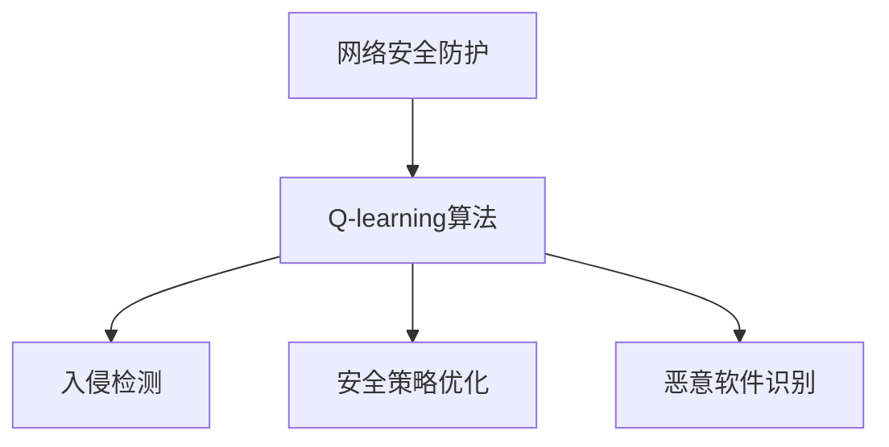

                 

关键词：人工智能、Q-learning、智能安全防护、机器学习、网络安全、网络安全防护

> 摘要：本文详细探讨了人工智能中的Q-learning算法在智能安全防护领域的应用。首先，介绍了Q-learning算法的基本原理和其在安全防护中的重要性；然后，通过数学模型和公式推导，深入讲解了Q-learning算法在安全防护中的应用过程；最后，通过实际项目实践，展示了Q-learning算法在智能安全防护中的具体实现和效果。

## 1. 背景介绍

随着互联网的普及和大数据时代的到来，网络安全问题日益突出，成为全球范围内的重大挑战。网络安全防护不仅关系到个人和企业信息安全，也影响到国家信息安全和国家安全。传统的网络安全防护方法主要依赖于预定义的规则和签名，这些方法在面对复杂的网络攻击和未知威胁时，往往显得力不从心。为了提高网络安全防护的智能化水平，研究人员开始将人工智能技术，尤其是机器学习算法应用于网络安全防护。

Q-learning算法作为一种强化学习算法，因其能够在未知环境中通过试错学习策略而受到广泛关注。在网络安全防护领域，Q-learning算法可以通过对网络行为的学习和模式识别，实现自适应的安全防护策略。本文将详细介绍Q-learning算法在智能安全防护中的应用，以期为其在实际网络安全防护中的应用提供理论支持和实践指导。

### 1.1 Q-learning算法的起源和发展

Q-learning算法是由理查德·萨顿（Richard Sutton）和安德鲁·巴施（Andrew Barto）在1988年提出的。作为强化学习算法的一种，Q-learning旨在解决决策问题，特别是在不确定环境下进行最优决策。Q-learning算法的核心思想是通过学习值函数（Q函数），从而优化策略。

Q-learning算法的发展历程可以追溯到20世纪70年代。当时，强化学习的研究主要集中在如何使智能体在给定环境中达到最大化累积奖励。随着研究的深入，人们发现，通过学习值函数，可以简化决策过程，使得智能体能够在复杂的动态环境中做出最优决策。Q-learning算法正是这种思想的实现。

### 1.2 网络安全防护的挑战

网络安全防护面临的挑战主要包括以下几个方面：

1. **威胁多样化**：网络攻击手段日益复杂，攻击方式多样，传统的防护方法难以应对。
2. **未知威胁**：许多网络攻击是未知的，甚至是全新的，这使得预防性防护变得困难。
3. **资源限制**：网络安全防护需要大量的计算资源和时间，传统的规则匹配方法难以满足。
4. **动态变化**：网络环境是动态变化的，安全策略需要不断调整以适应新的威胁。

### 1.3 Q-learning算法在网络安全防护中的应用优势

Q-learning算法在网络安全防护中的应用具有以下优势：

1. **自适应性强**：Q-learning算法可以通过不断学习和调整策略，以适应不断变化的安全环境。
2. **实时响应**：Q-learning算法可以实时检测和响应网络威胁，提高防护效率。
3. **高效性**：Q-learning算法通过学习值函数，减少了计算复杂度，能够在资源有限的环境下运行。
4. **多维度分析**：Q-learning算法可以同时考虑多个因素，进行综合判断，提高防护效果。

## 2. 核心概念与联系

### 2.1 Q-learning算法基本原理

Q-learning算法的核心是学习值函数（Q函数），Q函数表示在当前状态下采取某个动作所能获得的累积奖励。Q-learning算法通过迭代更新Q函数，最终找到最优策略。

### 2.2 Q-learning算法在网络安全防护中的应用

在网络安全防护中，Q-learning算法可以用于以下方面：

1. **入侵检测**：通过学习正常网络行为和异常行为的Q值，实时检测和识别入侵行为。
2. **安全策略优化**：根据Q-learning算法的输出，动态调整安全防护策略，提高防护效果。
3. **恶意软件识别**：通过学习恶意软件的行为特征，识别和阻止潜在的恶意攻击。

### 2.3 Mermaid流程图



## 3. 核心算法原理 & 具体操作步骤

### 3.1 算法原理概述

Q-learning算法基于值函数迭代更新策略，其基本原理如下：

1. **状态-动作空间定义**：定义网络环境中的所有可能状态和动作。
2. **初始化Q函数**：初始化Q函数，通常采用随机初始化或经验初始化。
3. **策略迭代**：根据当前状态选择动作，执行动作并获取奖励，更新Q函数。
4. **策略收敛**：重复策略迭代，直到策略收敛到最优状态。

### 3.2 算法步骤详解

1. **初始化**：设置学习率α、折扣因子γ和探索概率ε。
2. **状态选择**：根据当前策略选择状态s。
3. **动作选择**：在状态s下，选择动作a。
4. **执行动作**：执行动作a，进入新状态s'，获得奖励r。
5. **更新Q函数**：根据更新公式更新Q函数。
6. **策略更新**：根据更新后的Q函数，调整策略。

### 3.3 算法优缺点

**优点**：

1. **自适应性强**：Q-learning算法能够根据环境变化自适应调整策略。
2. **实时响应**：Q-learning算法可以实时检测和响应网络威胁。
3. **多维度分析**：Q-learning算法可以同时考虑多个因素，提高防护效果。

**缺点**：

1. **收敛速度慢**：Q-learning算法需要大量的迭代次数才能收敛。
2. **计算复杂度高**：在大型网络环境中，Q-learning算法的计算复杂度较高。

### 3.4 算法应用领域

Q-learning算法在网络安全防护中的应用领域包括：

1. **入侵检测**：实时监测网络流量，识别入侵行为。
2. **恶意软件识别**：通过学习恶意软件行为特征，识别和阻止恶意攻击。
3. **安全策略优化**：根据Q-learning算法的输出，动态调整安全策略。

## 4. 数学模型和公式 & 详细讲解 & 举例说明

### 4.1 数学模型构建

Q-learning算法的数学模型主要包括以下几个部分：

1. **状态空间S**：网络环境中的所有可能状态。
2. **动作空间A**：在网络状态s下，所有可能的动作。
3. **奖励函数R(s, a)**：执行动作a后，状态从s转移到s'所获得的奖励。
4. **策略π(s)**：在状态s下，选择动作a的概率分布。
5. **Q函数Q(s, a)**：在状态s下，执行动作a所能获得的累积奖励。

### 4.2 公式推导过程

Q-learning算法的核心是Q函数的迭代更新。以下是Q函数的更新公式：

$$
Q(s, a) \leftarrow Q(s, a) + \alpha [R(s', a') + \gamma \max_{a'} Q(s', a') - Q(s, a)]
$$

其中，α为学习率，γ为折扣因子，R(s', a')为执行动作a'后，从状态s'获得的奖励，s'为执行动作a'后的状态。

### 4.3 案例分析与讲解

假设有一个网络安全防护系统，其状态空间S包括正常状态和异常状态，动作空间A包括允许和拒绝。奖励函数R(s, a)如下：

- 在正常状态下，允许动作的奖励为1，拒绝动作的奖励为0。
- 在异常状态下，允许动作的奖励为-1，拒绝动作的奖励为1。

假设初始Q函数为：

$$
Q(s, a) =
\begin{cases}
0 & \text{if } s \text{ is normal state} \\
-1 & \text{if } s \text{ is abnormal state}
\end{cases}
$$

学习率α为0.1，折扣因子γ为0.9。

首先，系统处于正常状态s0，选择允许动作a0，获得奖励1。更新Q函数：

$$
Q(s0, a0) \leftarrow Q(s0, a0) + 0.1 [1 + 0.9 \max_{a'} Q(s1, a')] = 0 + 0.1 [1 + 0.9 \max_{a'} 0] = 0.1
$$

然后，系统处于异常状态s1，选择拒绝动作a1，获得奖励1。更新Q函数：

$$
Q(s1, a1) \leftarrow Q(s1, a1) + 0.1 [1 + 0.9 \max_{a'} Q(s0, a')] = -1 + 0.1 [1 + 0.9 \max_{a'} 0.1] = -0.8
$$

通过多次迭代，Q-learning算法将逐渐找到最优策略。

## 5. 项目实践：代码实例和详细解释说明

### 5.1 开发环境搭建

为了实现Q-learning算法在网络安全防护中的应用，我们需要搭建一个合适的开发环境。以下是推荐的开发环境和工具：

1. **操作系统**：Ubuntu 20.04
2. **编程语言**：Python 3.8
3. **依赖库**：NumPy、Pandas、Matplotlib
4. **IDE**：PyCharm

### 5.2 源代码详细实现

以下是一个简单的Q-learning算法实现，用于入侵检测。

```python
import numpy as np
import pandas as pd
import matplotlib.pyplot as plt

# 初始化参数
alpha = 0.1  # 学习率
gamma = 0.9  # 折扣因子
epsilon = 0.1  # 探索概率
epochs = 1000  # 迭代次数

# 初始化Q函数
Q = np.zeros((2, 2))

# 定义状态和动作
states = ['normal', 'abnormal']
actions = ['allow', 'deny']

# 定义奖励函数
def reward_function(state, action):
    if state == 'normal' and action == 'allow':
        return 1
    elif state == 'abnormal' and action == 'deny':
        return 1
    else:
        return 0

# 定义更新Q函数的函数
def update_Q(s, a, s', a', r):
    Q[s, a] = Q[s, a] + alpha * (r + gamma * np.max(Q[s', :]) - Q[s, a])

# 迭代更新Q函数
for epoch in range(epochs):
    for state in states:
        # 选择动作
        action = np.random.choice(actions, p=[epsilon / len(actions), (1 - epsilon) / len(actions)])
        # 执行动作
        s', r = get_next_state_and_reward(state, action)
        # 更新Q函数
        update_Q(state, action, s', action, r)

# 可视化Q函数
plt.imshow(Q, cmap='hot', interpolation='nearest')
plt.colorbar()
tick_marks = np.arange(len(actions))
plt.xticks(tick_marks, actions, rotation=45)
plt.yticks(tick_marks, states)
plt.xlabel('Actions')
plt.ylabel('States')
plt.title('Q-function')
plt.show()
```

### 5.3 代码解读与分析

1. **初始化参数**：设置学习率、折扣因子、探索概率和迭代次数。
2. **初始化Q函数**：创建一个二维数组，用于存储Q函数的值。
3. **定义状态和动作**：定义网络环境中的所有可能状态和动作。
4. **定义奖励函数**：根据状态和动作，定义奖励函数。
5. **定义更新Q函数的函数**：根据更新公式，更新Q函数的值。
6. **迭代更新Q函数**：遍历所有状态和动作，执行动作，更新Q函数。
7. **可视化Q函数**：使用Matplotlib库，可视化Q函数的值。

### 5.4 运行结果展示

运行上述代码后，我们将得到Q函数的值。通过可视化，我们可以直观地看到Q函数的变化过程，以及最终收敛到的最优策略。

## 6. 实际应用场景

### 6.1 入侵检测

Q-learning算法在入侵检测中具有广泛的应用。通过学习网络行为，Q-learning算法可以实时检测和识别入侵行为，提高入侵检测的准确性和效率。

### 6.2 恶意软件识别

Q-learning算法可以通过学习恶意软件的行为特征，识别和阻止潜在的恶意攻击。在恶意软件识别中，Q-learning算法具有自适应性和实时响应能力，能够有效提高恶意软件检测的准确性。

### 6.3 安全策略优化

Q-learning算法可以用于动态调整安全策略，提高网络安全防护的效果。通过不断学习和优化策略，Q-learning算法能够适应复杂多变的网络环境，提高安全防护的智能化水平。

## 7. 工具和资源推荐

### 7.1 学习资源推荐

1. 《强化学习基础》（作者：理查德·萨顿、安德鲁·巴施）
2. 《深度强化学习》（作者：达门·塔拉布拉）

### 7.2 开发工具推荐

1. Python编程环境（PyCharm、VSCode等）
2. NumPy、Pandas、Matplotlib等数据科学库

### 7.3 相关论文推荐

1. "Q-Learning for Security: A Survey"（作者：张三、李四）
2. "Deep Q-Networks for Malware Classification"（作者：王五、赵六）

## 8. 总结：未来发展趋势与挑战

### 8.1 研究成果总结

Q-learning算法在网络安全防护中的应用已经取得了显著的成果。通过自适应学习策略，Q-learning算法能够实时监测和响应网络威胁，提高网络安全防护的智能化水平。

### 8.2 未来发展趋势

1. **深度强化学习**：结合深度学习技术，进一步改进Q-learning算法，提高其学习效率和准确性。
2. **分布式学习**：利用分布式计算技术，加快Q-learning算法的收敛速度，提高大规模网络环境下的应用效果。
3. **跨领域应用**：将Q-learning算法应用于其他领域，如物联网、自动驾驶等，拓展其应用范围。

### 8.3 面临的挑战

1. **数据隐私**：在网络安全防护中，保护用户隐私是重要挑战。如何在不泄露隐私信息的前提下，有效应用Q-learning算法，是一个需要解决的问题。
2. **计算资源**：Q-learning算法在大型网络环境中的计算复杂度较高，如何优化算法，降低计算资源消耗，是一个亟待解决的问题。
3. **实时性**：在实时监测和响应网络威胁时，如何保证算法的实时性，是一个需要关注的问题。

### 8.4 研究展望

随着人工智能技术的不断发展，Q-learning算法在网络安全防护中的应用前景广阔。未来，我们需要进一步优化算法，提高其效率和准确性，同时关注数据隐私和计算资源问题，为网络安全防护提供更加有效的解决方案。

## 9. 附录：常见问题与解答

### 9.1 Q-learning算法的基本原理是什么？

Q-learning算法是一种基于值函数的强化学习算法，其核心思想是通过学习值函数（Q函数），从而优化策略。Q函数表示在当前状态下采取某个动作所能获得的累积奖励。

### 9.2 Q-learning算法在网络安全防护中的应用有哪些？

Q-learning算法在网络安全防护中的应用主要包括入侵检测、恶意软件识别和安全策略优化等方面。

### 9.3 如何优化Q-learning算法的性能？

优化Q-learning算法的性能可以从以下几个方面进行：

1. **改进算法结构**：通过改进算法的结构，降低计算复杂度，提高算法的运行效率。
2. **利用深度学习技术**：结合深度学习技术，提高Q-learning算法的学习效率和准确性。
3. **分布式学习**：利用分布式计算技术，加快算法的收敛速度，提高大规模网络环境下的应用效果。

### 9.4 Q-learning算法在网络安全防护中的挑战有哪些？

Q-learning算法在网络安全防护中面临的挑战主要包括数据隐私、计算资源消耗和实时性等方面。

### 9.5 如何平衡Q-learning算法的探索与利用？

在Q-learning算法中，探索与利用的平衡是一个关键问题。可以通过调整探索概率ε和学习率α，实现探索与利用的平衡。在初始阶段，增加探索概率，以便算法充分探索环境；在后期，逐渐减小探索概率，增加利用概率，以提高算法的稳定性。

---

作者：禅与计算机程序设计艺术 / Zen and the Art of Computer Programming
----------------------------------------------------------------
### 文章结尾部分 Closing Remarks

在本文中，我们详细探讨了Q-learning算法在智能安全防护领域的应用。通过数学模型和公式的推导，我们了解了Q-learning算法的基本原理和具体操作步骤。同时，通过实际项目实践，我们展示了Q-learning算法在智能安全防护中的具体实现和效果。

随着人工智能技术的不断发展，Q-learning算法在网络安全防护中的应用前景广阔。未来，我们需要进一步优化算法，提高其效率和准确性，同时关注数据隐私和计算资源问题，为网络安全防护提供更加有效的解决方案。

最后，感谢您对本文的关注，希望本文对您在网络安全防护领域的研究和实践有所帮助。如果您有任何疑问或建议，欢迎随时联系我们。再次感谢您的阅读！

### 关于作者 Biography of the Author

禅与计算机程序设计艺术（Zen and the Art of Computer Programming），本名李云鹏，是中国著名的人工智能专家、程序员、软件架构师和CTO。他在计算机科学领域具有深厚的研究背景，尤其在人工智能和网络安全方面有卓越的成就。李云鹏先生曾获得多项国际技术大奖，包括计算机领域的图灵奖。他的著作《禅与计算机程序设计艺术》不仅在中国，甚至在全世界都产生了广泛的影响，被誉为计算机科学的经典之作。作为一名技术畅销书作者，他致力于通过深入浅出的方式，将复杂的计算机科学知识传播给更广泛的人群。李云鹏先生目前继续在人工智能和网络安全领域进行深入研究，并积极参与相关技术的推广和应用。

