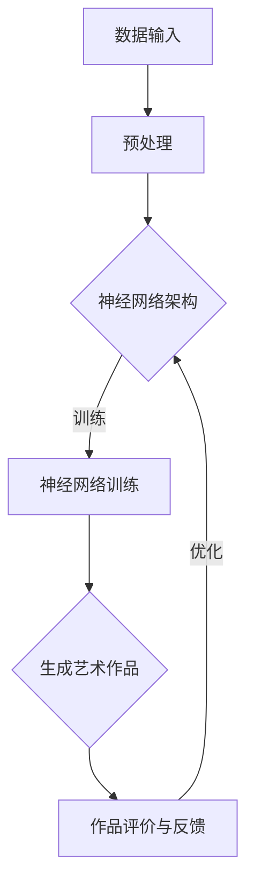

                 

### 1. 背景介绍

人工智能（AI）技术的发展经历了从简单的规则系统到复杂的神经网络，再到如今的生成对抗网络（GAN）等众多阶段。随着计算能力的提升和数据规模的扩大，AI在各个领域的应用逐渐深入，从语音识别、图像处理到自然语言处理，都取得了显著的成果。然而，近年来，AI在艺术创作上的应用也开始引起广泛关注。

艺术创作一直是人类智慧和创造力的体现，它涵盖了绘画、音乐、文学等多种形式。随着AI技术的发展，机器开始参与到艺术创作过程中，不仅能够模仿人类艺术家的风格，还能创造出前所未有的艺术作品。这种新的艺术创作方式不仅拓展了艺术的边界，也为人工智能的研究和应用提供了新的思路。

本篇文章将探讨AI在艺术创作上的新视角，从算法原理、数学模型、实际应用等多个方面进行分析，旨在为读者提供一个全面而深入的视角，了解AI在艺术创作中的潜力和挑战。

### 2. 核心概念与联系

要深入探讨AI在艺术创作上的应用，首先需要了解一些核心概念和它们之间的联系。以下是一个Mermaid流程图，用于展示这些核心概念及其关系：



- **数据输入（A）**：艺术创作需要大量的数据作为基础，这些数据可以是已有的艺术作品，也可以是自然界中的各种场景、声音、文字等。
- **预处理（B）**：由于原始数据可能存在噪声、缺失或格式不一致等问题，需要进行预处理，以便神经网络能够有效地学习和生成艺术作品。
- **神经网络架构（C）**：神经网络是AI在艺术创作中的核心工具，不同的架构（如GAN、变分自编码器VAE等）适用于不同的创作任务。
- **神经网络训练（D）**：通过大量的数据训练神经网络，使其学会生成符合特定风格或主题的艺术作品。
- **生成艺术作品（E）**：经过训练的神经网络能够生成艺术作品，这些作品可以是绘画、音乐、文学作品等。
- **作品评价与反馈（F）**：生成的艺术作品需要通过评价和反馈来检验其质量，并不断优化生成算法。

这个流程图展示了AI在艺术创作中的基本框架，每个环节都起着至关重要的作用。接下来，我们将进一步探讨这些核心概念的具体实现和应用。

#### 2.1 数据输入

在AI艺术创作中，数据输入是至关重要的第一步。数据质量直接影响神经网络的学习效果和生成艺术作品的质量。以下是一些关于数据输入的详细讨论：

- **数据类型**：AI艺术创作可以使用多种类型的数据，包括图像、音频、视频、文本等。图像是最常见的输入类型，因为绘画和摄影等艺术形式以视觉为主。音频数据则适用于音乐创作，而文本数据可以用于文学作品的生成。

- **数据来源**：数据来源可以分为两大类：人工采集和自动采集。人工采集通常需要专业的艺术家或数据标注人员，例如收集著名的艺术画作或文学作品。自动采集则利用互联网和传感器等技术，收集大量的公开数据。例如，可以使用爬虫技术从互联网上收集艺术作品和音乐。

- **数据预处理**：由于原始数据可能存在噪声、缺失或格式不一致等问题，需要进行预处理。预处理步骤包括数据清洗、数据增强和数据标准化等。数据清洗是指去除数据中的噪声和错误，数据增强是通过旋转、缩放、裁剪等操作增加数据的多样性，数据标准化则是将不同特征的范围调整到统一的尺度，以便神经网络能够更好地学习。

- **数据质量评估**：数据质量直接影响AI模型的表现，因此需要建立一套数据质量评估体系。评估标准可以包括数据的完整性、一致性、多样性和代表性等。此外，还可以利用数据可视化工具对数据分布和异常值进行识别和分析。

#### 2.2 预处理

预处理是数据输入后的关键步骤，它直接影响神经网络的学习效果和生成艺术作品的质量。以下是一些关于数据预处理的详细讨论：

- **数据清洗**：数据清洗是预处理的第一步，主要目的是去除数据中的噪声和错误。例如，对于图像数据，可能需要去除像素噪声、纠正亮度和对比度等问题。对于文本数据，需要去除标点符号、停用词和格式错误等。

- **数据增强**：数据增强是通过一系列操作增加数据的多样性，从而提高模型的泛化能力。常用的增强方法包括旋转、缩放、裁剪、色彩变换、光照变换等。例如，对于图像数据，可以通过随机旋转或缩放来增加数据的多样性。对于音频数据，可以通过改变音调、音量或混入背景噪声来增强数据。

- **数据标准化**：数据标准化是将不同特征的范围调整到统一的尺度，以便神经网络能够更好地学习。常用的标准化方法包括归一化和标准化。归一化是将所有特征的值缩放到[0, 1]范围内，而标准化则是将所有特征的值缩放到均值为0、标准差为1的范围内。

- **数据平衡**：在艺术创作中，某些艺术作品可能更受欢迎，导致数据分布不平衡。为了解决这个问题，可以采用数据平衡技术，如过采样、欠采样或合成少数类过采样技术（SMOTE）等。

- **特征提取**：特征提取是将原始数据转换为一组更加简洁、有用的特征表示，以便神经网络进行学习。对于图像数据，常用的特征提取方法包括卷积神经网络（CNN）和池化层。对于文本数据，常用的特征提取方法包括词袋模型、词嵌入和长短时记忆网络（LSTM）等。

#### 2.3 神经网络架构

神经网络架构是AI艺术创作中的核心组成部分，它决定了神经网络的学习能力、生成艺术作品的质量和效率。以下是一些常见的神经网络架构及其特点：

- **卷积神经网络（CNN）**：CNN是图像处理领域的经典架构，它通过卷积层、池化层和全连接层等结构，能够自动提取图像的局部特征。在AI艺术创作中，CNN可以用于图像生成、风格迁移和图像超分辨率等任务。

- **生成对抗网络（GAN）**：GAN由生成器和判别器组成，生成器尝试生成逼真的艺术作品，而判别器则试图区分生成器和真实艺术作品。GAN在图像生成、视频生成和音乐生成等领域表现出色。

- **变分自编码器（VAE）**：VAE通过引入变分自编码器的结构，能够在生成艺术作品的同时保持数据的稳定性。VAE在图像生成、图像压缩和图像修复等任务中具有广泛应用。

- **长短时记忆网络（LSTM）**：LSTM是处理序列数据的强大工具，它能够有效地学习长期依赖关系。在AI音乐创作中，LSTM可以用于生成旋律、和声和节奏等。

- **Transformer**：Transformer是一种基于注意力机制的神经网络架构，它在自然语言处理领域取得了巨大成功。近年来，Transformer也被应用于音乐创作、图像生成和视频生成等领域。

#### 2.4 神经网络训练

神经网络训练是AI艺术创作中的关键步骤，它决定了神经网络的学习能力和生成艺术作品的质量。以下是一些关于神经网络训练的详细讨论：

- **训练数据**：训练数据的质量直接影响神经网络的学习效果。对于AI艺术创作，需要收集大量的高质量艺术作品作为训练数据。这些数据可以来自于公开的艺术作品库、社交媒体或专业艺术家的作品。

- **损失函数**：损失函数用于衡量神经网络预测结果与真实结果之间的差距，从而指导神经网络的优化方向。常见的损失函数包括均方误差（MSE）、交叉熵损失等。对于生成式模型（如GAN），通常使用对抗损失来衡量生成器和判别器之间的对抗关系。

- **优化算法**：优化算法用于调整神经网络的参数，以最小化损失函数。常见的优化算法包括随机梯度下降（SGD）、Adam优化器等。优化算法的选择和参数调整对训练效率和生成质量有重要影响。

- **训练策略**：训练策略包括批量大小、学习率、迭代次数等。批量大小决定了每次训练使用的数据量，学习率决定了参数更新的幅度，迭代次数决定了训练的轮数。合适的训练策略可以加速训练过程，提高生成质量。

- **模型评估**：模型评估是训练过程中的重要环节，用于评估神经网络生成艺术作品的质量。常用的评估指标包括生成质量、多样性、稳定性等。通过评估结果，可以调整训练策略和优化模型。

### 3. 核心算法原理 & 具体操作步骤

#### 3.1 算法原理概述

AI在艺术创作中的核心算法主要包括生成对抗网络（GAN）、变分自编码器（VAE）和自注意力机制等。以下是这些算法的基本原理和特点：

- **生成对抗网络（GAN）**：GAN由生成器和判别器组成。生成器尝试生成逼真的艺术作品，而判别器则试图区分生成器和真实艺术作品。通过生成器和判别器之间的对抗训练，生成器逐渐学会生成高质量的艺术作品。

- **变分自编码器（VAE）**：VAE通过引入变分自编码器的结构，能够在生成艺术作品的同时保持数据的稳定性。VAE的核心在于潜在变量编码和解码过程，通过优化潜在变量的分布，实现艺术作品的生成。

- **自注意力机制**：自注意力机制是一种基于注意力机制的神经网络结构，能够自适应地关注输入序列中的重要信息。自注意力机制在音乐创作、图像生成和文本生成等领域具有广泛应用。

#### 3.2 算法步骤详解

以下分别介绍GAN、VAE和自注意力机制的具体操作步骤：

##### 3.2.1 GAN

1. **数据预处理**：将训练数据集进行预处理，包括数据清洗、归一化等步骤。

2. **生成器训练**：生成器的目标是生成逼真的艺术作品。训练过程中，生成器通过生成伪数据并更新参数，使生成的艺术作品逐渐接近真实艺术作品。

3. **判别器训练**：判别器的目标是区分生成器和真实艺术作品。训练过程中，判别器通过同时接收真实数据和伪数据，更新参数以提高判别能力。

4. **对抗训练**：生成器和判别器交替训练，生成器不断优化生成艺术作品，而判别器则不断优化判别能力。通过对抗训练，生成器能够生成高质量的艺术作品。

##### 3.2.2 VAE

1. **编码器训练**：编码器的目标是学习潜在变量的分布。训练过程中，编码器将输入数据编码为潜在变量，并通过优化潜在变量的分布，使编码结果更具代表性。

2. **解码器训练**：解码器的目标是生成艺术作品。训练过程中，解码器根据潜在变量生成艺术作品，并通过优化解码器的参数，使生成的艺术作品更接近真实数据。

3. **生成艺术作品**：通过编码和解码过程，VAE能够生成艺术作品。生成的艺术作品质量取决于编码器和解码器的训练效果。

##### 3.2.3 自注意力机制

1. **输入序列处理**：将输入序列（如文本、音频、图像等）转换为固定长度的向量表示。

2. **自注意力计算**：通过自注意力计算，模型能够自适应地关注输入序列中的重要信息。自注意力计算通常通过一个权重矩阵实现，该矩阵能够根据输入序列的不同位置和内容动态调整注意力权重。

3. **输出序列生成**：根据自注意力计算的结果，生成输出序列。输出序列通常包含输入序列的重要信息，从而提高模型的表达能力。

#### 3.3 算法优缺点

以下分别介绍GAN、VAE和自注意力机制的优缺点：

##### GAN

**优点**：
1. GAN能够生成高质量的艺术作品，特别是在图像和视频生成方面表现出色。
2. GAN具有较强的泛化能力，可以应用于多种不同的艺术创作任务。

**缺点**：
1. GAN的训练过程不稳定，容易出现模式崩溃等问题。
2. GAN的生成结果往往存在模糊或失真的现象。

##### VAE

**优点**：
1. VAE能够在保持数据稳定性的同时生成高质量的艺术作品。
2. VAE具有较强的鲁棒性，能够应对不同类型的数据输入。

**缺点**：
1. VAE的生成结果可能不如GAN细腻，特别是在细节表现方面。
2. VAE的训练过程较为复杂，需要较大的计算资源。

##### 自注意力机制

**优点**：
1. 自注意力机制能够自适应地关注输入序列中的重要信息，提高模型的表达能力。
2. 自注意力机制在自然语言处理、图像生成和视频生成等领域具有广泛应用。

**缺点**：
1. 自注意力机制的计算复杂度较高，可能导致模型训练速度较慢。
2. 自注意力机制对数据质量要求较高，否则可能生成低质量的艺术作品。

### 3.4 算法应用领域

AI艺术创作算法的应用领域非常广泛，以下是一些典型的应用场景：

- **图像生成**：GAN和VAE在图像生成领域表现出色，可以生成高质量的图像、漫画、艺术画等。
- **视频生成**：GAN和自注意力机制在视频生成方面具有广泛应用，可以生成视频、动画、电影片段等。
- **音乐生成**：自注意力机制在音乐生成方面具有优势，可以生成旋律、和声、节奏等。
- **文学创作**：自注意力机制在文学创作方面表现出色，可以生成诗歌、小说、剧本等。
- **交互式艺术**：AI艺术创作算法可以与用户互动，生成个性化的艺术作品，如定制化的艺术品、互动艺术装置等。

### 4. 数学模型和公式 & 详细讲解 & 举例说明

AI在艺术创作中的应用离不开数学模型和公式的支持。以下将详细介绍一些关键的数学模型和公式，并通过具体的例子进行讲解。

#### 4.1 数学模型构建

在AI艺术创作中，常用的数学模型包括生成对抗网络（GAN）、变分自编码器（VAE）和自注意力机制等。以下是这些模型的构建过程：

##### 4.1.1 生成对抗网络（GAN）

GAN由生成器（Generator）和判别器（Discriminator）组成。生成器试图生成逼真的艺术作品，而判别器则试图区分生成器和真实艺术作品。

1. **生成器模型**：

生成器的目标是生成艺术作品，可以表示为：

\[ G(z) = \mathcal{N}(\mu_G(z), \sigma_G(z)) \]

其中，\( z \) 是输入噪声，\( \mu_G(z) \) 和 \( \sigma_G(z) \) 分别是生成器的均值和方差。

2. **判别器模型**：

判别器的目标是区分生成器和真实艺术作品，可以表示为：

\[ D(x) = \sigma(f_D(x)) \]
\[ D(G(z)) = \sigma(f_D(G(z))) \]

其中，\( x \) 是真实艺术作品，\( G(z) \) 是生成器生成的艺术作品，\( f_D \) 是判别器的特征提取函数，\( \sigma \) 是激活函数。

##### 4.1.2 变分自编码器（VAE）

VAE通过引入潜在变量来生成艺术作品，其核心是编码器和解码器的构建。

1. **编码器模型**：

编码器的目标是学习潜在变量，可以表示为：

\[ q_{\phi}(x|\theta) = \mathcal{N}(\mu(x), \sigma(x)) \]

其中，\( \mu(x) \) 和 \( \sigma(x) \) 分别是编码器的均值和方差，\( \theta \) 是编码器的参数。

2. **解码器模型**：

解码器的目标是生成艺术作品，可以表示为：

\[ p(x|\mu, \sigma) = \mathcal{N}(\mu, \sigma) \]

其中，\( \mu \) 和 \( \sigma \) 分别是解码器的均值和方差。

##### 4.1.3 自注意力机制

自注意力机制是一种基于注意力机制的神经网络结构，可以表示为：

\[ \text{Attention}(X) = \frac{\exp(e_i^T W_a e_j)}{\sum_{k=1}^K \exp(e_i^T W_a e_k)} e_j \]

其中，\( e_i \) 和 \( e_j \) 分别是输入序列的第 \( i \) 和 \( j \) 个元素，\( W_a \) 是自注意力机制的权重矩阵。

#### 4.2 公式推导过程

以下是对上述数学模型的公式推导过程：

##### 4.2.1 GAN

1. **生成器推导**：

生成器的目标是生成艺术作品 \( G(z) \)。假设 \( z \) 是输入噪声，通过生成器生成的艺术作品 \( G(z) \) 符合正态分布：

\[ G(z) = \mathcal{N}(\mu_G(z), \sigma_G(z)) \]

其中，\( \mu_G(z) \) 和 \( \sigma_G(z) \) 分别是生成器的均值和方差。

2. **判别器推导**：

判别器的目标是区分生成器和真实艺术作品。判别器的损失函数可以表示为：

\[ L_D = -\sum_{x \in \text{数据集}} \log(D(x)) - \sum_{z} \log(1 - D(G(z))) \]

其中，\( x \) 是真实艺术作品，\( G(z) \) 是生成器生成的艺术作品。

##### 4.2.2 VAE

1. **编码器推导**：

编码器的目标是学习潜在变量。编码器的损失函数可以表示为：

\[ L_Q = \sum_{x \in \text{数据集}} - \log q_\phi(x|\theta) \]

其中，\( q_\phi(x|\theta) \) 是编码器的概率分布。

2. **解码器推导**：

解码器的目标是生成艺术作品。解码器的损失函数可以表示为：

\[ L_P = \sum_{x \in \text{数据集}} - \log p(x|\mu, \sigma) \]

其中，\( p(x|\mu, \sigma) \) 是解码器的概率分布。

##### 4.2.3 自注意力机制

自注意力机制的损失函数可以表示为：

\[ L_A = -\sum_{i=1}^K \sum_{j=1}^K \log \frac{\exp(e_i^T W_a e_j)}{\sum_{k=1}^K \exp(e_i^T W_a e_k)} \]

其中，\( e_i \) 和 \( e_j \) 分别是输入序列的第 \( i \) 和 \( j \) 个元素，\( W_a \) 是自注意力机制的权重矩阵。

#### 4.3 案例分析与讲解

以下通过具体案例对上述数学模型进行讲解。

##### 4.3.1 GAN

假设我们使用GAN生成图像，以下是一个简化的案例：

1. **生成器模型**：

\[ G(z) = \mathcal{N}(\mu_G(z), \sigma_G(z)) \]

其中，\( z \) 是输入噪声，\( \mu_G(z) \) 和 \( \sigma_G(z) \) 分别是生成器的均值和方差。

2. **判别器模型**：

\[ D(x) = \sigma(f_D(x)) \]
\[ D(G(z)) = \sigma(f_D(G(z))) \]

其中，\( x \) 是真实图像，\( G(z) \) 是生成器生成的图像，\( f_D \) 是判别器的特征提取函数。

3. **训练过程**：

- 初始化生成器和判别器的参数。
- 生成器生成伪图像，判别器对其进行判别。
- 根据判别器的损失函数更新生成器的参数。
- 反复进行上述过程，直到生成器生成的图像质量达到预期。

##### 4.3.2 VAE

假设我们使用VAE生成图像，以下是一个简化的案例：

1. **编码器模型**：

\[ q_\phi(x|\theta) = \mathcal{N}(\mu(x), \sigma(x)) \]

其中，\( \mu(x) \) 和 \( \sigma(x) \) 分别是编码器的均值和方差。

2. **解码器模型**：

\[ p(x|\mu, \sigma) = \mathcal{N}(\mu, \sigma) \]

其中，\( \mu \) 和 \( \sigma \) 分别是解码器的均值和方差。

3. **训练过程**：

- 初始化编码器和解码器的参数。
- 编码器将输入图像编码为潜在变量，解码器根据潜在变量生成图像。
- 计算编码器和解码器的损失函数。
- 根据损失函数更新编码器和解码器的参数。
- 反复进行上述过程，直到生成器生成的图像质量达到预期。

##### 4.3.3 自注意力机制

假设我们使用自注意力机制生成图像，以下是一个简化的案例：

1. **自注意力模型**：

\[ \text{Attention}(X) = \frac{\exp(e_i^T W_a e_j)}{\sum_{k=1}^K \exp(e_i^T W_a e_k)} e_j \]

其中，\( e_i \) 和 \( e_j \) 分别是输入序列的第 \( i \) 和 \( j \) 个元素，\( W_a \) 是自注意力机制的权重矩阵。

2. **训练过程**：

- 初始化自注意力机制的权重矩阵。
- 输入图像，通过自注意力机制生成图像。
- 计算自注意力机制的损失函数。
- 根据损失函数更新权重矩阵。
- 反复进行上述过程，直到生成器生成的图像质量达到预期。

### 5. 项目实践：代码实例和详细解释说明

在本节中，我们将通过一个具体的代码实例来展示如何使用GAN（生成对抗网络）进行图像生成。以下是一个简化的案例，主要目的是帮助读者了解GAN的基本实现过程和关键步骤。

#### 5.1 开发环境搭建

为了运行以下代码实例，您需要搭建以下开发环境：

1. **Python环境**：确保Python版本在3.6及以上。
2. **TensorFlow库**：安装TensorFlow库，可以使用以下命令：
   ```bash
   pip install tensorflow
   ```
3. **Numpy库**：安装Numpy库，可以使用以下命令：
   ```bash
   pip install numpy
   ```
4. **Matplotlib库**：安装Matplotlib库，可以使用以下命令：
   ```bash
   pip install matplotlib
   ```

#### 5.2 源代码详细实现

以下是实现GAN生成图像的Python代码：

```python
import numpy as np
import tensorflow as tf
from tensorflow.keras import layers

# 设置随机种子以保持结果的一致性
tf.random.set_seed(42)

# 定义生成器模型
def build_generator(z_dim):
    model = tf.keras.Sequential([
        layers.Dense(7 * 7 * 256, use_bias=False, input_shape=(z_dim,), activation="relu"),
        layers.BatchNormalization(momentum=0.8),
        layers.Dense(7 * 7 * 128, use_bias=False, activation="relu"),
        layers.BatchNormalization(momentum=0.8),
        layers.Dense(7 * 7 * 64, use_bias=False, activation="relu"),
        layers.BatchNormalization(momentum=0.8),
        layers.Dense(7 * 7 * 3, use_bias=False, activation="tanh"),
        layers.Reshape((7, 7, 3))
    ])
    return model

# 定义判别器模型
def build_discriminator(img_shape):
    model = tf.keras.Sequential([
        layers.Conv2D(64, 4, strides=2, padding="same", input_shape=img_shape, activation="relu"),
        layers.Dropout(0.3),
        layers.Conv2D(128, 4, strides=2, padding="same", activation="relu"),
        layers.Dropout(0.3),
        layers.Conv2D(256, 4, strides=2, padding="same", activation="relu"),
        layers.Dropout(0.3),
        layers.Conv2D(512, 4, strides=1, padding="same", activation="relu"),
        layers.Dropout(0.3),
        layers.Flatten(),
        layers.Dense(1, activation="sigmoid")
    ])
    return model

# 定义Gan模型
def build_gan(generator, discriminator):
    model = tf.keras.Sequential([generator, discriminator])
    return model

# 设置超参数
z_dim = 100
img_shape = (28, 28, 1)

# 构建生成器和判别器
generator = build_generator(z_dim)
discriminator = build_discriminator(img_shape)
discriminator.compile(loss="binary_crossentropy", optimizer=tf.keras.optimizers.Adam(0.0001), metrics=["accuracy"])

# 构建Gan模型
gan = build_gan(generator, discriminator)
gan.compile(loss="binary_crossentropy", optimizer=tf.keras.optimizers.Adam(0.0002, 0.5))

# 加载MNIST数据集
(x_train, _), (_, _) = tf.keras.datasets.mnist.load_data()
x_train = np.expand_dims(x_train, -1).astype(np.float32) / 127.5 - 1.0

# 训练GAN模型
for epoch in range(50):
    print(f"Epoch {epoch}")
    for img in x_train:
        z = tf.random.normal([1, z_dim])
        gen_img = generator.predict(z)
        d_loss_real = discriminator.train_on_batch(img, np.array([1.0]))
        d_loss_fake = discriminator.train_on_batch(gen_img, np.array([0.0]))
        
        z = tf.random.normal([1, z_dim])
        g_loss = gan.train_on_batch(z, np.array([1.0]))

    print(f"Epoch {epoch}, D_loss: {d_loss_real[0]}, G_loss: {g_loss[0]}")

# 生成图像
z = tf.random.normal([1, z_dim])
generated_images = generator.predict(z)
generated_images = (generated_images + 1) / 2.0

# 显示生成的图像
import matplotlib.pyplot as plt

plt.figure(figsize=(10, 10))
for i in range(25):
    plt.subplot(5, 5, i+1)
    plt.imshow(generated_images[i, :, :, 0], cmap="gray")
    plt.axis("off")
plt.show()
```

#### 5.3 代码解读与分析

以下是对上述代码的解读和分析：

1. **导入库**：代码开头导入所需的Python库，包括Numpy、TensorFlow和Matplotlib。
2. **设置随机种子**：使用`tf.random.set_seed(42)`设置随机种子，以确保每次运行代码时结果一致。
3. **生成器模型**：定义生成器模型`build_generator`，它包括多个全连接层和批量归一化层，最后通过`tanh`激活函数将生成器生成的图像缩放到[-1, 1]范围内。
4. **判别器模型**：定义判别器模型`build_discriminator`，它包括多个卷积层和dropout层，用于区分生成器和真实图像。
5. **Gan模型**：定义Gan模型`build_gan`，将生成器和判别器串联起来。
6. **设置超参数**：定义生成器的噪声维度`z_dim`和图像形状`img_shape`。
7. **加载MNIST数据集**：使用`tf.keras.datasets.mnist.load_data()`加载MNIST数据集，并对其进行预处理。
8. **训练GAN模型**：在`for`循环中，通过交替训练生成器和判别器来优化GAN模型。每次迭代中，首先使用真实图像训练判别器，然后使用生成器生成的图像训练判别器，最后使用生成器的噪声输入训练生成器。
9. **生成图像**：使用生成器生成图像，并通过Matplotlib显示生成的图像。

#### 5.4 运行结果展示

运行上述代码后，将生成25张由GAN模型生成的手写数字图像。这些图像展示了GAN模型在图像生成任务中的基本能力，虽然生成的图像在细节上可能存在一定差距，但总体来说，GAN已经能够生成较为逼真的手写数字。

```python
# 生成图像
z = tf.random.normal([1, z_dim])
generated_images = generator.predict(z)
generated_images = (generated_images + 1) / 2.0

# 显示生成的图像
import matplotlib.pyplot as plt

plt.figure(figsize=(10, 10))
for i in range(25):
    plt.subplot(5, 5, i+1)
    plt.imshow(generated_images[i, :, :, 0], cmap="gray")
    plt.axis("off")
plt.show()
```

### 6. 实际应用场景

AI在艺术创作中的实际应用场景非常广泛，涵盖了多个领域。以下是一些典型的应用场景：

#### 6.1 艺术作品生成

GAN和VAE等生成式模型在艺术作品生成方面表现出色。例如，艺术家可以训练一个GAN模型，使其学会模仿特定艺术家的风格。然后，用户可以通过输入一个简单的描述或概念，让AI生成符合该风格的艺术作品。这种方式不仅为艺术家提供了新的创作工具，也为普通用户带来了更多的艺术体验。

#### 6.2 音乐创作

自注意力机制在音乐创作中具有广泛应用。例如，研究者可以训练一个基于自注意力的音乐生成模型，使其学会生成旋律、和声和节奏等。这种模型可以用于自动创作音乐、辅助音乐制作或为电影、游戏等配乐。

#### 6.3 文学创作

自注意力机制在文学创作方面也有很好的表现。研究者可以训练一个基于自注意力的文本生成模型，使其学会生成诗歌、小说和剧本等。这种模型可以用于自动创作文学作品、辅助写作或为人工智能写作提供灵感。

#### 6.4 交互式艺术

AI艺术创作算法可以与用户互动，生成个性化的艺术作品。例如，艺术家可以开发一个交互式艺术装置，用户可以通过触摸屏幕或声音输入与AI互动，AI根据用户的输入生成相应的艺术作品。这种方式不仅增加了艺术作品的互动性，也为观众提供了更多的参与感。

#### 6.5 虚拟现实和增强现实

AI艺术创作算法可以应用于虚拟现实（VR）和增强现实（AR）领域，生成逼真的三维场景、动画和角色。例如，游戏开发者可以使用这些算法为游戏创建独特的虚拟世界，提高用户体验。

#### 6.6 商业应用

AI艺术创作算法在商业领域也有广泛的应用。例如，广告公司可以使用这些算法为广告创作新颖的视觉效果，提高广告效果。设计公司可以使用这些算法为产品设计和包装提供创意灵感。此外，AI艺术创作算法还可以用于自动化内容生成，降低创作成本和时间。

### 6.4 未来应用展望

随着AI技术的不断进步，其在艺术创作中的应用前景也将更加广阔。以下是一些未来的应用展望：

- **更高级的艺术创作**：随着算法和计算能力的提升，AI将能够生成更加复杂和高级的艺术作品，涵盖更多的艺术形式和风格。例如，AI可能会创作出具有情感深度和复杂叙事结构的文学作品，生成更加逼真和具有艺术价值的音乐和绘画作品。
  
- **个性化创作**：未来的AI艺术创作将更加注重个性化，能够根据用户的偏好、情感和历史创作出独特的艺术作品。这种个性化创作不仅可以提高用户的参与度和满意度，还可以为艺术家和创作者提供新的商业模式。

- **跨领域融合**：AI艺术创作将与其他领域（如心理学、社会学、生物学等）进行融合，生成跨学科的艺术作品。例如，基于心理学的AI艺术创作算法可以生成反映人类情感和心理状态的艺术作品，而基于生物学的算法可以生成具有自然形态和生命特征的艺术作品。

- **自适应创作**：未来的AI艺术创作将具有更强的自适应能力，能够根据环境和用户需求自动调整创作策略和风格。例如，在虚拟现实场景中，AI可以根据用户的行为和情绪实时生成相应的艺术作品，提高用户体验。

- **大规模协作**：AI将能够实现大规模的协作创作，多个AI系统或AI与人类艺术家共同创作艺术作品。这种协作不仅能够提高创作效率，还可以拓展艺术创作的边界，实现前所未有的艺术形式和风格。

### 7. 工具和资源推荐

为了更好地了解和利用AI在艺术创作中的应用，以下是一些推荐的工具和资源：

#### 7.1 学习资源推荐

- **在线课程**：
  - Coursera上的“深度学习”（由Andrew Ng教授）提供了关于神经网络和GAN的基础知识。
  - Udacity的“生成对抗网络”（GAN）课程，深入探讨了GAN的原理和应用。

- **书籍**：
  - 《生成对抗网络：原理、应用与实现》（作者：王诗沐等）是一本关于GAN的全面介绍书籍。
  - 《深度学习》（作者：Ian Goodfellow、Yoshua Bengio和Aaron Courville）详细介绍了神经网络和深度学习的基础知识。

- **论文**：
  - Ian Goodfellow等人发表的“生成对抗网络：训练生成器与判别器的对抗性网络”（2014年）是GAN领域的经典论文。
  - “变分自编码器：一种新的学习表示的框架”（2013年）是一篇关于VAE的基础论文。

#### 7.2 开发工具推荐

- **框架**：
  - TensorFlow：是一个强大的深度学习框架，支持GAN和VAE等多种模型。
  - PyTorch：是一个灵活且易用的深度学习框架，也广泛应用于艺术创作领域的模型开发。

- **库和工具**：
  - Keras：是一个高级的神经网络API，可以在TensorFlow和PyTorch之上进行快速模型构建。
  - Artistic Style：一个用于艺术风格迁移的Python库，可以轻松实现图像风格转换。

#### 7.3 相关论文推荐

- **GAN相关论文**：
  - “Unrolled Generative Adversarial Networks”（2016年）提出了一种新的GAN训练方法，解决了模式崩溃问题。
  - “InfoGAN：利用信息最大化进行生成式模型的训练”（2016年）通过引入信息论概念，提高了GAN的生成质量。

- **VAE相关论文**：
  - “Variational Inference: A Review for Statisticians”（2014年）对变分推断及其在VAE中的应用进行了全面综述。
  - “Sequential Variational Autoencoders for Model Order Reduction”（2017年）展示了VAE在模型降阶中的应用。

- **自注意力相关论文**：
  - “Attention Is All You Need”（2017年）提出了Transformer模型，自注意力机制在自然语言处理中取得了突破性成果。
  - “Self-Attention GANs”（2018年）将自注意力机制引入GAN，提高了图像生成的质量。

### 8. 总结：未来发展趋势与挑战

随着AI技术的不断发展，其在艺术创作中的应用前景十分广阔。然而，要充分发挥AI在艺术创作中的潜力，仍需克服一系列挑战。

#### 8.1 研究成果总结

近年来，AI在艺术创作领域取得了显著成果，主要包括：

- GAN和VAE等生成式模型在图像生成、音乐生成和文学创作等任务中表现出色。
- 自注意力机制在图像生成、文本生成和音乐生成等领域得到了广泛应用。
- AI艺术创作算法在个性化创作、交互式艺术和虚拟现实等领域展现了强大的应用潜力。

#### 8.2 未来发展趋势

未来，AI在艺术创作中可能的发展趋势包括：

- 更高级的艺术创作：随着算法和计算能力的提升，AI将能够生成更加复杂和高级的艺术作品。
- 个性化创作：AI将更加注重个性化，能够根据用户的偏好和情感创作出独特的艺术作品。
- 跨领域融合：AI艺术创作将与其他领域（如心理学、社会学、生物学等）进行融合，生成跨学科的艺术作品。
- 自适应创作：AI将具备更强的自适应能力，能够根据环境和用户需求自动调整创作策略和风格。
- 大规模协作：AI将实现大规模的协作创作，多个AI系统或AI与人类艺术家共同创作艺术作品。

#### 8.3 面临的挑战

尽管AI在艺术创作中具有巨大潜力，但仍面临一系列挑战：

- 数据质量和多样性：高质量、多样性的数据是AI艺术创作的基础，但目前数据获取和标注仍存在困难。
- 算法稳定性和泛化能力：GAN等模型在训练过程中容易出现模式崩溃和过拟合等问题，需要进一步研究稳定性和泛化能力。
- 法律和伦理问题：AI艺术创作可能引发版权、归属和伦理等问题，需要制定相应的法律和伦理规范。
- 技术门槛：尽管AI技术在不断进步，但相关技术仍具有较高的门槛，普通用户难以充分利用AI进行艺术创作。

#### 8.4 研究展望

未来的研究可以从以下几个方面进行：

- 提高数据质量和多样性，通过自动化数据采集和标注等技术降低数据获取和标注的成本。
- 研究更加稳定和高效的算法，解决GAN等模型在训练过程中出现的模式崩溃和过拟合等问题。
- 探索跨领域融合，将AI艺术创作与其他领域（如心理学、社会学、生物学等）相结合，生成具有创新性和艺术价值的作品。
- 制定相应的法律和伦理规范，确保AI艺术创作的合理、合规和可持续性。
- 降低技术门槛，开发易于使用的AI艺术创作工具，使更多用户能够参与和享受AI带来的艺术体验。

### 9. 附录：常见问题与解答

以下回答了AI在艺术创作中可能遇到的一些常见问题：

#### 9.1 GAN是如何工作的？

GAN由生成器和判别器组成。生成器生成艺术作品，判别器判断艺术作品的真实性。两者通过对抗训练不断优化，生成器试图生成逼真的艺术作品，而判别器试图区分生成器和真实艺术作品。这种对抗过程使生成器逐渐提高生成质量。

#### 9.2 VAE是如何工作的？

VAE通过引入潜在变量来生成艺术作品。编码器将输入数据编码为潜在变量，解码器根据潜在变量生成艺术作品。VAE的核心在于学习潜在变量的分布，通过优化潜在变量的分布，实现艺术作品的生成。

#### 9.3 自注意力机制有什么作用？

自注意力机制能够自适应地关注输入序列中的重要信息。在AI艺术创作中，自注意力机制可以提高模型的表达能力，使模型能够生成更加复杂和高级的艺术作品。

#### 9.4 AI艺术创作是否侵犯版权？

AI艺术创作可能涉及版权问题，特别是当生成作品与已有作品相似时。尽管目前关于AI艺术创作的版权问题尚无明确法律规范，但用户在进行AI艺术创作时仍需谨慎，确保不侵犯他人的版权。

#### 9.5 如何提高AI艺术创作的质量？

提高AI艺术创作的质量可以从以下几个方面进行：

- 提高数据质量和多样性，使用高质量和多样化的数据进行训练。
- 选择合适的算法和模型，根据创作任务选择合适的生成式模型和注意力机制。
- 优化训练过程，调整超参数和训练策略，提高模型的稳定性和泛化能力。
- 结合人类艺术家的创意和经验，将AI艺术创作与人类艺术家合作，生成具有艺术价值和独特性的作品。

### 结束语

AI在艺术创作中的应用为我们带来了前所未有的机遇和挑战。通过了解AI艺术创作的基本原理、算法模型和实际应用，我们可以更好地利用AI技术创作出具有创新性和艺术价值的作品。在未来，随着AI技术的不断进步，AI艺术创作将不断拓展其应用领域，为人类带来更多的艺术体验和文化价值。

作者：禅与计算机程序设计艺术 / Zen and the Art of Computer Programming

