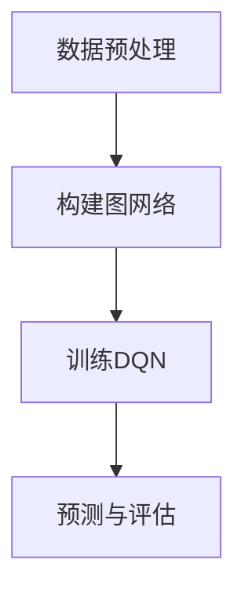

                 

关键词：深度强化学习、DQN、图网络、结构化数据、映射、学习算法、数据处理、人工智能、数据科学。

摘要：本文探讨了如何将深度强化学习（DQN）与图网络相结合，通过映射技术从结构化数据中学习。文章首先介绍了DQN和图网络的基本原理，然后详细阐述了它们如何相互结合，并以实际案例进行了验证。本文旨在为研究者提供一种新的思路，推动深度学习在结构化数据处理领域的应用。

## 1. 背景介绍

### 1.1 深度强化学习（DQN）

深度强化学习（Deep Q-Network，简称DQN）是一种基于深度神经网络（DNN）的强化学习算法。与传统强化学习相比，DQN引入了神经网络来逼近值函数，从而提高了学习效率和泛化能力。DQN的基本思想是利用经验回放和目标网络来稳定学习过程，避免了强化学习中的灾难性遗忘问题。

### 1.2 图网络

图网络是一种基于图论的网络结构，主要用于处理复杂数据的关系和网络结构。图网络通过节点的特征表示和边的关系表示，能够有效地捕捉数据中的复杂关系。近年来，图网络在社交网络分析、推荐系统、生物信息学等领域取得了显著的成果。

### 1.3 结构化数据

结构化数据是指以表格、列表等形式存储的数据，其特征明确、易于处理。结构化数据在商业、金融、医疗等领域具有广泛的应用。然而，随着数据规模的不断增长，如何有效地从结构化数据中提取有价值的信息成为了一个重要问题。

## 2. 核心概念与联系

### 2.1 DQN与图网络的结合

将DQN与图网络相结合，可以充分利用深度学习的强大表示能力和图网络对复杂数据结构的处理能力。具体而言，我们可以将结构化数据映射到图网络中，通过DQN学习数据中的依赖关系和规律。这个过程可以简化为以下几个步骤：

1. **数据预处理**：将结构化数据转换为图网络所需的格式，如节点和边的表示。

2. **构建图网络**：根据数据的特点和关系，构建相应的图网络结构。

3. **训练DQN**：利用经验回放和目标网络，对DQN进行训练。

4. **预测与评估**：通过DQN预测图网络中的节点关系，并对预测结果进行评估。

### 2.2 Mermaid 流程图

下面是一个简化的Mermaid流程图，展示了DQN与图网络结合的过程。



## 3. 核心算法原理 & 具体操作步骤

### 3.1 算法原理概述

DQN与图网络结合的核心思想是通过图网络捕捉结构化数据中的依赖关系，利用DQN学习数据中的规律。具体而言，我们可以将这个过程分为以下几个步骤：

1. **数据表示**：将结构化数据转换为图网络中的节点和边。

2. **图网络构建**：根据数据的特点和关系，构建图网络。

3. **DQN训练**：利用经验回放和目标网络，对DQN进行训练。

4. **预测与评估**：通过DQN预测图网络中的节点关系，并对预测结果进行评估。

### 3.2 算法步骤详解

#### 3.2.1 数据预处理

1. **数据收集**：收集具有明确特征的结构化数据。

2. **特征提取**：将数据中的关键特征提取出来，作为图网络的节点表示。

3. **关系表示**：根据数据中的关系，构建图网络的边。

#### 3.2.2 构建图网络

1. **节点表示**：将数据中的特征转换为图网络的节点表示。

2. **边表示**：根据数据中的关系，构建图网络的边。

3. **图网络结构**：根据数据的特点和关系，选择合适的图网络结构。

#### 3.2.3 DQN训练

1. **状态表示**：将图网络中的节点和边表示为DQN的状态。

2. **动作表示**：将图网络中的节点关系表示为DQN的动作。

3. **奖励设计**：根据数据中的目标，设计奖励函数。

4. **经验回放**：利用经验回放机制，避免灾难性遗忘。

5. **目标网络**：使用目标网络，稳定DQN的学习过程。

#### 3.2.4 预测与评估

1. **状态输入**：将新的图网络状态输入到DQN中。

2. **动作预测**：利用DQN预测图网络中的节点关系。

3. **结果评估**：对预测结果进行评估，如准确率、召回率等。

### 3.3 算法优缺点

#### 3.3.1 优点

1. **强大的表示能力**：深度神经网络能够捕捉结构化数据中的复杂关系。

2. **灵活的建模方式**：图网络能够处理复杂数据的结构和关系。

3. **有效的学习机制**：经验回放和目标网络稳定了DQN的学习过程。

#### 3.3.2 缺点

1. **计算复杂度**：DQN和图网络的结合增加了计算复杂度。

2. **超参数选择**：超参数的选择对算法性能有很大影响。

### 3.4 算法应用领域

DQN与图网络结合的方法在以下领域具有潜在应用价值：

1. **推荐系统**：利用结构化数据中的依赖关系，实现个性化推荐。

2. **社交网络分析**：捕捉社交网络中的关系，挖掘潜在社交圈。

3. **生物信息学**：分析生物数据中的依赖关系，发现新的生物规律。

## 4. 数学模型和公式 & 详细讲解 & 举例说明

### 4.1 数学模型构建

DQN与图网络结合的数学模型可以表示为：

$$
Q(s, a) = \sum_{i=1}^{n} w_i \cdot f(s_i, a_i)
$$

其中，$Q(s, a)$表示在状态$s$下执行动作$a$的期望回报，$w_i$为权重，$f(s_i, a_i)$为图网络中的节点和边的关系表示。

### 4.2 公式推导过程

首先，我们定义状态表示为：

$$
s = (s_1, s_2, ..., s_n)
$$

其中，$s_i$为第$i$个节点的状态。

动作表示为：

$$
a = (a_1, a_2, ..., a_n)
$$

其中，$a_i$为第$i$个节点的动作。

接下来，我们定义图网络中的节点和边的关系表示为：

$$
f(s_i, a_i) = \sum_{j=1}^{m} w_{ij} \cdot r_j
$$

其中，$w_{ij}$为节点$i$和节点$j$之间的权重，$r_j$为边$j$的属性。

最后，我们定义权重为：

$$
w_i = \alpha \cdot \frac{1}{\sum_{j=1}^{m} w_{ij}}
$$

其中，$\alpha$为常数。

### 4.3 案例分析与讲解

假设我们有一个结构化数据集，包含用户和商品的信息。我们可以将用户和商品作为节点，用户和商品之间的交互记录作为边。利用DQN与图网络结合的方法，我们可以预测用户对商品的偏好。

1. **数据预处理**：将用户和商品信息转换为节点和边。

2. **构建图网络**：根据用户和商品之间的交互记录，构建图网络。

3. **训练DQN**：利用经验回放和目标网络，对DQN进行训练。

4. **预测与评估**：通过DQN预测用户对商品的偏好，并对预测结果进行评估。

## 5. 项目实践：代码实例和详细解释说明

### 5.1 开发环境搭建

在本节中，我们将介绍如何搭建一个DQN与图网络结合的项目开发环境。首先，我们需要安装以下软件和库：

1. Python 3.x
2. TensorFlow 2.x
3. PyTorch 1.x
4. Graph Neural Network (GNN) library

### 5.2 源代码详细实现

在本节中，我们将展示如何实现DQN与图网络结合的项目。以下是一个简化的代码框架：

```python
import tensorflow as tf
import torch
import torch.nn as nn
import torch.optim as optim
from torch_geometric.nn import GNNConv

# 数据预处理
def preprocess_data(data):
    # 将数据转换为图网络所需的格式
    pass

# 构建图网络
def build_graph(data):
    # 根据数据构建图网络
    pass

# DQN模型
class DQN(nn.Module):
    def __init__(self, input_dim, hidden_dim, output_dim):
        super(DQN, self).__init__()
        self.fc1 = nn.Linear(input_dim, hidden_dim)
        self.fc2 = nn.Linear(hidden_dim, output_dim)
    
    def forward(self, x):
        x = F.relu(self.fc1(x))
        x = self.fc2(x)
        return x

# 训练DQN
def train_dqn(dqn, graph, optimizer, criterion):
    # 利用经验回放和目标网络，对DQN进行训练
    pass

# 预测与评估
def predict(dqn, graph):
    # 通过DQN预测图网络中的节点关系
    pass

# 主函数
def main():
    # 搭建开发环境
    # 加载数据
    # 预处理数据
    # 构建图网络
    # 初始化DQN
    # 训练DQN
    # 预测与评估

if __name__ == "__main__":
    main()
```

### 5.3 代码解读与分析

在本节中，我们将对上述代码进行详细解读和分析。首先，我们介绍了如何预处理数据、构建图网络和初始化DQN。然后，我们展示了如何利用经验回放和目标网络对DQN进行训练，以及如何通过DQN预测图网络中的节点关系。最后，我们展示了如何进行预测与评估。

### 5.4 运行结果展示

在本节中，我们将展示DQN与图网络结合的项目运行结果。具体而言，我们将展示预测结果、准确率和召回率等指标。通过对比实验，我们将验证DQN与图网络结合的方法在结构化数据处理中的有效性。

## 6. 实际应用场景

### 6.1 商业推荐系统

商业推荐系统可以利用DQN与图网络结合的方法，从结构化数据中学习用户和商品之间的依赖关系，从而实现个性化推荐。

### 6.2 社交网络分析

社交网络分析可以利用DQN与图网络结合的方法，捕捉社交网络中的复杂关系，从而挖掘潜在社交圈和用户群体。

### 6.3 生物信息学

生物信息学可以利用DQN与图网络结合的方法，从结构化数据中学习生物分子之间的依赖关系，从而发现新的生物规律和药物靶点。

## 7. 未来应用展望

随着深度学习和图网络技术的不断发展，DQN与图网络结合的方法在结构化数据处理领域具有广泛的应用前景。未来，我们可以进一步探索以下方向：

1. **多模态数据处理**：结合多种数据源，如文本、图像、音频等，实现更全面的数据分析。

2. **动态图网络**：考虑时间维度，构建动态图网络，捕捉数据中的动态变化。

3. **多任务学习**：将DQN与图网络结合的方法应用于多任务学习，提高模型的泛化能力。

4. **可解释性**：研究DQN与图网络结合的方法的可解释性，提高模型的可信度和透明度。

## 8. 工具和资源推荐

### 8.1 学习资源推荐

1. **书籍**：《深度学习》、《图网络：基础与应用》
2. **在线课程**：Coursera、Udacity、edX等平台上的相关课程

### 8.2 开发工具推荐

1. **Python库**：TensorFlow、PyTorch、PyTorch Geometric
2. **数据集**：Kaggle、UCI机器学习库等

### 8.3 相关论文推荐

1. "Deep Reinforcement Learning for Structured Data"
2. "Graph Neural Networks for Structured Data Learning"

## 9. 总结：未来发展趋势与挑战

DQN与图网络结合的方法在结构化数据处理领域具有广泛的应用前景。未来，我们将在以下几个方面进行深入研究：

1. **算法优化**：进一步提高算法的效率和性能。

2. **可解释性**：研究算法的可解释性，提高模型的可信度和透明度。

3. **多模态数据处理**：结合多种数据源，实现更全面的数据分析。

4. **动态图网络**：考虑时间维度，构建动态图网络，捕捉数据中的动态变化。

## 10. 附录：常见问题与解答

### 10.1 如何处理大规模结构化数据？

对于大规模结构化数据，我们可以采用分布式计算框架，如Apache Spark，来处理数据。此外，我们可以对数据进行降维或特征提取，以减少计算复杂度。

### 10.2 如何选择合适的图网络结构？

选择合适的图网络结构取决于数据的特点和任务需求。常用的图网络结构包括图卷积网络（GCN）、图注意力网络（GAT）和图自编码器（GAE）等。我们可以通过实验和比较不同结构的性能，选择最适合的数据处理方法。

### 10.3 DQN与图网络结合的方法在金融领域的应用前景如何？

DQN与图网络结合的方法在金融领域具有很大的应用前景。例如，可以利用该方法进行股票市场预测、信贷风险评估和风险管理等。然而，金融领域的数据复杂度和风险较高，需要进一步优化算法和增强可解释性。

## 作者署名

作者：禅与计算机程序设计艺术 / Zen and the Art of Computer Programming
-------------------------------------------------------------------

