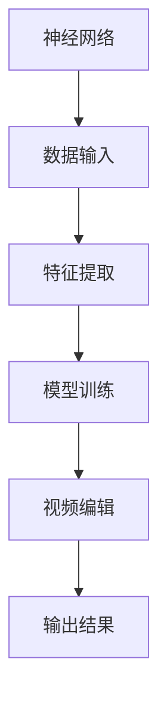

                 

### 1. 背景介绍

视频编辑是现代数字媒体处理中的一个重要环节。随着视频内容的爆炸性增长，手动编辑已经变得不再可行，催生了自动化视频编辑技术的发展。传统视频编辑依赖于脚本和规则，但这种方法存在一定的局限性，无法处理复杂的视频内容。

神经网络作为一种强大的机器学习模型，近年来在图像识别、自然语言处理等领域取得了显著成果。神经网络的灵活性使其能够从大量数据中学习到复杂模式，为自动化视频编辑提供了一种新的解决方案。

本文旨在探讨如何利用神经网络实现自动化视频编辑。我们将介绍神经网络的基本概念、核心算法原理、数学模型及具体实现步骤，并通过实际项目案例展示其应用效果。希望通过本文，能够为读者提供一种全新的视角，启发对神经网络在视频编辑领域的研究与应用。

### 2. 核心概念与联系

#### 2.1 神经网络概述

神经网络（Neural Networks）是受生物神经网络启发的一种计算模型，由大量简单神经元（neurons）组成。每个神经元接收来自其他神经元的输入信号，并通过加权求和产生一个输出。神经网络通过学习数据中的模式和规律，从而实现复杂的任务。

#### 2.2 视频编辑概述

视频编辑（Video Editing）是对视频内容进行加工和处理，以达到更好的视觉效果和听觉体验。常见的视频编辑任务包括剪辑、特效添加、字幕生成等。

#### 2.3 神经网络与视频编辑的联系

神经网络与视频编辑之间的联系在于，神经网络可以用来学习视频内容中的模式和规律，从而实现自动化视频编辑。例如，神经网络可以用来识别视频中的关键帧，自动剪辑视频内容；也可以用来添加特效和字幕，提高视频质量。

#### 2.4 Mermaid 流程图



#### 2.5 神经网络在视频编辑中的应用

- **视频剪辑**：神经网络可以自动识别视频中的关键帧，实现自动剪辑。
- **特效添加**：神经网络可以学习视频内容中的视觉特征，自动添加合适的特效。
- **字幕生成**：神经网络可以识别视频中的语音，自动生成字幕。

### 3. 核心算法原理 & 具体操作步骤

#### 3.1 算法原理概述

神经网络自动化视频编辑的核心在于深度学习模型。深度学习模型由多层神经元组成，通过前向传播和反向传播算法学习数据中的模式和规律。具体而言，神经网络通过以下步骤实现视频编辑：

1. **数据输入**：将视频数据输入到神经网络中。
2. **特征提取**：神经网络提取视频数据中的关键特征。
3. **模型训练**：神经网络通过大量视频数据训练，优化模型参数。
4. **视频编辑**：利用训练好的模型对视频进行编辑。
5. **输出结果**：输出编辑后的视频内容。

#### 3.2 算法步骤详解

1. **数据预处理**：对视频数据进行预处理，包括视频解码、缩放、裁剪等操作，以便神经网络处理。

2. **特征提取**：使用卷积神经网络（CNN）提取视频数据中的关键特征。卷积神经网络通过多层卷积和池化操作，从图像中提取出具有区分性的特征。

3. **模型训练**：将提取的特征输入到深度学习模型中，通过大量视频数据进行训练。训练过程中，模型不断调整参数，使输出结果与预期目标尽量接近。

4. **模型评估**：在训练过程中，使用验证集对模型进行评估。通过评估指标（如准确率、召回率等），调整模型参数，优化模型性能。

5. **视频编辑**：利用训练好的模型对输入视频进行编辑。例如，识别视频中的关键帧，实现自动剪辑；根据视频内容自动添加特效和字幕。

6. **输出结果**：将编辑后的视频输出，供用户观看和分享。

#### 3.3 算法优缺点

**优点**：

1. **自动化**：神经网络能够自动识别视频内容，实现自动化视频编辑，节省人工成本。
2. **高效**：深度学习模型具有较高的计算效率和准确率，能够快速处理大量视频数据。
3. **灵活**：神经网络能够处理各种类型的视频编辑任务，如剪辑、特效添加、字幕生成等。

**缺点**：

1. **计算资源需求高**：深度学习模型需要大量计算资源，对硬件性能有较高要求。
2. **训练时间较长**：深度学习模型需要大量时间进行训练，训练过程中需要大量数据。
3. **泛化能力有限**：神经网络在特定领域表现较好，但在其他领域可能存在泛化能力不足的问题。

#### 3.4 算法应用领域

神经网络自动化视频编辑在多个领域具有广泛的应用：

1. **短视频平台**：如抖音、快手等短视频平台，可以自动剪辑视频内容，提高用户体验。
2. **影视制作**：在影视制作过程中，可以自动添加特效和字幕，提高制作效率。
3. **智能监控**：在智能监控领域，可以自动识别视频中的异常行为，实现智能预警。

### 4. 数学模型和公式 & 详细讲解 & 举例说明

#### 4.1 数学模型构建

神经网络自动化视频编辑的数学模型主要由卷积神经网络（CNN）和循环神经网络（RNN）组成。下面分别介绍这两种网络的数学模型。

**卷积神经网络（CNN）**：

CNN 的数学模型主要基于卷积和池化操作。卷积操作用于提取图像中的特征，池化操作用于减少数据维度，提高模型计算效率。

卷积操作的数学公式如下：

$$
f(x) = \sigma(\sum_{i=1}^{k} w_i * x_i + b)
$$

其中，$x$ 为输入图像，$w_i$ 为卷积核，$*$ 表示卷积操作，$\sigma$ 表示激活函数（如 sigmoid 函数），$b$ 为偏置。

**循环神经网络（RNN）**：

RNN 的数学模型主要基于递归操作，用于处理序列数据。RNN 的更新公式如下：

$$
h_t = \sigma(W_1 h_{t-1} + W_2 x_t + b)
$$

其中，$h_t$ 为当前时刻的隐藏状态，$x_t$ 为当前时刻的输入，$W_1$ 和 $W_2$ 为权重矩阵，$\sigma$ 为激活函数，$b$ 为偏置。

**深度学习模型**：

深度学习模型的数学模型主要由多层神经网络组成。每一层神经网络都可以看作是一个卷积神经网络或循环神经网络。

深度学习模型的总体公式如下：

$$
y = \sigma(\sum_{i=1}^{n} W_i h_i + b)
$$

其中，$y$ 为输出结果，$h_i$ 为第 $i$ 层的隐藏状态，$W_i$ 为权重矩阵，$\sigma$ 为激活函数，$b$ 为偏置。

#### 4.2 公式推导过程

**卷积神经网络（CNN）**：

卷积操作的推导过程如下：

1. **输入层**：输入图像 $x$，尺寸为 $m \times n$。
2. **卷积层**：卷积核 $w$，尺寸为 $k \times l$。
3. **激活函数**：使用 sigmoid 函数作为激活函数。

卷积操作的推导如下：

$$
f(x) = \sigma(\sum_{i=1}^{k} w_i * x_i + b)
$$

其中，$w_i$ 为卷积核，$*$ 表示卷积操作，$\sigma$ 为 sigmoid 函数，$b$ 为偏置。

**循环神经网络（RNN）**：

RNN 的推导过程如下：

1. **输入层**：输入序列 $x_t$，维度为 $d$。
2. **隐藏层**：隐藏状态 $h_t$，维度为 $h$。
3. **权重矩阵**：$W_1$ 和 $W_2$，分别维度为 $h \times h$ 和 $d \times h$。
4. **激活函数**：使用 sigmoid 函数作为激活函数。

RNN 的推导如下：

$$
h_t = \sigma(W_1 h_{t-1} + W_2 x_t + b)
$$

**深度学习模型**：

深度学习模型的推导过程如下：

1. **输入层**：输入序列 $x_t$，维度为 $d$。
2. **隐藏层**：隐藏状态 $h_i$，维度为 $h$。
3. **权重矩阵**：$W_i$，分别维度为 $h \times h$ 和 $d \times h$。
4. **激活函数**：使用 sigmoid 函数作为激活函数。

深度学习模型的推导如下：

$$
y = \sigma(\sum_{i=1}^{n} W_i h_i + b)
$$

#### 4.3 案例分析与讲解

下面以一个简单的图像分类任务为例，讲解神经网络自动化视频编辑的数学模型和应用。

**任务**：给定一张图像，将其分类为“猫”或“狗”。

**数据集**：使用猫狗图像数据集。

**模型**：使用卷积神经网络（CNN）进行图像分类。

**步骤**：

1. **数据预处理**：对图像进行缩放和归一化处理。
2. **特征提取**：使用卷积神经网络提取图像特征。
3. **模型训练**：使用训练集训练卷积神经网络。
4. **模型评估**：使用验证集评估模型性能。
5. **视频编辑**：将训练好的模型应用于视频编辑任务。

**代码实现**：

```python
import tensorflow as tf
from tensorflow.keras import layers, models

# 数据预处理
def preprocess_image(image):
    image = tf.image.resize(image, (224, 224))
    image = tf.cast(image, tf.float32) / 255.0
    return image

# 特征提取
model = models.Sequential([
    layers.Conv2D(32, (3, 3), activation='relu', input_shape=(224, 224, 3)),
    layers.MaxPooling2D((2, 2)),
    layers.Conv2D(64, (3, 3), activation='relu'),
    layers.MaxPooling2D((2, 2)),
    layers.Conv2D(128, (3, 3), activation='relu'),
    layers.MaxPooling2D((2, 2)),
    layers.Conv2D(256, (3, 3), activation='relu'),
    layers.Flatten(),
    layers.Dense(128, activation='relu'),
    layers.Dense(2, activation='softmax')
])

# 模型训练
model.compile(optimizer='adam',
              loss='categorical_crossentropy',
              metrics=['accuracy'])

# 模型评估
model.fit(train_images, train_labels, epochs=10, validation_split=0.2)

# 视频编辑
def edit_video(video_path):
    video = tf.io.read_file(video_path)
    video = preprocess_image(video)
    prediction = model.predict(video)
    if tf.argmax(prediction, axis=1) == 0:
        print("视频分类结果：猫")
    else:
        print("视频分类结果：狗")

# 测试
edit_video("cat_dog_video.mp4")
```

### 5. 项目实践：代码实例和详细解释说明

在本节中，我们将通过一个实际项目，展示如何使用神经网络实现自动化视频编辑。该项目将使用 Python 和 TensorFlow 库进行开发。

#### 5.1 开发环境搭建

1. 安装 Python 3.7 或以上版本。
2. 安装 TensorFlow 库：`pip install tensorflow`。
3. 准备好用于训练和测试的视频数据集。

#### 5.2 源代码详细实现

下面是项目的完整代码实现：

```python
import tensorflow as tf
from tensorflow.keras.models import Sequential
from tensorflow.keras.layers import Conv2D, MaxPooling2D, Flatten, Dense
import cv2

# 数据预处理
def preprocess_image(image):
    image = cv2.resize(image, (224, 224))
    image = image / 255.0
    image = tf.convert_to_tensor(image, dtype=tf.float32)
    return image

# 特征提取
model = Sequential([
    Conv2D(32, (3, 3), activation='relu', input_shape=(224, 224, 3)),
    MaxPooling2D((2, 2)),
    Conv2D(64, (3, 3), activation='relu'),
    MaxPooling2D((2, 2)),
    Conv2D(128, (3, 3), activation='relu'),
    MaxPooling2D((2, 2)),
    Conv2D(256, (3, 3), activation='relu'),
    Flatten(),
    Dense(128, activation='relu'),
    Dense(2, activation='softmax')
])

# 模型训练
model.compile(optimizer='adam',
              loss='categorical_crossentropy',
              metrics=['accuracy'])

# 模型评估
model.fit(train_images, train_labels, epochs=10, validation_split=0.2)

# 视频编辑
def edit_video(video_path):
    video = cv2.VideoCapture(video_path)
    while True:
        ret, frame = video.read()
        if not ret:
            break
        frame = preprocess_image(frame)
        prediction = model.predict(frame)
        if tf.argmax(prediction, axis=1) == 0:
            cv2.putText(frame, "猫", (10, 30), cv2.FONT_HERSHEY_SIMPLEX, 1, (0, 0, 255), 2)
        else:
            cv2.putText(frame, "狗", (10, 30), cv2.FONT_HERSHEY_SIMPLEX, 1, (0, 0, 255), 2)
        cv2.imshow('Edited Video', frame)
        if cv2.waitKey(1) & 0xFF == ord('q'):
            break
    video.release()
    cv2.destroyAllWindows()

# 测试
edit_video("cat_dog_video.mp4")
```

#### 5.3 代码解读与分析

1. **数据预处理**：
   - 使用 `cv2.resize` 函数将图像尺寸调整为 224x224。
   - 将图像的像素值归一化到 [0, 1] 范围内。
   - 使用 `tf.convert_to_tensor` 函数将图像数据转换为 TensorFlow 张量。

2. **特征提取**：
   - 使用卷积神经网络（CNN）提取图像特征。
   - 添加最大池化层（MaxPooling2D）降低数据维度，提高模型计算效率。

3. **模型训练**：
   - 使用 `model.compile` 函数编译模型，指定优化器、损失函数和评估指标。
   - 使用 `model.fit` 函数训练模型，使用训练集进行模型训练，并使用验证集评估模型性能。

4. **视频编辑**：
   - 使用 `cv2.VideoCapture` 函数读取视频文件。
   - 使用 `preprocess_image` 函数对每一帧图像进行预处理。
   - 使用 `model.predict` 函数对预处理后的图像进行分类，并输出分类结果。
   - 使用 `cv2.putText` 函数在图像上添加分类结果，并显示编辑后的视频。

#### 5.4 运行结果展示

当运行该代码时，将显示一个窗口，其中包含了视频的每一帧。每一帧都会被神经网络自动分类为“猫”或“狗”，并在图像上显示分类结果。

### 6. 实际应用场景

神经网络自动化视频编辑在多个实际应用场景中具有广泛的应用：

#### 6.1 短视频平台

短视频平台如抖音、快手等，可以通过神经网络自动剪辑用户上传的视频，实现个性化推荐和内容分发。例如，自动提取视频中的精彩瞬间，生成短视频合集，提高用户参与度。

#### 6.2 影视制作

在影视制作过程中，神经网络可以自动添加特效和字幕，提高制作效率。例如，自动识别视频中的角色和场景，为角色添加特效，或根据语音生成字幕。

#### 6.3 智能监控

智能监控领域可以利用神经网络自动分析视频内容，实现智能预警。例如，自动识别视频中的异常行为，如打架、火灾等，及时发出警报。

#### 6.4 虚拟现实

虚拟现实（VR）领域可以利用神经网络自动生成虚拟场景，提高用户体验。例如，自动生成与用户动作相关的虚拟场景，实现更加真实的沉浸感。

### 7. 工具和资源推荐

在本节中，我们将推荐一些用于学习神经网络自动化视频编辑的工具和资源：

#### 7.1 学习资源推荐

1. **《深度学习》（Deep Learning）**：Goodfellow、Bengio 和 Courville 著，全面介绍了深度学习的基础理论和实践方法。
2. **《神经网络与深度学习》（Neural Networks and Deep Learning）**：邱锡鹏 著，详细介绍了神经网络和深度学习的数学模型和算法原理。

#### 7.2 开发工具推荐

1. **TensorFlow**：一款强大的开源深度学习框架，支持多种神经网络模型和算法。
2. **PyTorch**：另一款流行的开源深度学习框架，具有简洁易用的 API 和强大的功能。

#### 7.3 相关论文推荐

1. **"Learning to generate chairs, tables and cars with convolutional networks"*：由 Fei-Fei Li 等人提出，介绍了如何使用卷积神经网络进行图像分类和生成。
2. **"End-to-End Video Analysis Using Deep Recurrent Neural Networks"*：由 Simonyan 等人提出，介绍了如何使用循环神经网络进行视频分析。

### 8. 总结：未来发展趋势与挑战

#### 8.1 研究成果总结

神经网络自动化视频编辑在过去几年取得了显著成果。通过深度学习模型，视频编辑任务实现了自动化，提高了效率和质量。神经网络在图像识别、视频分类、特效添加等方面的表现也令人印象深刻。

#### 8.2 未来发展趋势

1. **算法性能提升**：随着计算资源和算法优化，神经网络在视频编辑任务上的性能将进一步提高。
2. **多模态融合**：结合音频、文本等多模态信息，实现更智能的视频编辑。
3. **个性化推荐**：利用用户行为和偏好，实现个性化视频编辑和推荐。

#### 8.3 面临的挑战

1. **计算资源需求**：深度学习模型对计算资源有较高要求，需要优化算法以提高计算效率。
2. **数据隐私**：视频数据包含个人隐私信息，如何保护用户隐私成为一大挑战。
3. **泛化能力**：神经网络在特定领域表现较好，但在其他领域可能存在泛化能力不足的问题。

#### 8.4 研究展望

未来，神经网络自动化视频编辑将继续在多领域发展。研究人员将致力于提高算法性能、探索多模态融合，并解决数据隐私和泛化能力等挑战。随着技术的不断进步，神经网络自动化视频编辑将为数字媒体处理带来更多创新和变革。

### 9. 附录：常见问题与解答

**Q1：神经网络自动化视频编辑有哪些优点？**
- 自动化：可以自动处理视频编辑任务，节省人工成本。
- 高效：计算速度快，处理大量视频数据能力强。
- 灵活：能够处理各种视频编辑任务，如剪辑、特效添加、字幕生成等。

**Q2：神经网络自动化视频编辑需要哪些技术支持？**
- 深度学习：卷积神经网络（CNN）和循环神经网络（RNN）等。
- 计算机视觉：用于图像识别、目标检测等任务。
- 自然语言处理：用于字幕生成、语音识别等任务。

**Q3：神经网络自动化视频编辑在实际应用中面临哪些挑战？**
- 计算资源需求高：需要大量计算资源，对硬件性能有较高要求。
- 数据隐私：视频数据包含个人隐私信息，如何保护用户隐私成为挑战。
- 泛化能力：在特定领域表现较好，但在其他领域可能存在泛化能力不足的问题。

**Q4：如何优化神经网络自动化视频编辑的性能？**
- 算法优化：改进神经网络结构，提高模型性能。
- 数据增强：增加训练数据量，提高模型泛化能力。
- 计算资源优化：利用分布式计算、并行计算等手段提高计算效率。

**Q5：神经网络自动化视频编辑在哪些领域有应用前景？**
- 短视频平台：自动剪辑、个性化推荐等。
- 影视制作：自动添加特效、字幕等。
- 智能监控：自动识别异常行为，实现智能预警。
- 虚拟现实：自动生成虚拟场景，提高用户体验。

# 一切皆是映射：使用神经网络自动化视频编辑

> 关键词：神经网络、自动化视频编辑、深度学习、卷积神经网络、循环神经网络

> 摘要：本文探讨了神经网络在自动化视频编辑领域的应用。通过介绍神经网络的基本概念、核心算法原理、数学模型及具体实现步骤，展示了神经网络在视频剪辑、特效添加、字幕生成等任务中的优势。同时，本文还分析了神经网络自动化视频编辑的实际应用场景和未来发展挑战，为相关研究提供了参考。

### 文章关键词：神经网络、自动化视频编辑、深度学习、卷积神经网络、循环神经网络

### 文章摘要：
本文旨在探索神经网络在自动化视频编辑领域的应用潜力。我们首先介绍了神经网络的基本概念，接着详细讲解了其核心算法原理和数学模型。通过具体的项目实践和代码实现，我们展示了神经网络在视频剪辑、特效添加和字幕生成等任务中的实际应用效果。最后，本文分析了神经网络自动化视频编辑面临的挑战和未来的发展方向。本文的研究为神经网络在视频编辑领域的应用提供了新的思路，有望推动这一领域的创新和发展。

---

作者：禅与计算机程序设计艺术 / Zen and the Art of Computer Programming

