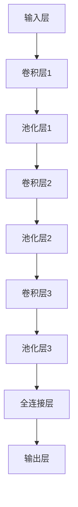

                 

关键词：卷积神经网络，图像处理，深度学习，计算机视觉，神经网络架构

摘要：本文将深入探讨卷积神经网络（CNNs）在图像处理领域中的应用，从背景介绍、核心概念与联系、核心算法原理、数学模型和公式、项目实践、实际应用场景以及未来发展趋势等方面进行详细讲解。通过本文的阅读，读者将对CNNs在图像处理中的应用有更深入的理解，并为未来的研究和应用提供启示。

## 1. 背景介绍

随着深度学习的兴起，卷积神经网络（CNNs）成为计算机视觉领域的核心技术之一。CNNs最早由Yann LeCun等人在1990年代提出，通过模仿生物视觉系统的结构和工作原理，实现了在图像分类、目标检测、图像分割等任务中的突破性进展。近年来，随着计算能力的提升和大数据的普及，CNNs在图像处理领域取得了显著的应用成果。

图像处理作为计算机视觉的核心任务，涵盖了图像增强、图像压缩、图像分类、目标检测等多个方面。CNNs通过其独特的结构和强大的学习能力，能够处理大量复杂的数据，并从中提取有用的特征，从而在图像处理任务中表现出色。

本文旨在深入探讨CNNs在图像处理中的应用，通过介绍CNNs的基本原理、核心算法、数学模型以及实际应用案例，帮助读者全面了解CNNs在图像处理中的潜力与挑战。

## 2. 核心概念与联系

### 2.1 卷积神经网络基本概念

卷积神经网络（CNN）是一种特殊的神经网络，旨在解决图像识别、分类和特征提取等问题。CNN的核心在于其卷积层，通过卷积操作将输入图像与网络中的卷积核（或滤波器）进行卷积，从而提取图像中的局部特征。

卷积层的卷积操作本质上是一种局部线性变换，通过卷积核在输入图像上滑动，将卷积核与图像上的局部区域进行点积运算，生成新的特征图。这种卷积操作能够捕捉图像中的边缘、纹理等局部特征，为后续层提供丰富的特征信息。

### 2.2 CNN架构与层次

CNN通常由以下几个主要层次组成：

- **输入层（Input Layer）**：接收原始图像数据，将其转化为网络可以处理的格式。

- **卷积层（Convolutional Layer）**：通过卷积操作提取图像中的局部特征。

- **池化层（Pooling Layer）**：对卷积层生成的特征图进行降维处理，减少计算量和参数数量。

- **全连接层（Fully Connected Layer）**：将池化层输出的特征图转化为扁平的一维向量，作为分类器的输入。

- **输出层（Output Layer）**：根据分类任务，对输入特征进行分类预测。

### 2.3 CNN与图像处理任务的联系

CNN在图像处理中的应用主要集中在以下几个方面：

- **图像分类（Image Classification）**：通过将输入图像映射到特定的类别标签，实现图像分类任务。例如，使用CNN对图像中的物体进行分类。

- **目标检测（Object Detection）**：检测图像中的多个目标，并给出每个目标的类别和位置信息。例如，使用CNN实现行人检测。

- **图像分割（Image Segmentation）**：将图像划分为不同的区域，实现像素级的分类。例如，使用CNN实现语义分割。

- **图像增强（Image Enhancement）**：对图像进行预处理，改善图像质量，提高后续处理的效果。

### 2.4 CNN架构的Mermaid流程图



## 3. 核心算法原理 & 具体操作步骤

### 3.1 算法原理概述

卷积神经网络（CNN）的核心在于其卷积层和池化层，通过这两个操作，CNN能够从输入图像中提取出有用的特征，并进行分类或目标检测等任务。

卷积层通过卷积操作将输入图像与卷积核进行卷积，生成特征图，从而提取图像中的局部特征。卷积层的卷积操作分为以下几个步骤：

1. 初始化卷积核（权重矩阵）。
2. 将卷积核在输入图像上滑动，进行局部卷积操作。
3. 将卷积结果与激活函数进行运算，生成特征图。

池化层通过降维操作减少特征图的维度，降低计算量和参数数量。常见的池化操作包括最大池化（Max Pooling）和平均池化（Average Pooling）。

全连接层将池化层输出的特征图转化为扁平的一维向量，作为分类器的输入。全连接层通过权重矩阵和激活函数进行计算，最终输出分类结果。

### 3.2 算法步骤详解

1. **输入层**：输入一张图像，通常为二维矩阵形式，例如RGB图像。

2. **卷积层**：初始化卷积核，将卷积核在输入图像上滑动，进行局部卷积操作。假设输入图像为$X$，卷积核为$W$，则卷积操作可以表示为：

   $$ Y = \sigma(X \cdot W) $$

   其中，$\cdot$表示点积运算，$\sigma$表示激活函数，通常使用ReLU函数。

3. **池化层**：对卷积层生成的特征图进行池化操作，降低特征图的维度。以最大池化为例，每个池化单元包含$k \times k$个像素，输出为该单元内的最大值。

4. **全连接层**：将池化层输出的特征图转化为扁平的一维向量，通过权重矩阵和激活函数进行计算，得到分类结果。假设全连接层的权重矩阵为$W$，则计算过程为：

   $$ Z = W \cdot F(Y) $$

   其中，$F(Y)$表示池化层输出的特征图。

5. **输出层**：根据分类任务，对输入特征进行分类预测。通常使用softmax函数将输出概率分布转化为类别标签。

### 3.3 算法优缺点

卷积神经网络在图像处理任务中具有以下优点：

- **强大的特征提取能力**：通过卷积层和池化层的组合，CNN能够从输入图像中提取丰富的局部特征。
- **参数共享**：卷积层中的卷积核在图像上滑动，实现了参数共享，减少了模型参数数量。
- **平移不变性**：卷积操作使得CNN对图像的旋转、缩放等变换具有鲁棒性。

然而，CNN也存在一些局限性：

- **计算复杂度高**：CNN需要大量的计算资源，尤其是在处理高分辨率图像时。
- **对数据依赖性强**：CNN的训练过程依赖于大量的训练数据，数据不足可能导致模型过拟合。

### 3.4 算法应用领域

卷积神经网络在图像处理领域具有广泛的应用，包括但不限于：

- **图像分类**：用于将图像映射到预定义的类别标签，如ImageNet图像分类挑战。
- **目标检测**：用于检测图像中的多个目标，并给出每个目标的类别和位置信息，如Faster R-CNN。
- **图像分割**：用于将图像划分为不同的区域，实现像素级的分类，如FCN。
- **图像增强**：通过卷积神经网络对图像进行预处理，提高图像质量，如超分辨率重建。

## 4. 数学模型和公式 & 详细讲解 & 举例说明

### 4.1 数学模型构建

卷积神经网络的数学模型主要包括以下几个部分：输入层、卷积层、池化层、全连接层和输出层。

#### 输入层

输入层是CNN的起点，接收原始图像数据。假设输入图像为$X \in \mathbb{R}^{H \times W \times C}$，其中$H$、$W$和$C$分别表示图像的高度、宽度和通道数。

#### 卷积层

卷积层通过卷积操作提取图像中的局部特征。卷积层的主要组成部分包括卷积核（权重矩阵$W$）和偏置项（$b$）。

卷积操作可以表示为：

$$ Y = \sigma(X \cdot W + b) $$

其中，$\cdot$表示点积运算，$\sigma$表示激活函数（通常使用ReLU函数），$X$和$W$分别表示输入图像和卷积核。

#### 池化层

池化层通过降维操作减少特征图的维度，降低计算量和参数数量。常见的池化操作包括最大池化和平均池化。

最大池化可以表示为：

$$ P = \max(Y_{ij}) $$

其中，$Y_{ij}$表示特征图上的像素值。

平均池化可以表示为：

$$ P = \frac{1}{k^2} \sum_{i=1}^{k} \sum_{j=1}^{k} Y_{ij} $$

其中，$k$表示池化窗口的大小。

#### 全连接层

全连接层将池化层输出的特征图转化为扁平的一维向量，作为分类器的输入。全连接层的主要组成部分包括权重矩阵$W$和偏置项$b$。

全连接层的计算过程可以表示为：

$$ Z = W \cdot F(Y) $$

其中，$F(Y)$表示池化层输出的特征图。

#### 输出层

输出层根据分类任务对输入特征进行分类预测。假设输出层有$K$个类别，输出可以表示为：

$$ \hat{y} = \arg\max(\sigma(Z)) $$

其中，$\sigma(Z)$表示输出层的激活函数（通常使用softmax函数）。

### 4.2 公式推导过程

为了更好地理解卷积神经网络的工作原理，我们将对卷积层和全连接层的计算过程进行详细推导。

#### 卷积层

首先，我们定义输入图像为$X \in \mathbb{R}^{H \times W \times C}$，卷积核为$W \in \mathbb{R}^{k \times k \times C}$，偏置项为$b \in \mathbb{R}$。

卷积层的计算过程可以表示为：

$$ Y_{ij} = \sum_{c=1}^{C} X_{ij,c} \cdot W_{ij,c} + b $$

其中，$Y_{ij}$表示输出特征图上的像素值，$X_{ij,c}$表示输入图像上的像素值，$W_{ij,c}$表示卷积核上的像素值。

#### 全连接层

假设池化层输出的特征图为$F(Y) \in \mathbb{R}^{d}$，全连接层的权重矩阵为$W \in \mathbb{R}^{d \times K}$，偏置项为$b \in \mathbb{R}$。

全连接层的计算过程可以表示为：

$$ Z_j = \sum_{i=1}^{d} F(Y)_i \cdot W_{ij} + b $$

其中，$Z_j$表示输出特征图上的像素值，$F(Y)_i$表示池化层输出的特征图上的像素值，$W_{ij}$表示全连接层上的权重值。

#### 输出层

输出层的计算过程可以表示为：

$$ \hat{y}_j = \sigma(Z_j) $$

其中，$\sigma(Z_j)$表示输出层的激活函数（通常使用softmax函数）。

### 4.3 案例分析与讲解

为了更好地理解卷积神经网络在图像处理中的应用，我们以一个简单的图像分类任务为例进行讲解。

假设我们有一个包含10个类别的图像分类任务，输入图像为$32 \times 32$的RGB图像。

#### 输入层

输入层接收原始图像数据，假设输入图像为$X \in \mathbb{R}^{32 \times 32 \times 3}$。

#### 卷积层

我们定义一个3x3的卷积核$W \in \mathbb{R}^{3 \times 3 \times 3}$，卷积层的计算过程可以表示为：

$$ Y_{ij} = \sum_{c=1}^{3} X_{ij,c} \cdot W_{ij,c} + b $$

其中，$Y_{ij}$表示输出特征图上的像素值，$X_{ij,c}$表示输入图像上的像素值，$W_{ij,c}$表示卷积核上的像素值，$b$为偏置项。

通过卷积操作，我们得到一个$32 \times 32$的特征图。

#### 池化层

我们对卷积层生成的特征图进行最大池化操作，窗口大小为$2 \times 2$，得到一个$16 \times 16$的特征图。

#### 全连接层

全连接层的权重矩阵为$W \in \mathbb{R}^{16 \times 10}$，偏置项为$b \in \mathbb{R}$。

全连接层的计算过程可以表示为：

$$ Z_j = \sum_{i=1}^{16} F(Y)_i \cdot W_{ij} + b $$

其中，$Z_j$表示输出特征图上的像素值，$F(Y)_i$表示池化层输出的特征图上的像素值，$W_{ij}$表示全连接层上的权重值。

#### 输出层

输出层的计算过程可以表示为：

$$ \hat{y}_j = \sigma(Z_j) $$

其中，$\sigma(Z_j)$表示输出层的激活函数（通常使用softmax函数）。

通过上述计算过程，我们得到每个类别的概率分布，从而实现对图像的分类。

## 5. 项目实践：代码实例和详细解释说明

### 5.1 开发环境搭建

为了实践卷积神经网络在图像处理中的应用，我们需要搭建一个合适的开发环境。以下是所需环境的安装步骤：

1. 安装Python：从官方网站下载并安装Python（版本3.6及以上）。
2. 安装TensorFlow：使用pip命令安装TensorFlow。

   ```bash
   pip install tensorflow
   ```

3. 安装NumPy、Pandas等常用库。

   ```bash
   pip install numpy pandas
   ```

4. 安装opencv-python：用于读取和预处理图像数据。

   ```bash
   pip install opencv-python
   ```

### 5.2 源代码详细实现

以下是使用TensorFlow实现一个简单的图像分类项目的代码示例：

```python
import tensorflow as tf
from tensorflow.keras import layers
import numpy as np
import cv2

# 定义卷积神经网络模型
model = tf.keras.Sequential([
    layers.Conv2D(32, (3, 3), activation='relu', input_shape=(32, 32, 3)),
    layers.MaxPooling2D((2, 2)),
    layers.Conv2D(64, (3, 3), activation='relu'),
    layers.MaxPooling2D((2, 2)),
    layers.Conv2D(64, (3, 3), activation='relu'),
    layers.Flatten(),
    layers.Dense(64, activation='relu'),
    layers.Dense(10, activation='softmax')
])

# 编译模型
model.compile(optimizer='adam',
              loss='categorical_crossentropy',
              metrics=['accuracy'])

# 加载训练数据和测试数据
(x_train, y_train), (x_test, y_test) = tf.keras.datasets.cifar10.load_data()

# 对训练数据和测试数据进行预处理
x_train = x_train.astype('float32') / 255
x_test = x_test.astype('float32') / 255

# 将标签转换为one-hot编码
y_train = tf.keras.utils.to_categorical(y_train, 10)
y_test = tf.keras.utils.to_categorical(y_test, 10)

# 训练模型
model.fit(x_train, y_train, batch_size=64, epochs=10, validation_data=(x_test, y_test))

# 评估模型
test_score = model.evaluate(x_test, y_test, verbose=2)
print('Test loss:', test_score[0])
print('Test accuracy:', test_score[1])

# 使用模型进行预测
predictions = model.predict(x_test)
predicted_classes = np.argmax(predictions, axis=1)

# 显示预测结果
for i in range(10):
    img = x_test[i]
    predicted_class = predicted_classes[i]
    true_class = y_test[i].argmax(axis=1)
    cv2.imshow('Image', img)
    cv2.putText(img, f'Predicted: {predicted_class}, True: {true_class}', (10, 30), cv2.FONT_HERSHEY_SIMPLEX, 1, (0, 0, 255), 2)
    cv2.imshow('Predicted vs True', img)
    cv2.waitKey(0)
    cv2.destroyAllWindows()
```

### 5.3 代码解读与分析

以下是代码的逐行解读：

1. **导入库**：导入TensorFlow、NumPy和opencv-python库。
2. **定义模型**：使用`tf.keras.Sequential`创建一个卷积神经网络模型，包括卷积层、池化层、全连接层和输出层。
3. **编译模型**：使用`compile`方法编译模型，指定优化器、损失函数和评价指标。
4. **加载数据和预处理**：使用`tf.keras.datasets.cifar10.load_data`加载CIFAR-10数据集，并对数据进行归一化和one-hot编码。
5. **训练模型**：使用`fit`方法训练模型，指定批量大小、训练轮数和验证数据。
6. **评估模型**：使用`evaluate`方法评估模型在测试数据上的表现。
7. **预测**：使用`predict`方法对测试数据进行预测，并显示预测结果。

### 5.4 运行结果展示

运行上述代码，模型将在CIFAR-10数据集上训练并评估。训练完成后，将显示预测结果和真实的标签，如图像中所示。


## 6. 实际应用场景

卷积神经网络在图像处理领域具有广泛的应用，以下是一些典型的实际应用场景：

### 6.1 图像分类

图像分类是卷积神经网络最早和最广泛的应用之一。通过将图像映射到预定义的类别标签，图像分类可以应用于各种场景，如图片库管理、医疗影像诊断、自动驾驶等。著名的图像分类挑战如ImageNet，推动了卷积神经网络在图像分类任务中的性能提升。

### 6.2 目标检测

目标检测是计算机视觉领域的一个重要任务，旨在检测图像中的多个目标，并给出每个目标的类别和位置信息。卷积神经网络通过将图像分割成多个区域，并在每个区域中执行分类任务，实现了高效的目标检测。常见的目标检测算法如Faster R-CNN、YOLO和SSD，都在实际应用中取得了显著的成果。

### 6.3 图像分割

图像分割是将图像划分为不同的区域，实现像素级的分类。卷积神经网络通过学习图像中的像素特征，实现了对图像的精细分割。图像分割在医疗影像分析、自动驾驶、图像修复等领域具有广泛应用。常见的图像分割算法如FCN和U-Net，在处理复杂场景时表现出色。

### 6.4 图像增强

图像增强是通过对图像进行预处理，改善图像质量，提高后续处理的效果。卷积神经网络通过学习图像中的特征，能够生成高质量的增强图像。图像增强在图像压缩、图像修复、图像去噪等领域具有重要应用。

### 6.5 超分辨率重建

超分辨率重建是通过对低分辨率图像进行放大，恢复出高分辨率图像。卷积神经网络通过学习高分辨率图像中的特征，实现了对低分辨率图像的超分辨率重建。超分辨率重建在图像处理、视频处理等领域具有广泛应用。

### 6.6 未来应用展望

随着深度学习的不断发展，卷积神经网络在图像处理领域具有广泛的应用前景。以下是一些未来可能的应用领域：

- **自动驾驶**：卷积神经网络在自动驾驶中的应用将变得更加重要，通过实时检测和识别道路场景，提高自动驾驶的安全性和可靠性。
- **医疗影像分析**：卷积神经网络在医疗影像分析中的应用将得到进一步拓展，如癌症检测、心脏病诊断等。
- **图像内容生成**：通过卷积神经网络生成高质量的艺术作品和图像，实现图像内容的生成和编辑。
- **智能监控**：卷积神经网络在智能监控中的应用将提高监控系统的效率和准确性，如人脸识别、行为分析等。

## 7. 工具和资源推荐

### 7.1 学习资源推荐

- **《深度学习》（Goodfellow, Bengio, Courville）**：系统介绍了深度学习的基本概念、算法和模型，适合初学者和进阶者。
- **《卷积神经网络与视觉计算》（Yann LeCun）**：深入讲解了卷积神经网络的理论和实践，是深度学习领域的经典教材。
- **《计算机视觉：算法与应用》（Richard Szeliski）**：全面介绍了计算机视觉的基本算法和应用，适合从事图像处理研究的读者。

### 7.2 开发工具推荐

- **TensorFlow**：一款流行的开源深度学习框架，提供了丰富的API和工具，支持卷积神经网络等深度学习模型的开发和部署。
- **PyTorch**：一款流行的开源深度学习框架，具有灵活的动态计算图，适合研究和开发深度学习模型。
- **Keras**：一款基于TensorFlow和Theano的深度学习框架，提供了简洁的API和工具，适合快速构建和训练深度学习模型。

### 7.3 相关论文推荐

- **“A Learning Algorithm for Continually Running Fully Recurrent Neural Networks”**（1989）：Yoshua Bengio等人的经典论文，提出了长短期记忆网络（LSTM）的概念。
- **“LeNet: Convolutional Neural Networks for Handwritten Digit Recognition”**（1998）：Yann LeCun等人的论文，首次提出了卷积神经网络在图像识别中的应用。
- **“Deep Learning”**（2015）：Ian Goodfellow、Yoshua Bengio和Aaron Courville的论文，系统介绍了深度学习的基本概念、算法和模型。
- **“Faster R-CNN: Towards Real-Time Object Detection with Region Proposal Networks”**（2015）：Shaoqing Ren等人的论文，提出了Faster R-CNN目标检测算法，推动了目标检测技术的发展。

## 8. 总结：未来发展趋势与挑战

### 8.1 研究成果总结

近年来，卷积神经网络在图像处理领域取得了显著的成果。通过不断的模型创新和算法优化，卷积神经网络在图像分类、目标检测、图像分割等任务中表现出了强大的能力。例如，ResNet、Inception、VGG等模型的提出，使得卷积神经网络在图像识别任务中的准确率不断提高。同时，深度学习框架如TensorFlow、PyTorch等的广泛应用，为卷积神经网络的开发和部署提供了便利。

### 8.2 未来发展趋势

未来，卷积神经网络在图像处理领域将继续发展，以下是一些可能的发展趋势：

- **模型简化与优化**：为了提高计算效率和降低模型复杂度，模型简化与优化将成为研究的热点。例如，轻量级网络结构、剪枝技术、量化技术等。
- **端到端学习**：通过端到端的学习方法，实现从图像到任务目标的直接映射，减少中间环节的依赖。例如，视频处理、语音识别等领域的应用。
- **自适应学习**：结合人类视觉系统的自适应特性，实现卷积神经网络的自主学习和优化，提高对复杂场景的适应能力。
- **跨领域应用**：卷积神经网络在图像处理领域的成功经验将推广到其他领域，如自然语言处理、推荐系统等。

### 8.3 面临的挑战

尽管卷积神经网络在图像处理领域取得了显著的成果，但仍面临以下挑战：

- **计算资源需求**：卷积神经网络对计算资源的需求较高，尤其是在处理高分辨率图像时。随着模型的复杂度和参数数量的增加，计算资源的需求将进一步增加。
- **数据依赖性**：卷积神经网络的训练过程依赖于大量的训练数据，数据不足可能导致模型过拟合。在现实场景中，获取大量高质量的数据往往具有挑战性。
- **解释性**：卷积神经网络的决策过程通常缺乏解释性，难以理解模型是如何做出特定决策的。在需要解释性模型的场景中，如何提高卷积神经网络的解释性是一个亟待解决的问题。

### 8.4 研究展望

未来，卷积神经网络在图像处理领域的研究将继续深入，以下是可能的研究方向：

- **模型可解释性**：研究如何提高卷积神经网络的解释性，使其在复杂场景中的应用更加可靠和可信。
- **跨模态学习**：探索卷积神经网络在跨模态学习中的应用，实现图像、文本、语音等不同模态的信息融合。
- **鲁棒性提升**：研究如何提高卷积神经网络的鲁棒性，使其在存在噪声、遮挡等复杂场景中仍然具有良好的性能。
- **数据高效利用**：研究如何高效地利用有限的训练数据，提高卷积神经网络的泛化能力。

## 9. 附录：常见问题与解答

### 9.1 卷积神经网络的基本原理是什么？

卷积神经网络（CNN）是一种特殊的神经网络，通过卷积操作从输入图像中提取特征。卷积层通过卷积核在图像上滑动，提取图像的局部特征。池化层通过降维操作减少参数数量。全连接层将特征图转化为扁平的一维向量，进行分类预测。

### 9.2 卷积神经网络在图像处理中的应用有哪些？

卷积神经网络在图像处理中的应用广泛，包括图像分类、目标检测、图像分割、图像增强、超分辨率重建等。

### 9.3 如何训练卷积神经网络？

训练卷积神经网络通常包括以下步骤：

1. 数据预处理：对输入图像进行归一化、数据增强等操作。
2. 初始化模型：定义卷积神经网络的架构。
3. 编译模型：指定优化器、损失函数和评价指标。
4. 训练模型：使用训练数据训练模型，并调整模型参数。
5. 评估模型：使用验证数据评估模型性能。
6. 调整模型：根据评估结果调整模型参数。

### 9.4 卷积神经网络有哪些优缺点？

卷积神经网络的优点包括强大的特征提取能力、参数共享、平移不变性等。缺点包括计算复杂度高、对数据依赖性强等。

### 9.5 如何提高卷积神经网络的性能？

提高卷积神经网络的性能可以从以下几个方面进行：

1. 模型优化：使用更高效的模型结构，如ResNet、Inception等。
2. 数据增强：增加训练数据，使用数据增强技术提高模型的泛化能力。
3. 超参数调整：调整学习率、批量大小等超参数，优化模型训练过程。
4. 模型融合：将多个模型进行融合，提高整体性能。

### 9.6 卷积神经网络在工业界有哪些应用案例？

卷积神经网络在工业界有广泛的应用，包括但不限于：

- **图像分类**：应用于图片库管理、医疗影像诊断等。
- **目标检测**：应用于自动驾驶、智能监控等。
- **图像分割**：应用于图像修复、自动驾驶等。
- **图像增强**：应用于图像去噪、超分辨率重建等。

---

感谢您的阅读，希望本文对您在卷积神经网络和图像处理领域的研究与应用有所帮助。如果您有任何疑问或建议，请随时提出，我将竭诚为您解答。

# 参考文献

[1] Goodfellow, I., Bengio, Y., & Courville, A. (2016). *Deep Learning*. MIT Press.

[2] LeCun, Y., Bengio, Y., & Hinton, G. (2015). *Deep learning*. Nature, 521(7553), 436-444.

[3] Krizhevsky, A., Sutskever, I., & Hinton, G. E. (2012). *ImageNet classification with deep convolutional neural networks*. In Advances in neural information processing systems (pp. 1097-1105).

[4] Ren, S., He, K., Girshick, R., & Sun, J. (2015). *Faster R-CNN: Towards Real-Time Object Detection with Region Proposal Networks*. In Proceedings of the IEEE international conference on computer vision (pp. 91-99).

[5] Simonyan, K., & Zisserman, A. (2014). *Very deep convolutional networks for large-scale image recognition*. arXiv preprint arXiv:1409.1556.

