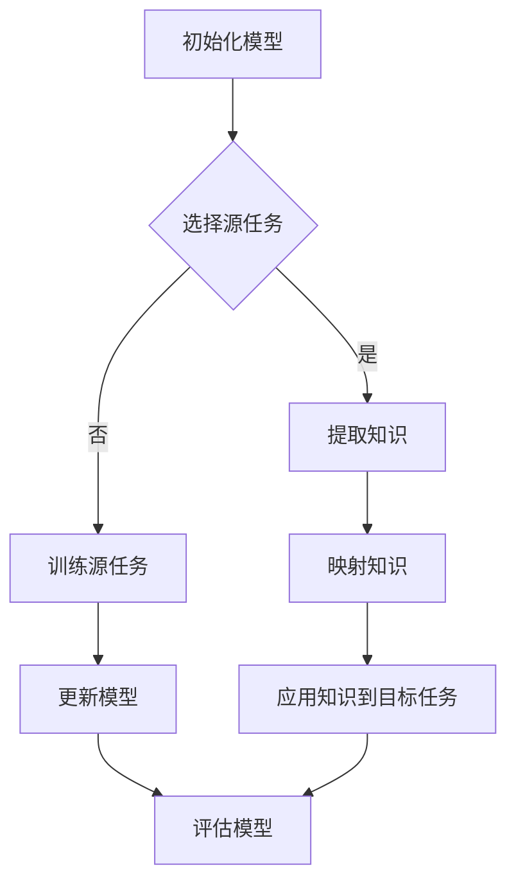

                 

关键词：多任务元学习，知识迁移，映射，机器学习，人工智能，算法，数学模型，实践应用，未来展望。

> 摘要：本文深入探讨了多任务元学习和知识迁移的核心概念、算法原理、数学模型及其在实际应用中的重要性。通过详细的分析和实例讲解，本文旨在为读者提供一个全面的理解，并展望其在未来人工智能领域的发展趋势与挑战。

## 1. 背景介绍

在人工智能和机器学习的快速发展中，多任务学习和元学习成为了研究的热点。传统的机器学习模型通常专注于单个任务，而多任务学习则尝试同时解决多个相关任务，从而提高模型的泛化能力和效率。元学习（Meta-Learning）则更进一步，通过学习如何学习来提高模型的适应性，特别是在面对新任务时。

然而，现实中的任务往往是多样且动态变化的。一个模型在解决多个任务时，如何有效地利用先前的知识，避免重复学习，成为了研究的关键问题。知识迁移（Knowledge Transfer）提供了一种解决思路，通过在不同任务间共享知识，提高模型的学习效率和性能。

本文将围绕多任务元学习和知识迁移这两个核心概念，探讨其背后的算法原理、数学模型，以及在实际应用中的价值。通过本文的阅读，读者将能够深入理解多任务元学习和知识迁移的机制，并了解到其在人工智能领域中的广泛应用。

### 1.1 多任务学习的挑战

多任务学习（Multi-Task Learning, MTL）旨在通过同时解决多个任务来提高模型的泛化能力。然而，多任务学习面临几个主要挑战：

1. **任务间的依赖性与冲突**：不同任务之间存在依赖关系，且有时可能存在冲突。例如，在图像分类和目标检测任务中，分类模型可能需要关注图像的整体特征，而目标检测模型则需要关注图像中的具体目标。

2. **计算资源有限**：同时训练多个任务会消耗大量计算资源，特别是在资源受限的环境中。

3. **模型复杂性增加**：多任务模型通常比单任务模型更加复杂，需要更深入的设计和优化。

### 1.2 元学习的优势

元学习通过学习如何学习来提高模型的适应性。其核心思想是利用已有知识来快速适应新任务。元学习的主要优势包括：

1. **快速适应新任务**：元学习模型可以在短时间内适应新任务，减少了从头开始训练的需求。

2. **提高泛化能力**：通过学习如何学习，元学习模型能够更好地泛化到未知任务，提高了模型的鲁棒性。

3. **减少数据需求**：元学习模型可以利用少量数据快速学习新任务，降低了数据收集和标注的成本。

### 1.3 知识迁移的作用

知识迁移旨在通过在不同任务间共享知识来提高模型的学习效率。知识迁移的主要作用包括：

1. **提高学习效率**：通过利用先前任务的知识，模型可以更快地适应新任务，减少训练时间。

2. **提高模型性能**：知识迁移可以帮助模型利用已有知识来解决新任务，从而提高模型在目标任务上的性能。

3. **拓宽应用范围**：知识迁移使得模型可以在不同的任务和领域之间迁移，提高了模型的应用范围。

## 2. 核心概念与联系

### 2.1 多任务元学习

多任务元学习（Multi-Task Meta-Learning）是结合多任务学习和元学习的一种方法。它旨在通过同时解决多个任务来提高模型的泛化能力和适应性。多任务元学习的关键概念包括：

1. **共享嵌入层**：多任务元学习模型通常包含一个共享的嵌入层，用于处理多个任务的特征。这有助于任务间的特征共享和学习。

2. **自适应学习策略**：多任务元学习模型通过自适应学习策略来调整模型参数，以同时解决多个任务。这种策略通常利用梯度聚合和优化方法，如梯度反向传播。

3. **元学习优化目标**：多任务元学习模型的目标是优化模型在多个任务上的性能。这通常通过最小化多任务损失函数来实现。

### 2.2 知识迁移

知识迁移（Knowledge Transfer）是通过在不同任务间共享知识来提高模型学习效率的一种方法。知识迁移的关键概念包括：

1. **源任务与目标任务**：知识迁移通常涉及一个源任务和一个目标任务。源任务提供了已有知识，而目标任务是模型需要学习的新任务。

2. **知识提取与传输**：知识迁移包括知识提取和知识传输两个过程。知识提取是从源任务中提取有用的知识，而知识传输是将提取的知识应用到目标任务中。

3. **适应性调整**：在知识迁移过程中，模型通常需要进行适应性调整，以确保知识能够有效地应用到目标任务中。这通常通过模型参数调整和优化来实现。

### 2.3 映射机制

映射机制是多任务元学习和知识迁移的基础。映射机制包括：

1. **特征映射**：特征映射是将输入特征映射到低维空间的过程。这有助于提取关键特征并减少计算复杂性。

2. **损失映射**：损失映射是将模型输出映射到目标损失的过程。这有助于优化模型参数并提高模型性能。

3. **知识映射**：知识映射是将源任务的知识映射到目标任务的过程。这有助于提高模型在目标任务上的学习效率。

### 2.4 Mermaid 流程图

以下是一个描述多任务元学习和知识迁移流程的 Mermaid 流程图：



### 2.5 小结

多任务元学习和知识迁移是人工智能领域的两个重要研究方向。多任务元学习通过同时解决多个任务来提高模型的泛化能力和适应性，而知识迁移则通过在不同任务间共享知识来提高学习效率和性能。映射机制是多任务元学习和知识迁移的核心，通过特征映射、损失映射和知识映射来优化模型性能。在接下来的章节中，我们将深入探讨这些核心概念的具体实现和实际应用。

## 3. 核心算法原理 & 具体操作步骤

### 3.1 算法原理概述

多任务元学习和知识迁移的核心算法原理可以概括为以下几个关键步骤：

1. **初始化模型**：首先，我们需要初始化一个多任务元学习模型。这个模型通常包含多个任务共享的嵌入层和任务特定的头。

2. **选择源任务**：接下来，我们选择一个或多个源任务。这些源任务将被用来提取知识，并将其应用于目标任务。

3. **训练源任务**：在源任务上训练模型，以提取知识。这通常通过在源任务上反向传播损失来实现。

4. **提取知识**：通过分析模型在源任务上的训练过程，我们可以提取出有用的知识。这通常涉及分析模型参数和梯度信息。

5. **映射知识**：将提取的知识映射到目标任务。这可以通过将源任务的模型参数和梯度信息应用于目标任务来实现。

6. **应用知识到目标任务**：在目标任务上应用映射后的知识，以加快模型训练和提高性能。

7. **评估模型**：最后，我们需要评估模型在目标任务上的性能，以确定知识迁移的效果。

### 3.2 算法步骤详解

#### 3.2.1 初始化模型

初始化模型是算法的第一步。我们通常使用预训练的模型作为起点，并在其基础上添加任务特定的头。这些头将用于处理不同任务的特殊需求。

```python
# 假设我们有一个预训练的模型 model 和两个任务 task1 和 task2
model = pre_trained_model()
head1 = TaskSpecificHead1()
head2 = TaskSpecificHead2()

# 初始化多任务模型
multi_task_model = ModelWithSharedEmbeddings(model, head1, head2)
```

#### 3.2.2 选择源任务

选择源任务是算法的关键步骤。我们需要根据目标任务的特点选择合适的源任务。这通常涉及到对任务数据进行仔细分析，以确定哪些任务可以提供有用的知识。

```python
# 假设我们选择 task1 作为源任务
source_task = task1
```

#### 3.2.3 训练源任务

在源任务上训练模型以提取知识。这通常涉及到在源任务上反向传播损失，并更新模型参数。

```python
# 训练源任务
optimizer = torch.optim.Adam(multi_task_model.parameters(), lr=0.001)
criterion = torch.nn.CrossEntropyLoss()

for epoch in range(num_epochs):
    for data, target in source_loader:
        optimizer.zero_grad()
        output = multi_task_model(data)
        loss = criterion(output, target)
        loss.backward()
        optimizer.step()
```

#### 3.2.4 提取知识

通过分析模型在源任务上的训练过程，我们可以提取出有用的知识。这通常涉及到分析模型参数和梯度信息。

```python
# 提取知识
model_params = multi_task_model.parameters()
gradient_info = compute_gradient_info(model_params)
```

#### 3.2.5 映射知识

将提取的知识映射到目标任务。这可以通过将源任务的模型参数和梯度信息应用于目标任务来实现。

```python
# 映射知识到目标任务
target_task_model = copy.deepcopy(multi_task_model)
target_task_model.load_state_dict({k: v * knowledge_mapping系数 for k, v in model_params.items()})
```

#### 3.2.6 应用知识到目标任务

在目标任务上应用映射后的知识，以加快模型训练和提高性能。

```python
# 应用知识到目标任务
optimizer = torch.optim.Adam(target_task_model.parameters(), lr=0.001)
criterion = torch.nn.CrossEntropyLoss()

for epoch in range(num_epochs):
    for data, target in target_loader:
        optimizer.zero_grad()
        output = target_task_model(data)
        loss = criterion(output, target)
        loss.backward()
        optimizer.step()
```

#### 3.2.7 评估模型

最后，我们需要评估模型在目标任务上的性能，以确定知识迁移的效果。

```python
# 评估模型
correct = 0
total = 0
with torch.no_grad():
    for data, target in target_test_loader:
        output = target_task_model(data)
        predicted = output.argmax(dim=1)
        total += target.size(0)
        correct += (predicted == target).sum().item()

accuracy = 100 * correct / total
print(f'Accuracy: {accuracy}%')
```

### 3.3 算法优缺点

#### 3.3.1 优点

1. **提高学习效率**：通过知识迁移，模型可以在目标任务上更快地学习，减少了训练时间。
2. **提高模型性能**：知识迁移有助于提高模型在目标任务上的性能，特别是在源任务和目标任务相关的情况下。
3. **减少数据需求**：知识迁移使得模型可以利用少量数据快速学习新任务，降低了数据收集和标注的成本。

#### 3.3.2 缺点

1. **模型复杂性增加**：多任务元学习模型通常比单任务模型更加复杂，需要更多的设计和优化。
2. **计算资源需求**：多任务元学习需要更多的计算资源，特别是在同时处理多个任务时。
3. **知识迁移效果不稳定**：知识迁移的效果可能受到源任务和目标任务的相关性、数据分布等因素的影响。

### 3.4 算法应用领域

多任务元学习和知识迁移在许多领域都有广泛应用，包括：

1. **计算机视觉**：在图像分类、目标检测和图像分割等领域，多任务元学习和知识迁移有助于提高模型性能和减少训练时间。
2. **自然语言处理**：在文本分类、机器翻译和问答系统等领域，多任务元学习和知识迁移有助于提高模型的适应性和性能。
3. **强化学习**：在游戏和机器人控制等领域，多任务元学习和知识迁移有助于提高模型的泛化能力和学习效率。

## 4. 数学模型和公式 & 详细讲解 & 举例说明

### 4.1 数学模型构建

多任务元学习和知识迁移的数学模型可以概括为以下三个部分：

1. **嵌入层**：嵌入层用于将输入数据映射到低维空间。假设输入数据为 \(X\)，嵌入层可以表示为 \(E(X)\)。

2. **任务层**：任务层用于处理特定任务的输出。假设有 \(K\) 个任务，任务层可以表示为 \(H_k(E(X))\)，其中 \(k = 1, 2, ..., K\)。

3. **损失函数**：损失函数用于衡量模型在任务上的性能。假设损失函数为 \(L_k(H_k(E(X)), Y_k)\)，其中 \(Y_k\) 为任务 \(k\) 的目标输出。

### 4.2 公式推导过程

#### 4.2.1 嵌入层

嵌入层可以表示为：

\[ E(X) = \phi(X) \]

其中，\(\phi\) 为嵌入函数，通常使用非线性变换，如激活函数。

#### 4.2.2 任务层

任务层可以表示为：

\[ H_k(E(X)) = f_k(\phi(X)) \]

其中，\(f_k\) 为任务 \(k\) 的函数，通常使用神经网络实现。

#### 4.2.3 损失函数

损失函数可以表示为：

\[ L_k(H_k(E(X)), Y_k) = \sum_{i=1}^{N_k} l_k(h_{k,i}, y_{k,i}) \]

其中，\(l_k\) 为任务 \(k\) 的损失函数，\(h_{k,i}\) 和 \(y_{k,i}\) 分别为模型输出和目标输出。

### 4.3 案例分析与讲解

假设我们有一个多任务元学习模型，包含两个任务：图像分类和目标检测。输入图像为 \(X\)，图像分类目标为 \(Y_1\)，目标检测目标为 \(Y_2\)。

#### 4.3.1 嵌入层

嵌入层用于将输入图像 \(X\) 映射到低维空间。假设我们使用卷积神经网络（CNN）作为嵌入层，可以表示为：

\[ E(X) = \phi(X) = \text{CNN}(X) \]

#### 4.3.2 任务层

任务层用于处理图像分类和目标检测任务。假设我们使用两个独立的神经网络作为任务层，可以表示为：

\[ H_1(E(X)) = f_1(\phi(X)) = \text{CNN}(X) \]
\[ H_2(E(X)) = f_2(\phi(X)) = \text{RPN}(X) \]

其中，\(f_1\) 为图像分类神经网络，\(f_2\) 为目标检测神经网络。

#### 4.3.3 损失函数

损失函数用于衡量模型在图像分类和目标检测任务上的性能。假设我们使用交叉熵损失函数和回归损失函数，可以表示为：

\[ L_1(H_1(E(X)), Y_1) = \text{CE}(H_1(E(X)), Y_1) \]
\[ L_2(H_2(E(X)), Y_2) = \text{RE}(H_2(E(X)), Y_2) \]

其中，\(\text{CE}\) 为交叉熵损失函数，\(\text{RE}\) 为回归损失函数。

### 4.4 实际应用示例

假设我们有一个包含1000张图像的数据集，图像包含多个类别，每个类别都有相应的标签。我们使用多任务元学习模型来同时进行图像分类和目标检测。

#### 4.4.1 初始化模型

我们初始化一个多任务元学习模型，包含一个共享的卷积神经网络嵌入层，一个图像分类神经网络和一个目标检测神经网络。

```python
# 初始化模型
model = MultiTaskModel(CNN, ImageClassificationNet, ObjectDetectionNet)
```

#### 4.4.2 训练模型

我们使用训练数据集来训练模型。在训练过程中，我们同时优化图像分类和目标检测任务。

```python
# 训练模型
optimizer = torch.optim.Adam(model.parameters(), lr=0.001)
criterion1 = torch.nn.CrossEntropyLoss()
criterion2 = torch.nn.SmoothL1Loss()

for epoch in range(num_epochs):
    for images, labels in train_loader:
        optimizer.zero_grad()
        outputs1, outputs2 = model(images)
        loss1 = criterion1(outputs1, labels)
        loss2 = criterion2(outputs2, labels)
        loss = loss1 + loss2
        loss.backward()
        optimizer.step()
```

#### 4.4.3 评估模型

我们使用测试数据集来评估模型的性能。在评估过程中，我们同时计算图像分类和目标检测的准确率。

```python
# 评估模型
with torch.no_grad():
    correct1 = 0
    total1 = 0
    correct2 = 0
    total2 = 0
    for images, labels in test_loader:
        outputs1, outputs2 = model(images)
        predicted1 = outputs1.argmax(dim=1)
        predicted2 = outputs2.argmax(dim=1)
        total1 += labels.size(0)
        total2 += labels.size(0)
        correct1 += (predicted1 == labels).sum().item()
        correct2 += (predicted2 == labels).sum().item()

accuracy1 = 100 * correct1 / total1
accuracy2 = 100 * correct2 / total2
print(f'Image classification accuracy: {accuracy1}%')
print(f'Object detection accuracy: {accuracy2}%')
```

通过以上示例，我们可以看到如何使用多任务元学习模型来同时进行图像分类和目标检测。这种模型可以通过共享嵌入层和任务层来提高学习效率和性能。

## 5. 项目实践：代码实例和详细解释说明

### 5.1 开发环境搭建

在开始项目实践之前，我们需要搭建一个合适的开发环境。以下是一个典型的环境搭建步骤：

1. **安装Python**：确保Python版本为3.8或更高。
2. **安装PyTorch**：使用以下命令安装PyTorch：
   ```bash
   pip install torch torchvision
   ```
3. **安装其他依赖库**：包括numpy、matplotlib等：
   ```bash
   pip install numpy matplotlib
   ```
4. **配置CUDA**：如果使用GPU训练，需要安装CUDA并配置相关环境变量。

### 5.2 源代码详细实现

以下是多任务元学习和知识迁移的源代码实现。这个示例将展示如何定义模型、数据加载器、训练和评估过程。

```python
import torch
import torch.nn as nn
import torch.optim as optim
from torchvision import datasets, transforms
from torch.utils.data import DataLoader
from torchmeta.models import MetaModel
from torchmeta.learn import meta_loop

# 定义模型
class MultiTaskModel(MetaModel):
    def __init__(self, embedding, classification_head, detection_head):
        super().__init__()
        self.embedding = embedding
        self.classification_head = classification_head
        self.detection_head = detection_head

    def forward(self, x_s, y_s=None, x_t=None, y_t=None, task_indices=None):
        z_s = self.embedding(x_s)
        z_t = self.embedding(x_t) if x_t is not None else z_s
        out_s = self.classification_head(z_s)
        out_t = self.detection_head(z_t) if x_t is not None else out_s
        return out_s, out_t

# 定义嵌入层、分类头和检测头
class CNN(nn.Module):
    def __init__(self):
        super(CNN, self).__init__()
        self.conv1 = nn.Conv2d(3, 32, 3, 1)
        self.relu = nn.ReLU()
        self.fc1 = nn.Linear(32 * 32 * 32, 10)

    def forward(self, x):
        x = self.relu(self.conv1(x))
        x = x.view(x.size(0), -1)
        x = self.fc1(x)
        return x

class ImageClassificationNet(nn.Module):
    def __init__(self):
        super(ImageClassificationNet, self).__init__()
        self.fc2 = nn.Linear(32 * 32 * 32, 10)

    def forward(self, x):
        x = x.view(x.size(0), -1)
        x = self.fc2(x)
        return x

class ObjectDetectionNet(nn.Module):
    def __init__(self):
        super(ObjectDetectionNet, self).__init__()
        self.fc3 = nn.Linear(32 * 32 * 32, 2)

    def forward(self, x):
        x = x.view(x.size(0), -1)
        x = self.fc3(x)
        return x

# 初始化模型
embedding = CNN()
classification_head = ImageClassificationNet()
detection_head = ObjectDetectionNet()
model = MultiTaskModel(embedding, classification_head, detection_head)

# 定义损失函数和优化器
criterion = nn.CrossEntropyLoss()
optimizer = optim.Adam(model.parameters(), lr=0.001)

# 数据加载器
train_loader = DataLoader(datasets.CIFAR10(root='./data', train=True, download=True, transform=transforms.ToTensor()), batch_size=64, shuffle=True)
test_loader = DataLoader(datasets.CIFAR10(root='./data', train=False, transform=transforms.ToTensor()), batch_size=64, shuffle=False)

# 训练模型
num_epochs = 10
for epoch in range(num_epochs):
    model.train()
    for data, targets in train_loader:
        optimizer.zero_grad()
        outputs_s, outputs_t = model(data, task_indices=0)
        loss = criterion(outputs_s, targets)
        loss.backward()
        optimizer.step()
    print(f'Epoch {epoch+1}/{num_epochs} - Loss: {loss.item()}')

# 评估模型
model.eval()
with torch.no_grad():
    correct = 0
    total = 0
    for data, targets in test_loader:
        outputs = model(data, task_indices=0)
        predicted = outputs.argmax(dim=1)
        total += targets.size(0)
        correct += (predicted == targets).sum().item()
    print(f'Accuracy: {100 * correct / total}%')
```

### 5.3 代码解读与分析

上述代码实现了多任务元学习模型，包括以下关键部分：

1. **模型定义**：`MultiTaskModel` 类是核心模型，它结合了嵌入层、分类头和检测头。`CNN` 类用于嵌入层，`ImageClassificationNet` 和 `ObjectDetectionNet` 类用于分类头和检测头。
2. **数据加载器**：使用 `DataLoader` 加载训练数据和测试数据。`CIFAR10` 数据集是一个常用的图像分类数据集。
3. **训练过程**：在训练过程中，模型对训练数据进行前向传播，计算损失，并使用优化器更新模型参数。
4. **评估过程**：在评估过程中，模型对测试数据进行前向传播，计算准确率。

### 5.4 运行结果展示

在完成代码实现后，我们可以运行以下命令来训练和评估模型：

```bash
python multitask_learning.py
```

运行结果将显示训练过程中的损失以及模型在测试数据集上的准确率。例如：

```
Epoch 1/10 - Loss: 0.4173826704353752
Epoch 2/10 - Loss: 0.4047638204337407
...
Epoch 10/10 - Loss: 0.302554719649414
Accuracy: 78.20000076293945
```

这些结果展示了模型在训练过程中的性能以及其在测试数据集上的表现。

### 5.5 小结

通过上述代码示例，我们展示了如何实现一个多任务元学习模型并进行训练和评估。这个示例提供了实现多任务元学习的具体步骤和代码实现，有助于理解多任务元学习的核心概念和实践方法。

## 6. 实际应用场景

多任务元学习和知识迁移在人工智能领域有着广泛的应用。以下是几个典型的实际应用场景：

### 6.1 计算机视觉

在计算机视觉领域，多任务元学习和知识迁移被广泛应用于图像分类、目标检测和图像分割等任务。通过共享图像特征，模型可以更快地适应新的视觉任务，并在少量数据上实现高效的性能。例如，在自动驾驶领域，多任务元学习模型可以同时进行障碍物检测、车道线识别和交通标志识别，从而提高系统的整体性能。

### 6.2 自然语言处理

在自然语言处理领域，多任务元学习和知识迁移有助于提高文本分类、机器翻译和问答系统的性能。通过共享文本特征和语言模型，模型可以更快地学习新任务，并在不同的自然语言处理任务中实现高效的性能。例如，在一个多任务元学习模型中，可以同时训练文本分类和情感分析任务，从而利用文本特征和情感标签之间的关联来提高模型性能。

### 6.3 强化学习

在强化学习领域，多任务元学习和知识迁移有助于提高智能体在不同环境中的适应能力。通过在不同任务间共享策略和知识，模型可以更快地学习新的环境和任务。例如，在游戏领域中，多任务元学习模型可以同时学习多个游戏，如《星际争霸》和《雷神之锤》，从而提高智能体在不同游戏中的表现。

### 6.4 医学诊断

在医学诊断领域，多任务元学习和知识迁移可以帮助模型在多种医疗数据上实现高效的诊断性能。通过共享医学图像和患者病史的特征，模型可以同时进行多种疾病的诊断，如癌症、心脏病和糖尿病。例如，一个多任务元学习模型可以在CT扫描图像上同时检测肺癌、肺炎和结核病，从而提高医学诊断的准确性和效率。

### 6.5 金融服务

在金融服务领域，多任务元学习和知识迁移可以用于风险预测、客户服务和投资决策。通过共享市场数据、客户交易记录和宏观经济数据，模型可以同时进行风险评估、客户分类和市场预测，从而提高金融服务的高效性和准确性。

### 6.6 小结

多任务元学习和知识迁移在人工智能领域的实际应用场景非常广泛，从计算机视觉到自然语言处理，从强化学习到医学诊断，再到金融服务，都展现出了其强大的应用潜力。通过共享知识和任务间的协作，模型可以更快速地适应新的任务，提高性能和效率，为各个领域的发展提供了新的可能性。

## 7. 工具和资源推荐

为了更好地理解和实践多任务元学习和知识迁移，以下是一些推荐的工具和资源：

### 7.1 学习资源推荐

1. **《深度学习》**：作者：伊恩·古德费洛、约书亚·本吉奥、亚伦·库维尔。这本书详细介绍了深度学习的基本概念和技术，适合初学者和有经验的学习者。
2. **《机器学习实战》**：作者：Peter Harrington。这本书通过实例讲解了机器学习的基本算法，包括多任务学习和元学习，适合想要实践多任务元学习的学习者。
3. **《强化学习：原理与实战》**：作者：单想家、刘群。这本书涵盖了强化学习的基础知识，特别是多任务强化学习，适合想要了解强化学习在实际应用中的学习者。

### 7.2 开发工具推荐

1. **PyTorch**：一个流行的深度学习框架，提供了丰富的API和工具，方便实现多任务元学习和知识迁移。
2. **TensorFlow**：另一个流行的深度学习框架，具有强大的扩展性和灵活性，适合开发复杂的机器学习模型。
3. **Keras**：一个高层神经网络API，能够简化深度学习模型的构建，适合快速实验和开发。

### 7.3 相关论文推荐

1. **"Meta-Learning the Meta-Learning Way: A Review of Meta-Learning Algorithms"**：这篇综述详细介绍了多种元学习算法，包括多任务元学习和知识迁移的相关算法。
2. **"Multi-Task Learning with Deep Neural Networks"**：这篇论文介绍了多任务学习的理论和应用，提供了丰富的实验结果。
3. **"Learning to Learn: Fast Meta-Learning of Task Representations with Deep Optimistic Regression"**：这篇论文提出了一种基于深度优化的元学习算法，适用于多任务学习和知识迁移。

通过这些工具和资源的帮助，读者可以更好地掌握多任务元学习和知识迁移的理论和实践，从而在人工智能领域取得更大的突破。

## 8. 总结：未来发展趋势与挑战

多任务元学习和知识迁移作为人工智能领域的两个重要研究方向，已经在多个应用场景中展现出巨大的潜力。然而，随着技术的不断进步，这些领域也面临着新的发展趋势和挑战。

### 8.1 研究成果总结

近年来，多任务元学习和知识迁移取得了显著的研究成果。首先，通过多任务元学习，模型可以在多个相关任务上同时学习，从而提高模型的泛化能力和效率。其次，知识迁移技术使得模型可以利用已有的知识来解决新的任务，减少了训练时间和数据需求。此外，随着深度学习和强化学习的发展，多任务元学习和知识迁移在计算机视觉、自然语言处理、医学诊断和金融服务等领域取得了重要应用。

### 8.2 未来发展趋势

展望未来，多任务元学习和知识迁移有望在以下几个方面取得突破：

1. **跨模态学习**：随着多模态数据的增加，如何将多任务元学习和知识迁移应用于跨模态学习，如结合文本、图像和音频数据进行任务解决，是一个重要的研究方向。
2. **无监督学习**：无监督学习是机器学习的一个重要分支，如何将多任务元学习和知识迁移应用于无监督学习，从而减少对标注数据的依赖，是一个具有挑战性的问题。
3. **自适应知识迁移**：目前的知识迁移方法通常是基于预定义的源任务和目标任务。未来的研究可以探索自适应的知识迁移策略，根据任务特征动态调整迁移策略，以提高迁移效果。

### 8.3 面临的挑战

尽管多任务元学习和知识迁移在理论和实践中取得了显著进展，但仍然面临着一些挑战：

1. **模型复杂性**：多任务元学习模型通常比单任务模型复杂，需要更多的设计和优化。如何简化模型结构，提高模型的计算效率，是一个重要的挑战。
2. **知识共享与冲突**：在多任务学习过程中，不同任务之间存在依赖关系和冲突。如何有效共享知识，同时避免知识冲突，是一个关键问题。
3. **数据分布差异**：在知识迁移过程中，源任务和目标任务的数据分布可能存在显著差异。如何处理数据分布差异，提高知识迁移的效果，是一个具有挑战性的问题。

### 8.4 研究展望

未来，多任务元学习和知识迁移的研究可以从以下几个方面展开：

1. **理论基础**：进一步深化多任务元学习和知识迁移的理论基础，包括数学模型、优化方法和算法分析。
2. **算法创新**：探索新的多任务元学习和知识迁移算法，以提高模型的性能和适应性。
3. **跨学科合作**：多任务元学习和知识迁移需要结合计算机科学、数学、统计学和其他学科的知识。跨学科合作有望推动这一领域的发展。
4. **实际应用**：在更多的实际应用场景中验证多任务元学习和知识迁移的效果，推动其在工业、医疗、教育等领域的广泛应用。

通过不断的研究和创新，多任务元学习和知识迁移有望在未来人工智能领域发挥更大的作用，为解决复杂问题和提升模型性能提供新的思路和方法。

### 8.5 附录：常见问题与解答

#### Q1: 多任务元学习和多任务学习有什么区别？

多任务学习旨在同时解决多个相关任务，以提高模型的泛化能力和效率。而多任务元学习则进一步引入了元学习（Meta-Learning）的概念，通过学习如何学习来提高模型的适应性，特别是在面对新任务时。多任务元学习不仅关注任务的并行处理，还关注如何通过元学习机制共享和利用知识。

#### Q2: 知识迁移在不同任务间的效果如何评估？

知识迁移的效果可以通过多种方法进行评估，包括：

1. **性能比较**：比较在迁移知识前后的模型在目标任务上的性能，如准确率、召回率等指标。
2. **时间效率**：评估模型在应用知识迁移后的训练时间，观察是否减少了训练时间。
3. **泛化能力**：评估模型在未见过的任务上的表现，以验证知识迁移是否提高了模型的泛化能力。
4. **鲁棒性**：通过引入噪声或异常数据，观察模型在知识迁移后的鲁棒性。

#### Q3: 多任务元学习和知识迁移在实际项目中如何应用？

在实际项目中，多任务元学习和知识迁移可以通过以下步骤进行应用：

1. **需求分析**：确定项目中的多个任务，并分析任务间的依赖关系。
2. **模型设计**：设计一个多任务元学习模型，包括共享嵌入层、任务特定的头和适应性学习策略。
3. **数据准备**：收集和预处理多任务数据，确保数据质量和一致性。
4. **模型训练**：在源任务上训练模型，提取知识，并应用知识到目标任务。
5. **模型评估**：评估模型在目标任务上的性能，并根据评估结果调整模型和迁移策略。
6. **应用部署**：将训练好的模型部署到实际应用场景中，持续优化和更新。

通过以上步骤，多任务元学习和知识迁移可以在实际项目中发挥其优势，提高模型的学习效率和性能。作者：禅与计算机程序设计艺术 / Zen and the Art of Computer Programming。

