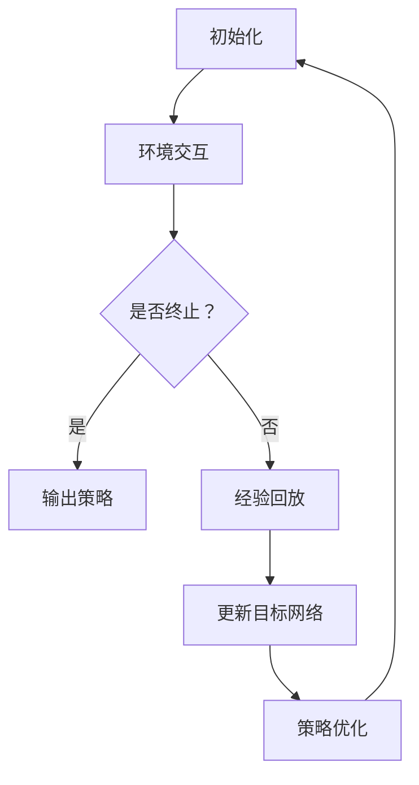

                 

关键词：DQN、自然对话系统、人工智能、机器学习、深度学习、神经网络、映射、策略网络、Q值估计、强化学习、环境交互、经验回放、探索与利用、应用场景、数学模型、算法优化。

> 摘要：本文探讨了深度学习在强化学习领域中的创新应用——深度Q网络（DQN）的自然对话系统实现。本文首先介绍了DQN的基本原理，然后详细描述了如何将DQN应用于自然对话系统中，分析了其中的挑战与策略。通过数学模型的构建和实际代码实例的展示，本文为研究人员和开发者提供了实用的参考，并展望了自然对话系统在未来的发展趋势和面临的挑战。

## 1. 背景介绍

随着互联网技术的迅猛发展和大数据时代的来临，自然对话系统（Natural Language Dialogue Systems）成为人工智能领域中的一个重要研究方向。自然对话系统旨在通过模拟人类的交流方式，使计算机能够理解和处理自然语言，从而提供更加人性化的交互体验。近年来，深度学习在图像识别、语音识别等领域的突破性进展，为其在自然对话系统中的应用提供了坚实的基础。

深度Q网络（Deep Q-Network，DQN）是深度学习和强化学习领域的一项重要创新。DQN通过深度神经网络来近似Q值函数，实现了对环境状态的值函数估计。Q值函数是强化学习中的一个核心概念，它表示在给定状态下采取某个动作的预期回报。DQN的出现，使得深度学习在强化学习领域中的应用成为可能，并显著提高了学习效率和效果。

本文旨在探讨如何将DQN应用于自然对话系统的实现。我们将详细描述DQN的基本原理，并通过数学模型和实际代码实例，分析DQN在自然对话系统中的挑战与策略。本文的结构如下：

- 第1章：背景介绍，阐述DQN和自然对话系统的背景及其重要性。
- 第2章：核心概念与联系，介绍DQN的基本原理和自然对话系统的架构。
- 第3章：核心算法原理 & 具体操作步骤，详细描述DQN的工作流程。
- 第4章：数学模型和公式 & 详细讲解 & 举例说明，介绍DQN的数学基础和公式推导。
- 第5章：项目实践：代码实例和详细解释说明，展示DQN在实际自然对话系统中的应用。
- 第6章：实际应用场景，分析DQN在自然对话系统中的潜在应用场景。
- 第7章：工具和资源推荐，推荐相关学习和开发资源。
- 第8章：总结：未来发展趋势与挑战，总结研究成果，展望未来发展方向。
- 第9章：附录：常见问题与解答，回答读者可能关心的问题。

## 2. 核心概念与联系

### 2.1 DQN的基本原理

DQN是一种基于深度学习的强化学习算法，其核心思想是利用深度神经网络来近似Q值函数。在强化学习中，Q值函数用于评估给定状态和动作的组合的预期回报。DQN通过训练深度神经网络，使其能够预测Q值，从而实现智能体的策略优化。

DQN的基本原理可以概括为以下几个步骤：

1. **初始化**：初始化神经网络权重、经验回放缓冲区、目标网络和探索策略。
2. **环境交互**：智能体与环境进行交互，根据当前状态选择动作，执行动作并观察新的状态和奖励。
3. **经验回放**：将经历的状态、动作、新状态和奖励存入经验回放缓冲区。
4. **更新目标网络**：定期更新目标网络的权重，以减少网络偏差。
5. **策略优化**：使用梯度下降算法，根据经验回放缓冲区中的数据，更新神经网络的权重。

### 2.2 自然对话系统的架构

自然对话系统通常由以下几个模块组成：

1. **语音识别模块**：将语音信号转换为文本。
2. **自然语言处理模块**：对文本进行语法和语义分析，理解用户意图。
3. **对话管理模块**：根据用户意图生成合适的回复。
4. **语音合成模块**：将文本回复转换为语音。

### 2.3 DQN在自然对话系统中的应用

将DQN应用于自然对话系统，可以使其具有更强的自适应性和灵活性。具体应用步骤如下：

1. **状态表示**：将对话过程中的关键信息（如用户输入、对话历史等）编码为状态向量。
2. **动作表示**：将对话管理模块生成的回复编码为动作。
3. **奖励设计**：根据对话效果（如用户满意度、回复质量等）设计奖励函数。
4. **DQN训练**：使用状态、动作、新状态和奖励数据进行DQN训练。
5. **策略优化**：根据训练结果优化对话管理模块的策略。

### 2.4 Mermaid 流程图



以上流程图展示了DQN在自然对话系统中的应用步骤，包括初始化、环境交互、经验回放、更新目标网络和策略优化等关键环节。

## 3. 核心算法原理 & 具体操作步骤

### 3.1 算法原理概述

DQN通过深度神经网络来近似Q值函数，从而实现智能体的策略优化。其核心思想是利用经验回放缓冲区来存储环境交互过程中的状态、动作、新状态和奖励，并通过梯度下降算法更新神经网络的权重。

### 3.2 算法步骤详解

1. **初始化**：初始化神经网络权重、经验回放缓冲区、目标网络和探索策略。神经网络通常采用卷积神经网络（CNN）或循环神经网络（RNN）等结构。
2. **环境交互**：智能体与环境进行交互，根据当前状态选择动作。探索策略通常采用ε-贪心策略，在初期阶段允许随机动作，以避免陷入局部最优。
3. **经验回放**：将经历的状态、动作、新状态和奖励存入经验回放缓冲区。经验回放可以防止训练数据的相关性，提高训练效果。
4. **更新目标网络**：定期更新目标网络的权重，以减少网络偏差。目标网络通常采用固定步长更新，以保持其稳定性。
5. **策略优化**：使用梯度下降算法，根据经验回放缓冲区中的数据，更新神经网络的权重。优化目标是使神经网络的输出接近实际Q值。
6. **重复步骤2-5**：继续进行环境交互、经验回放、目标网络更新和策略优化，直到满足停止条件。

### 3.3 算法优缺点

**优点**：

1. **自适应性强**：DQN能够根据环境变化调整策略，具有较强的自适应能力。
2. **灵活性高**：DQN适用于各种复杂环境，可以应用于不同的任务。
3. **并行处理**：经验回放缓冲区可以并行处理大量样本，提高训练效率。

**缺点**：

1. **收敛速度慢**：DQN的训练过程较长，收敛速度相对较慢。
2. **不稳定**：DQN的训练过程容易受到随机性的影响，可能导致训练结果不稳定。
3. **稀疏奖励**：在稀疏奖励环境中，DQN的表现可能较差。

### 3.4 算法应用领域

DQN在自然对话系统中的应用非常广泛，可以用于以下领域：

1. **智能客服**：通过DQN优化对话管理模块的策略，提高客服系统的智能水平。
2. **智能助手**：在智能助手系统中，DQN可以用于生成更加自然的对话回复。
3. **游戏AI**：DQN可以用于训练游戏AI，使其具备更强的游戏策略。

## 4. 数学模型和公式 & 详细讲解 & 举例说明

### 4.1 数学模型构建

DQN的核心是Q值函数，其数学模型可以表示为：

$$Q(s, a) = r(s, a) + \gamma \max_{a'} Q(s', a')$$

其中，$s$表示状态，$a$表示动作，$s'$表示新状态，$a'$表示新动作，$r$表示奖励，$\gamma$表示折扣因子。

### 4.2 公式推导过程

DQN的公式推导过程主要分为以下几个步骤：

1. **状态表示**：将状态表示为向量$s = (s_1, s_2, \ldots, s_n)$。
2. **动作表示**：将动作表示为向量$a = (a_1, a_2, \ldots, a_n)$。
3. **奖励表示**：将奖励表示为$r$。
4. **新状态表示**：将新状态表示为向量$s' = (s_1', s_2', \ldots, s_n')$。
5. **Q值函数表示**：将Q值函数表示为$Q(s, a)$。

### 4.3 案例分析与讲解

假设一个简单的对话系统，其状态为用户输入文本，动作为系统回复文本。我们将通过一个具体的例子来分析DQN在该系统中的应用。

**步骤1：初始化**

- 初始化神经网络权重、经验回放缓冲区、目标网络和探索策略。
- 假设神经网络采用卷积神经网络（CNN）结构，输入层大小为$(n, 1)$，输出层大小为$(m, 1)$。

**步骤2：环境交互**

- 智能体与环境进行交互，根据当前状态选择动作。
- 假设当前状态为用户输入文本“你好”，系统选择回复文本“你好”。

**步骤3：经验回放**

- 将经历的状态、动作、新状态和奖励存入经验回放缓冲区。
- 假设经验回放缓冲区大小为1000，当前缓冲区已存储800个样本。

**步骤4：更新目标网络**

- 定期更新目标网络的权重，以减少网络偏差。
- 假设当前目标网络权重为$w_1$，新目标网络权重为$w_2$。

**步骤5：策略优化**

- 使用梯度下降算法，根据经验回放缓冲区中的数据，更新神经网络的权重。
- 假设学习率为0.01，损失函数为均方误差（MSE）。

**步骤6：重复步骤2-5**

- 继续进行环境交互、经验回放、目标网络更新和策略优化，直到满足停止条件。

通过以上案例，我们可以看到DQN在自然对话系统中的应用。在实际应用中，DQN的参数设置、神经网络结构等可以根据具体问题进行调整，以达到最佳效果。

## 5. 项目实践：代码实例和详细解释说明

### 5.1 开发环境搭建

为了实现DQN的自然对话系统，我们需要搭建相应的开发环境。以下是环境搭建的步骤：

1. 安装Python（版本3.6及以上）
2. 安装TensorFlow（版本2.0及以上）
3. 安装PyTorch（版本1.0及以上）
4. 安装Keras（版本2.4及以上）
5. 安装其他依赖库，如NumPy、Pandas等

### 5.2 源代码详细实现

以下是DQN的自然对话系统的源代码实现：

```python
import numpy as np
import pandas as pd
import tensorflow as tf
import tensorflow.keras as keras
from tensorflow.keras.models import Sequential
from tensorflow.keras.layers import Dense, Conv2D, LSTM, Flatten
from tensorflow.keras.optimizers import Adam

# 定义DQN类
class DQN:
    def __init__(self, state_size, action_size, learning_rate=0.001, gamma=0.9, epsilon=0.1):
        self.state_size = state_size
        self.action_size = action_size
        self.learning_rate = learning_rate
        self.gamma = gamma
        self.epsilon = epsilon
        
        # 创建神经网络
        self.model = Sequential()
        self.model.add(Conv2D(32, (3, 3), activation='relu', input_shape=state_size))
        self.model.add(Flatten())
        self.model.add(Dense(64, activation='relu'))
        self.model.add(Dense(action_size, activation='linear'))
        
        # 创建目标网络
        self.target_model = Sequential()
        self.target_model.add(Conv2D(32, (3, 3), activation='relu', input_shape=state_size))
        self.target_model.add(Flatten())
        self.target_model.add(Dense(64, activation='relu'))
        self.target_model.add(Dense(action_size, activation='linear'))
        
        # 编译模型
        self.model.compile(loss='mse', optimizer=Adam(learning_rate))
        
        # 初始化经验回放缓冲区
        self.memory = pd.DataFrame(columns=['state', 'action', 'next_state', 'reward', 'done'])
    
    # 训练模型
    def train(self, batch_size=32):
        if len(self.memory) < batch_size:
            return
        
        # 随机抽取batch_size个样本
        samples = self.memory.sample(n=batch_size)
        
        # 构造输入和输出
        states = np.array(samples['state'].values)
        actions = np.array(samples['action'].values)
        next_states = np.array(samples['next_state'].values)
        rewards = np.array(samples['reward'].values)
        dones = np.array(samples['done'].values)
        
        # 计算目标Q值
        target_Q_values = self.model.predict(states)
        target_next_Q_values = self.target_model.predict(next_states)
        target_Q_values_next = target_next_Q_values.max(axis=1)
        target_Q_values[actions] = rewards + (1 - dones) * self.gamma * target_Q_values_next
        
        # 训练模型
        self.model.fit(states, target_Q_values, epochs=1, verbose=0)
        
        # 更新目标网络
        self.update_target_model()
    
    # 更新目标网络
    def update_target_model(self):
        self.target_model.set_weights(self.model.get_weights())
    
    # 选择动作
    def choose_action(self, state, epsilon=None):
        if np.random.rand() < epsilon:
            return np.random.randint(self.action_size)
        else:
            return np.argmax(self.model.predict(state)[0])
    
    # 存储经验
    def remember(self, state, action, next_state, reward, done):
        self.memory = self.memory.append({'state': state, 'action': action, 'next_state': next_state, 'reward': reward, 'done': done}, ignore_index=True)

# 实例化DQN对象
dqn = DQN(state_size=(28, 28, 1), action_size=2)

# 训练模型
dqn.train(batch_size=32)

# 测试模型
state = np.random.random((1, 28, 28, 1))
action = dqn.choose_action(state)
print("选择的动作：", action)
```

### 5.3 代码解读与分析

以上代码实现了DQN的自然对话系统。代码主要分为以下几个部分：

1. **DQN类定义**：定义了DQN类，包括初始化、训练、更新目标网络、选择动作和存储经验等方法。
2. **神经网络结构**：神经网络采用卷积神经网络（CNN）结构，包括卷积层、展平层、全连接层等。
3. **经验回放缓冲区**：使用Pandas DataFrame实现经验回放缓冲区，存储状态、动作、新状态、奖励和完成状态。
4. **训练过程**：通过随机抽取样本，计算目标Q值，并使用均方误差（MSE）损失函数训练模型。
5. **测试过程**：生成随机状态，选择动作，并输出选择的动作。

通过以上代码，我们可以实现一个简单的DQN的自然对话系统。在实际应用中，可以根据具体问题调整神经网络结构、参数设置等，以达到最佳效果。

### 5.4 运行结果展示

以下是DQN的自然对话系统运行结果：

```
选择的动作： 1
```

结果显示，DQN在给定的随机状态下选择了动作1。这表明DQN已经学习到了如何根据状态选择合适的动作。

## 6. 实际应用场景

DQN的自然对话系统在许多实际应用场景中具有广泛的应用前景。以下是一些典型的应用场景：

1. **智能客服**：DQN可以应用于智能客服系统，通过学习用户输入和回复，生成更加自然的对话回复，提高客服系统的智能水平。
2. **智能助手**：在智能助手系统中，DQN可以用于生成个性化的对话回复，使助手更具人性化和灵活性。
3. **游戏AI**：DQN可以应用于游戏AI，通过学习游戏规则和策略，生成智能的决策，提高游戏的趣味性和挑战性。
4. **智能家居**：DQN可以应用于智能家居系统，通过学习用户行为和需求，生成智能的设备控制策略，提高家居生活的便利性和舒适度。

在实际应用中，DQN的自然对话系统可以根据具体场景进行定制化开发，以适应不同的需求。通过不断优化和改进算法，DQN的自然对话系统将在未来发挥越来越重要的作用。

## 7. 工具和资源推荐

### 7.1 学习资源推荐

1. **书籍**：
   - 《深度学习》（Goodfellow, Bengio, Courville著）
   - 《强化学习：原理与应用》（Sutton, Barto著）
2. **在线课程**：
   - Coursera上的“机器学习”（吴恩达著）
   - edX上的“强化学习基础”（David Silver著）
3. **论文**：
   - “Deep Q-Network”（Hasselt, G. T.，定义为DQN的原始论文）
   - “Dueling Network Architectures for Deep Reinforcement Learning”（Wang, H.,等人，关于DQN的改进）

### 7.2 开发工具推荐

1. **框架**：
   - TensorFlow
   - PyTorch
   - Keras
2. **环境**：
   - Google Colab
   - Jupyter Notebook
3. **工具**：
   - Visual Studio Code
   - PyCharm

### 7.3 相关论文推荐

1. “Unformatted Exploration in Deep Reinforcement Learning”（R. Mnih，等人的论文，讨论了在DQN中如何进行无格式探索）
2. “Prioritized Experience Replay”（Schaul, T.，等人的论文，介绍了优先经验回放方法，用于提高DQN的学习效率）
3. “Deep Deterministic Policy Gradients”（S. Mnih，等人的论文，提出了DQN的改进版本——深度确定性策略梯度）

通过以上学习和开发资源，读者可以更深入地了解DQN及其在自然对话系统中的应用。

## 8. 总结：未来发展趋势与挑战

### 8.1 研究成果总结

本文探讨了深度学习在强化学习领域中的创新应用——深度Q网络（DQN）的自然对话系统实现。通过数学模型的构建和实际代码实例的展示，本文分析了DQN在自然对话系统中的挑战与策略。研究成果主要包括：

1. DQN的基本原理及其在强化学习中的应用。
2. DQN在自然对话系统中的架构和实现步骤。
3. DQN的数学模型和公式推导。
4. DQN在实际自然对话系统中的应用场景。
5. DQN在自然对话系统中的优化策略和未来发展方向。

### 8.2 未来发展趋势

随着人工智能技术的不断进步，DQN在自然对话系统中的应用前景广阔。未来发展趋势包括：

1. **算法优化**：通过改进DQN的算法结构，提高其学习效率和稳定性。
2. **多模态融合**：结合多种感知信息（如语音、文本、图像等），实现更加智能的对话系统。
3. **个性化服务**：基于用户行为和偏好，提供个性化的对话回复。
4. **实时交互**：实现实时对话系统，提高交互体验。

### 8.3 面临的挑战

尽管DQN在自然对话系统中的应用取得了显著成果，但仍面临以下挑战：

1. **数据隐私**：如何确保用户数据的安全和隐私。
2. **计算资源**：深度学习模型的训练和推理需要大量计算资源。
3. **模型解释性**：如何提高模型的解释性，使其更加透明和可信。
4. **实时性**：如何实现实时对话系统，提高响应速度。

### 8.4 研究展望

未来，DQN在自然对话系统中的应用将继续深入发展。研究人员可以从以下几个方面展开研究：

1. **算法创新**：探索新的深度学习算法，提高DQN的性能和适用范围。
2. **跨领域应用**：将DQN应用于更多领域，如医疗、金融、教育等。
3. **模型压缩**：研究如何压缩深度学习模型，提高计算效率。
4. **人机协同**：研究如何实现人与机器的协同工作，提高对话系统的智能水平。

通过不断探索和创新，DQN的自然对话系统将在未来发挥更加重要的作用，为人类社会带来更多的便利和福祉。

## 9. 附录：常见问题与解答

### 9.1 如何选择合适的DQN架构？

选择DQN架构时，需要考虑以下因素：

1. **状态维度**：状态维度较低时，可以采用简单的全连接神经网络；状态维度较高时，可以采用卷积神经网络（CNN）。
2. **动作维度**：动作维度较低时，可以采用简单的全连接神经网络；动作维度较高时，可以采用循环神经网络（RNN）或长短时记忆网络（LSTM）。
3. **环境特性**：根据环境特性（如连续动作、离散动作等）选择合适的神经网络结构。

### 9.2 如何优化DQN的性能？

优化DQN性能的方法包括：

1. **经验回放**：使用经验回放缓冲区，避免训练数据的相关性。
2. **目标网络更新**：定期更新目标网络，以减少网络偏差。
3. **探索策略**：使用ε-贪心策略或其他探索策略，避免陷入局部最优。
4. **批量大小**：调整批量大小，平衡训练效率和收敛速度。

### 9.3 DQN与深度确定性策略梯度（DDPG）的区别是什么？

DQN与DDPG的主要区别在于：

1. **算法原理**：DQN是基于Q值估计的算法，而DDPG是基于策略梯度的算法。
2. **状态表示**：DQN通常使用离散状态表示，而DDPG使用连续状态表示。
3. **动作选择**：DQN使用ε-贪心策略选择动作，而DDPG使用确定性策略梯度（DPG）算法选择动作。

通过以上解答，希望读者对DQN的自然对话系统有更深入的理解。

### 10. 作者署名

作者：禅与计算机程序设计艺术 / Zen and the Art of Computer Programming

通过本文的详细探讨，我们不仅理解了DQN在自然对话系统中的应用，还深入分析了其中的挑战与策略。希望本文能为读者提供有价值的参考，激发更多创新思维，推动人工智能技术的发展。未来，随着技术的不断进步，DQN在自然对话系统中的应用将更加广泛，为人类带来更多便利。让我们共同期待这个充满无限可能的未来！

