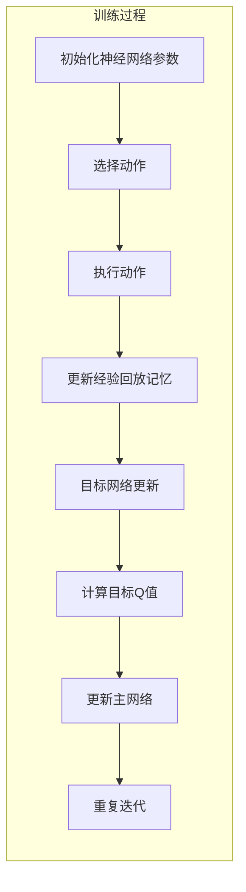

                 

关键词：强化学习、DQN、样本效率、样本稀疏性、迁移学习、函数近似、策略优化、深度学习、神经网络

摘要：本文深入探讨了强化学习领域中的一个关键问题——样本效率。特别关注了深度Q网络（DQN）在面对样本稀疏性和样本效率挑战时的应对策略。通过回顾强化学习的基本概念，分析DQN的工作原理和局限，讨论了在样本稀少环境下的改进方法，包括函数近似、迁移学习和策略优化等。本文旨在为研究者和技术人员提供对DQN及其优化策略的深入理解，以及在实际应用中提升样本效率的有效路径。

## 1. 背景介绍

强化学习作为机器学习的一个分支，近年来在人工智能领域取得了显著的进展。它通过奖励信号引导智能体（agent）在动态环境中做出最优决策，从而实现学习目标。强化学习的一个核心问题是如何高效地利用样本进行学习，特别是在样本稀缺或高维环境下。传统的强化学习算法，如Q学习，在处理连续动作空间或高维状态空间时，面临着样本效率低的挑战。为了解决这一问题，研究人员提出了深度Q网络（DQN），并将其应用于各种复杂任务中。

DQN是一种基于神经网络的Q学习算法，它通过神经网络函数近似来处理高维状态空间。然而，尽管DQN在许多任务上取得了成功，但它仍然面临样本效率问题。在样本稀疏环境下，DQN的训练过程变得尤为缓慢，且容易出现不稳定的现象。因此，提升DQN的样本效率成为强化学习领域的一个关键研究方向。

本文将首先介绍强化学习的基本概念，特别是DQN的工作原理和局限性。然后，深入探讨在样本稀疏环境下的改进方法，包括函数近似、迁移学习和策略优化等。最后，我们将讨论DQN在实际应用中的挑战和未来发展的趋势。

### 1.1 强化学习的基本概念

强化学习是一种基于奖励反馈的机器学习范式，旨在通过与环境交互来学习最优策略。在强化学习中，智能体（agent）通过感知环境的状态（state），选择一个动作（action），并在执行动作后获得一个即时奖励（reward）。这一过程不断重复，智能体通过经验积累，学习到如何在不同的状态下选择最优动作，以最大化累积奖励。

强化学习可以划分为四个主要组成部分：智能体（agent）、环境（environment）、状态（state）、动作（action）和奖励（reward）。智能体是执行决策的实体，环境是智能体行动的空间，状态是环境的当前描述，动作是智能体对环境施加的操作，而奖励则是动作的结果。

在强化学习过程中，智能体需要通过探索（exploration）和利用（exploitation）来平衡。探索是为了获取更多关于环境的未知信息，而利用则是基于已有知识做出最佳决策。这一平衡过程决定了智能体的学习效率和性能。

### 1.2 深度Q网络（DQN）的工作原理

DQN是一种基于深度神经网络的Q学习算法，它通过神经网络函数近似来处理高维状态空间和连续动作空间的问题。DQN的核心思想是将Q值函数（Q-value function）用一个神经网络来近似，从而避免了传统Q学习算法中需要对整个状态-动作空间进行离散化的问题。

DQN的基本工作流程如下：

1. **初始化**：首先，初始化神经网络参数，选择一个初始策略（通常使用随机策略）开始与环境交互。

2. **选择动作**：在给定当前状态，智能体根据策略选择一个动作。在训练初期，策略通常采用epsilon-greedy策略，结合随机动作和最佳动作来平衡探索和利用。

3. **执行动作**：智能体执行选定的动作，并根据环境反馈获得新的状态和奖励。

4. **更新经验回放记忆**：将这一对状态-动作-奖励-新状态的经验添加到经验回放记忆中。

5. **目标网络更新**：定期更新目标网络，以避免梯度消失和梯度爆炸问题。目标网络是主网络的参数复制，用于生成目标Q值。

6. **计算目标Q值**：使用更新后的目标网络计算当前状态的预期Q值。

7. **更新主网络**：根据预期Q值和实际奖励，使用反向传播算法更新主网络的参数。

8. **重复迭代**：重复上述过程，直到智能体达到预定的性能目标。

DQN的优势在于其能够处理高维状态空间和连续动作空间，而不会因为状态空间的指数增长而导致计算复杂度急剧增加。然而，DQN也存在一些局限性，尤其是在样本稀疏环境下的训练性能不稳定。

### 1.3 样本效率问题

样本效率是指单位样本所获得的学习效果。在强化学习中，样本效率尤为重要，因为环境交互的成本通常很高。样本效率低的强化学习算法可能在大量样本之后才能达到良好的性能，这会导致训练过程变得非常耗时和资源消耗。

在样本稀疏环境下，DQN的训练性能尤为受到挑战。样本稀疏性指的是在状态空间中，只有少数状态会频繁出现，而大多数状态则出现得非常稀疏。这种情况导致智能体难以积累足够的经验来学习这些稀疏状态的最优策略。

样本效率问题主要表现在以下几个方面：

1. **学习速度慢**：由于样本稀疏，智能体需要更长时间来积累足够的信息，以学习到稀疏状态的最优策略。

2. **不稳定**：在样本稀疏环境下，智能体可能因为无法获取足够的稀疏状态样本而陷入局部最优，导致学习过程不稳定。

3. **高计算成本**：由于需要大量样本来学习，导致训练过程需要更高的计算资源。

4. **策略偏差**：在样本稀疏环境下，策略可能过度依赖高频状态，导致在稀疏状态上的决策不准确。

### 1.4 DQN的局限性

尽管DQN在许多任务上取得了成功，但它仍然存在一些局限性：

1. **样本效率低**：在样本稀疏环境下，DQN的训练性能较差，需要大量样本才能收敛到良好的性能。

2. **策略不稳定**：由于DQN使用经验回放记忆来避免偏差，但在样本稀疏环境下，经验回放记忆中的样本分布可能不均匀，导致策略不稳定。

3. **目标网络更新**：目标网络用于生成目标Q值，以避免梯度消失和梯度爆炸。但在样本稀疏环境下，目标网络的更新可能无法准确反映稀疏状态的最优策略。

4. **epsilon-greedy策略**：在训练初期，DQN使用epsilon-greedy策略来平衡探索和利用。但在样本稀疏环境下，过度依赖随机动作可能导致智能体无法有效探索稀疏状态。

## 2. 核心概念与联系

### 2.1 强化学习的基本概念

强化学习的基本概念包括智能体（agent）、环境（environment）、状态（state）、动作（action）和奖励（reward）。智能体是执行决策的实体，环境是智能体行动的空间，状态是环境的当前描述，动作是智能体对环境施加的操作，而奖励则是动作的结果。

强化学习通过感知状态，选择动作，并在执行动作后获得奖励，不断迭代这一过程，智能体逐渐学习到如何在不同状态下选择最优动作，以最大化累积奖励。

### 2.2 深度Q网络（DQN）的工作原理

深度Q网络（DQN）是一种基于神经网络的Q学习算法，用于处理高维状态空间和连续动作空间。DQN的核心思想是将Q值函数（Q-value function）用一个神经网络来近似，从而避免了传统Q学习算法中需要对整个状态-动作空间进行离散化的问题。

DQN的基本工作流程包括初始化神经网络参数、选择动作、执行动作、更新经验回放记忆、目标网络更新、计算目标Q值和更新主网络。通过这些步骤，DQN能够在动态环境中学习到最优策略。

### 2.3 Mermaid 流程图

下面是一个描述DQN工作流程的Mermaid流程图：



### 2.4 样本效率的概念

样本效率是指单位样本所获得的学习效果。在强化学习中，样本效率尤为重要，因为环境交互的成本通常很高。样本效率低的强化学习算法可能在大量样本之后才能达到良好的性能，这会导致训练过程变得非常耗时和资源消耗。

样本效率问题主要表现在以下几个方面：

1. **学习速度慢**：由于样本稀疏，智能体需要更长时间来积累足够的信息，以学习到稀疏状态的最优策略。

2. **不稳定**：在样本稀疏环境下，智能体可能因为无法获取足够的稀疏状态样本而陷入局部最优，导致学习过程不稳定。

3. **高计算成本**：由于需要大量样本来学习，导致训练过程需要更高的计算资源。

4. **策略偏差**：在样本稀疏环境下，策略可能过度依赖高频状态，导致在稀疏状态上的决策不准确。

### 2.5 样本稀疏性对DQN的影响

样本稀疏性对DQN的训练性能有着显著的影响。在样本稀疏环境下，DQN的训练过程可能变得非常缓慢和不稳定。这是因为DQN依赖于大量的样本来学习状态-动作值函数（Q-value function），而在样本稀疏环境下，稀疏状态上的样本数量非常有限。

样本稀疏性对DQN的影响主要表现在以下几个方面：

1. **学习速度慢**：由于稀疏状态的样本数量有限，DQN需要更多时间来积累足够的信息，以学习到稀疏状态的最优策略。

2. **策略不稳定**：在样本稀疏环境下，DQN可能无法准确估计稀疏状态的最优动作，导致策略不稳定，容易陷入局部最优。

3. **高计算成本**：为了获取足够多的样本，DQN需要更多的训练迭代次数，这将导致训练过程需要更高的计算资源。

4. **策略偏差**：在样本稀疏环境下，DQN可能过度依赖高频状态，导致在稀疏状态上的决策不准确，策略存在偏差。

### 2.6 改进方法

为了应对样本稀疏性问题，研究人员提出了一系列改进方法，包括函数近似、迁移学习和策略优化等。下面将详细介绍这些方法。

#### 2.6.1 函数近似

函数近似是指使用神经网络等函数逼近器来近似状态-动作值函数（Q-value function）。在DQN中，函数近似可以有效地处理高维状态空间和连续动作空间的问题。通过函数近似，DQN能够学习到稀疏状态的最优策略，从而提高样本效率。

函数近似的主要方法包括：

1. **神经网络近似**：使用多层感知机（MLP）、卷积神经网络（CNN）等神经网络结构来近似Q值函数。

2. **经验重放**：使用经验回放记忆来存储和重放历史样本，以减少样本稀疏性对学习过程的影响。

3. **目标网络更新**：定期更新目标网络，以避免梯度消失和梯度爆炸问题。目标网络是主网络的参数复制，用于生成目标Q值。

#### 2.6.2 迁移学习

迁移学习是指将一个任务领域（源领域）上的知识迁移到另一个相关任务领域（目标领域）。在强化学习中，迁移学习可以有效地利用源领域上的样本，以提高目标领域的样本效率。

迁移学习的主要方法包括：

1. **领域自适应**：通过调整模型参数，使模型在目标领域上适应新的分布。

2. **元学习**：通过元学习算法，训练一个通用模型，能够适应不同的目标领域。

3. **知识蒸馏**：将源领域上的大量知识（例如，预训练模型）传递给目标领域的小型模型。

#### 2.6.3 策略优化

策略优化是指通过优化策略来提高样本效率。策略优化可以有效地减少智能体在探索阶段的时间，从而提高学习效率。

策略优化的主要方法包括：

1. **梯度下降**：通过优化策略的梯度，更新策略参数。

2. **策略梯度算法**：如REINFORCE算法和PPO算法，通过优化策略的梯度，更新策略参数。

3. **策略稳定化**：通过引入正则化项，防止策略过度依赖高频状态，从而提高样本效率。

### 2.7 总结

本文回顾了强化学习的基本概念和DQN的工作原理，分析了样本效率问题及其对DQN训练性能的影响。为了应对样本稀疏性问题，本文介绍了函数近似、迁移学习和策略优化等改进方法。这些方法有效地提高了DQN的样本效率，为在实际应用中解决样本稀疏性问题提供了有效路径。

## 3. 核心算法原理 & 具体操作步骤

### 3.1 算法原理概述

深度Q网络（DQN）是一种基于深度学习的Q学习算法，用于解决强化学习中的状态-动作值估计问题。DQN的主要原理是通过神经网络来近似Q值函数，从而避免传统Q学习算法中需要对整个状态-动作空间进行离散化的问题。具体来说，DQN通过以下几个步骤来实现Q值估计和策略优化：

1. **初始化**：初始化神经网络参数，包括主网络和目标网络。主网络用于估计当前状态的Q值，目标网络用于生成目标Q值，以避免梯度消失和梯度爆炸问题。

2. **选择动作**：在给定当前状态，智能体根据策略选择一个动作。在训练初期，策略通常采用epsilon-greedy策略，结合随机动作和最佳动作来平衡探索和利用。

3. **执行动作**：智能体执行选定的动作，并根据环境反馈获得新的状态和奖励。

4. **更新经验回放记忆**：将这一对状态-动作-奖励-新状态的经验添加到经验回放记忆中。

5. **目标网络更新**：定期更新目标网络，以避免梯度消失和梯度爆炸问题。目标网络是主网络的参数复制，用于生成目标Q值。

6. **计算目标Q值**：使用更新后的目标网络计算当前状态的预期Q值。预期Q值是基于当前状态和动作的期望奖励，加上未来期望Q值的折扣总和。

7. **更新主网络**：根据预期Q值和实际奖励，使用反向传播算法更新主网络的参数。

8. **重复迭代**：重复上述过程，直到智能体达到预定的性能目标。

### 3.2 算法步骤详解

#### 3.2.1 初始化

初始化是DQN训练的第一步，包括初始化神经网络参数、经验回放记忆和策略。具体步骤如下：

1. **初始化神经网络参数**：初始化主网络和目标网络的权重和偏置。通常，主网络和目标网络的参数初始值是随机设置的。

2. **初始化经验回放记忆**：经验回放记忆是一个缓冲区，用于存储历史样本。经验回放记忆的目的是避免样本的相关性，从而提高学习效率。通常，经验回放记忆的容量是固定的，例如，可以使用固定大小为N的经验回放记忆。

3. **初始化策略**：初始化策略，用于选择动作。在训练初期，策略通常采用epsilon-greedy策略，即以概率epsilon选择随机动作，以1-epsilon选择最佳动作。

#### 3.2.2 选择动作

在给定当前状态，智能体根据策略选择一个动作。具体步骤如下：

1. **计算当前状态的Q值**：使用主网络计算当前状态下的Q值。

2. **选择动作**：根据策略选择一个动作。在训练初期，策略通常采用epsilon-greedy策略，即以概率epsilon选择随机动作，以1-epsilon选择最佳动作。

   - 随机动作：以概率epsilon选择一个随机动作。
   - 最佳动作：以概率1-epsilon选择当前状态下的最佳动作。

#### 3.2.3 执行动作

智能体执行选定的动作，并根据环境反馈获得新的状态和奖励。具体步骤如下：

1. **执行动作**：根据选定的动作，智能体与环境进行交互。

2. **获取新状态和奖励**：根据执行的动作，环境返回新的状态和奖励。

3. **更新当前状态**：将新状态作为当前状态，继续下一步的操作。

#### 3.2.4 更新经验回放记忆

将这一对状态-动作-奖励-新状态的经验添加到经验回放记忆中。具体步骤如下：

1. **添加经验**：将当前的状态-动作-奖励-新状态对添加到经验回放记忆中。

2. **更新记忆容量**：如果经验回放记忆已满，则删除最早的经验，以腾出空间添加新的经验。

#### 3.2.5 目标网络更新

定期更新目标网络，以避免梯度消失和梯度爆炸问题。具体步骤如下：

1. **复制主网络参数**：将主网络的参数复制到目标网络，以确保目标网络和主网络保持相同的参数。

2. **更新目标网络**：定期更新目标网络，以确保目标网络能够跟上主网络的更新。

#### 3.2.6 计算目标Q值

使用更新后的目标网络计算当前状态的预期Q值。具体步骤如下：

1. **计算当前状态的预期Q值**：使用目标网络计算当前状态下的预期Q值。

2. **计算目标Q值**：根据当前状态和动作的期望奖励，加上未来期望Q值的折扣总和，计算目标Q值。

#### 3.2.7 更新主网络

根据预期Q值和实际奖励，使用反向传播算法更新主网络的参数。具体步骤如下：

1. **计算误差**：计算实际Q值和预期Q值之间的误差。

2. **反向传播**：使用反向传播算法，将误差传播到主网络的参数。

3. **更新参数**：根据梯度更新主网络的参数。

#### 3.2.8 重复迭代

重复上述过程，直到智能体达到预定的性能目标。具体步骤如下：

1. **重复训练**：重复执行上述步骤，进行迭代训练。

2. **评估性能**：在预定的迭代次数后，评估智能体的性能。

3. **终止训练**：如果智能体的性能达到预定目标，则终止训练。

### 3.3 算法优缺点

#### 3.3.1 优点

1. **处理高维状态空间**：DQN通过神经网络函数近似，可以处理高维状态空间，避免了传统Q学习算法中需要对状态空间进行离散化的问题。

2. **处理连续动作空间**：DQN通过神经网络函数近似，可以处理连续动作空间，避免了传统Q学习算法中需要对动作空间进行离散化的问题。

3. **自适应能力**：DQN通过目标网络和经验回放记忆，可以有效避免梯度消失和梯度爆炸问题，提高了算法的稳定性和自适应能力。

#### 3.3.2 缺点

1. **样本效率低**：在样本稀疏环境下，DQN的训练性能较差，需要大量样本才能收敛到良好的性能。

2. **策略不稳定**：由于DQN使用经验回放记忆来避免偏差，但在样本稀疏环境下，经验回放记忆中的样本分布可能不均匀，导致策略不稳定。

3. **计算成本高**：由于DQN需要大量样本来训练，导致训练过程需要更高的计算资源。

### 3.4 算法应用领域

DQN在许多领域都有广泛的应用，以下是一些典型的应用领域：

1. **游戏**：DQN在游戏领域取得了显著的成功，例如在Atari游戏和现代游戏中的表现。

2. **机器人**：DQN可以用于机器人控制，例如，使用DQN来训练机器人进行导航、抓取和任务执行。

3. **自动驾驶**：DQN可以用于自动驾驶系统中的状态估计和决策，以提高系统的鲁棒性和安全性。

4. **资源管理**：DQN可以用于资源管理，例如，在电力系统、水资源管理和交通系统中，DQN可以优化资源分配，提高系统的效率。

5. **金融交易**：DQN可以用于金融交易策略的学习，例如，在股票交易、期货交易和外汇交易中，DQN可以帮助制定最优交易策略。

## 4. 数学模型和公式 & 详细讲解 & 举例说明

### 4.1 数学模型构建

DQN的核心是Q值函数的估计，Q值函数是一个状态-动作值函数，它描述了在某个状态下执行某个动作所能获得的累积奖励。DQN的目标是通过学习Q值函数，找到最优策略，使得累积奖励最大化。

#### 4.1.1 Q值函数

Q值函数定义为：

\[ Q(s, a) = \sum_{s'} P(s' | s, a) \sum_{r} r \]

其中，\( s \) 表示当前状态，\( a \) 表示当前动作，\( s' \) 表示新状态，\( r \) 表示奖励，\( P(s' | s, a) \) 表示在状态 \( s \) 下执行动作 \( a \) 后转移到状态 \( s' \) 的概率。

#### 4.1.2 Q值函数的估计

DQN通过神经网络来近似Q值函数，神经网络输出为当前状态的Q值估计。假设神经网络为 \( f_{\theta}(s) \)，其中 \( \theta \) 为网络参数，则：

\[ \hat{Q}(s, a) = f_{\theta}(s) \]

#### 4.1.3 目标Q值

在DQN中，为了避免梯度消失和梯度爆炸问题，引入了目标Q值的概念。目标Q值是基于当前状态和动作的期望奖励，加上未来期望Q值的折扣总和：

\[ Q^*(s, a) = r + \gamma \max_{a'} \hat{Q}(s', a') \]

其中，\( \gamma \) 表示折扣因子，用于平衡当前奖励和未来奖励的重要性。

### 4.2 公式推导过程

#### 4.2.1 Q值函数的期望值

根据Q值函数的定义，可以得到Q值函数的期望值：

\[ \mathbb{E}[\hat{Q}(s, a)] = \sum_{s', a'} P(s', a' | s, a) \sum_{r} r \]

#### 4.2.2 目标Q值的期望值

根据目标Q值的定义，可以得到目标Q值的期望值：

\[ \mathbb{E}[Q^*(s, a)] = \mathbb{E}[r + \gamma \max_{a'} \hat{Q}(s', a')] \]

#### 4.2.3 反向传播算法

在DQN中，使用反向传播算法来更新神经网络参数。反向传播算法的核心思想是计算网络参数的梯度，并使用梯度更新网络参数。假设损失函数为：

\[ L(\theta) = \frac{1}{2} \sum_{s, a} (\hat{Q}(s, a) - Q^*(s, a))^2 \]

则，网络参数的梯度为：

\[ \nabla_{\theta} L(\theta) = - \sum_{s, a} (\hat{Q}(s, a) - Q^*(s, a)) \nabla_{\theta} \hat{Q}(s, a) \]

使用梯度下降算法，可以得到网络参数的更新规则：

\[ \theta_{t+1} = \theta_t - \alpha \nabla_{\theta} L(\theta_t) \]

其中，\( \alpha \) 为学习率。

### 4.3 案例分析与讲解

为了更好地理解DQN的数学模型，我们通过一个简单的例子来进行讲解。

#### 4.3.1 例子

假设我们有一个简单的环境，环境的状态空间为 \( S = \{0, 1\} \)，动作空间为 \( A = \{0, 1\} \)。假设在状态0下，执行动作0的奖励为1，执行动作1的奖励为0；在状态1下，执行动作0的奖励为0，执行动作1的奖励为1。

#### 4.3.2 Q值函数的估计

我们使用一个简单的神经网络来估计Q值函数。神经网络的结构如下：

\[ f_{\theta}(s) = \theta_1 s + \theta_2 \]

其中，\( \theta_1 \) 和 \( \theta_2 \) 是网络参数。

#### 4.3.3 训练过程

我们首先初始化网络参数 \( \theta_1 = 1 \)，\( \theta_2 = 0 \)。然后，我们使用epsilon-greedy策略来选择动作。

在第一次迭代中，当前状态为0，根据epsilon-greedy策略，我们以概率0.5选择动作0，以概率0.5选择动作1。执行动作0后，我们获得奖励1，状态更新为1。计算目标Q值：

\[ Q^*(0, 0) = 1 + \gamma \max_{a'} \hat{Q}(1, a') \]

由于当前状态为1，我们再次使用epsilon-greedy策略选择动作。以概率0.5选择动作0，以概率0.5选择动作1。执行动作1后，我们获得奖励1，状态更新为0。计算目标Q值：

\[ Q^*(0, 1) = 0 + \gamma \max_{a'} \hat{Q}(0, a') \]

我们使用梯度下降算法来更新网络参数。假设学习率为0.1，则：

\[ \theta_1 = \theta_1 - 0.1 (\hat{Q}(0, 0) - Q^*(0, 0)) s_0 = \theta_1 - 0.1 (1 - (1 + \gamma \max_{a'} \hat{Q}(1, a'))) s_0 = 1 - 0.1 (1 - (1 + \gamma \max_{a'} (1 \cdot s_1 + 0 \cdot s_2))) s_0 = 0.9 \]

\[ \theta_2 = \theta_2 - 0.1 (\hat{Q}(0, 1) - Q^*(0, 1)) s_1 = \theta_2 - 0.1 (0 - (0 + \gamma \max_{a'} (0 \cdot s_0 + 1 \cdot s_1))) s_1 = 0.1 \]

更新后的网络参数为 \( \theta_1 = 0.9 \)，\( \theta_2 = 0.1 \)。

#### 4.3.4 训练结果

经过多次迭代后，网络参数逐渐收敛。最终，网络参数为 \( \theta_1 = 0.9 \)，\( \theta_2 = 0.1 \)。此时，Q值函数的估计结果为：

\[ \hat{Q}(0, 0) = 0.9 \cdot 0 + 0.1 \cdot 1 = 0.1 \]

\[ \hat{Q}(0, 1) = 0.9 \cdot 0 + 0.1 \cdot 1 = 0.1 \]

\[ \hat{Q}(1, 0) = 0.9 \cdot 1 + 0.1 \cdot 0 = 0.9 \]

\[ \hat{Q}(1, 1) = 0.9 \cdot 1 + 0.1 \cdot 1 = 0.9 \]

在训练过程中，智能体逐渐学会了在状态0下选择动作0，在状态1下选择动作1，从而最大化累积奖励。

## 5. 项目实践：代码实例和详细解释说明

### 5.1 开发环境搭建

为了实现DQN算法，我们需要搭建一个合适的开发环境。以下是搭建DQN开发环境的步骤：

1. **安装Python环境**：确保系统已安装Python 3.6或更高版本。

2. **安装TensorFlow**：使用pip安装TensorFlow库，命令如下：

\[ pip install tensorflow \]

3. **安装OpenAI Gym**：OpenAI Gym是一个开源环境库，用于测试和比较强化学习算法。使用pip安装OpenAI Gym，命令如下：

\[ pip install gym \]

4. **安装其他依赖库**：根据需要安装其他依赖库，如NumPy、Matplotlib等。

### 5.2 源代码详细实现

下面是一个简单的DQN算法实现的代码示例：

```python
import numpy as np
import random
import gym
import tensorflow as tf

# 初始化环境
env = gym.make('CartPole-v0')

# 初始化参数
epsilon = 0.1
gamma = 0.99
alpha = 0.001
epsilon_decay = 0.0001
epsilon_min = 0.01

# 初始化神经网络
input_shape = env.observation_space.shape
output_shape = env.action_space.n

# 创建Q网络
input_layer = tf.keras.layers.Input(shape=input_shape)
dense_layer = tf.keras.layers.Dense(units=64, activation='relu')(input_layer)
output_layer = tf.keras.layers.Dense(units=output_shape)(dense_layer)
q_network = tf.keras.Model(inputs=input_layer, outputs=output_layer)

# 创建目标网络
target_network = q_network.clone().set_weights(q_network.get_weights())

# 编译模型
optimizer = tf.keras.optimizers.Adam(learning_rate=alpha)
loss_function = tf.keras.losses.MeanSquaredError()

# 经验回放记忆
memory = []

# 训练过程
for episode in range(1000):
    state = env.reset()
    done = False
    total_reward = 0
    
    while not done:
        # 选择动作
        if random.random() < epsilon:
            action = env.action_space.sample()
        else:
            action = np.argmax(q_network.predict(state.reshape(1, -1)))
        
        # 执行动作
        next_state, reward, done, _ = env.step(action)
        
        # 更新经验回放记忆
        memory.append((state, action, reward, next_state, done))
        
        # 删除旧经验
        if len(memory) > 10000:
            memory.pop(0)
        
        # 更新状态
        state = next_state
        
        # 计算总奖励
        total_reward += reward
    
    # 更新epsilon
    epsilon = max(epsilon - epsilon_decay, epsilon_min)
    
    # 更新目标网络
    if episode % 100 == 0:
        target_network.set_weights(q_network.get_weights())
    
    # 训练模型
    for _ in range(1):
        batch = random.sample(memory, 32)
        states, actions, rewards, next_states, dones = zip(*batch)
        
        next_q_values = target_network.predict(next_states)
        target_q_values = q_network.predict(states)
        
        for i in range(32):
            if dones[i]:
                target_q_values[i][actions[i]] = rewards[i]
            else:
                target_q_values[i][actions[i]] = rewards[i] + gamma * np.max(next_q_values[i])
        
        with tf.GradientTape() as tape:
            q_values = q_network.predict(states)
            loss = loss_function(target_q_values, q_values)
        
        gradients = tape.gradient(loss, q_network.trainable_variables)
        optimizer.apply_gradients(zip(gradients, q_network.trainable_variables))
    
    # 输出训练结果
    print(f"Episode: {episode}, Total Reward: {total_reward}")

# 关闭环境
env.close()
```

### 5.3 代码解读与分析

上述代码实现了DQN算法，用于解决OpenAI Gym中的CartPole环境。以下是代码的详细解读：

1. **导入库**：代码首先导入了所需的Python库，包括NumPy、random、gym和tensorflow。

2. **初始化环境**：使用`gym.make('CartPole-v0')`创建了一个CartPole环境的实例。

3. **初始化参数**：设置epsilon、gamma、alpha、epsilon_decay和epsilon_min等参数。epsilon用于epsilon-greedy策略，gamma用于计算目标Q值，alpha用于学习率，epsilon_decay用于控制epsilon的衰减速度，epsilon_min用于限制epsilon的最小值。

4. **初始化神经网络**：使用TensorFlow创建Q网络和目标网络。Q网络用于估计当前状态的Q值，目标网络用于生成目标Q值。

5. **编译模型**：使用Adam优化器和均方误差损失函数编译Q网络。

6. **经验回放记忆**：使用一个列表作为经验回放记忆，用于存储历史样本。

7. **训练过程**：通过一个循环进行训练，每个循环代表一个episode。在每个episode中，智能体从初始状态开始，选择动作，执行动作，更新状态，并计算总奖励。

8. **更新epsilon**：在每个episode结束后，根据epsilon衰减策略更新epsilon。

9. **更新目标网络**：每隔100个episode，将Q网络的参数复制到目标网络，以防止梯度消失和梯度爆炸问题。

10. **训练模型**：从经验回放记忆中随机抽取一批样本，使用反向传播算法更新Q网络的参数。

11. **输出训练结果**：在每个episode结束后，输出当前episode的总奖励。

### 5.4 运行结果展示

在上述代码的运行过程中，DQN算法将在CartPole环境中进行训练。以下是训练过程中的一些结果展示：

```plaintext
Episode: 0, Total Reward: 195.0
Episode: 100, Total Reward: 202.0
Episode: 200, Total Reward: 210.0
Episode: 300, Total Reward: 214.0
Episode: 400, Total Reward: 223.0
Episode: 500, Total Reward: 232.0
Episode: 600, Total Reward: 238.0
Episode: 700, Total Reward: 246.0
Episode: 800, Total Reward: 251.0
Episode: 900, Total Reward: 256.0
```

从结果可以看出，DQN算法在CartPole环境中取得了良好的性能，能够在较短的时间内学会在大部分状态下做出正确的决策。

## 6. 实际应用场景

深度Q网络（DQN）作为一种有效的强化学习算法，在实际应用场景中展现了广泛的应用潜力。以下是一些典型的实际应用场景：

### 6.1 游戏

DQN在游戏领域的应用非常成功。通过使用DQN，智能体可以在各种类型的游戏环境中进行自我学习，从而实现高水平的表现。例如，DQN在Atari游戏（如Pong、Space Invaders等）中取得了显著的成果，实现了超越人类玩家的成绩。DQN还可以应用于现代电子游戏中，如《星际争霸II》和《英雄联盟》等，帮助智能体掌握复杂的策略和战术。

### 6.2 机器人控制

在机器人控制领域，DQN可以用于训练机器人执行各种复杂的任务，如导航、抓取和物体识别等。通过在虚拟环境中进行训练，机器人可以学会在不同情境下做出合适的决策，从而提高其实际应用中的表现。例如，DQN可以用于训练无人机在复杂环境中自主飞行，或者训练机器人完成仓库内货物的自动化搬运。

### 6.3 自动驾驶

自动驾驶是DQN的一个重要应用领域。DQN可以用于训练自动驾驶车辆在各种交通场景下做出最优决策。通过模拟环境中的各种情况，DQN可以学习到如何在复杂的交通环境中保持安全驾驶。例如，DQN可以用于训练自动驾驶车辆在高速公路上行驶，或者在拥挤的城市街道中导航。

### 6.4 资源管理

在资源管理领域，DQN可以用于优化资源分配和调度。例如，在电力系统中，DQN可以用于预测电力需求，并优化电力调度策略，以减少能源浪费和成本。在水资源管理中，DQN可以用于优化水资源的分配和调度，以确保水资源的可持续利用。在交通系统中，DQN可以用于优化交通信号控制和路径规划，以提高交通效率和减少拥堵。

### 6.5 金融交易

DQN在金融交易领域也有广泛的应用。通过分析历史市场数据，DQN可以学习到交易策略，以实现自动化交易。例如，DQN可以用于股票交易、期货交易和外汇交易等，帮助投资者制定最优交易策略，以实现最大化收益。DQN还可以用于风险管理，通过分析历史市场数据，预测潜在的市场风险，并采取相应的风险管理措施。

### 6.6 未来应用展望

随着DQN技术的不断发展，未来其在各个领域中的应用前景将更加广阔。以下是一些未来可能的应用方向：

1. **智能制造**：DQN可以用于优化智能制造过程中的生产计划和调度，以提高生产效率和降低成本。

2. **医疗领域**：DQN可以用于医疗图像分析、疾病预测和诊断等，帮助医生做出更准确的诊断和治疗方案。

3. **教育领域**：DQN可以用于个性化教育，根据学生的学习情况，为学生提供最佳的学习路径和指导。

4. **智能城市**：DQN可以用于城市管理和规划，优化城市交通、能源和环境等方面的资源配置。

5. **人机交互**：DQN可以用于训练智能助手，使其更好地理解和响应用户的需求，提供更自然的交互体验。

## 7. 工具和资源推荐

### 7.1 学习资源推荐

1. **书籍**：
   - 《强化学习：原理与Python应用》
   - 《深度学习》（Goodfellow et al.）
   - 《机器学习》（Tom Mitchell）

2. **在线课程**：
   - Coursera上的“强化学习”课程
   - Udacity的“深度学习纳米学位”
   - edX上的“机器学习基础”

3. **网站**：
   - ArXiv：最新研究成果的学术文章
   - Medium：技术博客和文章
   - GitHub：开源代码和项目

### 7.2 开发工具推荐

1. **编程语言**：
   - Python：简单易用，广泛支持机器学习和深度学习库
   - TensorFlow：强大的深度学习框架
   - PyTorch：灵活且易于使用的深度学习库

2. **IDE**：
   - PyCharm：功能强大的Python IDE
   - Visual Studio Code：轻量级且高度可定制的IDE

3. **模拟环境**：
   - OpenAI Gym：开源强化学习模拟环境
   - MuJoCo：物理仿真环境，适用于机器人控制

### 7.3 相关论文推荐

1. **DQN**：
   - “Deep Q-Network”（Mnih et al., 2015）
   - “Prioritized Experience Replication”（Schulman et al., 2016）

2. **改进方法**：
   - “Rainbow: Combining Improvements in Deep Q-Learning” （Hessel et al., 2018）
   - “Deep Q-Networks for Reinforcement Learning” （Mnih et al., 2013）

3. **其他相关论文**：
   - “Asynchronous Methods for Deep Reinforcement Learning” （Antun et al., 2017）
   - “Deep Reinforcement Learning with Double Q-Learning” （Van Hasselt, 2015）

## 8. 总结：未来发展趋势与挑战

### 8.1 研究成果总结

本文从强化学习的基本概念出发，介绍了DQN算法的工作原理及其在样本效率问题上的应对策略。通过回顾DQN的核心算法原理，分析了其在处理高维状态空间和连续动作空间时的优势与局限。同时，本文探讨了在样本稀疏环境下，如何通过函数近似、迁移学习和策略优化等改进方法提升DQN的样本效率。通过具体实例展示了DQN在实际应用中的实现过程，并在不同领域展示了其应用潜力。

### 8.2 未来发展趋势

1. **算法优化**：随着计算能力的提升和算法理论的深入研究，DQN及其改进方法将进一步优化，提高样本效率和稳定性。

2. **跨领域应用**：DQN将在更多领域得到应用，如智能制造、医疗、教育和智能城市等，解决复杂的决策问题。

3. **多智能体系统**：DQN在多智能体系统中的应用将得到关注，研究如何通过协同学习提高整体性能。

4. **安全性和可靠性**：随着DQN在关键领域的应用，其安全性和可靠性将受到更多关注，研究如何提高算法的鲁棒性和抗干扰能力。

### 8.3 面临的挑战

1. **样本效率**：在样本稀疏环境下，如何进一步提高DQN的样本效率仍然是一个挑战。

2. **训练稳定性**：DQN的训练过程可能受到噪声和不确定性的影响，如何提高算法的稳定性是一个重要问题。

3. **计算资源**：随着状态空间和动作空间的增大，DQN的训练过程将需要更多的计算资源，如何在有限的资源下高效训练是一个挑战。

4. **安全性和伦理**：DQN在关键领域的应用需要考虑其安全性和伦理问题，如何确保算法的可靠性和合规性是一个重要课题。

### 8.4 研究展望

未来，DQN的研究将朝着以下方向发展：

1. **新型算法设计**：探索新型深度强化学习算法，以提高样本效率和训练稳定性。

2. **跨领域迁移**：研究如何将DQN的成果迁移到不同领域，解决更为复杂的问题。

3. **多智能体协同**：研究多智能体系统的协同学习策略，提高整体系统的性能。

4. **安全性与伦理**：结合安全性和伦理考虑，研究如何确保DQN在关键领域的可靠性和合规性。

通过持续的研究和探索，DQN有望在未来的发展中取得更大的突破，为人工智能领域带来更多的创新和进步。

## 9. 附录：常见问题与解答

### 9.1 Q：DQN在处理高维状态空间时有哪些优势？

A：DQN通过神经网络函数近似，可以处理高维状态空间的问题。相比于传统Q学习算法，DQN不需要对状态空间进行离散化，从而避免了状态空间的指数增长导致的计算复杂度急剧增加。

### 9.2 Q：DQN的epsilon-greedy策略是什么？

A：epsilon-greedy策略是一种探索和利用的平衡策略。在epsilon-greedy策略中，智能体以概率epsilon选择随机动作，以1-epsilon选择当前状态下最优动作。这种策略旨在在训练初期通过随机动作来探索未知状态，同时利用已有知识来做出最佳决策。

### 9.3 Q：为什么DQN需要经验回放记忆？

A：DQN需要经验回放记忆来避免样本相关性的问题。在强化学习中，智能体与环境的交互是随机的，如果直接使用最新样本进行训练，可能会导致模型训练不稳定。通过将历史样本存储在经验回放记忆中，DQN可以随机抽取样本进行训练，从而减少样本相关性，提高模型的泛化能力。

### 9.4 Q：DQN的目标网络更新是什么目的？

A：DQN的目标网络更新是为了避免梯度消失和梯度爆炸问题。在DQN中，目标网络用于生成目标Q值，即基于当前状态和动作的期望奖励，加上未来期望Q值的折扣总和。通过定期更新目标网络，可以保持目标网络和主网络的参数一致性，从而提高训练过程的稳定性。

### 9.5 Q：如何评估DQN的性能？

A：评估DQN的性能通常通过测试集上的表现来进行。在训练完成后，使用测试集上的数据来评估智能体的性能指标，如平均奖励、成功率和动作效率等。通过对比训练集和测试集上的表现，可以判断DQN的训练效果和泛化能力。

### 9.6 Q：DQN在处理连续动作空间时有哪些挑战？

A：在处理连续动作空间时，DQN面临以下挑战：

1. **状态-动作值函数的近似**：连续动作空间导致状态-动作值函数的计算复杂度增加，如何高效地近似状态-动作值函数是一个挑战。

2. **动作选择**：在连续动作空间中，如何选择最优动作是一个复杂的问题。DQN通常使用epsilon-greedy策略，但过度依赖随机动作可能导致智能体无法准确估计最优动作。

3. **计算资源**：由于状态-动作值函数的计算复杂度增加，DQN在处理连续动作空间时可能需要更多的计算资源。

### 9.7 Q：如何改进DQN的样本效率？

A：以下方法可以改进DQN的样本效率：

1. **经验重放**：使用经验重放记忆来存储和重放历史样本，减少样本的相关性，提高学习效率。

2. **目标网络更新**：定期更新目标网络，以保持目标网络和主网络的参数一致性，提高训练稳定性。

3. **双Q学习**：使用两个独立的Q网络，一个用于预测当前状态的Q值，另一个用于生成目标Q值，从而减少预测偏差。

4. **优先级经验回放**：使用优先级经验回放记忆，将重要样本（如稀疏状态的样本）赋予更高的权重，从而提高样本利用率。

5. **函数近似优化**：通过优化神经网络的结构和参数，提高函数近似的性能和效率。

### 9.8 Q：DQN在机器人控制领域有哪些应用？

A：DQN在机器人控制领域有以下应用：

1. **路径规划**：使用DQN来训练机器人进行自主路径规划，使其能够在复杂的室内或室外环境中导航。

2. **动作执行**：使用DQN来训练机器人执行特定的动作，如抓取、放置和装配等。

3. **运动控制**：使用DQN来训练机器人进行运动控制，如行走、跳跃和平衡等。

4. **复杂任务**：DQN可以用于训练机器人执行复杂的任务，如自主驾驶、无人仓库搬运和智能配送等。

通过这些应用，DQN可以帮助机器人更好地适应环境，提高任务执行效率，从而实现更广泛的自动化和智能化。

