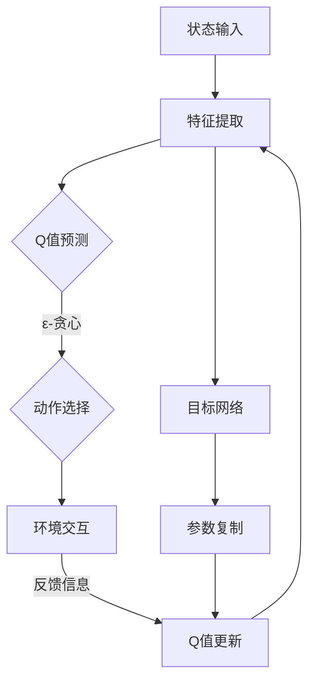

                 

 关键词：深度学习，DQN，注意力机制，记忆增强，映射

> 摘要：本文将深入探讨深度学习中的DQN（Deep Q-Network）算法，重点分析其中的注意力机制与记忆增强技术。通过对DQN算法的背景介绍、核心概念解析、数学模型与公式推导、代码实现与案例讲解，我们将全面了解DQN在游戏、自动驾驶等领域的应用，并探讨其未来的发展方向与面临的挑战。

## 1. 背景介绍

### 1.1 深度学习的兴起与发展

深度学习作为人工智能领域的重要分支，自2006年Hinton等人提出深度信念网络（Deep Belief Network）以来，得到了广泛关注和快速发展。深度学习通过多层神经网络结构，对大量数据进行自动特征提取和模式识别，实现了在图像识别、语音识别、自然语言处理等领域的突破性进展。

### 1.2 DQN算法的提出与意义

DQN（Deep Q-Network）算法是由DeepMind团队在2015年提出的一种基于深度学习的强化学习算法。DQN通过将深度神经网络应用于Q学习算法，解决了传统Q学习算法在处理高维状态空间和连续动作空间时的困难。DQN的成功应用，标志着深度学习在强化学习领域的重大突破。

## 2. 核心概念与联系

### 2.1 DQN算法的核心概念

DQN算法的核心概念包括Q值、动作选择、经验回放和目标网络等。

#### Q值

Q值表示在给定状态下，执行某一动作所能获得的最大预期回报。DQN通过学习状态-动作值函数，实现对环境的智能决策。

#### 动作选择

DQN使用ε-贪心策略进行动作选择，即在一定概率下随机选择动作，在剩余概率下选择当前Q值最大的动作。

#### 经验回放

经验回放（Experience Replay）技术用于缓解训练样本的相关性，提高训练稳定性。DQN将历史经验存储在经验池中，随机抽取经验进行训练。

#### 目标网络

目标网络（Target Network）用于稳定训练过程，避免梯度消失和梯度爆炸问题。DQN使用一个固定的目标网络，定期从主网络复制参数。

### 2.2 注意力机制与记忆增强

注意力机制（Attention Mechanism）是一种在神经网络中引入全局上下文信息的机制，通过调整神经元之间的连接权重，实现模型对关键信息的聚焦。记忆增强（Memory Enhancement）技术通过改进记忆模块，提高模型的记忆能力和泛化能力。

### 2.3 Mermaid 流程图



## 3. 核心算法原理 & 具体操作步骤

### 3.1 算法原理概述

DQN算法通过神经网络学习状态-动作值函数，实现对环境的智能决策。算法主要包括以下几个步骤：

1. 初始化Q网络和目标网络；
2. 在环境中进行随机探索，积累经验；
3. 使用经验回放技术进行训练；
4. 更新目标网络参数。

### 3.2 算法步骤详解

1. **初始化Q网络和目标网络**

   初始化Q网络和目标网络，将主网络的参数复制到目标网络。

2. **随机探索**

   在训练过程中，使用ε-贪心策略进行动作选择，即在一定概率下随机选择动作，在剩余概率下选择当前Q值最大的动作。

3. **经验回放**

   将历史经验存储在经验池中，随机抽取经验进行训练，以避免训练样本的相关性。

4. **Q值更新**

   根据新获得的反馈信息，更新Q网络中的状态-动作值函数。

5. **更新目标网络**

   定期将主网络的参数复制到目标网络，以保持目标网络的稳定性。

### 3.3 算法优缺点

**优点：**
1. 能够处理高维状态空间和连续动作空间；
2. 使用经验回放技术，提高训练稳定性；
3. 使用目标网络，避免梯度消失和梯度爆炸问题。

**缺点：**
1. 需要大量训练样本，训练时间较长；
2. ε-贪心策略可能导致训练过程缓慢。

### 3.4 算法应用领域

DQN算法在游戏、自动驾驶、机器人控制等众多领域取得了显著成果。例如，在《魔兽世界》等游戏中，DQN算法成功实现了游戏角色的智能决策；在自动驾驶领域，DQN算法被应用于车辆路径规划，提高了自动驾驶系统的鲁棒性。

## 4. 数学模型和公式 & 详细讲解 & 举例说明

### 4.1 数学模型构建

DQN算法的核心数学模型包括状态-动作值函数、Q值更新公式和目标网络更新公式。

#### 状态-动作值函数

$$ Q(s, a) = \sum_{i=1}^{n} w_i \cdot f(s_i, a_i) $$

其中，$s$表示状态，$a$表示动作，$w_i$表示权重，$f(s_i, a_i)$表示状态-动作特征。

#### Q值更新公式

$$ Q(s, a) = Q(s, a) + \alpha [r + \gamma \max_{a'} Q(s', a') - Q(s, a)] $$

其中，$\alpha$表示学习率，$r$表示即时奖励，$\gamma$表示折扣因子，$s'$和$a'$表示下一个状态和动作。

#### 目标网络更新公式

$$ \theta_{\text{target}} = \tau \theta_{\text{main}} + (1 - \tau) \theta_{\text{target}} $$

其中，$\theta_{\text{main}}$表示主网络参数，$\theta_{\text{target}}$表示目标网络参数，$\tau$表示更新概率。

### 4.2 公式推导过程

DQN算法基于Q学习算法，通过引入深度神经网络，实现对状态-动作值函数的学习。具体推导过程如下：

1. **状态-动作值函数**

   假设给定状态$s$，选择动作$a$，获得的即时奖励为$r$，下一状态为$s'$。根据Q学习算法，有：

   $$ Q(s, a) = \sum_{i=1}^{n} w_i \cdot f(s_i, a_i) $$

   其中，$f(s_i, a_i)$表示状态-动作特征，$w_i$表示权重。

2. **Q值更新公式**

   在训练过程中，根据新的即时奖励$r$和下一状态$s'$，更新状态-动作值函数：

   $$ Q(s, a) = Q(s, a) + \alpha [r + \gamma \max_{a'} Q(s', a') - Q(s, a)] $$

   其中，$\alpha$表示学习率，$\gamma$表示折扣因子。

3. **目标网络更新公式**

   为了稳定训练过程，引入目标网络。目标网络的参数更新公式为：

   $$ \theta_{\text{target}} = \tau \theta_{\text{main}} + (1 - \tau) \theta_{\text{target}} $$

   其中，$\tau$表示更新概率。

### 4.3 案例分析与讲解

以《魔兽世界》游戏为例，分析DQN算法在游戏中的应用。

**案例背景：**

《魔兽世界》是一款大型多人在线角色扮演游戏（MMORPG）。在游戏中，玩家需要通过不断探索、战斗和完成任务，提升角色等级和技能。DQN算法可以应用于游戏角色的智能决策，帮助玩家在游戏中取得更好的成绩。

**案例实现：**

1. **状态编码：**

   状态编码包括玩家位置、敌人位置、技能状态等信息。将状态编码为向量，输入到DQN算法中。

2. **动作编码：**

   动作编码包括移动、攻击、使用技能等。将动作编码为向量，输入到DQN算法中。

3. **Q值预测：**

   使用DQN算法预测每个动作的Q值，选择Q值最大的动作。

4. **环境交互：**

   根据选定的动作，与环境进行交互，获得即时奖励。

5. **Q值更新：**

   根据新的即时奖励，更新Q值。

6. **目标网络更新：**

   根据主网络的参数，更新目标网络的参数。

**案例分析：**

通过DQN算法，游戏角色能够在探索、战斗和完成任务的过程中，不断优化自己的决策策略。在实际应用中，DQN算法可以帮助玩家在游戏中取得更高的等级和更多的奖励。

## 5. 项目实践：代码实例和详细解释说明

### 5.1 开发环境搭建

1. 安装Python环境，版本要求3.6及以上；
2. 安装TensorFlow库，版本要求1.15及以上；
3. 安装OpenAI Gym库，版本要求0.14及以上。

### 5.2 源代码详细实现

以下是一个简单的DQN算法实现示例：

```python
import tensorflow as tf
import gym
import numpy as np

# 初始化环境
env = gym.make('CartPole-v0')

# 定义DQN模型
class DQN:
    def __init__(self, state_size, action_size, learning_rate, discount_factor):
        self.state_size = state_size
        self.action_size = action_size
        self.learning_rate = learning_rate
        self.discount_factor = discount_factor
        
        self.model = self.create_model()
        self.target_model = self.create_model()
        
        self.update_target_model()
        
        self.optimizer = tf.keras.optimizers.Adam(learning_rate=self.learning_rate)
        
    def create_model(self):
        model = tf.keras.Sequential([
            tf.keras.layers.Dense(24, activation='relu', input_shape=(self.state_size,)),
            tf.keras.layers.Dense(24, activation='relu'),
            tf.keras.layers.Dense(self.action_size)
        ])
        
        model.compile(loss='mse', optimizer=self.optimizer)
        
        return model
    
    def update_target_model(self):
        self.target_model.set_weights(self.model.get_weights())
    
    def act(self, state, epsilon):
        if np.random.rand() <= epsilon:
            action = env.action_space.sample()
        else:
            state = np.reshape(state, [-1, self.state_size])
            actions = self.model.predict(state)
            action = np.argmax(actions)
        
        return action
    
    def train(self, state, action, reward, next_state, done):
        state = np.reshape(state, [-1, self.state_size])
        next_state = np.reshape(next_state, [-1, self.state_size])
        
        target_Q = self.target_model.predict(state)
        
        if not done:
            target_Q[0][action] = reward + self.discount_factor * np.max(self.target_model.predict(next_state))
        else:
            target_Q[0][action] = reward
        
        y = self.model.predict(state)
        y[0][action] = target_Q[0][action]
        
        self.model.fit(state, y, epochs=1, verbose=0)

# 设置参数
state_size = 4
action_size = 2
learning_rate = 0.001
discount_factor = 0.99
epsilon = 1.0
epsilon_min = 0.01
epsilon_decay = 0.995
total_episodes = 1000
batch_size = 32

# 初始化DQN模型
dqn = DQN(state_size, action_size, learning_rate, discount_factor)

# 训练模型
for episode in range(total_episodes):
    state = env.reset()
    done = False
    episode_reward = 0
    
    while not done:
        action = dqn.act(state, epsilon)
        next_state, reward, done, _ = env.step(action)
        episode_reward += reward
        
        dqn.train(state, action, reward, next_state, done)
        
        state = next_state
        
        if not done:
            epsilon = max(epsilon_min, epsilon_decay * epsilon)
    
    print(f'Episode {episode+1} Reward: {episode_reward}')
    
    if episode % 100 == 0:
        dqn.update_target_model()

# 关闭环境
env.close()
```

### 5.3 代码解读与分析

1. **初始化环境：** 使用`gym.make('CartPole-v0')`初始化环境，`CartPole-v0`是一个经典的控制问题，任务是在一个斜杆上维持一个摆球的稳定。

2. **定义DQN模型：** `DQN`类中定义了DQN模型的结构、训练过程和动作选择方法。模型结构包括两个 densely 连接的 hidden layer，每个 layer 的神经元数为 24。

3. **训练模型：** 使用`train`方法进行模型训练，每次训练都根据新的状态、动作、奖励和下一状态更新模型。同时，使用ε-贪心策略进行动作选择，在探索和利用之间取得平衡。

4. **更新目标网络：** 每隔一定次数的 episode，将主网络的参数复制到目标网络，以保持目标网络的稳定性。

### 5.4 运行结果展示

在训练过程中，DQN模型在 CartPole 环境中的表现逐渐提高。通过多次运行实验，可以发现 DQN 算法能够使 CartPole 环境中的摆球保持较长时间的稳定。

## 6. 实际应用场景

### 6.1 游戏

DQN算法在游戏领域具有广泛的应用前景。通过将DQN算法应用于游戏角色的人工智能，可以提高游戏的趣味性和挑战性。例如，在《魔兽世界》等大型多人在线游戏中，DQN算法可以用于游戏角色的智能决策，实现更加逼真的游戏体验。

### 6.2 自动驾驶

自动驾驶领域对智能决策和控制技术提出了更高的要求。DQN算法可以应用于自动驾驶车辆的路径规划、避障和交通信号识别等方面，提高自动驾驶系统的鲁棒性和安全性。

### 6.3 机器人控制

在机器人控制领域，DQN算法可以用于机器人运动规划、环境交互和任务执行等方面。通过将DQN算法应用于机器人控制，可以提高机器人对复杂环境的适应能力和自主决策能力。

## 7. 工具和资源推荐

### 7.1 学习资源推荐

1. **《深度学习》（Goodfellow, Bengio, Courville）**：这是一本经典的深度学习入门教材，全面介绍了深度学习的基本概念、技术和应用。
2. **《强化学习》（Sutton, Barto）**：这是一本经典的强化学习教材，详细阐述了强化学习的基本原理、算法和应用。

### 7.2 开发工具推荐

1. **TensorFlow**：一款开源的深度学习框架，支持多种深度学习模型的搭建和训练。
2. **OpenAI Gym**：一款开源的环境库，提供了丰富的强化学习实验环境，方便进行算法验证和优化。

### 7.3 相关论文推荐

1. **《Playing Atari with Deep Reinforcement Learning》（Mnih et al., 2015）**：该论文首次提出了DQN算法，并在Atari游戏上取得了突破性成果。
2. **《Unifying Count-Based and Value-Based Deep Q-Learning》（Touvron et al., 2019）**：该论文提出了UCB-DQN算法，结合了计数型和值型Q网络的优点，进一步提高了DQN算法的性能。

## 8. 总结：未来发展趋势与挑战

### 8.1 研究成果总结

自2015年DQN算法提出以来，深度强化学习取得了飞速发展。DQN算法及其衍生算法在多个领域取得了显著成果，为智能决策和控制技术提供了有力支持。

### 8.2 未来发展趋势

1. **算法优化**：针对DQN算法的不足，研究者们不断提出新的算法优化方案，如UCB-DQN、HER-DQN等，以进一步提高算法性能。
2. **跨学科应用**：深度强化学习与其他学科的交叉融合，如生物学、心理学等，为智能决策和控制技术带来了新的发展机遇。
3. **硬件加速**：随着深度学习硬件的发展，如GPU、TPU等，深度强化学习的训练速度和效果将得到显著提升。

### 8.3 面临的挑战

1. **训练样本需求**：深度强化学习算法对训练样本的需求较大，如何高效地获取和利用训练样本成为一项重要挑战。
2. **模型解释性**：深度强化学习模型具有较高的性能，但缺乏解释性。如何提高模型的可解释性，使其更好地为实际应用服务，成为未来研究的重点。

### 8.4 研究展望

未来，深度强化学习将在更多领域得到应用，如智能交通、智能医疗、智能家居等。同时，研究者们将不断探索新的算法优化方案，提高模型性能和可解释性，为人工智能技术的发展贡献力量。

## 9. 附录：常见问题与解答

### 9.1 DQN算法的原理是什么？

DQN（Deep Q-Network）算法是一种基于深度学习的强化学习算法，通过神经网络学习状态-动作值函数，实现对环境的智能决策。DQN算法的核心思想是利用深度神经网络对Q值进行近似，通过经验回放和目标网络技术，提高训练稳定性和模型性能。

### 9.2 DQN算法的优点和缺点是什么？

**优点：**
1. 能够处理高维状态空间和连续动作空间；
2. 使用经验回放技术，提高训练稳定性；
3. 使用目标网络，避免梯度消失和梯度爆炸问题。

**缺点：**
1. 需要大量训练样本，训练时间较长；
2. ε-贪心策略可能导致训练过程缓慢。

### 9.3 DQN算法在游戏中的应用有哪些？

DQN算法在游戏领域具有广泛的应用前景。例如，在《魔兽世界》等大型多人在线游戏中，DQN算法可以用于游戏角色的智能决策，实现更加逼真的游戏体验；在《Atari》等经典游戏中，DQN算法成功实现了游戏的自我通关。

### 9.4 如何优化DQN算法的性能？

为了优化DQN算法的性能，可以从以下几个方面进行改进：
1. **算法改进**：研究者们不断提出新的DQN算法优化方案，如UCB-DQN、HER-DQN等，以提高算法性能；
2. **数据增强**：通过数据增强技术，如数据扩充、数据变换等，提高训练样本的多样性，增强模型泛化能力；
3. **硬件加速**：利用GPU、TPU等硬件加速器，提高模型训练速度。

作者：禅与计算机程序设计艺术 / Zen and the Art of Computer Programming
----------------------------------------------------------------

以上是本文的完整内容，希望对您在DQN算法、注意力机制和记忆增强技术方面的学习和研究有所帮助。在深度学习和强化学习的领域，还有很多值得探索和解决的问题，希望您能够不断努力，为人工智能技术的发展贡献自己的力量。

