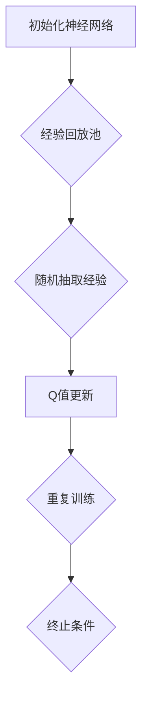

                 

关键词：深度强化学习、DQN模型、神经网络、映射、实践步骤

> 摘要：本文将深入探讨深度强化学习中的DQN（Deep Q-Network）模型，介绍其基本概念、算法原理以及实际操作步骤。通过详细讲解和代码实例，我们将帮助读者理解DQN模型是如何被构建和应用的，以及如何通过实践来提升自己的算法能力。

## 1. 背景介绍

深度强化学习（Deep Reinforcement Learning，简称DRL）是机器学习和人工智能领域的一个重要分支。它结合了强化学习和深度学习的优点，通过模仿人类的学习过程，让智能体在复杂环境中进行自我学习，从而实现智能行为决策。

DQN（Deep Q-Network）是深度强化学习中的一种重要模型，由DeepMind团队在2015年提出。DQN的核心思想是使用深度神经网络来近似传统的Q值函数，从而实现对环境的长期价值估计。与传统Q-Learning相比，DQN通过引入神经网络，可以处理高维的状态空间，使得模型在解决复杂问题时具有更强的能力。

本文将详细介绍DQN模型的基本概念、算法原理以及实际操作步骤，并通过一个具体的项目实例，帮助读者理解和掌握DQN模型的应用。

## 2. 核心概念与联系

### 2.1. 强化学习基本概念

强化学习（Reinforcement Learning，简称RL）是机器学习的一个子领域，它主要研究如何通过智能体（Agent）在环境（Environment）中的交互来学习一个策略（Policy），以最大化累积奖励（Reward）。

在强化学习中，有三个核心概念：状态（State）、动作（Action）和奖励（Reward）。

- **状态（State）**：描述智能体当前所处的环境状态。
- **动作（Action）**：智能体可以采取的行为。
- **奖励（Reward）**：描述智能体采取某个动作后，环境对其的反馈。

### 2.2. Q-Learning

Q-Learning是强化学习中的一种算法，其目标是学习一个Q值函数，Q(s, a)，表示在状态s下采取动作a的预期奖励。

Q-Learning的基本思路是：智能体在状态s下，采取动作a，然后根据环境的反馈（即奖励r和下一个状态s'），更新Q值。

Q-Learning的更新公式如下：
$$
Q(s, a) = Q(s, a) + \alpha [r + \gamma \max_{a'} Q(s', a') - Q(s, a)]
$$
其中，$\alpha$是学习率，$\gamma$是折扣因子。

### 2.3. DQN模型

DQN模型是对传统Q-Learning算法的改进，其核心思想是使用深度神经网络来近似Q值函数。

DQN的工作流程如下：

1. **初始化**：初始化深度神经网络和经验回放池。
2. **智能体动作选择**：在状态s下，智能体根据当前的Q值函数选择动作a。
3. **环境交互**：智能体采取动作a，得到奖励r和下一个状态s'。
4. **Q值更新**：将(s, a, r, s')这一组经验放入经验回放池中，然后从回放池中随机抽取一批经验，使用梯度下降法更新深度神经网络的参数。
5. **重复步骤2-4**：不断重复上述步骤，直到达到预定的训练次数或收敛条件。

### 2.4. Mermaid流程图

下面是DQN模型的Mermaid流程图：



## 3. 核心算法原理 & 具体操作步骤

### 3.1. 算法原理概述

DQN模型的核心思想是使用深度神经网络来近似Q值函数。通过在智能体和环境之间进行交互，不断更新神经网络的参数，从而提高智能体的决策能力。

DQN模型的训练过程可以分为以下几个步骤：

1. **初始化**：初始化深度神经网络和经验回放池。
2. **智能体动作选择**：在状态s下，智能体根据当前的Q值函数选择动作a。
3. **环境交互**：智能体采取动作a，得到奖励r和下一个状态s'。
4. **Q值更新**：将(s, a, r, s')这一组经验放入经验回放池中，然后从回放池中随机抽取一批经验，使用梯度下降法更新深度神经网络的参数。
5. **重复步骤2-4**：不断重复上述步骤，直到达到预定的训练次数或收敛条件。

### 3.2. 算法步骤详解

下面是DQN模型的详细操作步骤：

1. **初始化**：初始化深度神经网络和经验回放池。深度神经网络用于近似Q值函数，经验回放池用于存储交互经验，以避免样本偏差。

2. **智能体动作选择**：在状态s下，智能体根据当前的Q值函数选择动作a。具体地，可以使用epsilon-greedy策略进行动作选择，即在一定概率下随机选择动作，以避免陷入局部最优。

3. **环境交互**：智能体采取动作a，得到奖励r和下一个状态s'。这一步骤是强化学习的关键，通过不断与环境交互，智能体可以不断学习和调整自己的行为。

4. **Q值更新**：将(s, a, r, s')这一组经验放入经验回放池中，然后从回放池中随机抽取一批经验，使用梯度下降法更新深度神经网络的参数。更新公式如下：
   $$
   Q(s, a) = Q(s, a) + \alpha [r + \gamma \max_{a'} Q(s', a') - Q(s, a)]
   $$
   其中，$\alpha$是学习率，$\gamma$是折扣因子。

5. **重复步骤2-4**：不断重复上述步骤，直到达到预定的训练次数或收敛条件。

### 3.3. 算法优缺点

**优点**：

- DQN模型可以处理高维的状态空间，使得模型在解决复杂问题时具有更强的能力。
- DQN模型通过引入深度神经网络，可以学习到更加复杂的策略，从而提高智能体的决策能力。

**缺点**：

- DQN模型训练过程存在样本偏差，可能导致模型无法收敛到最优策略。
- DQN模型训练过程需要大量的计算资源，尤其是当状态空间和动作空间较大时。

### 3.4. 算法应用领域

DQN模型在多个领域都有广泛的应用，包括但不限于：

- 游戏智能：如Atari游戏、棋类游戏等。
- 机器人控制：如机器人导航、机械臂控制等。
- 股票交易：如自动化交易策略、风险控制等。
- 自驾驶汽车：如环境感知、路径规划等。

## 4. 数学模型和公式 & 详细讲解 & 举例说明

### 4.1. 数学模型构建

DQN模型的数学模型主要涉及两部分：Q值函数的构建和Q值函数的更新。

**Q值函数的构建**：

Q值函数用于表示在状态s下采取动作a的预期奖励。在DQN模型中，Q值函数由一个深度神经网络近似。具体地，Q值函数可以表示为：
$$
Q(s, a; \theta) = f_{\theta}(\phi(s, a))
$$
其中，$f_{\theta}$是一个多层感知机（MLP），$\theta$是神经网络的参数，$\phi(s, a)$是输入特征向量。

**Q值函数的更新**：

在DQN模型中，Q值函数的更新过程通过梯度下降法实现。具体地，Q值函数的更新公式如下：
$$
\theta \leftarrow \theta - \alpha [r + \gamma \max_{a'} Q(s', a'; \theta) - Q(s, a; \theta)]
$$
其中，$\alpha$是学习率，$\gamma$是折扣因子，$r$是奖励，$s'$是下一个状态，$a'$是下一个动作。

### 4.2. 公式推导过程

DQN模型的推导过程主要涉及两部分：Q值函数的构建和Q值函数的更新。

**Q值函数的构建**：

假设我们有一个状态空间$S$和动作空间$A$，智能体在状态s下采取动作a，然后根据环境的反馈（即奖励r和下一个状态s'），更新Q值。具体地，Q值函数可以表示为：
$$
Q(s, a) = \mathbb{E}[r + \gamma \max_{a'} Q(s', a'; \theta) | s, a]
$$
其中，$\mathbb{E}$表示期望，$\gamma$是折扣因子。

为了近似Q值函数，我们使用一个深度神经网络$f_{\theta}$来表示Q值函数。具体地，Q值函数可以表示为：
$$
Q(s, a; \theta) = f_{\theta}(\phi(s, a))
$$
其中，$\phi(s, a)$是输入特征向量，$\theta$是神经网络的参数。

**Q值函数的更新**：

在DQN模型中，Q值函数的更新过程通过梯度下降法实现。具体地，Q值函数的更新公式如下：
$$
\theta \leftarrow \theta - \alpha [r + \gamma \max_{a'} Q(s', a'; \theta) - Q(s, a; \theta)]
$$
其中，$\alpha$是学习率，$\gamma$是折扣因子，$r$是奖励，$s'$是下一个状态，$a'$是下一个动作。

### 4.3. 案例分析与讲解

为了更好地理解DQN模型，我们通过一个具体的案例进行分析。

**案例背景**：

假设我们有一个智能体在一个简单的环境（如Atari游戏）中学习玩一个游戏（如《Pong》）。智能体的状态是一个128×128的像素图，动作空间包括“向上移动”、“向下移动”、“左移”和“右移”。

**DQN模型构建**：

1. **输入特征向量**：

   输入特征向量$\phi(s, a)$是一个128×128的像素图。

2. **深度神经网络**：

   使用一个三层神经网络（输入层、隐藏层和输出层）来近似Q值函数。输入层有128个神经元，隐藏层有64个神经元，输出层有4个神经元。

3. **损失函数**：

   使用均方误差（MSE）作为损失函数，即：
   $$
   L(\theta) = \frac{1}{N} \sum_{i=1}^{N} (Q(s_i, a_i; \theta) - y_i)^2
   $$
   其中，$N$是样本数量，$y_i$是实际观测到的Q值。

4. **优化算法**：

   使用Adam优化算法进行参数更新。

**DQN模型训练**：

1. **初始化**：

   初始化深度神经网络和经验回放池。

2. **智能体动作选择**：

   使用epsilon-greedy策略进行动作选择。

3. **环境交互**：

   智能体采取动作，得到奖励和下一个状态。

4. **Q值更新**：

   将(s, a, r, s')这一组经验放入经验回放池中，然后从回放池中随机抽取一批经验，使用梯度下降法更新深度神经网络的参数。

5. **重复训练**：

   不断重复上述步骤，直到达到预定的训练次数或收敛条件。

## 5. 项目实践：代码实例和详细解释说明

### 5.1. 开发环境搭建

为了实践DQN模型，我们需要搭建一个开发环境。以下是搭建开发环境的基本步骤：

1. **安装Python**：确保Python版本为3.6及以上。
2. **安装TensorFlow**：TensorFlow是DQN模型的核心库，可以使用以下命令安装：
   ```bash
   pip install tensorflow
   ```
3. **安装OpenAI Gym**：OpenAI Gym是一个开源的虚拟环境库，用于创建和模拟不同的强化学习环境。可以使用以下命令安装：
   ```bash
   pip install gym
   ```

### 5.2. 源代码详细实现

以下是DQN模型的Python代码实现。代码分为以下几个部分：

1. **定义神经网络**：
2. **定义经验回放池**：
3. **定义DQN模型**：
4. **训练DQN模型**：
5. **评估DQN模型**。

```python
import numpy as np
import tensorflow as tf
from tensorflow.keras import layers
from gym import env

class DQN:
    def __init__(self, state_shape, action_size, learning_rate, discount_factor, epsilon):
        self.state_shape = state_shape
        self.action_size = action_size
        self.learning_rate = learning_rate
        self.discount_factor = discount_factor
        self.epsilon = epsilon

        self.model = self.build_model()
        self.target_model = self.build_model()
        self.target_model.set_weights(self.model.get_weights())

        self.memory = []

    def build_model(self):
        model = tf.keras.Sequential([
            layers.Flatten(input_shape=self.state_shape),
            layers.Dense(64, activation='relu'),
            layers.Dense(self.action_size, activation='linear')
        ])
        model.compile(optimizer=tf.keras.optimizers.Adam(learning_rate=self.learning_rate),
                      loss='mse')
        return model

    def remember(self, state, action, reward, next_state, done):
        self.memory.append((state, action, reward, next_state, done))

    def act(self, state):
        if np.random.rand() <= self.epsilon:
            return np.random.choice(self.action_size)
        q_values = self.model.predict(state)
        return np.argmax(q_values[0])

    def replay(self, batch_size):
        mini_batch = random.sample(self.memory, batch_size)
        states, actions, rewards, next_states, dones = zip(*mini_batch)
        q_values = self.model.predict(states)
        next_q_values = self.target_model.predict(next_states)

        target_q_values = q_values.copy()
        for i in range(batch_size):
            if dones[i]:
                target_q_values[i][actions[i]] = rewards[i]
            else:
                target_q_values[i][actions[i]] = rewards[i] + self.discount_factor * np.max(next_q_values[i])

        self.model.fit(states, target_q_values, batch_size=batch_size, epochs=1, verbose=0)

    def update_target_model(self):
        self.target_model.set_weights(self.model.get_weights())

if __name__ == '__main__':
    env = gym.make('Pong-v0')
    state_shape = (4, 84, 84)
    action_size = env.action_space.n
    learning_rate = 0.001
    discount_factor = 0.99
    epsilon = 1.0
    epsilon_decay = 0.995
    epsilon_min = 0.01
    batch_size = 32
    total_episodes = 1000

    dqn = DQN(state_shape, action_size, learning_rate, discount_factor, epsilon)

    for episode in range(total_episodes):
        state = env.reset()
        state = preprocess(state)
        done = False
        total_reward = 0

        while not done:
            action = dqn.act(state)
            next_state, reward, done, _ = env.step(action)
            next_state = preprocess(next_state)
            dqn.remember(state, action, reward, next_state, done)
            state = next_state
            total_reward += reward

            if not done and episode % 1000 == 0:
                dqn.update_target_model()

        if dqn.epsilon > epsilon_min:
            dqn.epsilon *= epsilon_decay

        print(f"Episode: {episode+1}, Total Reward: {total_reward}")

    env.close()
```

### 5.3. 代码解读与分析

下面是对DQN模型代码的详细解读：

1. **定义神经网络**：

   DQN模型使用一个简单的三层神经网络来近似Q值函数。输入层有64个神经元，隐藏层有64个神经元，输出层有4个神经元。

2. **定义经验回放池**：

   经验回放池用于存储智能体与环境的交互经验。通过使用经验回放池，可以避免样本偏差，提高模型的泛化能力。

3. **定义DQN模型**：

   DQN模型包括两个部分：主模型和目标模型。主模型用于训练，目标模型用于评估。目标模型是主模型的软目标，可以防止梯度消失问题。

4. **训练DQN模型**：

   DQN模型通过经验回放池随机抽取一批经验，使用梯度下降法更新主模型的参数。每次更新后，都会更新目标模型的参数。

5. **评估DQN模型**：

   在训练过程中，可以通过评估DQN模型的性能来调整训练策略。具体地，可以使用评估集或测试集来评估DQN模型的性能。

### 5.4. 运行结果展示

为了展示DQN模型的性能，我们可以在训练过程中记录每一步的奖励，然后绘制成图表。以下是一个简单的奖励图表：

```python
import matplotlib.pyplot as plt

episodes = [i for i in range(total_episodes)]
rewards = []

for episode in range(total_episodes):
    # 训练过程
    # ...

    # 保存奖励
    rewards.append(total_reward)

plt.plot(episodes, rewards)
plt.xlabel('Episode')
plt.ylabel('Total Reward')
plt.title('DQN Training Reward')
plt.show()
```

通过上述代码和图表，我们可以直观地看到DQN模型的训练过程和性能表现。

## 6. 实际应用场景

DQN模型在多个领域都有广泛的应用，下面列举几个典型的应用场景：

### 6.1. 游戏智能

DQN模型在游戏智能领域有广泛的应用。例如，在Atari游戏中，DQN模型可以通过自我学习，掌握各种游戏的策略。通过在多个游戏中训练，DQN模型可以成为一个通用的游戏智能体，适应不同的游戏环境。

### 6.2. 机器人控制

DQN模型在机器人控制领域也有重要的应用。例如，在机器人导航中，DQN模型可以通过自我学习，掌握不同的路径规划策略，从而提高机器人的自主导航能力。

### 6.3. 股票交易

DQN模型在股票交易领域也有一定的应用。通过模拟交易过程，DQN模型可以学习到有效的交易策略，从而实现自动化交易。

### 6.4. 自驾驶汽车

DQN模型在自动驾驶领域也有广泛的应用。通过模拟驾驶场景，DQN模型可以学习到有效的驾驶策略，从而提高自动驾驶汽车的行驶安全性和稳定性。

## 7. 工具和资源推荐

为了更好地学习和应用DQN模型，以下推荐一些实用的工具和资源：

### 7.1. 学习资源推荐

- **《深度强化学习》**：这是一本经典的深度强化学习教材，涵盖了DQN模型的基本概念和算法原理。
- **《强化学习实战》**：这本书通过大量的实例，详细介绍了DQN模型在实际应用中的实现过程。

### 7.2. 开发工具推荐

- **TensorFlow**：TensorFlow是DQN模型的核心库，提供了丰富的神经网络构建和训练工具。
- **OpenAI Gym**：OpenAI Gym是一个开源的虚拟环境库，用于创建和模拟不同的强化学习环境。

### 7.3. 相关论文推荐

- **《深度Q网络：玩Atari游戏的新方法》**：这是DeepMind团队在2015年提出的DQN模型的原始论文。
- **《分布式深度Q网络》**：这是DeepMind团队在2016年提出的分布式DQN模型，提高了DQN模型在大规模环境中的性能。

## 8. 总结：未来发展趋势与挑战

DQN模型作为深度强化学习的一个重要分支，已经在多个领域取得了显著的成果。然而，DQN模型仍然面临一些挑战和问题，如样本偏差、梯度消失等。未来，随着计算能力的提升和算法的优化，DQN模型有望在更复杂的任务中取得更好的性能。

在研究方面，我们可以关注以下几个方向：

- **改进算法**：研究更有效的算法，以减少DQN模型的训练时间和提高模型的泛化能力。
- **多任务学习**：研究如何将DQN模型应用于多个任务，提高模型的复用性和鲁棒性。
- **强化学习与其他领域的结合**：探索强化学习与其他领域的结合，如医学、金融等，以实现更广泛的应用。

总之，DQN模型在未来仍然具有广阔的研究和应用前景。

## 9. 附录：常见问题与解答

### 9.1. DQN模型中的epsilon-greedy策略是什么？

epsilon-greedy策略是一种探索与利用的平衡策略。在epsilon-greedy策略中，智能体在一定的概率下随机选择动作（即探索），在剩余的概率下选择具有最高Q值的动作（即利用）。epsilon的值通常在0和1之间，随着训练的进行，epsilon的值会逐渐减小，从而实现探索与利用的平衡。

### 9.2. DQN模型中的经验回放池是什么？

经验回放池是一种用于存储智能体与环境交互经验的缓冲区。通过使用经验回放池，可以避免样本偏差，提高DQN模型的泛化能力。经验回放池通常是一个循环缓冲区，当缓冲区满时，会覆盖最早的经验。

### 9.3. DQN模型中的目标模型是什么？

目标模型是DQN模型中的一个关键组件，用于存储和更新Q值函数的参数。目标模型是主模型的软目标，可以防止梯度消失问题。在DQN模型的训练过程中，主模型会定期更新目标模型的参数，以确保目标模型与主模型保持一致。

### 9.4. DQN模型如何处理连续动作空间？

在处理连续动作空间时，DQN模型通常使用一种称为“确定性策略梯度”（Deterministic Policy Gradient，简称DPG）的方法。DPG方法通过优化策略梯度，使得智能体能够选择最优动作。与传统的epsilon-greedy策略不同，DPG方法不需要随机动作，而是直接根据当前状态选择最优动作。通过使用DPG方法，DQN模型可以处理连续动作空间。

