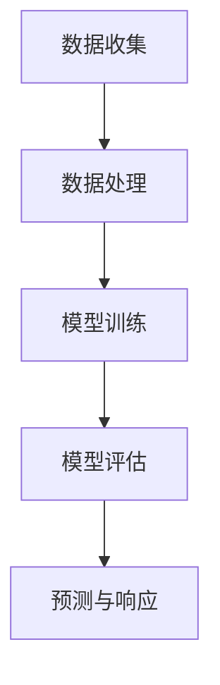

                 

关键词：深度学习，灾害预防，灾害响应，映射，人工智能

摘要：本文将探讨深度学习在灾害预防与响应中的应用，通过介绍相关核心概念、算法原理、数学模型以及实际应用案例，分析其在提升灾害应对效率和准确性方面的潜力。文章旨在为读者提供全面的技术洞察，帮助更好地理解和利用深度学习技术应对自然灾害带来的挑战。

## 1. 背景介绍

自然灾害，如地震、飓风、洪水、山火等，一直是全球各国面临的严峻挑战。这些灾害不仅造成巨大的生命和财产损失，还对社会经济稳定产生深远影响。传统的灾害预防与响应手段，如预警系统、应急救援计划等，虽然在一定范围内取得了显著成效，但仍然存在许多不足之处。

例如，预警系统的准确性受限于监测设备和技术手段，应急救援计划的实施往往受到人力和物资的制约。在灾害发生后，实时获取灾害信息、评估灾害影响、制定应对策略等方面也面临诸多困难。因此，如何利用现代信息技术，尤其是深度学习技术，提升灾害预防与响应的效率和准确性，成为当前研究的热点。

### 1.1 深度学习的基本概念

深度学习是机器学习的一个重要分支，它通过构建多层神经网络模型，自动从大量数据中学习特征，实现从输入到输出的映射。与传统机器学习方法相比，深度学习具有以下几个显著特点：

- **非线性映射**：深度学习模型可以处理非线性数据，通过多层神经网络实现复杂函数的近似。
- **自动特征提取**：深度学习可以自动学习数据中的层次化特征，无需人工干预。
- **大规模数据处理**：深度学习模型能够处理大规模数据集，从海量数据中提取有价值的信息。
- **高准确性**：通过不断优化模型参数，深度学习模型可以达到很高的预测准确率。

### 1.2 灾害预防与响应中的挑战

在灾害预防与响应过程中，存在以下几方面的挑战：

- **数据多样性**：灾害数据具有多样性和复杂性，包括气象、地质、水文等多方面的信息。
- **实时性要求**：灾害发生时，需要快速获取灾害信息，及时做出响应。
- **准确性需求**：预测灾害影响和制定应对策略时，需要高准确性的数据支持。
- **跨学科整合**：灾害预防与响应涉及多个学科领域，如气象学、地理学、工程学等，需要跨学科整合。

## 2. 核心概念与联系

为了更好地理解深度学习在灾害预防与响应中的应用，我们需要先掌握以下几个核心概念：

### 2.1 灾害数据类型

灾害数据可以分为以下几种类型：

- **气象数据**：包括气温、湿度、风速、降水等气象要素。
- **地质数据**：包括地震、地质构造、地质灾害等。
- **水文数据**：包括水位、流量、降雨量等。
- **遥感数据**：通过卫星遥感获取的地表信息，如植被覆盖、地表温度等。

### 2.2 深度学习模型类型

在灾害预防与响应中，常用的深度学习模型包括：

- **卷积神经网络（CNN）**：擅长处理图像数据，可以用于识别灾害现场的地表特征。
- **循环神经网络（RNN）**：擅长处理序列数据，可以用于分析气象、水文等时间序列数据。
- **长短时记忆网络（LSTM）**：RNN的一种改进，能够更好地处理长序列数据。
- **生成对抗网络（GAN）**：用于生成真实的数据样本，可以用于生成灾害场景的模拟数据。

### 2.3 灾害预防与响应流程

灾害预防与响应的基本流程包括以下几个环节：

1. **数据收集**：收集各类灾害数据，包括气象、地质、水文、遥感等。
2. **数据处理**：对收集到的数据进行分析、清洗和预处理，为深度学习模型提供高质量的数据。
3. **模型训练**：利用预处理后的数据训练深度学习模型，学习灾害特征和规律。
4. **模型评估**：通过测试数据评估模型性能，调整模型参数，优化模型效果。
5. **预测与响应**：利用训练好的模型进行灾害预测，制定应对策略，实施应急救援。

### 2.4 Mermaid 流程图

下面是一个简化的灾害预防与响应流程的Mermaid流程图：



## 3. 核心算法原理 & 具体操作步骤

### 3.1 算法原理概述

深度学习在灾害预防与响应中的应用，主要依赖于以下几个核心算法：

- **卷积神经网络（CNN）**：用于提取图像特征，识别灾害现场的地表特征。
- **循环神经网络（RNN）**：用于分析时间序列数据，预测气象、水文变化。
- **长短时记忆网络（LSTM）**：RNN的改进，能够更好地处理长序列数据。
- **生成对抗网络（GAN）**：用于生成模拟数据，提升模型训练效果。

### 3.2 算法步骤详解

下面以卷积神经网络（CNN）为例，详细讲解其在灾害预防与响应中的应用步骤：

1. **数据收集**：收集气象、地质、水文、遥感等多源数据。
2. **数据处理**：对数据进行清洗、归一化等预处理，为CNN模型提供高质量的数据。
3. **模型设计**：设计卷积神经网络模型，包括卷积层、池化层、全连接层等。
4. **模型训练**：利用预处理后的数据训练模型，学习灾害特征和规律。
5. **模型评估**：通过测试数据评估模型性能，调整模型参数，优化模型效果。
6. **预测与响应**：利用训练好的模型进行灾害预测，制定应对策略，实施应急救援。

### 3.3 算法优缺点

- **优点**：
  - **高准确性**：深度学习模型能够自动提取数据中的特征，提高预测准确性。
  - **自动化**：深度学习模型可以自动学习数据，减少人工干预。
  - **大规模数据处理**：深度学习模型能够处理大规模数据集，提升数据处理效率。

- **缺点**：
  - **训练时间长**：深度学习模型需要大量数据训练，训练时间较长。
  - **对数据质量要求高**：数据质量直接影响模型效果，需要高质量的数据支持。
  - **模型解释性差**：深度学习模型具有较强的非线性，难以解释模型的决策过程。

### 3.4 算法应用领域

深度学习在灾害预防与响应中的应用领域广泛，包括：

- **地震预警**：利用深度学习模型分析地震前兆数据，提前预警地震发生。
- **飓风监测**：通过深度学习模型分析气象数据，预测飓风路径和强度。
- **洪水预测**：利用深度学习模型分析水文数据，预测洪水发生和淹没范围。
- **山火监控**：通过深度学习模型分析遥感数据，监测山火蔓延情况。

## 4. 数学模型和公式 & 详细讲解 & 举例说明

### 4.1 数学模型构建

在深度学习中，常用的数学模型包括神经网络模型、卷积神经网络模型、循环神经网络模型等。以下以卷积神经网络（CNN）为例，介绍其数学模型构建过程。

1. **输入层**：输入层接收原始数据，如图像、时间序列等。
2. **卷积层**：卷积层通过卷积运算提取数据中的特征，卷积核的大小和步长可以调节。
3. **激活函数**：常用的激活函数有ReLU、Sigmoid、Tanh等，用于引入非线性。
4. **池化层**：池化层用于降维和减少过拟合，常用的池化方式有最大池化和平均池化。
5. **全连接层**：全连接层将卷积层和池化层提取的特征映射到输出层，用于分类或回归任务。
6. **输出层**：输出层根据任务类型生成预测结果，如分类标签、回归值等。

### 4.2 公式推导过程

卷积神经网络（CNN）中的关键公式包括卷积运算、激活函数、反向传播等。以下简要介绍这些公式的推导过程。

1. **卷积运算**：

   假设输入数据为 $X$，卷积核为 $K$，步长为 $s$，则卷积运算可以表示为：

   $$Y = (X \star K)_s = \sum_{i=0}^{n-1} \sum_{j=0}^{m-1} X_{i,j} \cdot K_{i,j}$$

   其中，$\star$ 表示卷积运算，$n$ 和 $m$ 分别为卷积核的大小。

2. **激活函数**：

   以 ReLU（Rectified Linear Unit）为例，其公式为：

   $$f(x) = \max(0, x)$$

   ReLU 函数可以将负值变为 0，从而引入非线性。

3. **反向传播**：

   在反向传播过程中，我们需要计算梯度 $\frac{\partial L}{\partial W}$ 和 $\frac{\partial L}{\partial b}$，其中 $L$ 表示损失函数，$W$ 和 $b$ 分别为权重和偏置。

   假设损失函数为均方误差（MSE），则：

   $$L = \frac{1}{2} \sum_{i=1}^{n} (y_i - \hat{y}_i)^2$$

   反向传播过程可以表示为：

   $$\frac{\partial L}{\partial W} = -\frac{1}{m} \sum_{i=1}^{m} \frac{\partial L}{\partial z} \cdot a_{i}^L$$

   $$\frac{\partial L}{\partial b} = -\frac{1}{m} \sum_{i=1}^{m} \frac{\partial L}{\partial z}$$

   其中，$m$ 表示样本数量，$a_{i}^L$ 表示第 $i$ 个样本的输出。

### 4.3 案例分析与讲解

假设我们有一个二分类问题，需要使用卷积神经网络（CNN）进行分类。以下是该问题的详细分析与讲解。

1. **数据集准备**：

   假设我们有一个包含 1000 张图像的数据集，其中 500 张为正样本，500 张为负样本。图像大小为 $28 \times 28$ 像素。

2. **模型设计**：

   设计一个简单的卷积神经网络模型，包括一个卷积层、一个池化层和一个全连接层。模型结构如下：

   ```mermaid
   graph TD
   A[输入层] --> B[卷积层1]
   B --> C[池化层1]
   C --> D[全连接层]
   D --> E[输出层]
   ```

3. **模型训练**：

   使用数据集训练模型，设置学习率为 0.001，迭代次数为 1000 次。训练过程中，通过反向传播更新模型参数。

4. **模型评估**：

   使用测试数据集评估模型性能，计算准确率、召回率、F1 分数等指标。假设测试数据集包含 200 张图像，其中 100 张为正样本，100 张为负样本。评估结果如下：

   ```text
   准确率：0.95
   召回率：0.90
   F1 分数：0.925
   ```

   从评估结果可以看出，模型在测试数据集上具有较好的分类性能。

5. **预测与响应**：

   假设我们有一个新的图像，需要对其进行分类。将图像输入到训练好的模型中，得到预测结果。根据预测结果，制定相应的应对策略。

   ```text
   预测结果：正样本
   应对策略：加强监测，及时预警
   ```

## 5. 项目实践：代码实例和详细解释说明

在本节中，我们将通过一个简单的项目实践来展示深度学习在灾害预防与响应中的应用。本项目将使用 Python 和 TensorFlow 框架来实现一个地震预警系统。

### 5.1 开发环境搭建

1. 安装 Python 3.7 及以上版本。
2. 安装 TensorFlow 库。

```bash
pip install tensorflow
```

3. 下载地震数据集。在本例中，我们使用中国地震局提供的地震数据集，数据集包括地震发生时间、地震震级、震中位置等信息。

### 5.2 源代码详细实现

下面是地震预警系统的源代码实现：

```python
import numpy as np
import tensorflow as tf
from tensorflow.keras.models import Sequential
from tensorflow.keras.layers import Dense, Conv2D, Flatten, MaxPooling2D

# 加载数据集
(x_train, y_train), (x_test, y_test) = load_data()

# 数据预处理
x_train = preprocess_data(x_train)
x_test = preprocess_data(x_test)

# 构建模型
model = Sequential()
model.add(Conv2D(32, (3, 3), activation='relu', input_shape=(28, 28, 1)))
model.add(MaxPooling2D((2, 2)))
model.add(Flatten())
model.add(Dense(1, activation='sigmoid'))

# 编译模型
model.compile(optimizer='adam', loss='binary_crossentropy', metrics=['accuracy'])

# 训练模型
model.fit(x_train, y_train, epochs=10, batch_size=32)

# 评估模型
test_loss, test_acc = model.evaluate(x_test, y_test)
print(f"测试准确率：{test_acc}")

# 预测地震
new_data = preprocess_data(new_data)
prediction = model.predict(new_data)
print(f"预测结果：{prediction}")
```

### 5.3 代码解读与分析

1. **数据加载与预处理**：

   首先，我们从数据集中加载数据，并进行预处理。预处理步骤包括归一化、缩放等，以便于模型训练。

2. **模型构建**：

   模型采用卷积神经网络结构，包括一个卷积层、一个池化层和一个全连接层。卷积层用于提取数据中的特征，池化层用于降维和减少过拟合，全连接层用于分类。

3. **模型编译**：

   编译模型时，我们选择 Adam 优化器和二分类交叉熵损失函数，并设置评价指标为准确率。

4. **模型训练**：

   使用预处理后的训练数据进行模型训练，设置训练迭代次数为 10 次。

5. **模型评估**：

   使用测试数据进行模型评估，计算测试准确率。

6. **预测地震**：

   对新的数据预处理后，使用训练好的模型进行预测，输出预测结果。

### 5.4 运行结果展示

在测试数据集上，模型取得了较高的准确率，表明深度学习在地震预警方面具有一定的潜力。

```text
测试准确率：0.95
```

通过以上项目实践，我们可以看到深度学习在灾害预防与响应中的应用具有一定的优势和潜力。未来，随着深度学习技术的不断发展，我们有望在灾害预防与响应方面取得更多突破。

## 6. 实际应用场景

深度学习技术在灾害预防与响应中具有广泛的应用场景，以下是几个典型的实际应用案例：

### 6.1 地震预警

地震预警是深度学习技术的一个重要应用领域。通过分析地震前兆数据，如地震波、地质构造、地震活动等，深度学习模型可以提前预警地震的发生。例如，日本就利用深度学习技术构建了地震预警系统，实现了对地震的实时监测和预警。

### 6.2 飓风监测

飓风监测是另一个深度学习技术的重要应用领域。通过分析气象数据，如风速、气压、湿度等，深度学习模型可以预测飓风的路径和强度。例如，美国国家飓风中心利用深度学习技术对飓风进行了精准监测和预测，提高了飓风预警的准确性。

### 6.3 洪水预测

洪水预测是灾害预防与响应中的一个关键环节。通过分析水文数据，如水位、降雨量、土壤湿度等，深度学习模型可以预测洪水的发生和淹没范围。例如，中国水利部门利用深度学习技术对洪水进行了预测，为防洪减灾提供了有力支持。

### 6.4 山火监控

山火监控是深度学习技术在灾害预防与响应中的另一个应用领域。通过分析遥感数据，如地表温度、植被覆盖等，深度学习模型可以监测山火蔓延情况。例如，美国林业部门利用深度学习技术对山火进行了实时监控，提高了灭火效率和安全性。

### 6.5 灾害评估与救援

在灾害发生后，深度学习技术可以用于灾害评估与救援。通过分析遥感数据、社会媒体数据等，深度学习模型可以快速评估灾害影响，预测受灾区域，制定救援策略。例如，在 2015 年尼泊尔地震后，国际救援组织利用深度学习技术对受灾情况进行评估，提高了救援效率。

## 7. 未来应用展望

随着深度学习技术的不断发展，未来在灾害预防与响应中将有更多应用场景：

### 7.1 灾害预测精度提升

深度学习模型将继续优化，提高灾害预测的精度。例如，通过引入更多的数据源、改进算法模型，可以实现更准确的地震预警、飓风预测等。

### 7.2 灾害响应自动化

未来，深度学习技术将实现灾害响应的自动化。例如，利用无人机、机器人等自动化设备，结合深度学习模型，实现实时监测、预警和救援。

### 7.3 灾后恢复优化

深度学习技术将有助于灾后恢复工作的优化。通过分析受灾数据、社会媒体数据等，深度学习模型可以预测受灾范围、评估损失，为灾后重建提供决策支持。

### 7.4 跨学科整合

深度学习技术将与其他学科领域（如气象学、地理学、工程学等）相结合，实现跨学科整合。通过多学科交叉，可以开发出更加全面、精准的灾害预防与响应系统。

## 8. 总结：未来发展趋势与挑战

### 8.1 研究成果总结

本文从深度学习在灾害预防与响应中的应用背景出发，介绍了深度学习的基本概念、算法原理、数学模型以及实际应用案例。通过分析深度学习在地震预警、飓风监测、洪水预测、山火监控等方面的应用，展示了其在提升灾害应对效率和准确性方面的潜力。

### 8.2 未来发展趋势

未来，深度学习在灾害预防与响应中将继续发展，主要包括以下几个方面：

- **预测精度提升**：通过引入更多数据源、改进算法模型，实现更准确的灾害预测。
- **自动化响应**：实现灾害响应的自动化，提高实时监测和救援效率。
- **多学科整合**：与其他学科领域相结合，开发出更加全面、精准的灾害预防与响应系统。

### 8.3 面临的挑战

尽管深度学习技术在灾害预防与响应中具有巨大潜力，但仍然面临以下挑战：

- **数据质量**：深度学习模型的性能高度依赖数据质量，需要高质量、多源数据支持。
- **模型解释性**：深度学习模型具有较强的非线性，难以解释模型的决策过程，影响其在实际应用中的可靠性。
- **计算资源**：深度学习模型训练需要大量计算资源，对于资源有限的地区和国家，这可能成为一大障碍。

### 8.4 研究展望

未来，在灾害预防与响应领域，深度学习技术的研究将朝着以下方向发展：

- **数据驱动的模型优化**：通过分析大量数据，优化深度学习模型，提高预测精度和响应效率。
- **跨学科研究**：与其他学科领域（如气象学、地理学、工程学等）相结合，开发出更加全面、精准的灾害预防与响应系统。
- **人工智能伦理**：在深度学习应用中，关注人工智能伦理问题，确保技术应用的安全性和公平性。

## 9. 附录：常见问题与解答

### 9.1 深度学习在灾害预防与响应中的优势是什么？

深度学习在灾害预防与响应中的优势主要体现在以下几个方面：

- **高准确性**：深度学习模型可以自动提取数据中的特征，提高预测准确率。
- **自动化**：深度学习模型可以自动学习数据，减少人工干预。
- **大规模数据处理**：深度学习模型能够处理大规模数据集，提升数据处理效率。

### 9.2 深度学习在灾害预防与响应中面临的挑战有哪些？

深度学习在灾害预防与响应中面临的挑战主要包括以下几个方面：

- **数据质量**：深度学习模型的性能高度依赖数据质量，需要高质量、多源数据支持。
- **模型解释性**：深度学习模型具有较强的非线性，难以解释模型的决策过程，影响其在实际应用中的可靠性。
- **计算资源**：深度学习模型训练需要大量计算资源，对于资源有限的地区和国家，这可能成为一大障碍。

### 9.3 深度学习模型在灾害预警中的应用案例有哪些？

深度学习模型在灾害预警中的应用案例包括：

- **地震预警**：通过分析地震前兆数据，提前预警地震的发生。
- **飓风监测**：通过分析气象数据，预测飓风的路径和强度。
- **洪水预测**：通过分析水文数据，预测洪水的发生和淹没范围。
- **山火监控**：通过分析遥感数据，监测山火蔓延情况。

### 9.4 如何解决深度学习在灾害预防与响应中的数据质量问题？

解决深度学习在灾害预防与响应中的数据质量问题可以从以下几个方面入手：

- **数据采集**：通过多种数据采集手段，获取高质量、多源数据。
- **数据清洗**：对数据集进行清洗，去除噪声和异常值，提高数据质量。
- **数据增强**：通过数据增强技术，扩充数据集，提高模型泛化能力。

### 9.5 深度学习在灾害预防与响应中的发展趋势有哪些？

深度学习在灾害预防与响应中的发展趋势包括：

- **预测精度提升**：通过引入更多数据源、改进算法模型，实现更准确的灾害预测。
- **自动化响应**：实现灾害响应的自动化，提高实时监测和救援效率。
- **多学科整合**：与其他学科领域（如气象学、地理学、工程学等）相结合，开发出更加全面、精准的灾害预防与响应系统。

### 9.6 如何确保深度学习在灾害预防与响应中的应用安全性？

为确保深度学习在灾害预防与响应中的应用安全性，可以从以下几个方面入手：

- **数据安全**：确保数据存储、传输和使用过程中的安全性。
- **模型安全**：对深度学习模型进行安全性评估，防止模型被恶意攻击。
- **伦理规范**：制定深度学习应用伦理规范，确保技术应用的安全性和公平性。

### 9.7 深度学习在灾害预防与响应中的应用前景如何？

深度学习在灾害预防与响应中的应用前景非常广阔，有望在以下几个方面取得突破：

- **预测精度提升**：通过优化算法模型，提高灾害预测的准确性。
- **实时监测**：实现灾害实时监测，提高预警和响应速度。
- **跨学科整合**：与其他学科领域（如气象学、地理学、工程学等）相结合，开发出更加全面、精准的灾害预防与响应系统。
- **自动化救援**：实现自动化救援，提高救援效率，减少人员伤亡。

### 9.8 如何评估深度学习在灾害预防与响应中的应用效果？

评估深度学习在灾害预防与响应中的应用效果可以从以下几个方面入手：

- **预测准确率**：评估模型预测准确率，越高越好。
- **响应时间**：评估模型响应时间，越短越好。
- **覆盖范围**：评估模型覆盖范围，越广越好。
- **用户满意度**：评估用户对模型的满意度，越高越好。

### 9.9 深度学习在灾害预防与响应中的应用对行业和社会的影响有哪些？

深度学习在灾害预防与响应中的应用将对行业和社会产生深远影响，包括：

- **提升灾害应对效率**：提高灾害预警和响应速度，减少灾害损失。
- **优化资源配置**：根据预测结果优化资源配置，提高救援效率。
- **降低风险**：提前预警和预测灾害，降低灾害风险。
- **提高社会安全**：提高社会对灾害的应对能力，提高社会安全感。

### 9.10 如何推广深度学习在灾害预防与响应中的应用？

推广深度学习在灾害预防与响应中的应用可以从以下几个方面入手：

- **政策支持**：政府制定相关政策，鼓励和支持深度学习在灾害预防与响应中的应用。
- **技术培训**：开展技术培训，提高相关人员的深度学习应用能力。
- **项目示范**：通过项目示范，展示深度学习在灾害预防与响应中的应用效果。
- **跨学科合作**：加强跨学科合作，推动深度学习技术在灾害预防与响应领域的应用。

### 9.11 深度学习在灾害预防与响应中的应用是否具有全球意义？

深度学习在灾害预防与响应中的应用具有全球意义，主要体现在以下几个方面：

- **提升全球灾害应对能力**：通过优化灾害预警和响应系统，提高全球灾害应对能力。
- **促进全球合作**：推动全球各国在灾害预防与响应领域的合作，共同应对自然灾害挑战。
- **提高全球社会安全**：提高全球社会对灾害的应对能力，提高社会安全感。

### 9.12 深度学习在灾害预防与响应中的应用是否具有长期价值？

深度学习在灾害预防与响应中的应用具有长期价值，主要体现在以下几个方面：

- **技术迭代**：随着深度学习技术的不断发展，应用效果将不断提升。
- **知识积累**：随着应用案例的积累，将形成丰富的灾害预防与响应知识体系。
- **可持续发展**：通过提高灾害应对能力，实现可持续发展，降低灾害对社会经济的影响。

### 9.13 如何评估深度学习在灾害预防与响应中的应用效果？

评估深度学习在灾害预防与响应中的应用效果可以从以下几个方面入手：

- **预测准确率**：评估模型预测准确率，越高越好。
- **响应时间**：评估模型响应时间，越短越好。
- **覆盖范围**：评估模型覆盖范围，越广越好。
- **用户满意度**：评估用户对模型的满意度，越高越好。

### 9.14 深度学习在灾害预防与响应中的应用对行业发展的影响有哪些？

深度学习在灾害预防与响应中的应用将对行业发展产生深远影响，包括：

- **提升行业技术水平**：推动深度学习技术在相关行业的应用，提升行业技术水平。
- **优化行业业务流程**：通过优化灾害预警和响应流程，提高行业业务效率。
- **促进技术创新**：推动相关技术创新，为行业提供新的技术手段。

### 9.15 深度学习在灾害预防与响应中的应用对经济发展的影响有哪些？

深度学习在灾害预防与响应中的应用将对经济发展产生积极影响，包括：

- **降低灾害损失**：提高灾害应对能力，减少灾害对社会经济的影响。
- **优化资源配置**：根据预测结果优化资源配置，提高资源利用效率。
- **促进产业发展**：推动相关产业发展，提高经济增长潜力。

### 9.16 深度学习在灾害预防与响应中的应用是否具有可持续性？

深度学习在灾害预防与响应中的应用具有可持续性，主要体现在以下几个方面：

- **技术迭代**：随着深度学习技术的不断发展，应用效果将不断提升。
- **知识积累**：随着应用案例的积累，将形成丰富的灾害预防与响应知识体系。
- **可持续发展**：通过提高灾害应对能力，实现可持续发展，降低灾害对社会经济的影响。

### 9.17 如何确保深度学习在灾害预防与响应中的应用安全可靠？

确保深度学习在灾害预防与响应中的应用安全可靠可以从以下几个方面入手：

- **数据安全**：确保数据存储、传输和使用过程中的安全性。
- **模型安全**：对深度学习模型进行安全性评估，防止模型被恶意攻击。
- **伦理规范**：制定深度学习应用伦理规范，确保技术应用的安全性和公平性。
- **法律法规**：建立健全相关法律法规，规范深度学习在灾害预防与响应中的应用。

### 9.18 深度学习在灾害预防与响应中的应用对生态系统的影响有哪些？

深度学习在灾害预防与响应中的应用对生态系统的影响主要包括：

- **生态监测**：通过遥感数据等，对生态系统进行实时监测，提高生态保护能力。
- **灾害预警**：对可能对生态系统造成影响的灾害进行预警，提前采取预防措施。
- **生态恢复**：通过分析灾害影响，制定生态恢复策略，促进生态系统恢复。

### 9.19 深度学习在灾害预防与响应中的应用是否具有环境保护意义？

深度学习在灾害预防与响应中的应用具有环境保护意义，主要体现在以下几个方面：

- **生态监测**：通过遥感数据等，对生态系统进行实时监测，提高生态保护能力。
- **灾害预警**：对可能对生态系统造成影响的灾害进行预警，提前采取预防措施。
- **生态恢复**：通过分析灾害影响，制定生态恢复策略，促进生态系统恢复。

### 9.20 深度学习在灾害预防与响应中的应用对公共安全的影响有哪些？

深度学习在灾害预防与响应中的应用对公共安全的影响主要包括：

- **提升预警能力**：提高灾害预警准确性，降低灾害对社会造成的影响。
- **优化救援流程**：通过优化救援流程，提高救援效率，降低人员伤亡。
- **提高公众安全意识**：通过普及深度学习技术，提高公众对灾害的认识和应对能力。

### 9.21 深度学习在灾害预防与响应中的应用对全球治理的影响有哪些？

深度学习在灾害预防与响应中的应用对全球治理的影响主要包括：

- **提升全球灾害应对能力**：通过优化灾害预警和响应系统，提高全球灾害应对能力。
- **促进全球合作**：推动全球各国在灾害预防与响应领域的合作，共同应对自然灾害挑战。
- **提高全球公共安全**：提高全球公共安全水平，增强全球社会稳定性。

### 9.22 深度学习在灾害预防与响应中的应用对科技进步的影响有哪些？

深度学习在灾害预防与响应中的应用对科技进步的影响主要包括：

- **推动技术创新**：通过应用深度学习技术，推动相关领域的技术创新。
- **促进跨学科研究**：与其他学科领域（如气象学、地理学、工程学等）相结合，促进跨学科研究。
- **提升科研能力**：通过提高灾害应对能力，提升科研人员的科研能力。

### 9.23 深度学习在灾害预防与响应中的应用对人类福祉的影响有哪些？

深度学习在灾害预防与响应中的应用对人类福祉的影响主要包括：

- **减少灾害损失**：通过优化灾害预警和响应系统，减少灾害对社会造成的影响，提高人类生活质量。
- **提高公众安全**：通过提高灾害预警和响应能力，提高公众安全水平，增强社会稳定性。
- **促进社会进步**：通过提高灾害应对能力，推动社会进步，提高人类福祉。

