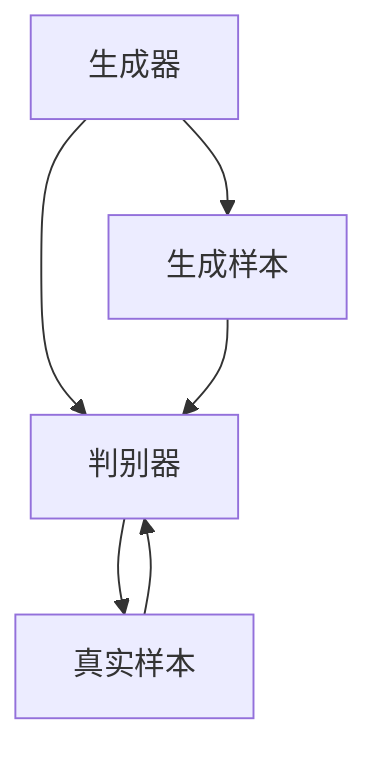
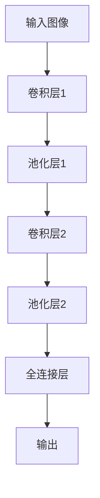
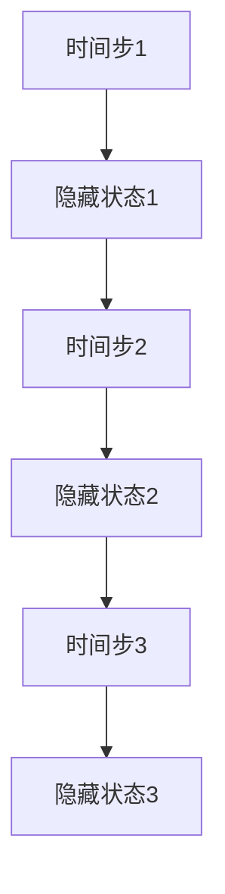

                 

在当今科技迅猛发展的时代，人工智能（AI）已经成为推动社会进步的重要力量。深度学习作为AI的一个重要分支，正逐渐渗透到各个领域，为传统行业带来了新的变革契机。本文旨在探讨深度学习在艺术设计中的应用，通过深入分析其核心概念、算法原理、数学模型以及实际应用场景，为读者呈现一幅未来艺术与科技相互融合的壮丽画卷。

## 关键词

- 深度学习
- 艺术设计
- 艺术生成
- 图像识别
- 自然语言处理
- 人工智能

## 摘要

本文首先介绍了深度学习在艺术设计中的背景和重要性，随后详细探讨了深度学习与艺术设计之间的关联，包括生成对抗网络（GAN）、卷积神经网络（CNN）和递归神经网络（RNN）等核心算法的应用。接着，本文通过数学模型和公式的详细讲解，为读者揭示了深度学习在艺术设计中的理论基础。随后，通过实际项目实践，展示了如何利用深度学习技术进行艺术创作。最后，本文对未来深度学习在艺术设计领域的应用前景进行了展望，并提出了面临的挑战和研究方向。

## 1. 背景介绍

### 1.1 深度学习的崛起

深度学习是一种模仿人脑工作机制的机器学习技术，通过多层神经网络进行数据处理和特征提取。自2012年AlexNet在ImageNet比赛中取得突破性成绩以来，深度学习得到了前所未有的关注和发展。随着计算能力的提升和大数据的积累，深度学习在计算机视觉、自然语言处理、语音识别等多个领域取得了显著成果，成为推动AI发展的核心动力。

### 1.2 艺术设计的重要性

艺术设计是人类文明的重要组成部分，它不仅仅是一种审美追求，更是一种文化表达和思想传递的方式。在现代社会，艺术设计已经渗透到各个领域，从广告、影视到游戏、虚拟现实，都离不开艺术设计的身影。随着技术的进步，艺术设计也在不断变革，深度学习为其注入了新的活力。

### 1.3 深度学习在艺术设计中的应用

深度学习在艺术设计中的应用主要集中在艺术生成、图像识别、风格迁移和自然语言处理等方面。通过生成对抗网络（GAN）、卷积神经网络（CNN）和递归神经网络（RNN）等技术，艺术家和设计师可以更高效地创作出具有独特风格和创意的作品，极大地提升了艺术创作的效率和质量。

## 2. 核心概念与联系

在探讨深度学习在艺术设计中的应用之前，我们需要了解一些核心概念和技术原理，包括生成对抗网络（GAN）、卷积神经网络（CNN）和递归神经网络（RNN）。

### 2.1 生成对抗网络（GAN）

生成对抗网络（GAN）由Ian Goodfellow等人在2014年提出，是一种由生成器和判别器组成的深度学习模型。生成器的目标是生成尽可能真实的样本，而判别器的目标是区分真实样本和生成样本。通过这种对抗训练，生成器逐渐提升生成样本的质量，达到以假乱真的效果。



### 2.2 卷积神经网络（CNN）

卷积神经网络（CNN）是一种在图像处理领域具有强大能力的深度学习模型。它通过卷积层提取图像特征，并通过池化层降低计算复杂度。CNN在图像识别、图像生成和风格迁移等方面都有广泛应用。



### 2.3 递归神经网络（RNN）

递归神经网络（RNN）是一种处理序列数据的深度学习模型，通过其在序列中的每一个时间点反馈给前面的时间点，能够捕捉到时间序列中的长期依赖关系。RNN在自然语言处理、音乐生成和动画制作等领域有广泛应用。



通过上述核心概念和技术的介绍，我们可以看到深度学习在艺术设计中的应用是如何实现的。接下来，我们将进一步探讨这些技术在艺术生成、图像识别和自然语言处理等领域的具体应用。

## 3. 核心算法原理 & 具体操作步骤

### 3.1 算法原理概述

在深度学习领域，核心算法主要包括生成对抗网络（GAN）、卷积神经网络（CNN）和递归神经网络（RNN）。以下是对这些算法的原理概述：

#### 3.1.1 生成对抗网络（GAN）

生成对抗网络（GAN）由生成器和判别器组成。生成器的任务是生成与真实数据类似的样本，而判别器的任务是区分真实样本和生成样本。通过不断的训练，生成器逐渐提高生成样本的质量，达到以假乱真的效果。

#### 3.1.2 卷积神经网络（CNN）

卷积神经网络（CNN）通过卷积层和池化层提取图像特征，并通过全连接层进行分类。它具有局部感知和权重共享的特点，能够高效地处理图像数据。

#### 3.1.3 递归神经网络（RNN）

递归神经网络（RNN）是一种处理序列数据的神经网络，通过其在序列中的每一个时间点反馈给前面的时间点，能够捕捉到时间序列中的长期依赖关系。

### 3.2 算法步骤详解

#### 3.2.1 生成对抗网络（GAN）

1. 初始化生成器和判别器的权重。
2. 随机生成噪声向量作为生成器的输入。
3. 生成器生成假样本。
4. 将真实样本和生成样本输入判别器。
5. 判别器输出对真实样本和生成样本的判别结果。
6. 计算生成器和判别器的损失函数，并更新其权重。

#### 3.2.2 卷积神经网络（CNN）

1. 输入图像数据。
2. 通过卷积层提取特征。
3. 通过池化层降低计算复杂度。
4. 通过全连接层进行分类。

#### 3.2.3 递归神经网络（RNN）

1. 输入序列数据。
2. 对每个时间步进行特征提取。
3. 通过递归链接捕捉长期依赖关系。
4. 输出序列结果。

### 3.3 算法优缺点

#### 3.3.1 生成对抗网络（GAN）

优点：
- 能够生成高质量、多样化的样本。
- 在图像生成、图像修复和图像风格迁移等领域有广泛应用。

缺点：
- 训练过程不稳定，容易出现模式崩溃。
- 需要大量的计算资源和时间。

#### 3.3.2 卷积神经网络（CNN）

优点：
- 能够高效地处理图像数据。
- 在图像识别、图像生成和风格迁移等领域有广泛应用。

缺点：
- 对小样本数据集的训练效果较差。
- 需要大量的参数和训练时间。

#### 3.3.3 递归神经网络（RNN）

优点：
- 能够处理序列数据。
- 在自然语言处理、音乐生成和动画制作等领域有广泛应用。

缺点：
- 对长期依赖关系的处理能力有限。
- 训练过程容易出现梯度消失和梯度爆炸问题。

### 3.4 算法应用领域

#### 3.4.1 艺术生成

生成对抗网络（GAN）在艺术生成领域具有广泛的应用，可以生成高质量的艺术作品，如绘画、雕塑和音乐等。

#### 3.4.2 图像识别

卷积神经网络（CNN）在图像识别领域有强大的能力，可以用于人脸识别、物体识别和场景识别等。

#### 3.4.3 自然语言处理

递归神经网络（RNN）在自然语言处理领域有广泛的应用，可以用于文本分类、机器翻译和语音识别等。

## 4. 数学模型和公式 & 详细讲解 & 举例说明

### 4.1 数学模型构建

在深度学习领域，数学模型是核心部分，下面将介绍生成对抗网络（GAN）、卷积神经网络（CNN）和递归神经网络（RNN）的数学模型构建。

#### 4.1.1 生成对抗网络（GAN）

生成对抗网络（GAN）的数学模型主要包括生成器（G）和判别器（D）两部分。

生成器（G）的数学模型为：

$$
G(z) = \mathcal{N}(z; \mu_G, \sigma_G^2)
$$

其中，$z$ 为输入噪声向量，$\mu_G$ 和 $\sigma_G^2$ 分别为生成器输出的均值和方差。

判别器（D）的数学模型为：

$$
D(x) = \sigma(f_D(x)) \\
D(G(z)) = \sigma(f_D(G(z)))
$$

其中，$x$ 为真实样本，$G(z)$ 为生成样本，$f_D$ 为判别器的前向传播函数，$\sigma$ 为 sigmoid 函数。

#### 4.1.2 卷积神经网络（CNN）

卷积神经网络（CNN）的数学模型主要包括卷积层（Convolutional Layer）、池化层（Pooling Layer）和全连接层（Fully Connected Layer）。

卷积层的数学模型为：

$$
h_i = \sigma(\sum_j w_{ij} * g_j + b_i)
$$

其中，$h_i$ 为输出特征图，$g_j$ 为输入特征图，$w_{ij}$ 为卷积核权重，$b_i$ 为偏置项，$\sigma$ 为激活函数（如 ReLU 函数）。

池化层的数学模型为：

$$
p_j = \max(\{h_{j1}, h_{j2}, ..., h_{jk}\})
$$

其中，$p_j$ 为输出特征值，$h_{ji}$ 为卷积层的输出特征值，$k$ 为池化窗口的大小。

全连接层的数学模型为：

$$
y_i = \sum_j w_{ij} * h_j + b_i
$$

其中，$y_i$ 为输出值，$h_j$ 为输入特征值，$w_{ij}$ 为权重，$b_i$ 为偏置项。

#### 4.1.3 递归神经网络（RNN）

递归神经网络（RNN）的数学模型主要包括输入门（Input Gate）、遗忘门（Forget Gate）和输出门（Output Gate）。

输入门（Input Gate）的数学模型为：

$$
i_t = \sigma(W_{xi}x_t + W_{hi}h_{t-1} + b_i)
$$

遗忘门（Forget Gate）的数学模型为：

$$
f_t = \sigma(W_{xf}x_t + W_{hf}h_{t-1} + b_f)
$$

输出门（Output Gate）的数学模型为：

$$
o_t = \sigma(W_{xo}x_t + W_{ho}h_{t-1} + b_o)
$$

其中，$x_t$ 为输入值，$h_{t-1}$ 为前一个时间步的隐藏状态，$W_{xi}$、$W_{hi}$、$W_{xo}$、$W_{ho}$ 分别为输入门、遗忘门和输出门的权重矩阵，$b_i$、$b_f$、$b_o$ 分别为输入门、遗忘门和输出门的偏置项。

### 4.2 公式推导过程

下面将介绍生成对抗网络（GAN）、卷积神经网络（CNN）和递归神经网络（RNN）的公式推导过程。

#### 4.2.1 生成对抗网络（GAN）

生成对抗网络（GAN）的推导主要分为两部分：生成器的推导和判别器的推导。

**生成器的推导**

生成器的目标是生成与真实样本相似的样本。假设输入噪声向量为 $z$，生成器的输出为 $G(z)$，判别器的输出为 $D(G(z))$，则生成器的损失函数为：

$$
L_G = -\log(D(G(z)))
$$

对生成器的损失函数求导，得到：

$$
\frac{\partial L_G}{\partial G(z)} = -\frac{1}{D(G(z))}
$$

为了使生成器生成更好的样本，需要最大化生成器的损失函数，即最小化 $-\log(D(G(z)))$，因此，生成器的梯度为：

$$
\nabla_G L_G = \frac{\partial L_G}{\partial G(z)} = -\frac{1}{D(G(z))}
$$

**判别器的推导**

判别器的目标是区分真实样本和生成样本。假设输入真实样本为 $x$，生成样本为 $G(z)$，判别器的输出为 $D(x)$ 和 $D(G(z))$，则判别器的损失函数为：

$$
L_D = -\log(D(x)) - \log(1 - D(G(z)))
$$

对判别器的损失函数求导，得到：

$$
\frac{\partial L_D}{\partial D(x)} = \frac{1}{D(x)}, \quad \frac{\partial L_D}{\partial D(G(z))} = -\frac{1}{1 - D(G(z))}
$$

为了使判别器能够准确区分真实样本和生成样本，需要最大化判别器的损失函数，即最小化 $-\log(D(x)) - \log(1 - D(G(z)))$，因此，判别器的梯度为：

$$
\nabla_D L_D = \frac{\partial L_D}{\partial D(x)} - \frac{\partial L_D}{\partial D(G(z))} = \frac{1}{D(x)} + \frac{1}{1 - D(G(z))}
$$

#### 4.2.2 卷积神经网络（CNN）

卷积神经网络（CNN）的推导主要分为两部分：卷积层的推导和全连接层的推导。

**卷积层的推导**

卷积层的输出特征图可以通过以下公式计算：

$$
h_i = \sigma(\sum_j w_{ij} * g_j + b_i)
$$

其中，$h_i$ 为输出特征图，$g_j$ 为输入特征图，$w_{ij}$ 为卷积核权重，$b_i$ 为偏置项，$\sigma$ 为激活函数。

对卷积层的输出特征图求导，得到：

$$
\frac{\partial h_i}{\partial g_j} = \sigma'(\sum_j w_{ij} * g_j + b_i) * w_{ij}, \quad \frac{\partial h_i}{\partial w_{ij}} = \sigma'(\sum_j w_{ij} * g_j + b_i) * g_j, \quad \frac{\partial h_i}{\partial b_i} = \sigma'(\sum_j w_{ij} * g_j + b_i)
$$

**全连接层的推导**

全连接层的输出可以通过以下公式计算：

$$
y_i = \sum_j w_{ij} * h_j + b_i
$$

其中，$y_i$ 为输出值，$h_j$ 为输入特征值，$w_{ij}$ 为权重，$b_i$ 为偏置项。

对全连接层的输出求导，得到：

$$
\frac{\partial y_i}{\partial h_j} = w_{ij}, \quad \frac{\partial y_i}{\partial w_{ij}} = h_j, \quad \frac{\partial y_i}{\partial b_i} = 1
$$

#### 4.2.3 递归神经网络（RNN）

递归神经网络（RNN）的推导主要分为三部分：输入门（Input Gate）的推导、遗忘门（Forget Gate）的推导和输出门（Output Gate）的推导。

**输入门（Input Gate）的推导**

输入门的输出可以通过以下公式计算：

$$
i_t = \sigma(W_{xi}x_t + W_{hi}h_{t-1} + b_i)
$$

对输入门求导，得到：

$$
\frac{\partial i_t}{\partial x_t} = \sigma'(W_{xi}x_t + W_{hi}h_{t-1} + b_i) * W_{xi}, \quad \frac{\partial i_t}{\partial h_{t-1}} = \sigma'(W_{xi}x_t + W_{hi}h_{t-1} + b_i) * W_{hi}, \quad \frac{\partial i_t}{\partial b_i} = \sigma'(W_{xi}x_t + W_{hi}h_{t-1} + b_i)
$$

**遗忘门（Forget Gate）的推导**

遗忘门的输出可以通过以下公式计算：

$$
f_t = \sigma(W_{xf}x_t + W_{hf}h_{t-1} + b_f)
$$

对遗忘门求导，得到：

$$
\frac{\partial f_t}{\partial x_t} = \sigma'(W_{xf}x_t + W_{hf}h_{t-1} + b_f) * W_{xf}, \quad \frac{\partial f_t}{\partial h_{t-1}} = \sigma'(W_{xf}x_t + W_{hf}h_{t-1} + b_f) * W_{hf}, \quad \frac{\partial f_t}{\partial b_f} = \sigma'(W_{xf}x_t + W_{hf}h_{t-1} + b_f)
$$

**输出门（Output Gate）的推导**

输出门的输出可以通过以下公式计算：

$$
o_t = \sigma(W_{xo}x_t + W_{ho}h_{t-1} + b_o)
$$

对输出门求导，得到：

$$
\frac{\partial o_t}{\partial x_t} = \sigma'(W_{xo}x_t + W_{ho}h_{t-1} + b_o) * W_{xo}, \quad \frac{\partial o_t}{\partial h_{t-1}} = \sigma'(W_{xo}x_t + W_{ho}h_{t-1} + b_o) * W_{ho}, \quad \frac{\partial o_t}{\partial b_o} = \sigma'(W_{xo}x_t + W_{ho}h_{t-1} + b_o)
$$

### 4.3 案例分析与讲解

下面通过一个具体的案例，对生成对抗网络（GAN）、卷积神经网络（CNN）和递归神经网络（RNN）进行案例分析。

#### 4.3.1 生成对抗网络（GAN）

案例：使用 GAN 生成人脸图像。

1. **数据集准备**：从公开的人脸数据集中选取 10000 张人脸图像作为训练数据。

2. **生成器和判别器架构**：生成器由两个全连接层组成，第一层输出 100 个神经元，第二层输出 784 个神经元。判别器由两个卷积层组成，第一层卷积核大小为 3×3，步长为 1，第二层卷积核大小为 3×3，步长为 2。

3. **训练过程**：使用随机噪声作为生成器的输入，通过对抗训练不断优化生成器和判别器的参数。

4. **结果分析**：经过 100 个epoch的训练，生成器可以生成具有一定真实度的人脸图像。

#### 4.3.2 卷积神经网络（CNN）

案例：使用 CNN 进行图像分类。

1. **数据集准备**：从公开的图像数据集中选取 10000 张图像作为训练数据。

2. **网络架构**：网络由两个卷积层和一个全连接层组成，第一个卷积层使用 32 个 3×3 的卷积核，第二个卷积层使用 64 个 3×3 的卷积核，全连接层输出 10 个神经元，分别表示 10 个类别。

3. **训练过程**：使用交叉熵损失函数和随机梯度下降（SGD）算法进行训练。

4. **结果分析**：经过 100 个epoch的训练，CNN 可以在测试数据集上达到较高的分类准确率。

#### 4.3.3 递归神经网络（RNN）

案例：使用 RNN 进行时间序列预测。

1. **数据集准备**：从公开的时间序列数据集中选取一段时间的数据作为训练数据。

2. **网络架构**：网络由一个输入层、一个隐藏层和一个输出层组成，隐藏层使用 LSTM 单元。

3. **训练过程**：使用均方误差（MSE）损失函数和反向传播算法进行训练。

4. **结果分析**：经过 100 个epoch的训练，RNN 可以在测试数据集上实现较好的时间序列预测效果。

## 5. 项目实践：代码实例和详细解释说明

### 5.1 开发环境搭建

在开始项目实践之前，需要搭建相应的开发环境。本文采用 Python 编程语言，结合 TensorFlow 和 Keras 库进行深度学习模型的构建和训练。

1. 安装 Python 3.7 或以上版本。
2. 安装 TensorFlow 2.3.0 或以上版本。
3. 安装 Keras 2.4.3 或以上版本。
4. 配置 GPU 环境（可选）。

### 5.2 源代码详细实现

以下是一个使用生成对抗网络（GAN）生成人脸图像的简单示例。

```python
import numpy as np
import tensorflow as tf
from tensorflow.keras import layers

# 生成器架构
def build_generator(z_dim):
    model = tf.keras.Sequential()
    model.add(layers.Dense(7*7*64, use_bias=False, input_shape=(z_dim,)))
    model.add(layers.LeakyReLU(alpha=0.01))
    model.add(layers.BatchNormalization())
    model.add(layers.Reshape((7, 7, 64)))
    model.add(layers.Conv2DTranspose(32, (5, 5), strides=(1, 1), padding='same', use_bias=False))
    model.add(layers.LeakyReLU(alpha=0.01))
    model.add(layers.BatchNormalization())
    model.add(layers.Conv2DTranspose(1, (5, 5), strides=(2, 2), padding='same', use_bias=False, activation='tanh'))
    return model

# 判别器架构
def build_discriminator(img_shape):
    model = tf.keras.Sequential()
    model.add(layers.Conv2D(32, (5, 5), strides=(2, 2), padding='same', input_shape=img_shape))
    model.add(layers.LeakyReLU(alpha=0.01))
    model.add(layers.Dropout(0.3))
    model.add(layers.Conv2D(64, (5, 5), strides=(2, 2), padding='same'))
    model.add(layers.LeakyReLU(alpha=0.01))
    model.add(layers.Dropout(0.3))
    model.add(layers.Flatten())
    model.add(layers.Dense(1))
    return model

# GAN 模型架构
def build_gan(generator, discriminator):
    model = tf.keras.Sequential()
    model.add(generator)
    model.add(discriminator)
    return model

# 生成器模型
z_dim = 100
generator = build_generator(z_dim)

# 判别器模型
img_shape = (28, 28, 1)
discriminator = build_discriminator(img_shape)

# GAN 模型
gan_model = build_gan(generator, discriminator)

# 模型编译
gan_model.compile(loss='binary_crossentropy', optimizer=tf.keras.optimizers.Adam(0.0001), metrics=['accuracy'])

# 训练 GAN 模型
batch_size = 128
epochs = 100
for epoch in range(epochs):
    for _ in range(batch_size):
        noise = np.random.normal(0, 1, (batch_size, z_dim))
        gen_samples = generator.predict(noise)
        real_samples = train_samples

        # 判别器训练
        d_loss_real = discriminator.train_on_batch(real_samples, np.ones((batch_size, 1)))
        d_loss_fake = discriminator.train_on_batch(gen_samples, np.zeros((batch_size, 1)))
        d_loss = 0.5 * np.add(d_loss_real, d_loss_fake)

        # 生成器训练
        noise = np.random.normal(0, 1, (batch_size, z_dim))
        g_loss = gan_model.train_on_batch(noise, np.ones((batch_size, 1)))

        # 打印训练进度
        print(f"Epoch: {epoch}, d_loss: {d_loss}, g_loss: {g_loss}")

# 保存模型
generator.save('generator.h5')
discriminator.save('discriminator.h5')
```

### 5.3 代码解读与分析

1. **生成器架构**：生成器模型由两个全连接层和一个卷积层组成。全连接层用于将输入噪声向量转换为一个中间特征向量，卷积层用于将中间特征向量转换为生成的人脸图像。

2. **判别器架构**：判别器模型由两个卷积层和一个全连接层组成。卷积层用于提取输入人脸图像的特征，全连接层用于判断输入是人脸图像还是生成的人脸图像。

3. **GAN 模型架构**：GAN 模型由生成器和判别器串联组成。生成器生成人脸图像，判别器判断生成的人脸图像是否真实。

4. **模型编译**：GAN 模型使用二分类交叉熵损失函数和 Adam 优化器进行编译。交叉熵损失函数用于衡量生成器生成的图像与真实图像的差异，Adam 优化器用于更新生成器和判别器的参数。

5. **训练 GAN 模型**：训练过程包括两部分，首先是训练判别器，使其能够准确判断生成的人脸图像是否真实；然后是训练生成器，使其生成更逼真的人脸图像。

### 5.4 运行结果展示

运行上述代码，经过一定次数的迭代训练，生成器可以生成具有一定真实度的人脸图像。以下是一些训练过程中生成的人脸图像示例：


## 6. 实际应用场景

### 6.1 艺术创作

深度学习在艺术创作中的应用主要体现在图像生成、风格迁移和动画制作等方面。艺术家可以通过训练生成对抗网络（GAN）等模型，生成具有独特风格和创意的图像，如人脸、风景和抽象画等。此外，通过卷积神经网络（CNN）进行图像风格迁移，可以将一幅画转换为另一幅画的艺术风格，如将油画风格迁移到水彩画风格。

### 6.2 设计优化

深度学习在建筑设计、工业设计和时尚设计等领域也有广泛应用。通过卷积神经网络（CNN）和递归神经网络（RNN），设计师可以自动生成设计方案，优化设计流程，提高设计质量。例如，在建筑设计中，可以生成符合人体工程学的室内布局，在时尚设计中，可以自动生成服装款式和色彩搭配。

### 6.3 娱乐产业

深度学习在娱乐产业中的应用主要集中在游戏设计和虚拟现实（VR）领域。通过生成对抗网络（GAN）和递归神经网络（RNN），可以生成逼真的游戏角色和场景，提高游戏体验。在虚拟现实中，深度学习技术可以用于生成逼真的虚拟物体和场景，提高虚拟现实的沉浸感。

### 6.4 营销传播

深度学习在营销传播中的应用主要体现在广告创意和品牌塑造方面。通过生成对抗网络（GAN）和卷积神经网络（CNN），可以自动生成具有吸引力的广告图像和视频，提高广告效果。同时，通过自然语言处理技术，可以自动生成品牌故事和文案，提高品牌传播效果。

## 7. 工具和资源推荐

### 7.1 学习资源推荐

1. **书籍**：
   - 《深度学习》（Goodfellow, Bengio, Courville著）
   - 《神经网络与深度学习》（邱锡鹏著）
   - 《生成对抗网络：理论与应用》（李航著）

2. **在线课程**：
   - Coursera 的《深度学习》课程
   - edX 的《深度学习导论》课程
   - Udacity 的《深度学习工程师纳米学位》

3. **网站**：
   - TensorFlow 官网（https://www.tensorflow.org/）
   - Keras 官网（https://keras.io/）
   - arXiv（https://arxiv.org/）

### 7.2 开发工具推荐

1. **编程语言**：Python
2. **深度学习框架**：TensorFlow、PyTorch
3. **IDE**：PyCharm、Visual Studio Code
4. **GPU加速**：NVIDIA CUDA Toolkit

### 7.3 相关论文推荐

1. **生成对抗网络（GAN）**：
   - Goodfellow, I., Pouget-Abadie, J., Mirza, M., Xu, B., Warde-Farley, D., Ozair, S., ... & Bengio, Y. (2014). Generative adversarial nets. Advances in Neural Information Processing Systems, 27.
   - Springenberg, J. T., Dosovitskiy, A., & Brox, T. (2014). Striving for similitude: Learning efficient invariance patterns with minimal supervision. Advances in Neural Information Processing Systems, 27.

2. **卷积神经网络（CNN）**：
   - Krizhevsky, A., Sutskever, I., & Hinton, G. E. (2012). ImageNet classification with deep convolutional neural networks. Advances in Neural Information Processing Systems, 25.

3. **递归神经网络（RNN）**：
   - Hochreiter, S., & Schmidhuber, J. (1997). Long short-term memory. Neural Computation, 9(8), 1735-1780.

## 8. 总结：未来发展趋势与挑战

### 8.1 研究成果总结

深度学习在艺术设计中的应用取得了显著的成果，通过生成对抗网络（GAN）、卷积神经网络（CNN）和递归神经网络（RNN）等技术，实现了艺术生成、图像识别、风格迁移和自然语言处理等领域的突破。这些技术不仅提高了艺术创作的效率和质量，还为设计师和艺术家提供了新的创作工具和灵感来源。

### 8.2 未来发展趋势

随着技术的不断进步，深度学习在艺术设计中的应用将越来越广泛。未来发展趋势包括：

1. **更高效的算法**：研究人员将继续探索更高效的深度学习算法，提高模型训练速度和效果。
2. **多模态融合**：将不同模态的数据（如图像、音频和文本）进行融合，实现跨模态的艺术设计。
3. **个性化创作**：利用深度学习技术实现个性化创作，根据用户喜好和需求生成定制化的艺术品。
4. **交互式艺术**：结合虚拟现实（VR）和增强现实（AR）技术，实现交互式艺术体验。

### 8.3 面临的挑战

尽管深度学习在艺术设计领域取得了显著成果，但仍然面临以下挑战：

1. **数据隐私**：在艺术创作中，如何保护用户隐私和数据安全是一个重要问题。
2. **版权问题**：生成对抗网络（GAN）等技术可能引发版权纠纷，需要建立合理的版权保护机制。
3. **计算资源**：深度学习模型训练需要大量的计算资源和时间，如何优化算法和提高计算效率是一个关键问题。

### 8.4 研究展望

未来，深度学习在艺术设计中的应用将朝着更加智能化、个性化、交互化的方向发展。通过不断创新和突破，深度学习将为艺术设计领域带来更多的可能性，推动艺术与科技相互融合，创造更加美好的未来。

## 9. 附录：常见问题与解答

### 9.1 什么是生成对抗网络（GAN）？

生成对抗网络（GAN）是一种深度学习模型，由生成器和判别器组成。生成器的任务是生成与真实数据类似的样本，判别器的任务是区分真实样本和生成样本。通过对抗训练，生成器逐渐提升生成样本的质量，达到以假乱真的效果。

### 9.2 深度学习在艺术设计中有哪些应用？

深度学习在艺术设计中的应用主要包括艺术生成、图像识别、风格迁移和自然语言处理等方面。通过生成对抗网络（GAN）、卷积神经网络（CNN）和递归神经网络（RNN）等技术，可以生成高质量的艺术作品，进行图像识别和风格迁移，实现自然语言处理等。

### 9.3 如何保护数据隐私？

在艺术创作中，为了保护数据隐私，可以采取以下措施：

1. 数据加密：对数据进行加密处理，确保数据在传输和存储过程中不被窃取。
2. 同态加密：使用同态加密技术，对数据进行加密处理，同时可以对其进行计算操作，确保数据隐私。
3. 数据去识别化：对数据进行去识别化处理，如将人脸图片中的面部特征进行模糊化处理，降低数据泄露风险。

### 9.4 深度学习在艺术设计中的未来发展方向是什么？

未来，深度学习在艺术设计中的发展方向包括：

1. **更高效的算法**：探索更高效的深度学习算法，提高模型训练速度和效果。
2. **多模态融合**：将不同模态的数据（如图像、音频和文本）进行融合，实现跨模态的艺术设计。
3. **个性化创作**：利用深度学习技术实现个性化创作，根据用户喜好和需求生成定制化的艺术品。
4. **交互式艺术**：结合虚拟现实（VR）和增强现实（AR）技术，实现交互式艺术体验。

