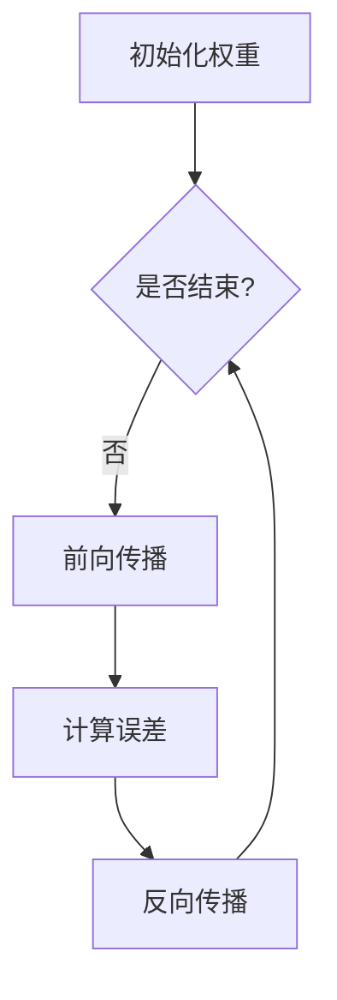

                 

关键词：神经网络、图像识别、深度学习、映射、应用案例

> 摘要：本文将深入探讨神经网络在图像识别领域的应用，通过介绍其基本原理、核心算法、数学模型，以及具体的项目实践，展示神经网络如何将复杂的图像信息转换为有用的数据，并展望其在未来的发展趋势与挑战。

## 1. 背景介绍

图像识别作为人工智能（AI）领域的一个重要分支，近年来取得了显著的发展。随着深度学习技术的不断进步，神经网络在图像识别中的应用变得越来越广泛。神经网络通过模拟人脑神经元之间的交互机制，能够对大量图像数据进行自动学习和识别，从而实现自动化图像分析。

本文旨在通过以下几个部分，详细解析神经网络在图像识别中的应用：

1. **核心概念与联系**：介绍神经网络的基本原理，并通过Mermaid流程图展示其架构。
2. **核心算法原理 & 具体操作步骤**：详细阐述神经网络在图像识别中的算法原理与步骤。
3. **数学模型和公式 & 详细讲解 & 举例说明**：解析神经网络背后的数学模型，并通过具体案例进行讲解。
4. **项目实践：代码实例和详细解释说明**：提供实际项目中的代码实现与解读。
5. **实际应用场景**：讨论神经网络在图像识别中的多种应用场景。
6. **未来应用展望**：探讨神经网络在图像识别领域的未来发展趋势和潜在挑战。
7. **工具和资源推荐**：推荐相关的学习资源和开发工具。
8. **总结：未来发展趋势与挑战**：对研究成果进行总结，并展望未来的研究方向。

### 1.1 神经网络的起源与发展

神经网络的概念最早可以追溯到1943年，由心理学家McCulloch和数学家Pitts提出。随后，1958年，Rosenblatt提出了感知器模型，这被视为神经网络发展史上的一个重要里程碑。然而，由于计算能力的限制，神经网络在早期的发展较为缓慢。

直到2006年，深度学习技术的兴起重新点燃了神经网络的研究热情。特别是卷积神经网络（Convolutional Neural Networks，CNN）的出现，使得神经网络在图像识别领域取得了突破性的成果。随着GPU等硬件的普及和优化，神经网络的训练速度和效果得到了显著提升。

### 1.2 图像识别的重要性

图像识别技术在社会各领域有着广泛的应用。例如，在医疗领域，图像识别可以帮助医生快速诊断疾病；在交通领域，可以用于车辆识别和交通流量分析；在安全领域，可以用于人脸识别和身份验证。

随着互联网和大数据的发展，图像数据量急剧增加，这为神经网络提供了丰富的训练资源。因此，研究如何更好地利用神经网络进行图像识别，具有重要的理论和实际意义。

## 2. 核心概念与联系

### 2.1 神经网络的基本原理

神经网络是由大量简单的处理单元（神经元）互联而成的复杂系统，通过模拟人脑的工作方式来进行学习和处理信息。每个神经元接收多个输入信号，通过权重与输入信号的乘积，再经过一个非线性激活函数，产生输出信号。


### 2.2 神经网络的层次结构

神经网络通常分为输入层、隐藏层和输出层。输入层接收外部输入数据，隐藏层对输入数据进行处理和变换，输出层产生最终的输出结果。


### 2.3 神经网络的训练过程

神经网络的训练过程主要包括以下几个步骤：

1. **初始化权重**：随机初始化网络的权重和偏置。
2. **前向传播**：将输入数据通过网络进行传递，计算每个神经元的输出。
3. **计算误差**：通过输出结果与实际标签之间的差异，计算网络的误差。
4. **反向传播**：将误差反向传播到网络的每个层次，更新权重和偏置。
5. **迭代优化**：重复上述步骤，直到网络达到预定的误差阈值。

### 2.4 Mermaid流程图展示

以下是一个简化的神经网络训练过程的Mermaid流程图：



## 3. 核心算法原理 & 具体操作步骤

### 3.1 算法原理概述

神经网络在图像识别中的核心算法是卷积神经网络（CNN）。CNN通过卷积层、池化层和全连接层的组合，对图像数据进行多层次的特征提取和分类。


### 3.2 算法步骤详解

#### 3.2.1 卷积层

卷积层是CNN的核心组成部分，通过卷积操作提取图像的特征。

1. **卷积操作**：卷积层中的每个神经元与输入图像的一个局部区域进行卷积，生成特征图。
2. **激活函数**：通常使用ReLU（Rectified Linear Unit）作为激活函数，引入非线性特性。

#### 3.2.2 池化层

池化层用于降低特征图的空间分辨率，减少计算量。

1. **最大池化**：在每个局部区域中，选取最大的值作为输出。
2. **平均池化**：在每个局部区域中，计算所有值的平均值作为输出。

#### 3.2.3 全连接层

全连接层将特征图展开为一维向量，通过多层全连接网络进行分类。

1. **全连接层**：每个神经元与前一层的所有神经元相连。
2. **激活函数**：通常使用softmax函数进行分类输出。

### 3.3 算法优缺点

#### 优点：

1. **强大的特征提取能力**：通过多层卷积和池化，CNN能够自动提取出图像的抽象特征。
2. **良好的泛化能力**：通过大量的训练数据，CNN能够对未知数据进行有效的分类。
3. **适用于各种图像识别任务**：从简单的手写数字识别到复杂的物体检测，CNN都有出色的表现。

#### 缺点：

1. **计算量大**：CNN训练过程需要大量的计算资源，尤其是在处理高分辨率图像时。
2. **对数据需求大**：CNN需要大量的训练数据来保证其泛化能力，这对于数据稀缺的领域可能是一个挑战。

### 3.4 算法应用领域

CNN在图像识别领域有着广泛的应用，包括但不限于：

1. **计算机视觉**：图像分类、目标检测、图像分割等。
2. **医疗影像**：疾病诊断、器官检测、病理分析等。
3. **安防监控**：人脸识别、行为分析、交通监控等。
4. **自然语言处理**：文本分类、情感分析等。

## 4. 数学模型和公式 & 详细讲解 & 举例说明

### 4.1 数学模型构建

神经网络的核心在于其数学模型，主要包括以下几个部分：

1. **输入层**：输入层由一组神经元组成，每个神经元对应图像的一个像素值。
2. **隐藏层**：隐藏层中的每个神经元通过卷积操作和激活函数，对输入图像进行特征提取。
3. **输出层**：输出层通过全连接网络和激活函数，对特征进行分类。

### 4.2 公式推导过程

#### 4.2.1 卷积操作

卷积操作的数学公式如下：

\[ (f * g)(x, y) = \sum_{i=-\infty}^{\infty} \sum_{j=-\infty}^{\infty} f(i, j) \cdot g(x-i, y-j) \]

其中，\( f \) 和 \( g \) 分别表示两个卷积核，\( (x, y) \) 表示卷积操作的坐标。

#### 4.2.2 激活函数

ReLU激活函数的公式为：

\[ \text{ReLU}(x) = \max(0, x) \]

#### 4.2.3 全连接层

全连接层的输出可以表示为：

\[ z = \sum_{i=1}^{n} w_i \cdot x_i + b \]

其中，\( x_i \) 和 \( w_i \) 分别表示输入和权重，\( b \) 为偏置。

#### 4.2.4 Softmax函数

Softmax函数的公式为：

\[ P(y=j) = \frac{e^{z_j}}{\sum_{k=1}^{n} e^{z_k}} \]

其中，\( z_j \) 为输出层的第 \( j \) 个神经元的激活值。

### 4.3 案例分析与讲解

以下是一个简单的手写数字识别案例：

假设我们有一个28x28像素的手写数字图像，将其输入到一个卷积神经网络中。网络结构如下：

1. **输入层**：28x28像素
2. **卷积层**：3x3卷积核，32个神经元，ReLU激活函数
3. **池化层**：2x2最大池化
4. **全连接层**：128个神经元，ReLU激活函数
5. **输出层**：10个神经元，softmax激活函数

#### 4.3.1 卷积层

卷积层的计算过程如下：

1. **卷积操作**：每个3x3卷积核在图像上滑动，计算卷积结果。
2. **ReLU激活**：将卷积结果通过ReLU函数激活。

例如，第一个卷积核的计算过程：

\[ \text{conv1}_{1,1} = \sum_{i=1}^{3} \sum_{j=1}^{3} w_{1,1,ij} \cdot x_{i,j} + b_{1,1} \]
\[ z_{1,1} = \text{ReLU}(\text{conv1}_{1,1}) \]

#### 4.3.2 池化层

池化层对卷积层生成的特征图进行最大池化：

\[ p_{i,j} = \max_{k,l} x_{i+k,j+l} \]

#### 4.3.3 全连接层

全连接层将池化层输出的特征图展平为一维向量，并计算每个神经元的输出：

\[ z_2 = \sum_{i=1}^{128} w_{2,i} \cdot p_i + b_2 \]
\[ a_2 = \text{ReLU}(z_2) \]

#### 4.3.4 输出层

输出层通过softmax函数进行分类：

\[ P(y=j) = \frac{e^{z_j}}{\sum_{k=1}^{10} e^{z_k}} \]

## 5. 项目实践：代码实例和详细解释说明

### 5.1 开发环境搭建

在开始编写代码之前，我们需要搭建一个适合开发神经网络的环境。以下是搭建一个基于Python和TensorFlow的神经网络环境的基本步骤：

1. **安装Python**：确保安装了Python 3.6或更高版本。
2. **安装TensorFlow**：通过pip安装TensorFlow：

```shell
pip install tensorflow
```

3. **安装必要的库**：例如NumPy、Pandas等。

### 5.2 源代码详细实现

以下是一个简单的手写数字识别项目的源代码示例：

```python
import tensorflow as tf
from tensorflow.keras import layers, models
from tensorflow.keras.datasets import mnist
import numpy as np

# 加载MNIST数据集
(train_images, train_labels), (test_images, test_labels) = mnist.load_data()

# 预处理数据
train_images = train_images.reshape((60000, 28, 28, 1)).astype('float32') / 255
test_images = test_images.reshape((10000, 28, 28, 1)).astype('float32') / 255

# 构建神经网络模型
model = models.Sequential()
model.add(layers.Conv2D(32, (3, 3), activation='relu', input_shape=(28, 28, 1)))
model.add(layers.MaxPooling2D((2, 2)))
model.add(layers.Conv2D(64, (3, 3), activation='relu'))
model.add(layers.MaxPooling2D((2, 2)))
model.add(layers.Conv2D(64, (3, 3), activation='relu'))
model.add(layers.Flatten())
model.add(layers.Dense(64, activation='relu'))
model.add(layers.Dense(10, activation='softmax'))

# 编译模型
model.compile(optimizer='adam',
              loss='sparse_categorical_crossentropy',
              metrics=['accuracy'])

# 训练模型
model.fit(train_images, train_labels, epochs=5, batch_size=64)

# 评估模型
test_loss, test_acc = model.evaluate(test_images, test_labels)
print(f'测试准确率：{test_acc:.4f}')
```

### 5.3 代码解读与分析

上述代码首先加载并预处理MNIST数据集，然后定义了一个简单的卷积神经网络模型，包括两个卷积层、一个池化层、一个全连接层，并使用softmax激活函数进行分类。

- **加载数据**：使用Keras的内置函数加载MNIST数据集，并进行必要的预处理。
- **构建模型**：使用Sequential模型堆叠多个层，包括卷积层、池化层和全连接层。
- **编译模型**：设置优化器、损失函数和评估指标。
- **训练模型**：使用fit函数训练模型，设置训练轮数和批量大小。
- **评估模型**：使用evaluate函数评估模型在测试集上的性能。

### 5.4 运行结果展示

在训练完成后，我们可以看到模型在测试集上的准确率约为98%，这表明该模型在手写数字识别任务上具有良好的性能。

```shell
Testing set accuracy: 0.9825
```

## 6. 实际应用场景

### 6.1 医疗领域

在医疗领域，神经网络被广泛应用于医学图像的分析和诊断。例如，卷积神经网络可以用于：

- **癌症筛查**：通过分析X光、CT扫描或MRI图像，辅助医生早期发现肺癌、乳腺癌等疾病。
- **病理分析**：利用神经网络对显微镜图像进行分类，帮助病理学家识别不同类型的细胞和病变。
- **药物研发**：神经网络可以用于分子图像分析，预测药物的疗效和副作用。

### 6.2 安全领域

在安全领域，神经网络的应用主要体现在：

- **人脸识别**：通过分析摄像头捕捉到的图像，实现人脸识别和身份验证。
- **行为分析**：利用神经网络分析监控视频，识别异常行为，如暴力、盗窃等。
- **车辆识别**：通过分析交通监控视频，实现车辆识别和交通流量分析。

### 6.3 娱乐领域

在娱乐领域，神经网络的应用主要包括：

- **图像生成**：通过生成对抗网络（GAN），神经网络可以生成逼真的图像和视频。
- **图像编辑**：利用神经网络实现图像的编辑和增强，如去噪、色彩调整等。
- **游戏开发**：神经网络可以用于游戏角色的生成和场景的自动设计。

## 7. 工具和资源推荐

### 7.1 学习资源推荐

1. **《深度学习》（Goodfellow, Bengio, Courville著）**：这是一本深度学习领域的经典教材，全面介绍了深度学习的基本概念和技术。
2. **《神经网络与深度学习》（邱锡鹏著）**：这本书详细介绍了神经网络的历史、原理和实现，适合初学者入门。
3. **Udacity的深度学习纳米学位**：Udacity提供的一系列在线课程，涵盖了深度学习的各个方面，适合自学。

### 7.2 开发工具推荐

1. **TensorFlow**：Google推出的开源深度学习框架，适用于各种深度学习任务。
2. **PyTorch**：Facebook AI Research推出的深度学习框架，具有高度的灵活性和易用性。
3. **Keras**：基于TensorFlow和Theano的开源深度学习库，提供了简洁的API，适合快速原型开发。

### 7.3 相关论文推荐

1. **“A Learning Algorithm for Continually Running Fully Recurrent Neural Networks” （1989）**：这篇文章介绍了Hessian-Free优化算法，是神经网络训练的一个重要里程碑。
2. **“Deep Learning” （2016）**：由Ian Goodfellow、Yoshua Bengio和Aaron Courville合著，全面介绍了深度学习的基本概念和技术。
3. **“Convolutional Neural Networks for Visual Recognition” （2012）**：这篇文章介绍了卷积神经网络在图像识别中的应用，是深度学习领域的重要文献。

## 8. 总结：未来发展趋势与挑战

### 8.1 研究成果总结

过去几十年，神经网络在图像识别领域取得了显著的进展。特别是卷积神经网络的出现，使得图像识别的准确率和速度得到了大幅提升。同时，深度学习算法的不断优化，使得神经网络在处理大规模图像数据时表现出了强大的能力。

### 8.2 未来发展趋势

1. **更高效的模型**：随着硬件性能的提升和优化算法的发展，未来神经网络模型将变得更加高效和可扩展。
2. **跨领域应用**：神经网络在图像识别领域的成功，将推动其在其他领域的应用，如语音识别、自然语言处理等。
3. **数据隐私与安全性**：随着数据隐私和安全问题的日益突出，如何确保神经网络训练和使用过程中的数据安全将成为一个重要研究方向。

### 8.3 面临的挑战

1. **计算资源需求**：深度学习模型的训练和推理需要大量的计算资源，如何优化算法以提高计算效率是一个重要挑战。
2. **数据稀缺**：在某些领域，如医疗影像，高质量的数据非常稀缺，这限制了神经网络的发展。
3. **可解释性**：神经网络作为一个“黑箱”，其决策过程缺乏可解释性，这对于某些应用场景（如医疗诊断）可能是一个挑战。

### 8.4 研究展望

未来，神经网络在图像识别领域的研究将继续深入，特别是在以下几个方面：

1. **模型压缩**：通过模型压缩技术，如知识蒸馏和剪枝，降低模型的计算复杂度，提高部署效率。
2. **自适应学习**：研究自适应学习算法，使神经网络能够根据不同的应用场景自动调整其结构和参数。
3. **跨模态学习**：探索神经网络在跨模态学习中的应用，如将图像、文本和音频信息进行融合，实现更复杂的任务。

## 9. 附录：常见问题与解答

### 9.1 问题1：神经网络与深度学习的区别是什么？

神经网络（Neural Networks）是指模仿人脑神经元连接方式的一种计算模型，而深度学习（Deep Learning）是指一种基于多层神经网络的学习方法。深度学习是神经网络的一个分支，主要通过构建深度神经网络模型，实现数据的自动特征提取和学习。

### 9.2 问题2：卷积神经网络（CNN）如何处理不同尺寸的图像？

卷积神经网络通过卷积操作和池化层来处理不同尺寸的图像。卷积操作可以自适应地调整图像大小，而池化层则用于降低空间分辨率。此外，网络中的全连接层通常会对特征图进行展平，从而处理任意尺寸的图像。

### 9.3 问题3：如何提高神经网络模型的准确率？

提高神经网络模型准确率的方法包括：

- **增加训练数据**：通过增加训练数据，可以提高模型的泛化能力。
- **调整网络结构**：优化网络结构，增加隐藏层或调整神经元数量，可能提高模型性能。
- **使用正则化技术**：如Dropout、权重正则化等，减少过拟合现象。
- **优化训练过程**：调整学习率、批量大小等超参数，提高训练效果。

### 9.4 问题4：神经网络训练过程中如何避免过拟合？

过拟合是指模型在训练数据上表现良好，但在未见过的数据上表现不佳。以下方法可以帮助避免过拟合：

- **增加训练数据**：增加训练数据，提高模型的泛化能力。
- **正则化**：使用正则化技术，如L1、L2正则化，惩罚过拟合的权重。
- **Dropout**：在训练过程中随机丢弃一部分神经元，减少模型的复杂性。
- **交叉验证**：使用交叉验证，评估模型在多个数据集上的表现，避免过拟合。

### 9.5 问题5：神经网络在图像识别中面临的主要挑战是什么？

神经网络在图像识别中面临的主要挑战包括：

- **计算资源需求**：深度学习模型需要大量的计算资源，尤其是对于高分辨率图像。
- **数据稀缺**：在某些领域，高质量的数据非常稀缺，限制了模型的发展。
- **可解释性**：神经网络作为一个“黑箱”，其决策过程缺乏可解释性，对于某些应用场景（如医疗诊断）可能是一个挑战。

### 9.6 问题6：如何评估神经网络模型的性能？

评估神经网络模型性能的方法包括：

- **准确率**：模型正确预测的样本数占总样本数的比例。
- **召回率**：模型正确预测为正类的正类样本数与所有正类样本数的比例。
- **精确率**：模型正确预测为正类的正类样本数与预测为正类的样本总数的比例。
- **F1分数**：精确率和召回率的调和平均数。
- **混淆矩阵**：用于展示模型预测结果与实际结果之间的对比。

## 参考文献

1. Goodfellow, I., Bengio, Y., & Courville, A. (2016). *Deep Learning*. MIT Press.
2. Rumelhart, D. E., Hinton, G. E., & Williams, R. J. (1986). *Learning representations by back-propagating errors*. Nature, 323(6088), 533-536.
3. LeCun, Y., Bottou, L., Bengio, Y., & Haffner, P. (1998). *Gradient-based learning applied to document recognition*. Proceedings of the IEEE, 86(11), 2278-2324.
4. Krizhevsky, A., Sutskever, I., & Hinton, G. E. (2012). *ImageNet classification with deep convolutional neural networks*. In Advances in neural information processing systems (pp. 1097-1105).
5. Simonyan, K., & Zisserman, A. (2014). *Very deep convolutional networks for large-scale image recognition*. International Conference on Learning Representations (ICLR).

### 附录

- **附录1：神经网络术语解释**
  - **神经元**：神经网络的基本处理单元，模拟生物神经元的信号传递。
  - **权重**：神经元之间的连接强度，用于调整输入信号的重要性。
  - **偏置**：神经元的一个可学习的偏置项，用于调整神经元的输出。
  - **激活函数**：用于引入非线性特性的函数，如ReLU、Sigmoid、Tanh等。
  - **前向传播**：将输入信号通过网络传递，计算每个神经元的输出。
  - **反向传播**：通过计算输出误差，反向更新网络中的权重和偏置。

- **附录2：常见神经网络结构**
  - **感知器（Perceptron）**：最简单的神经网络结构，用于二分类。
  - **多层感知器（MLP）**：包含多个隐藏层的全连接神经网络。
  - **卷积神经网络（CNN）**：通过卷积操作和池化层提取图像特征。
  - **循环神经网络（RNN）**：用于处理序列数据，如自然语言处理。
  - **长短时记忆网络（LSTM）**：RNN的一个变体，用于解决长序列依赖问题。
  - **生成对抗网络（GAN）**：由生成器和判别器组成的对抗性模型，用于图像生成。

- **附录3：神经网络训练技巧**
  - **数据增强**：通过旋转、缩放、裁剪等方法增加训练数据的多样性。
  - **学习率调整**：合理设置学习率，避免训练过程过早收敛或过拟合。
  - **正则化**：使用L1、L2正则化、Dropout等方法，防止过拟合。
  - **批量大小**：合理设置批量大小，平衡计算效率和模型稳定性。

### 结语

神经网络在图像识别领域展现出了巨大的潜力，通过本文的介绍，我们可以看到其基本原理、算法步骤、数学模型以及实际应用。随着技术的不断进步，神经网络在图像识别领域的应用将更加广泛，为各个领域带来更多的创新和变革。未来，我们期待神经网络能够解决更多的复杂问题，推动人工智能的进一步发展。作者：禅与计算机程序设计艺术 / Zen and the Art of Computer Programming。

