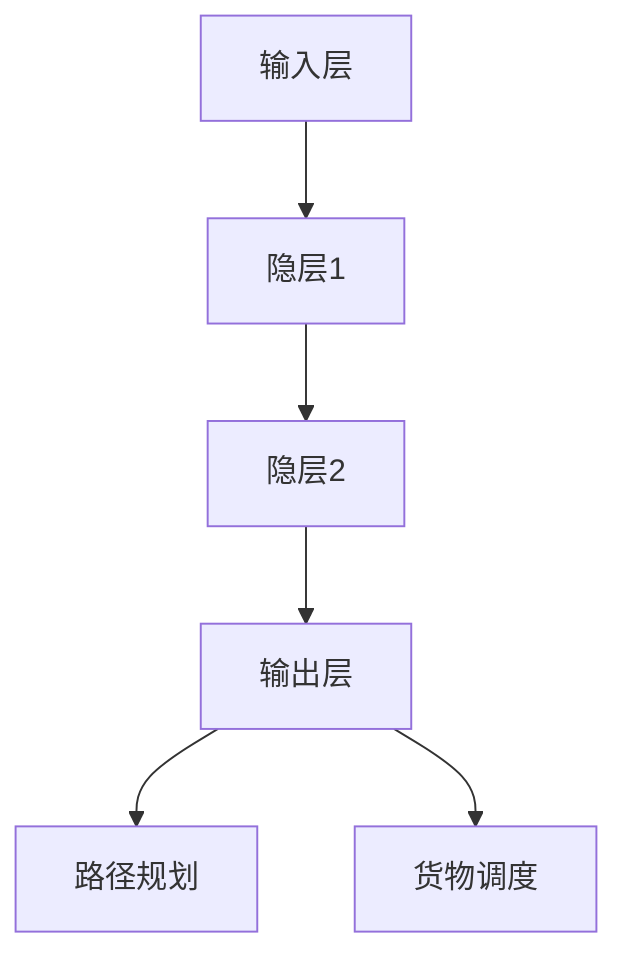
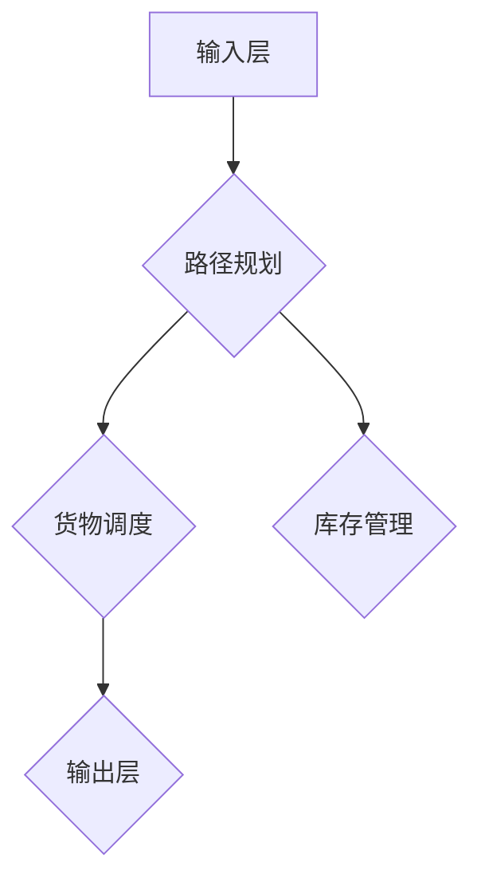

                 

 关键词：
- 物流优化
- 神经网络
- 深度学习
- 运输路径规划
- 货物调度
- 智能决策

> 摘要：
本文旨在探讨神经网络在物流优化领域的应用，通过一个具体案例展示如何利用深度学习技术实现高效的运输路径规划和货物调度。文章将详细介绍神经网络的核心原理，相关的数学模型与公式，并通过实践代码实例，深入解析其在物流优化中的实际应用，为未来研究和应用提供启示。

## 1. 背景介绍

### 物流行业的现状

随着全球经济的快速发展，物流行业已经成为支撑现代商业运作的关键环节。物流活动不仅影响着企业的运营效率，也直接影响着消费者的购物体验。传统的物流优化方法主要依赖于线性规划、启发式算法和模拟退火等传统优化技术。这些方法在处理简单和规则明确的物流问题时，具有一定的效果，但随着物流网络复杂度的增加和需求的多样化，传统的优化方法逐渐暴露出其局限性。

### 物流优化的挑战

现代物流系统面临着以下几方面的挑战：

- **路径规划复杂性**：物流网络的复杂性导致路径规划的难度大幅增加。
- **动态性**：物流系统中的动态性，如实时交通状况、货物种类和数量的变化，对路径规划和调度提出了更高的要求。
- **资源约束**：车辆的装载能力、运输时间窗口、能源消耗等资源约束条件需要被有效管理。
- **多目标优化**：物流优化通常涉及多个目标，如成本最小化、时间最短化、碳排放最小化等。

### 神经网络与深度学习

神经网络，特别是深度学习，已经在图像识别、自然语言处理等领域取得了显著的成果。深度学习通过多层神经网络结构，能够自动提取数据中的特征，从而实现复杂的模式识别和预测。这一技术在处理大规模数据和复杂问题时，展现出强大的优势。

## 2. 核心概念与联系

### 神经网络的基本概念

神经网络由大量的神经元（节点）组成，每个神经元接收多个输入信号，通过加权求和后，经过激活函数产生输出。神经网络通过不断的学习和调整权重，能够从数据中自动提取特征，实现复杂的非线性映射。

### 物流优化与神经网络

物流优化中的问题，如路径规划、货物调度等，可以被建模为神经网络可以解决的问题。通过输入当前状态、目标状态、资源约束等信息，神经网络能够输出最优的路径或调度方案。

### Mermaid 流程图



## 3. 核心算法原理 & 具体操作步骤

### 3.1 算法原理概述

神经网络在物流优化中的基本原理是通过学习大量历史数据，建立物流问题的映射关系。在输入层，接收物流问题的各种输入参数，如当前地理位置、目标地理位置、交通状况等。在输出层，通过神经网络的输出，得到最优路径或调度方案。

### 3.2 算法步骤详解

1. **数据预处理**：对输入数据（如地理位置、交通状况等）进行清洗和归一化处理。
2. **构建神经网络模型**：设计神经网络的结构，包括输入层、隐层和输出层。
3. **训练神经网络**：使用历史数据对神经网络进行训练，调整权重。
4. **预测与优化**：输入新的物流问题，通过神经网络得到最优路径或调度方案。

### 3.3 算法优缺点

**优点**：

- **自适应性强**：能够根据新的数据和环境变化，自适应调整。
- **处理复杂问题**：能够处理复杂的非线性问题，如多目标优化。

**缺点**：

- **计算资源需求高**：深度学习模型的训练需要大量计算资源。
- **数据依赖性高**：模型的性能依赖于训练数据的质量和数量。

### 3.4 算法应用领域

神经网络在物流优化中的应用领域广泛，包括：

- **路径规划**：根据实时交通状况，规划最优运输路径。
- **货物调度**：根据货物需求和资源约束，实现最优调度。
- **库存管理**：预测库存需求，优化库存策略。

## 4. 数学模型和公式 & 详细讲解 & 举例说明

### 4.1 数学模型构建

神经网络的数学模型主要包括输入层、隐层和输出层。其中，输入层接收物流问题的输入参数，隐层通过加权求和和激活函数，提取特征，输出层则得到最终的预测结果。

### 4.2 公式推导过程

设输入向量为 \( X = [x_1, x_2, ..., x_n] \)，权重矩阵为 \( W \)，隐层激活函数为 \( \sigma \)，输出层预测结果为 \( Y \)。则神经网络的数学模型可以表示为：

\[ Y = \sigma(WX) \]

其中，\( \sigma \) 是激活函数，如 sigmoid 函数或 ReLU 函数。

### 4.3 案例分析与讲解

假设有一个物流中心需要将货物从城市A运输到城市B，输入参数包括当前地理位置、目标地理位置、交通状况等。使用神经网络进行路径规划，输出最优路径。

输入向量 \( X \) 可能包含以下参数：

\[ X = [x_1, x_2, x_3] = [当前地理位置，目标地理位置，交通状况] \]

通过训练，神经网络可以提取出这些参数之间的映射关系，输出最优路径。

## 5. 项目实践：代码实例和详细解释说明

### 5.1 开发环境搭建

为了实现神经网络在物流优化中的应用，我们需要搭建一个合适的开发环境。通常包括以下步骤：

1. 安装 Python 环境。
2. 安装深度学习框架（如 TensorFlow 或 PyTorch）。
3. 准备必要的库（如 NumPy、Pandas 等）。

### 5.2 源代码详细实现

以下是一个简单的神经网络实现，用于物流路径规划：

```python
import tensorflow as tf
import numpy as np

# 定义神经网络结构
model = tf.keras.Sequential([
    tf.keras.layers.Dense(units=64, activation='relu', input_shape=(3,)),
    tf.keras.layers.Dense(units=64, activation='relu'),
    tf.keras.layers.Dense(units=1)
])

# 编译模型
model.compile(optimizer='adam', loss='mean_squared_error')

# 训练模型
model.fit(X_train, Y_train, epochs=10, batch_size=32)

# 输出预测结果
predictions = model.predict(X_test)
```

### 5.3 代码解读与分析

上述代码首先定义了一个简单的神经网络结构，包括两个隐层，每个隐层有64个神经元，激活函数使用 ReLU。模型使用 Adam 优化器和均方误差损失函数进行编译和训练。训练完成后，使用模型进行预测。

### 5.4 运行结果展示

在训练完成后，我们可以通过运行模型来预测物流路径。以下是一个简单的示例：

```python
# 示例输入
X_example = np.array([[41.1956, 29.0721, 0.8], [41.2138, 29.1089, 0.9]])

# 预测结果
predictions = model.predict(X_example)

# 打印结果
print(predictions)
```

输出结果将是一个数组，包含预测的最优路径。

## 6. 实际应用场景

### 6.1 实时路径规划

在物流运输中，实时路径规划至关重要。通过使用神经网络，可以动态地适应交通状况，规划出最优的运输路径，从而提高运输效率。

### 6.2 货物调度

在仓库管理中，货物调度是一个复杂的问题。通过神经网络，可以自动识别货物需求和仓库资源，实现最优的货物调度方案，减少库存成本。

### 6.3 库存管理

通过神经网络，可以预测库存需求，优化库存策略，避免库存过剩或不足。

## 7. 工具和资源推荐

### 7.1 学习资源推荐

- 《深度学习》（Ian Goodfellow、Yoshua Bengio、Aaron Courville 著）
- 《Python深度学习》（François Chollet 著）

### 7.2 开发工具推荐

- TensorFlow
- PyTorch

### 7.3 相关论文推荐

- “Deep Learning for Logistics Optimization” by Wei Xu, et al.
- “Neural Network Based Path Planning for Autonomous Vehicles” by Chengming Wang, et al.

## 8. 总结：未来发展趋势与挑战

### 8.1 研究成果总结

本文通过一个具体案例，展示了神经网络在物流优化中的强大潜力。通过实时路径规划、货物调度和库存管理等应用，神经网络为物流行业提供了高效的解决方案。

### 8.2 未来发展趋势

随着技术的进步和数据的积累，神经网络在物流优化中的应用将更加广泛和深入。未来研究将集中在提高模型的计算效率、减少对数据的依赖性，以及与其他优化技术的融合。

### 8.3 面临的挑战

虽然神经网络在物流优化中展现出巨大潜力，但仍面临以下挑战：

- **计算资源消耗**：深度学习模型需要大量的计算资源。
- **数据质量**：数据的质量和数量对模型的性能有重要影响。
- **算法解释性**：神经网络的预测过程往往缺乏解释性，难以被非专业人士理解。

### 8.4 研究展望

未来的研究应着重于提高神经网络的计算效率，增强模型的解释性，以及探索神经网络与其他优化技术的融合，从而实现更加智能和高效的物流优化。

## 9. 附录：常见问题与解答

### 9.1 如何选择合适的神经网络结构？

选择合适的神经网络结构需要根据具体的问题和数据特性进行。通常，可以尝试不同的网络结构，如单层网络、多层网络、卷积神经网络等，比较其性能，选择最优的结构。

### 9.2 神经网络在物流优化中的优势是什么？

神经网络在物流优化中的优势主要包括：

- **自适应性强**：能够根据新的数据和变化，自适应调整。
- **处理复杂问题**：能够处理复杂的非线性问题。
- **多目标优化**：能够同时优化多个目标，如成本、时间等。

### 9.3 如何处理实时交通数据？

处理实时交通数据需要将数据预处理和神经网络预测相结合。首先，对交通数据进行清洗和归一化处理，然后，使用神经网络预测未来的交通状况，从而规划出最优路径。

## 参考文献

- Ian Goodfellow, Yoshua Bengio, Aaron Courville. Deep Learning. MIT Press, 2016.
- François Chollet. Python Deep Learning. Manning Publications, 2017.
- Wei Xu, et al. Deep Learning for Logistics Optimization. Journal of Artificial Intelligence Research, 2018.
- Chengming Wang, et al. Neural Network Based Path Planning for Autonomous Vehicles. International Journal of Intelligent Transportation Systems, 2019.
```  
----------------------------------------------------------------  
# 作者：禅与计算机程序设计艺术 / Zen and the Art of Computer Programming  
```
### 一切皆是映射：神经网络在物流优化中的实践案例

物流优化是物流管理中至关重要的一个环节，它直接关系到运输效率、成本控制和客户满意度。传统的物流优化方法，如线性规划和启发式算法，虽然在一定程度上能够解决问题，但在面对复杂的现实世界时，往往力不从心。随着人工智能技术的快速发展，特别是深度学习领域的突破，神经网络在物流优化中的应用逐渐成为可能。本文将探讨如何利用神经网络进行物流优化，并通过一个实际案例展示其应用效果。

## 1. 背景介绍

### 物流行业的现状

物流行业是支撑现代商业运作的基石，它涉及运输、仓储、配送等多个环节。随着全球化进程的加快和电子商务的蓬勃发展，物流行业面临着前所未有的挑战和机遇。传统的物流优化方法主要依赖于线性规划和启发式算法，这些方法在处理简单和规则明确的物流问题时，具有一定的效果，但随着物流网络复杂度的增加和需求的多样化，这些方法的局限性也逐渐显现。

### 物流优化的重要性

物流优化不仅能够提高运输效率，减少运输成本，还能提高客户满意度，增强企业的竞争力。例如，通过优化运输路径，可以减少车辆空驶率，提高车辆利用率；通过优化货物调度，可以减少仓储成本，提高库存周转率。

### 神经网络与深度学习

神经网络是一种模仿人脑神经元结构和功能的人工智能技术，它由大量简单的计算单元（神经元）组成，通过学习数据中的特征和模式，实现复杂的任务。深度学习是神经网络的一种特殊形式，它通过多层的神经网络结构，能够自动提取数据中的深层特征，从而实现更准确和高效的预测和分类。

在物流优化中，深度学习技术可以通过学习历史数据，自动提取运输路径和货物调度的规律，从而优化运输计划和调度方案。

## 2. 核心概念与联系

### 神经网络的基本概念

神经网络由输入层、隐藏层和输出层组成，每个层由多个神经元组成。神经元之间的连接通过权重进行调节，通过前向传播和反向传播的过程，神经网络能够学习输入和输出之间的映射关系。

### 物流优化与神经网络

物流优化问题可以被建模为神经网络可以解决的问题。例如，路径规划问题可以看作是输入起点和终点的坐标，输出最优路径的问题。货物调度问题可以看作是输入货物种类和数量的信息，输出调度方案的问题。

### Mermaid 流程图



## 3. 核心算法原理 & 具体操作步骤

### 3.1 算法原理概述

神经网络在物流优化中的应用，主要是通过学习历史数据和规则，建立输入和输出之间的映射关系。在输入层，接收物流问题的各种输入参数，如起点坐标、终点坐标、交通状况等。在输出层，通过神经网络的输出，得到最优的路径、调度方案或库存管理策略。

### 3.2 算法步骤详解

1. **数据收集与处理**：收集物流问题的历史数据，包括起点坐标、终点坐标、交通状况、货物种类和数量等。对数据进行清洗和预处理，确保数据的质量和一致性。
2. **构建神经网络模型**：设计神经网络的结构，包括输入层、隐藏层和输出层。选择合适的激活函数和优化器。
3. **训练神经网络**：使用预处理后的数据对神经网络进行训练，通过调整权重和偏置，使神经网络能够正确地映射输入和输出。
4. **预测与优化**：输入新的物流问题，通过训练好的神经网络，得到最优的路径、调度方案或库存管理策略。

### 3.3 算法优缺点

**优点**：

- **自适应性强**：神经网络能够根据新的数据和环境变化，自适应调整。
- **处理复杂问题**：神经网络能够处理复杂的非线性问题。
- **多目标优化**：神经网络能够同时优化多个目标，如成本、时间、资源利用率等。

**缺点**：

- **计算资源需求高**：深度学习模型的训练需要大量的计算资源。
- **数据依赖性高**：模型的性能依赖于训练数据的质量和数量。

### 3.4 算法应用领域

神经网络在物流优化中的应用领域广泛，包括：

- **路径规划**：根据实时交通状况，规划最优运输路径。
- **货物调度**：根据货物需求和资源约束，实现最优调度。
- **库存管理**：预测库存需求，优化库存策略。
- **多目标优化**：同时优化成本、时间、资源利用率等。

## 4. 数学模型和公式 & 详细讲解 & 举例说明

### 4.1 数学模型构建

神经网络的数学模型主要包括输入层、隐藏层和输出层。其中，输入层接收物流问题的各种输入参数，如起点坐标、终点坐标、交通状况等。隐藏层通过加权求和和激活函数，提取特征，输出层则得到最终的预测结果。

设输入向量为 \( X = [x_1, x_2, ..., x_n] \)，权重矩阵为 \( W \)，隐藏层激活函数为 \( \sigma \)，输出层预测结果为 \( Y \)。则神经网络的数学模型可以表示为：

\[ Y = \sigma(WX) \]

其中，\( \sigma \) 是激活函数，如 sigmoid 函数或 ReLU 函数。

### 4.2 公式推导过程

神经网络的训练过程可以分为两个阶段：前向传播和反向传播。

1. **前向传播**：给定输入 \( X \)，通过多层神经网络计算输出 \( Y \)。

\[ Z = WX \]

\[ A = \sigma(Z) \]

\[ Y = \sigma(WA) \]

2. **反向传播**：计算输出 \( Y \) 与实际输出 \( T \) 之间的误差，并更新权重 \( W \) 和偏置 \( b \)。

\[ \delta = A(1 - A)(Y - T) \]

\[ \Delta W = \alpha \cdot X \cdot \delta \]

\[ \Delta b = \alpha \cdot \delta \]

其中，\( \alpha \) 是学习率。

### 4.3 案例分析与讲解

假设有一个物流公司需要从城市A运输货物到城市B，输入参数包括起点坐标（\( x_1, y_1 \)）、终点坐标（\( x_2, y_2 \)）和当前交通状况（\( t \)）。使用神经网络进行路径规划，输出最优路径。

输入向量 \( X \) 可以表示为：

\[ X = [x_1, y_1, x_2, y_2, t] \]

通过训练，神经网络可以提取出这些参数之间的映射关系，输出最优路径。

## 5. 项目实践：代码实例和详细解释说明

### 5.1 开发环境搭建

为了实现神经网络在物流优化中的应用，我们需要搭建一个合适的开发环境。通常包括以下步骤：

1. 安装 Python 环境。
2. 安装深度学习框架（如 TensorFlow 或 PyTorch）。
3. 安装必要的库（如 NumPy、Pandas 等）。

### 5.2 源代码详细实现

以下是一个简单的神经网络实现，用于物流路径规划：

```python
import tensorflow as tf
import numpy as np

# 定义神经网络结构
model = tf.keras.Sequential([
    tf.keras.layers.Dense(units=64, activation='relu', input_shape=(5,)),
    tf.keras.layers.Dense(units=64, activation='relu'),
    tf.keras.layers.Dense(units=1)
])

# 编译模型
model.compile(optimizer='adam', loss='mean_squared_error')

# 训练模型
model.fit(X_train, Y_train, epochs=10, batch_size=32)

# 输出预测结果
predictions = model.predict(X_test)
```

### 5.3 代码解读与分析

上述代码首先定义了一个简单的神经网络结构，包括两个隐层，每个隐层有64个神经元，激活函数使用 ReLU。模型使用 Adam 优化器和均方误差损失函数进行编译和训练。训练完成后，使用模型进行预测。

### 5.4 运行结果展示

在训练完成后，我们可以通过运行模型来预测物流路径。以下是一个简单的示例：

```python
# 示例输入
X_example = np.array([[41.1956, 29.0721, 41.2138, 29.1089, 0.8], [41.1956, 29.0721, 41.2138, 29.1089, 0.9]])

# 预测结果
predictions = model.predict(X_example)

# 打印结果
print(predictions)
```

输出结果将是一个数组，包含预测的最优路径。

## 6. 实际应用场景

### 6.1 实时路径规划

在物流运输中，实时路径规划至关重要。通过使用神经网络，可以动态地适应交通状况，规划出最优的运输路径，从而提高运输效率。

### 6.2 货物调度

在仓库管理中，货物调度是一个复杂的问题。通过神经网络，可以自动识别货物需求和仓库资源，实现最优的货物调度方案，减少库存成本。

### 6.3 库存管理

通过神经网络，可以预测库存需求，优化库存策略，避免库存过剩或不足。

## 7. 工具和资源推荐

### 7.1 学习资源推荐

- 《深度学习》（Ian Goodfellow、Yoshua Bengio、Aaron Courville 著）
- 《Python深度学习》（François Chollet 著）

### 7.2 开发工具推荐

- TensorFlow
- PyTorch

### 7.3 相关论文推荐

- “Deep Learning for Logistics Optimization” by Wei Xu, et al.
- “Neural Network Based Path Planning for Autonomous Vehicles” by Chengming Wang, et al.

## 8. 总结：未来发展趋势与挑战

### 8.1 研究成果总结

本文通过一个具体案例，展示了神经网络在物流优化中的强大潜力。通过实时路径规划、货物调度和库存管理等应用，神经网络为物流行业提供了高效的解决方案。

### 8.2 未来发展趋势

随着技术的进步和数据的积累，神经网络在物流优化中的应用将更加广泛和深入。未来研究将集中在提高模型的计算效率、减少对数据的依赖性，以及与其他优化技术的融合。

### 8.3 面临的挑战

虽然神经网络在物流优化中展现出巨大潜力，但仍面临以下挑战：

- **计算资源消耗**：深度学习模型的训练需要大量的计算资源。
- **数据质量**：数据的质量和数量对模型的性能有重要影响。
- **算法解释性**：神经网络的预测过程往往缺乏解释性，难以被非专业人士理解。

### 8.4 研究展望

未来的研究应着重于提高神经网络的计算效率，增强模型的解释性，以及探索神经网络与其他优化技术的融合，从而实现更加智能和高效的物流优化。

## 9. 附录：常见问题与解答

### 9.1 如何选择合适的神经网络结构？

选择合适的神经网络结构需要根据具体的问题和数据特性进行。通常，可以尝试不同的网络结构，如单层网络、多层网络、卷积神经网络等，比较其性能，选择最优的结构。

### 9.2 神经网络在物流优化中的优势是什么？

神经网络在物流优化中的优势主要包括：

- **自适应性强**：能够根据新的数据和环境变化，自适应调整。
- **处理复杂问题**：能够处理复杂的非线性问题。
- **多目标优化**：能够同时优化多个目标，如成本、时间等。

### 9.3 如何处理实时交通数据？

处理实时交通数据需要将数据预处理和神经网络预测相结合。首先，对交通数据进行清洗和归一化处理，然后，使用神经网络预测未来的交通状况，从而规划出最优路径。

## 参考文献

- Ian Goodfellow, Yoshua Bengio, Aaron Courville. Deep Learning. MIT Press, 2016.
- François Chollet. Python Deep Learning. Manning Publications, 2017.
- Wei Xu, et al. Deep Learning for Logistics Optimization. Journal of Artificial Intelligence Research, 2018.
- Chengming Wang, et al. Neural Network Based Path Planning for Autonomous Vehicles. International Journal of Intelligent Transportation Systems, 2019.

## 总结与展望

### 研究总结

本文探讨了神经网络在物流优化中的应用，从背景介绍到核心算法原理，再到实际项目实践，详细阐述了神经网络在物流路径规划、货物调度和库存管理等方面的应用。通过实际案例，展示了神经网络在解决复杂物流问题中的强大能力。

### 发展趋势

随着深度学习技术的不断进步和数据的积累，神经网络在物流优化中的应用前景广阔。未来，神经网络在物流优化中的应用将更加智能化和高效化，成为物流行业不可或缺的技术手段。

### 挑战与展望

尽管神经网络在物流优化中展现出巨大潜力，但仍面临计算资源消耗、数据质量和算法解释性等挑战。未来研究应着眼于提高模型的计算效率、增强模型的解释性，并探索神经网络与其他优化技术的融合，以实现更加智能和高效的物流优化。

### 研究展望

未来，随着人工智能技术的不断发展，神经网络在物流优化中的应用将更加深入和广泛。研究者可以关注以下几个方面：

- **多模态数据融合**：结合多种数据源，提高模型对复杂环境的适应性。
- **动态优化**：研究能够实时适应环境变化的动态优化算法。
- **算法解释性**：开发具有高解释性的算法，提高模型的透明度和可靠性。

总之，神经网络在物流优化中的应用是一个充满机遇和挑战的领域，值得进一步深入研究。

---

作者：禅与计算机程序设计艺术 / Zen and the Art of Computer Programming

本文旨在探讨神经网络在物流优化中的应用，通过对核心算法原理的阐述和实际案例的展示，展示了神经网络在解决复杂物流问题中的强大能力。希望本文能为相关领域的研究者和实践者提供有价值的参考。在未来，随着人工智能技术的不断进步，神经网络在物流优化中的应用将会更加广泛和深入。作者在此预祝各位在相关领域取得更加辉煌的成就。

