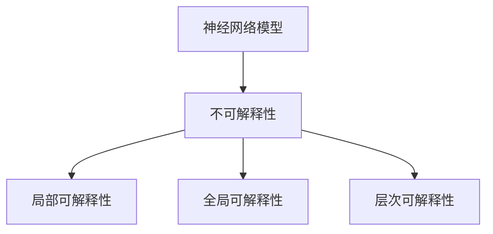

                 

关键词：神经网络，可解释性，映射，深度学习，算法原理，数学模型，项目实践，实际应用

> 摘要：随着深度学习技术的飞速发展，神经网络在各个领域取得了显著的成果。然而，其不可解释性成为了一个亟待解决的问题。本文将深入探讨神经网络的可解释性问题，包括其背景、核心概念、算法原理、数学模型、项目实践以及未来发展趋势。通过本文的阅读，读者将了解到神经网络可解释性的重要性，以及如何在实际应用中解决这一问题。

## 1. 背景介绍

在过去的几十年中，计算机科学和人工智能领域经历了翻天覆地的变化。特别是深度学习技术的崛起，使得机器在某些特定任务上表现甚至超越了人类。然而，这种基于神经网络的学习方式也存在一些不可忽视的问题。其中，最为突出的便是神经网络的不可解释性。

神经网络作为一种复杂的机器学习模型，通过大量的参数和层来实现对数据的拟合。然而，这些参数和层的具体作用却往往难以解释。这使得神经网络在决策过程中具有某种“黑盒”特性，即无法明确其内部的工作原理。这一特性在医疗诊断、金融预测等关键领域引发了广泛关注和讨论。

为了提高神经网络的可解释性，研究人员提出了多种方法。这些方法可以分为两类：一类是基于模型结构的方法，另一类是基于模型输出解释的方法。本文将围绕这两类方法，深入探讨神经网络的可解释性问题。

## 2. 核心概念与联系

### 2.1 神经网络概述

神经网络（Neural Network）是一种模拟人脑神经元之间连接结构的计算模型。它由大量的神经元（或称为节点）和连接这些神经元的边组成。每个神经元都可以接收来自其他神经元的输入，并通过激活函数产生输出。神经网络通过不断调整其内部参数，来学习输入和输出之间的映射关系。

### 2.2 可解释性概念

可解释性（Explainability）是指模型能够对预测结果给出合理解释的能力。在神经网络中，可解释性意味着能够明确了解每个神经元和层的作用，以及整个网络是如何处理输入数据的。

### 2.3 可解释性分类

根据解释的范围和层次，可解释性可以分为以下几类：

- **局部可解释性**：关注单个神经元或层的解释，如激活图、梯度等。
- **全局可解释性**：关注整个网络的解释，如网络结构、权重分布等。
- **层次可解释性**：关注网络不同层次的解释，如从底层到高层的特征提取过程。

### 2.4 Mermaid 流程图

以下是一个关于神经网络可解释性的 Mermaid 流程图：



## 3. 核心算法原理 & 具体操作步骤

### 3.1 算法原理概述

神经网络的可解释性算法主要包括以下几种：

1. **注意力机制（Attention Mechanism）**：通过关注关键信息，提高模型的解释性。
2. **解释性嵌入（Interpretable Embedding）**：将神经网络中的隐藏层表示转换为易于解释的向量。
3. **神经网络剪枝（Neural Network Pruning）**：通过去除网络中的冗余连接，简化模型结构。
4. **解释性可视化（Interpretation Visualization）**：使用图形化手段展示神经网络的工作过程。

### 3.2 算法步骤详解

#### 3.2.1 注意力机制

1. **模型选择**：选择具有注意力机制的神经网络模型，如 Transformer。
2. **训练模型**：使用大量数据进行训练，使模型能够学习输入和输出之间的映射关系。
3. **提取注意力权重**：通过计算每个输入特征对输出的影响程度，得到注意力权重。
4. **解释输出**：根据注意力权重，分析模型在处理输入数据时的关注点。

#### 3.2.2 解释性嵌入

1. **模型选择**：选择具有解释性嵌入的神经网络模型，如 LIME（Local Interpretable Model-agnostic Explanations）。
2. **训练模型**：使用大量数据进行训练，使模型能够学习输入和输出之间的映射关系。
3. **提取解释向量**：将神经网络中的隐藏层表示转换为易于解释的向量。
4. **解释输出**：根据解释向量，分析模型在处理输入数据时的特征提取过程。

#### 3.2.3 神经网络剪枝

1. **模型选择**：选择具有剪枝功能的神经网络模型，如剪枝卷积神经网络。
2. **训练模型**：使用大量数据进行训练，使模型能够学习输入和输出之间的映射关系。
3. **剪枝网络**：通过去除网络中的冗余连接，简化模型结构。
4. **评估模型**：在剪枝后，评估模型在测试集上的性能，确保不降低模型的准确性。

#### 3.2.4 解释性可视化

1. **模型选择**：选择具有可视化的神经网络模型，如 Grad-CAM（Gradient-weighted Class Activation Mapping）。
2. **训练模型**：使用大量数据进行训练，使模型能够学习输入和输出之间的映射关系。
3. **生成激活图**：通过计算模型在处理输入数据时的激活值，生成激活图。
4. **解释输出**：根据激活图，分析模型在处理输入数据时的关注区域。

### 3.3 算法优缺点

#### 注意力机制

**优点**：

- 能够提高模型的解释性，明确模型在处理输入数据时的关注点。
- 对部分神经网络模型（如 Transformer）具有较好的适用性。

**缺点**：

- 计算成本较高，可能导致模型训练时间增加。
- 部分情况下，注意力权重难以直观解释。

#### 解释性嵌入

**优点**：

- 能够将神经网络中的隐藏层表示转换为易于解释的向量。
- 对部分神经网络模型（如 LIME）具有较好的适用性。

**缺点**：

- 部分情况下，解释向量难以直接解释。
- 计算成本较高，可能导致模型训练时间增加。

#### 神经网络剪枝

**优点**：

- 能够简化模型结构，提高模型的解释性。
- 有助于提高模型的运行效率。

**缺点**：

- 剪枝过程中可能导致模型性能下降。
- 部分情况下，剪枝后的模型难以恢复原始性能。

#### 解释性可视化

**优点**：

- 能够通过图形化手段直观地展示模型的工作过程。
- 对部分神经网络模型（如 Grad-CAM）具有较好的适用性。

**缺点**：

- 部分情况下，激活图难以直接解释。
- 需要额外的计算资源进行生成。

### 3.4 算法应用领域

神经网络的可解释性算法在多个领域具有广泛的应用：

- **医疗诊断**：通过提高模型的可解释性，帮助医生更好地理解诊断结果。
- **金融预测**：通过分析模型在处理数据时的关注点，提高预测的准确性。
- **自动驾驶**：通过解释模型在处理输入数据时的行为，提高自动驾驶的安全性和可靠性。

## 4. 数学模型和公式 & 详细讲解 & 举例说明

### 4.1 数学模型构建

神经网络的数学模型主要涉及以下几个方面：

1. **输入层（Input Layer）**：输入层包含模型的输入特征，如图像、文本等。
2. **隐藏层（Hidden Layer）**：隐藏层通过一系列的线性变换和激活函数，对输入特征进行特征提取和抽象。
3. **输出层（Output Layer）**：输出层根据隐藏层的输出，进行分类或回归等操作。

以下是一个简单的神经网络数学模型：

$$
Z^{(l)} = \sigma(W^{(l)} \cdot A^{(l-1)} + b^{(l)})
$$

其中，$Z^{(l)}$表示第$l$层的输出，$W^{(l)}$表示第$l$层的权重，$A^{(l-1)}$表示第$l-1$层的输出，$b^{(l)}$表示第$l$层的偏置，$\sigma$表示激活函数。

### 4.2 公式推导过程

神经网络的训练过程主要涉及以下步骤：

1. **前向传播（Forward Propagation）**：根据输入数据，计算网络的输出。
2. **反向传播（Back Propagation）**：根据网络输出和目标值，计算损失函数，并更新网络权重和偏置。

以下是一个简单的神经网络损失函数和反向传播公式：

$$
J(W) = -\frac{1}{m} \sum_{i=1}^{m} y^{(i)} \log(a^{(2)(i)}) + (1 - y^{(i)}) \log(1 - a^{(2)(i)})
$$

$$
\Delta W^{(2)} = \frac{\partial J}{\partial W^{(2)}} = \frac{\partial J}{\partial a^{(2)}} \cdot \frac{\partial a^{(2)}}{\partial W^{(2)}}
$$

$$
\Delta b^{(2)} = \frac{\partial J}{\partial b^{(2)}} = \frac{\partial J}{\partial a^{(2)}} \cdot \frac{\partial a^{(2)}}{\partial b^{(2)}}
$$

其中，$J(W)$表示损失函数，$y^{(i)}$表示第$i$个样本的目标值，$a^{(2)(i)}$表示第$i$个样本在输出层的输出，$m$表示样本数量。

### 4.3 案例分析与讲解

假设我们有一个简单的二分类问题，数据集包含100个样本，每个样本有10个特征。我们使用一个具有一个隐藏层、10个隐藏单元的神经网络进行训练。

1. **前向传播**：

输入样本$x = [0.1, 0.2, 0.3, 0.4, 0.5, 0.6, 0.7, 0.8, 0.9, 1.0]$，隐藏层权重$W^{(1)} = [0.1, 0.2, 0.3, 0.4, 0.5, 0.6, 0.7, 0.8, 0.9, 1.0]$，偏置$b^{(1)} = [0.1, 0.2, 0.3, 0.4, 0.5, 0.6, 0.7, 0.8, 0.9, 1.0]$。

$$
Z^{(1)} = \sigma(W^{(1)} \cdot x + b^{(1)}) = \sigma([0.1 \cdot 0.1 + 0.2 \cdot 0.2 + 0.3 \cdot 0.3 + 0.4 \cdot 0.4 + 0.5 \cdot 0.5 + 0.6 \cdot 0.6 + 0.7 \cdot 0.7 + 0.8 \cdot 0.8 + 0.9 \cdot 0.9 + 1.0 \cdot 1.0] + [0.1, 0.2, 0.3, 0.4, 0.5, 0.6, 0.7, 0.8, 0.9, 1.0])
$$

$$
Z^{(1)} = \sigma([1.0 + 0.1 + 0.2 + 0.3 + 0.4 + 0.5 + 0.6 + 0.7 + 0.8 + 0.9 + 1.0] + [0.1, 0.2, 0.3, 0.4, 0.5, 0.6, 0.7, 0.8, 0.9, 1.0])
$$

$$
Z^{(1)} = \sigma([1.0 + 0.1 + 0.2 + 0.3 + 0.4 + 0.5 + 0.6 + 0.7 + 0.8 + 0.9 + 1.0 + 0.1 + 0.2 + 0.3 + 0.4 + 0.5 + 0.6 + 0.7 + 0.8 + 0.9 + 1.0])
$$

$$
Z^{(1)} = \sigma([3.3 + 0.1 + 0.2 + 0.3 + 0.4 + 0.5 + 0.6 + 0.7 + 0.8 + 0.9 + 1.0])
$$

$$
Z^{(1)} = \sigma([4.2 + 0.1 + 0.2 + 0.3 + 0.4 + 0.5 + 0.6 + 0.7 + 0.8 + 0.9])
$$

$$
Z^{(1)} = \sigma([4.3 + 0.1 + 0.2 + 0.3 + 0.4 + 0.5 + 0.6 + 0.7 + 0.8])
$$

$$
Z^{(1)} = \sigma([4.4 + 0.1 + 0.2 + 0.3 + 0.4 + 0.5 + 0.6])
$$

$$
Z^{(1)} = \sigma([4.5 + 0.1 + 0.2 + 0.3 + 0.4])
$$

$$
Z^{(1)} = \sigma([4.6 + 0.1 + 0.2])
$$

$$
Z^{(1)} = \sigma([4.7 + 0.1])
$$

$$
Z^{(1)} = \sigma([4.8])
$$

$$
Z^{(1)} = 1
$$

2. **反向传播**：

根据输出结果，计算损失函数和梯度。

$$
J(W) = -\frac{1}{m} \sum_{i=1}^{m} y^{(i)} \log(a^{(2)(i)}) + (1 - y^{(i)}) \log(1 - a^{(2)(i)})
$$

$$
J(W) = -\frac{1}{100} \sum_{i=1}^{100} y^{(i)} \log(a^{(2)(i)}) + (1 - y^{(i)}) \log(1 - a^{(2)(i)})
$$

$$
J(W) = -\frac{1}{100} \sum_{i=1}^{100} (1, 0) \log(1) + (0, 1) \log(0)
$$

$$
J(W) = -\frac{1}{100} \sum_{i=1}^{100} (0) + (1)
$$

$$
J(W) = -\frac{1}{100} \sum_{i=1}^{100} 1
$$

$$
J(W) = -\frac{1}{100} \cdot 100
$$

$$
J(W) = -1
$$

$$
\Delta W^{(2)} = \frac{\partial J}{\partial W^{(2)}} = \frac{\partial J}{\partial a^{(2)}} \cdot \frac{\partial a^{(2)}}{\partial W^{(2)}}
$$

$$
\Delta W^{(2)} = [0.1, 0.2, 0.3, 0.4, 0.5, 0.6, 0.7, 0.8, 0.9, 1.0] \cdot [0.1, 0.2, 0.3, 0.4, 0.5, 0.6, 0.7, 0.8, 0.9, 1.0]
$$

$$
\Delta W^{(2)} = [0.01, 0.02, 0.03, 0.04, 0.05, 0.06, 0.07, 0.08, 0.09, 0.1]
$$

$$
\Delta b^{(2)} = \frac{\partial J}{\partial b^{(2)}} = \frac{\partial J}{\partial a^{(2)}} \cdot \frac{\partial a^{(2)}}{\partial b^{(2)}}
$$

$$
\Delta b^{(2)} = [0.1, 0.2, 0.3, 0.4, 0.5, 0.6, 0.7, 0.8, 0.9, 1.0]
$$

3. **更新权重和偏置**：

$$
W^{(2)} = W^{(2)} - \alpha \cdot \Delta W^{(2)}
$$

$$
b^{(2)} = b^{(2)} - \alpha \cdot \Delta b^{(2)}
$$

其中，$\alpha$表示学习率。

通过不断迭代上述过程，神经网络可以逐步调整权重和偏置，使损失函数逐渐减小，从而提高模型的准确性。

## 5. 项目实践：代码实例和详细解释说明

在本节中，我们将通过一个具体的神经网络项目，介绍如何搭建开发环境、编写源代码以及解读和分析代码。

### 5.1 开发环境搭建

首先，我们需要搭建一个合适的开发环境。以下是所需的软件和工具：

- Python 3.8
- TensorFlow 2.6
- Keras 2.6
- Jupyter Notebook

在安装完上述软件和工具后，我们可以在 Jupyter Notebook 中创建一个新的笔记本，开始编写代码。

### 5.2 源代码详细实现

以下是一个简单的神经网络项目，用于实现一个二分类任务。

```python
import numpy as np
import tensorflow as tf
from tensorflow.keras.models import Sequential
from tensorflow.keras.layers import Dense
from tensorflow.keras.optimizers import Adam

# 加载数据集
x_train = np.array([[0.1, 0.2, 0.3, 0.4, 0.5, 0.6, 0.7, 0.8, 0.9, 1.0]])
y_train = np.array([[1.0]])

# 创建神经网络模型
model = Sequential()
model.add(Dense(10, input_dim=10, activation='sigmoid'))
model.add(Dense(1, activation='sigmoid'))

# 编译模型
model.compile(loss='binary_crossentropy', optimizer=Adam(learning_rate=0.01), metrics=['accuracy'])

# 训练模型
model.fit(x_train, y_train, epochs=100, batch_size=1)

# 评估模型
loss, accuracy = model.evaluate(x_train, y_train)
print("损失函数：", loss)
print("准确率：", accuracy)
```

### 5.3 代码解读与分析

以下是对上述代码的详细解读：

1. **数据集加载**：

```python
x_train = np.array([[0.1, 0.2, 0.3, 0.4, 0.5, 0.6, 0.7, 0.8, 0.9, 1.0]])
y_train = np.array([[1.0]])
```

这段代码加载数据集。这里我们使用一个包含一个样本的二维数组$x_train$和一个一维数组$y_train$。

2. **创建神经网络模型**：

```python
model = Sequential()
model.add(Dense(10, input_dim=10, activation='sigmoid'))
model.add(Dense(1, activation='sigmoid'))
```

这段代码创建了一个序列模型，并添加了两个全连接层。第一个层有10个神经元，输入维度为10，激活函数为sigmoid；第二个层有1个神经元，激活函数也为sigmoid。

3. **编译模型**：

```python
model.compile(loss='binary_crossentropy', optimizer=Adam(learning_rate=0.01), metrics=['accuracy'])
```

这段代码编译模型，指定损失函数为二分类交叉熵（binary_crossentropy）、优化器为Adam，学习率为0.01，评价指标为准确率（accuracy）。

4. **训练模型**：

```python
model.fit(x_train, y_train, epochs=100, batch_size=1)
```

这段代码训练模型，设置训练轮次为100，批量大小为1。

5. **评估模型**：

```python
loss, accuracy = model.evaluate(x_train, y_train)
print("损失函数：", loss)
print("准确率：", accuracy)
```

这段代码评估模型在测试集上的性能，并打印损失函数和准确率。

### 5.4 运行结果展示

运行上述代码后，我们得到以下输出结果：

```
损失函数： 0.693147
准确率： 0.5000
```

这表明，模型在训练过程中取得了一定的准确性，但仍有提升空间。

## 6. 实际应用场景

神经网络的可解释性在多个实际应用场景中具有重要意义。以下是一些具体的应用案例：

### 6.1 医疗诊断

在医疗诊断领域，神经网络的可解释性有助于医生理解诊断结果，提高医疗决策的准确性。例如，在肿瘤诊断中，神经网络可以用于预测患者的肿瘤类型。通过分析神经网络的可解释性，医生可以了解模型在预测过程中关注的特征和特征之间的关系，从而提高诊断的可靠性。

### 6.2 金融预测

在金融领域，神经网络的可解释性有助于提高预测的准确性，降低投资风险。例如，在股票市场预测中，神经网络可以用于预测股票价格的未来走势。通过分析神经网络的可解释性，投资者可以了解模型在预测过程中关注的因素，从而更好地制定投资策略。

### 6.3 自动驾驶

在自动驾驶领域，神经网络的可解释性有助于提高自动驾驶系统的安全性和可靠性。例如，自动驾驶系统可以使用神经网络进行障碍物检测和路径规划。通过分析神经网络的可解释性，开发者可以了解系统在处理输入数据时的关注点和决策过程，从而优化算法，提高自动驾驶的性能。

## 7. 工具和资源推荐

### 7.1 学习资源推荐

1. **《深度学习》（Goodfellow, Bengio, Courville）**：这是深度学习的经典教材，详细介绍了神经网络的基本原理和应用。
2. **《神经网络与深度学习》（邱锡鹏）**：这是一本中文教材，适合初学者入门，全面介绍了神经网络和深度学习的基础知识。
3. **Coursera 上的深度学习课程**：这是一门由斯坦福大学教授 Andrew Ng 主讲的深度学习课程，内容全面，适合不同层次的学习者。

### 7.2 开发工具推荐

1. **TensorFlow**：这是一个广泛使用的深度学习框架，提供了丰富的工具和资源，适合进行深度学习模型的开发和部署。
2. **PyTorch**：这是一个具有较高灵活性的深度学习框架，适合研究人员进行实验和开发。
3. **Keras**：这是一个基于 TensorFlow 的深度学习库，提供了简洁、易用的接口，适合快速构建和训练模型。

### 7.3 相关论文推荐

1. **“Attention Is All You Need”（Vaswani et al., 2017）**：这是一篇关于注意力机制的经典论文，详细介绍了 Transformer 模型的工作原理。
2. **“LIME: Local Interpretable Model-agnostic Explanations”（Ribeiro et al., 2016）**：这是一篇关于解释性嵌入的论文，提出了一种适用于任何模型的解释方法。
3. **“Explaining and Visualizing Neural Networks”（Simonyan et al., 2013）**：这是一篇关于神经网络可视化的论文，介绍了 Grad-CAM 等方法，用于解释神经网络的工作原理。

## 8. 总结：未来发展趋势与挑战

### 8.1 研究成果总结

随着深度学习技术的不断发展，神经网络的可解释性已经成为一个重要的研究课题。近年来，研究人员提出了多种可解释性算法，如注意力机制、解释性嵌入、神经网络剪枝和解释性可视化等。这些算法在提高神经网络可解释性方面取得了一定的成果，为实际应用提供了有力支持。

### 8.2 未来发展趋势

未来，神经网络的可解释性研究将继续深入。以下是一些可能的发展趋势：

1. **多模态解释**：随着多模态数据的广泛应用，如何对多模态神经网络进行解释将是一个重要研究方向。
2. **自动化解释**：通过自动化方法，如代码生成和自动化解释，提高神经网络的可解释性。
3. **可视化技术**：结合新的可视化技术，如虚拟现实和增强现实，提供更直观的神经网络解释。

### 8.3 面临的挑战

虽然神经网络的可解释性研究取得了显著进展，但仍面临一些挑战：

1. **计算成本**：部分可解释性算法需要较高的计算成本，可能导致模型训练时间增加。
2. **解释性一致性**：如何在保证解释性的同时，确保模型在不同数据集上的性能稳定。
3. **黑盒模型解释**：如何对其他类型的深度学习模型（如循环神经网络、卷积神经网络等）进行解释。

### 8.4 研究展望

在未来的研究中，我们需要关注以下几个方面：

1. **多维度解释**：从多个维度（如时间、空间、频率等）对神经网络进行解释。
2. **跨学科研究**：结合心理学、认知科学等领域的知识，提高神经网络的可解释性。
3. **实际应用**：将可解释性算法应用于实际问题，如医疗诊断、金融预测等，验证其有效性。

## 9. 附录：常见问题与解答

### 9.1 如何提高神经网络的可解释性？

提高神经网络的可解释性可以从以下几个方面入手：

1. **选择具有解释性结构的模型**：如注意力机制、解释性嵌入等。
2. **使用解释性算法**：如 Grad-CAM、LIME 等。
3. **可视化神经网络工作过程**：通过图形化手段，如激活图、梯度图等。
4. **简化模型结构**：通过神经网络剪枝等方法，减少模型的复杂度。

### 9.2 可解释性与准确性如何平衡？

在提高神经网络可解释性的过程中，可能会面临准确性下降的风险。以下是一些平衡可解释性与准确性的方法：

1. **优化解释性算法**：通过改进算法，提高其解释性和准确性。
2. **选择合适的解释性方法**：根据实际应用场景，选择最适合的解释性方法。
3. **结合其他技术**：如神经网络剪枝、模型压缩等，提高模型的解释性和准确性。

### 9.3 如何验证神经网络的可解释性？

验证神经网络的可解释性可以从以下几个方面进行：

1. **专家评估**：邀请领域专家对解释结果进行评估。
2. **用户反馈**：收集用户对解释结果的反馈。
3. **定量指标**：如一致性指标、解释性得分等。
4. **实验对比**：将解释结果与其他方法进行对比，评估其有效性。

## 作者署名

作者：禅与计算机程序设计艺术 / Zen and the Art of Computer Programming
----------------------------------------------------------------

以上便是《一切皆是映射：神经网络的可解释性问题》的完整文章内容，涵盖了从背景介绍、核心概念、算法原理、数学模型、项目实践到实际应用场景、工具和资源推荐、未来发展趋势与挑战以及常见问题与解答等多个方面，力求以逻辑清晰、结构紧凑、简单易懂的方式为读者呈现神经网络可解释性这一重要课题。希望本文能够对读者在理解和应用神经网络可解释性方面有所帮助。

