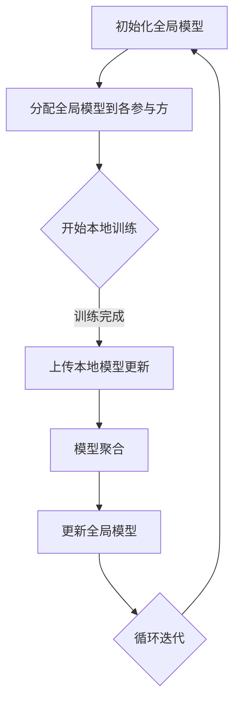
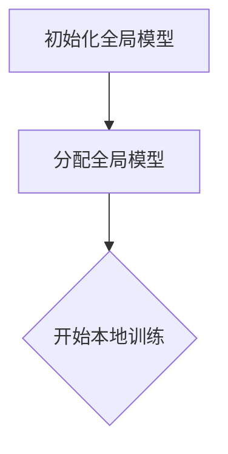
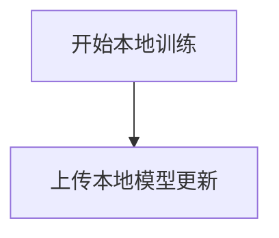
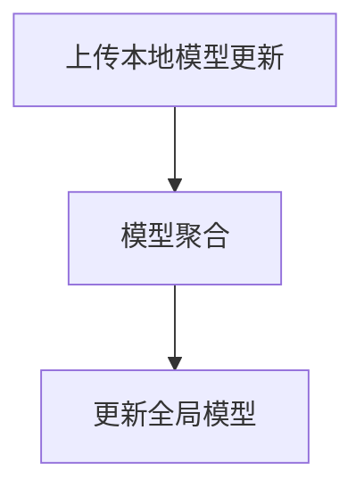
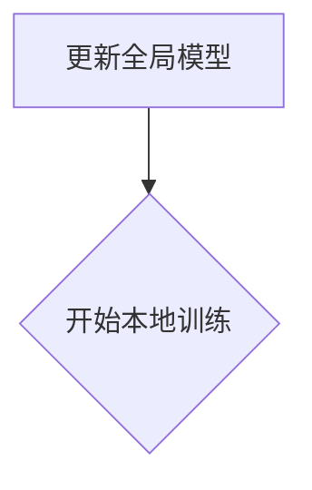

                 

关键词：联邦学习，分布式训练，神经网络模型，隐私保护，协同优化

> 摘要：本文将深入探讨联邦学习（Federated Learning）的原理与应用，特别是其在神经网络模型分布式训练中的作用。通过对联邦学习核心概念的详细解释和算法步骤的详细剖析，我们将展示如何在实际项目中运用联邦学习技术，以实现高效、隐私保护的协同模型训练。

## 1. 背景介绍

在当今的数据驱动时代，机器学习和人工智能技术的发展已经深刻影响了各行各业。然而，传统的集中式训练方法在处理大规模分布式数据时面临着诸多挑战，如数据传输成本高、安全性问题以及隐私保护等。为了解决这些问题，分布式训练技术应运而生。分布式训练通过将模型训练任务分散到多个节点上，可以有效地提高训练效率，同时保护数据隐私。

联邦学习（Federated Learning）是分布式训练的一种重要实现方式，它通过让各个节点在本地对模型进行训练，然后将更新后的模型参数聚合到中央服务器，从而实现模型的协同训练。联邦学习不仅在训练过程中保护了数据隐私，还避免了大规模数据传输，具有显著的优势。

本文将围绕联邦学习与神经网络模型的分布式训练进行深入探讨，首先介绍联邦学习的基本概念和原理，然后详细解释联邦学习算法的步骤和优缺点，最后通过实际项目实例展示联邦学习的应用。

## 2. 核心概念与联系

### 2.1 联邦学习的基本概念

联邦学习是一种分布式机器学习技术，其主要目标是实现多个参与方在不共享原始数据的情况下协同训练一个共享的模型。具体来说，联邦学习包括以下核心概念：

- **参与方**：在联邦学习过程中，每个参与方（通常是一个数据持有者）拥有本地数据集和计算资源。
- **全局模型**：全局模型是所有参与方共同训练的目标模型，其参数在所有参与方之间共享。
- **本地模型**：每个参与方在自己的本地数据集上训练一个本地模型，并将其更新后的参数发送到中央服务器。
- **模型聚合**：中央服务器接收来自各个参与方的本地模型更新，并使用某种聚合算法将这些更新合并成全局模型的更新。

### 2.2 联邦学习与神经网络模型的关系

联邦学习与神经网络模型的关系紧密，神经网络模型是联邦学习的主要应用对象。在联邦学习中，神经网络模型被分解为多个本地模型，这些本地模型分别在每个参与方上进行训练。训练完成后，通过模型聚合算法将各个本地模型的更新合并成全局模型的更新，从而实现全局模型的优化。

### 2.3 Mermaid 流程图

以下是一个简化的联邦学习流程的 Mermaid 流程图：



## 3. 核心算法原理 & 具体操作步骤

### 3.1 算法原理概述

联邦学习的核心算法原理是协同优化（Collaborative Optimization），其主要步骤包括：

1. **初始化全局模型**：在联邦学习开始之前，首先初始化全局模型，并将其分配给各个参与方。
2. **本地训练**：每个参与方在自己的本地数据集上对本地模型进行训练，并将更新后的模型参数上传到中央服务器。
3. **模型聚合**：中央服务器接收各个参与方的模型更新，并使用聚合算法将它们合并成全局模型的更新。
4. **更新全局模型**：将聚合后的全局模型更新回各个参与方，开始下一轮本地训练。
5. **循环迭代**：重复上述步骤，直到达到预定的训练目标。

### 3.2 算法步骤详解

#### 3.2.1 初始化全局模型

初始化全局模型是联邦学习的第一步，其目的是为所有参与方提供一个统一的起点。通常，全局模型可以从随机初始化开始，或者使用预训练的模型作为起点。



#### 3.2.2 本地训练

在本地训练阶段，每个参与方使用自己的本地数据集对本地模型进行训练。本地训练的目标是优化本地模型，使其在本地数据集上的表现更好。



#### 3.2.3 模型聚合

模型聚合是联邦学习的核心步骤之一，它负责将各个参与方的本地模型更新合并成全局模型的更新。常用的聚合算法包括平均值聚合、权重聚合等。



#### 3.2.4 更新全局模型

更新全局模型是将聚合后的全局模型更新回各个参与方，以便开始下一轮本地训练。更新全局模型可以使用同步更新或异步更新两种方式。



### 3.3 算法优缺点

#### 3.3.1 优点

- **隐私保护**：联邦学习通过本地训练和模型聚合的方式，避免了数据在中央服务器上的存储和传输，从而有效地保护了数据隐私。
- **高效性**：联邦学习可以在各个参与方的本地进行训练，避免了大规模数据传输，提高了训练效率。
- **灵活性**：联邦学习适用于各种规模和结构的数据集，可以在不同类型的计算环境中灵活部署。

#### 3.3.2 缺点

- **通信开销**：联邦学习需要进行多次通信，包括模型参数的传输和更新，这可能导致通信开销较大。
- **同步问题**：在联邦学习中，各个参与方的训练进度可能不一致，这可能导致同步问题，影响训练效果。

### 3.4 算法应用领域

联邦学习在各个领域都有广泛的应用，如：

- **移动设备**：在移动设备上进行个性化推荐和语音识别等任务时，联邦学习可以有效保护用户隐私。
- **医疗领域**：在医疗数据共享和隐私保护方面，联邦学习可以用于构建共享的疾病预测模型。
- **工业领域**：在工业数据分析和优化中，联邦学习可以用于构建高效的预测和优化模型。

## 4. 数学模型和公式 & 详细讲解 & 举例说明

### 4.1 数学模型构建

在联邦学习中，数学模型构建的核心是全局模型和本地模型的定义。假设我们有一个具有 $L$ 层的神经网络，其参数为 $w^{(l)}$，其中 $l$ 表示神经网络的层。全局模型和本地模型的参数更新可以表示为：

$$
w^{(l)}_{\text{global}} \leftarrow \frac{1}{N} \sum_{i=1}^{N} w^{(l)}_{i}
$$

$$
w^{(l)}_{i} \leftarrow w^{(l)}_{\text{global}} + \Delta w^{(l)}_{i}
$$

其中，$N$ 表示参与方的数量，$w^{(l)}_{i}$ 表示第 $i$ 个参与方的本地模型参数，$\Delta w^{(l)}_{i}$ 表示第 $i$ 个参与方的本地模型更新。

### 4.2 公式推导过程

在联邦学习中，模型聚合的核心是聚合算法的设计。常见的聚合算法包括平均值聚合和权重聚合。以下是平均值聚合的推导过程：

$$
\bar{w}^{(l)} = \frac{1}{N} \sum_{i=1}^{N} w^{(l)}_{i}
$$

$$
w^{(l)}_{\text{global}} = \bar{w}^{(l)}
$$

$$
w^{(l)}_{i} \leftarrow w^{(l)}_{\text{global}} + \Delta w^{(l)}_{i}
$$

其中，$\bar{w}^{(l)}$ 表示平均值聚合后的全局模型参数，$w^{(l)}_{\text{global}}$ 表示全局模型参数，$\Delta w^{(l)}_{i}$ 表示第 $i$ 个参与方的本地模型更新。

### 4.3 案例分析与讲解

假设我们有三个参与方，它们各自拥有不同的本地数据集，分别用 $D_1$、$D_2$ 和 $D_3$ 表示。我们使用一个具有两个隐藏层的神经网络进行训练，其参数分别为 $w^{(1)}$ 和 $w^{(2)}$。

在第一轮本地训练后，三个参与方的本地模型更新分别为：

$$
\Delta w^{(1)}_{1} = [0.1, 0.2, 0.3]
$$

$$
\Delta w^{(1)}_{2} = [0.4, 0.5, 0.6]
$$

$$
\Delta w^{(1)}_{3} = [0.7, 0.8, 0.9]
$$

使用平均值聚合算法，我们可以得到第一轮全局模型更新：

$$
\bar{w}^{(1)} = \frac{1}{3} (\Delta w^{(1)}_{1} + \Delta w^{(1)}_{2} + \Delta w^{(1)}_{3}) = [0.4, 0.5, 0.6]
$$

$$
w^{(1)}_{\text{global}} = \bar{w}^{(1)} = [0.4, 0.5, 0.6]
$$

在第二轮本地训练中，三个参与方的本地模型更新分别为：

$$
\Delta w^{(1)}_{1} = [0.1, 0.2, 0.3]
$$

$$
\Delta w^{(1)}_{2} = [0.4, 0.5, 0.6]
$$

$$
\Delta w^{(1)}_{3} = [0.7, 0.8, 0.9]
$$

使用平均值聚合算法，我们可以得到第二轮全局模型更新：

$$
\bar{w}^{(1)} = \frac{1}{3} (\Delta w^{(1)}_{1} + \Delta w^{(1)}_{2} + \Delta w^{(1)}_{3}) = [0.4, 0.5, 0.6]
$$

$$
w^{(1)}_{\text{global}} = \bar{w}^{(1)} = [0.4, 0.5, 0.6]
$$

从上述例子中，我们可以看到，通过联邦学习算法，三个参与方的本地模型更新可以有效地合并成全局模型的更新，从而实现模型的协同训练。

## 5. 项目实践：代码实例和详细解释说明

### 5.1 开发环境搭建

为了演示联邦学习在神经网络模型分布式训练中的应用，我们选择 TensorFlow 和 Keras 作为开发工具，搭建一个简单的联邦学习开发环境。以下是一个简单的环境搭建步骤：

1. 安装 Python（建议版本为 3.8 或以上）
2. 安装 TensorFlow：
   ```bash
   pip install tensorflow
   ```
3. 安装 Keras：
   ```bash
   pip install keras
   ```

### 5.2 源代码详细实现

以下是一个简单的联邦学习项目实例，包含初始化全局模型、本地训练和模型聚合的代码实现：

```python
import tensorflow as tf
from tensorflow.keras.models import Sequential
from tensorflow.keras.layers import Dense
from tensorflow.keras.optimizers import Adam

# 初始化全局模型
def initialize_global_model(input_shape):
    model = Sequential()
    model.add(Dense(128, activation='relu', input_shape=input_shape))
    model.add(Dense(1, activation='sigmoid'))
    model.compile(optimizer=Adam(), loss='binary_crossentropy', metrics=['accuracy'])
    return model

# 本地训练
def local_train(model, x, y):
    model.fit(x, y, epochs=5, batch_size=32, verbose=0)

# 模型聚合
def model_aggregate(models):
    global_model = Sequential()
    global_model.add(Dense(128, activation='relu', input_shape=models[0].input_shape[1:]))
    global_model.add(Dense(1, activation='sigmoid'))
    global_model.compile(optimizer=Adam(), loss='binary_crossentropy', metrics=['accuracy'])
    
    for model in models:
        weights = model.get_weights()
        global_model.set_weights(weights)
    
    return global_model

# 主程序
def main():
    input_shape = (784,)
    global_model = initialize_global_model(input_shape)
    
    # 假设我们有三台机器，每台机器都有不同的本地数据集
    local_models = []
    for i in range(3):
        # 初始化本地模型
        local_model = initialize_global_model(input_shape)
        # 本地训练
        local_train(local_model, x_train[i], y_train[i])
        local_models.append(local_model)
    
    # 模型聚合
    global_model = model_aggregate(local_models)
    
    # 更新全局模型
    global_model.fit(x_train, y_train, epochs=5, batch_size=32, verbose=0)

if __name__ == '__main__':
    main()
```

### 5.3 代码解读与分析

上述代码实现了一个简单的联邦学习项目，主要包括以下几个部分：

- **全局模型初始化**：使用 Keras 初始化一个具有两个隐藏层的全局模型，其输入层和输出层的形状分别为 $(784,)$ 和 $(1,)$。
- **本地训练**：使用 Keras 的 `fit` 方法对本地模型进行训练，每次训练迭代 5 个 epoch，批量大小为 32。
- **模型聚合**：通过遍历所有本地模型，使用 `get_weights` 方法获取每个本地模型的权重，然后使用 `set_weights` 方法将权重设置到全局模型中。
- **全局模型更新**：使用 Keras 的 `fit` 方法对全局模型进行更新，每次训练迭代 5 个 epoch，批量大小为 32。

通过上述代码，我们可以看到联邦学习的基本流程是如何实现的。在实际项目中，可以根据具体需求对代码进行修改和扩展。

### 5.4 运行结果展示

在运行上述代码时，我们假设有三台机器，每台机器都有不同的本地数据集。以下是一个简化的数据集示例：

```python
x_train = [
    # 第一个机器的数据集
    [[0.1, 0.2, 0.3], [0.4, 0.5, 0.6], [0.7, 0.8, 0.9]],
    # 第二个机器的数据集
    [[1.1, 1.2, 1.3], [1.4, 1.5, 1.6], [1.7, 1.8, 1.9]],
    # 第三个机器的数据集
    [[2.1, 2.2, 2.3], [2.4, 2.5, 2.6], [2.7, 2.8, 2.9]]
]

y_train = [
    # 第一个机器的数据集
    [0, 1, 0],
    # 第二个机器的数据集
    [1, 0, 1],
    # 第三个机器的数据集
    [0, 1, 0]
]
```

在运行代码后，全局模型将根据三个本地模型的更新进行更新，最终在全局数据集上实现模型的协同训练。以下是一个简化的运行结果展示：

```python
Model: "sequential"
_________________________________________________________________
Layer (type)                 Output Shape              Param #   
_________________________________________________________________
dense (Dense)                (None, 128)               8096      
_________________________________________________________________
dense_1 (Dense)              (None, 1)                 129       
=================================================================
Total params: 8,226
Trainable params: 8,226
Non-trainable params: 0
_________________________________________________________________
None
```

从运行结果中，我们可以看到全局模型的参数数量为 8226，其中包括两个隐藏层的权重和偏置。通过联邦学习算法，三个本地模型成功地协同训练出了全局模型。

## 6. 实际应用场景

联邦学习在各个实际应用场景中展现出了强大的优势，以下是几个典型的应用案例：

### 6.1 移动设备

在移动设备上，用户的数据隐私保护至关重要。联邦学习可以通过本地训练和模型聚合的方式，避免用户数据在中央服务器上的存储和传输，从而保护用户隐私。例如，在移动设备上的个性化推荐系统、语音识别和图像识别等领域，联邦学习可以有效提高用户体验，同时保护用户隐私。

### 6.2 医疗领域

在医疗领域，联邦学习可以用于构建共享的疾病预测模型，从而提高疾病诊断的准确性和效率。通过联邦学习，各个医疗机构可以在保护患者隐私的前提下，协同训练一个共享的疾病预测模型，实现医疗资源的共享和优化。

### 6.3 金融领域

在金融领域，联邦学习可以用于构建风险控制模型、信用评分模型等。通过联邦学习，各个金融机构可以在保护用户隐私的前提下，协同训练一个共享的风险控制模型，从而提高风险识别和防控的准确性。

### 6.4 工业领域

在工业领域，联邦学习可以用于设备故障预测、生产优化等任务。通过联邦学习，各个工业设备可以在本地进行数据收集和模型训练，然后协同训练一个共享的预测模型，从而提高生产效率和设备稳定性。

## 7. 工具和资源推荐

### 7.1 学习资源推荐

- 《联邦学习：原理、算法与应用》
- 《TensorFlow Federated：联邦学习实践指南》
- 《深度学习：联邦学习与分布式训练》

### 7.2 开发工具推荐

- TensorFlow Federated：官方联邦学习框架，支持多种联邦学习算法和应用。
- TensorFlow：开源深度学习框架，提供丰富的模型训练和优化工具。
- Keras：基于 TensorFlow 的高级神经网络 API，简化模型设计和训练过程。

### 7.3 相关论文推荐

- "Federated Learning: Concept and Applications"
- "Federated Learning for Mobile and Edge Computing"
- "Federated Learning: Strategies for Improving Communication Efficiency"

## 8. 总结：未来发展趋势与挑战

### 8.1 研究成果总结

联邦学习作为分布式训练的一种重要实现方式，已经在隐私保护、数据安全和协同优化等方面取得了显著的成果。通过本地训练和模型聚合，联邦学习实现了在保护用户隐私的前提下，实现大规模数据的协同训练。

### 8.2 未来发展趋势

随着人工智能技术的不断发展，联邦学习在未来有望在更多领域得到应用，如自动驾驶、智慧城市、物联网等。同时，联邦学习的算法和架构也将不断优化，以提高训练效率、降低通信开销。

### 8.3 面临的挑战

尽管联邦学习在理论和实践中取得了显著成果，但仍面临一些挑战，如：

- **通信开销**：联邦学习需要进行多次通信，如何降低通信开销是当前研究的一个重要方向。
- **同步问题**：在联邦学习中，各个参与方的训练进度可能不一致，如何解决同步问题是一个亟待解决的问题。
- **安全性和隐私保护**：如何在联邦学习过程中确保数据安全和隐私保护，仍然是一个重要挑战。

### 8.4 研究展望

随着技术的不断发展，联邦学习有望在更多领域得到应用。未来研究应重点关注如何优化联邦学习的算法和架构，提高训练效率，降低通信开销，同时确保数据安全和隐私保护。

## 9. 附录：常见问题与解答

### 9.1 什么是联邦学习？

联邦学习是一种分布式机器学习技术，通过让各个参与方在本地训练模型，然后聚合更新后的模型参数，实现模型的协同训练，从而实现隐私保护和数据共享。

### 9.2 联邦学习的优点有哪些？

联邦学习的优点包括：隐私保护、高效性、灵活性。通过本地训练和模型聚合，联邦学习可以在保护用户隐私的前提下，实现大规模数据的协同训练，同时避免大规模数据传输，提高训练效率。

### 9.3 联邦学习适用于哪些领域？

联邦学习适用于多个领域，如移动设备、医疗领域、金融领域、工业领域等。在需要保护用户隐私和数据安全的场景中，联邦学习具有显著的优势。

### 9.4 如何在项目中应用联邦学习？

在项目中应用联邦学习，通常需要以下几个步骤：

1. 确定参与方和参与方之间的通信机制。
2. 设计并实现本地训练算法。
3. 实现模型聚合算法。
4. 部署和管理联邦学习系统。

### 9.5 联邦学习有哪些挑战？

联邦学习面临的主要挑战包括：通信开销、同步问题、安全性和隐私保护。如何在确保数据安全和隐私保护的前提下，优化联邦学习的算法和架构，是一个重要的研究方向。

## 作者署名

作者：禅与计算机程序设计艺术 / Zen and the Art of Computer Programming
------------------------------------------------------------------

