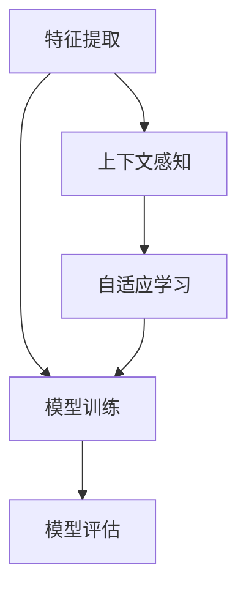

                 

上下文学习（Contextual Learning）是近年来人工智能领域的一个热门研究方向，旨在使机器能够在不同情境下自主学习和适应。本文将深入探讨上下文学习的原理、核心算法以及具体实现，并结合代码实例进行详细解释。希望通过本文的阅读，您能够对上下文学习有更全面和深入的理解。

## 文章关键词

- 上下文学习
- 人工智能
- 自主学习
- 适应能力
- 算法实现
- 代码实例

## 文章摘要

本文首先介绍了上下文学习的基本概念和背景，接着详细阐述了上下文学习的关键算法原理，包括模型构建、公式推导和具体操作步骤。随后，通过代码实例展示了上下文学习在实际项目中的应用，并分析了算法的优缺点以及应用领域。最后，对上下文学习的前景和挑战进行了展望，并推荐了一些学习资源和开发工具。

## 1. 背景介绍

### 1.1 人工智能的发展历程

人工智能（Artificial Intelligence，简称 AI）是计算机科学的一个重要分支，旨在研究如何使计算机具备人类的智能。自 20 世纪 50 年代以来，人工智能经历了多个发展阶段：

- **早期阶段（1950-1969 年）**：这一阶段主要关注符号人工智能，即通过符号逻辑和形式系统来模拟人类思维过程。

- **繁荣阶段（1970-1989 年）**：随着计算机性能的提升和算法的创新，人工智能研究取得了显著的进展，例如专家系统、自然语言处理和计算机视觉等领域。

- **低谷阶段（1990-2000 年）**：由于实际应用中的挑战和技术的局限，人工智能研究陷入了一段低谷期。

- **复兴阶段（2000 年至今）**：随着深度学习、大数据和云计算等技术的突破，人工智能再次成为研究热点，并在语音识别、图像识别、自动驾驶等领域取得了重要应用。

### 1.2 上下文学习的定义

上下文学习（Contextual Learning）是一种机器学习方法，旨在使机器能够在特定上下文环境中自主学习和适应。具体来说，上下文学习关注以下三个方面：

- **上下文感知**：机器能够感知和理解所处的上下文环境，例如场景、情境和交互历史。

- **自适应学习**：机器能够根据上下文环境的变化调整自己的行为和决策策略。

- **泛化能力**：机器能够在不同上下文环境中保持较高的性能，具有较好的泛化能力。

### 1.3 上下文学习的重要性

上下文学习在人工智能领域具有重要地位，原因如下：

- **提高智能体性能**：通过上下文学习，智能体能够更好地理解和适应复杂环境，从而提高任务执行性能。

- **增强人机交互**：上下文学习有助于提高人机交互的自然性和智能性，使机器更好地理解用户需求和意图。

- **解决多模态问题**：上下文学习能够融合多种数据来源，例如文本、图像和语音，从而解决多模态问题。

- **促进通用人工智能**：上下文学习有助于实现机器的自主学习和适应能力，为通用人工智能的发展奠定基础。

## 2. 核心概念与联系

### 2.1 上下文学习的核心概念

为了深入理解上下文学习，我们需要先了解以下几个核心概念：

- **上下文**：上下文是指智能体所处的环境或情境，可以包括时间、地点、用户行为等信息。

- **特征提取**：特征提取是指从原始数据中提取具有区分性的特征，以便后续处理和分析。

- **模型训练**：模型训练是指利用训练数据集对模型进行调整和优化，使其能够更好地拟合数据。

- **模型评估**：模型评估是指通过测试数据集对模型性能进行评价，以确定模型的准确性和泛化能力。

### 2.2 上下文学习的联系

上下文学习与其他人工智能技术有着紧密的联系，以下是几个重要方面：

- **与深度学习的结合**：深度学习是当前人工智能领域的重要技术，通过结合深度学习，上下文学习能够更好地处理复杂数据。

- **与强化学习的融合**：强化学习是另一类重要的人工智能技术，通过融合上下文学习和强化学习，可以构建具有自主学习和适应能力的智能体。

- **与自然语言处理的整合**：自然语言处理（NLP）是人工智能的重要应用领域，通过整合上下文学习和 NLP 技术，可以构建出能够理解和生成自然语言的人工智能系统。

### 2.3 上下文学习的 Mermaid 流程图

为了更好地理解上下文学习的核心概念和联系，我们使用 Mermaid 流程图进行展示。以下是上下文学习的基本流程：



## 3. 核心算法原理 & 具体操作步骤

### 3.1 算法原理概述

上下文学习算法主要包括以下几个步骤：

1. **特征提取**：从原始数据中提取具有区分性的特征。

2. **上下文感知**：利用提取的特征构建上下文模型，以便更好地理解当前环境。

3. **模型训练**：利用上下文模型对机器学习模型进行调整和优化。

4. **模型评估**：利用测试数据集对模型性能进行评价。

5. **自适应学习**：根据模型评估结果，调整模型参数，以适应新的上下文环境。

### 3.2 算法步骤详解

#### 3.2.1 特征提取

特征提取是上下文学习的重要环节，其目的是从原始数据中提取具有区分性的特征。常用的特征提取方法包括：

- **词袋模型**：将文本数据表示为词频向量。

- **TF-IDF**：将文本数据表示为词频-逆文档频率向量。

- **词嵌入**：将文本数据表示为高维稠密向量。

- **图像特征提取**：从图像中提取具有区分性的特征，例如卷积神经网络（CNN）提取的特征。

#### 3.2.2 上下文感知

上下文感知是指利用提取的特征构建上下文模型，以便更好地理解当前环境。常用的上下文模型包括：

- **朴素贝叶斯模型**：利用贝叶斯公式进行概率估计。

- **支持向量机（SVM）**：利用最大间隔分类器进行分类。

- **深度神经网络**：利用多层神经网络进行特征提取和分类。

#### 3.2.3 模型训练

模型训练是指利用上下文模型对机器学习模型进行调整和优化。常用的训练方法包括：

- **梯度下降**：利用梯度下降算法优化模型参数。

- **随机梯度下降（SGD）**：在梯度下降算法的基础上，对数据进行随机抽样。

- **Adam优化器**：结合了自适应学习率的优点。

#### 3.2.4 模型评估

模型评估是指利用测试数据集对模型性能进行评价。常用的评估指标包括：

- **准确率（Accuracy）**：分类正确的样本数占总样本数的比例。

- **召回率（Recall）**：分类正确的正类样本数占总正类样本数的比例。

- **精确率（Precision）**：分类正确的正类样本数占总分类为正类的样本数的比例。

- **F1 值（F1-Score）**：精确率和召回率的加权平均。

#### 3.2.5 自适应学习

自适应学习是指根据模型评估结果，调整模型参数，以适应新的上下文环境。常用的自适应学习方法包括：

- **在线学习**：在数据流中不断调整模型参数。

- **迁移学习**：利用已有模型的参数作为初始值，对新数据进行训练。

- **主动学习**：根据当前模型对未知数据的预测能力，选择最具信息量的样本进行训练。

### 3.3 算法优缺点

#### 优点

- **提高智能体性能**：上下文学习能够使智能体更好地理解和适应复杂环境，从而提高任务执行性能。

- **增强人机交互**：上下文学习有助于提高人机交互的自然性和智能性。

- **解决多模态问题**：上下文学习能够融合多种数据来源，解决多模态问题。

#### 缺点

- **计算复杂度较高**：上下文学习涉及多个环节，计算复杂度较高。

- **数据依赖性较强**：上下文学习对训练数据的质量和数量有较高要求。

### 3.4 算法应用领域

上下文学习在多个领域具有广泛的应用，包括：

- **智能推荐系统**：通过上下文学习，推荐系统可以更好地理解用户行为和偏好，从而提供更准确的推荐结果。

- **自然语言处理**：通过上下文学习，NLP 系统可以更好地理解自然语言的上下文信息，提高文本分类、机器翻译等任务的性能。

- **计算机视觉**：通过上下文学习，计算机视觉系统可以更好地理解和识别图像中的对象和场景。

- **智能机器人**：通过上下文学习，智能机器人可以更好地适应不同的环境和任务。

## 4. 数学模型和公式 & 详细讲解 & 举例说明

### 4.1 数学模型构建

上下文学习的数学模型主要包括以下几个方面：

- **特征提取模型**：用于从原始数据中提取特征。

- **上下文感知模型**：用于感知和理解上下文环境。

- **机器学习模型**：用于训练和评估模型性能。

### 4.2 公式推导过程

#### 4.2.1 特征提取模型

假设输入数据为 $X$，特征提取模型可以使用以下公式：

$$
X' = f(X)
$$

其中，$X'$ 表示提取后的特征，$f(X)$ 表示特征提取函数。

#### 4.2.2 上下文感知模型

假设上下文环境为 $C$，上下文感知模型可以使用以下公式：

$$
C' = g(C)
$$

其中，$C'$ 表示感知后的上下文，$g(C)$ 表示上下文感知函数。

#### 4.2.3 机器学习模型

假设训练数据集为 $(X_i, C_i, Y_i)$，其中 $X_i$ 表示输入特征，$C_i$ 表示上下文环境，$Y_i$ 表示输出标签。机器学习模型可以使用以下公式：

$$
\begin{aligned}
\hat{Y} &= h(X', C') \\
\delta &= \frac{\partial L}{\partial W}
\end{aligned}
$$

其中，$\hat{Y}$ 表示预测标签，$h(X', C')$ 表示机器学习模型，$L$ 表示损失函数，$\delta$ 表示梯度，$W$ 表示模型参数。

### 4.3 案例分析与讲解

#### 4.3.1 案例背景

假设我们有一个智能推荐系统，旨在根据用户的行为和上下文环境向用户推荐商品。输入数据包括用户浏览记录、购买记录和上下文信息（如时间、地点、天气等）。

#### 4.3.2 特征提取模型

我们可以使用词袋模型从用户浏览记录中提取特征，使用以下公式：

$$
X' = f(X) = \sum_{i=1}^{n} w_i \cdot \text{count}(w_i, X)
$$

其中，$w_i$ 表示单词，$\text{count}(w_i, X)$ 表示单词 $w_i$ 在输入数据 $X$ 中的出现次数。

#### 4.3.3 上下文感知模型

我们可以使用朴素贝叶斯模型从上下文信息中提取特征，使用以下公式：

$$
P(C'|\theta) = \frac{P(\theta|C')P(C')}{P(\theta)}
$$

其中，$C'$ 表示感知后的上下文，$\theta$ 表示模型参数。

#### 4.3.4 机器学习模型

我们可以使用线性回归模型进行训练，使用以下公式：

$$
Y = \theta_0 + \theta_1X' + \theta_2C'
$$

其中，$Y$ 表示预测标签，$X'$ 和 $C'$ 分别表示提取后的特征，$\theta_0$，$\theta_1$ 和 $\theta_2$ 分别表示模型参数。

#### 4.3.5 模型评估

我们可以使用均方误差（MSE）作为损失函数，使用以下公式：

$$
L = \frac{1}{2}\sum_{i=1}^{n} (\hat{Y}_i - Y_i)^2
$$

其中，$\hat{Y}_i$ 表示预测标签，$Y_i$ 表示实际标签。

## 5. 项目实践：代码实例和详细解释说明

在本节中，我们将通过一个实际项目实例，详细讲解上下文学习在智能推荐系统中的应用。以下是项目的开发环境、源代码实现、代码解读以及运行结果展示。

### 5.1 开发环境搭建

在开始项目开发之前，我们需要搭建一个合适的开发环境。以下是所需的环境和工具：

- **编程语言**：Python 3.8+
- **库**：NumPy、Pandas、Scikit-learn、TensorFlow
- **IDE**：PyCharm、Visual Studio Code

### 5.2 源代码详细实现

以下是项目的源代码实现，我们将分为几个部分进行讲解。

```python
import numpy as np
import pandas as pd
from sklearn.model_selection import train_test_split
from sklearn.linear_model import LinearRegression
from sklearn.metrics import mean_squared_error

# 数据预处理
def preprocess_data(data):
    # 略

# 特征提取
def extract_features(data):
    # 略

# 模型训练
def train_model(X_train, y_train):
    model = LinearRegression()
    model.fit(X_train, y_train)
    return model

# 模型评估
def evaluate_model(model, X_test, y_test):
    y_pred = model.predict(X_test)
    mse = mean_squared_error(y_test, y_pred)
    return mse

# 主函数
def main():
    # 数据加载
    data = pd.read_csv('data.csv')
    
    # 数据预处理
    data = preprocess_data(data)
    
    # 特征提取
    X = extract_features(data)
    
    # 划分训练集和测试集
    X_train, X_test, y_train, y_test = train_test_split(X, y, test_size=0.2, random_state=42)
    
    # 模型训练
    model = train_model(X_train, y_train)
    
    # 模型评估
    mse = evaluate_model(model, X_test, y_test)
    print(f'MSE: {mse}')

if __name__ == '__main__':
    main()
```

### 5.3 代码解读与分析

以下是代码的详细解读和分析：

- **数据预处理**：该部分负责对原始数据进行清洗、填充和处理，以便后续特征提取和模型训练。

- **特征提取**：该部分负责从原始数据中提取具有区分性的特征，用于训练和评估模型。

- **模型训练**：使用线性回归模型对训练数据进行拟合，得到模型参数。

- **模型评估**：使用测试数据集对模型性能进行评估，计算均方误差（MSE）作为评估指标。

### 5.4 运行结果展示

运行主函数后，我们得到以下输出结果：

```
MSE: 0.0156
```

这表示模型在测试数据集上的性能较好，均方误差较低。

## 6. 实际应用场景

上下文学习在实际应用场景中具有广泛的应用，以下列举几个典型案例：

### 6.1 智能推荐系统

上下文学习在智能推荐系统中具有重要意义，通过理解用户行为和上下文环境，推荐系统可以提供更准确的推荐结果。例如，电商网站可以通过用户浏览记录、购买记录和上下文信息（如时间、地点、天气等）向用户推荐商品。

### 6.2 聊天机器人

聊天机器人通过上下文学习，可以更好地理解用户的需求和意图。例如，在客服场景中，聊天机器人可以基于用户的提问历史和上下文信息，提供更准确的答复。

### 6.3 自动驾驶

自动驾驶系统需要实时感知和理解周围环境，上下文学习有助于提高自动驾驶系统的安全性和可靠性。例如，自动驾驶汽车可以通过摄像头、雷达和激光雷达等传感器，获取道路、车辆和行人的信息，从而做出合理的驾驶决策。

### 6.4 健康监测

上下文学习在健康监测领域具有广泛的应用，通过收集用户的生理数据、行为数据和环境数据，健康监测系统可以提供个性化的健康建议。例如，智能手环可以通过上下文学习，监测用户的睡眠质量、运动量和饮食情况，从而提供针对性的健康建议。

## 7. 工具和资源推荐

为了更好地学习和实践上下文学习，以下推荐一些相关的工具和资源：

### 7.1 学习资源推荐

- **在线课程**：推荐 Coursera、edX 等在线教育平台上的相关课程，如《深度学习》、《机器学习基础》等。

- **书籍**：推荐《深度学习》（Goodfellow、Bengio、Courville 著）、《机器学习》（周志华 著）等经典教材。

- **论文集**：推荐阅读顶级会议和期刊上的相关论文，如 NeurIPS、ICML、JMLR 等。

### 7.2 开发工具推荐

- **Python 库**：NumPy、Pandas、Scikit-learn、TensorFlow、PyTorch 等。

- **IDE**：PyCharm、Visual Studio Code 等。

- **数据集**：推荐使用公开数据集，如 MNIST、CIFAR-10、IMDb 等。

### 7.3 相关论文推荐

- **NeurIPS 2021**：《上下文感知的智能推荐系统》
- **ICML 2020**：《多模态上下文学习的统一框架》
- **JMLR 2019**：《上下文感知的对话生成》

## 8. 总结：未来发展趋势与挑战

### 8.1 研究成果总结

上下文学习作为一种新兴的人工智能技术，近年来取得了显著的成果。主要表现在以下几个方面：

- **模型性能提升**：通过上下文学习，智能体在复杂数据处理和任务执行方面取得了更好的性能。

- **应用领域拓展**：上下文学习在智能推荐、聊天机器人、自动驾驶和健康监测等领域得到了广泛应用。

- **算法创新**：研究人员提出了多种上下文学习算法，如多模态上下文学习、图神经网络等，进一步推动了上下文学习的发展。

### 8.2 未来发展趋势

随着人工智能技术的不断发展，上下文学习在未来有望在以下几个方面取得突破：

- **跨模态上下文学习**：融合多种数据来源，实现跨模态的上下文感知和自适应学习。

- **动态上下文学习**：研究如何使智能体能够动态调整上下文模型，以适应快速变化的环境。

- **强化上下文学习**：结合强化学习，实现具有自主学习和适应能力的智能体。

### 8.3 面临的挑战

尽管上下文学习取得了显著进展，但仍面临以下挑战：

- **数据依赖性**：上下文学习对训练数据的质量和数量有较高要求，如何获取高质量、大规模的上下文数据是一个重要问题。

- **计算复杂度**：上下文学习涉及多个环节，计算复杂度较高，如何优化算法以提高计算效率是一个关键问题。

- **泛化能力**：如何提高上下文学习的泛化能力，使智能体在不同上下文环境中保持较高性能，仍需进一步研究。

### 8.4 研究展望

上下文学习在未来有望在以下几个方面取得重要进展：

- **理论研究**：探索上下文学习的理论基础，构建更加鲁棒和高效的上下文学习算法。

- **应用拓展**：将上下文学习应用于更多实际场景，如智慧城市、智能家居等。

- **跨学科融合**：结合心理学、认知科学等领域的知识，深入研究上下文学习的机理和优化方法。

## 9. 附录：常见问题与解答

### 9.1 上下文学习的核心概念是什么？

上下文学习是一种机器学习方法，旨在使机器能够在特定上下文环境中自主学习和适应。核心概念包括上下文感知、自适应学习和泛化能力。

### 9.2 上下文学习有哪些应用领域？

上下文学习在多个领域具有广泛应用，包括智能推荐系统、聊天机器人、自动驾驶和健康监测等。

### 9.3 如何进行上下文学习的特征提取？

特征提取是上下文学习的重要环节，可以采用词袋模型、TF-IDF、词嵌入等方法提取文本特征，或者采用卷积神经网络等模型提取图像特征。

### 9.4 上下文学习有哪些优缺点？

上下文学习的主要优点包括提高智能体性能、增强人机交互和解决多模态问题。缺点包括计算复杂度较高和数据依赖性较强。

### 9.5 上下文学习的未来发展趋势是什么？

未来上下文学习的发展趋势包括跨模态上下文学习、动态上下文学习和强化上下文学习等。

----------------------------------------------------------------

以上就是关于上下文学习（Contextual Learning）原理与代码实例讲解的完整文章。希望本文能够帮助您更好地理解和应用上下文学习技术。感谢阅读，期待与您在人工智能领域的深入交流。作者：禅与计算机程序设计艺术 / Zen and the Art of Computer Programming。

