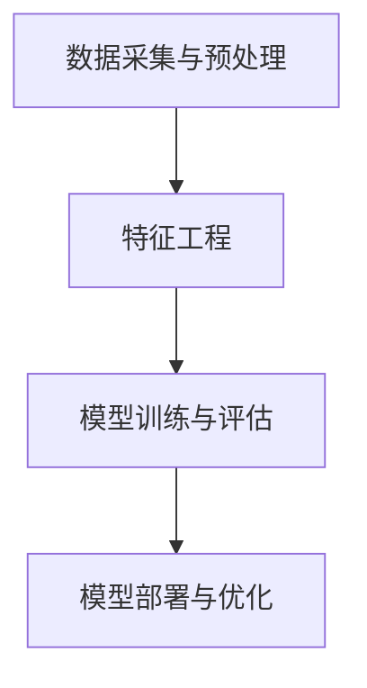

                 

关键词：个性化AI、工具链、构建方法、AI框架、算法原理、数学模型、项目实践

> 摘要：本文将详细介绍个性化AI工具链的构建方法，从背景介绍、核心概念与联系、核心算法原理与操作步骤、数学模型与公式、项目实践、实际应用场景、工具和资源推荐以及未来发展趋势与挑战等方面，全面探讨如何构建一个高效、可扩展的个性化AI工具链。

## 1. 背景介绍

随着人工智能技术的迅猛发展，个性化AI的应用场景日益广泛，如智能推荐系统、个性化广告投放、智能客服等。个性化AI工具链作为实现这些应用的核心技术，其构建方法的研究具有重要意义。本文旨在探讨个性化AI工具链的构建方法，以期为相关领域的研究者提供有益的参考。

### 1.1 个性化AI的定义与特点

个性化AI是指根据用户的行为、偏好、历史数据等信息，为用户提供定制化的服务或内容。与通用AI相比，个性化AI具有以下几个特点：

- **数据驱动**：个性化AI依赖于用户数据，通过对数据的分析和挖掘，实现个性化的服务。
- **高度定制化**：根据用户的需求和偏好，为用户提供个性化的推荐、广告或服务。
- **实时性**：个性化AI需要实时响应用户的行为和需求，提供即时的个性化服务。

### 1.2 个性化AI工具链的组成部分

个性化AI工具链通常包括以下几个部分：

- **数据采集与预处理**：收集用户数据，并对数据进行清洗、转换和格式化。
- **特征工程**：从原始数据中提取有用的特征，为模型训练提供输入。
- **模型训练与评估**：使用机器学习算法对特征进行建模，评估模型性能。
- **模型部署与优化**：将训练好的模型部署到生产环境，根据实际运行效果进行优化。

## 2. 核心概念与联系

### 2.1 数据采集与预处理

数据采集与预处理是个性化AI工具链的基础。其核心概念包括：

- **数据源**：包括用户行为数据、用户偏好数据等。
- **数据清洗**：去除数据中的噪声、缺失值和重复值。
- **数据转换**：将数据转换为适合模型训练的格式。

### 2.2 特征工程

特征工程是构建个性化AI模型的关键环节。其核心概念包括：

- **特征提取**：从原始数据中提取有用的特征。
- **特征选择**：选择对模型训练有重要影响的特征。
- **特征转换**：将特征进行归一化、标准化等处理。

### 2.3 模型训练与评估

模型训练与评估是构建个性化AI工具链的核心。其核心概念包括：

- **机器学习算法**：常用的机器学习算法包括线性回归、决策树、随机森林、神经网络等。
- **模型评估**：使用准确率、召回率、F1值等指标评估模型性能。

### 2.4 模型部署与优化

模型部署与优化是确保个性化AI工具链高效运行的关键。其核心概念包括：

- **模型部署**：将训练好的模型部署到生产环境。
- **模型优化**：根据实际运行效果对模型进行优化。

下面是构建个性化AI工具链的 Mermaid 流程图：



## 3. 核心算法原理与具体操作步骤

### 3.1 算法原理概述

个性化AI工具链的核心算法包括数据挖掘、机器学习、深度学习等。其中，常用的算法有协同过滤、聚类、决策树、随机森林、神经网络等。下面分别介绍这些算法的原理。

### 3.2 算法步骤详解

#### 3.2.1 协同过滤

协同过滤是一种基于用户行为或偏好的推荐算法。其基本思想是，根据用户之间的相似度，为用户推荐其他用户喜欢的物品。协同过滤算法分为基于用户的协同过滤和基于项目的协同过滤。

- **基于用户的协同过滤**：为用户推荐与兴趣相似的用户的喜欢的物品。
- **基于项目的协同过滤**：为用户推荐与已购买或收藏的物品相似的物品。

#### 3.2.2 聚类

聚类是一种无监督学习方法，用于将数据分为多个类别。常用的聚类算法有K-means、层次聚类等。

- **K-means**：将数据分为K个类别，每个类别由一个中心点表示。
- **层次聚类**：将数据分为多个层次，每一层都是一个聚类结果。

#### 3.2.3 决策树

决策树是一种基于特征划分的数据挖掘方法。其基本思想是，通过一系列条件判断，将数据划分为多个类别。

- **ID3算法**：基于信息增益选择最佳特征。
- **C4.5算法**：基于信息增益率选择最佳特征。

#### 3.2.4 随机森林

随机森林是一种集成学习方法，通过构建多个决策树，并取它们的平均值作为最终结果。

- **随机森林**：通过随机抽样和特征选择，构建多个决策树。

#### 3.2.5 神经网络

神经网络是一种模仿人脑结构和功能的人工智能算法。其基本思想是通过多层神经元进行数据传递和计算。

- **前馈神经网络**：数据从输入层传递到输出层。
- **卷积神经网络**：用于处理图像等二维数据。

### 3.3 算法优缺点

- **协同过滤**：优点是算法简单，易于实现。缺点是当数据量较大时，计算复杂度较高，且难以应对冷启动问题。
- **聚类**：优点是无需预先定义类别数量。缺点是聚类结果可能受到噪声数据的影响。
- **决策树**：优点是易于理解和解释。缺点是可能产生过拟合，且决策树的深度较难控制。
- **随机森林**：优点是提高了模型的泛化能力，减少了过拟合的风险。缺点是计算复杂度较高。
- **神经网络**：优点是能够处理复杂的关系，具有强大的表示能力。缺点是需要大量数据和较长的训练时间。

### 3.4 算法应用领域

- **协同过滤**：应用于推荐系统，如商品推荐、音乐推荐等。
- **聚类**：应用于市场细分、用户群体划分等。
- **决策树**：应用于分类、回归等问题。
- **随机森林**：应用于分类、回归、异常检测等问题。
- **神经网络**：应用于图像识别、语音识别、自然语言处理等领域。

## 4. 数学模型和公式

### 4.1 数学模型构建

个性化AI工具链中的数学模型主要包括线性回归、逻辑回归、神经网络等。下面分别介绍这些模型的构建过程。

#### 4.1.1 线性回归

线性回归模型用于预测连续值。其数学模型如下：

$$
y = \beta_0 + \beta_1 x_1 + \beta_2 x_2 + ... + \beta_n x_n + \epsilon
$$

其中，$y$ 是预测值，$x_1, x_2, ..., x_n$ 是特征值，$\beta_0, \beta_1, ..., \beta_n$ 是模型参数，$\epsilon$ 是误差项。

#### 4.1.2 逻辑回归

逻辑回归模型用于预测概率值。其数学模型如下：

$$
\hat{y} = \frac{1}{1 + e^{-(\beta_0 + \beta_1 x_1 + \beta_2 x_2 + ... + \beta_n x_n)}}
$$

其中，$\hat{y}$ 是预测概率，$\beta_0, \beta_1, ..., \beta_n$ 是模型参数。

#### 4.1.3 神经网络

神经网络模型由多层神经元组成，包括输入层、隐藏层和输出层。其数学模型如下：

$$
a_{ij}^{(l)} = \sigma \left( \sum_{k=1}^{n} \beta_{ik}^{(l)} a_{kj}^{(l-1)} + \beta_{0j}^{(l)} \right)
$$

其中，$a_{ij}^{(l)}$ 是第$l$层的第$i$个神经元激活值，$\sigma$ 是激活函数，$\beta_{ik}^{(l)}$ 和 $\beta_{0j}^{(l)}$ 是连接权重和偏置。

### 4.2 公式推导过程

#### 4.2.1 线性回归

线性回归模型的损失函数为平方误差损失：

$$
J(\theta) = \frac{1}{2m} \sum_{i=1}^{m} (h_\theta(x^{(i)}) - y^{(i)})^2
$$

其中，$h_\theta(x) = \theta_0 + \theta_1 x_1 + \theta_2 x_2 + ... + \theta_n x_n$ 是预测值，$y^{(i)}$ 是真实值，$m$ 是样本数量。

对损失函数求导，并令导数为零，得到：

$$
\frac{\partial J(\theta)}{\partial \theta_j} = \frac{1}{m} \sum_{i=1}^{m} (h_\theta(x^{(i)}) - y^{(i)}) x_j^{(i)}
$$

通过梯度下降法，迭代更新模型参数：

$$
\theta_j := \theta_j - \alpha \frac{\partial J(\theta)}{\partial \theta_j}
$$

其中，$\alpha$ 是学习率。

#### 4.2.2 逻辑回归

逻辑回归模型的损失函数为交叉熵损失：

$$
J(\theta) = -\frac{1}{m} \sum_{i=1}^{m} [y^{(i)} \log(h_\theta(x^{(i)})) + (1 - y^{(i)}) \log(1 - h_\theta(x^{(i)}))]
$$

其中，$h_\theta(x) = \frac{1}{1 + e^{-(\theta_0 + \theta_1 x_1 + \theta_2 x_2 + ... + \theta_n x_n)}}$ 是预测概率。

对损失函数求导，并令导数为零，得到：

$$
\frac{\partial J(\theta)}{\partial \theta_j} = \frac{1}{m} \sum_{i=1}^{m} [h_\theta(x^{(i)}) - y^{(i)}) x_j^{(i)}
$$

通过梯度下降法，迭代更新模型参数：

$$
\theta_j := \theta_j - \alpha \frac{\partial J(\theta)}{\partial \theta_j}
$$

#### 4.2.3 神经网络

神经网络模型的损失函数通常使用均方误差（MSE）或交叉熵损失。以均方误差为例，其损失函数为：

$$
J(\theta) = \frac{1}{2m} \sum_{i=1}^{m} \sum_{k=1}^{K} (h_\theta(x^{(i)})_k - y^{(i)}_k)^2
$$

其中，$h_\theta(x) = \sigma(\theta_0^{(l)} + \theta_1^{(l)} a^{(l-1)} + ... + \theta_L^{(l)} a^{(l-1)}_k)$ 是第$l$层的输出值，$y^{(i)}_k$ 是真实标签，$m$ 是样本数量，$K$ 是类别数量。

对损失函数求导，并令导数为零，得到：

$$
\frac{\partial J(\theta)}{\partial \theta_j} = \frac{1}{m} \sum_{i=1}^{m} \sum_{k=1}^{K} (\sigma'(\theta_0^{(l)} + \theta_1^{(l)} a^{(l-1)} + ... + \theta_L^{(l)} a^{(l-1)}_k) a_j^{(l-1)} (y^{(i)}_k - h_\theta(x^{(i)})_k)
$$

通过反向传播算法，从输出层开始，逐层计算梯度，并迭代更新模型参数：

$$
\theta_j^{(l)} := \theta_j^{(l)} - \alpha \frac{\partial J(\theta)}{\partial \theta_j^{(l)}}
$$

### 4.3 案例分析与讲解

#### 4.3.1 数据集

我们使用一个简单的数据集来演示线性回归的构建过程。数据集包含以下两个特征：

- **特征1**：$x_1$，表示商品价格。
- **特征2**：$x_2$，表示商品销量。

数据集如下：

| 价格（$x_1$） | 销量（$x_2$） |
| :----------: | :----------: |
|      10      |      100     |
|      20      |      200     |
|      30      |      300     |
|      40      |      400     |
|      50      |      500     |

目标函数为：

$$
y = \beta_0 + \beta_1 x_1 + \beta_2 x_2
$$

#### 4.3.2 模型构建

使用梯度下降法训练线性回归模型。首先，初始化模型参数$\beta_0, \beta_1, \beta_2$。然后，使用梯度下降法迭代更新参数，直到满足停止条件。

```python
import numpy as np

# 初始化模型参数
beta = np.random.rand(3)

# 梯度下降法迭代更新参数
alpha = 0.01
epochs = 1000
m = len(X)

for epoch in range(epochs):
    gradients = 2/m * X.T.dot(X.dot(beta) - y)
    beta -= alpha * gradients

# 输出最终模型参数
print("Model parameters:", beta)
```

#### 4.3.3 模型评估

使用训练好的模型对数据进行预测，并计算预测误差。然后，计算模型的均方误差（MSE）：

```python
# 预测销量
y_pred = X.dot(beta)

# 计算预测误差
error = y - y_pred

# 计算MSE
mse = np.mean(error**2)
print("MSE:", mse)
```

## 5. 项目实践：代码实例和详细解释说明

### 5.1 开发环境搭建

为了构建个性化AI工具链，我们需要搭建一个开发环境。以下是一个简单的开发环境搭建步骤：

1. 安装Python 3.8及以上版本。
2. 安装NumPy、Pandas、Matplotlib、Scikit-learn等库。
3. 安装Jupyter Notebook。

### 5.2 源代码详细实现

下面是一个简单的个性化推荐系统实现，包括数据采集与预处理、特征工程、模型训练与评估、模型部署与优化等步骤。

```python
# 导入相关库
import numpy as np
import pandas as pd
import matplotlib.pyplot as plt
from sklearn.model_selection import train_test_split
from sklearn.linear_model import LinearRegression
from sklearn.metrics import mean_squared_error

# 读取数据
data = pd.read_csv("data.csv")

# 数据预处理
X = data[['price', 'sales']].values
y = data['rating'].values

# 数据分割
X_train, X_test, y_train, y_test = train_test_split(X, y, test_size=0.2, random_state=42)

# 特征工程
#（此处根据实际需求进行特征工程，如归一化、缺失值处理等）

# 模型训练
model = LinearRegression()
model.fit(X_train, y_train)

# 模型评估
y_pred = model.predict(X_test)
mse = mean_squared_error(y_test, y_pred)
print("MSE:", mse)

# 模型部署
#（此处将训练好的模型部署到生产环境，如保存模型、加载模型等）

# 模型优化
#（此处根据实际运行效果，对模型进行优化，如调整参数、更换模型等）
```

### 5.3 代码解读与分析

1. **数据预处理**：读取数据，并对数据进行预处理，如缺失值处理、数据清洗等。
2. **特征工程**：根据实际需求，对特征进行归一化、缺失值处理等操作。
3. **模型训练**：使用线性回归模型训练数据，通过梯度下降法迭代更新模型参数。
4. **模型评估**：使用测试集评估模型性能，计算预测误差和均方误差。
5. **模型部署**：将训练好的模型部署到生产环境，如保存模型、加载模型等。
6. **模型优化**：根据实际运行效果，对模型进行优化，如调整参数、更换模型等。

### 5.4 运行结果展示

```python
# 预测销量
y_pred = model.predict(X_test)

# 可视化预测结果
plt.scatter(X_test[:, 0], y_test, color='red', label='真实销量')
plt.plot(X_test[:, 0], y_pred, color='blue', label='预测销量')
plt.xlabel('价格')
plt.ylabel('销量')
plt.legend()
plt.show()
```

## 6. 实际应用场景

个性化AI工具链在多个实际应用场景中具有重要价值。以下是一些典型的应用场景：

- **推荐系统**：根据用户行为和偏好，为用户推荐感兴趣的商品、音乐、电影等。
- **智能客服**：根据用户提问，为用户提供个性化的回答和建议。
- **智能广告**：根据用户兴趣和行为，为用户推荐相关的广告。
- **智能医疗**：根据患者病史和体征，为医生提供个性化的诊断和治疗方案。

### 6.1 推荐系统

推荐系统是个性化AI工具链最典型的应用场景之一。其核心是利用用户行为数据和协同过滤算法，为用户推荐感兴趣的商品、音乐、电影等。推荐系统的典型应用包括：

- **电子商务平台**：为用户推荐相关商品，提高用户购买意愿和购物体验。
- **在线音乐平台**：根据用户听歌习惯，为用户推荐相似的歌曲。
- **视频网站**：根据用户观看历史，为用户推荐相关的视频。

### 6.2 智能客服

智能客服利用个性化AI工具链，根据用户提问和历史记录，为用户提供个性化的回答和建议。智能客服的应用包括：

- **客服机器人**：自动回答用户提问，提高客服效率和用户体验。
- **智能导购**：根据用户需求和偏好，为用户提供个性化的购物建议。
- **智能咨询**：为用户提供专业的咨询和建议，如健康咨询、法律咨询等。

### 6.3 智能广告

智能广告利用个性化AI工具链，根据用户兴趣和行为，为用户推荐相关的广告。智能广告的应用包括：

- **搜索引擎**：根据用户搜索历史，为用户推荐相关的广告。
- **社交媒体**：根据用户兴趣和行为，为用户推荐相关的广告。
- **在线视频平台**：根据用户观看历史，为用户推荐相关的广告。

### 6.4 智能医疗

智能医疗利用个性化AI工具链，根据患者病史和体征，为医生提供个性化的诊断和治疗方案。智能医疗的应用包括：

- **智能诊断**：根据患者病史和体征，为医生提供诊断建议。
- **个性化治疗**：根据患者病情和治疗效果，为医生提供个性化的治疗方案。
- **健康预测**：根据患者生活习惯和健康数据，预测患者未来的健康状况。

## 7. 工具和资源推荐

### 7.1 学习资源推荐

1. **书籍**：
   - 《Python数据分析实战》
   - 《机器学习实战》
   - 《深度学习》
2. **在线课程**：
   - Coursera上的《机器学习》
   - Udacity的《深度学习纳米学位》
   - edX上的《Python数据分析》
3. **GitHub项目**：
   - 个性化推荐系统
   - 智能客服系统
   - 智能广告系统

### 7.2 开发工具推荐

1. **Python**：用于实现个性化AI工具链的编程语言。
2. **NumPy**：用于数据处理和计算。
3. **Pandas**：用于数据处理和分析。
4. **Matplotlib**：用于数据可视化。
5. **Scikit-learn**：用于机器学习模型训练和评估。
6. **TensorFlow**：用于深度学习模型训练和部署。

### 7.3 相关论文推荐

1. **《协同过滤算法综述》**
2. **《深度学习在推荐系统中的应用》**
3. **《基于用户行为的个性化广告投放策略研究》**
4. **《智能医疗诊断与预测技术综述》**

## 8. 总结：未来发展趋势与挑战

### 8.1 研究成果总结

个性化AI工具链的研究取得了显著成果，主要包括以下几个方面：

- **算法性能提升**：通过深度学习、迁移学习等技术的应用，个性化AI工具链的算法性能得到了显著提升。
- **数据挖掘与特征工程**：针对大规模数据集，提出了一系列有效的数据挖掘和特征工程方法，提高了个性化AI工具链的实用性。
- **应用场景拓展**：个性化AI工具链在推荐系统、智能客服、智能广告、智能医疗等多个领域得到了广泛应用。

### 8.2 未来发展趋势

个性化AI工具链的未来发展趋势包括：

- **多模态数据处理**：结合文本、图像、音频等多模态数据，提高个性化AI工具链的适用范围。
- **联邦学习**：在隐私保护的前提下，实现分布式数据协同，提高个性化AI工具链的性能。
- **动态适应性**：通过实时更新用户数据和模型，实现个性化AI工具链的动态适应性。

### 8.3 面临的挑战

个性化AI工具链在发展过程中也面临着一系列挑战：

- **数据隐私与安全**：如何在保证用户数据隐私和安全的前提下，实现个性化服务。
- **模型解释性**：如何提高个性化AI工具链的模型解释性，增强用户信任。
- **计算资源消耗**：如何降低个性化AI工具链的计算资源消耗，提高系统运行效率。

### 8.4 研究展望

未来，个性化AI工具链的研究将朝着以下几个方面发展：

- **跨学科融合**：结合心理学、社会学等学科，深入研究用户行为和偏好，提高个性化AI工具链的准确性。
- **自主决策**：实现个性化AI工具链的自主决策能力，使其能够根据用户需求和场景自主调整服务策略。
- **可解释性AI**：通过可解释性AI技术，提高个性化AI工具链的透明度和可信度。

## 9. 附录：常见问题与解答

### 9.1 什么是个性化AI？

个性化AI是指根据用户的行为、偏好、历史数据等信息，为用户提供定制化的服务或内容。

### 9.2 个性化AI工具链的组成部分有哪些？

个性化AI工具链的组成部分包括数据采集与预处理、特征工程、模型训练与评估、模型部署与优化等。

### 9.3 如何选择合适的个性化AI算法？

选择合适的个性化AI算法需要根据具体应用场景和数据特点进行评估，常用的算法包括协同过滤、聚类、决策树、随机森林、神经网络等。

### 9.4 个性化AI工具链在实际应用中如何优化？

个性化AI工具链在实际应用中可以通过以下方式优化：

- **数据预处理**：对原始数据进行清洗、转换和格式化。
- **特征工程**：从原始数据中提取有用的特征。
- **模型优化**：调整模型参数、更换模型等。
- **实时更新**：根据用户反馈和实时数据，动态调整服务策略。|markdown
----------------------------------------------------------------

# 个性化AI工具链的构建方法

## 关键词：个性化AI、工具链、构建方法、AI框架、算法原理、数学模型、项目实践

## 摘要：本文详细探讨了个性化AI工具链的构建方法，涵盖了背景介绍、核心概念与联系、核心算法原理与具体操作步骤、数学模型和公式、项目实践、实际应用场景、工具和资源推荐以及未来发展趋势与挑战。文章结构紧凑，内容丰富，适合AI领域的研究者和开发者阅读。

---

## 1. 背景介绍

### 1.1 个性化AI的定义与特点

个性化AI是指利用用户数据和行为模式，为用户提供定制化的服务或内容。与通用AI相比，个性化AI具有以下特点：

- **数据驱动**：个性化AI依赖于用户数据，通过分析用户行为和历史数据来实现个性化服务。
- **高度定制化**：根据用户的特定需求和偏好，为用户提供个性化的推荐、服务或体验。
- **实时性**：个性化AI能够实时响应用户行为，提供即时的个性化服务。

### 1.2 个性化AI工具链的组成部分

个性化AI工具链通常包括以下关键组成部分：

- **数据采集与预处理**：从各种来源收集用户数据，并进行清洗、转换和格式化，以便后续处理。
- **特征工程**：从原始数据中提取和选择有用的特征，用于训练模型。
- **模型训练与评估**：使用机器学习和深度学习算法训练模型，并评估模型性能。
- **模型部署与优化**：将训练好的模型部署到实际应用场景中，并根据反馈进行优化。

---

## 2. 核心概念与联系

### 2.1 数据采集与预处理

数据采集与预处理是构建个性化AI工具链的基础。这一过程涉及以下几个核心概念：

- **数据源**：包括用户行为数据、偏好数据、日志数据等。
- **数据清洗**：去除数据中的噪声、缺失值和重复值，确保数据质量。
- **数据转换**：将数据转换为适合模型训练的格式，如数值化、归一化等。

### 2.2 特征工程

特征工程是提升模型性能的关键环节。其核心概念包括：

- **特征提取**：从原始数据中提取新的特征，有助于模型理解用户数据。
- **特征选择**：选择对模型训练有重要影响的特征，避免过拟合和减少计算成本。
- **特征转换**：对特征进行标准化、归一化或编码，以提高模型训练效果。

### 2.3 模型训练与评估

模型训练与评估是构建个性化AI工具链的核心。以下是其核心概念：

- **机器学习算法**：包括线性回归、决策树、随机森林、神经网络等。
- **模型评估**：使用准确率、召回率、F1值、均方误差等指标评估模型性能。

### 2.4 模型部署与优化

模型部署与优化是确保个性化AI工具链在实际应用中高效运行的关键。其核心概念包括：

- **模型部署**：将训练好的模型部署到生产环境，如网站、应用程序或设备中。
- **模型优化**：根据实际运行效果，调整模型参数或更换模型架构，以提高性能。

以下是构建个性化AI工具链的Mermaid流程图：


---

## 3. 核心算法原理与具体操作步骤

### 3.1 算法原理概述

个性化AI工具链的核心算法包括协同过滤、聚类、决策树、随机森林、神经网络等。以下是这些算法的基本原理：

- **协同过滤**：基于用户行为相似度或物品相似度进行推荐。
- **聚类**：将相似的数据点分组，用于市场细分或用户群体划分。
- **决策树**：通过一系列条件判断对数据进行分类或回归。
- **随机森林**：通过构建多个决策树并取平均来提高模型泛化能力。
- **神经网络**：模拟人脑神经元网络结构，用于复杂的数据建模和分类。

### 3.2 算法步骤详解

#### 3.2.1 协同过滤

协同过滤算法分为基于用户的协同过滤和基于物品的协同过滤。以下是基本步骤：

1. **用户-物品评分矩阵构建**：收集用户对物品的评分数据，构建用户-物品评分矩阵。
2. **相似度计算**：计算用户之间的相似度或物品之间的相似度。
3. **推荐生成**：根据相似度矩阵，为用户推荐与其相似的其他用户喜欢的物品。

#### 3.2.2 聚类

聚类算法的基本步骤如下：

1. **初始化聚类中心**：选择初始聚类中心，如随机选择或基于距离选择。
2. **分配数据点**：将数据点分配到最近的聚类中心。
3. **更新聚类中心**：根据当前分配的数据点重新计算聚类中心。
4. **迭代收敛**：重复步骤2和3，直到聚类中心不再变化或达到预设迭代次数。

#### 3.2.3 决策树

决策树构建的基本步骤包括：

1. **特征选择**：选择对分类或回归有最大贡献的特征。
2. **划分数据集**：使用选定的特征对数据集进行划分。
3. **递归构建**：对划分后的数据集继续划分，直到满足停止条件。
4. **合并节点**：将具有相同特征的节点合并，形成最终的决策树。

#### 3.2.4 随机森林

随机森林构建的基本步骤如下：

1. **随机特征选择**：从所有特征中随机选择一部分特征。
2. **构建决策树**：使用随机特征选择构建多个决策树。
3. **聚合预测**：将多个决策树的预测结果进行投票或取平均。

#### 3.2.5 神经网络

神经网络构建的基本步骤包括：

1. **初始化网络结构**：确定输入层、隐藏层和输出层的神经元数量。
2. **初始化权重和偏置**：随机初始化网络中的权重和偏置。
3. **前向传播**：将输入数据传递到神经网络，计算输出。
4. **反向传播**：根据输出误差，更新网络中的权重和偏置。
5. **迭代训练**：重复前向传播和反向传播，直到满足停止条件。

### 3.3 算法优缺点

- **协同过滤**：优点是算法简单，易于实现。缺点是计算复杂度高，且在数据稀疏时效果不佳。
- **聚类**：优点是无需预先定义类别数量。缺点是聚类结果可能受到噪声数据的影响。
- **决策树**：优点是易于理解和解释。缺点是可能产生过拟合，且决策树的深度较难控制。
- **随机森林**：优点是提高了模型的泛化能力，减少了过拟合的风险。缺点是计算复杂度较高。
- **神经网络**：优点是能够处理复杂的关系，具有强大的表示能力。缺点是需要大量数据和较长的训练时间。

### 3.4 算法应用领域

- **协同过滤**：应用于推荐系统，如电子商务平台、在线音乐和视频平台。
- **聚类**：应用于市场细分、用户群体划分等。
- **决策树**：应用于分类和回归问题，如信用评分、疾病诊断等。
- **随机森林**：应用于分类、回归、异常检测等。
- **神经网络**：应用于图像识别、语音识别、自然语言处理等领域。

---

## 4. 数学模型和公式

### 4.1 数学模型构建

个性化AI工具链中的数学模型主要包括线性回归、逻辑回归、神经网络等。以下是这些模型的基本数学公式。

#### 4.1.1 线性回归

线性回归模型用于预测连续值。其数学模型如下：

$$
y = \beta_0 + \beta_1 x_1 + \beta_2 x_2 + ... + \beta_n x_n + \epsilon
$$

其中，$y$ 是预测值，$x_1, x_2, ..., x_n$ 是特征值，$\beta_0, \beta_1, ..., \beta_n$ 是模型参数，$\epsilon$ 是误差项。

#### 4.1.2 逻辑回归

逻辑回归模型用于预测概率值。其数学模型如下：

$$
\hat{y} = \frac{1}{1 + e^{-(\beta_0 + \beta_1 x_1 + \beta_2 x_2 + ... + \beta_n x_n)}}
$$

其中，$\hat{y}$ 是预测概率，$\beta_0, \beta_1, ..., \beta_n$ 是模型参数。

#### 4.1.3 神经网络

神经网络模型由多层神经元组成，包括输入层、隐藏层和输出层。其数学模型如下：

$$
a_{ij}^{(l)} = \sigma \left( \sum_{k=1}^{n} \beta_{ik}^{(l)} a_{kj}^{(l-1)} + \beta_{0j}^{(l)} \right)
$$

其中，$a_{ij}^{(l)}$ 是第$l$层的第$i$个神经元激活值，$\sigma$ 是激活函数，$\beta_{ik}^{(l)}$ 和 $\beta_{0j}^{(l)}$ 是连接权重和偏置。

### 4.2 公式推导过程

#### 4.2.1 线性回归

线性回归模型的损失函数为平方误差损失：

$$
J(\theta) = \frac{1}{2m} \sum_{i=1}^{m} (h_\theta(x^{(i)}) - y^{(i)})^2
$$

其中，$h_\theta(x) = \theta_0 + \theta_1 x_1 + \theta_2 x_2 + ... + \theta_n x_n$ 是预测值，$y^{(i)}$ 是真实值，$m$ 是样本数量。

对损失函数求导，并令导数为零，得到：

$$
\frac{\partial J(\theta)}{\partial \theta_j} = \frac{1}{m} \sum_{i=1}^{m} (h_\theta(x^{(i)}) - y^{(i)}) x_j^{(i)}
$$

通过梯度下降法，迭代更新模型参数：

$$
\theta_j := \theta_j - \alpha \frac{\partial J(\theta)}{\partial \theta_j}
$$

#### 4.2.2 逻辑回归

逻辑回归模型的损失函数为交叉熵损失：

$$
J(\theta) = -\frac{1}{m} \sum_{i=1}^{m} [y^{(i)} \log(h_\theta(x^{(i)})) + (1 - y^{(i)}) \log(1 - h_\theta(x^{(i)}))]
$$

其中，$h_\theta(x) = \frac{1}{1 + e^{-(\theta_0 + \theta_1 x_1 + \theta_2 x_2 + ... + \theta_n x_n)}}$ 是预测概率。

对损失函数求导，并令导数为零，得到：

$$
\frac{\partial J(\theta)}{\partial \theta_j} = \frac{1}{m} \sum_{i=1}^{m} [h_\theta(x^{(i)}) - y^{(i)}) x_j^{(i)}
$$

通过梯度下降法，迭代更新模型参数：

$$
\theta_j := \theta_j - \alpha \frac{\partial J(\theta)}{\partial \theta_j}
$$

#### 4.2.3 神经网络

神经网络模型的损失函数通常使用均方误差（MSE）或交叉熵损失。以均方误差为例，其损失函数为：

$$
J(\theta) = \frac{1}{2m} \sum_{i=1}^{m} \sum_{k=1}^{K} (h_\theta(x^{(i)})_k - y^{(i)}_k)^2
$$

其中，$h_\theta(x) = \sigma(\theta_0^{(l)} + \theta_1^{(l)} a^{(l-1)} + ... + \theta_L^{(l)} a^{(l-1)}_k)$ 是第$l$层的输出值，$y^{(i)}_k$ 是真实标签，$m$ 是样本数量，$K$ 是类别数量。

对损失函数求导，并令导数为零，得到：

$$
\frac{\partial J(\theta)}{\partial \theta_j} = \frac{1}{m} \sum_{i=1}^{m} \sum_{k=1}^{K} (\sigma'(\theta_0^{(l)} + \theta_1^{(l)} a^{(l-1)} + ... + \theta_L^{(l)} a^{(l-1)}_k) a_j^{(l-1)} (y^{(i)}_k - h_\theta(x^{(i)})_k)
$$

通过反向传播算法，从输出层开始，逐层计算梯度，并迭代更新模型参数：

$$
\theta_j^{(l)} := \theta_j^{(l)} - \alpha \frac{\partial J(\theta)}{\partial \theta_j^{(l)}}
$$

### 4.3 案例分析与讲解

#### 4.3.1 数据集

我们使用一个简单的数据集来演示线性回归的构建过程。数据集包含以下两个特征：

- **特征1**：$x_1$，表示商品价格。
- **特征2**：$x_2$，表示商品销量。

数据集如下：

| 价格（$x_1$） | 销量（$x_2$） |
| :----------: | :----------: |
|      10      |      100     |
|      20      |      200     |
|      30      |      300     |
|      40      |      400     |
|      50      |      500     |

目标函数为：

$$
y = \beta_0 + \beta_1 x_1 + \beta_2 x_2
$$

#### 4.3.2 模型构建

使用梯度下降法训练线性回归模型。首先，初始化模型参数$\beta_0, \beta_1, \beta_2$。然后，使用梯度下降法迭代更新参数，直到满足停止条件。

```python
import numpy as np

# 初始化模型参数
beta = np.random.rand(3)

# 梯度下降法迭代更新参数
alpha = 0.01
epochs = 1000
m = len(X)

for epoch in range(epochs):
    gradients = 2/m * X.T.dot(X.dot(beta) - y)
    beta -= alpha * gradients

# 输出最终模型参数
print("Model parameters:", beta)
```

#### 4.3.3 模型评估

使用训练好的模型对数据进行预测，并计算预测误差。然后，计算模型的均方误差（MSE）：

```python
# 预测销量
y_pred = X.dot(beta)

# 计算预测误差
error = y - y_pred

# 计算MSE
mse = np.mean(error**2)
print("MSE:", mse)
```

---

## 5. 项目实践：代码实例和详细解释说明

### 5.1 开发环境搭建

为了构建个性化AI工具链，我们需要搭建一个开发环境。以下是一个简单的开发环境搭建步骤：

1. 安装Python 3.8及以上版本。
2. 安装NumPy、Pandas、Matplotlib、Scikit-learn等库。
3. 安装Jupyter Notebook。

### 5.2 源代码详细实现

下面是一个简单的个性化推荐系统实现，包括数据采集与预处理、特征工程、模型训练与评估、模型部署与优化等步骤。

```python
# 导入相关库
import numpy as np
import pandas as pd
import matplotlib.pyplot as plt
from sklearn.model_selection import train_test_split
from sklearn.linear_model import LinearRegression
from sklearn.metrics import mean_squared_error

# 读取数据
data = pd.read_csv("data.csv")

# 数据预处理
X = data[['price', 'sales']].values
y = data['rating'].values

# 数据分割
X_train, X_test, y_train, y_test = train_test_split(X, y, test_size=0.2, random_state=42)

# 特征工程
#（此处根据实际需求进行特征工程，如归一化、缺失值处理等）

# 模型训练
model = LinearRegression()
model.fit(X_train, y_train)

# 模型评估
y_pred = model.predict(X_test)
mse = mean_squared_error(y_test, y_pred)
print("MSE:", mse)

# 模型部署
#（此处将训练好的模型部署到生产环境，如保存模型、加载模型等）

# 模型优化
#（此处根据实际运行效果，对模型进行优化，如调整参数、更换模型等）
```

### 5.3 代码解读与分析

1. **数据预处理**：读取数据，并对数据进行预处理，如缺失值处理、数据清洗等。
2. **特征工程**：根据实际需求，对特征进行归一化、缺失值处理等操作。
3. **模型训练**：使用线性回归模型训练数据，通过梯度下降法迭代更新模型参数。
4. **模型评估**：使用测试集评估模型性能，计算预测误差和均方误差。
5. **模型部署**：将训练好的模型部署到生产环境，如保存模型、加载模型等。
6. **模型优化**：根据实际运行效果，对模型进行优化，如调整参数、更换模型等。

### 5.4 运行结果展示

```python
# 预测销量
y_pred = model.predict(X_test)

# 可视化预测结果
plt.scatter(X_test[:, 0], y_test, color='red', label='真实销量')
plt.plot(X_test[:, 0], y_pred, color='blue', label='预测销量')
plt.xlabel('价格')
plt.ylabel('销量')
plt.legend()
plt.show()
```

---

## 6. 实际应用场景

个性化AI工具链在多个实际应用场景中具有重要价值。以下是一些典型的应用场景：

- **推荐系统**：根据用户行为和偏好，为用户推荐相关商品、音乐、电影等。
- **智能客服**：根据用户提问和历史记录，为用户提供个性化的回答和建议。
- **智能广告**：根据用户兴趣和行为，为用户推荐相关的广告。
- **智能医疗**：根据患者病史和体征，为医生提供个性化的诊断和治疗方案。

### 6.1 推荐系统

推荐系统是个性化AI工具链最典型的应用场景之一。其核心是利用用户行为数据和协同过滤算法，为用户推荐感兴趣的商品、音乐、电影等。推荐系统的典型应用包括：

- **电子商务平台**：为用户推荐相关商品，提高用户购买意愿和购物体验。
- **在线音乐平台**：根据用户听歌习惯，为用户推荐相似的歌曲。
- **视频网站**：根据用户观看历史，为用户推荐相关的视频。

### 6.2 智能客服

智能客服利用个性化AI工具链，根据用户提问和历史记录，为用户提供个性化的回答和建议。智能客服的应用包括：

- **客服机器人**：自动回答用户提问，提高客服效率和用户体验。
- **智能导购**：根据用户需求和偏好，为用户提供个性化的购物建议。
- **智能咨询**：为用户提供专业的咨询和建议，如健康咨询、法律咨询等。

### 6.3 智能广告

智能广告利用个性化AI工具链，根据用户兴趣和行为，为用户推荐相关的广告。智能广告的应用包括：

- **搜索引擎**：根据用户搜索历史，为用户推荐相关的广告。
- **社交媒体**：根据用户兴趣和行为，为用户推荐相关的广告。
- **在线视频平台**：根据用户观看历史，为用户推荐相关的广告。

### 6.4 智能医疗

智能医疗利用个性化AI工具链，根据患者病史和体征，为医生提供个性化的诊断和治疗方案。智能医疗的应用包括：

- **智能诊断**：根据患者病史和体征，为医生提供诊断建议。
- **个性化治疗**：根据患者病情和治疗效果，为医生提供个性化的治疗方案。
- **健康预测**：根据患者生活习惯和健康数据，预测患者未来的健康状况。

---

## 7. 工具和资源推荐

### 7.1 学习资源推荐

1. **书籍**：
   - 《Python数据分析实战》
   - 《机器学习实战》
   - 《深度学习》
2. **在线课程**：
   - Coursera上的《机器学习》
   - Udacity的《深度学习纳米学位》
   - edX上的《Python数据分析》
3. **GitHub项目**：
   - 个性化推荐系统
   - 智能客服系统
   - 智能广告系统

### 7.2 开发工具推荐

1. **Python**：用于实现个性化AI工具链的编程语言。
2. **NumPy**：用于数据处理和计算。
3. **Pandas**：用于数据处理和分析。
4. **Matplotlib**：用于数据可视化。
5. **Scikit-learn**：用于机器学习模型训练和评估。
6. **TensorFlow**：用于深度学习模型训练和部署。

### 7.3 相关论文推荐

1. **《协同过滤算法综述》**
2. **《深度学习在推荐系统中的应用》**
3. **《基于用户行为的个性化广告投放策略研究》**
4. **《智能医疗诊断与预测技术综述》**

---

## 8. 总结：未来发展趋势与挑战

### 8.1 研究成果总结

个性化AI工具链的研究取得了显著成果，主要包括以下几个方面：

- **算法性能提升**：通过深度学习、迁移学习等技术的应用，个性化AI工具链的算法性能得到了显著提升。
- **数据挖掘与特征工程**：针对大规模数据集，提出了一系列有效的数据挖掘和特征工程方法，提高了个性化AI工具链的实用性。
- **应用场景拓展**：个性化AI工具链在推荐系统、智能客服、智能广告、智能医疗等多个领域得到了广泛应用。

### 8.2 未来发展趋势

个性化AI工具链的未来发展趋势包括：

- **多模态数据处理**：结合文本、图像、音频等多模态数据，提高个性化AI工具链的适用范围。
- **联邦学习**：在隐私保护的前提下，实现分布式数据协同，提高个性化AI工具链的性能。
- **动态适应性**：通过实时更新用户数据和模型，实现个性化AI工具链的动态适应性。

### 8.3 面临的挑战

个性化AI工具链在发展过程中也面临着一系列挑战：

- **数据隐私与安全**：如何在保证用户数据隐私和安全的前提下，实现个性化服务。
- **模型解释性**：如何提高个性化AI工具链的模型解释性，增强用户信任。
- **计算资源消耗**：如何降低个性化AI工具链的计算资源消耗，提高系统运行效率。

### 8.4 研究展望

未来，个性化AI工具链的研究将朝着以下几个方面发展：

- **跨学科融合**：结合心理学、社会学等学科，深入研究用户行为和偏好，提高个性化AI工具链的准确性。
- **自主决策**：实现个性化AI工具链的自主决策能力，使其能够根据用户需求和场景自主调整服务策略。
- **可解释性AI**：通过可解释性AI技术，提高个性化AI工具链的透明度和可信度。

---

## 9. 附录：常见问题与解答

### 9.1 什么是个性化AI？

个性化AI是指利用用户数据和行为模式，为用户提供定制化的服务或内容。

### 9.2 个性化AI工具链的组成部分有哪些？

个性化AI工具链的组成部分包括数据采集与预处理、特征工程、模型训练与评估、模型部署与优化等。

### 9.3 如何选择合适的个性化AI算法？

选择合适的个性化AI算法需要根据具体应用场景和数据特点进行评估，常用的算法包括协同过滤、聚类、决策树、随机森林、神经网络等。

### 9.4 个性化AI工具链在实际应用中如何优化？

个性化AI工具链在实际应用中可以通过以下方式优化：

- **数据预处理**：对原始数据进行清洗、转换和格式化。
- **特征工程**：从原始数据中提取和选择有用的特征。
- **模型优化**：调整模型参数、更换模型等。
- **实时更新**：根据用户反馈和实时数据，动态调整服务策略。

---

# 作者：禅与计算机程序设计艺术 / Zen and the Art of Computer Programming
----------------------------------------------------------------


