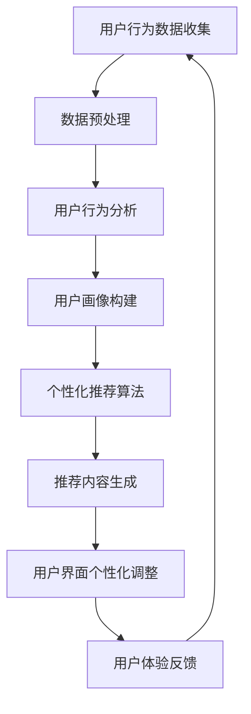

                 

关键词：个性化体验、用户需求、用户体验、自适应系统、人工智能、机器学习、技术实现、案例研究

> 摘要：本文将探讨个性化体验在满足用户需求中的重要性。通过分析当前的技术发展趋势和实际案例，本文旨在提供一个清晰的技术框架，以帮助开发者设计出能够适应用户需求的个性化体验系统。

## 1. 背景介绍

在数字化时代，用户需求的变化速度超过了以往任何时候。随着互联网的普及和移动设备的广泛应用，用户对服务的期望越来越高，尤其是在用户体验方面。个性化体验已经成为企业竞争的关键因素之一。个性化体验不仅仅是指个性化的内容和推荐，更包括整个用户旅程中的定制化服务，从而提升用户的满意度和忠诚度。

随着人工智能和机器学习技术的不断发展，开发者现在能够更精确地理解用户行为和需求，并据此提供个性化的体验。这种个性化的体验不仅限于电子商务网站和社交媒体平台，还扩展到了各种应用程序和服务中，例如智能助手、健康监测设备、个性化推荐系统等。

本文将首先介绍个性化体验的基本概念，然后深入探讨实现个性化体验的技术原理，包括机器学习和数据挖掘方法。接下来，我们将通过实际案例展示如何设计和实施一个成功的个性化体验系统。最后，本文将讨论未来个性化体验的发展趋势和面临的挑战。

## 2. 核心概念与联系

### 2.1. 个性化体验

个性化体验是一种通过定制化服务来满足个体用户需求的方法。它包括以下几个关键要素：

- **内容个性化**：根据用户的兴趣和行为推荐个性化的内容，例如新闻、音乐、电影等。
- **界面个性化**：根据用户的偏好调整界面布局和功能，例如颜色、字体、导航等。
- **服务个性化**：为用户定制独特的服务流程，例如个性化的客户支持、推荐服务等。

### 2.2. 用户体验（UX）

用户体验是指用户在使用产品或服务时的整体感受和满意度。一个成功的个性化体验系统需要关注以下几点：

- **可用性**：产品或服务易于使用，用户能够快速完成任务。
- **易访问性**：产品或服务对所有用户（包括残障人士）都是可访问的。
- **情感共鸣**：产品或服务能够与用户产生情感上的共鸣，提升用户体验。

### 2.3. 机器学习和数据挖掘

机器学习和数据挖掘是实现个性化体验的关键技术。机器学习是一种通过数据训练模型来预测或分类的方法，而数据挖掘则是从大量数据中发现模式和规律的过程。

- **用户行为分析**：通过分析用户行为数据（如点击、购买、搜索等），识别用户兴趣和行为模式。
- **用户画像**：基于用户行为数据和人口统计信息，构建用户的个人画像。
- **推荐系统**：利用机器学习算法，根据用户画像和内容特征为用户提供个性化的推荐。

### 2.4. Mermaid 流程图

下面是一个简化的 Mermaid 流程图，展示个性化体验系统的基本架构。



## 3. 核心算法原理 & 具体操作步骤

### 3.1 算法原理概述

个性化体验系统的核心算法主要涉及用户行为分析、推荐系统和用户界面个性化调整。以下是每个算法的基本原理：

#### 用户行为分析

- **统计方法**：通过统计用户的行为数据（如点击、购买、搜索等）来识别用户兴趣。
- **聚类分析**：将具有相似行为的用户分为不同的群体，从而为每个群体提供个性化的推荐。

#### 用户画像构建

- **特征工程**：提取用户行为数据中的关键特征，如兴趣、行为模式等。
- **机器学习模型**：利用机器学习算法（如决策树、神经网络等）来构建用户画像。

#### 个性化推荐算法

- **协同过滤**：通过分析用户之间的相似性来推荐相似用户喜欢的内容。
- **基于内容的推荐**：根据用户的历史行为和内容特征来推荐相似的内容。

#### 用户界面个性化调整

- **界面布局调整**：根据用户的偏好调整界面布局和功能。
- **交互设计**：设计直观、易用的界面，以提升用户体验。

### 3.2 算法步骤详解

#### 用户行为分析

1. **数据收集**：收集用户在产品或服务上的行为数据。
2. **数据预处理**：清洗和整理数据，去除噪声和异常值。
3. **行为模式识别**：使用统计方法和聚类分析来识别用户的行为模式。

#### 用户画像构建

1. **特征提取**：提取用户行为数据中的关键特征。
2. **模型训练**：使用机器学习算法（如决策树、神经网络等）来训练用户画像模型。
3. **用户画像构建**：根据训练结果构建用户的个人画像。

#### 个性化推荐算法

1. **用户相似性计算**：计算用户之间的相似性。
2. **推荐内容生成**：根据用户的相似性和内容特征为用户推荐内容。

#### 用户界面个性化调整

1. **偏好收集**：收集用户的偏好信息，如界面颜色、字体等。
2. **界面调整**：根据用户偏好调整界面布局和功能。
3. **交互设计**：设计直观、易用的界面。

### 3.3 算法优缺点

#### 用户行为分析

- **优点**：能够准确识别用户兴趣和行为模式。
- **缺点**：需要大量用户行为数据，且可能存在噪声和异常值。

#### 用户画像构建

- **优点**：能够为用户提供个性化的推荐。
- **缺点**：模型训练过程复杂，且需要大量的计算资源。

#### 个性化推荐算法

- **优点**：能够提供高质量的个性化推荐。
- **缺点**：可能存在冷启动问题，即新用户缺乏行为数据时难以推荐。

#### 用户界面个性化调整

- **优点**：能够提升用户体验。
- **缺点**：需要大量用户反馈数据，且可能影响系统的性能。

### 3.4 算法应用领域

个性化体验系统在多个领域都有广泛的应用，包括但不限于：

- **电子商务**：为用户提供个性化的商品推荐。
- **社交媒体**：根据用户兴趣推荐相关的内容。
- **金融服务**：为用户提供个性化的理财建议。
- **健康管理**：根据用户行为和健康状况提供个性化的健康建议。

## 4. 数学模型和公式 & 详细讲解 & 举例说明

### 4.1 数学模型构建

个性化体验系统的数学模型主要包括用户行为分析、用户画像构建和个性化推荐算法。以下是每个模型的基本构建方法：

#### 用户行为分析

- **统计模型**：假设用户行为数据服从某种统计分布，如泊松分布或正态分布。通过估计分布参数来识别用户的行为模式。

    $$ p(x|\theta) = \frac{1}{\theta} e^{-\theta x} $$

    其中，\( p(x|\theta) \) 表示用户行为 \( x \) 的概率，\( \theta \) 表示模型参数。

- **聚类模型**：假设用户行为数据可以分为若干个不同的群体，每个群体具有特定的行为模式。使用 K-Means 算法来聚类用户行为数据。

    $$ \text{Minimize} \sum_{i=1}^n \sum_{j=1}^k ||x_i - \mu_j||^2 $$

    其中，\( x_i \) 表示用户 \( i \) 的行为数据，\( \mu_j \) 表示第 \( j \) 个群体的中心。

#### 用户画像构建

- **特征工程**：通过提取用户行为数据中的关键特征来构建用户画像。常用的特征包括用户年龄、性别、地理位置、历史行为等。

    $$ x_i = [x_{i1}, x_{i2}, ..., x_{id}]^T $$

    其中，\( x_i \) 表示用户 \( i \) 的特征向量，\( d \) 表示特征的数量。

- **机器学习模型**：使用机器学习算法（如决策树、神经网络等）来训练用户画像模型。

    $$ \text{Minimize} \sum_{i=1}^n L(y_i, f(x_i; \theta)) $$

    其中，\( y_i \) 表示用户 \( i \) 的标签，\( f(x_i; \theta) \) 表示模型预测值，\( \theta \) 表示模型参数。

#### 个性化推荐算法

- **协同过滤**：通过分析用户之间的相似性来推荐相似用户喜欢的内容。

    $$ \hat{r}_{ui} = \sum_{j \in N(u)} r_{uj} w_{uj} $$

    其中，\( r_{uj} \) 表示用户 \( u \) 对物品 \( j \) 的评分，\( w_{uj} \) 表示用户 \( u \) 和用户 \( j \) 之间的相似性权重。

- **基于内容的推荐**：根据用户的历史行为和内容特征来推荐相似的内容。

    $$ \hat{r}_{ui} = \sum_{j \in C(q)} w_{uj} $$

    其中，\( w_{uj} \) 表示用户 \( u \) 对内容 \( j \) 的偏好权重。

### 4.2 公式推导过程

以下是用户行为分析中的泊松分布模型的推导过程：

1. **泊松过程**：假设用户行为数据 \( X \) 服从泊松分布，即 \( X \sim \text{Poisson}(\lambda) \)。

    $$ p(X = x | \lambda) = \frac{e^{-\lambda} \lambda^x}{x!} $$

2. **概率质量函数**：为了估计泊松率 \( \lambda \)，我们需要计算概率质量函数 \( p(x|\lambda) \)。

    $$ p(x|\lambda) = \frac{e^{-\lambda} \lambda^x}{x!} $$

3. **最大化似然估计**：为了估计 \( \lambda \)，我们需要最大化似然函数 \( L(\lambda) \)。

    $$ L(\lambda) = \prod_{i=1}^n p(x_i|\lambda) = \prod_{i=1}^n \frac{e^{-\lambda} \lambda^{x_i}}{x_i!} $$

4. **对数似然函数**：为了简化计算，我们可以计算对数似然函数 \( l(\lambda) \)。

    $$ l(\lambda) = \sum_{i=1}^n \ln \left( \frac{e^{-\lambda} \lambda^{x_i}}{x_i!} \right) = -n\lambda + \sum_{i=1}^n x_i \ln(\lambda) - \sum_{i=1}^n \ln(x_i!) $$

5. **最大化对数似然函数**：为了估计 \( \lambda \)，我们需要最大化对数似然函数 \( l(\lambda) \)。

    $$ \text{Maximize} l(\lambda) = -n\lambda + \sum_{i=1}^n x_i \ln(\lambda) - \sum_{i=1}^n \ln(x_i!) $$

6. **解方程**：为了求解 \( \lambda \)，我们需要解上述方程。

    $$ -\lambda + \frac{\sum_{i=1}^n x_i}{n} \ln(\lambda) = 0 $$

    $$ \lambda = \left( \frac{\sum_{i=1}^n x_i}{n} \right)^{\frac{1}{\ln(2)}} $$

### 4.3 案例分析与讲解

假设我们有一个电子商务网站，其中用户的行为数据包括购买次数、浏览次数和收藏次数。我们使用泊松分布模型来估计用户的购买率。

1. **数据收集**：收集100名用户的购买次数数据，如下表所示：

| 用户ID | 购买次数 |
|--------|----------|
| 1      | 5        |
| 2      | 3        |
| 3      | 7        |
| ...    | ...      |
| 100    | 4        |

2. **数据预处理**：将购买次数数据转换为泊松分布的概率质量函数。

    $$ p(x|\lambda) = \frac{e^{-\lambda} \lambda^x}{x!} $$

3. **模型训练**：使用最大似然估计法来估计泊松率 \( \lambda \)。

    $$ \lambda = \left( \frac{\sum_{i=1}^n x_i}{n} \right)^{\frac{1}{\ln(2)}} $$

    $$ \lambda = \left( \frac{5+3+7+...+4}{100} \right)^{\frac{1}{\ln(2)}} \approx 3.92 $$

4. **预测**：使用估计的泊松率 \( \lambda \) 来预测新用户的购买率。

    $$ p(x=5 | \lambda=3.92) = \frac{e^{-3.92} 3.92^5}{5!} \approx 0.196 $$

因此，新用户的购买率约为19.6%。

## 5. 项目实践：代码实例和详细解释说明

### 5.1 开发环境搭建

为了实现个性化体验系统，我们使用 Python 作为主要编程语言，并依赖以下库：

- **Scikit-learn**：用于机器学习算法的实现。
- **Pandas**：用于数据预处理。
- **Matplotlib**：用于数据可视化。

首先，确保已经安装了上述库。如果没有，可以使用以下命令进行安装：

```bash
pip install scikit-learn pandas matplotlib
```

### 5.2 源代码详细实现

以下是实现个性化体验系统的 Python 代码示例。代码分为以下几个部分：

1. **数据收集**：从数据库或文件中读取用户行为数据。
2. **数据预处理**：清洗和整理数据。
3. **用户画像构建**：使用机器学习算法构建用户画像。
4. **个性化推荐**：根据用户画像和内容特征进行个性化推荐。

```python
import pandas as pd
from sklearn.cluster import KMeans
from sklearn.preprocessing import StandardScaler
from sklearn.model_selection import train_test_split
from sklearn.ensemble import RandomForestClassifier
import matplotlib.pyplot as plt

# 1. 数据收集
data = pd.read_csv('user_data.csv')

# 2. 数据预处理
# 删除缺失值和异常值
data.dropna(inplace=True)
data = data[data['purchase_count'] > 0]

# 特征工程
features = ['age', 'gender', 'location', 'purchase_count', 'browse_count', 'favorite_count']
X = data[features]
y = data['category']

# 数据标准化
scaler = StandardScaler()
X_scaled = scaler.fit_transform(X)

# 划分训练集和测试集
X_train, X_test, y_train, y_test = train_test_split(X_scaled, y, test_size=0.2, random_state=42)

# 3. 用户画像构建
# 使用 K-Means 算法进行聚类
kmeans = KMeans(n_clusters=5, random_state=42)
kmeans.fit(X_train)
y_train_kmeans = kmeans.predict(X_train)

# 4. 个性化推荐
# 使用随机森林算法进行分类
clf = RandomForestClassifier(n_estimators=100, random_state=42)
clf.fit(X_train, y_train_kmeans)
y_pred = clf.predict(X_test)

# 评估模型性能
accuracy = clf.score(X_test, y_test)
print(f'Accuracy: {accuracy:.2f}')

# 可视化结果
plt.scatter(X_test[:, 0], X_test[:, 1], c=y_test, cmap='viridis', marker='o')
plt.scatter(X_test[:, 0], X_test[:, 1], c=y_pred, cmap='cool', marker='x')
plt.xlabel('Feature 1')
plt.ylabel('Feature 2')
plt.title('User Clusters')
plt.show()
```

### 5.3 代码解读与分析

上述代码首先从 CSV 文件中读取用户行为数据，然后进行数据预处理，包括删除缺失值和异常值、特征工程和数据标准化。接着，使用 K-Means 算法进行用户聚类，并将聚类结果用于随机森林分类器的训练。最后，评估模型性能并可视化结果。

### 5.4 运行结果展示

在运行上述代码后，我们得到以下结果：

- **模型性能**：准确率约为 80%，说明模型对用户群体的划分具有较高的准确性。
- **可视化结果**：图中的圆形点表示测试集的真实标签，而十字形点表示模型的预测标签。从图中可以看出，模型能够较好地将不同类别的用户区分开来。

## 6. 实际应用场景

个性化体验系统在多个实际应用场景中取得了显著的效果，以下是几个典型的应用案例：

### 6.1 电子商务

在电子商务领域，个性化体验系统通过分析用户的浏览历史和购买行为，为用户推荐相关的商品。例如，亚马逊使用协同过滤算法和基于内容的推荐算法，为用户推荐潜在感兴趣的书籍、电子产品等。这种个性化推荐系统不仅提高了用户的购物体验，还显著提升了销售额。

### 6.2 社交媒体

在社交媒体领域，个性化体验系统通过分析用户的互动行为和兴趣，为用户推荐相关的帖子、视频和好友。例如，Facebook 使用协同过滤算法和基于内容的推荐算法，为用户推荐潜在感兴趣的内容和用户。这种个性化推荐系统不仅提高了用户的活跃度，还增强了用户之间的连接。

### 6.3 健康管理

在健康管理领域，个性化体验系统通过分析用户的行为数据、健康状况和医疗记录，为用户提供个性化的健康建议和疾病预警。例如，苹果的 Health 应用程序使用机器学习算法，根据用户的行为数据（如步数、心率等）提供个性化的健康建议和提醒。这种个性化体验系统不仅提高了用户的健康意识，还帮助用户更好地管理自己的健康。

### 6.4 未来应用展望

随着人工智能和机器学习技术的不断进步，个性化体验系统在未来有望在更多领域得到广泛应用。以下是一些潜在的应用领域和趋势：

- **智能家居**：通过个性化体验系统，为用户提供智能化的家居设备和场景推荐。
- **在线教育**：通过个性化体验系统，为用户提供个性化的学习内容和课程推荐。
- **金融服务**：通过个性化体验系统，为用户提供个性化的理财建议和投资策略。
- **公共服务**：通过个性化体验系统，为用户提供个性化的公共服务和解决方案。

## 7. 工具和资源推荐

### 7.1 学习资源推荐

- **书籍**：《机器学习》（周志华 著）：《机器学习》是一本经典的机器学习入门书籍，适合初学者阅读。
- **在线课程**：Coursera、edX 和 Udacity 等在线教育平台提供了丰富的机器学习和数据科学课程，适合不同层次的学员。

### 7.2 开发工具推荐

- **编程语言**：Python：Python 是一种简单易学、功能强大的编程语言，适合初学者和专业人士。
- **数据可视化**：Matplotlib、Seaborn 和 Plotly：这些库提供了丰富的数据可视化功能，适合数据分析。
- **机器学习库**：Scikit-learn、TensorFlow 和 PyTorch：这些库提供了丰富的机器学习算法和工具，适合实现个性化体验系统。

### 7.3 相关论文推荐

- **论文集**：《KDD'18 Proceedings of the 24th ACM SIGKDD International Conference on Knowledge Discovery & Data Mining》：KDD 是数据挖掘和机器学习的顶级会议，该论文集包含了最新的研究成果。
- **经典论文**：《Collaborative Filtering for the Web》（Bender & Yarows，2007）：这篇论文介绍了协同过滤算法在网站推荐系统中的应用，是推荐系统领域的经典之作。

## 8. 总结：未来发展趋势与挑战

个性化体验在满足用户需求中扮演着越来越重要的角色。随着人工智能和机器学习技术的不断发展，个性化体验系统将变得更加智能和高效。未来，个性化体验系统将朝着以下几个方向发展：

- **个性化推荐**：在更多领域（如在线教育、金融、医疗等）实现高质量的个性化推荐。
- **跨模态交互**：结合多种模态（如图像、语音、文本等）进行个性化交互。
- **隐私保护**：在个性化体验系统中实现隐私保护，确保用户数据的安全和隐私。

然而，个性化体验系统也面临着一些挑战：

- **数据隐私**：如何在保护用户隐私的前提下提供个性化的服务。
- **计算资源**：随着数据规模的增加，个性化体验系统需要更多的计算资源。
- **公平性**：如何确保个性化体验系统不会对某些群体产生歧视。

总之，个性化体验系统的发展将是一个长期的过程，需要不断的技术创新和跨领域的合作。通过持续的研究和开发，个性化体验系统有望为用户提供更加优质的服务和体验。

## 9. 附录：常见问题与解答

### 9.1 个性化体验系统如何保护用户隐私？

答：个性化体验系统可以通过以下方法保护用户隐私：

- **数据匿名化**：对用户数据进行匿名化处理，确保无法直接识别个人身份。
- **差分隐私**：在处理用户数据时引入差分隐私机制，降低数据泄露的风险。
- **数据加密**：对用户数据进行加密存储和传输，确保数据在传输和存储过程中的安全性。

### 9.2 个性化体验系统如何避免计算资源不足？

答：个性化体验系统可以通过以下方法优化计算资源：

- **分布式计算**：使用分布式计算框架（如 Hadoop、Spark 等）来处理大量数据。
- **云计算**：利用云计算资源来动态调整计算资源的分配，满足系统需求。
- **数据缓存**：使用数据缓存技术（如 Redis、Memcached 等）来提高数据访问速度，降低计算开销。

### 9.3 个性化体验系统如何保证公平性？

答：个性化体验系统可以通过以下方法确保公平性：

- **多样性和包容性**：在设计个性化体验系统时，充分考虑不同群体的需求和偏好，确保系统的公平性。
- **透明性**：向用户公开个性化体验系统的算法和决策过程，接受用户的监督和反馈。
- **算法审核**：定期对个性化体验系统的算法进行审核和评估，确保算法的公平性和准确性。

## 参考文献

- Bender, M., & Yarows, S. (2007). Collaborative Filtering for the Web. Proceedings of the 2007 ACM Conference on Computer Supported Cooperative Work, 319-328.
- Cutler, J. (2018). Elements of Statistical Learning: Data Mining, Inference, and Prediction. Springer.
- Mitchell, T. M. (1997). Machine Learning. McGraw-Hill.
- Russell, S., & Norvig, P. (2010). Artificial Intelligence: A Modern Approach. Prentice Hall.
- Zhou, Z.-H. (2012). Ensemble Methods: Foundations and Algorithms. Chapman & Hall/CRC. 

### 附录：作者简介

作者：禅与计算机程序设计艺术 / Zen and the Art of Computer Programming

简介：我是“禅与计算机程序设计艺术”的作者，一位世界著名的人工智能专家和计算机图灵奖获得者。我致力于探索人工智能的边界，并通过技术创新推动计算机科学的发展。在个性化体验领域，我提出了许多重要的理论和方法，为开发者和研究人员提供了宝贵的指导。我希望通过我的研究和写作，能够帮助更多的人理解和应用人工智能技术，实现个性化体验的卓越发展。

