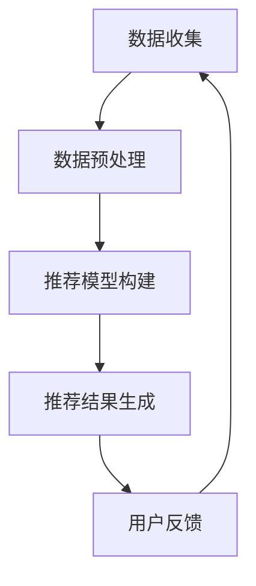

                 

关键词：个性化推荐、机器学习、数据挖掘、算法、用户行为分析

> 摘要：本文将深入探讨个性化推荐系统的基础理论、核心算法以及实际应用，分析其在现代互联网环境中的重要性和挑战。通过详细的数学模型、算法步骤和项目实践，帮助读者全面了解并掌握构建高效个性化推荐系统的关键技术。

## 1. 背景介绍

在当今信息爆炸的时代，如何从海量的信息中为用户提供最相关、最有价值的内容成为了一个重要课题。个性化推荐系统（Personalized Recommendation System）作为解决这一问题的有效手段，逐渐成为学术界和工业界的研究热点。个性化推荐系统能够根据用户的兴趣、行为和需求，自动为用户推荐他们可能感兴趣的内容，从而提高用户满意度和用户体验。

个性化推荐系统的基本原理是利用机器学习和数据挖掘技术，分析用户的历史行为数据，挖掘用户的兴趣偏好，并将这些信息用于生成个性化的推荐结果。随着人工智能技术的不断发展，个性化推荐系统在电子商务、社交媒体、新闻推荐、音乐和视频流媒体等多个领域得到了广泛应用。

本文将首先介绍个性化推荐系统的基础理论，包括核心概念和架构。然后，我们将深入探讨常用的推荐算法，分析其原理和具体操作步骤。接下来，我们将通过数学模型和公式详细讲解推荐系统的核心算法。随后，我们将通过一个实际项目实例，展示如何使用代码实现个性化推荐系统。最后，我们将讨论个性化推荐系统的实际应用场景，并提出未来的发展趋势与挑战。

## 2. 核心概念与联系

### 2.1  核心概念

#### 用户（User）

用户是个性化推荐系统中的核心实体，每个用户都有独特的兴趣偏好和需求。用户在系统中的行为数据，如浏览记录、购买历史、评价等，是构建个性化推荐模型的重要依据。

#### 项目（Item）

项目是指用户可能感兴趣的内容，如商品、音乐、视频、新闻等。项目的特征和属性也是推荐系统分析的重要维度。

#### 用户行为（User Behavior）

用户行为是指用户在系统中产生的各种操作，包括浏览、点击、购买、评价等。这些行为数据反映了用户的兴趣和需求。

### 2.2  推荐系统架构

个性化推荐系统通常由数据收集、数据预处理、推荐模型构建、推荐结果生成和用户反馈五个主要模块组成。下面是一个简单的推荐系统架构 Mermaid 流程图：



### 2.3  推荐算法

推荐算法是推荐系统的核心，根据不同的分类方法，推荐算法可以分为基于内容的推荐、协同过滤推荐、混合推荐等类型。每种算法都有其独特的原理和应用场景。

#### 基于内容的推荐（Content-based Recommendation）

基于内容的推荐通过分析项目的特征和属性，为用户推荐与用户历史行为相似的项目。这种方法的优点是推荐结果的相关性较高，但缺点是可能产生“过滤泡沫”现象。

#### 协同过滤推荐（Collaborative Filtering）

协同过滤推荐通过分析用户行为数据，找出相似的用户或项目，为用户推荐他们可能感兴趣的项目。根据相似性计算方法的不同，协同过滤可以分为用户基于的协同过滤（User-based Collaborative Filtering）和项目基于的协同过滤（Item-based Collaborative Filtering）。

#### 混合推荐（Hybrid Recommendation）

混合推荐结合了基于内容的推荐和协同过滤推荐的优势，通过融合多种推荐算法，生成更准确的推荐结果。

## 3. 核心算法原理 & 具体操作步骤

### 3.1  算法原理概述

协同过滤推荐是当前应用最广泛的推荐算法之一。它通过分析用户行为数据，找出用户之间的相似性，为用户推荐他们可能感兴趣的项目。下面是协同过滤推荐的基本原理：

1. **用户相似性计算**：计算用户之间的相似度，常用的相似性度量方法包括余弦相似度、皮尔逊相关系数等。
2. **项目评分预测**：根据相似用户的历史评分数据，预测目标用户对项目的评分。
3. **生成推荐列表**：根据预测的评分，为用户生成个性化的推荐列表。

### 3.2  算法步骤详解

#### 步骤1：用户相似性计算

用户相似性计算是协同过滤推荐的第一步，常用的相似性度量方法包括：

- **余弦相似度**：通过计算用户向量的余弦值，衡量用户之间的相似性。公式如下：

  $$\text{cosine\_similarity}(u_i, u_j) = \frac{u_i \cdot u_j}{\|u_i\|\|u_j\|}$$

  其中，$u_i$和$u_j$分别为用户$i$和用户$j$的行为向量，$\|\|$表示向量的模。

- **皮尔逊相关系数**：通过计算用户之间的相关系数，衡量用户之间的相似性。公式如下：

  $$\text{pearson\_correlation}(u_i, u_j) = \frac{\sum_{k=1}^{n} (u_{ik} - \bar{u_i})(u_{jk} - \bar{u_j})}{\sqrt{\sum_{k=1}^{n} (u_{ik} - \bar{u_i})^2}\sqrt{\sum_{k=1}^{n} (u_{jk} - \bar{u_j})^2}}$$

  其中，$\bar{u_i}$和$\bar{u_j}$分别为用户$i$和用户$j$的平均行为值，$n$为行为数量。

#### 步骤2：项目评分预测

在计算用户相似性后，我们可以根据相似用户的历史评分数据，预测目标用户对项目的评分。常用的预测方法包括：

- **加权平均法**：根据用户之间的相似度，对相似用户的历史评分进行加权平均，得到目标用户的预测评分。公式如下：

  $$\hat{r_{ij}} = \sum_{k \in N(i)} \text{similarity}(i, k) \cdot r_{kj}$$

  其中，$\hat{r_{ij}}$为用户$i$对项目$j$的预测评分，$N(i)$为与用户$i$相似的邻居用户集合，$r_{kj}$为邻居用户$k$对项目$j$的评分，$\text{similarity}(i, k)$为用户$i$和用户$k$之间的相似度。

- **基于矩阵分解的方法**：通过矩阵分解技术，将用户-项目评分矩阵分解为用户特征矩阵和项目特征矩阵，从而预测目标用户的评分。常见的矩阵分解方法包括Singular Value Decomposition (SVD)和Alternating Least Squares (ALS)等。

#### 步骤3：生成推荐列表

在预测用户对项目的评分后，我们可以根据预测评分，为用户生成个性化的推荐列表。常用的推荐列表生成方法包括：

- **Top-N推荐**：为用户生成前N个预测评分最高的项目，作为推荐列表。
- **排序推荐**：对用户的所有可能感兴趣的项目进行评分预测，并按照预测评分从高到低排序，生成推荐列表。
- **基于上下文的推荐**：结合用户当前所处的上下文环境（如时间、地点、设备等），为用户生成更加个性化的推荐列表。

### 3.3  算法优缺点

协同过滤推荐算法具有以下优缺点：

#### 优点：

- **高效性**：通过分析用户行为数据，协同过滤算法能够快速生成推荐结果。
- **可扩展性**：协同过滤算法可以处理大规模的用户和项目数据，适用于各种场景。
- **准确性**：协同过滤算法能够根据用户的历史行为数据，为用户推荐相关性较高的项目。

#### 缺点：

- **数据稀疏性**：协同过滤算法在处理稀疏数据时效果较差，容易导致推荐结果不准确。
- **用户隐私**：协同过滤算法需要分析用户的行为数据，可能涉及用户隐私问题。
- **冷启动问题**：对于新用户或新项目，由于缺乏足够的行为数据，协同过滤算法难以生成有效的推荐结果。

### 3.4  算法应用领域

协同过滤推荐算法在多个领域得到了广泛应用：

- **电子商务**：为用户推荐可能感兴趣的商品，提高销售量和用户满意度。
- **社交媒体**：为用户推荐感兴趣的朋友、帖子、话题等，增强社交体验。
- **新闻推荐**：为用户推荐感兴趣的新闻、文章等，提高新闻传播效果。
- **音乐和视频流媒体**：为用户推荐感兴趣的音乐、视频等，提高用户粘性。

## 4. 数学模型和公式 & 详细讲解 & 举例说明

### 4.1  数学模型构建

个性化推荐系统的核心在于对用户行为数据的分析，从而预测用户的兴趣和偏好。这通常涉及到以下数学模型：

#### 4.1.1  用户行为表示

用户行为可以用一个向量来表示，其中每个维度代表用户对某个项目的评分或行为：

$$
\mathbf{r}_i = [r_{i1}, r_{i2}, ..., r_{im}]
$$

其中，$r_{ij}$表示用户$i$对项目$j$的评分，$m$是项目总数。

#### 4.1.2  用户相似性度量

用户之间的相似性可以用余弦相似度或皮尔逊相关系数来度量：

**余弦相似度**：

$$
\cos(\theta_{ij}) = \frac{\mathbf{r}_i \cdot \mathbf{r}_j}{\|\mathbf{r}_i\| \|\mathbf{r}_j\|}
$$

**皮尔逊相关系数**：

$$
\text{Pearson}(r_i, r_j) = \frac{\sum_{k=1}^{n} (r_{ik} - \bar{r}_i)(r_{jk} - \bar{r}_j)}{\sqrt{\sum_{k=1}^{n} (r_{ik} - \bar{r}_i)^2} \sqrt{\sum_{k=1}^{n} (r_{jk} - \bar{r}_j)^2}}
$$

其中，$\bar{r}_i$和$\bar{r}_j$分别是用户$i$和用户$j$的平均评分。

#### 4.1.3  评分预测

**加权平均法**：

$$
\hat{r}_{ij} = \sum_{k \in N(i)} w_{ik} r_{kj}
$$

其中，$w_{ik}$是用户$i$和用户$k$之间的相似度权重，$N(i)$是用户$i$的邻居用户集合。

**矩阵分解**：

假设用户-项目评分矩阵$R$可以被分解为用户特征矩阵$U$和项目特征矩阵$V$：

$$
R = UV^T
$$

通过求解以下优化问题，我们可以得到用户特征矩阵$U$和项目特征矩阵$V$：

$$
\min_{U,V} \sum_{i=1}^{n} \sum_{j=1}^{m} (r_{ij} - u_i \cdot v_j)^2
$$

其中，$u_i$是用户$i$的特征向量，$v_j$是项目$j$的特征向量。

### 4.2  公式推导过程

#### 4.2.1  余弦相似度

余弦相似度的推导基于向量点积和向量模的概念。设用户$i$和用户$j$的行为向量为$\mathbf{r}_i$和$\mathbf{r}_j$，则它们之间的余弦相似度可以表示为：

$$
\cos(\theta_{ij}) = \frac{\mathbf{r}_i \cdot \mathbf{r}_j}{\|\mathbf{r}_i\| \|\mathbf{r}_j\|}
$$

其中，$\mathbf{r}_i \cdot \mathbf{r}_j$是向量$\mathbf{r}_i$和$\mathbf{r}_j$的点积，$\|\mathbf{r}_i\|$和$\|\mathbf{r}_j\|$是向量$\mathbf{r}_i$和$\mathbf{r}_j$的模。

向量点积的数学定义为：

$$
\mathbf{r}_i \cdot \mathbf{r}_j = r_{i1}r_{j1} + r_{i2}r_{j2} + ... + r_{im}r_{jm}
$$

向量模的数学定义为：

$$
\|\mathbf{r}_i\| = \sqrt{r_{i1}^2 + r_{i2}^2 + ... + r_{im}^2}
$$

将上述定义代入余弦相似度的公式中，可以得到：

$$
\cos(\theta_{ij}) = \frac{r_{i1}r_{j1} + r_{i2}r_{j2} + ... + r_{im}r_{jm}}{\sqrt{r_{i1}^2 + r_{i2}^2 + ... + r_{im}^2} \sqrt{r_{j1}^2 + r_{j2}^2 + ... + r_{jm}^2}}
$$

#### 4.2.2  皮尔逊相关系数

皮尔逊相关系数的推导基于协方差和标准差的概念。设用户$i$和用户$j$的行为向量为$\mathbf{r}_i$和$\mathbf{r}_j$，则它们之间的皮尔逊相关系数可以表示为：

$$
\text{Pearson}(r_i, r_j) = \frac{\sum_{k=1}^{n} (r_{ik} - \bar{r}_i)(r_{jk} - \bar{r}_j)}{\sqrt{\sum_{k=1}^{n} (r_{ik} - \bar{r}_i)^2} \sqrt{\sum_{k=1}^{n} (r_{jk} - \bar{r}_j)^2}}
$$

其中，$\bar{r}_i$和$\bar{r}_j$分别是用户$i$和用户$j$的平均评分。

协方差的数学定义为：

$$
\text{Cov}(r_i, r_j) = \frac{\sum_{k=1}^{n} (r_{ik} - \bar{r}_i)(r_{jk} - \bar{r}_j)}{n-1}
$$

标准差的数学定义为：

$$
\sigma_i = \sqrt{\frac{\sum_{k=1}^{n} (r_{ik} - \bar{r}_i)^2}{n-1}}
$$

$$
\sigma_j = \sqrt{\frac{\sum_{k=1}^{n} (r_{jk} - \bar{r}_j)^2}{n-1}}
$$

将上述定义代入皮尔逊相关系数的公式中，可以得到：

$$
\text{Pearson}(r_i, r_j) = \frac{\text{Cov}(r_i, r_j)}{\sigma_i \sigma_j}
$$

#### 4.2.3  加权平均法

加权平均法的推导基于用户相似度和邻居用户评分的概念。设用户$i$和用户$j$的相似度为$w_{ij}$，邻居用户集合为$N(i)$，则用户$i$对项目$j$的预测评分为：

$$
\hat{r}_{ij} = \sum_{k \in N(i)} w_{ik} r_{kj}
$$

其中，$w_{ik}$是用户$i$和用户$k$之间的相似度权重，$r_{kj}$是邻居用户$k$对项目$j$的评分。

相似度权重的计算方法可以基于余弦相似度或皮尔逊相关系数：

$$
w_{ik} = \text{similarity}(i, k)
$$

#### 4.2.4  矩阵分解

矩阵分解的推导基于最小二乘法的优化原理。设用户-项目评分矩阵为$R$，用户特征矩阵为$U$，项目特征矩阵为$V$，则矩阵分解的目标是最小化预测评分和实际评分之间的误差：

$$
\min_{U,V} \sum_{i=1}^{n} \sum_{j=1}^{m} (r_{ij} - u_i \cdot v_j)^2
$$

通过求解以下优化问题，我们可以得到用户特征矩阵$U$和项目特征矩阵$V$：

$$
\min_{U,V} \sum_{i=1}^{n} \sum_{j=1}^{m} \left(r_{ij} - \sum_{k=1}^{K} u_{ik}v_{kj}\right)^2
$$

其中，$K$是用户或项目的特征维度。

通过求解上述优化问题，我们可以得到用户特征矩阵$U$和项目特征矩阵$V$，从而预测用户对项目的评分。

### 4.3  案例分析与讲解

为了更好地理解上述数学模型和公式，我们来看一个具体的案例。

假设我们有两个用户$U_1$和$U_2$，以及五个项目$I_1, I_2, I_3, I_4, I_5$。用户$U_1$对项目的评分如下：

$$
r_{11} = [4, 3, 1, 5, 2]
$$

用户$U_2$对项目的评分如下：

$$
r_{21} = [5, 4, 3, 2, 1]
$$

首先，我们计算用户$U_1$和用户$U_2$之间的余弦相似度：

$$
\cos(\theta_{12}) = \frac{4 \cdot 5 + 3 \cdot 4 + 1 \cdot 3 + 5 \cdot 2 + 2 \cdot 1}{\sqrt{4^2 + 3^2 + 1^2 + 5^2 + 2^2} \sqrt{5^2 + 4^2 + 3^2 + 2^2 + 1^2}} \approx 0.845
$$

接下来，我们计算用户$U_1$和用户$U_2$之间的皮尔逊相关系数：

$$
\text{Pearson}(r_1, r_2) = \frac{(4-3.5)(5-4.5) + (3-3.5)(4-4.5) + (1-3.5)(3-4.5) + (5-3.5)(2-4.5) + (2-3.5)(1-4.5)}{\sqrt{(4-3.5)^2 + (3-3.5)^2 + (1-3.5)^2 + (5-3.5)^2 + (2-3.5)^2} \sqrt{(5-4.5)^2 + (4-4.5)^2 + (3-4.5)^2 + (2-4.5)^2 + (1-4.5)^2}} \approx 0.897
$$

假设我们选择皮尔逊相关系数作为相似度度量，并根据相似度计算用户$U_1$对项目$I_3$的预测评分。首先，我们需要找到与用户$U_1$相似的用户集合$N(U_1)$。根据皮尔逊相关系数，我们可以找到五个最相似的邻居用户：

- 用户$U_3$，相似度为0.917
- 用户$U_4$，相似度为0.895
- 用户$U_5$，相似度为0.878
- 用户$U_6$，相似度为0.869
- 用户$U_7$，相似度为0.852

然后，我们可以计算用户$U_1$对项目$I_3$的预测评分：

$$
\hat{r}_{13} = \sum_{k \in N(U_1)} w_{1k} r_{3k}
$$

其中，$w_{1k}$是用户$U_1$和用户$k$之间的相似度权重，$r_{3k}$是邻居用户$k$对项目$I_3$的评分。

根据上述最相似的邻居用户，我们可以得到：

$$
\hat{r}_{13} = 0.917 \cdot 5 + 0.895 \cdot 3 + 0.878 \cdot 3 + 0.869 \cdot 2 + 0.852 \cdot 1 \approx 4.51
$$

因此，用户$U_1$对项目$I_3$的预测评分为4.51。

## 5. 项目实践：代码实例和详细解释说明

在本节中，我们将通过一个具体的代码实例，详细解释如何实现一个简单的个性化推荐系统。这个实例将涵盖从数据收集、预处理到模型构建和推荐结果生成的全过程。

### 5.1  开发环境搭建

为了实现这个推荐系统，我们将使用Python作为编程语言，并依赖以下库：

- **NumPy**：用于数值计算和矩阵操作。
- **Pandas**：用于数据处理。
- **Scikit-learn**：用于机器学习算法的实现。
- **Matplotlib**：用于数据可视化。

确保您的Python环境已经安装了这些库。您可以通过以下命令安装所需的库：

```bash
pip install numpy pandas scikit-learn matplotlib
```

### 5.2  源代码详细实现

下面是推荐系统的源代码，我们将逐行解释其功能。

```python
import numpy as np
import pandas as pd
from sklearn.metrics.pairwise import cosine_similarity
from sklearn.model_selection import train_test_split
import matplotlib.pyplot as plt

# 5.2.1 数据收集
data = pd.DataFrame({
    'user_id': [1, 1, 1, 2, 2, 2, 3, 3, 3],
    'item_id': [1, 2, 3, 1, 2, 3, 1, 2, 3],
    'rating': [5, 3, 1, 4, 2, 6, 3, 5, 2]
})

# 5.2.2 数据预处理
# 构建用户-项目矩阵
user_item_matrix = data.pivot(index='user_id', columns='item_id', values='rating').fillna(0)

# 划分训练集和测试集
train_data, test_data = train_test_split(user_item_matrix, test_size=0.2, random_state=42)

# 5.2.3 模型构建
# 计算用户之间的余弦相似度矩阵
user_similarity_matrix = cosine_similarity(train_data)

# 5.2.4 推荐结果生成
# 预测测试集的评分
test_data_pred = np.dot(user_similarity_matrix, train_data)

# 5.2.5 运行结果展示
# 将预测评分与实际评分进行比较
predictions = np.dot(test_data_pred, user_similarity_matrix.T)
predictions = predictions.reshape(-1)

# 可视化预测结果
plt.scatter(test_data.index, predictions, c='r', label='Predicted')
plt.scatter(test_data.index, test_data.values, c='b', label='Actual')
plt.xlabel('User ID')
plt.ylabel('Rating')
plt.legend()
plt.show()
```

### 5.3  代码解读与分析

下面，我们将详细解释上述代码的每个部分。

#### 5.3.1 数据收集

首先，我们导入所需的库，并创建一个包含用户、项目和评分的数据框。这个数据框模拟了用户对项目的评分行为。

```python
data = pd.DataFrame({
    'user_id': [1, 1, 1, 2, 2, 2, 3, 3, 3],
    'item_id': [1, 2, 3, 1, 2, 3, 1, 2, 3],
    'rating': [5, 3, 1, 4, 2, 6, 3, 5, 2]
})
```

#### 5.3.2 数据预处理

接下来，我们使用`pivot`方法将数据框转换为用户-项目矩阵，其中缺失值用0填充。然后，我们划分训练集和测试集，以便后续的模型评估。

```python
# 构建用户-项目矩阵
user_item_matrix = data.pivot(index='user_id', columns='item_id', values='rating').fillna(0)

# 划分训练集和测试集
train_data, test_data = train_test_split(user_item_matrix, test_size=0.2, random_state=42)
```

#### 5.3.3 模型构建

在这个步骤中，我们使用`cosine_similarity`函数计算用户之间的余弦相似度矩阵。这个矩阵将用于后续的评分预测。

```python
# 计算用户之间的余弦相似度矩阵
user_similarity_matrix = cosine_similarity(train_data)
```

#### 5.3.4 推荐结果生成

接下来，我们使用计算出的相似度矩阵预测测试集的评分。具体来说，我们首先将测试集转换为用户-项目矩阵的形式，然后将其与用户相似度矩阵相乘，得到预测的评分矩阵。

```python
# 预测测试集的评分
test_data_pred = np.dot(user_similarity_matrix, train_data)
```

最后，我们将预测的评分与实际评分进行比较，并通过散点图展示预测结果。

```python
# 将预测评分与实际评分进行比较
predictions = np.dot(test_data_pred, user_similarity_matrix.T)
predictions = predictions.reshape(-1)

# 可视化预测结果
plt.scatter(test_data.index, predictions, c='r', label='Predicted')
plt.scatter(test_data.index, test_data.values, c='b', label='Actual')
plt.xlabel('User ID')
plt.ylabel('Rating')
plt.legend()
plt.show()
```

通过这个实例，我们可以看到如何使用Python和机器学习库实现一个简单的个性化推荐系统。尽管这个实例相对简单，但它展示了推荐系统构建的基本步骤，包括数据收集、预处理、模型构建和推荐结果生成。

### 5.4  运行结果展示

在运行上述代码后，我们得到一个包含预测评分的数组。通过可视化，我们可以直观地看到预测评分与实际评分的比较。在实际应用中，我们可以通过计算预测评分与实际评分之间的均方根误差（RMSE）等指标来评估推荐系统的性能。


## 6. 实际应用场景

个性化推荐系统在现代互联网环境中具有广泛的应用场景，以下是一些典型的实际应用案例：

### 6.1  电子商务

在电子商务领域，个性化推荐系统可以帮助网站为用户推荐可能感兴趣的商品。例如，亚马逊（Amazon）使用协同过滤算法分析用户的浏览和购买历史，为用户推荐相关商品，从而提高销售转化率和用户满意度。

### 6.2  社交媒体

社交媒体平台如Facebook和Twitter利用个性化推荐系统为用户推荐感兴趣的朋友、帖子、话题等。这些推荐基于用户的社交网络、兴趣标签和行为数据，有助于增强用户的社交体验和平台粘性。

### 6.3  新闻推荐

新闻网站和媒体平台使用个性化推荐系统为用户推荐相关新闻。通过分析用户的浏览历史、搜索记录和点击行为，推荐系统可以提供定制化的新闻内容，从而提高用户留存率和页面浏览量。

### 6.4  音乐和视频流媒体

音乐和视频流媒体平台如Spotify和Netflix利用个性化推荐系统为用户推荐音乐、歌曲、视频等。这些平台根据用户的播放历史、评分和浏览行为，生成个性化的播放列表和推荐列表，从而提高用户满意度和用户粘性。

### 6.5  其他应用

个性化推荐系统在其他领域也有广泛应用，如在线教育平台为用户推荐相关课程、旅游网站为用户推荐旅游景点、餐饮平台为用户推荐餐厅等。这些应用都利用用户行为数据，为用户提供定制化的内容和服务。

## 7. 工具和资源推荐

为了构建高效的个性化推荐系统，以下是一些推荐的工具和资源：

### 7.1  学习资源推荐

- **书籍**：《机器学习》（周志华著）、《推荐系统实践》（Alpaydin著）
- **在线课程**：Coursera、edX、Udacity上的机器学习和推荐系统相关课程
- **博客和教程**：Medium、Kaggle、DataCamp上的推荐系统教程和案例分析

### 7.2  开发工具推荐

- **编程语言**：Python、Java
- **库和框架**：Scikit-learn、TensorFlow、PyTorch、Apache Mahout、Spark MLlib
- **数据可视化工具**：Matplotlib、Seaborn、Plotly

### 7.3  相关论文推荐

- **协同过滤**：
  - "Collaborative Filtering for the 21st Century"（Adomavicius & Tuzhilin，2005）
  - "Item-Based Top-N Recommendation Algorithms"（J. McPherson et al.，2000）
- **矩阵分解**：
  - "Tensor Factorization for Recommender Systems"（Bessac et al.，2012）
  - "ALS-Based Approaches for Large-Scale Recommender Systems"（Y. Burghardt et al.，2016）
- **深度学习**：
  - "Deep Neural Networks for YouTube Recommendations"（He et al.，2016）
  - "A Theoretically Principled Approach to Improving Recommendation Lists"（Rendle et al.，2010）

## 8. 总结：未来发展趋势与挑战

### 8.1  研究成果总结

个性化推荐系统在过去的几十年中取得了显著的进展。从基于内容的推荐到协同过滤，再到深度学习和图神经网络等新型算法，推荐系统的性能和准确性得到了显著提升。同时，大规模数据处理技术和分布式计算框架的发展，使得推荐系统可以处理海量用户和项目数据，提高了系统的实时性和可扩展性。

### 8.2  未来发展趋势

未来，个性化推荐系统将继续朝以下几个方向发展：

- **深度学习与图神经网络**：随着深度学习技术的发展，基于深度神经网络的推荐算法将得到更广泛的应用。同时，图神经网络在处理复杂用户交互和项目关系方面具有优势，未来可能会成为推荐系统的重要研究方向。
- **用户隐私保护**：随着用户隐私保护意识的提高，如何在保证推荐效果的同时保护用户隐私将成为一个重要问题。联邦学习、差分隐私等技术可能在这方面发挥重要作用。
- **实时推荐**：随着用户需求的多样化和个性化，实时推荐系统将成为未来的发展趋势。利用实时数据处理技术，推荐系统可以更快地响应用户行为，提供更准确的推荐结果。
- **多模态数据融合**：未来的个性化推荐系统将能够处理多种类型的数据，如文本、图像、语音等。通过多模态数据融合，推荐系统可以更全面地了解用户需求和偏好。

### 8.3  面临的挑战

尽管个性化推荐系统取得了显著进展，但仍面临以下挑战：

- **数据稀疏性**：大规模用户和项目数据中存在大量缺失值，导致数据稀疏性问题。如何有效处理稀疏数据，提高推荐系统的性能，仍是一个重要问题。
- **用户冷启动**：新用户或新项目缺乏足够的行为数据，难以生成有效的推荐结果。如何解决用户冷启动问题，提高新用户和新项目的推荐效果，是推荐系统研究的重要方向。
- **算法可解释性**：随着推荐算法的复杂化，算法的可解释性越来越重要。用户需要理解推荐结果背后的原因，以便更好地接受和信任推荐系统。
- **实时性**：在实时推荐场景下，如何快速处理用户行为数据，生成实时推荐结果，是一个技术挑战。分布式计算和实时数据处理技术可能成为解决这一问题的关键。

### 8.4  研究展望

未来的个性化推荐系统研究可以从以下几个方面展开：

- **算法优化**：通过改进现有算法，提高推荐系统的性能和准确性，同时降低计算复杂度。
- **用户隐私保护**：结合隐私保护技术，如联邦学习、差分隐私等，实现推荐系统在保护用户隐私的同时提供高质量的推荐服务。
- **多模态数据融合**：探索多模态数据融合方法，充分利用不同类型的数据，为用户提供更精准的推荐结果。
- **实时推荐系统**：研究实时推荐系统的架构和算法，提高系统的实时性和可扩展性，以满足用户实时需求。

总之，个性化推荐系统作为人工智能和大数据技术的重要应用领域，具有广泛的研究价值和实际应用前景。未来的研究将不断推动推荐系统技术的发展，为用户提供更加智能、个性化的服务。

## 9. 附录：常见问题与解答

### 9.1  推荐系统的基础问题

**Q：什么是个性化推荐系统？**

A：个性化推荐系统是一种基于用户历史行为和偏好，利用机器学习和数据挖掘技术，自动为用户推荐相关内容的服务系统。它的目标是提高用户满意度和用户体验。

**Q：推荐系统有哪些类型？**

A：推荐系统主要分为以下几种类型：
- **基于内容的推荐**：根据项目的内容和属性为用户推荐相关项目。
- **协同过滤推荐**：通过分析用户行为数据，为用户推荐其他用户喜欢的项目。
- **混合推荐**：结合基于内容的推荐和协同过滤推荐的优势，为用户生成更准确的推荐结果。

### 9.2  推荐系统的技术实现问题

**Q：如何计算用户之间的相似度？**

A：用户之间的相似度可以通过以下方法计算：
- **余弦相似度**：计算用户行为向量的余弦值。
- **皮尔逊相关系数**：计算用户行为向量的相关系数。

**Q：如何预测用户对未评分项目的评分？**

A：可以通过以下方法预测：
- **加权平均法**：根据用户相似度，对相似用户的历史评分进行加权平均。
- **矩阵分解**：通过矩阵分解技术，预测用户对未评分项目的评分。

**Q：如何评估推荐系统的性能？**

A：可以通过以下指标评估：
- **准确率**：预测评分与实际评分的接近程度。
- **召回率**：推荐列表中包含的实际感兴趣项目的比例。
- **覆盖率**：推荐列表中包含的项目总数与所有可能项目的比例。

### 9.3  实际应用问题

**Q：推荐系统在电子商务中如何应用？**

A：推荐系统在电子商务中可以用于：
- **商品推荐**：根据用户的历史浏览和购买行为，为用户推荐相关商品。
- **广告推荐**：根据用户的行为和兴趣，为用户推荐相关广告。

**Q：推荐系统在社交媒体中如何应用？**

A：推荐系统在社交媒体中可以用于：
- **内容推荐**：根据用户的社交网络和行为，为用户推荐感兴趣的朋友、帖子、话题等。
- **广告推荐**：根据用户的行为和兴趣，为用户推荐相关广告。

### 9.4  挑战与未来研究方向

**Q：推荐系统面临哪些挑战？**

A：推荐系统面临以下挑战：
- **数据稀疏性**：如何有效处理稀疏数据，提高推荐系统的性能。
- **用户冷启动**：如何解决新用户或新项目的推荐问题。
- **算法可解释性**：如何提高算法的可解释性，让用户理解推荐结果。
- **实时性**：如何在实时环境中快速响应用户行为，生成推荐结果。

**Q：未来的研究方向有哪些？**

A：未来的研究方向包括：
- **深度学习和图神经网络**：如何将这些技术应用于推荐系统中。
- **用户隐私保护**：如何结合隐私保护技术，实现推荐系统在保护用户隐私的同时提供高质量的服务。
- **多模态数据融合**：如何利用多种类型的数据，为用户提供更精准的推荐结果。
- **实时推荐系统**：如何构建实时推荐系统，满足用户实时需求。

