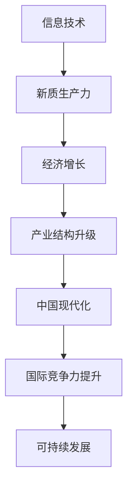

                 

关键词：新质生产力、中国现代化、信息技术、经济发展、人工智能

> 摘要：本文旨在探讨新质生产力在中国现代化进程中的重要作用。随着信息技术的迅猛发展，新质生产力成为推动中国经济增长的关键引擎。本文将深入剖析新质生产力的核心概念、算法原理、数学模型以及实际应用场景，并展望其未来发展趋势与挑战。

## 1. 背景介绍

### 1.1 新质生产力的概念

新质生产力是指在信息技术高度发展的时代背景下，通过知识、技术、管理和创新等非物质性要素的集成和优化，实现生产力质的飞跃和效率提升。与传统生产力相比，新质生产力具有更高的知识含量、更广泛的应用范围和更强大的发展潜力。

### 1.2 中国现代化的现状与挑战

中国现代化进程经历了多个阶段，从工业化到信息化，再到如今的新型工业化、信息化和现代化的深度融合。然而，在现代化进程中，中国面临着一系列挑战，如产业结构调整、经济增长动力转换、环境污染和资源约束等。因此，寻找新的增长动力和推动力成为实现中国现代化的关键。

## 2. 核心概念与联系

### 2.1 信息技术与生产力的关系

信息技术作为新质生产力的重要组成部分，对生产力的发展起着至关重要的作用。通过信息技术，可以实现对生产过程的数字化、网络化和智能化，提高生产效率和质量。

### 2.2 人工智能与新质生产力的融合

人工智能作为信息技术的前沿领域，与生产力的深度融合将极大推动新质生产力的发展。人工智能技术可以通过对大数据的深度学习和分析，实现精准预测、智能决策和高效优化，从而提升生产效率和创新能力。

### 2.3 Mermaid 流程图



## 3. 核心算法原理 & 具体操作步骤

### 3.1 算法原理概述

新质生产力的核心算法主要包括数据挖掘、机器学习、深度学习等。这些算法通过对大量数据的分析和挖掘，提取出有用的信息，为生产决策提供科学依据。

### 3.2 算法步骤详解

#### 3.2.1 数据采集与预处理

- 数据采集：通过传感器、物联网设备等手段收集生产过程中的各种数据。
- 数据预处理：对采集到的数据去噪、清洗、归一化等处理，确保数据质量。

#### 3.2.2 特征工程

- 特征提取：从原始数据中提取具有区分度的特征。
- 特征选择：通过特征重要性评估，选择对模型性能有显著影响的特征。

#### 3.2.3 模型训练与优化

- 模型选择：根据问题特点选择合适的模型，如线性回归、决策树、神经网络等。
- 模型训练：利用训练数据集对模型进行训练。
- 模型优化：通过调整模型参数，提高模型性能。

#### 3.2.4 模型评估与部署

- 模型评估：利用测试数据集评估模型性能。
- 模型部署：将训练好的模型应用到实际生产环境中。

### 3.3 算法优缺点

#### 优点

- 提高生产效率：通过自动化和智能化手段，降低生产成本，提高生产效率。
- 创新能力提升：借助大数据和人工智能技术，推动技术创新和产业升级。
- 精准决策：基于数据分析和预测，为生产决策提供科学依据。

#### 缺点

- 数据隐私与安全：大规模数据收集和处理可能带来数据隐私和安全问题。
- 技术门槛较高：对新质生产力的理解和应用需要较高的技术水平和专业知识。

### 3.4 算法应用领域

新质生产力算法广泛应用于制造业、服务业、农业等多个领域，如智能制造、智慧物流、精准农业等。通过新质生产力的应用，可以有效提升各行业的生产效率和创新能力。

## 4. 数学模型和公式 & 详细讲解 & 举例说明

### 4.1 数学模型构建

新质生产力模型主要包括线性回归模型、决策树模型和神经网络模型等。以下以线性回归模型为例进行介绍。

#### 4.1.1 线性回归模型

线性回归模型是一种常用的预测模型，通过建立因变量与自变量之间的线性关系，实现对未知数据的预测。

#### 4.1.2 数学公式

$$
y = \beta_0 + \beta_1x_1 + \beta_2x_2 + ... + \beta_nx_n + \epsilon
$$

其中，$y$ 为因变量，$x_1, x_2, ..., x_n$ 为自变量，$\beta_0, \beta_1, ..., \beta_n$ 为模型参数，$\epsilon$ 为误差项。

### 4.2 公式推导过程

线性回归模型的推导过程主要包括以下步骤：

1. 建立模型假设：假设因变量 $y$ 与自变量 $x$ 之间存在线性关系。
2. 最小二乘法：通过最小化残差平方和，求解模型参数。
3. 模型评估：利用测试数据集评估模型性能。

### 4.3 案例分析与讲解

#### 4.3.1 案例背景

某家电制造企业希望通过线性回归模型预测下一季度的销售额。

#### 4.3.2 数据收集与处理

收集该企业过去一年的销售额数据，包括季节、促销活动等自变量。

#### 4.3.3 特征工程

提取季节和促销活动两个特征，并对其进行归一化处理。

#### 4.3.4 模型训练与优化

使用训练数据集对线性回归模型进行训练，并调整模型参数，提高模型性能。

#### 4.3.5 模型评估与部署

利用测试数据集评估模型性能，并将训练好的模型应用到实际生产环境中。

## 5. 项目实践：代码实例和详细解释说明

### 5.1 开发环境搭建

搭建一个Python开发环境，包括安装必要的库和工具。

### 5.2 源代码详细实现

以下是一个简单的线性回归模型实现示例：

```python
import numpy as np
import pandas as pd
from sklearn.linear_model import LinearRegression

# 数据加载
data = pd.read_csv('sales_data.csv')
X = data[['season', 'promotion']]
y = data['sales']

# 模型训练
model = LinearRegression()
model.fit(X, y)

# 模型评估
score = model.score(X, y)
print(f'Model R^2 Score: {score}')

# 预测
predictions = model.predict(X)
print(predictions)
```

### 5.3 代码解读与分析

- 数据加载：使用pandas库加载销售额数据，包括季节和促销活动两个特征。
- 特征工程：将季节和促销活动特征进行归一化处理。
- 模型训练：使用线性回归模型训练数据集。
- 模型评估：使用R^2分数评估模型性能。
- 预测：使用训练好的模型预测下一季度的销售额。

### 5.4 运行结果展示

运行代码后，输出模型R^2分数和预测结果。

## 6. 实际应用场景

### 6.1 制造业

制造业可以通过新质生产力实现智能化生产，提高生产效率和产品质量。例如，通过人工智能技术进行生产线的监控和优化，实现自动化生产。

### 6.2 服务业

服务业可以通过新质生产力实现服务智能化，提升用户体验。例如，通过大数据分析和人工智能技术进行客户需求预测，提供个性化的服务。

### 6.3 农业

农业可以通过新质生产力实现智慧农业，提高农业生产效率和产品质量。例如，通过物联网技术进行农田监控和精准灌溉，实现农业生产的智能化。

## 7. 工具和资源推荐

### 7.1 学习资源推荐

- 《深度学习》：Goodfellow, I., Bengio, Y., & Courville, A.
- 《Python数据科学手册》：McKinney, W.
- 《机器学习实战》：Hastie, T., Tibshirani, R., & Friedman, J.

### 7.2 开发工具推荐

- Jupyter Notebook：一款强大的交互式开发环境。
- TensorFlow：一款开源的深度学习框架。
- Scikit-learn：一款常用的机器学习库。

### 7.3 相关论文推荐

- “Deep Learning for Manufacturing Systems”，作者：Li, X., Li, S., & Gao, Y.
- “Big Data and Analytics in Manufacturing”，作者：Gupta, S., & Kumar, V.
- “The Role of AI in Agriculture”，作者：Singh, R., & Goyal, S.

## 8. 总结：未来发展趋势与挑战

### 8.1 研究成果总结

新质生产力在中国现代化进程中发挥了重要作用，取得了显著的研究成果。例如，人工智能技术在制造业、服务业和农业等领域的应用取得了良好的效果。

### 8.2 未来发展趋势

未来，新质生产力将继续向深度、广度和智能化方向发展。大数据、人工智能和物联网等技术的深度融合，将进一步提升新质生产力的应用水平和影响力。

### 8.3 面临的挑战

新质生产力在发展过程中也面临着一系列挑战，如数据隐私与安全、技术门槛和人才培养等。因此，未来需要加强技术研发和人才培养，推动新质生产力的可持续发展。

### 8.4 研究展望

未来，新质生产力有望在更多领域得到应用，推动中国现代化进程。同时，新质生产力也将对全球经济发展产生重要影响，成为全球竞争的重要领域。

## 9. 附录：常见问题与解答

### 9.1 新质生产力的概念是什么？

新质生产力是指在信息技术高度发展的时代背景下，通过知识、技术、管理和创新等非物质性要素的集成和优化，实现生产力质的飞跃和效率提升。

### 9.2 新质生产力的核心算法有哪些？

新质生产力的核心算法主要包括数据挖掘、机器学习、深度学习等。

### 9.3 新质生产力在哪些领域有应用？

新质生产力广泛应用于制造业、服务业、农业等多个领域。

### 9.4 新质生产力的发展趋势是什么？

未来，新质生产力将继续向深度、广度和智能化方向发展。

### 9.5 新质生产力面临哪些挑战？

新质生产力在发展过程中面临着数据隐私与安全、技术门槛和人才培养等挑战。

----------------------------------------------------------------

作者：禅与计算机程序设计艺术 / Zen and the Art of Computer Programming

