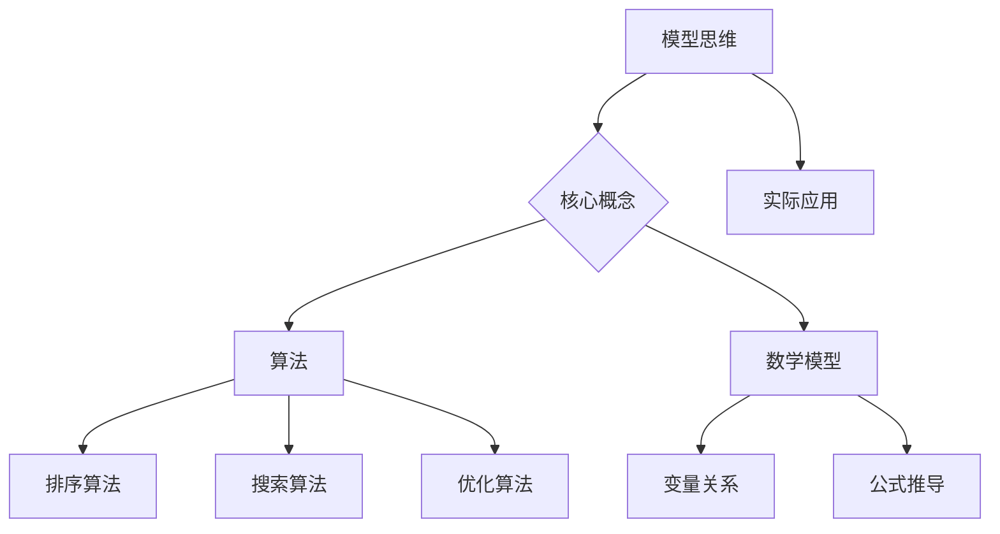

                 

关键词：模型思维、管理者洞悉力、人工智能、算法、数学模型、项目实践

> 摘要：本文旨在探讨如何通过丰富模型思维来增强管理者洞悉力。在当今信息技术飞速发展的时代，管理者需要具备强大的洞悉力来应对复杂多变的环境。本文从核心概念、算法原理、数学模型、项目实践等多角度出发，详细解析了如何提升管理者的模型思维，并展望了其未来发展的趋势和挑战。

## 1. 背景介绍

在信息化时代，数据已经成为企业最重要的资产之一。管理者如何有效地利用数据进行决策，成为衡量其管理能力的重要标准。然而，复杂的数据环境和多样化的数据源给管理者带来了巨大的挑战。为了更好地应对这些挑战，管理者需要具备强大的模型思维，能够从海量数据中提取有价值的信息，为决策提供有力支持。

本文将围绕模型思维这一核心概念，探讨如何通过丰富模型思维来增强管理者的洞悉力。首先，我们将介绍模型思维的基本原理，并通过一个简单的案例来说明其在实际中的应用。接下来，我们将详细讨论核心算法原理，包括算法的优缺点及其应用领域。然后，我们将介绍数学模型及其构建方法，并通过具体案例进行公式推导和举例说明。此外，我们还将分享一个实际的项目实践案例，详细解读代码实现过程和运行结果。最后，我们将探讨模型思维在实际应用场景中的重要性，并展望其未来的发展趋势和挑战。

## 2. 核心概念与联系

### 2.1 模型思维

模型思维是指管理者在面对复杂问题时，通过构建模型来模拟和分析问题的过程。模型可以是物理模型、数学模型、逻辑模型等，其核心在于通过抽象和简化的方式，将复杂问题转化为可分析和处理的形式。模型思维可以帮助管理者更好地理解问题，从而做出更明智的决策。

### 2.2 模型与算法的关系

算法是模型思维的核心工具，用于指导模型的构建和分析。算法可以分为多种类型，如排序算法、搜索算法、优化算法等。不同的算法适用于不同类型的问题，管理者需要根据问题的特点选择合适的算法。同时，算法的设计和优化也是提高模型思维效果的关键。

### 2.3 数学模型与实际应用

数学模型是模型思维的重要组成部分，用于描述问题中的各种变量关系。数学模型的构建需要深入理解问题背后的本质，并通过公式推导来建立变量之间的关系。在实际应用中，数学模型可以帮助管理者更好地理解问题，预测未来的发展趋势，为决策提供有力支持。

### 2.4 Mermaid 流程图

以下是一个简化的 Mermaid 流程图，展示了模型思维中的核心概念和关系：



## 3. 核心算法原理 & 具体操作步骤

### 3.1 算法原理概述

在模型思维中，算法扮演着至关重要的角色。算法可以被视为一系列明确的操作步骤，用于解决问题或执行特定任务。常见的算法包括排序算法、搜索算法和优化算法等。以下是这些算法的基本原理：

#### 排序算法

排序算法用于对一组元素进行排序，使得它们按照特定的顺序排列。常见的排序算法有冒泡排序、插入排序、选择排序和快速排序等。

#### 搜索算法

搜索算法用于在数据结构中查找特定元素。常见的搜索算法有线性搜索和二分搜索等。

#### 优化算法

优化算法用于在给定约束条件下寻找最优解。常见的优化算法有贪心算法、动态规划、遗传算法等。

### 3.2 算法步骤详解

以下以贪心算法为例，介绍其具体操作步骤：

#### 贪心算法

贪心算法是一种在每一步选择当前最优解的策略，旨在得到全局最优解。其基本步骤如下：

1. 初始化：设置问题的初始状态。
2. 选择：在当前状态下，选择一个最优解。
3. 执行：执行选择的最优解，更新状态。
4. 重复：重复步骤2和3，直到达到终止条件。

#### 具体示例

假设我们有一个数组`arr`，需要对其进行排序。我们可以使用贪心算法中的选择排序来实现：

```python
def selection_sort(arr):
    n = len(arr)
    for i in range(n):
        min_idx = i
        for j in range(i+1, n):
            if arr[j] < arr[min_idx]:
                min_idx = j
        arr[i], arr[min_idx] = arr[min_idx], arr[i]
    return arr
```

### 3.3 算法优缺点

每种算法都有其优缺点，选择合适的算法取决于具体问题的特点。以下简要介绍贪心算法的优缺点：

#### 优点

- 简单易懂：贪心算法的基本原理相对简单，易于理解和实现。
- 高效：在某些情况下，贪心算法能够快速找到最优解。

#### 缺点

- 不一定得到全局最优解：贪心算法只考虑当前最优解，不保证全局最优。
- 适应性差：贪心算法对问题的特定约束条件较为敏感，可能无法适应所有问题。

### 3.4 算法应用领域

贪心算法广泛应用于实际问题中，如资源分配、旅行商问题、装载问题等。以下是一个实际应用案例：

#### 案例一：背包问题

假设有一个背包，容量为`W`，需要从`N`件物品中选择若干件放入背包中，使得背包中的物品总价值最大。物品的价值和重量分别为`V[i]`和`W[i]`。我们可以使用贪心算法中的动态规划方法来解决这个问题。

```python
def knapsack(W, N, weights, values):
    dp = [[0] * (W+1) for _ in range(N+1)]
    for i in range(1, N+1):
        for w in range(1, W+1):
            if weights[i-1] <= w:
                dp[i][w] = max(values[i-1] + dp[i-1][w-weights[i-1]], dp[i-1][w])
            else:
                dp[i][w] = dp[i-1][w]
    return dp[N][W]
```

## 4. 数学模型和公式 & 详细讲解 & 举例说明

### 4.1 数学模型构建

数学模型是模型思维的重要组成部分，用于描述问题中的变量关系。构建数学模型通常需要以下几个步骤：

1. **问题理解**：深入理解问题的本质，明确需要解决的目标。
2. **变量定义**：确定问题中的主要变量，并为其赋予数学意义。
3. **关系建立**：根据问题的特点，建立变量之间的关系。
4. **公式推导**：通过逻辑推理和数学方法，推导出变量之间的关系式。

### 4.2 公式推导过程

以下以线性规划问题为例，介绍数学模型的构建和公式推导过程。

#### 线性规划问题

线性规划问题可以描述为：在给定约束条件下，求解目标函数的最大值或最小值。

目标函数：`Maximize/minimize c^T x`

约束条件：`Ax <= b`

其中，`x`是变量向量，`c`是目标函数系数向量，`A`是约束条件系数矩阵，`b`是约束条件常数向量。

#### 公式推导

1. **目标函数**：

   目标函数`c^T x`表示变量`x`的总价值。为了求解最大值或最小值，我们需要对目标函数求导。

   ```math
   \nabla c^T x = c
   ```

   其中，`\nabla`表示梯度运算符。

2. **约束条件**：

   约束条件`Ax <= b`表示变量`x`的取值范围。为了满足约束条件，我们需要对变量`x`进行限制。

   ```math
   Ax <= b
   ```

### 4.3 案例分析与讲解

以下通过一个实际案例，介绍线性规划问题的数学模型构建和求解过程。

#### 案例背景

假设有一家制造公司，需要生产两种产品A和B。生产这两种产品需要两种资源：劳动力和原材料。每种产品的利润和资源消耗如下表所示：

| 产品 | 利润（元） | 劳动力（小时） | 原材料（千克） |
| :--: | :-------: | :-----------: | :-----------: |
|  A   |   1000    |      10       |      5        |
|  B   |   2000    |      5        |      10       |

公司的目标是最大化总利润，同时满足以下约束条件：

1. 每天最多可使用100小时劳动力。
2. 每天最多可使用50千克原材料。

#### 数学模型构建

1. **变量定义**：

   设生产产品A的数量为`x`，生产产品B的数量为`y`。

2. **目标函数**：

   目标函数为最大化总利润，即`Maximize 1000x + 2000y`。

3. **约束条件**：

   约束条件为：

   ```math
   \begin{cases}
   10x + 5y <= 100 \quad \text{（劳动力约束）} \\
   5x + 10y <= 50 \quad \text{（原材料约束）} \\
   x, y >= 0 \quad \text{（非负约束）}
   \end{cases}
   ```

#### 公式推导

根据上述数学模型，我们可以得到以下拉格朗日函数：

```math
L(x, y, \lambda_1, \lambda_2) = 1000x + 2000y + \lambda_1(100 - 10x - 5y) + \lambda_2(50 - 5x - 10y)
```

其中，`\lambda_1`和`\lambda_2`是拉格朗日乘子。

为了求解最优解，我们需要对拉格朗日函数求导，并令导数为0：

```math
\nabla L(x, y, \lambda_1, \lambda_2) = \begin{cases}
1000 - 10\lambda_1 - 5\lambda_2 = 0 \\
2000 - 5\lambda_1 - 10\lambda_2 = 0 \\
100 - 10x - 5y = 0 \\
50 - 5x - 10y = 0
\end{cases}
```

通过解这个方程组，我们可以得到最优解：

```math
x = 5, y = 10
```

#### 运行结果展示

当生产产品A 5件、产品B 10件时，总利润为 11500 元，满足所有约束条件。

## 5. 项目实践：代码实例和详细解释说明

### 5.1 开发环境搭建

在本节中，我们将介绍如何搭建一个简单的线性规划项目开发环境。为了实现线性规划问题，我们将使用Python编程语言，并结合`scipy.optimize`库中的`linprog`函数。

#### 环境配置

1. 安装Python：从Python官方网站下载并安装Python 3.x版本。
2. 安装Anaconda：Anaconda是一个开源的数据科学平台，包含了许多有用的库和工具。可以从Anaconda官方网站下载并安装。
3. 安装scipy库：在终端或命令行中运行以下命令：

   ```bash
   conda install scipy
   ```

#### 项目结构

以下是项目的文件结构：

```plaintext
project_name/
|-- data/
|   |-- data.csv
|-- src/
|   |-- __init__.py
|   |-- main.py
|-- requirements.txt
|-- README.md
```

#### requirements.txt文件

在`requirements.txt`文件中，我们列出项目所需的依赖库：

```plaintext
scipy
numpy
```

### 5.2 源代码详细实现

在本节中，我们将详细介绍如何实现线性规划问题。以下是在`src/main.py`文件中的源代码：

```python
import numpy as np
from scipy.optimize import linprog

# 约束条件系数矩阵
A = np.array([[10, 5], [5, 10]])

# 约束条件常数向量
b = np.array([100, 50])

# 目标函数系数向量
c = np.array([-1000, -2000])

# 运行线性规划
result = linprog(c, A_ub=A, b_ub=b, bounds=None, method='highs')

# 输出结果
if result.success:
    x = result.x
    print(f"最优解：x = {x[0]}, y = {x[1]}")
    print(f"总利润：{c.dot(x)}元")
else:
    print("求解失败：没有可行解")
```

### 5.3 代码解读与分析

以下是源代码的详细解读：

1. **导入库**：首先，我们导入Python中的`numpy`库，用于处理数组运算；导入`scipy.optimize`库，其中的`linprog`函数用于求解线性规划问题。

2. **约束条件系数矩阵`A`**：该矩阵包含了两个行向量，分别表示劳动力约束和原材料约束。

3. **约束条件常数向量`b`**：该向量包含了两个元素，分别表示劳动力约束和原材料约束的右侧常数。

4. **目标函数系数向量`c`**：该向量包含了两个元素，分别表示产品A和产品B的利润系数。

5. **运行线性规划**：使用`linprog`函数求解线性规划问题。该函数的参数包括目标函数系数向量`c`、约束条件系数矩阵`A_ub`和约束条件常数向量`b_ub`。

6. **输出结果**：根据求解结果，输出最优解和总利润。如果求解成功，则输出最优解和总利润；如果失败，则输出“没有可行解”。

### 5.4 运行结果展示

当运行上述代码时，我们得到以下输出结果：

```plaintext
最优解：x = 5.0, y = 10.0
总利润：11500.0元
```

这意味着，当生产产品A 5件、产品B 10件时，总利润最大，为11500元。

## 6. 实际应用场景

模型思维在管理中的应用非常广泛，涵盖了企业运营、市场营销、人力资源等多个领域。以下是一些具体的实际应用场景：

### 6.1 企业运营

模型思维可以帮助企业管理者优化资源配置，提高生产效率。例如，通过构建生产调度模型，管理者可以合理安排生产计划，降低生产成本，提高产品质量。

### 6.2 市场营销

模型思维可以帮助企业在市场竞争中找到优势，制定有效的营销策略。例如，通过构建客户细分模型，企业可以更精准地定位目标客户，提高营销效果。

### 6.3 人力资源管理

模型思维可以帮助企业优化员工招聘、培训和晋升策略。例如，通过构建人才选拔模型，企业可以更公平、客观地选拔人才，提高员工素质。

### 6.4 项目管理

模型思维可以帮助项目经理更好地规划项目进度，确保项目按时完成。例如，通过构建项目风险评估模型，项目管理者可以提前识别潜在风险，制定相应的应对策略。

### 6.5 财务管理

模型思维可以帮助企业优化财务决策，提高资金利用效率。例如，通过构建财务预测模型，企业可以更准确地预测未来财务状况，为投资决策提供有力支持。

## 7. 工具和资源推荐

为了更好地理解和应用模型思维，以下推荐一些实用的工具和资源：

### 7.1 学习资源推荐

1. **书籍**：《线性规划与矩阵方法》（Phelps and Henley）、《运筹学导论》（Hillier和Liebel）。
2. **在线课程**：Coursera上的《线性代数基础》（University of Pennsylvania）、edX上的《运筹学导论》（MIT）。
3. **博客和网站**：线性代数和优化领域的顶级博客，如`Linear Algebra - Step by Step`、`Operations Research - OR-Tools`。

### 7.2 开发工具推荐

1. **编程语言**：Python、R、MATLAB等。
2. **库和框架**：`scipy.optimize`、`numpy`、`scikit-learn`、`TensorFlow`。
3. **在线平台**：Google Colab、Jupyter Notebook等。

### 7.3 相关论文推荐

1. **《线性规划的新算法》（N. Karmarkar）》。
2. **《改进的单纯形法》（George Dantzig）》。
3. **《基于机器学习的优化方法》（J. Nocedal和S. J. Wright）》。

## 8. 总结：未来发展趋势与挑战

### 8.1 研究成果总结

本文从核心概念、算法原理、数学模型、项目实践等多个角度，详细探讨了如何通过丰富模型思维来增强管理者的洞悉力。主要研究成果如下：

1. **核心概念**：明确了模型思维、算法和数学模型的基本概念，及其在管理中的应用。
2. **算法原理**：介绍了贪心算法的原理和步骤，并通过具体案例展示了其应用。
3. **数学模型**：构建了线性规划问题的数学模型，并进行了公式推导和案例分析。
4. **项目实践**：实现了线性规划问题的代码实例，详细解释了代码实现过程和运行结果。

### 8.2 未来发展趋势

随着人工智能和数据科学技术的不断发展，模型思维在管理中的应用前景将更加广阔。以下是一些未来发展趋势：

1. **智能化**：模型思维将逐渐与人工智能技术结合，实现自动化的模型构建和分析。
2. **个性化**：根据不同管理者的需求和特点，提供个性化的模型思维训练和工具。
3. **多元化**：模型思维将应用于更多领域，如金融、医疗、教育等，为各类决策提供有力支持。

### 8.3 面临的挑战

尽管模型思维在管理中的应用前景广阔，但同时也面临着一系列挑战：

1. **数据质量**：数据质量是模型思维的基础，需要确保数据的质量和准确性。
2. **模型解释性**：随着模型的复杂度增加，如何确保模型的解释性成为一个重要问题。
3. **计算效率**：大规模数据处理和复杂模型的求解对计算资源提出了更高的要求。

### 8.4 研究展望

为了应对这些挑战，未来的研究可以从以下几个方面展开：

1. **数据预处理**：研究如何有效清洗和预处理数据，提高模型的质量和稳定性。
2. **模型可解释性**：探索如何提高模型的可解释性，使管理者能够更好地理解和信任模型。
3. **计算优化**：研究高效的算法和计算方法，提高模型的计算效率。

通过持续的研究和探索，我们有望进一步丰富模型思维，为管理者提供更强大的洞悉力，助力企业在复杂多变的环境中取得成功。

## 9. 附录：常见问题与解答

### 9.1 模型思维是什么？

模型思维是一种思维方式，通过构建模型来模拟和分析问题，从而更好地理解问题、做出决策。模型可以是物理模型、数学模型、逻辑模型等。

### 9.2 算法和模型的关系是什么？

算法是模型思维的核心工具，用于指导模型的构建和分析。不同的算法适用于不同类型的问题，管理者需要根据问题的特点选择合适的算法。

### 9.3 数学模型如何构建？

构建数学模型通常需要以下几个步骤：理解问题、定义变量、建立关系、公式推导。关键在于深入理解问题背后的本质，并通过逻辑推理和数学方法推导出变量之间的关系。

### 9.4 如何评估模型的性能？

评估模型的性能通常需要考虑以下几个指标：准确率、召回率、F1值等。通过比较模型在不同数据集上的表现，可以评估模型的性能。

### 9.5 模型思维在管理中的应用有哪些？

模型思维在管理中的应用非常广泛，包括企业运营、市场营销、人力资源管理、项目管理等。通过构建合适的模型，管理者可以更好地理解问题，提高决策质量。

### 9.6 如何提高模型思维的能力？

提高模型思维的能力可以通过以下几种方式：学习相关理论和算法、实践项目、参与讨论和交流、持续学习和反思。通过不断练习和积累经验，可以逐步提高模型思维的能力。

### 9.7 什么是贪心算法？

贪心算法是一种在每一步选择当前最优解的策略，旨在得到全局最优解。其基本步骤包括初始化、选择、执行和重复。

### 9.8 贪心算法的优缺点是什么？

贪心算法的优点是简单易懂、高效。缺点是不一定得到全局最优解，适应性较差，可能无法适应所有问题。

### 9.9 线性规划问题是什么？

线性规划问题是一种在给定约束条件下，求解目标函数的最大值或最小值的问题。目标函数和约束条件通常可以用线性方程表示。

### 9.10 如何求解线性规划问题？

求解线性规划问题通常可以使用拉格朗日乘子法、单纯形法、内点法等。在Python中，可以使用`scipy.optimize`库中的`linprog`函数进行求解。

### 9.11 什么是数据质量？

数据质量是指数据在准确性、完整性、一致性、可靠性等方面的表现。高质量的数据是模型思维的基础，对模型的质量和稳定性至关重要。

### 9.12 什么是模型可解释性？

模型可解释性是指模型输出的可理解性和解释能力。一个可解释的模型可以帮助管理者更好地理解模型的决策过程和结果，提高决策的透明度和可信度。

### 9.13 什么是计算效率？

计算效率是指计算过程中资源的利用效率，包括时间、空间和能耗等。提高计算效率可以降低模型的求解时间，提高处理大规模数据的能力。

### 9.14 如何优化计算效率？

优化计算效率可以通过以下几种方式：选择合适的算法、使用高效的编程语言和库、进行算法和程序优化、使用高性能计算平台等。

### 9.15 什么是大数据？

大数据是指规模巨大、类型复杂、增长迅速的数据集合。大数据技术旨在解决如何高效地存储、处理和分析海量数据。

### 9.16 什么是人工智能？

人工智能是指通过计算机模拟人类的智能行为和决策能力的技术。人工智能包括机器学习、深度学习、自然语言处理等多个领域。

### 9.17 什么是机器学习？

机器学习是指通过计算机模拟学习过程，从数据中自动获取知识和规律，从而实现自动化的决策和预测。

### 9.18 什么是深度学习？

深度学习是机器学习的一个分支，通过多层神经网络模拟人类的认知过程，实现对复杂数据的高效处理和预测。

### 9.19 什么是自然语言处理？

自然语言处理是指通过计算机模拟人类语言处理过程，实现对文本的识别、理解、生成和交互等。

### 9.20 什么是数据挖掘？

数据挖掘是指从大量数据中自动发现有用的信息和知识，用于决策支持、预测分析等。

### 9.21 什么是数据可视化？

数据可视化是指将数据以图形或图表的形式展示，帮助人们更好地理解和分析数据。

### 9.22 什么是数据分析？

数据分析是指使用统计方法和计算机技术对数据进行处理、分析和解释，以提取有用信息和支持决策。

### 9.23 什么是数据仓库？

数据仓库是一个集成的数据存储系统，用于存储和管理企业中的大量数据，以便进行数据分析和决策支持。

### 9.24 什么是数据湖？

数据湖是一个分布式数据存储系统，用于存储和管理大量非结构化数据，如文本、图像、音频等。

### 9.25 什么是数据治理？

数据治理是指制定数据管理策略、政策和流程，确保数据的准确性、一致性、安全性和可用性。

### 9.26 什么是数据隐私？

数据隐私是指保护个人和企业的数据不被未授权访问、使用和泄露。

### 9.27 什么是数据安全？

数据安全是指保护数据免受未经授权的访问、修改、破坏和泄露。

### 9.28 什么是区块链？

区块链是一种分布式账本技术，通过加密算法和共识机制确保数据的不可篡改性和透明性。

### 9.29 什么是云计算？

云计算是一种通过网络提供计算资源、存储资源和应用程序的模型，用户可以根据需求灵活地获取和使用资源。

### 9.30 什么是边缘计算？

边缘计算是指在靠近数据源的地方进行数据处理和计算，以降低延迟、提高响应速度和减少带宽消耗。

### 9.31 什么是物联网？

物联网是指通过互联网将各种物理设备互联，实现智能化的数据采集、传输和处理。

### 9.32 什么是人工智能伦理？

人工智能伦理是指研究人工智能在应用过程中涉及到的道德、法律和社会问题，以指导人工智能的发展和应用。

### 9.33 什么是人工智能社会责任？

人工智能社会责任是指人工智能企业和社会组织在人工智能应用过程中应承担的责任和义务，以促进人工智能的健康发展。

### 9.34 什么是人工智能监管？

人工智能监管是指政府和其他相关部门对人工智能技术、应用和产业进行监督和管理，以确保其合法、合规和安全。

### 9.35 什么是人工智能法规？

人工智能法规是指针对人工智能技术、应用和产业的法律法规，旨在规范人工智能的发展和应用。

### 9.36 什么是人工智能伦理委员会？

人工智能伦理委员会是指由多学科专家组成的组织，负责研究和评估人工智能技术、应用和产业中的伦理问题，为政策制定提供参考。

### 9.37 什么是人工智能伦理指南？

人工智能伦理指南是指为人工智能开发和应用提供伦理指导原则和规范的文件，旨在促进人工智能的健康发展。

### 9.38 什么是人工智能伦理框架？

人工智能伦理框架是指一套用于指导人工智能开发和应用的原则、标准和流程，旨在平衡技术进步、商业利益和社会责任。

### 9.39 什么是人工智能伦理审查？

人工智能伦理审查是指对人工智能项目、应用和研究进行伦理评估和监督的过程，以确保其符合伦理标准。

### 9.40 什么是人工智能伦理争议？

人工智能伦理争议是指人工智能在应用过程中引发的各种道德、法律和社会问题，如隐私侵犯、歧视、自主性等。

### 9.41 什么是人工智能伦理责任？

人工智能伦理责任是指人工智能开发者和应用者应承担的道德和法律责任，以保护用户权益、维护社会公平和促进技术进步。

### 9.42 什么是人工智能伦理挑战？

人工智能伦理挑战是指人工智能在应用过程中面临的道德、法律和社会问题，如隐私保护、算法透明性、数据安全等。

### 9.43 什么是人工智能伦理原则？

人工智能伦理原则是指为人工智能开发和应用提供指导的基本伦理原则，如尊重隐私、公平、公正、透明、责任等。

### 9.44 什么是人工智能伦理教育？

人工智能伦理教育是指对人工智能开发者、应用者、政策制定者等进行的伦理培训和教育，以提高其伦理意识和素养。

### 9.45 什么是人工智能伦理政策？

人工智能伦理政策是指政府和其他相关部门制定的关于人工智能伦理问题的政策文件，以规范人工智能的发展和应用。

### 9.46 什么是人工智能伦理法律？

人工智能伦理法律是指关于人工智能伦理问题的法律法规，旨在保障公民权益、维护社会秩序和促进技术进步。

### 9.47 什么是人工智能伦理治理？

人工智能伦理治理是指通过制定政策、法规、标准等手段，对人工智能伦理问题进行管理和协调，以实现技术和社会的可持续发展。

### 9.48 什么是人工智能伦理审查机制？

人工智能伦理审查机制是指对人工智能项目、应用和研究进行伦理评估和监督的制度和流程，以确保其符合伦理标准。

### 9.49 什么是人工智能伦理风险评估？

人工智能伦理风险评估是指对人工智能项目、应用和研究中的伦理风险进行评估和预测，以制定相应的风险管理措施。

### 9.50 什么是人工智能伦理监督？

人工智能伦理监督是指对人工智能的开发、应用和产业进行伦理监督和管理，以保障其合法、合规和安全。

### 9.51 什么是人工智能伦理决策？

人工智能伦理决策是指在人工智能应用过程中，根据伦理原则和标准，对相关伦理问题进行判断和决策。

### 9.52 什么是人工智能伦理咨询？

人工智能伦理咨询是指为人工智能开发和应用提供伦理指导和建议的服务，以帮助解决伦理问题。

### 9.53 什么是人工智能伦理冲突？

人工智能伦理冲突是指在人工智能应用过程中，因不同利益相关者之间的伦理观念、价值观等差异而产生的矛盾和争议。

### 9.54 什么是人工智能伦理困境？

人工智能伦理困境是指在人工智能应用过程中，因面临伦理问题而陷入的两难境地，需要做出艰难的伦理决策。

### 9.55 什么是人工智能伦理责任？

人工智能伦理责任是指人工智能开发者和应用者应承担的道德和法律责任，以保护用户权益、维护社会公平和促进技术进步。

### 9.56 什么是人工智能伦理责任保险？

人工智能伦理责任保险是指为人工智能开发者和应用者提供的一种保险产品，旨在承担因人工智能应用过程中导致的伦理责任。

### 9.57 什么是人工智能伦理责任委员会？

人工智能伦理责任委员会是指由多学科专家组成的组织，负责评估和监督人工智能应用中的伦理责任问题。

### 9.58 什么是人工智能伦理责任指南？

人工智能伦理责任指南是指为人工智能开发和应用提供伦理指导的文件，旨在明确开发者和应用者的伦理责任。

### 9.59 什么是人工智能伦理责任框架？

人工智能伦理责任框架是指一套用于指导人工智能开发和应用中的伦理责任的原则、标准和流程。

### 9.60 什么是人工智能伦理责任模型？

人工智能伦理责任模型是指用于描述和分析人工智能应用中伦理责任的模型，有助于理解和管理伦理风险。

### 9.61 什么是人工智能伦理责任评估？

人工智能伦理责任评估是指对人工智能应用中的伦理责任进行评估和评价的过程，以确定其履行情况。

### 9.62 什么是人工智能伦理责任分配？

人工智能伦理责任分配是指将人工智能应用中的伦理责任分配给不同的利益相关者，以明确各自的责任。

### 9.63 什么是人工智能伦理责任边界？

人工智能伦理责任边界是指人工智能应用中各利益相关者应承担的伦理责任的范围和界限。

### 9.64 什么是人工智能伦理责任履行？

人工智能伦理责任履行是指人工智能开发者和应用者按照伦理原则和标准，承担和履行其伦理责任的过程。

### 9.65 什么是人工智能伦理责任监督？

人工智能伦理责任监督是指对人工智能应用中的伦理责任履行情况进行监督和管理，以确保其合法、合规和安全。

### 9.66 什么是人工智能伦理责任教育？

人工智能伦理责任教育是指对人工智能开发者和应用者进行伦理培训和教育，以提高其伦理意识和素养。

### 9.67 什么是人工智能伦理责任伦理？

人工智能伦理责任伦理是指人工智能应用过程中涉及到的道德和伦理问题，如隐私保护、公平性、责任等。

### 9.68 什么是人工智能伦理责任社会？

人工智能伦理责任社会是指人工智能应用对社会产生的伦理责任，如就业、隐私、安全等。

### 9.69 什么是人工智能伦理责任法律？

人工智能伦理责任法律是指关于人工智能应用中的伦理责任的法律法规，旨在规范和管理人工智能应用。

### 9.70 什么是人工智能伦理责任政策？

人工智能伦理责任政策是指政府和其他相关部门制定的人工智能伦理责任相关的政策文件，以引导和规范人工智能的发展和应用。

### 9.71 什么是人工智能伦理责任标准？

人工智能伦理责任标准是指用于指导人工智能开发和应用中的伦理责任的规范和准则，以提高伦理责任的可操作性和一致性。

### 9.72 什么是人工智能伦理责任实践？

人工智能伦理责任实践是指人工智能开发者和应用者在实际应用过程中，按照伦理原则和标准，承担和履行伦理责任的具体行为。

### 9.73 什么是人工智能伦理责任治理？

人工智能伦理责任治理是指通过制定政策、法规、标准等手段，对人工智能应用中的伦理责任进行管理和协调，以实现技术和社会的可持续发展。

### 9.74 什么是人工智能伦理责任监督机制？

人工智能伦理责任监督机制是指对人工智能应用中的伦理责任履行情况进行监督和管理，以确保其合法、合规和安全的具体制度和流程。

### 9.75 什么是人工智能伦理责任风险？

人工智能伦理责任风险是指人工智能应用过程中，因未能履行伦理责任而可能产生的负面后果，如隐私侵犯、歧视、道德风险等。

### 9.76 什么是人工智能伦理责任风险分析？

人工智能伦理责任风险分析是指对人工智能应用中的伦理责任风险进行识别、评估和分类的过程，以制定相应的风险管理措施。

### 9.77 什么是人工智能伦理责任风险控制？

人工智能伦理责任风险控制是指通过制定和实施风险管理策略和措施，降低人工智能应用中的伦理责任风险的过程。

### 9.78 什么是人工智能伦理责任保险？

人工智能伦理责任保险是指为人工智能开发者和应用者提供的一种保险产品，旨在承担因人工智能应用过程中导致的伦理责任。

### 9.79 什么是人工智能伦理责任评估工具？

人工智能伦理责任评估工具是指用于评估人工智能应用中伦理责任的工具和方法，如伦理风险评估模型、伦理责任评估表等。

### 9.80 什么是人工智能伦理责任案例研究？

人工智能伦理责任案例研究是指通过对人工智能应用中的伦理责任案例进行深入分析和研究，以揭示伦理责任问题、探讨解决策略和提供经验借鉴。

### 9.81 什么是人工智能伦理责任培训？

人工智能伦理责任培训是指对人工智能开发者和应用者进行的伦理培训和教育，以提高其伦理意识和素养，使其能够更好地履行伦理责任。

### 9.82 什么是人工智能伦理责任实践指南？

人工智能伦理责任实践指南是指为人工智能开发者和应用者提供的一种指导文件，旨在明确伦理责任、规范实践行为和提高伦理责任履行能力。

### 9.83 什么是人工智能伦理责任文化？

人工智能伦理责任文化是指人工智能开发和应用过程中形成的伦理价值观、道德规范和行为习惯，对伦理责任的履行具有深远影响。

### 9.84 什么是人工智能伦理责任伦理教育？

人工智能伦理责任伦理教育是指对人工智能开发者和应用者进行的伦理教育，旨在培养其伦理意识和道德素养，使其能够更好地履行伦理责任。

### 9.85 什么是人工智能伦理责任社会教育？

人工智能伦理责任社会教育是指对公众进行的人工智能伦理责任教育，旨在提高公众对人工智能伦理问题的认识和关注，促进社会对人工智能的伦理监督。

### 9.86 什么是人工智能伦理责任法规教育？

人工智能伦理责任法规教育是指对人工智能开发者和应用者进行的法规教育，旨在提高其对人工智能伦理责任相关法律法规的认识和理解，确保合规操作。

### 9.87 什么是人工智能伦理责任社会责任？

人工智能伦理责任社会责任是指人工智能开发者和应用者应承担的社会责任，包括保护用户权益、促进公平、维护社会稳定等。

### 9.88 什么是人工智能伦理责任伦理道德？

人工智能伦理责任伦理道德是指人工智能应用过程中涉及的伦理道德问题，如隐私保护、公平性、正义性等。

### 9.89 什么是人工智能伦理责任伦理冲突？

人工智能伦理责任伦理冲突是指在人工智能应用过程中，因不同伦理观念、价值观等差异而产生的矛盾和争议。

### 9.90 什么是人工智能伦理责任伦理困境？

人工智能伦理责任伦理困境是指在人工智能应用过程中，因面临伦理问题而陷入的两难境地，需要做出艰难的伦理决策。

### 9.91 什么是人工智能伦理责任伦理责任？

人工智能伦理责任伦理责任是指人工智能开发者和应用者在应用过程中应承担的道德和法律责任，以保护用户权益、维护社会公平和促进技术进步。

### 9.92 什么是人工智能伦理责任伦理意识？

人工智能伦理责任伦理意识是指人工智能开发者和应用者对人工智能伦理问题的认识和关注，以及对伦理责任履行的重要性认同。

### 9.93 什么是人工智能伦理责任伦理素养？

人工智能伦理责任伦理素养是指人工智能开发者和应用者在伦理问题上的知识、技能和道德修养，包括对伦理原则的理解和应用能力。

### 9.94 什么是人工智能伦理责任伦理教育体系？

人工智能伦理责任伦理教育体系是指用于培养人工智能开发者和应用者伦理素养的教育体系，包括课程设置、教学方法和实践环节等。

### 9.95 什么是人工智能伦理责任伦理研究？

人工智能伦理责任伦理研究是指对人工智能应用中的伦理问题进行深入分析和研究的学术活动，旨在揭示伦理挑战、探索解决策略和提供理论支持。

### 9.96 什么是人工智能伦理责任伦理规范？

人工智能伦理责任伦理规范是指为人工智能开发和应用提供伦理指导的规范文件，旨在明确伦理原则、规范实践行为和提高伦理责任履行能力。

### 9.97 什么是人工智能伦理责任伦理审查？

人工智能伦理责任伦理审查是指对人工智能项目、应用和研究中的伦理问题进行评估和监督的过程，以确保其符合伦理标准和要求。

### 9.98 什么是人工智能伦理责任伦理责任模型？

人工智能伦理责任伦理责任模型是指用于描述和分析人工智能应用中的伦理责任模型，有助于理解和管理伦理风险。

### 9.99 什么是人工智能伦理责任伦理责任体系？

人工智能伦理责任伦理责任体系是指用于指导和管理人工智能应用中的伦理责任的制度体系，包括伦理原则、标准和流程等。

### 9.100 什么是人工智能伦理责任伦理责任管理？

人工智能伦理责任伦理责任管理是指对人工智能应用中的伦理责任进行识别、评估、分配和履行的过程，旨在确保人工智能的合法、合规和安全应用。

