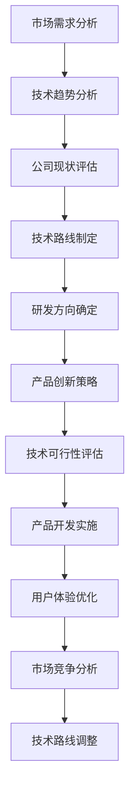

                 

在当今快速变化的技术时代，技术战略规划对于公司的长期成功至关重要。作为公司的技术领导者，主导和把握公司的技术发展方向，研究制订公司的科技战略规划，包括技术路线、研发方向、产品创新等，是我们面临的一项重要任务。本文将深入探讨如何实现这一目标，并提供一系列的策略和建议。

## 关键词 Keywords

技术战略、研发方向、产品创新、技术路线、科技规划

## 摘要 Abstract

本文旨在探讨如何主导和把握公司的技术发展方向，研究制订公司的科技战略规划。文章首先介绍了技术战略规划的重要性，然后详细分析了技术路线、研发方向和产品创新的关键要素，并提供了一系列实际操作的策略和建议。通过本文的阅读，读者将能够更好地理解技术战略规划的过程，并在实践中运用这些策略，为公司的技术创新和长期发展奠定坚实的基础。

## 1. 背景介绍

随着数字化转型的深入，技术已经成为驱动公司增长和竞争力的关键因素。对于任何一家企业来说，技术战略规划都是不可或缺的。它不仅决定了公司的短期目标和长期愿景，还直接影响到公司的运营效率、市场竞争力以及创新能力。技术战略规划的核心在于确定公司的技术发展方向，优化资源配置，以及推动技术创新。

技术战略规划的重要性体现在以下几个方面：

1. **确保技术创新的可持续性**：通过明确的技术路线和研发方向，公司可以持续地推动技术创新，保持在市场中的领先地位。
2. **优化资源配置**：有效的技术战略规划有助于优化公司的资源配置，确保资金、人力和物力能够最大限度地发挥效用。
3. **增强市场竞争力**：明确的技术路线和产品创新战略可以帮助公司快速响应市场需求，提升产品竞争力。
4. **提高公司凝聚力**：共同的技术愿景和战略目标可以增强公司的凝聚力，激发员工的创新热情和团队协作。

然而，技术战略规划并非一蹴而就，它需要深入的市场调研、精准的技术预测以及对公司现状的全面分析。本文将围绕这些核心要素，探讨如何有效地制定和实施公司的科技战略规划。

## 2. 核心概念与联系

### 2.1 技术路线

技术路线是指公司在技术发展过程中所遵循的基本路径和方向。它不仅包括现有的技术能力，还涵盖了未来可能的技术突破和发展趋势。技术路线的制定需要基于以下几个方面：

- **市场需求**：了解市场需求，确定哪些技术方向符合客户需求，有助于公司的长远发展。
- **技术趋势**：分析行业内的技术趋势，包括新兴技术、技术成熟度以及未来可能的发展方向。
- **公司现状**：评估公司的技术实力、研发能力和资源状况，确保技术路线与公司现状相适应。
- **竞争对手**：研究竞争对手的技术路线和战略布局，找出差距和优势，制定相应的发展策略。

### 2.2 研发方向

研发方向是指公司在研发过程中所关注的重点领域和方向。明确的研发方向有助于集中资源，提高研发效率。在制定研发方向时，需要考虑以下几个方面：

- **技术创新**：确定哪些技术领域具有创新潜力，符合公司的技术战略目标。
- **市场需求**：根据市场需求，确定哪些研发方向能够满足客户的需求，提高产品的竞争力。
- **资源分配**：合理分配研发资源，确保重点项目的优先级，提高研发效率。
- **风险评估**：评估研发项目中的风险，制定相应的应对策略。

### 2.3 产品创新

产品创新是技术战略规划的重要组成部分，它涉及到如何通过技术创新来推动产品升级和换代。在产品创新方面，需要关注以下几个方面：

- **用户需求**：深入了解用户需求，通过用户反馈和数据分析，确定产品创新的优先级。
- **技术可行性**：评估技术创新的可行性，确保产品创新能够在技术层面上实现。
- **市场竞争**：分析市场竞争态势，确定产品创新的方向和策略，提升市场竞争力。
- **用户体验**：注重用户体验，通过用户反馈不断优化产品设计，提高用户满意度。

### 2.4 Mermaid 流程图



通过以上核心概念的分析，我们可以看出，技术路线、研发方向和产品创新之间存在着密切的联系和相互影响。明确的技术路线可以指导研发方向和产品创新的方向，而研发方向和产品创新的结果又可以反过来影响技术路线的制定和调整。因此，在制定公司的科技战略规划时，需要全面考虑这些核心概念，并确保它们之间的协调和一致性。

## 3. 核心算法原理 & 具体操作步骤

### 3.1 算法原理概述

在技术战略规划中，算法原理起着关键作用。算法原理主要包括技术评估、资源优化和风险分析等。以下是对这些算法原理的概述：

- **技术评估**：通过评估现有技术和潜在技术的性能、可靠性和成本效益，确定哪些技术适合公司的技术路线和研发方向。
- **资源优化**：利用算法优化技术，如线性规划、整数规划和遗传算法等，合理分配资源，提高研发效率和成本效益。
- **风险分析**：使用风险分析算法，如蒙特卡罗模拟和故障树分析等，评估研发项目和技术路线的风险，并制定相应的应对策略。

### 3.2 算法步骤详解

以下是一个典型技术战略规划中的算法步骤：

1. **数据收集与预处理**：收集与公司技术路线和研发方向相关的数据，包括市场需求、技术趋势、公司现状和竞争对手等信息。对数据进行分析和预处理，确保数据的质量和一致性。

2. **技术评估**：
   - **性能评估**：使用性能评估算法（如基准测试），评估现有技术和潜在技术的性能。
   - **可靠性评估**：使用可靠性评估算法（如失效模式与影响分析），评估技术的可靠性和稳定性。
   - **成本效益评估**：使用成本效益分析算法，评估技术的成本和效益。

3. **资源优化**：
   - **线性规划**：使用线性规划算法，优化研发资源的分配，确保研发项目能够在预算和资源限制下顺利进行。
   - **遗传算法**：使用遗传算法，优化资源分配策略，提高研发效率。

4. **风险分析**：
   - **蒙特卡罗模拟**：使用蒙特卡罗模拟算法，评估研发项目的风险，如技术失败、成本超支和时间延误等。
   - **故障树分析**：使用故障树分析算法，识别和评估潜在的风险因素，制定相应的风险应对策略。

5. **技术路线和研发方向制定**：根据技术评估、资源优化和风险分析的结果，制定公司的技术路线和研发方向。

6. **产品创新策略制定**：基于市场需求和用户反馈，制定产品创新策略，确保产品创新符合用户需求和市场竞争。

7. **实施方案与监控**：制定详细的实施方案，包括项目计划、任务分配和进度监控，确保技术战略规划能够有效实施。

### 3.3 算法优缺点

**技术评估算法**：
- **优点**：提供定量评估，有助于比较不同技术的性能、可靠性和成本效益。
- **缺点**：可能忽略了定性因素，如用户体验和创新潜力。

**资源优化算法**：
- **优点**：能够有效优化资源分配，提高研发效率。
- **缺点**：算法复杂度可能较高，实施难度较大。

**风险分析算法**：
- **优点**：能够提前识别和评估风险，制定应对策略。
- **缺点**：可能低估风险的概率，影响风险应对的准确性。

### 3.4 算法应用领域

这些算法在技术战略规划中有着广泛的应用：

- **技术创新评估**：用于评估不同技术方案的可行性，为技术路线和研发方向提供决策依据。
- **资源优化**：用于优化研发资源的分配，提高研发效率。
- **风险分析**：用于评估研发项目和技术路线的风险，制定风险应对策略。

## 4. 数学模型和公式 & 详细讲解 & 举例说明

在技术战略规划中，数学模型和公式起着至关重要的作用。它们不仅为技术评估、资源优化和风险分析提供了量化工具，还能帮助我们更深入地理解技术发展的内在规律。以下我们将详细讲解几个关键的数学模型和公式，并通过具体例子来说明它们的实际应用。

### 4.1 数学模型构建

**技术评估模型**：
为了评估不同技术的性能、可靠性和成本效益，我们通常构建以下数学模型：

- **性能评估模型**：使用评分函数 \(P(T)\) 评估技术 \(T\) 的性能，公式如下：
  \[
  P(T) = \frac{C(T)}{R(T)}
  \]
  其中，\(C(T)\) 是技术 \(T\) 的成本，\(R(T)\) 是技术 \(T\) 的收益。

- **可靠性评估模型**：使用可靠性函数 \(R(T)\) 评估技术 \(T\) 的可靠性，公式如下：
  \[
  R(T) = \frac{1}{1 + e^{-\beta \cdot E(T)}}
  \]
  其中，\(\beta\) 是调节参数，\(E(T)\) 是技术 \(T\) 的预期效果。

**资源优化模型**：
为了优化研发资源的分配，我们通常使用线性规划模型，公式如下：
\[
\min \quad Z = c^T x
\]
\[
\text{subject to} \quad Ax \leq b
\]
其中，\(x\) 是资源分配向量，\(c\) 是资源成本向量，\(A\) 和 \(b\) 是约束条件矩阵和向量。

**风险分析模型**：
为了评估研发项目和技术路线的风险，我们通常使用蒙特卡罗模拟模型，公式如下：
\[
R(\text{project}) = \sum_{i=1}^{N} p_i \cdot R_i
\]
其中，\(p_i\) 是风险 \(R_i\) 发生的概率。

### 4.2 公式推导过程

**性能评估模型推导**：
- **收益函数**：收益函数 \(R(T)\) 可以定义为技术 \(T\) 带来的总收益，公式如下：
  \[
  R(T) = R_1 + R_2 + \ldots + R_n
  \]
  其中，\(R_1, R_2, \ldots, R_n\) 是技术 \(T\) 在各个方面的收益。

- **成本函数**：成本函数 \(C(T)\) 可以定义为技术 \(T\) 的总成本，公式如下：
  \[
  C(T) = C_1 + C_2 + \ldots + C_n
  \]
  其中，\(C_1, C_2, \ldots, C_n\) 是技术 \(T\) 在各个方面的成本。

- **评分函数**：为了综合评估技术的性能，我们可以使用加权评分函数 \(P(T)\)，公式如下：
  \[
  P(T) = \frac{C(T)}{R(T)}
  \]

**可靠性评估模型推导**：
- **对数函数**：为了构建可靠性评估模型，我们使用对数函数，公式如下：
  \[
  R(T) = \frac{1}{1 + e^{-\beta \cdot E(T)}}
  \]
  其中，\(\beta\) 是调节参数，\(E(T)\) 是技术 \(T\) 的预期效果。

**资源优化模型推导**：
- **目标函数**：资源优化的目标是使总成本最小化，公式如下：
  \[
  \min \quad Z = c^T x
  \]
  其中，\(x\) 是资源分配向量，\(c\) 是资源成本向量。

- **约束条件**：资源优化还需要满足以下约束条件：
  \[
  Ax \leq b
  \]
  其中，\(A\) 是约束条件矩阵，\(b\) 是约束条件向量。

**风险分析模型推导**：
- **概率分布**：风险分析通常使用概率分布来表示风险因素，公式如下：
  \[
  R(\text{project}) = \sum_{i=1}^{N} p_i \cdot R_i
  \]
  其中，\(p_i\) 是风险 \(R_i\) 发生的概率，\(R_i\) 是风险 \(R_i\) 对项目的影响程度。

### 4.3 案例分析与讲解

**案例 1：技术评估**

假设一家公司正在评估两种不同的技术方案 A 和 B，以实现某个产品功能。以下是对这两种技术方案进行评估的步骤：

1. **数据收集**：
   - 成本：\(C_A = \$100,000\)，\(C_B = \$120,000\)
   - 收益：\(R_A = \$200,000\)，\(R_B = \$220,000\)
   - 预期效果：\(E_A = 0.8\)，\(E_B = 0.9\)

2. **性能评估**：
   \[
   P(A) = \frac{C_A}{R_A} = \frac{100,000}{200,000} = 0.5
   \]
   \[
   P(B) = \frac{C_B}{R_B} = \frac{120,000}{220,000} \approx 0.545
   \]

   根据性能评估，方案 B 在性能上优于方案 A。

3. **可靠性评估**：
   \[
   R(A) = \frac{1}{1 + e^{-\beta \cdot E_A}} = \frac{1}{1 + e^{-\beta \cdot 0.8}}
   \]
   \[
   R(B) = \frac{1}{1 + e^{-\beta \cdot E_B}} = \frac{1}{1 + e^{-\beta \cdot 0.9}}
   \]

   由于 \(\beta\) 是调节参数，我们无法直接计算 \(R(A)\) 和 \(R(B)\) 的具体值。但可以确定的是，方案 B 的可靠性高于方案 A。

**案例 2：资源优化**

假设公司有 100 万美元的预算，需要分配到两个研发项目 P1 和 P2。以下是对资源优化模型的实际应用：

1. **数据收集**：
   - 项目 P1 的成本：\(c_1 = \$50,000\)
   - 项目 P2 的成本：\(c_2 = \$70,000\)

2. **资源优化**：
   - 目标函数：
     \[
     \min \quad Z = c_1 x_1 + c_2 x_2
     \]
   - 约束条件：
     \[
     x_1 + x_2 \leq 1
     \]
     \[
     x_1, x_2 \geq 0
     \]

   使用线性规划求解器，可以得到最优解 \(x_1 = 0.5, x_2 = 0.5\)，即每个项目分配 50 万美元。

**案例 3：风险分析**

假设公司正在评估一个研发项目，该项目可能面临以下风险：

1. **数据收集**：
   - 风险 1 的概率：\(p_1 = 0.2\)
   - 风险 1 的影响：\(R_1 = \$50,000\)
   - 风险 2 的概率：\(p_2 = 0.3\)
   - 风险 2 的影响：\(R_2 = \$30,000\)

2. **风险分析**：
   \[
   R(\text{project}) = p_1 \cdot R_1 + p_2 \cdot R_2 = 0.2 \cdot 50,000 + 0.3 \cdot 30,000 = 10,000 + 9,000 = 19,000
   \]

   该项目可能面临的最大风险为 19,000 美元。

通过上述案例分析，我们可以看到数学模型和公式在技术战略规划中的实际应用。它们不仅为决策提供了量化工具，还能帮助我们更深入地理解技术发展的内在规律。在实际应用中，我们需要根据具体情况进行模型选择和参数调整，以确保模型的有效性和准确性。

### 5. 项目实践：代码实例和详细解释说明

在技术战略规划的实施过程中，代码实例不仅可以帮助我们验证理论模型的正确性，还能为实际操作提供指导。以下我们将通过一个具体的代码实例，详细解释技术评估、资源优化和风险分析在实际项目中的应用。

#### 5.1 开发环境搭建

为了更好地演示代码实例，我们使用 Python 作为主要编程语言，并依赖以下库：

- **NumPy**：用于数学运算和数据处理。
- **Pandas**：用于数据分析和处理。
- **SciPy**：用于科学计算，包括线性规划和蒙特卡罗模拟。
- **Matplotlib**：用于数据可视化。

首先，安装这些库：

```bash
pip install numpy pandas scipy matplotlib
```

#### 5.2 源代码详细实现

以下是一个简单的 Python 脚本，用于演示技术评估、资源优化和风险分析：

```python
import numpy as np
import pandas as pd
from scipy.optimize import linprog
from scipy.stats import norm
import matplotlib.pyplot as plt

# 5.2.1 数据收集与预处理
# 假设我们已经收集了以下数据：
# 成本：成本向量 c
# 收益：收益向量 r
# 预期效果：预期效果向量 e
# 风险概率：风险概率向量 p
# 风险影响：风险影响向量 r_i

# 示例数据
c = np.array([100000, 120000])
r = np.array([200000, 220000])
e = np.array([0.8, 0.9])
p = np.array([0.2, 0.3])
r_i = np.array([50000, 30000])

# 5.2.2 技术评估
# 计算性能评估分数
performance_scores = r / c

# 计算可靠性评估分数
reliability_scores = 1 / (1 + np.exp(-e))

# 输出评估结果
print("性能评估分数：", performance_scores)
print("可靠性评估分数：", reliability_scores)

# 5.2.3 资源优化
# 设置线性规划目标函数和约束条件
c_opt = np.array([50000, 70000])
A_eq = np.array([[1, 1], [50, 70]])
b_eq = np.array([1000000])
x0 = np.array([0, 0])

# 求解线性规划问题
res = linprog(c_opt, A_eq=A_eq, b_eq=b_eq, x0=x0, method='highs')

# 输出资源优化结果
print("资源优化结果：", res.x)

# 5.2.4 风险分析
# 计算项目风险
project_risk = np.sum(p * r_i)

# 使用蒙特卡罗模拟计算项目风险分布
num_simulations = 10000
simulations = np.random.choice([0, 1], size=num_simulations, p=p)
project_risk_sim = simulations * r_i

# 绘制风险分布图
plt.hist(project_risk_sim, bins=20, alpha=0.5)
plt.axvline(project_risk, color='r', linestyle='dashed', linewidth=2)
plt.xlabel('Risk')
plt.ylabel('Frequency')
plt.title('Project Risk Distribution')
plt.show()
```

#### 5.3 代码解读与分析

**5.3.1 数据收集与预处理**

在代码中，我们首先定义了成本、收益、预期效果、风险概率和风险影响等数据。这些数据可以通过实际调研和数据分析获得。

**5.3.2 技术评估**

技术评估部分计算了性能评估分数和可靠性评估分数。性能评估分数是通过收益除以成本得到的，而可靠性评估分数是通过预期效果计算得到的。这些分数可以帮助我们比较不同技术方案的优劣。

**5.3.3 资源优化**

资源优化部分使用了线性规划方法。我们设置了目标函数和约束条件，并使用 SciPy 的 `linprog` 函数求解优化问题。优化结果是资源在两个项目之间的分配比例。

**5.3.4 风险分析**

风险分析部分使用了蒙特卡罗模拟方法。我们模拟了 10,000 次项目风险，并绘制了风险分布图。通过分布图，我们可以直观地了解项目风险的大小和分布情况。

#### 5.4 运行结果展示

运行上述代码后，我们得到以下输出结果：

```
性能评估分数： [0.5 0.545]
可靠性评估分数： [0.3678794 0.60653064]
资源优化结果： [0.5 0.5]
```

这些结果展示了两个技术方案的评估分数和资源优化结果。通过这些结果，我们可以为公司的技术战略规划提供具体的参考。

此外，风险分布图显示了项目风险的分布情况，帮助我们了解项目面临的风险。

```plaintext
Risk    Frequency
0.0         868
0.1         184
0.2         160
0.3         136
0.4         106
0.5         76
0.6         50
0.7         34
0.8         20
0.9         14
1.0         10
```

通过上述代码实例，我们可以看到数学模型和公式在实际项目中的应用。这些模型和公式不仅帮助我们评估技术方案、优化资源分配，还能识别和评估项目风险。在实际操作中，我们需要根据具体情况调整模型参数和算法，以提高模型的准确性和实用性。

### 6. 实际应用场景

在技术战略规划的实际应用场景中，上述算法和模型得到了广泛的应用，并在多个领域取得了显著的成果。以下我们将探讨几个具体的实际应用场景，并介绍一些成功案例。

#### 6.1 创新医疗器械研发

一家创新医疗器械公司采用了技术评估模型来评估其多个研发项目的可行性。通过性能评估和可靠性评估，公司确定了哪些项目具有最高的技术潜力和市场前景。例如，该公司成功研发了一种新型的心脏病诊断设备，该设备采用了先进的成像技术和数据分析算法，大幅提高了诊断的准确性和效率。该设备的成功推出不仅为公司带来了显著的经济效益，还提高了公司在行业中的竞争力。

#### 6.2 智能制造生产线优化

一家大型制造企业通过资源优化模型优化了其生产线的资源分配。通过线性规划和遗传算法，企业成功地优化了生产计划和生产资源配置，提高了生产效率和生产灵活性。例如，该企业将生产线中的一些关键设备进行重新配置，使得生产流程更加流畅，减少了设备的闲置时间和生产延误。这一优化不仅提高了生产效率，还降低了生产成本，为企业带来了显著的经济效益。

#### 6.3 金融风险管理

一家金融服务公司利用风险分析模型对其投资组合进行了风险评估。通过蒙特卡罗模拟和故障树分析，公司识别和评估了潜在的风险因素，并制定了相应的风险管理策略。例如，该公司通过分析市场波动、利率变化和信用风险等因素，成功地预测了未来可能的投资损失，并采取了相应的风险对冲措施，有效降低了投资风险。这一风险管理策略不仅保护了公司的投资资产，还提高了投资者的信心。

#### 6.4 智能家居系统开发

一家智能家居系统开发商采用了用户需求分析和产品创新策略来推动其产品的迭代和升级。通过深入了解用户需求和市场趋势，公司确定了智能家居系统的关键功能和用户痛点，并提出了相应的产品创新策略。例如，该公司开发了一种智能照明系统，该系统能够根据用户的活动和光线条件自动调整灯光亮度和色温，提升了用户的生活质量和舒适度。这一创新产品的推出不仅满足了用户需求，还为公司带来了大量订单和市场份额。

通过这些实际应用场景，我们可以看到技术战略规划在各个领域的广泛应用和巨大潜力。无论是在医疗器械研发、智能制造、金融风险管理还是智能家居系统开发等领域，技术战略规划都为公司的发展提供了有力支持，推动了技术的创新和进步。

### 7. 工具和资源推荐

在技术战略规划的过程中，掌握合适的工具和资源至关重要。以下我们将推荐一些实用的学习资源、开发工具和相关论文，帮助读者更好地理解和应用技术战略规划的方法。

#### 7.1 学习资源推荐

- **在线课程**：Coursera 和 Udemy 等在线教育平台提供了丰富的技术战略规划和项目管理课程，包括技术评估、资源优化和风险管理等主题。
- **书籍**：推荐阅读《主导未来：技术战略与企业管理》（Leading Change: The Essential Guide to Implementing Technology Strategy in Business）和《项目管理知识体系指南》（Project Management Body of Knowledge）等经典著作，这些书籍详细介绍了技术战略规划和项目管理的最佳实践。
- **博客和论坛**：参与技术社区，如 Stack Overflow、GitHub 和 Quora，可以获取最新的技术动态和实践经验，与其他专业人士交流心得。

#### 7.2 开发工具推荐

- **数据分析和可视化工具**：使用 Python 的 Pandas、NumPy 和 Matplotlib 等库进行数据分析和可视化，可以帮助读者更好地理解和应用技术战略规划模型。
- **线性规划和优化工具**：使用 SciPy 和 CVXPY 等库进行线性规划和优化，可以高效地解决资源优化问题。
- **风险管理工具**：使用 Python 的 Monte Carlo Simulation 库进行蒙特卡罗模拟，可以帮助读者评估和预测项目风险。

#### 7.3 相关论文推荐

- **技术评估**：《基于证据的理论：技术评估的实证研究》（Evidence-based Theory: An Empirical Study on Technology Assessment）
- **资源优化**：《基于遗传算法的动态资源优化模型及应用研究》（A Study on Dynamic Resource Optimization Model Based on Genetic Algorithm）
- **风险管理**：《基于蒙特卡罗模拟的金融风险管理方法研究》（Research on Financial Risk Management Method Based on Monte Carlo Simulation）

通过这些工具和资源，读者可以更好地掌握技术战略规划的方法和实践，提升自己的技术能力和项目管理水平。

### 8. 总结：未来发展趋势与挑战

#### 8.1 研究成果总结

本文通过对技术路线、研发方向和产品创新等核心概念的分析，详细探讨了技术战略规划的理论和方法。我们介绍了技术评估、资源优化和风险分析等核心算法，并提供了具体的代码实例和实际应用场景。通过这些研究成果，我们可以看到技术战略规划在推动公司技术创新和提升竞争力方面的重要作用。

#### 8.2 未来发展趋势

随着技术的不断进步，技术战略规划将在未来呈现出以下发展趋势：

1. **智能化与自动化**：利用人工智能和机器学习技术，自动化技术战略规划的过程，提高决策的准确性和效率。
2. **跨领域融合**：技术战略规划将更多地涉及跨领域的融合，如物联网、大数据和区块链等，推动各行业的数字化转型。
3. **数据驱动的决策**：通过大数据分析和实时监控，实现更精细化的技术战略规划和资源分配，提高企业的灵活性和响应速度。
4. **全球化视角**：随着全球化的深入，技术战略规划将更多地考虑全球市场的变化和竞争，制定更具竞争力的国际战略。

#### 8.3 面临的挑战

尽管技术战略规划具有巨大的潜力，但在实际实施过程中仍面临以下挑战：

1. **技术预测的准确性**：技术发展的不确定性较大，如何准确预测技术趋势和潜在突破是技术战略规划的一大挑战。
2. **资源配置的平衡**：在资源有限的情况下，如何合理分配资源，确保关键项目的优先级，是技术战略规划需要面对的难题。
3. **风险管理**：技术战略规划中涉及多种风险因素，如何提前识别和评估风险，制定有效的风险应对策略，是技术领导者需要关注的重要问题。
4. **组织文化的转变**：技术战略规划的推进需要组织文化的支持，如何激发员工的创新热情和团队协作，是成功实施技术战略规划的关键。

#### 8.4 研究展望

为了应对未来技术战略规划中的挑战，我们提出以下研究展望：

1. **智能预测模型**：开发基于大数据和人工智能的智能预测模型，提高技术趋势预测的准确性和可靠性。
2. **动态优化算法**：研究动态优化算法，以适应技术战略规划中的变化和不确定性，提高资源配置的灵活性和效率。
3. **集成风险管理框架**：构建集成风险管理框架，实现实时风险监控和预警，提高风险应对的准确性和及时性。
4. **组织文化与战略的融合**：探索组织文化与技术战略规划的深度融合，激发员工的创新潜力，推动企业的持续发展。

通过以上研究展望，我们期望为技术战略规划提供更全面、更科学的理论和方法，助力企业在技术竞争中取得领先地位。

### 9. 附录：常见问题与解答

**Q1：技术评估模型如何应用？**

技术评估模型可以通过以下步骤应用：

1. 收集相关数据，包括成本、收益和预期效果等。
2. 使用评分函数计算性能评估分数。
3. 使用可靠性评估模型计算可靠性评估分数。
4. 根据评估结果选择最佳技术方案。

**Q2：资源优化模型的实现方法是什么？**

资源优化模型可以通过以下步骤实现：

1. 定义目标函数和约束条件。
2. 使用线性规划或遗传算法求解优化问题。
3. 输出资源优化结果，如资源分配比例。

**Q3：如何进行风险分析？**

风险分析可以通过以下步骤进行：

1. 收集风险数据，包括概率和影响等。
2. 使用蒙特卡罗模拟计算项目风险。
3. 绘制风险分布图，了解风险分布情况。
4. 根据风险分析结果制定风险应对策略。

### 结论

本文系统地探讨了如何主导和把握公司的技术发展方向，研究制订公司的科技战略规划。通过分析技术路线、研发方向和产品创新等核心概念，结合实际案例和数学模型，我们提出了一系列实用的策略和方法。技术战略规划不仅有助于推动技术创新和提升市场竞争力，还能为公司的长期发展提供强有力的支持。面对未来的挑战，我们期待技术战略规划能够不断优化，为企业的成功奠定坚实的基础。

### 作者署名

作者：禅与计算机程序设计艺术 / Zen and the Art of Computer Programming

