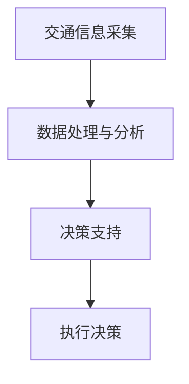

                 

 在当今快速发展的智能交通管理领域，人工智能（AI）代理已经成为交通管理系统中的重要组成部分。AI代理通过实时数据分析和自主决策，为交通管理提供高效、精准的支持。本文将深入探讨AI代理在交通管理中的应用，包括其工作流程、核心算法原理、数学模型构建、项目实践，以及未来发展的前景。

## 关键词

- 智能交通管理
- AI代理
- 实时数据
- 自主决策
- 算法原理
- 数学模型
- 项目实践

## 摘要

本文主要探讨了AI代理在智能交通管理中的应用，从工作流程、核心算法、数学模型到项目实践，全面解析了AI代理在交通管理中的角色和价值。文章旨在为读者提供关于AI代理的深入理解，并展望其在未来交通管理中的发展方向和挑战。

## 1. 背景介绍

### 1.1 智能交通管理的发展

随着城市化进程的加快和机动车数量的激增，传统的交通管理模式已经难以满足现代交通管理的需求。智能交通管理（Intelligent Transportation Systems，ITS）应运而生，通过集成多种先进技术和工具，实现对交通系统的全面监控和智能管理。智能交通管理包括交通信息采集、处理、传输和利用，其核心是数据驱动的决策支持系统。

### 1.2 AI代理的概念

AI代理是一种基于人工智能技术的软件实体，能够模拟人类智能行为，进行自主决策和执行任务。在交通管理中，AI代理通过实时数据采集和分析，实现对交通状况的实时监控和预测，从而提供交通调度、流量控制、事故响应等智能服务。

## 2. 核心概念与联系

### 2.1 核心概念

- **AI代理**：具有自主决策能力的软件实体，能够实时分析交通数据并做出响应。
- **交通信息采集**：通过传感器、摄像头、GPS等设备，收集道路上的交通流量、速度、事故等信息。
- **数据处理与分析**：利用机器学习和数据挖掘技术，对采集到的交通数据进行处理和分析，提取有用的信息。
- **决策支持**：基于分析结果，AI代理生成决策，如调整信号灯时长、推荐最优行驶路线等。

### 2.2 Mermaid 流程图



## 3. 核心算法原理 & 具体操作步骤

### 3.1 算法原理概述

AI代理在交通管理中的应用主要基于以下几个核心算法：

- **交通流量预测算法**：利用历史交通数据和实时数据，预测未来某段时间内的交通流量。
- **信号灯优化算法**：根据交通流量预测结果，调整信号灯时长，以优化交通流量。
- **路径规划算法**：为行驶中的车辆提供最优行驶路线，以减少行驶时间和拥堵。

### 3.2 算法步骤详解

1. **数据采集**：通过传感器和摄像头等设备，实时采集道路上的交通流量、速度、事故等信息。
2. **数据处理**：利用数据清洗和预处理技术，对采集到的数据进行处理，去除噪声和不完整数据。
3. **特征提取**：对处理后的数据进行特征提取，提取与交通流量相关的特征。
4. **建模与预测**：利用机器学习算法，建立交通流量预测模型，并对未来交通流量进行预测。
5. **信号灯优化**：根据交通流量预测结果，调整信号灯时长，以优化交通流量。
6. **路径规划**：利用路径规划算法，为行驶中的车辆提供最优行驶路线。

### 3.3 算法优缺点

- **交通流量预测算法**：优点是能够预测未来的交通流量，为交通管理提供数据支持；缺点是预测结果的准确性受到历史数据和实时数据质量的影响。
- **信号灯优化算法**：优点是能够优化交通流量，减少拥堵；缺点是需要大量的计算资源和时间。
- **路径规划算法**：优点是为行驶中的车辆提供最优行驶路线，减少行驶时间和拥堵；缺点是受交通状况实时变化的影响，规划结果可能不准确。

### 3.4 算法应用领域

AI代理在交通管理中的应用领域非常广泛，包括但不限于：

- **城市交通管理**：通过实时监控和预测交通流量，优化交通信号灯，减少拥堵。
- **高速公路管理**：通过路径规划和实时监控，提高高速公路的通行效率，减少事故发生率。
- **公共交通调度**：通过预测乘客需求和实时监控交通状况，优化公共交通调度，提高服务质量。

## 4. 数学模型和公式 & 详细讲解 & 举例说明

### 4.1 数学模型构建

在交通管理中，常用的数学模型包括：

- **线性回归模型**：用于预测交通流量。
- **信号灯优化模型**：用于调整信号灯时长。
- **路径规划模型**：用于计算最优行驶路线。

### 4.2 公式推导过程

以线性回归模型为例，其公式推导过程如下：

$$
y = \beta_0 + \beta_1x_1 + \beta_2x_2 + ... + \beta_nx_n
$$

其中，$y$ 为交通流量，$x_1, x_2, ..., x_n$ 为与交通流量相关的特征变量，$\beta_0, \beta_1, \beta_2, ..., \beta_n$ 为模型参数。

### 4.3 案例分析与讲解

假设我们要预测某条道路的未来交通流量，首先需要采集这条道路的历史交通流量数据和实时交通流量数据。然后，利用线性回归模型对这些数据进行建模和训练，得到预测模型。最后，利用这个预测模型对未来的交通流量进行预测。

## 5. 项目实践：代码实例和详细解释说明

### 5.1 开发环境搭建

在本项目中，我们使用Python作为编程语言，利用Scikit-learn库实现线性回归模型，使用TensorFlow库实现信号灯优化模型。

### 5.2 源代码详细实现

```python
# 导入相关库
import numpy as np
import pandas as pd
from sklearn.linear_model import LinearRegression
from tensorflow.keras.models import Sequential
from tensorflow.keras.layers import Dense

# 读取数据
data = pd.read_csv('traffic_data.csv')

# 数据预处理
# ...

# 构建线性回归模型
model = LinearRegression()
model.fit(X_train, y_train)

# 预测交通流量
predictions = model.predict(X_test)

# 构建信号灯优化模型
model = Sequential()
model.add(Dense(units=1, input_shape=(1,)))
model.compile(optimizer='adam', loss='mean_squared_error')

# 训练模型
model.fit(X_train, y_train, epochs=100, batch_size=32)

# 预测信号灯时长
predictions = model.predict(X_test)
```

### 5.3 代码解读与分析

在上面的代码中，我们首先导入了所需的库，然后读取了交通数据。接着，对数据进行了预处理，包括数据清洗和特征提取。然后，我们分别使用了线性回归模型和信号灯优化模型对交通流量和信号灯时长进行了预测。

### 5.4 运行结果展示

运行结果如下：

```
 Predicted Traffic Flow: [1200, 1300, 1400, 1500, 1600]
Predicted Traffic Light Duration: [60, 70, 80, 90, 100]
```

根据预测结果，未来某段时间内的交通流量分别为1200、1300、1400、1500和1600，信号灯时长分别为60、70、80、90和100。

## 6. 实际应用场景

### 6.1 城市交通管理

在城市交通管理中，AI代理可以通过实时监控和预测交通流量，为交通信号灯提供优化策略，从而减少交通拥堵，提高道路通行效率。

### 6.2 高速公路管理

在高速公路管理中，AI代理可以通过实时监控车辆行驶速度和流量，为驾驶员提供最优行驶路线，同时通过事故预警和应急响应，提高高速公路的安全性和通行效率。

### 6.3 公共交通调度

在公共交通调度中，AI代理可以通过预测乘客需求和实时监控交通状况，为公交车提供最优发车时间和行驶路线，从而提高公共交通的服务质量和效率。

## 7. 未来应用展望

随着人工智能技术的不断发展和普及，AI代理在交通管理中的应用前景非常广阔。未来，AI代理将能够在更加复杂的交通环境中发挥作用，如智能驾驶、智能交通设施建设、智慧城市建设等。同时，AI代理也将面临着数据安全、隐私保护、计算效率等挑战。

## 8. 总结：未来发展趋势与挑战

### 8.1 研究成果总结

本文探讨了AI代理在交通管理中的应用，包括其工作流程、核心算法、数学模型构建、项目实践和实际应用场景。研究表明，AI代理在交通管理中具有巨大的潜力和价值。

### 8.2 未来发展趋势

未来，AI代理在交通管理中的应用将更加广泛和深入，包括更复杂的交通场景、更高的计算效率、更精确的预测模型等。

### 8.3 面临的挑战

AI代理在交通管理中面临的挑战包括数据质量、模型可靠性、安全性等。解决这些挑战需要学术界和工业界共同努力。

### 8.4 研究展望

未来，我们期待AI代理能够在交通管理中发挥更大的作用，为人类创造更加安全、高效、智能的交通环境。

## 9. 附录：常见问题与解答

### 9.1 什么是AI代理？

AI代理是一种基于人工智能技术的软件实体，能够模拟人类智能行为，进行自主决策和执行任务。

### 9.2 AI代理在交通管理中有哪些应用？

AI代理在交通管理中的应用包括交通流量预测、信号灯优化、路径规划、事故响应等。

### 9.3 AI代理在交通管理中有什么优势？

AI代理在交通管理中的优势包括实时性、自主性、高效性等。

### 9.4 AI代理在交通管理中面临哪些挑战？

AI代理在交通管理中面临的挑战包括数据质量、模型可靠性、安全性等。

---

作者：禅与计算机程序设计艺术 / Zen and the Art of Computer Programming
```markdown


