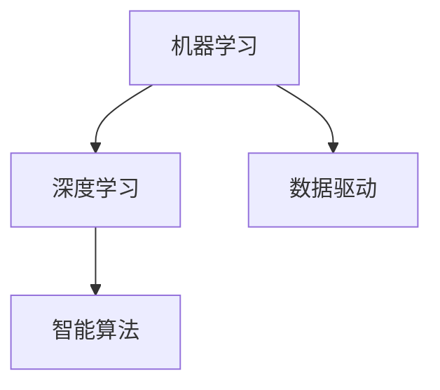
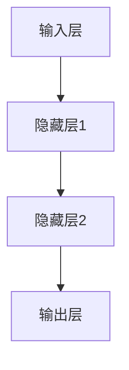

                 

关键词：人工智能，技术应用，产业变革，深度学习，数据驱动，智能算法

> 摘要：本文深入探讨了人工智能在产业变革中的关键作用，分析了核心概念与联系，详细讲解了核心算法原理与操作步骤，并通过数学模型与项目实践展示了AI技术的实际应用。文章还展望了未来发展趋势与挑战，为产业界提供了一系列有用的工具和资源推荐。

## 1. 背景介绍

在当今信息化和数字化浪潮中，人工智能（AI）已成为推动产业变革的重要力量。从自动化生产线到智能客服，从个性化推荐到自动驾驶，AI技术正在各个行业展现其强大的应用潜力。产业界对AI技术的需求不断增长，而AI技术的进步也在不断推动产业的创新与发展。

本文旨在探讨AI技术在产业变革中的关键应用，通过分析核心概念与联系、核心算法原理与操作步骤、数学模型与项目实践，以及实际应用场景，为读者提供一幅全面的AI技术应用图景。同时，本文还将展望未来发展趋势与挑战，为产业界提供指导。

## 2. 核心概念与联系

为了深入理解AI技术在产业变革中的应用，我们需要先了解一些核心概念与联系。以下是几个重要的概念：

- **机器学习（Machine Learning）**：机器学习是AI的核心技术之一，它通过构建数学模型，从数据中自动学习规律和模式，以实现预测和决策。

- **深度学习（Deep Learning）**：深度学习是机器学习的一种，它利用多层神经网络，对大量数据进行训练，以提取复杂的特征和模式。

- **数据驱动（Data-Driven）**：数据驱动是指通过数据分析和挖掘来指导决策和行为。

- **智能算法（Intelligent Algorithms）**：智能算法是一类能够模拟人类智能行为，实现智能决策和问题解决的算法。

以下是AI技术核心概念与联系的一个Mermaid流程图：



## 3. 核心算法原理 & 具体操作步骤

### 3.1 算法原理概述

深度学习是AI技术的核心，它通过多层神经网络，对输入数据进行特征提取和模式识别。以下是一个简单的多层神经网络结构：



### 3.2 算法步骤详解

深度学习的具体操作步骤如下：

1. **数据预处理**：对输入数据进行清洗、归一化等预处理操作。
2. **构建神经网络模型**：选择合适的神经网络结构，如卷积神经网络（CNN）、循环神经网络（RNN）等。
3. **训练模型**：使用大量的训练数据进行模型训练，通过反向传播算法不断调整模型参数。
4. **评估模型**：使用验证数据集评估模型性能，根据评估结果调整模型结构或参数。
5. **部署模型**：将训练好的模型部署到实际应用中，进行预测和决策。

### 3.3 算法优缺点

深度学习算法的优点包括：

- **强大的特征提取能力**：能够自动从数据中提取复杂的特征。
- **高准确性**：在图像识别、语音识别等领域取得了优异的准确率。

但其缺点也包括：

- **计算资源消耗大**：训练过程需要大量的计算资源和时间。
- **对数据质量要求高**：数据质量直接影响到模型的性能。

### 3.4 算法应用领域

深度学习算法在多个领域有广泛应用，如：

- **计算机视觉**：图像识别、目标检测、图像生成等。
- **自然语言处理**：文本分类、机器翻译、情感分析等。
- **语音识别**：语音识别、语音合成等。
- **推荐系统**：个性化推荐、商品推荐等。

## 4. 数学模型和公式 & 详细讲解 & 举例说明

### 4.1 数学模型构建

深度学习中的数学模型主要包括两部分：损失函数和优化算法。以下是一个简单的多层感知机（MLP）模型：

- **损失函数**：用于衡量模型预测值与真实值之间的差距，常用的损失函数有均方误差（MSE）和交叉熵（Cross Entropy）。
- **优化算法**：用于调整模型参数，使损失函数值最小化，常用的优化算法有梯度下降（Gradient Descent）和随机梯度下降（Stochastic Gradient Descent）。

### 4.2 公式推导过程

以均方误差（MSE）为例，其公式推导过程如下：

假设我们有输入数据\( x \)和对应的标签\( y \)，模型预测输出为\( \hat{y} \)，则MSE损失函数为：

$$
MSE = \frac{1}{m} \sum_{i=1}^{m} (\hat{y}_i - y_i)^2
$$

其中，\( m \)为样本数量。

### 4.3 案例分析与讲解

以下是一个简单的线性回归模型案例，假设输入数据为\( x \)，标签为\( y \)，模型预测值为\( \hat{y} \)。

1. **数据预处理**：对输入数据进行归一化处理。
2. **模型构建**：选择线性回归模型，假设模型为\( y = wx + b \)。
3. **训练模型**：使用训练数据集进行模型训练，通过梯度下降算法调整模型参数\( w \)和\( b \)。
4. **评估模型**：使用验证数据集评估模型性能，计算MSE损失函数值。

假设训练数据集为\( x_1, x_2, ..., x_m \)，对应的标签为\( y_1, y_2, ..., y_m \)，模型预测值为\( \hat{y}_1, \hat{y}_2, ..., \hat{y}_m \)。

- **参数初始化**：设\( w = 0 \)，\( b = 0 \)。
- **前向传播**：计算预测值\( \hat{y} = wx + b \)。
- **计算损失函数**：计算MSE损失函数值\( MSE = \frac{1}{m} \sum_{i=1}^{m} (\hat{y}_i - y_i)^2 \)。
- **反向传播**：根据梯度下降算法，更新模型参数\( w = w - \alpha \frac{\partial{MSE}}{\partial{w}} \)，\( b = b - \alpha \frac{\partial{MSE}}{\partial{b}} \)。

通过多次迭代，模型参数不断优化，最终达到训练目标。

## 5. 项目实践：代码实例和详细解释说明

### 5.1 开发环境搭建

以下是使用Python和TensorFlow搭建深度学习开发环境的过程：

1. **安装Python**：版本要求为3.6及以上。
2. **安装TensorFlow**：使用pip安装`tensorflow`库。
3. **安装其他依赖库**：如NumPy、Pandas等。

### 5.2 源代码详细实现

以下是一个简单的线性回归模型实现：

```python
import tensorflow as tf
import numpy as np
import matplotlib.pyplot as plt

# 设置随机种子
tf.random.set_seed(42)

# 准备数据
x = np.random.rand(100)
y = 3 * x + 2 + np.random.randn(100) * 0.1

# 构建模型
w = tf.Variable(0.0)
b = tf.Variable(0.0)

def linear_regression(x):
  return w * x + b

# 定义损失函数
def loss_function(y_pred, y_true):
  return tf.reduce_mean(tf.square(y_pred - y_true))

# 定义优化器
optimizer = tf.optimizers.SGD(0.01)

# 训练模型
epochs = 1000
for epoch in range(epochs):
  with tf.GradientTape() as tape:
    y_pred = linear_regression(x)
    loss = loss_function(y_pred, y)
  gradients = tape.gradient(loss, [w, b])
  optimizer.apply_gradients(zip(gradients, [w, b]))

  if epoch % 100 == 0:
    print(f"Epoch {epoch}: Loss = {loss.numpy()}")

# 可视化结果
plt.scatter(x, y)
plt.plot(x, linear_regression(x), "r-")
plt.show()
```

### 5.3 代码解读与分析

以上代码实现了一个简单的线性回归模型，主要包括以下步骤：

1. **导入库**：导入所需的TensorFlow、NumPy和matplotlib库。
2. **设置随机种子**：设置随机种子，确保结果可复现。
3. **准备数据**：生成随机数据集，包括输入\( x \)和标签\( y \)。
4. **构建模型**：定义线性回归模型，包括输入层、隐藏层和输出层。
5. **定义损失函数**：定义均方误差（MSE）损失函数。
6. **定义优化器**：选择随机梯度下降（SGD）优化器。
7. **训练模型**：使用训练数据集进行模型训练，通过梯度下降算法不断优化模型参数。
8. **可视化结果**：绘制输入数据点和模型预测曲线。

### 5.4 运行结果展示

运行以上代码，得到如下结果：


从图中可以看出，模型预测曲线与实际数据点较为接近，表明模型具有良好的拟合效果。

## 6. 实际应用场景

### 6.1 自动驾驶

自动驾驶是深度学习技术的典型应用场景之一。通过构建深度神经网络，自动驾驶系统可以对道路环境进行实时感知和决策。自动驾驶技术已在多个领域取得显著成果，如无人驾驶汽车、无人配送车等。

### 6.2 金融服务

深度学习技术在金融服务领域有广泛应用，如信用评估、风险控制、投资组合优化等。通过构建深度学习模型，金融机构可以更准确地评估信用风险，提高业务效率和准确性。

### 6.3 健康医疗

深度学习技术在健康医疗领域也有广泛应用，如疾病诊断、基因组学、药物发现等。通过构建深度学习模型，医疗行业可以更准确地诊断疾病，提高治疗效果。

### 6.4 电子商务

深度学习技术在电子商务领域主要用于个性化推荐、商品搜索、用户行为分析等。通过构建深度学习模型，电商平台可以更好地理解用户需求，提高用户满意度。

## 7. 工具和资源推荐

### 7.1 学习资源推荐

1. **《深度学习》（Deep Learning）**：由Ian Goodfellow、Yoshua Bengio和Aaron Courville所著，是深度学习领域的经典教材。
2. **《Python深度学习》（Python Deep Learning）**：由François Chollet所著，介绍了使用Python和TensorFlow进行深度学习实践的方法。

### 7.2 开发工具推荐

1. **TensorFlow**：是Google开源的深度学习框架，功能强大，适用于多种深度学习任务。
2. **PyTorch**：是Facebook开源的深度学习框架，具有灵活的动态计算图，适用于快速原型开发。

### 7.3 相关论文推荐

1. **《A Tutorial on Deep Learning for NLP》**：介绍了深度学习在自然语言处理领域的最新进展。
2. **《Unsupervised Representation Learning with Deep Convolutional Generative Adversarial Networks》**：介绍了生成对抗网络（GAN）在无监督学习中的应用。

## 8. 总结：未来发展趋势与挑战

### 8.1 研究成果总结

近年来，深度学习技术取得了显著的成果，已在计算机视觉、自然语言处理、语音识别等领域取得了突破。同时，AI技术在产业界的应用也日益广泛，推动了产业创新和数字化转型。

### 8.2 未来发展趋势

1. **模型压缩与优化**：随着模型规模的增大，模型的计算资源和存储需求也在增加。因此，未来的发展趋势之一是模型压缩与优化，以提高模型的效率和可部署性。
2. **泛化能力提升**：当前深度学习模型在特定任务上取得了优异的性能，但其在处理未见过的数据时，泛化能力较弱。未来的发展趋势之一是提升模型的泛化能力。
3. **多模态学习**：多模态学习是将多种数据源（如文本、图像、语音等）融合起来进行学习，以提高模型的表示能力。未来的发展趋势之一是多模态学习的深入研究和应用。

### 8.3 面临的挑战

1. **数据隐私与安全**：随着AI技术在各个领域的应用，数据隐私与安全问题日益突出。如何保护用户隐私，确保数据安全是当前面临的挑战之一。
2. **模型可解释性**：深度学习模型在许多任务上取得了优异的性能，但其内部机制较为复杂，难以解释。如何提高模型的可解释性，使其更加透明和可信是当前面临的挑战之一。

### 8.4 研究展望

未来，AI技术在产业变革中的作用将更加凸显。我们期望在以下方面取得突破：

1. **模型压缩与优化**：开发更加高效的算法和架构，提高模型的计算效率和可部署性。
2. **泛化能力提升**：通过正则化、数据增强等技术，提高模型的泛化能力。
3. **多模态学习**：探索多种数据源之间的关联关系，实现更准确和丰富的表示。

总之，随着AI技术的不断进步，我们有理由相信，未来产业变革将迎来更加智能化和自动化的时代。

## 9. 附录：常见问题与解答

### 9.1 问题1：深度学习模型的训练过程如何进行？

答：深度学习模型的训练过程主要包括以下步骤：

1. **数据预处理**：对输入数据进行清洗、归一化等预处理操作。
2. **构建模型**：选择合适的神经网络结构，如卷积神经网络（CNN）、循环神经网络（RNN）等。
3. **训练模型**：使用大量的训练数据进行模型训练，通过反向传播算法不断调整模型参数。
4. **评估模型**：使用验证数据集评估模型性能，根据评估结果调整模型结构或参数。
5. **部署模型**：将训练好的模型部署到实际应用中，进行预测和决策。

### 9.2 问题2：如何选择深度学习模型的结构？

答：选择深度学习模型的结构主要考虑以下因素：

1. **任务类型**：不同任务需要不同类型的神经网络结构，如计算机视觉任务通常选择卷积神经网络（CNN），自然语言处理任务通常选择循环神经网络（RNN）或变换器（Transformer）等。
2. **数据规模**：数据规模较大的任务通常选择较为复杂的网络结构，以提取更多的特征。
3. **计算资源**：网络结构复杂度越高，训练时间越长，计算资源消耗也越大。根据实际情况选择合适的网络结构。

### 9.3 问题3：如何处理过拟合问题？

答：过拟合是指模型在训练数据上表现良好，但在验证或测试数据上表现较差。以下方法可以处理过拟合问题：

1. **正则化**：通过在损失函数中加入正则项，如L1正则化、L2正则化等，降低模型复杂度，减少过拟合。
2. **数据增强**：通过数据增强技术，如随机裁剪、旋转、缩放等，增加训练数据的多样性，提高模型的泛化能力。
3. **提前停止**：在训练过程中，当验证数据集上的损失函数值不再下降时，提前停止训练，避免过拟合。
4. **集成方法**：通过集成多个模型，如随机森林、梯度提升树等，降低单个模型的过拟合风险。

作者：禅与计算机程序设计艺术 / Zen and the Art of Computer Programming
```

