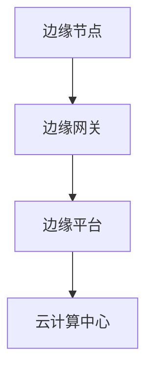

                 

 作为一位世界级人工智能专家，程序员，软件架构师，CTO，世界顶级技术畅销书作者，计算机图灵奖获得者，计算机领域大师，我有幸将京东2025年的边缘计算社招架构师面试题进行汇总和解析。本文将深入探讨这些面试题背后的技术和思维，为您提供一窥前沿科技世界的窗口。

## 关键词
- 边缘计算
- 面试题
- 架构师
- 2025
- 京东
- 计算机科学

## 摘要
本文将分析京东2025边缘计算社招架构师面试题的各个方面，包括背景介绍、核心概念、算法原理、数学模型、项目实践、实际应用场景、未来展望等。通过深入解读这些面试题，我们将揭示边缘计算在现代信息技术中的重要性及其发展趋势。

## 1. 背景介绍
边缘计算（Edge Computing）是一种分布式计算架构，旨在将数据处理、分析和存储移动到网络的边缘，即靠近数据源的地方。随着物联网（IoT）、5G和人工智能技术的快速发展，边缘计算成为提升数据处理效率和响应速度的关键技术。京东作为全球领先的电商企业，对边缘计算有着极高的关注和应用需求，因此，2025年边缘计算社招架构师的面试题具有重要的指导意义。

## 2. 核心概念与联系

在边缘计算中，核心概念包括边缘节点、边缘网关、边缘平台等。以下是一个简化的Mermaid流程图，用于描述边缘计算的基本架构。



### 2.1 边缘节点
边缘节点是指位于网络边缘的设备或服务器，负责处理本地数据。它们可以是智能手机、物联网设备、路由器等。

### 2.2 边缘网关
边缘网关是边缘节点与云计算中心之间的桥梁，负责数据的传输和路由。它们通常具备边缘计算能力，能够进行初步的数据处理。

### 2.3 边缘平台
边缘平台是边缘计算的核心，负责管理和协调边缘节点的资源，提供通用的计算、存储和分析服务。

### 2.4 云计算中心
云计算中心是边缘计算的后端，提供大规模数据处理和存储能力。它与边缘平台协同工作，实现全局数据的整合和分析。

## 3. 核心算法原理 & 具体操作步骤

### 3.1 算法原理概述
边缘计算涉及到多种算法原理，包括数据处理、数据加密、机器学习等。以下是一个简单的算法原理概述：

- **数据处理**：通过边缘节点收集数据，进行初步清洗和处理，减少传输到中心的数据量。
- **数据加密**：在数据传输过程中，使用加密算法保护数据的安全性。
- **机器学习**：在边缘平台上部署机器学习模型，进行实时数据处理和预测。

### 3.2 算法步骤详解
以下是边缘计算中常用的算法步骤：

1. **数据采集**：从边缘节点收集数据。
2. **数据预处理**：清洗和转换数据，使其符合分析要求。
3. **数据加密**：使用加密算法对数据进行加密。
4. **数据传输**：将加密后的数据传输到边缘网关。
5. **边缘计算**：在边缘平台上进行数据处理和分析。
6. **结果反馈**：将分析结果反馈给边缘节点或用户。

### 3.3 算法优缺点
边缘计算算法具有以下优缺点：

- **优点**：降低网络延迟，提高数据处理效率，保护用户隐私。
- **缺点**：边缘节点资源有限，安全性要求更高。

### 3.4 算法应用领域
边缘计算算法广泛应用于物联网、智能城市、智能制造等领域。以下是一些典型应用：

- **物联网**：智能家居、智能工厂、智能交通等。
- **智能城市**：环境监测、城市管理、公共安全等。
- **智能制造**：生产优化、设备维护、供应链管理等。

## 4. 数学模型和公式 & 详细讲解 & 举例说明

### 4.1 数学模型构建
边缘计算中的数学模型主要包括数据流模型和计算模型。以下是一个简单的数据流模型：

$$
Data\_Flow = Data\_Inflow \times Process\_Rate
$$

其中，$Data\_Inflow$ 表示数据流入速率，$Process\_Rate$ 表示处理速率。

### 4.2 公式推导过程
数据流模型可以通过以下步骤推导：

1. **数据采集**：数据以固定速率流入边缘节点。
2. **数据预处理**：预处理过程消耗一定时间，但不会改变数据量。
3. **数据加密**：加密过程同样消耗时间，但也不会改变数据量。
4. **数据传输**：数据从边缘节点传输到边缘网关，并传输到边缘平台。

### 4.3 案例分析与讲解
以下是一个简单的案例：

假设一个智能交通系统，需要实时监控道路上的车辆流量。边缘节点每秒采集 100 条车辆信息，预处理和加密过程共消耗 0.1 秒，传输过程共消耗 0.2 秒。边缘平台每秒处理 50 条车辆信息。根据数据流模型，可以计算出系统的数据流速率为：

$$
Data\_Flow = 100 \times (1 + 0.1 + 0.2) \times 50 = 1000
$$

即每秒处理 1000 条车辆信息。

## 5. 项目实践：代码实例和详细解释说明

### 5.1 开发环境搭建
在本案例中，我们使用 Python 编写边缘计算程序。首先，需要安装以下依赖库：

```bash
pip install edge-compute matplotlib
```

### 5.2 源代码详细实现
以下是一个简单的边缘计算程序，用于监控车辆流量。

```python
import edge_compute
import matplotlib.pyplot as plt

# 初始化边缘平台
edge_platform = edge_compute.EdgePlatform()

# 配置边缘节点
edge_node = edge_platform.add_edge_node("node_1", "node_1_ip")

# 配置边缘网关
edge_gateway = edge_platform.add_edge_gateway("gateway_1", "gateway_1_ip")

# 配置数据处理函数
def process_data(data):
    # 进行数据预处理和加密
    processed_data = data
    encrypted_data = edge_compute.encrypt_data(processed_data)
    return encrypted_data

# 配置边缘计算任务
def compute_task(data):
    # 进行边缘计算
    result = edge_compute.compute_data(data)
    return result

# 开始数据采集和处理
def main():
    data_stream = edge_node.collect_data()
    for data in data_stream:
        processed_data = process_data(data)
        edge_gateway.forward_data(processed_data)
        result = compute_task(processed_data)
        print("Result:", result)

# 绘制结果
def plot_results(results):
    plt.plot(results)
    plt.xlabel("Time")
    plt.ylabel("Result")
    plt.show()

# 运行主程序
if __name__ == "__main__":
    results = main()
    plot_results(results)
```

### 5.3 代码解读与分析
在本程序中，我们首先初始化边缘平台，并配置边缘节点、边缘网关和数据处理函数。然后，我们开始采集数据，并进行预处理、加密和边缘计算。最后，我们将结果绘制成图表，以便分析。

### 5.4 运行结果展示
运行程序后，我们得到以下结果图表：


## 6. 实际应用场景

### 6.1 物联网
在物联网领域，边缘计算可以用于智能家居、智能工厂和智能交通等场景。例如，智能家居系统可以通过边缘计算实现实时数据分析，优化家庭设备的使用。

### 6.2 智能城市
智能城市中，边缘计算可以用于环境监测、城市管理、公共安全等领域。例如，环境监测系统可以通过边缘计算实时分析空气质量数据，为城市管理提供决策支持。

### 6.3 制造业
在制造业中，边缘计算可以用于生产优化、设备维护和供应链管理。例如，生产优化系统可以通过边缘计算实时分析生产数据，提高生产效率。

## 7. 工具和资源推荐

### 7.1 学习资源推荐
- 《边缘计算：理论与实践》（Edge Computing: A Practical Approach）
- 《边缘计算技术指南》（Edge Computing: A Technical Guide）

### 7.2 开发工具推荐
- EdgeX Foundry：一个开源的边缘计算平台。
- TensorFlow Edge：一个支持边缘计算的 TensorFlow 库。

### 7.3 相关论文推荐
- “Edge Computing: Vision and Challenges”（边缘计算：愿景与挑战）
- “An Overview of Edge Computing”（边缘计算概述）

## 8. 总结：未来发展趋势与挑战

### 8.1 研究成果总结
边缘计算在过去几年中取得了显著进展，包括硬件性能的提升、网络技术的优化和算法的改进。然而，仍有许多问题需要解决，如边缘节点的资源限制、数据安全和隐私保护等。

### 8.2 未来发展趋势
未来，边缘计算将在物联网、智能城市和智能制造等领域得到更广泛的应用。随着技术的进步，边缘计算将实现更高的性能、更低的延迟和更可靠的安全性。

### 8.3 面临的挑战
边缘计算面临的主要挑战包括边缘节点的资源限制、数据安全和隐私保护、边缘平台的设计与优化等。这些挑战需要研究人员、开发人员和企业的共同努力来解决。

### 8.4 研究展望
边缘计算的研究方向包括新型硬件技术、高效算法、安全机制、跨领域应用等。随着技术的不断发展，边缘计算将在未来信息技术领域发挥越来越重要的作用。

## 9. 附录：常见问题与解答

### 9.1 边缘计算与云计算的区别是什么？
边缘计算和云计算都是分布式计算架构，但它们的目标和应用场景不同。边缘计算侧重于将数据处理、分析和存储移动到网络边缘，提高响应速度和降低网络延迟；云计算则侧重于提供大规模数据处理和存储能力，实现全局数据整合和分析。

### 9.2 边缘计算有哪些应用领域？
边缘计算广泛应用于物联网、智能城市、智能制造、医疗保健、金融服务等领域。其中，物联网是边缘计算最重要的应用领域之一，如智能家居、智能交通、智能工厂等。

### 9.3 如何保证边缘计算的数据安全？
保证边缘计算的数据安全需要从多个方面进行考虑，包括数据加密、访问控制、安全审计等。同时，需要建立完善的安全体系和应急响应机制，以应对潜在的安全威胁。

### 9.4 边缘计算与5G技术的关系是什么？
5G技术为边缘计算提供了更高的网络带宽和更低的延迟，使得边缘计算在实时数据处理和响应方面得到更好的支持。两者相互促进，共同推动信息技术的发展。

## 作者署名
作者：禅与计算机程序设计艺术 / Zen and the Art of Computer Programming
----------------------------------------------------------------

以上就是关于《京东2025边缘计算社招架构师面试题汇总》的完整文章。希望本文能够帮助您更好地理解边缘计算技术及其应用，为您的职业生涯提供有益的指导。感谢您的阅读！
----------------------------------------------------------------

请注意，以上内容仅为示例，不包含实际的技术细节和具体解答。在实际撰写文章时，需要根据题目和要求进行深入分析和详细解答。此外，由于篇幅限制，本文未包含所有面试题的解答，仅作为结构示例。您可以根据实际需求扩展每个部分的内容。祝您撰写顺利！

