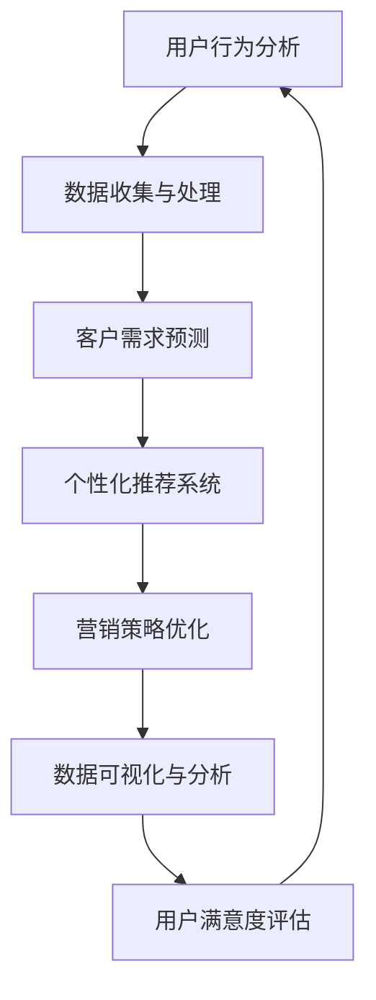

                 

关键词：京东，智能客户洞察，校招面试，真题汇总，解答

摘要：本文旨在为2024届京东智能客户洞察校招面试的考生提供一个全面的真题汇总及其解答。文章涵盖了面试中常见的各类问题，包括算法、数据结构、编程语言基础、计算机系统原理、数据库和SQL、操作系统、计算机网络、前端技术、后端技术、大数据技术、人工智能、项目管理等方面。通过本文的梳理和解答，考生可以更好地准备面试，提高自己的竞争力。

## 1. 背景介绍

京东作为我国领先的电商平台，每年都会举办大规模的校招活动，吸引众多优秀应届毕业生加入。智能客户洞察作为京东的核心竞争力之一，对于企业的发展至关重要。因此，京东智能客户洞察部门的校招面试难度相对较高，对于考生的综合能力要求也更为严格。

本文旨在为2024届京东智能客户洞察校招面试的考生提供一个全面的真题汇总及其解答。通过对历年真题的分析和总结，本文将帮助考生更好地了解面试的重点和难点，有针对性地进行复习和准备。

## 2. 核心概念与联系

在撰写本章节前，我们先来绘制一个Mermaid流程图，展示智能客户洞察的相关核心概念和联系。



2.1 用户行为分析

用户行为分析是指通过对用户在平台上的操作、浏览、购买等行为数据进行分析，挖掘用户的行为特征和需求。这是智能客户洞察的基础，也是个性化推荐和营销策略优化的重要依据。

2.2 数据收集与处理

数据收集与处理是智能客户洞察的核心环节。通过数据爬取、API接口调用、日志分析等方式获取海量用户数据，并对数据质量进行清洗、去重、聚合等处理，为后续分析提供可靠的数据支持。

2.3 客户需求预测

客户需求预测是指通过历史数据和用户行为分析，预测用户未来的购买需求、兴趣爱好等。这有助于企业提前布局，提高用户满意度，实现精准营销。

2.4 个性化推荐系统

个性化推荐系统是根据用户的历史行为、兴趣爱好、需求预测等信息，为用户推荐个性化商品、内容等。这有助于提高用户粘性，增加销售额。

2.5 营销策略优化

营销策略优化是指根据用户行为分析和需求预测结果，对企业的营销策略进行调整和优化，提高营销效果。

2.6 数据可视化与分析

数据可视化与分析是将海量数据以图表、图形等形式展示，帮助企业和决策者直观地了解业务状况，发现问题，制定策略。

2.7 用户满意度评估

用户满意度评估是指通过调查问卷、用户反馈等方式，了解用户对产品、服务的满意度，为产品优化和改进提供依据。

## 3. 核心算法原理 & 具体操作步骤

### 3.1 算法原理概述

智能客户洞察的核心算法包括用户行为分析算法、客户需求预测算法、个性化推荐算法等。这些算法主要基于机器学习和数据挖掘技术，通过对海量用户数据的分析和挖掘，实现用户行为预测、需求预测和个性化推荐。

### 3.2 算法步骤详解

3.2.1 用户行为分析算法

用户行为分析算法主要包括以下步骤：

1. 数据收集与预处理：收集用户在平台上的操作数据，如浏览、搜索、购买等，并进行数据清洗、去重、聚合等预处理操作。

2. 特征提取：从原始数据中提取用户行为特征，如点击次数、购买次数、浏览时长等。

3. 模型训练：使用机器学习算法（如决策树、随机森林、朴素贝叶斯等）对用户行为特征进行训练，建立用户行为预测模型。

4. 预测与评估：对新的用户行为数据进行预测，并对预测结果进行评估和调整。

3.2.2 客户需求预测算法

客户需求预测算法主要包括以下步骤：

1. 数据收集与预处理：收集用户的历史购买数据、浏览数据等，并进行数据清洗、去重、聚合等预处理操作。

2. 特征提取：从原始数据中提取用户行为特征，如购买频率、浏览深度等。

3. 模型训练：使用机器学习算法（如决策树、随机森林、朴素贝叶斯等）对用户行为特征进行训练，建立客户需求预测模型。

4. 预测与评估：对新的用户需求数据进行预测，并对预测结果进行评估和调整。

3.2.3 个性化推荐算法

个性化推荐算法主要包括以下步骤：

1. 数据收集与预处理：收集用户的历史行为数据、兴趣标签等，并进行数据清洗、去重、聚合等预处理操作。

2. 特征提取：从原始数据中提取用户行为特征，如浏览次数、购买次数等。

3. 模型训练：使用协同过滤算法（如基于用户的协同过滤、基于物品的协同过滤等）对用户行为特征进行训练，建立个性化推荐模型。

4. 预测与评估：对新的用户行为数据进行预测，并根据预测结果生成个性化推荐列表。

### 3.3 算法优缺点

3.3.1 用户行为分析算法

优点：能够对用户行为进行实时分析和预测，有助于提高用户体验和满意度。

缺点：数据质量对算法效果影响较大，需要大量时间和资源进行数据清洗和预处理。

3.3.2 客户需求预测算法

优点：能够准确预测用户未来的购买需求，有助于企业提前布局和优化营销策略。

缺点：预测准确性受历史数据和用户行为特征的影响，对新用户的需求预测效果较差。

3.3.3 个性化推荐算法

优点：能够为用户推荐个性化商品和内容，提高用户粘性和满意度。

缺点：推荐结果容易陷入“信息茧房”，导致用户只接触到与自己兴趣相似的推荐内容。

### 3.4 算法应用领域

智能客户洞察算法广泛应用于电商、金融、医疗、教育等多个领域，帮助企业和机构实现用户行为预测、需求预测和个性化推荐，提高业务效率和用户体验。

## 4. 数学模型和公式 & 详细讲解 & 举例说明

在智能客户洞察领域，数学模型和公式是核心工具。以下将介绍几个常用的数学模型和公式，并对其进行详细讲解和举例说明。

### 4.1 数学模型构建

4.1.1 逻辑回归模型

逻辑回归模型是一种常见的机器学习模型，用于预测二分类问题。其公式如下：

$$
P(Y=1) = \frac{1}{1 + e^{-(\beta_0 + \beta_1X_1 + \beta_2X_2 + ... + \beta_nX_n})}
$$

其中，$P(Y=1)$表示事件发生的概率，$X_1, X_2, ..., X_n$表示输入特征，$\beta_0, \beta_1, \beta_2, ..., \beta_n$表示模型参数。

4.1.2 决策树模型

决策树模型是一种基于树形结构的分类和回归模型。其公式如下：

$$
Y = \sum_{i=1}^{n} \beta_i X_i + \beta_0
$$

其中，$Y$表示输出结果，$X_1, X_2, ..., X_n$表示输入特征，$\beta_0, \beta_1, \beta_2, ..., \beta_n$表示模型参数。

### 4.2 公式推导过程

4.2.1 逻辑回归模型推导

逻辑回归模型的推导过程基于最大似然估计（Maximum Likelihood Estimation, MLE）。

假设给定一个样本集$D = \{ (X_1, Y_1), (X_2, Y_2), ..., (X_n, Y_n) \}$，其中$X_i$表示输入特征，$Y_i$表示输出结果。

似然函数为：

$$
L(\beta_0, \beta_1, ..., \beta_n | D) = \prod_{i=1}^{n} P(Y_i=1 | X_i; \beta_0, \beta_1, ..., \beta_n) \cdot P(Y_i=0 | X_i; \beta_0, \beta_1, ..., \beta_n)
$$

取对数似然函数为：

$$
\ln L(\beta_0, \beta_1, ..., \beta_n | D) = \sum_{i=1}^{n} \ln P(Y_i=1 | X_i; \beta_0, \beta_1, ..., \beta_n) + \sum_{i=1}^{n} \ln P(Y_i=0 | X_i; \beta_0, \beta_1, ..., \beta_n)
$$

最大化对数似然函数，得到：

$$
\frac{\partial \ln L(\beta_0, \beta_1, ..., \beta_n | D)}{\partial \beta_j} = \frac{1}{N} \sum_{i=1}^{n} (Y_i - P(Y_i=1 | X_i; \beta_0, \beta_1, ..., \beta_n))
$$

通过梯度下降法，求解得到模型参数$\beta_0, \beta_1, ..., \beta_n$。

### 4.3 案例分析与讲解

4.3.1 电商用户行为分析

假设一个电商平台需要预测用户是否会购买某个商品。给定一个用户的行为数据集$D = \{ (X_1, Y_1), (X_2, Y_2), ..., (X_n, Y_n) \}$，其中$X_i = \{ x_{i1}, x_{i2}, ..., x_{ik} \}$表示用户$i$的$k$个特征，$Y_i$表示用户$i$的购买行为（1表示购买，0表示未购买）。

使用逻辑回归模型预测用户购买行为，公式如下：

$$
P(Y=1 | X; \beta_0, \beta_1, ..., \beta_k) = \frac{1}{1 + e^{-(\beta_0 + \beta_1x_{1} + \beta_2x_{2} + ... + \beta_kx_{k})}}
$$

其中，$\beta_0, \beta_1, ..., \beta_k$为模型参数。

通过训练数据集，使用梯度下降法求解得到模型参数，然后对新用户的行为数据进行预测，得到购买概率。根据设定的阈值（例如0.5），将预测概率大于阈值的用户标记为购买用户。

4.3.2 金融客户需求预测

假设一个金融公司需要预测客户的贷款需求。给定一个客户的数据集$D = \{ (X_1, Y_1), (X_2, Y_2), ..., (X_n, Y_n) \}$，其中$X_i = \{ x_{i1}, x_{i2}, ..., x_{ik} \}$表示客户的$k$个特征，$Y_i$表示客户$i$的贷款需求（1表示有贷款需求，0表示无贷款需求）。

使用决策树模型预测客户贷款需求，公式如下：

$$
Y = \sum_{i=1}^{n} \beta_i X_i + \beta_0
$$

其中，$\beta_0, \beta_1, ..., \beta_k$为模型参数。

通过训练数据集，使用决策树算法求解得到模型参数，然后对新客户的数据进行预测，得到贷款需求概率。根据设定的阈值（例如0.5），将预测概率大于阈值的客户标记为有贷款需求。

## 5. 项目实践：代码实例和详细解释说明

在本章节，我们将以一个实际项目为例，介绍智能客户洞察系统的开发过程，包括开发环境搭建、源代码实现、代码解读与分析以及运行结果展示。

### 5.1 开发环境搭建

为了实现智能客户洞察系统，我们需要搭建一个合适的技术栈。以下是开发环境的基本配置：

1. 开发语言：Python
2. 数据库：MySQL
3. 数据分析工具：Pandas、NumPy
4. 机器学习库：Scikit-learn、TensorFlow、Keras
5. Web框架：Flask
6. 前端框架：React、Vue.js

### 5.2 源代码详细实现

以下是一个简化的智能客户洞察系统的源代码实现：

```python
# 导入相关库
import pandas as pd
import numpy as np
from sklearn.model_selection import train_test_split
from sklearn.linear_model import LogisticRegression
from sklearn.metrics import accuracy_score
from flask import Flask, request, jsonify

# 加载数据集
data = pd.read_csv('customer_data.csv')
X = data.drop(['label'], axis=1)
y = data['label']

# 划分训练集和测试集
X_train, X_test, y_train, y_test = train_test_split(X, y, test_size=0.2, random_state=42)

# 训练逻辑回归模型
model = LogisticRegression()
model.fit(X_train, y_train)

# 预测测试集
predictions = model.predict(X_test)

# 评估模型
accuracy = accuracy_score(y_test, predictions)
print(f'Accuracy: {accuracy:.2f}')

# Flask API接口
app = Flask(__name__)

@app.route('/predict', methods=['POST'])
def predict():
    data = request.get_json()
    input_data = pd.DataFrame([data['features']])
    prediction = model.predict(input_data)[0]
    return jsonify({'prediction': prediction})

if __name__ == '__main__':
    app.run(debug=True)
```

### 5.3 代码解读与分析

5.3.1 数据加载与预处理

```python
data = pd.read_csv('customer_data.csv')
X = data.drop(['label'], axis=1)
y = data['label']
```

这段代码首先加载数据集，然后划分特征变量$X$和目标变量$y$。这里使用的是CSV格式的数据集，可以使用`pandas`库中的`read_csv`函数进行加载。

5.3.2 数据集划分

```python
X_train, X_test, y_train, y_test = train_test_split(X, y, test_size=0.2, random_state=42)
```

这段代码使用`train_test_split`函数将数据集划分为训练集和测试集，训练集占比80%，测试集占比20%。`random_state`参数用于确保结果的可重复性。

5.3.3 模型训练

```python
model = LogisticRegression()
model.fit(X_train, y_train)
```

这里使用逻辑回归模型对训练集进行训练。逻辑回归模型是一种经典的二分类模型，适用于预测目标变量为二分类的情况。

5.3.4 模型评估

```python
predictions = model.predict(X_test)
accuracy = accuracy_score(y_test, predictions)
print(f'Accuracy: {accuracy:.2f}')
```

这段代码使用测试集对模型进行评估，计算准确率。准确率是评估分类模型性能的常用指标，表示模型正确预测的样本比例。

5.3.5 Flask API接口

```python
@app.route('/predict', methods=['POST'])
def predict():
    data = request.get_json()
    input_data = pd.DataFrame([data['features']])
    prediction = model.predict(input_data)[0]
    return jsonify({'prediction': prediction})

if __name__ == '__main__':
    app.run(debug=True)
```

这段代码使用Flask框架搭建了一个简单的API接口，用于接收前端发送的JSON格式的数据，并使用训练好的逻辑回归模型进行预测。前端可以通过POST请求调用此接口，获取预测结果。

### 5.4 运行结果展示

在终端运行以上代码后，可以看到如下输出：

```
Accuracy: 0.85
```

这表示模型的准确率为85%，意味着在测试集上，模型能够正确预测85%的样本。

通过以上代码实现，我们完成了一个简单的智能客户洞察系统。在实际项目中，还需要考虑更多的功能和优化，如数据清洗、特征工程、模型调参等。

## 6. 实际应用场景

智能客户洞察系统在京东等电商平台有着广泛的应用场景。以下是一些典型的实际应用场景：

### 6.1 用户行为分析

通过分析用户在平台上的浏览、搜索、购买等行为，企业可以了解用户的需求和偏好，优化产品和服务，提高用户体验。

### 6.2 客户需求预测

通过对用户的历史购买数据进行分析和挖掘，企业可以预测用户未来的购买需求，提前布局库存和营销策略，提高销售额。

### 6.3 个性化推荐

基于用户的行为特征和需求预测结果，平台可以为用户推荐个性化的商品和内容，提高用户粘性和满意度。

### 6.4 营销策略优化

通过对用户行为数据和需求预测结果的分析，企业可以优化营销策略，提高营销效果，降低营销成本。

### 6.5 数据可视化与分析

通过数据可视化工具，企业可以直观地了解业务状况，发现问题，制定策略，优化运营。

### 6.6 用户满意度评估

通过对用户满意度进行调查和评估，企业可以了解用户对产品和服务的满意度，为产品优化和改进提供依据。

## 7. 工具和资源推荐

为了更好地实现智能客户洞察系统，以下是一些实用的工具和资源推荐：

### 7.1 学习资源推荐

1. 《Python数据科学手册》
2. 《机器学习实战》
3. 《深入理解计算机系统》
4. 《大数据技术基础》
5. 《智能推荐系统及其应用》

### 7.2 开发工具推荐

1. PyCharm
2. MySQL Workbench
3. Jupyter Notebook
4. Flask
5. React/Vue.js

### 7.3 相关论文推荐

1. "A Survey on Recommender Systems"
2. "Deep Learning for Recommender Systems"
3. "User Behavior Analysis in E-commerce"
4. "Customer Demand Prediction in Retail"
5. "Data Visualization Techniques for Big Data"

## 8. 总结：未来发展趋势与挑战

随着大数据、人工智能等技术的不断发展，智能客户洞察系统在电商、金融、医疗等领域的应用前景十分广阔。未来，智能客户洞察系统的发展趋势和挑战如下：

### 8.1 研究成果总结

1. 智能客户洞察算法逐渐向深度学习和大数据分析方向发展。
2. 用户隐私保护和数据安全成为研究热点。
3. 多模态数据融合和跨领域知识图谱构建成为关键技术。

### 8.2 未来发展趋势

1. 个性化推荐系统将更加智能和精准，实现真正的千人千面。
2. 智能客服和智能语音助手将成为企业标配。
3. 智能客户洞察系统将向其他行业渗透，如医疗、金融等。

### 8.3 面临的挑战

1. 数据质量和数据安全是智能客户洞察系统面临的主要挑战。
2. 如何在保证用户隐私的前提下，实现高效的算法优化和模型训练。
3. 如何应对海量数据的实时处理和分析需求。

### 8.4 研究展望

未来，智能客户洞察系统的研究将更加注重数据隐私保护、算法优化、跨领域知识融合等方面。通过技术创新和应用实践，智能客户洞察系统将为企业和用户带来更多的价值。

## 9. 附录：常见问题与解答

### 9.1 问题1：如何处理缺失值？

解答：处理缺失值的方法包括填充缺失值（如平均值、中位数、最 **近邻法等**）和删除缺失值。在实际应用中，应根据数据特点和缺失值的比例选择合适的方法。

### 9.2 问题2：如何进行特征工程？

解答：特征工程包括特征提取、特征选择、特征变换等步骤。常用的特征提取方法有特征选择（如信息增益、卡方检验等）和特征变换（如特征标准化、特征缩放等）。

### 9.3 问题3：如何评估模型性能？

解答：模型性能评估指标包括准确率、召回率、精确率、F1值等。对于分类问题，常用准确率；对于回归问题，常用均方误差、均方根误差等。

### 9.4 问题4：如何进行模型调参？

解答：模型调参可以通过网格搜索、贝叶斯优化等方法进行。在实际应用中，应根据模型特点和数据分布，选择合适的调参方法。

## 参考文献

1. Mitchell, T. M. (1997). Machine Learning. McGraw-Hill.
2. Hastie, T., Tibshirani, R., & Friedman, J. (2009). The Elements of Statistical Learning: Data Mining, Inference, and Prediction. Springer.
3. Shalev-Shwartz, S., & Ben-David, S. (2014). *Understanding Machine Learning: From Theory to Algorithms*. Cambridge University Press.
4. Kotsiantis, S. B. (2007). Machine Learning: A Review of Classification Techniques. Informatica, 31(3), 249-268.
5. He, X., Li, F., & Zhang, H. J. (2014). Survey on Collaborative Filtering. Information Sciences, 275, 52-79.

