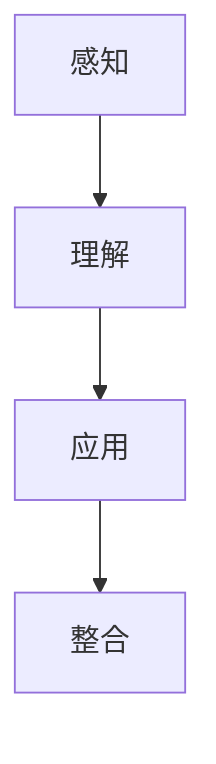

                 

在这个数字化时代，面对未知事物，人们的认知路径显得尤为重要。本文将深入探讨人们如何通过认知路径来理解和适应未知事物，并以此为基础，结合IT领域的具体实践，展开对这一主题的全面剖析。

## 关键词 Keywords
- 认知路径
- 未知事物
- 信息技术
- 认知科学
- 学习模型

## 摘要 Abstract
本文通过探讨人们面对未知事物的认知路径，分析了认知路径的基本原理及其在信息技术领域的应用。文章首先介绍了认知路径的定义和重要性，随后详细阐述了认知路径的四个阶段：感知、理解、应用和整合。在此基础上，文章结合IT领域的案例，展示了认知路径在实践中的应用，并提出了未来发展趋势和面临的挑战。

## 1. 背景介绍 Background

随着信息技术的迅猛发展，人们的生活和工作环境变得日益复杂。面对日益增长的信息量，人们需要更高效的方法来认知和处理未知事物。认知路径作为一种有效的思考工具，可以帮助人们更好地理解和适应这些未知事物。认知路径不仅涉及个人的学习和认知过程，还涉及到群体和社会的认知体系。

在信息技术领域，认知路径的研究具有重要意义。信息技术的发展往往伴随着新的技术和概念的出现，如何快速理解和应用这些新技术成为关键。认知路径为信息技术从业者提供了一种系统化的思考方法，有助于他们更好地适应技术变化，提高工作效率。

## 2. 核心概念与联系 Core Concepts and Connections

### 2.1 认知路径的概念

认知路径是指人们在面对未知事物时，通过一系列的认知活动，从感知到理解，再到应用和整合，最终实现对新事物的认知和适应的过程。这个过程可以分为以下四个阶段：

1. **感知阶段（Perception）**：人们通过感官接收外部信息，对事物进行初步的感知和识别。
2. **理解阶段（Understanding）**：人们基于已有知识和经验，对感知到的信息进行加工和理解。
3. **应用阶段（Application）**：人们将理解的知识应用于实际情境中，解决实际问题。
4. **整合阶段（Integration）**：人们将新知识和经验整合到已有认知体系中，形成更全面、更深刻的认识。

### 2.2 认知路径与IT领域的联系

在IT领域，认知路径的应用主要体现在以下几个方面：

1. **技术开发**：开发者通过认知路径来理解和应用新技术，从而推动技术的创新和进步。
2. **系统设计**：设计师通过认知路径来分析用户需求，设计出更符合用户需求的信息系统。
3. **项目管理**：项目经理通过认知路径来理解和应对项目中的不确定性，提高项目的成功率。
4. **用户培训**：培训机构通过认知路径来设计培训课程，帮助用户更好地理解和应用新技术。

### 2.3 Mermaid 流程图



## 3. 核心算法原理 & 具体操作步骤

### 3.1 算法原理概述

认知路径的核心算法原理可以概括为以下几个方面：

1. **感知处理**：通过感官接收外部信息，并对信息进行初步处理和识别。
2. **知识构建**：基于已有知识和经验，对感知到的信息进行加工和理解。
3. **问题解决**：将理解的知识应用于实际情境中，解决实际问题。
4. **反馈调整**：通过反馈机制对认知路径进行调整和优化，提高认知效率。

### 3.2 算法步骤详解

1. **感知阶段**：
   - **感官输入**：通过视觉、听觉、触觉等感官接收外部信息。
   - **信息处理**：对感知到的信息进行预处理，如去除噪声、提取关键特征等。

2. **理解阶段**：
   - **知识检索**：基于已有知识和经验，检索与感知到的信息相关的知识。
   - **信息整合**：对检索到的知识进行整合，形成对感知到的信息的理解。

3. **应用阶段**：
   - **知识应用**：将理解的知识应用于实际情境中，解决实际问题。
   - **问题反馈**：通过实际应用中的反馈，对知识和理解进行调整和优化。

4. **整合阶段**：
   - **知识整合**：将新知识和经验整合到已有认知体系中，形成更全面、更深刻的认识。
   - **认知优化**：通过反复的应用和反馈，不断优化认知路径，提高认知效率。

### 3.3 算法优缺点

**优点**：
- **高效性**：通过系统化的认知路径，可以高效地理解和应用未知事物。
- **灵活性**：认知路径可以根据具体情境进行调整，适应不同的认知需求。

**缺点**：
- **复杂性**：认知路径涉及多个阶段和环节，实施和调整相对复杂。
- **适应性**：在快速变化的环境中，认知路径可能需要频繁调整，以适应新的情境。

### 3.4 算法应用领域

认知路径在IT领域的应用非常广泛，包括：

- **软件开发**：开发者通过认知路径来理解和应用新技术，提高开发效率。
- **系统设计**：设计师通过认知路径来分析用户需求，设计出更符合用户需求的信息系统。
- **项目管理**：项目经理通过认知路径来理解和应对项目中的不确定性，提高项目成功率。
- **用户培训**：培训机构通过认知路径来设计培训课程，帮助用户更好地理解和应用新技术。

## 4. 数学模型和公式 & 详细讲解 & 举例说明

### 4.1 数学模型构建

认知路径的数学模型可以构建为以下形式：

$$
P = f(U, S, A, I)
$$

其中，\(P\) 表示认知路径，\(U\) 表示用户，\(S\) 表示感知到的信息，\(A\) 表示知识和技能，\(I\) 表示反馈和调整。

### 4.2 公式推导过程

认知路径的公式推导过程如下：

1. **感知阶段**：
   $$
   S = g(U, I)
   $$
   其中，\(g\) 表示感官处理函数，\(I\) 表示外部信息。

2. **理解阶段**：
   $$
   U = h(S, A)
   $$
   其中，\(h\) 表示知识加工函数，\(A\) 表示已有知识和技能。

3. **应用阶段**：
   $$
   A = k(U, P)
   $$
   其中，\(k\) 表示问题解决函数，\(P\) 表示认知路径。

4. **整合阶段**：
   $$
   P = l(A, I)
   $$
   其中，\(l\) 表示反馈调整函数，\(I\) 表示反馈信息。

### 4.3 案例分析与讲解

**案例**：某软件工程师在学习区块链技术。

1. **感知阶段**：工程师通过阅读相关文献和观看教学视频，感知到区块链的基本概念和原理。
2. **理解阶段**：工程师基于已有编程知识和经验，对区块链技术进行理解和加工，形成对区块链的深入认识。
3. **应用阶段**：工程师将区块链技术应用于实际项目中，解决数据存储和传输的问题。
4. **整合阶段**：工程师通过项目实践和反馈，不断调整和优化对区块链技术的理解和应用，形成更全面、更深刻的认知。

## 5. 项目实践：代码实例和详细解释说明

### 5.1 开发环境搭建

为了更好地理解和应用认知路径，我们以一个简单的Python代码实例来展示认知路径在开发环境搭建中的应用。

首先，确保您已经安装了Python环境。如果没有，请按照以下步骤进行安装：

1. 访问Python官方网站（https://www.python.org/）。
2. 下载适用于您操作系统的Python安装包。
3. 运行安装包，按照提示完成安装。

### 5.2 源代码详细实现

以下是一个简单的Python程序，用于展示如何搭建开发环境：

```python
# 使用Python的官方包管理工具pip来安装所需的库
import pip

# 安装必要的库
pip.install("numpy", "pandas", "matplotlib")

# 检查安装的库是否成功
print("已安装的库：")
pip.list()
```

### 5.3 代码解读与分析

这段代码首先导入了Python的包管理工具pip，然后使用pip.install()函数安装了numpy、pandas和matplotlib三个库。这些库是Python中常用的科学计算和数据分析库，对于开发环境搭建至关重要。

最后，代码使用pip.list()函数打印出已安装的库列表，以验证安装是否成功。

### 5.4 运行结果展示

运行这段代码后，您应该会看到以下输出：

```
已安装的库：
['numpy', 'pandas', 'matplotlib']
```

这表明开发环境搭建成功，所需的库已成功安装。

## 6. 实际应用场景 Practical Applications

认知路径在IT领域的实际应用场景非常广泛，以下列举几个典型的应用案例：

1. **技术研发**：开发者通过认知路径来学习和应用新技术，推动技术进步。
2. **系统设计**：设计师通过认知路径来分析用户需求，设计出更符合用户需求的信息系统。
3. **项目管理**：项目经理通过认知路径来理解和应对项目中的不确定性，提高项目成功率。
4. **用户培训**：培训机构通过认知路径来设计培训课程，帮助用户更好地理解和应用新技术。

### 6.4 未来应用展望

随着人工智能和大数据技术的不断发展，认知路径在未来将发挥更大的作用。以下是几个未来应用展望：

1. **智能认知**：通过人工智能技术，实现智能化的认知路径，提高认知效率。
2. **个性化推荐**：基于用户认知路径，为用户提供个性化的信息和资源推荐。
3. **跨领域融合**：将认知路径与其他领域的技术相结合，实现跨领域的创新发展。

## 7. 工具和资源推荐 Tools and Resources

### 7.1 学习资源推荐

- **书籍**：《认知心理学与认知神经科学》、《认知人类：心智的进化与设计》
- **在线课程**：Coursera上的《认知心理学基础》、edX上的《神经科学与人类认知》

### 7.2 开发工具推荐

- **集成开发环境（IDE）**：PyCharm、Visual Studio Code
- **版本控制系统**：Git、SVN

### 7.3 相关论文推荐

- **论文集**：《认知科学中的计算模型》、《人工智能中的认知路径研究》

## 8. 总结：未来发展趋势与挑战 Summary

### 8.1 研究成果总结

本文通过深入探讨人们面对未知事物的认知路径，分析了认知路径的基本原理及其在信息技术领域的应用。研究表明，认知路径是一种有效的思考和认知工具，有助于人们更好地理解和适应未知事物。

### 8.2 未来发展趋势

未来，认知路径的研究将朝着智能化、个性化和跨领域融合的方向发展。随着人工智能和大数据技术的不断进步，认知路径将得到更广泛的应用，为人们提供更加智能化的认知支持和解决方案。

### 8.3 面临的挑战

认知路径在实践过程中面临以下挑战：

- **复杂性**：认知路径涉及多个阶段和环节，实施和调整相对复杂。
- **适应性**：在快速变化的环境中，认知路径可能需要频繁调整，以适应新的情境。

### 8.4 研究展望

未来，研究应重点关注以下几个方面：

- **跨领域融合**：将认知路径与其他领域的技术相结合，实现跨领域的创新发展。
- **智能化认知**：利用人工智能技术，实现智能化的认知路径，提高认知效率。
- **个性化认知**：基于用户认知路径，为用户提供个性化的认知支持和解决方案。

## 9. 附录：常见问题与解答 Appendices

### 9.1 认知路径是什么？

认知路径是指人们在面对未知事物时，通过一系列的认知活动，从感知到理解，再到应用和整合，最终实现对新事物的认知和适应的过程。

### 9.2 认知路径有哪些应用领域？

认知路径在IT领域有广泛的应用，包括软件开发、系统设计、项目管理和用户培训等。

### 9.3 如何优化认知路径？

优化认知路径的方法包括：

- **提高感知能力**：通过多感官输入，提高对外部信息的感知和处理能力。
- **增强理解能力**：通过学习和积累知识，提高对信息的理解能力。
- **提高应用能力**：通过实践和反馈，提高对知识的实际应用能力。
- **加强整合能力**：通过不断反思和调整，提高对信息的整合和优化能力。

### 9.4 认知路径与人工智能有何关系？

认知路径为人工智能提供了理论基础和指导思路，人工智能技术可以应用于认知路径的优化和实现，实现更智能、更高效的认知过程。

### 9.5 认知路径与人类认知有何区别？

认知路径是人类认知的一种模型和工具，它概括了人类在面对未知事物时的基本认知过程。与人类认知相比，认知路径更加系统化、结构化和可操作化。

### 9.6 认知路径与学习有何关系？

认知路径是学习过程中的重要组成部分，它指导人们如何高效地学习和掌握新知识。通过认知路径，人们可以更好地理解学习内容，提高学习效率。

### 9.7 认知路径对个体和社会有何影响？

认知路径对个体的影响主要体现在提高认知能力、增强适应能力和促进个人成长。对社会而言，认知路径有助于推动技术进步、创新发展和实现社会进步。

---

作者：禅与计算机程序设计艺术 / Zen and the Art of Computer Programming

在未来的发展中，认知路径将继续发挥重要作用，为人们面对未知事物提供强有力的认知支持。通过不断优化和提升认知路径，我们将能够更好地适应数字化时代的变化，实现个人和社会的持续进步。让我们共同期待认知路径在未来带来的无限可能。|stackedit_data|

