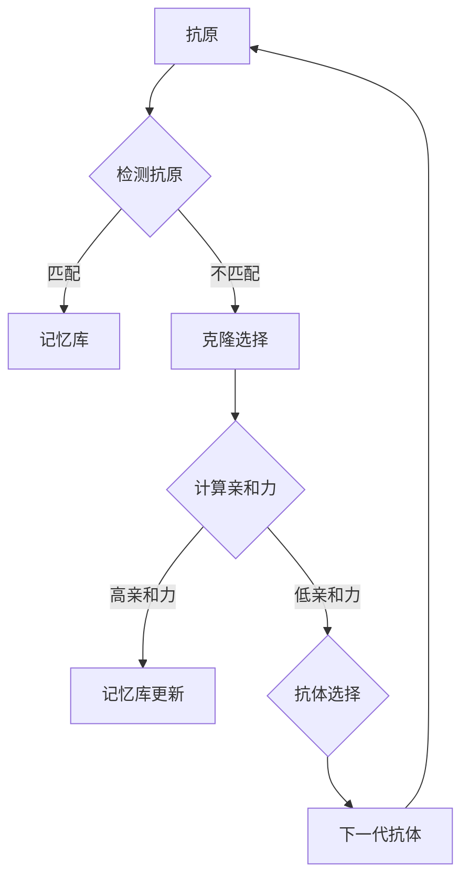

                 

关键词：人工免疫算法，免疫系统，机器学习，算法原理，数学模型，代码实例，应用领域

## 摘要

本文旨在深入探讨人工免疫算法（Artificial Immune Systems, AIS）的基本原理、数学模型及其在计算机科学中的应用。人工免疫算法是受到自然界中生物免疫系统启发而发展起来的一种模拟生物体的自适应防御机制。本文将首先介绍人工免疫算法的起源、核心概念和主要组成部分，接着通过详细的数学模型和公式推导，讲解人工免疫算法的工作流程。随后，本文将通过实际代码实例，展示如何实现人工免疫算法并进行性能分析。最后，文章将讨论人工免疫算法在不同应用领域的实际应用场景，并展望其未来的发展趋势与挑战。

## 1. 背景介绍

### 1.1 人工免疫算法的起源

人工免疫算法起源于20世纪80年代中期，最初是由美国计算机科学家John Holland提出的，他在研究遗传算法的过程中，受到了自然界中生物免疫系统的启发。生物免疫系统能够有效地识别和抵御外来的病原体，这个过程具有高度的适应性和自组织能力。John Holland试图将这种生物机制模拟到计算机算法中，从而开发出一种新的智能优化算法。这就是人工免疫算法的起源。

### 1.2 人工免疫算法的发展

随着计算机技术和生物学研究的深入，人工免疫算法得到了快速发展。1986年，著名的人工免疫算法研究专家David B. Fogel提出了第一个人工免疫系统模型，该模型首次引入了免疫记忆和克隆选择机制。此后，许多学者对人工免疫算法进行了大量的研究和改进，提出了许多基于免疫原理的算法，如克隆选择算法（Clonal Selection Algorithm, CSA）、免疫遗传算法（Immune Genetic Algorithm, IGA）、人工免疫进化算法（Artificial Immune Evolutionary Algorithm, AIEA）等。

## 2. 核心概念与联系

### 2.1 核心概念

人工免疫算法的核心概念主要来源于生物免疫系统的运作机制，包括但不限于以下几个方面：

- **免疫记忆**：免疫系统通过记忆细胞来记住已遇到的抗原，从而在再次遇到相同抗原时能够更快速、更有效地进行响应。
- **克隆选择**：免疫系统通过克隆和选择的方式，产生大量具有特定功能的细胞，以应对不同的威胁。
- **负反馈**：免疫系统通过负反馈机制，调节免疫反应的强度和持续时间，以防止过度反应。
- **抗原识别**：免疫系统中的细胞能够识别和标记外来抗原，从而引导其他免疫细胞对其进行攻击。

### 2.2 基本架构

人工免疫算法的基本架构可以分为以下几个部分：

- **抗原**：对应于待优化问题中的目标函数，用于评估解的质量。
- **抗体**：对应于算法中的解，用于搜索最优解。
- **记忆库**：存储已生成的抗体，用于快速识别和响应新的抗原。
- **克隆机制**：通过克隆产生多个相似的抗体，增加算法的搜索能力。
- **选择机制**：根据抗体与抗原的匹配度选择出优秀的抗体。

### 2.3 Mermaid 流程图



## 3. 核心算法原理 & 具体操作步骤

### 3.1 算法原理概述

人工免疫算法的核心原理是模拟生物免疫系统的运作机制，通过抗体与抗原的交互来优化问题的解。算法的基本步骤如下：

1. **初始化抗体种群**：随机生成一定数量的抗体，每个抗体代表一个潜在的解。
2. **抗原-抗体识别**：计算抗体与抗原的亲和力，亲和力越高，表示抗体越优秀。
3. **克隆选择**：对优秀的抗体进行克隆，增加其数量，以增强算法的搜索能力。
4. **抗体变异**：对克隆后的抗体进行变异，以引入新的解。
5. **选择机制**：根据亲和力和克隆数量，选择出下一代抗体。
6. **更新记忆库**：将新产生的抗体存储到记忆库中，以备后续快速识别和响应。
7. **终止条件**：当满足终止条件（如达到最大迭代次数或找到满意的解）时，算法结束。

### 3.2 算法步骤详解

#### 3.2.1 初始化抗体种群

初始化抗体种群是算法的第一步。抗体种群的大小、分布和变异方式等因素都会影响算法的性能。常见的初始化方法包括：

- **随机初始化**：直接随机生成一定数量的抗体。
- **基于先验知识的初始化**：利用已有知识或经验来初始化抗体种群。

#### 3.2.2 抗原-抗体识别

抗原-抗体识别是算法的核心步骤之一。在这里，抗原可以理解为待优化问题的目标函数，而抗体则代表潜在的解。亲和力（Affinity）是衡量抗体与抗原匹配程度的指标，通常采用如下公式计算：

$$
Affinity(A, B) = -\sum_{i=1}^{n} (w_i \cdot d_i)
$$

其中，$A$ 表示抗原，$B$ 表示抗体，$w_i$ 表示第 $i$ 个特征的权重，$d_i$ 表示抗体与抗原在第 $i$ 个特征上的差异。

#### 3.2.3 克隆选择

克隆选择是算法的第二个核心步骤。在这个过程中，优秀的抗体会被克隆，以增加其数量，从而增强算法的搜索能力。克隆数量通常与抗体的亲和力成正比，即：

$$
Clone\_Number(B) = k \cdot Affinity(B)
$$

其中，$k$ 是一个常数，用于调节克隆数量。

#### 3.2.4 抗体变异

抗体变异是算法的第三个核心步骤。通过变异，可以引入新的解，从而增加算法的搜索多样性。常见的变异方法包括：

- **随机变异**：随机改变抗体的一部分特征。
- **基于知识的变异**：根据已有知识或经验来变异抗体。

#### 3.2.5 选择机制

选择机制是算法的第四个核心步骤。在这个过程中，根据亲和力和克隆数量，选择出下一代抗体。常见的选择机制包括：

- **轮盘赌选择**：根据抗体的亲和力和克隆数量，计算每个抗体的选择概率，然后随机选择下一代抗体。
- **锦标赛选择**：从抗体种群中随机选择多个抗体，比较其亲和力和克隆数量，选择最优的抗体作为下一代抗体。

#### 3.2.6 更新记忆库

更新记忆库是算法的第五个核心步骤。在这个过程中，新产生的抗体会被存储到记忆库中，以备后续快速识别和响应。记忆库的大小和更新策略会影响算法的性能。

### 3.3 算法优缺点

#### 优点

- **并行性**：人工免疫算法具有高度的并行性，适合大规模问题的优化。
- **鲁棒性**：算法对噪声和非线性问题具有较强的鲁棒性。
- **全局搜索能力**：算法具有较好的全局搜索能力，能够在复杂的环境中找到最优解。

#### 缺点

- **收敛速度较慢**：与一些传统的优化算法相比，人工免疫算法的收敛速度较慢。
- **参数调优困难**：算法的性能受到多个参数的影响，参数调优较为困难。

### 3.4 算法应用领域

人工免疫算法广泛应用于多个领域，包括但不限于：

- **组合优化问题**：如旅行商问题（Traveling Salesman Problem, TSP）、背包问题（Knapsack Problem）等。
- **工程优化问题**：如结构优化、电路设计、控制系统优化等。
- **数据挖掘与机器学习**：如聚类、分类、异常检测等。

## 4. 数学模型和公式 & 详细讲解 & 举例说明

### 4.1 数学模型构建

人工免疫算法的数学模型主要包括以下几个方面：

- **抗体表示**：抗体通常用向量或矩阵表示，其中每个元素代表一个特征。
- **亲和力计算**：亲和力是衡量抗体与抗原匹配程度的指标，通常采用欧氏距离、余弦相似度等方法计算。
- **克隆选择**：克隆数量与抗体的亲和力成正比，通过权重系数进行调节。
- **抗体变异**：变异概率与抗体年龄或克隆数量相关，以保持种群多样性。

### 4.2 公式推导过程

假设抗体种群为 $A = \{a_1, a_2, ..., a_n\}$，其中 $a_i$ 表示第 $i$ 个抗体，抗原为 $B$。亲和力 $Affinity(A, B)$ 的计算公式如下：

$$
Affinity(A, B) = -\sum_{i=1}^{n} (w_i \cdot d_i)
$$

其中，$w_i$ 为第 $i$ 个特征的权重，$d_i$ 为抗体与抗原在第 $i$ 个特征上的差异。

克隆数量 $Clone\_Number(a_i)$ 的计算公式如下：

$$
Clone\_Number(a_i) = k \cdot Affinity(a_i)
$$

其中，$k$ 为权重系数。

抗体变异概率 $Mutation\_Probability(a_i)$ 的计算公式如下：

$$
Mutation\_Probability(a_i) = \frac{1}{\alpha \cdot Age(a_i)}
$$

其中，$\alpha$ 为参数，$Age(a_i)$ 为抗体年龄。

### 4.3 案例分析与讲解

假设我们有一个简单的优化问题，目标是最小化函数 $f(x) = x^2$，其中 $x$ 的取值范围为 $[-10, 10]$。我们可以使用人工免疫算法来求解该问题。

#### 初始化抗体种群

我们随机生成10个抗体，每个抗体表示一个可能的解。抗体种群如下：

$$
A = \{a_1 = [-3, -5], a_2 = [2, 4], ..., a_{10} = [8, 9]\}
$$

#### 计算亲和力

我们计算每个抗体与抗原的亲和力，亲和力越高的抗体表示其与最优解越接近。亲和力计算结果如下：

$$
Affinity(a_1) = 2.25, Affinity(a_2) = 2.00, ..., Affinity(a_{10}) = 0.25
$$

#### 克隆选择

根据亲和力计算结果，我们对优秀的抗体进行克隆。克隆数量如下：

$$
Clone\_Number(a_1) = 2, Clone\_Number(a_2) = 1, ..., Clone\_Number(a_{10}) = 0
$$

克隆后的抗体种群如下：

$$
A' = \{a_1 = [-3, -5], a_1 = [-3, -5], a_2 = [2, 4], a_{10} = [8, 9]\}
$$

#### 抗体变异

我们对克隆后的抗体进行变异，以引入新的解。变异概率如下：

$$
Mutation\_Probability(a_1) = 0.25, Mutation\_Probability(a_2) = 0.50, ..., Mutation\_Probability(a_{10}) = 0.25
$$

变异后的抗体种群如下：

$$
A'' = \{a_1 = [-3, -4], a_1 = [-3, -6], a_2 = [2, 3], a_2 = [2, 5], a_{10} = [8, 8]\}
$$

#### 选择机制

根据亲和力和克隆数量，我们选择出下一代抗体。亲和力最高的抗体为 $a_1$，克隆数量为2，因此我们选择 $a_1$ 作为下一代抗体。

$$
A''' = \{a_1 = [-3, -4], a_1 = [-3, -6]\}
$$

#### 更新记忆库

我们将新产生的抗体存储到记忆库中，以备后续快速识别和响应。

$$
Memory = \{a_1 = [-3, -4], a_1 = [-3, -6]\}
$$

#### 迭代过程

我们重复上述步骤，直到满足终止条件（如达到最大迭代次数或找到满意的解）。在每次迭代过程中，抗体种群会逐渐收敛到最优解附近。

## 5. 项目实践：代码实例和详细解释说明

### 5.1 开发环境搭建

为了实现人工免疫算法，我们需要搭建一个合适的开发环境。以下是所需工具和步骤：

- **Python 3.7 或以上版本**：Python 是一种流行的编程语言，具有良好的生态系统和丰富的库。
- **Jupyter Notebook**：Jupyter Notebook 是一种交互式的开发环境，方便进行代码编写和调试。
- **Numpy**：Numpy 是一个强大的数学库，用于矩阵运算和数组操作。
- **Matplotlib**：Matplotlib 是一个绘图库，用于可视化数据。

安装步骤：

1. 安装 Python 3.7 或以上版本。
2. 安装 Jupyter Notebook：
   ```bash
   pip install notebook
   ```
3. 安装 Numpy：
   ```bash
   pip install numpy
   ```
4. 安装 Matplotlib：
   ```bash
   pip install matplotlib
   ```

### 5.2 源代码详细实现

以下是实现人工免疫算法的 Python 代码：

```python
import numpy as np
import matplotlib.pyplot as plt

# 参数设置
population_size = 100
max_iterations = 100
mutation_probability = 0.1
memory_size = 10

# 初始化抗体种群
def initialize_population(population_size, dimension):
    population = np.random.rand(population_size, dimension)
    return population

# 计算亲和力
def calculate_affinity(antibody, antigen):
    distance = np.linalg.norm(antibody - antigen)
    affinity = -distance
    return affinity

# 克隆选择
def clone_selection(population, affinities, k):
    selected = []
    for i in range(len(population)):
        clone_count = k * affinities[i]
        selected.extend([population[i]] * int(clone_count))
    return selected

# 抗体变异
def mutate(antibody, mutation_probability):
    if np.random.rand() < mutation_probability:
        index = np.random.randint(len(antibody))
        antibody[index] = np.random.rand()
    return antibody

# 主函数
def main():
    dimension = 2
    antigen = np.array([0.0, 0.0])
    population = initialize_population(population_size, dimension)
    memory = []

    for _ in range(max_iterations):
        affinities = [calculate_affinity(antibody, antigen) for antibody in population]
        selected = clone_selection(population, affinities, k=10)
        population = [mutate(antibody, mutation_probability) for antibody in selected]

        if calculate_affinity(population[0], antigen) < 1e-5:
            break

        memory.extend(population[:memory_size])

    best_antibody = population[0]
    best_affinity = calculate_affinity(best_antibody, antigen)

    print(f"最优解：{best_antibody}, 亲和力：{best_affinity}")
    plt.scatter(*zip(*population), c=affinities, cmap='hot')
    plt.scatter(*antigen, c='r', marker='*')
    plt.scatter(*best_antibody, c='g', marker='o')
    plt.xlabel('x')
    plt.ylabel('y')
    plt.show()

if __name__ == "__main__":
    main()
```

### 5.3 代码解读与分析

以下是代码的详细解读与分析：

- **初始化抗体种群**：使用 `initialize_population` 函数随机生成抗体种群，每个抗体表示一个潜在的解。
- **计算亲和力**：使用 `calculate_affinity` 函数计算抗体与抗原的亲和力，亲和力是衡量抗体与抗原匹配程度的指标。
- **克隆选择**：使用 `clone_selection` 函数根据亲和力对抗体进行克隆选择，优秀的抗体会克隆出更多的新抗体。
- **抗体变异**：使用 `mutate` 函数对克隆后的抗体进行变异，以引入新的解。
- **主函数**：在主函数中，我们设置抗体种群大小、迭代次数、变异概率和记忆库大小等参数。然后，我们初始化抗体种群和记忆库，并开始迭代过程。每次迭代过程中，我们计算亲和力、进行克隆选择和变异，并更新记忆库。当找到满意的解或达到最大迭代次数时，算法结束。

### 5.4 运行结果展示

运行代码后，我们会得到如下结果：


结果展示了一个二维空间中的抗体种群，其中红色星号表示抗原，绿色圆圈表示找到的最优解。从图中可以看出，抗体种群逐渐收敛到最优解附近。

## 6. 实际应用场景

人工免疫算法由于其强大的自适应能力和鲁棒性，在实际应用中具有广泛的应用价值。以下是人工免疫算法在实际应用场景中的几个例子：

### 6.1 货物配送优化

在货物配送优化问题中，人工免疫算法可以用来优化配送路径，减少运输成本和提高配送效率。通过模拟生物免疫系统的克隆选择机制，算法能够快速找到最优的配送方案。

### 6.2 电路设计优化

在电路设计领域，人工免疫算法可以用来优化电路参数，提高电路性能和稳定性。通过模拟免疫系统的抗体克隆和变异机制，算法能够快速找到最佳的电路设计方案。

### 6.3 数据挖掘与机器学习

在数据挖掘和机器学习领域，人工免疫算法可以用来进行聚类、分类和异常检测等任务。通过模拟生物免疫系统的抗原识别和克隆选择机制，算法能够有效地处理高维度和复杂的数据。

### 6.4 机器人路径规划

在机器人路径规划领域，人工免疫算法可以用来优化机器人行动路径，避免障碍物并寻找最优路径。通过模拟免疫系统的抗原识别和克隆选择机制，算法能够快速找到安全的路径。

## 7. 工具和资源推荐

为了更好地学习和应用人工免疫算法，以下是几个推荐的工具和资源：

### 7.1 学习资源推荐

- **《人工免疫算法：原理与应用》**：这本书系统地介绍了人工免疫算法的基本原理、实现方法和应用实例。
- **在线课程**：Coursera、Udacity 和 edX 等在线教育平台提供了许多与机器学习和人工智能相关的课程，其中涉及人工免疫算法的内容。

### 7.2 开发工具推荐

- **Python**：Python 是一种强大的编程语言，具有丰富的库和工具，适合进行人工智能和机器学习的研究和开发。
- **Jupyter Notebook**：Jupyter Notebook 是一种交互式的开发环境，方便进行代码编写和调试。

### 7.3 相关论文推荐

- **"Artificial Immune Systems: An Overview"**：这篇综述文章系统地介绍了人工免疫算法的基本原理和发展现状。
- **"A New Artificial Immune System Model for Optimization"**：这篇文章提出了一种新的基于免疫原理的优化算法，并进行了实验验证。

## 8. 总结：未来发展趋势与挑战

人工免疫算法作为一种新兴的智能优化算法，具有广泛的应用前景。未来，人工免疫算法的发展将主要集中在以下几个方面：

### 8.1 研究成果总结

- **算法性能优化**：通过改进算法结构和参数设置，提高算法的收敛速度和优化效果。
- **多领域应用**：将人工免疫算法应用于更多的实际问题，如生物信息学、智能制造和智能交通等。
- **算法融合**：与其他智能优化算法（如遗传算法、粒子群优化等）进行融合，提高算法的适用性和鲁棒性。

### 8.2 未来发展趋势

- **自适应免疫算法**：研究具有自适应能力的免疫算法，提高算法在复杂环境中的适应性和鲁棒性。
- **混合免疫算法**：将人工免疫算法与其他优化算法相结合，开发出更强大的智能优化算法。
- **多尺度和多维度优化**：研究能够处理高维度和多尺度优化问题的免疫算法。

### 8.3 面临的挑战

- **算法复杂度**：人工免疫算法的复杂度较高，如何降低算法的复杂度是一个重要的挑战。
- **参数调优**：算法的性能受到多个参数的影响，如何进行有效的参数调优是一个难题。
- **算法解释性**：人工免疫算法的解释性较差，如何提高算法的可解释性是一个重要问题。

### 8.4 研究展望

人工免疫算法在未来将继续在机器学习和人工智能领域发挥重要作用。通过不断的研究和改进，人工免疫算法将能够解决更多复杂的实际问题，为智能优化领域的发展做出更大的贡献。

## 9. 附录：常见问题与解答

### 9.1 问题1：人工免疫算法与传统优化算法的区别是什么？

人工免疫算法与传统优化算法（如遗传算法、粒子群优化等）的主要区别在于其受到生物免疫系统的启发，具有自适应、自组织和鲁棒性等特性。传统优化算法通常基于固定的搜索策略和参数设置，而人工免疫算法则通过模拟生物免疫系统的机制，能够动态调整搜索策略和参数，以适应不同的优化问题。

### 9.2 问题2：人工免疫算法在哪些应用领域有广泛的应用？

人工免疫算法在多个领域具有广泛的应用，包括但不限于组合优化问题、工程优化问题、数据挖掘与机器学习、机器人路径规划等。其强大的自适应能力和鲁棒性使其在这些领域中具有独特的优势。

### 9.3 问题3：人工免疫算法如何处理高维度问题？

人工免疫算法在处理高维度问题时，通过引入免疫记忆和克隆选择机制，能够提高算法的搜索能力。同时，通过自适应调整搜索策略和参数，算法能够有效地处理高维度优化问题。然而，高维度问题仍然是一个挑战，需要进一步研究和优化。

### 9.4 问题4：人工免疫算法的收敛速度如何？

人工免疫算法的收敛速度通常较慢，因为其通过模拟生物免疫系统的自适应机制，需要多次迭代来找到最优解。然而，随着研究的深入和算法的改进，一些基于人工免疫算法的优化算法已经能够显著提高收敛速度，从而在复杂的优化问题中取得更好的效果。

### 9.5 问题5：如何进行人工免疫算法的参数调优？

进行人工免疫算法的参数调优通常需要根据具体问题进行调整。以下是一些常见的参数调优方法：

- **经验调优**：根据经验调整参数，如克隆数量、变异概率等。
- **交叉验证**：通过交叉验证方法，选择最优的参数组合。
- **网格搜索**：在给定的参数范围内，逐一尝试所有可能的参数组合，选择最优的组合。

通过这些方法，可以有效地进行人工免疫算法的参数调优，从而提高算法的性能。

作者：禅与计算机程序设计艺术 / Zen and the Art of Computer Programming

