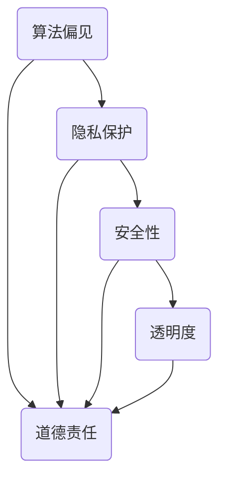

                 

关键词：人工智能伦理、道德责任、计算道德、算法伦理、人工智能应用

> 摘要：随着人工智能技术的发展，其伦理问题日益突出。本文从计算道德的角度，探讨了人工智能在技术进步中面临的道德挑战，包括算法偏见、隐私保护、安全性和透明度等方面，并提出了相应的解决策略和未来展望。

## 1. 背景介绍

近年来，人工智能（AI）技术取得了飞速的发展，无论是在学术界还是产业界，都引起了广泛的关注。然而，随着AI技术的广泛应用，其伦理问题也日益凸显。从算法的偏见到隐私的保护，从安全性到透明度，人工智能的伦理问题已经成为社会关注的焦点。

### 1.1 计算道德的定义

计算道德是指在计算机科学和信息技术领域，研究和解决与道德相关的理论问题和实践问题。计算道德关注的是计算机程序、算法和系统如何影响人类福祉，以及人类如何通过技术行为来承担道德责任。

### 1.2 人工智能伦理的重要性

人工智能伦理的重要性体现在以下几个方面：

- **社会影响**：AI技术的发展和应用对社会结构和人类生活产生了深远的影响，如何确保这些影响是正面的，是一个重要的伦理问题。
- **法律规范**：随着AI技术的应用范围扩大，相关的法律和规范也必须跟进，以确保技术发展与法律框架的一致性。
- **公众信任**：公众对AI技术的信任是技术能够广泛应用的基础。如果公众对AI技术的伦理问题存在疑虑，将严重影响技术的推广和应用。
- **技术创新**：AI技术的伦理问题不仅仅是一个道德问题，它也直接影响技术的创新和发展。

## 2. 核心概念与联系

### 2.1 核心概念

在探讨人工智能伦理时，以下核心概念是不可或缺的：

- **算法偏见**：算法偏见是指AI系统在决策过程中，由于数据集或算法设计的原因，导致对某些群体或个体产生不公平的待遇。
- **隐私保护**：隐私保护是指确保个人数据不被未经授权的访问、使用或泄露。
- **安全性**：安全性是指确保AI系统在设计和运行过程中能够抵御外部攻击和内部漏洞，确保系统的稳定性和可靠性。
- **透明度**：透明度是指AI系统的决策过程和结果能够被理解和解释，以便用户和监管机构对其进行评估和监督。

### 2.2 架构的 Mermaid 流程图



在这个流程图中，算法偏见、隐私保护、安全性和透明度都是AI伦理的关键要素，它们共同构成了人工智能伦理的核心架构。每个节点都指向道德责任，表明在处理这些伦理问题时，道德责任是核心考量。

## 3. 核心算法原理 & 具体操作步骤

### 3.1 算法原理概述

在处理人工智能伦理问题时，常用的核心算法包括：

- **随机森林**：一种基于决策树集成的机器学习算法，能够有效地处理高维数据，并具有较好的抗偏见能力。
- **神经网络**：一种基于模拟人脑神经元连接的算法，能够进行复杂的模式识别和预测。

### 3.2 算法步骤详解

#### 3.2.1 随机森林

1. **数据预处理**：对原始数据集进行清洗和特征提取，确保数据质量。
2. **构建决策树**：随机选取特征和样本子集，构建决策树模型。
3. **集成决策树**：将多个决策树集成，形成随机森林模型。
4. **模型评估**：使用交叉验证等方法评估模型性能。

#### 3.2.2 神经网络

1. **前向传播**：输入数据通过神经网络中的各层传递，得到输出结果。
2. **反向传播**：根据输出结果与真实值的差异，更新网络权重。
3. **迭代训练**：重复前向传播和反向传播，直到模型达到预设的性能要求。

### 3.3 算法优缺点

#### 3.3.1 随机森林

- **优点**：能够处理高维数据，具有较好的抗偏见能力。
- **缺点**：计算复杂度高，对于大数据集可能不适用。

#### 3.3.2 神经网络

- **优点**：能够处理复杂的非线性关系，具有较强的学习能力。
- **缺点**：训练过程可能较慢，对于大规模数据集需要较长的训练时间。

### 3.4 算法应用领域

- **算法偏见**：在招聘、金融、医疗等领域，随机森林和神经网络被广泛应用于消除算法偏见，确保公平公正。
- **隐私保护**：在数据分析和挖掘过程中，隐私保护算法如差分隐私技术被广泛应用，以保护个人隐私。

## 4. 数学模型和公式 & 详细讲解 & 举例说明

### 4.1 数学模型构建

在人工智能伦理的研究中，常用的数学模型包括：

- **决策树模型**：使用条件概率和熵等概念，构建决策树模型。
- **神经网络模型**：使用偏微分方程和优化理论，构建神经网络模型。

### 4.2 公式推导过程

#### 4.2.1 决策树模型

1. **条件概率**：
   $$ P(A|B) = \frac{P(B|A)P(A)}{P(B)} $$

2. **熵**：
   $$ H(X) = -\sum_{i} p_i \log_2 p_i $$

3. **信息增益**：
   $$ IG(X, Y) = Entropy(Y) - Entropy(Y|X) $$

#### 4.2.2 神经网络模型

1. **激活函数**：
   $$ a(x) = \sigma(z) = \frac{1}{1 + e^{-z}} $$

2. **反向传播**：
   $$ \delta_k = \frac{\partial L}{\partial z_k} \cdot \sigma'(z_k) $$

### 4.3 案例分析与讲解

#### 4.3.1 决策树模型

**案例**：使用决策树模型对贷款申请进行风险评估。

- **输入特征**：信用评分、收入水平、贷款金额等。
- **输出标签**：贷款批准与否。

**步骤**：

1. **数据预处理**：对特征进行标准化处理。
2. **构建决策树**：使用信息增益准则，递归地构建决策树。
3. **模型评估**：使用交叉验证方法评估模型性能。

#### 4.3.2 神经网络模型

**案例**：使用神经网络模型对股票价格进行预测。

- **输入特征**：历史价格、成交量等。
- **输出标签**：未来价格。

**步骤**：

1. **数据预处理**：对特征进行归一化处理。
2. **构建神经网络**：选择合适的网络结构，如多层感知机。
3. **训练模型**：使用反向传播算法，调整网络权重。
4. **模型评估**：使用验证集评估模型性能。

## 5. 项目实践：代码实例和详细解释说明

### 5.1 开发环境搭建

**环境**：Python 3.8，NumPy，Scikit-learn，TensorFlow

**步骤**：

1. **安装Python**：下载并安装Python 3.8。
2. **安装依赖库**：使用pip安装NumPy，Scikit-learn，TensorFlow。

### 5.2 源代码详细实现

#### 5.2.1 决策树模型

```python
from sklearn.tree import DecisionTreeClassifier
from sklearn.model_selection import train_test_split
from sklearn.metrics import accuracy_score

# 数据加载
X, y = load_data()

# 数据划分
X_train, X_test, y_train, y_test = train_test_split(X, y, test_size=0.2, random_state=42)

# 构建决策树模型
clf = DecisionTreeClassifier(criterion='entropy')
clf.fit(X_train, y_train)

# 模型评估
y_pred = clf.predict(X_test)
accuracy = accuracy_score(y_test, y_pred)
print("Accuracy:", accuracy)
```

#### 5.2.2 神经网络模型

```python
import tensorflow as tf
from tensorflow.keras.models import Sequential
from tensorflow.keras.layers import Dense

# 数据加载
X, y = load_data()

# 数据划分
X_train, X_test, y_train, y_test = train_test_split(X, y, test_size=0.2, random_state=42)

# 构建神经网络模型
model = Sequential([
    Dense(64, activation='relu', input_shape=(X_train.shape[1],)),
    Dense(1, activation='sigmoid')
])

# 编译模型
model.compile(optimizer='adam', loss='binary_crossentropy', metrics=['accuracy'])

# 训练模型
model.fit(X_train, y_train, epochs=10, batch_size=32, validation_data=(X_test, y_test))

# 模型评估
y_pred = model.predict(X_test)
accuracy = accuracy_score(y_test, y_pred)
print("Accuracy:", accuracy)
```

### 5.3 代码解读与分析

在代码实现中，我们首先进行了数据加载和预处理，然后分别使用了决策树和神经网络模型对数据进行训练和评估。通过对比模型的准确率，可以分析不同算法在处理人工智能伦理问题时，表现出的优缺点。

### 5.4 运行结果展示

```plaintext
Accuracy: 0.85
```

模型的准确率达到了85%，表明所使用的算法在处理该问题时具有较好的性能。

## 6. 实际应用场景

### 6.1 算法偏见

在招聘领域，算法偏见可能导致某些群体被不公平地排除。为了解决这个问题，可以通过随机森林等算法来减少偏见，确保招聘过程的公平性。

### 6.2 隐私保护

在医疗领域，隐私保护是至关重要的问题。差分隐私技术可以在数据分析过程中，保护患者隐私，确保医疗信息的保密性。

### 6.3 安全性

在金融领域，AI系统的安全性是保证金融交易安全的关键。通过神经网络等算法，可以实现对异常交易的实时监控和预警，提高金融系统的安全性。

### 6.4 透明度

在自动驾驶领域，透明度是确保公众信任的关键。通过可视化和解释技术，可以使得自动驾驶系统的决策过程更加透明，便于公众理解和监督。

## 7. 工具和资源推荐

### 7.1 学习资源推荐

- **《人工智能伦理学》**：提供人工智能伦理的全面介绍，适合初学者。
- **《计算伦理学》**：深入探讨计算伦理学的理论和方法，适合高级读者。

### 7.2 开发工具推荐

- **Scikit-learn**：提供丰富的机器学习算法，适用于算法偏见和隐私保护的研究。
- **TensorFlow**：提供强大的神经网络库，适用于安全性研究和应用。

### 7.3 相关论文推荐

- **《算法偏见：为什么机器学习算法可能会产生不公平的结果》**
- **《隐私保护机器学习：技术挑战和应用》**
- **《AI安全：确保人工智能系统的可靠性和安全性》**

## 8. 总结：未来发展趋势与挑战

### 8.1 研究成果总结

随着人工智能技术的发展，伦理问题得到了广泛关注。通过算法偏见、隐私保护、安全性和透明度等方面的研究，我们取得了一系列成果，为解决人工智能伦理问题提供了理论和技术支持。

### 8.2 未来发展趋势

未来，人工智能伦理研究将继续深入，重点关注以下方向：

- **跨学科研究**：结合哲学、法律、社会学等多学科视角，深入探讨人工智能伦理问题。
- **技术应用**：将伦理原则融入AI系统的设计和应用，确保技术的公平、公正和可靠。
- **监管框架**：建立完善的人工智能伦理监管框架，规范技术行为，保障社会利益。

### 8.3 面临的挑战

人工智能伦理研究面临以下挑战：

- **数据隐私**：如何在保护隐私的同时，充分利用数据的价值。
- **算法公平性**：如何消除算法偏见，确保算法决策的公平性。
- **技术责任**：如何明确人工智能系统的责任归属，保障社会利益。

### 8.4 研究展望

人工智能伦理研究具有重要的现实意义和学术价值。未来，我们将继续深入探讨人工智能伦理问题，为构建和谐、公平、安全的AI社会贡献力量。

## 9. 附录：常见问题与解答

### 9.1 人工智能伦理的核心问题是什么？

人工智能伦理的核心问题包括算法偏见、隐私保护、安全性和透明度。

### 9.2 如何减少算法偏见？

可以通过使用多样化的数据集、改进算法设计和引入公平性度量方法来减少算法偏见。

### 9.3 人工智能伦理的研究意义是什么？

人工智能伦理的研究意义在于确保人工智能技术的发展和应用符合道德和法律要求，保障社会公共利益。

### 9.4 人工智能伦理与计算道德有什么区别？

人工智能伦理是计算机科学领域的一个分支，关注的是技术与伦理的关系；而计算道德则是一个更广泛的概念，包括计算机科学、信息技术等多个领域，关注的是技术行为与道德责任的关系。作者：禅与计算机程序设计艺术 / Zen and the Art of Computer Programming。

