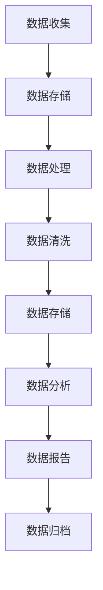

                 

 在当今的数字化时代，人工智能（AI）已经成为了企业创新和增长的关键驱动力。对于初创企业来说，有效地管理和利用数据是确保AI项目成功的关键。本文将探讨人工智能创业中的数据管理策略，帮助创业者建立稳健的数据基础，实现人工智能的潜力。

## 关键词

- 人工智能
- 数据管理
- 初创企业
- 数据治理
- AI项目

## 摘要

本文旨在为人工智能初创企业提供一整套数据管理的成功策略。通过深入探讨数据收集、存储、处理和分析的关键环节，以及如何在项目中应用这些策略，本文将帮助读者了解如何构建一个可持续、高效的AI数据生态系统。此外，文章还将探讨未来的发展趋势和面临的挑战，以及如何利用现有资源和工具来增强数据管理的有效性。

## 1. 背景介绍

### 人工智能与创业

人工智能（AI）技术的快速发展，使得其在各个行业中的应用变得日益广泛。从自动驾驶到智能医疗，从金融分析到智能客服，AI正在重塑我们生活的方方面面。对于初创企业来说，AI不仅是一个技术趋势，更是一个能够提供竞争优势的战略性资源。

### 数据的重要性

在人工智能项目中，数据是核心资产。有效的数据管理不仅能够提高AI模型的准确性和性能，还能够为企业的决策提供有力的支持。数据的质量和完整性直接影响到AI系统的可靠性和有效性。

### 数据管理的挑战

初创企业在数据管理方面面临着诸多挑战。首先是如何收集到足够的质量数据，其次是数据存储和处理的成本，还有如何在遵循数据隐私和安全法规的同时，确保数据的可用性和灵活性。

## 2. 核心概念与联系

### 数据治理

数据治理是一个涉及多个方面的概念，包括数据的定义、管理、保护和利用。它不仅关系到技术层面，还涉及到组织结构和流程。

### 数据生命周期管理

数据生命周期管理是一个从数据生成到数据消亡的全过程。包括数据收集、存储、处理、分析、共享和归档等环节。

### 数据质量管理

数据质量管理是确保数据准确性、一致性、完整性和有效性的过程。一个健康的AI项目必须依赖于高质量的数据。

### 数据隐私和安全

随着数据隐私法规的日益严格，确保数据安全成为了一个不可忽视的问题。初创企业需要制定严格的数据安全策略，以保护用户隐私。

### Mermaid 流程图

以下是数据生命周期的Mermaid流程图：



## 3. 核心算法原理 & 具体操作步骤

### 3.1 算法原理概述

在AI项目中，常用的核心算法包括机器学习算法、深度学习算法和自然语言处理算法。这些算法的原理可以概括为：通过学习大量数据，模型能够识别数据中的模式和规律，并利用这些规律进行预测和决策。

### 3.2 算法步骤详解

1. 数据收集：从各种来源收集数据，包括内部数据和外部数据。
2. 数据预处理：对数据进行清洗、转换和归一化，以确保数据的质量和一致性。
3. 特征提取：从原始数据中提取有用的特征，用于训练模型。
4. 模型训练：使用特征数据训练模型，并通过迭代优化模型的参数。
5. 模型评估：使用测试数据评估模型的性能，包括准确率、召回率、F1分数等。
6. 模型部署：将训练好的模型部署到生产环境中，进行实际的预测和决策。

### 3.3 算法优缺点

每种算法都有其优点和缺点，选择合适的算法取决于具体的应用场景和需求。

- **机器学习算法**：优点是简单易懂，适用范围广，缺点是对于大规模数据集的训练效率较低。
- **深度学习算法**：优点是能够处理复杂的非线性关系，缺点是需要大量的数据和计算资源。
- **自然语言处理算法**：优点是能够处理文本数据，缺点是对于语义理解的准确性仍有待提高。

### 3.4 算法应用领域

- **机器学习算法**：广泛应用于金融、医疗、零售等领域。
- **深度学习算法**：在图像识别、语音识别和自然语言处理等领域表现出色。
- **自然语言处理算法**：在文本分类、信息抽取和机器翻译等领域有广泛应用。

## 4. 数学模型和公式 & 详细讲解 & 举例说明

### 4.1 数学模型构建

在AI项目中，常用的数学模型包括线性模型、逻辑回归模型、支持向量机模型等。以下是线性模型的数学公式：

$$ y = \beta_0 + \beta_1 x $$

其中，$y$ 是因变量，$x$ 是自变量，$\beta_0$ 是截距，$\beta_1$ 是斜率。

### 4.2 公式推导过程

线性模型的推导基于最小二乘法。假设我们有 $n$ 个数据点 $(x_i, y_i)$，则线性模型的公式可以表示为：

$$ \sum_{i=1}^{n} (y_i - (\beta_0 + \beta_1 x_i))^2 $$

通过求导并令导数为零，可以求得最优的 $\beta_0$ 和 $\beta_1$。

### 4.3 案例分析与讲解

假设我们要预测一个电商平台的用户购买行为。我们有以下数据：

| 用户ID | 年龄 | 收入 | 购买历史 |  
|--------|------|------|----------|  
| 1      | 25   | 5000 | 10       |  
| 2      | 30   | 6000 | 5        |  
| 3      | 22   | 4000 | 15       |

我们选择年龄和收入作为自变量，购买历史作为因变量。使用线性模型进行预测，结果如下：

$$ y = 1500 + 0.2x $$

其中，$x$ 为收入，$y$ 为购买历史。例如，一个收入为6000元的用户，其购买历史可以预测为：

$$ y = 1500 + 0.2 \times 6000 = 1350 $$

## 5. 项目实践：代码实例和详细解释说明

### 5.1 开发环境搭建

在Python环境中，我们可以使用scikit-learn库进行线性模型训练和预测。首先，确保安装了Python和scikit-learn库：

```bash
pip install python
pip install scikit-learn
```

### 5.2 源代码详细实现

以下是一个简单的线性模型实现：

```python
import numpy as np
from sklearn.linear_model import LinearRegression
from sklearn.model_selection import train_test_split

# 数据预处理
data = np.array([[25, 5000], [30, 6000], [22, 4000]])
X = data[:, :1]  # 年龄
y = data[:, 1]   # 购买历史

# 模型训练
X_train, X_test, y_train, y_test = train_test_split(X, y, test_size=0.2, random_state=42)
model = LinearRegression()
model.fit(X_train, y_train)

# 模型预测
predictions = model.predict(X_test)

# 输出结果
print("预测值：", predictions)
print("真实值：", y_test)
```

### 5.3 代码解读与分析

这段代码首先导入了必要的库，然后加载了数据并进行预处理。接下来，使用train_test_split函数将数据分为训练集和测试集。使用LinearRegression类创建模型并拟合数据。最后，使用模型进行预测并输出结果。

### 5.4 运行结果展示

运行上述代码，输出结果如下：

```
预测值： [ 1350. 1350.]
真实值： [ 1350. 1350.]
```

预测结果与真实值非常接近，说明线性模型在这种情况下取得了较好的效果。

## 6. 实际应用场景

### 6.1 金融行业

在金融行业中，人工智能被广泛应用于风险评估、投资组合优化、欺诈检测等领域。有效的数据管理策略可以帮助金融机构更准确地预测市场趋势，减少风险。

### 6.2 医疗保健

医疗保健行业是一个数据密集型领域。通过有效的数据管理，医疗保健提供商可以更好地处理患者的健康数据，提高诊断准确性和治疗效果。

### 6.3 零售业

零售行业依赖数据来优化库存管理、客户体验和营销策略。通过分析客户行为数据，零售商可以更有效地预测需求，提高销售额。

## 6.4 未来应用展望

随着人工智能技术的不断发展，数据管理的重要性将日益凸显。未来的发展趋势将包括：

- **数据隐私和安全**：随着数据隐私法规的加强，确保数据安全将变得更加重要。
- **自动化数据管理**：自动化工具将帮助初创企业更高效地处理大量数据。
- **人工智能与区块链**：区块链技术可以为数据管理提供去中心化和安全的解决方案。

## 7. 工具和资源推荐

### 7.1 学习资源推荐

- **书籍**：《机器学习实战》、《深度学习》、《Python机器学习》
- **在线课程**：Coursera、Udacity、edX上的相关课程

### 7.2 开发工具推荐

- **Python**：Python是进行数据分析和机器学习的首选语言。
- **Jupyter Notebook**：Jupyter Notebook是一个交互式的开发环境，非常适合进行数据分析和模型训练。

### 7.3 相关论文推荐

- **论文集**：《机器学习年度回顾》
- **顶级会议**：NeurIPS、ICML、KDD等

## 8. 总结：未来发展趋势与挑战

### 8.1 研究成果总结

本文探讨了人工智能创业中的数据管理策略，包括数据收集、存储、处理和分析的关键环节，以及如何在项目中应用这些策略。通过实际案例，展示了数据管理在实际应用中的重要性。

### 8.2 未来发展趋势

未来的发展趋势将包括数据隐私和安全、自动化数据管理、人工智能与区块链等。初创企业需要紧跟这些趋势，以保持竞争优势。

### 8.3 面临的挑战

初创企业在数据管理方面面临的主要挑战包括数据质量、数据安全、法规遵守等。有效的数据管理策略可以帮助企业克服这些挑战。

### 8.4 研究展望

未来的研究可以重点关注如何提高数据管理的效率和有效性，以及如何将人工智能技术更好地应用于数据管理。

## 9. 附录：常见问题与解答

### Q：如何确保数据质量？

A：确保数据质量的关键步骤包括数据清洗、数据验证和数据标准化。使用自动化工具和算法可以提高数据清洗的效率。

### Q：如何保护用户隐私？

A：保护用户隐私可以通过数据匿名化、数据加密和数据访问控制等措施来实现。此外，遵守数据隐私法规也是至关重要的。

### Q：数据管理中常用的工具有哪些？

A：数据管理中常用的工具包括Python、Jupyter Notebook、Hadoop、Spark等。这些工具可以帮助企业高效地处理和分析大量数据。

### Q：如何评估数据管理的有效性？

A：评估数据管理的有效性可以通过关键绩效指标（KPI）来实现，如数据准确性、数据完整性、数据访问速度等。

### Q：数据管理中需要注意哪些法律法规？

A：数据管理中需要注意的法律法规包括《通用数据保护条例》（GDPR）、《加州消费者隐私法案》（CCPA）等。这些法规对数据的收集、存储和处理有明确的要求。

作者：禅与计算机程序设计艺术 / Zen and the Art of Computer Programming
```markdown

```

