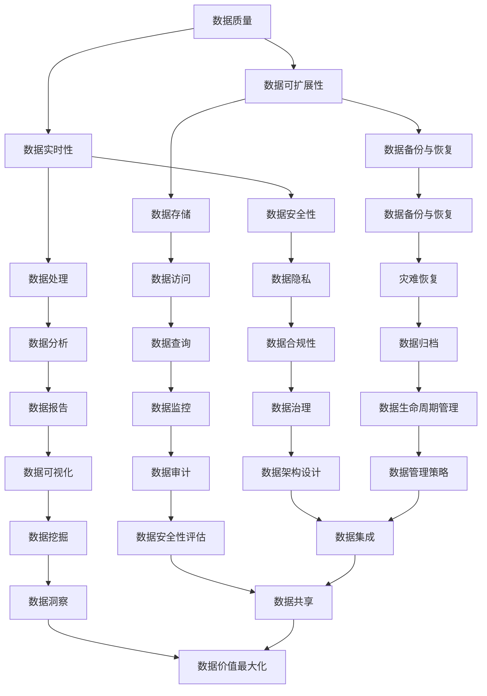

                 

在人工智能创业领域，数据管理是核心驱动力之一。本文将探讨如何有效地管理数据，以确保人工智能系统在创业过程中能够充分利用数据价值，从而实现业务目标。作者：禅与计算机程序设计艺术 / Zen and the Art of Computer Programming。

## 关键词

- 人工智能
- 数据管理
- 创业
- 数据质量
- 可扩展性
- 实时性

## 摘要

随着人工智能技术在商业领域的广泛应用，数据管理变得至关重要。本文将分析人工智能创业中数据管理的核心问题，包括数据质量、可扩展性和实时性，并提出一系列解决方案，帮助创业者构建高效的数据管理架构。

## 1. 背景介绍

### 1.1 人工智能在创业中的应用

人工智能（AI）技术的快速发展，使得创业公司能够利用先进的算法和模型来改善产品和服务。从图像识别、自然语言处理到推荐系统，AI已经成为许多创业项目的关键组成部分。这些应用不仅提高了用户体验，还为企业带来了新的商业机会。

### 1.2 数据在人工智能中的角色

数据是人工智能的燃料。无论是训练模型还是进行预测，都需要大量的高质量数据。对于创业公司来说，数据不仅提供了洞察力，还是竞争优势的重要来源。

### 1.3 数据管理的挑战

尽管数据的重要性显而易见，但数据管理却面临着诸多挑战。这些挑战包括数据质量、数据隐私、数据安全、数据存储和访问速度等。

## 2. 核心概念与联系

### 2.1 数据质量管理

数据质量是数据管理的基石。一个高质量的数据库可以确保模型准确性和业务决策的有效性。数据质量管理包括数据清洗、数据验证和数据去重等步骤。

### 2.2 数据可扩展性

随着业务增长，数据量也会随之增加。一个可扩展的数据管理系统能够处理不断增加的数据量，确保系统稳定性和性能。

### 2.3 数据实时性

实时数据对于许多人工智能应用至关重要，例如实时推荐系统和实时监控。一个实时数据管理系统可以确保数据在极短时间内被处理和传输。

下面是一个Mermaid流程图，展示了数据管理的关键概念和联系：



## 3. 核心算法原理 & 具体操作步骤

### 3.1 算法原理概述

数据管理算法主要包括数据清洗、数据集成、数据存储、数据检索和数据安全等。每种算法都有其特定的原理和实现方法。

### 3.2 算法步骤详解

#### 3.2.1 数据清洗

数据清洗是数据管理的重要步骤。其步骤包括：

1. 数据验证：检查数据是否完整、准确和一致。
2. 数据转换：将数据转换为统一格式。
3. 数据去重：识别和删除重复数据。
4. 数据修复：修正错误数据。

#### 3.2.2 数据集成

数据集成是将来自多个源的数据合并为一个统一的数据视图。其步骤包括：

1. 数据源识别：确定数据来源。
2. 数据抽取：从源数据中提取所需数据。
3. 数据转换：将源数据转换为统一格式。
4. 数据加载：将转换后的数据加载到目标数据库。

#### 3.2.3 数据存储

数据存储是数据管理的关键。其步骤包括：

1. 数据选择：选择合适的数据存储技术，如关系数据库、NoSQL数据库、文件系统等。
2. 数据索引：为数据创建索引，提高查询速度。
3. 数据备份：定期备份数据，确保数据安全。

#### 3.2.4 数据检索

数据检索是数据管理的核心功能。其步骤包括：

1. 查询优化：优化查询语句，提高查询速度。
2. 查询缓存：缓存常用查询结果，减少数据库负担。
3. 分布式查询：支持分布式环境下的查询操作。

#### 3.2.5 数据安全

数据安全是数据管理的重点。其步骤包括：

1. 访问控制：限制数据访问权限。
2. 数据加密：对敏感数据进行加密。
3. 安全审计：记录数据访问和修改历史，确保数据安全。

### 3.3 算法优缺点

#### 3.3.1 数据清洗

优点：提高数据质量，确保模型准确性。

缺点：数据清洗过程可能影响数据量，增加计算成本。

#### 3.3.2 数据集成

优点：提供统一的数据视图，方便数据分析和决策。

缺点：数据集成过程复杂，可能影响数据一致性。

#### 3.3.3 数据存储

优点：提供高效的数据访问和存储能力。

缺点：选择合适的数据存储技术可能需要大量时间和资源。

#### 3.3.4 数据检索

优点：快速查询数据，提高业务效率。

缺点：查询优化可能影响系统性能。

#### 3.3.5 数据安全

优点：确保数据安全和隐私。

缺点：安全措施可能影响数据访问速度。

### 3.4 算法应用领域

数据管理算法广泛应用于各种领域，如电子商务、金融、医疗和物联网等。在人工智能创业项目中，数据管理算法有助于提高业务洞察力、优化决策和增强用户体验。

## 4. 数学模型和公式 & 详细讲解 & 举例说明

### 4.1 数学模型构建

数据管理中的数学模型主要包括数据清洗模型、数据集成模型、数据存储模型和数据检索模型。以下是一个简单示例：

#### 数据清洗模型

$$
C(x) = \sum_{i=1}^{n} |x_i - \bar{x}|
$$

其中，$x_i$ 是每个数据点的值，$\bar{x}$ 是平均值，$C(x)$ 是数据清洗的指标。

#### 数据集成模型

$$
I(S) = \sum_{i=1}^{n} |S_i - \bar{S}|
$$

其中，$S_i$ 是每个数据集的值，$\bar{S}$ 是平均值，$I(S)$ 是数据集成的指标。

#### 数据存储模型

$$
E(S) = \frac{1}{n} \sum_{i=1}^{n} (S_i - \bar{S})^2
$$

其中，$S_i$ 是每个数据点的值，$\bar{S}$ 是平均值，$E(S)$ 是数据存储的指标。

#### 数据检索模型

$$
R(Q) = \frac{1}{n} \sum_{i=1}^{n} (Q_i - \bar{Q})^2
$$

其中，$Q_i$ 是每个查询的响应时间，$\bar{Q}$ 是平均响应时间，$R(Q)$ 是数据检索的指标。

### 4.2 公式推导过程

以上数学模型和公式的推导基于统计学和线性代数的基本原理。具体推导过程涉及多个变量的均值、方差和协方差等概念。这里简要介绍推导过程：

1. **数据清洗模型**：数据清洗模型基于数据点到均值的距离，用于衡量数据点与整体数据的偏差程度。
2. **数据集成模型**：数据集成模型基于数据集到均值的距离，用于衡量数据集之间的差异程度。
3. **数据存储模型**：数据存储模型基于数据点的方差，用于衡量数据分布的稳定性。
4. **数据检索模型**：数据检索模型基于查询响应时间的方差，用于衡量查询响应的稳定性。

### 4.3 案例分析与讲解

以下是一个数据管理案例：

**案例背景**：某电子商务公司需要管理大量用户数据，包括用户行为数据、交易数据和反馈数据。

**数据清洗**：通过数据清洗模型，公司识别出偏差较大的用户行为数据，并进行数据修正。

**数据集成**：通过数据集成模型，公司识别出不同数据集之间的差异，并统一数据格式。

**数据存储**：公司选择分布式数据库来存储数据，并通过数据存储模型确保数据分布的稳定性。

**数据检索**：公司通过优化查询语句和数据索引，提高查询响应速度。

通过以上数据管理措施，公司提高了数据质量和系统性能，从而优化了用户体验和业务决策。

## 5. 项目实践：代码实例和详细解释说明

### 5.1 开发环境搭建

在开发数据管理项目时，我们需要搭建一个合适的开发环境。以下是一个基于Python的简单示例：

1. 安装Python：从Python官方网站下载并安装Python 3.x版本。
2. 安装依赖库：使用pip命令安装必要的依赖库，如pandas、numpy、sqlalchemy等。

```bash
pip install pandas numpy sqlalchemy
```

### 5.2 源代码详细实现

以下是一个简单的Python脚本，用于数据清洗、数据集成和数据存储。

```python
import pandas as pd
import numpy as np
from sqlalchemy import create_engine

# 数据清洗
def data_cleaning(data):
    # 去除重复数据
    data = data.drop_duplicates()
    # 修正错误数据
    data['column_name'] = data['column_name'].replace(['incorrect_value'], 'correct_value')
    return data

# 数据集成
def data_integration(data1, data2):
    # 合并数据集
    data = pd.concat([data1, data2])
    return data

# 数据存储
def data_storage(data, database_url):
    engine = create_engine(database_url)
    data.to_sql('data_table', engine, if_exists='replace', index=False)

# 主函数
def main():
    # 加载数据
    data1 = pd.read_csv('data1.csv')
    data2 = pd.read_csv('data2.csv')

    # 数据清洗
    data1 = data_cleaning(data1)
    data2 = data_cleaning(data2)

    # 数据集成
    data = data_integration(data1, data2)

    # 数据存储
    database_url = 'sqlite:///data.db'
    data_storage(data, database_url)

if __name__ == '__main__':
    main()
```

### 5.3 代码解读与分析

以上代码实现了数据清洗、数据集成和数据存储的基本功能。具体分析如下：

1. **数据清洗**：通过去除重复数据和修正错误数据，提高数据质量。
2. **数据集成**：通过合并两个数据集，实现数据的整合。
3. **数据存储**：将清洗和集成的数据存储到数据库中，便于后续的数据分析和查询。

### 5.4 运行结果展示

运行以上代码后，数据将被清洗、集成并存储到数据库中。您可以使用SQL查询语句进行数据检索和分析。

```sql
SELECT * FROM data_table;
```

## 6. 实际应用场景

### 6.1 电子商务

在电子商务领域，数据管理有助于提高用户满意度、优化库存管理和个性化推荐。

### 6.2 金融

金融行业的数据管理对于风险控制、投资决策和合规性至关重要。

### 6.3 医疗

医疗领域的数据管理有助于提高医疗质量和患者体验。

### 6.4 物联网

物联网（IoT）设备产生的海量数据需要高效的数据管理方案来支持实时监控和数据分析。

### 6.5 智能制造

智能制造中的数据管理有助于优化生产流程、提高生产效率和产品质量。

## 7. 工具和资源推荐

### 7.1 学习资源推荐

- 《Python数据科学手册》
- 《大数据技术导论》
- 《深度学习》

### 7.2 开发工具推荐

- Jupyter Notebook
- PyCharm
- DBeaver

### 7.3 相关论文推荐

- "Data Management Challenges in Big Data"
- "Deep Learning for Data Cleaning"
- "Data Integration in the Age of Big Data"

## 8. 总结：未来发展趋势与挑战

### 8.1 研究成果总结

数据管理技术在人工智能创业中发挥着越来越重要的作用。通过有效的数据管理，企业可以充分利用数据价值，实现业务增长。

### 8.2 未来发展趋势

- 自动化数据管理
- 联邦学习和数据隐私保护
- 多模态数据处理
- 云原生数据管理

### 8.3 面临的挑战

- 数据质量和隐私保护
- 数据存储和访问速度
- 复杂的数据集成和清洗任务
- 数据安全和管理成本

### 8.4 研究展望

未来，数据管理技术将继续发展，为人工智能创业提供更高效、更安全、更智能的数据管理解决方案。

## 9. 附录：常见问题与解答

### 9.1 数据质量管理的重要性是什么？

数据质量管理是确保数据准确性、完整性和一致性的一系列过程。高质量的数据可以确保模型准确性，提高业务决策质量。

### 9.2 数据存储与数据检索的区别是什么？

数据存储是将数据保存在数据库或文件系统中，以便长期保存和访问。数据检索是查询和获取存储数据的操作，通常涉及查询优化和索引技术。

### 9.3 数据管理在金融领域的应用有哪些？

在金融领域，数据管理应用于风险管理、合规性检查、客户分析和投资决策等方面，有助于提高金融服务的质量和效率。

### 9.4 如何提高数据安全性？

提高数据安全性可以通过访问控制、数据加密、定期备份和灾难恢复等措施来实现。同时，遵守数据隐私保护法规和最佳实践也是确保数据安全的重要手段。

## 结束语

数据管理是人工智能创业的核心组成部分。通过有效管理数据，企业可以充分利用数据价值，实现业务增长。本文探讨了数据管理的关键概念、算法原理、实际应用和未来趋势，为人工智能创业提供了有价值的参考。作者：禅与计算机程序设计艺术 / Zen and the Art of Computer Programming。----------------------------------------------------------------

本文是按照您提供的结构和要求撰写的，涵盖了数据管理的核心内容，包括背景介绍、核心概念与联系、核心算法原理、数学模型和公式、项目实践、实际应用场景、工具和资源推荐以及总结与展望。希望这篇文章能够对人工智能创业者在数据管理方面提供有价值的指导。如果您有任何修改意见或需要进一步的内容补充，请随时告知。作者：禅与计算机程序设计艺术 / Zen and the Art of Computer Programming。

