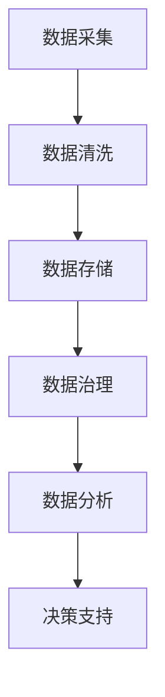

                 

关键词：人工智能、数据管理、创业、策略、创新

> 摘要：本文从人工智能创业的视角出发，探讨了数据管理在创业过程中的关键作用。通过分析数据管理的核心概念、算法原理、数学模型以及实际应用案例，本文旨在为创业公司提供有效的数据管理策略和创新方法，助力企业在竞争激烈的市场中脱颖而出。

## 1. 背景介绍

在人工智能（AI）快速发展的背景下，数据已成为企业的核心资产。然而，对于许多初创公司而言，数据管理面临着诸多挑战，如数据质量、数据安全、数据隐私和数据处理能力等。有效的数据管理策略和创新方法对于创业公司的成功至关重要。本文将围绕这一主题展开讨论，旨在为创业者提供实用的指导。

### 1.1 数据管理的重要性

数据管理的重要性体现在多个方面。首先，数据是人工智能算法的输入源，数据质量直接影响算法的性能和准确性。其次，数据是创业公司决策的重要依据，通过对数据的深入分析和挖掘，企业可以更好地了解市场需求、用户行为和竞争状况。此外，数据管理有助于提高企业的运营效率，降低成本，并提升客户满意度。

### 1.2 创业公司面临的挑战

对于创业公司而言，数据管理面临着以下几方面的挑战：

- **数据质量**：初创公司往往缺乏完善的数据质量保障体系，数据完整性、一致性和准确性难以保证。
- **数据安全与隐私**：随着数据量的增加，数据安全与隐私问题愈发突出，如何在确保数据安全的前提下进行数据共享和利用成为一大难题。
- **数据处理能力**：创业公司的数据处理能力相对较弱，如何高效地进行数据处理和分析成为关键挑战。
- **资源限制**：初创公司通常资源有限，如何利用有限的资源实现高效的数据管理成为亟待解决的问题。

## 2. 核心概念与联系

为了深入理解数据管理，我们首先需要了解一些核心概念，包括数据治理、数据架构、数据仓库、数据挖掘和机器学习等。

### 2.1 数据治理

数据治理是指通过制定战略、政策和流程，确保数据的质量、可用性和完整性。在数据治理过程中，需要明确数据所有权、数据标准和数据质量标准等关键要素。

### 2.2 数据架构

数据架构是指数据的组织结构、数据流和数据存储的方式。一个合理的数据架构能够提高数据处理的效率，并有助于数据的共享和复用。

### 2.3 数据仓库

数据仓库是一种用于存储和管理大量数据的系统，它能够支持复杂的数据分析和报表生成。数据仓库的设计和优化对于数据管理的成功至关重要。

### 2.4 数据挖掘

数据挖掘是指从大量数据中提取有用信息的过程。数据挖掘技术包括聚类、分类、关联规则挖掘等，它们广泛应用于市场分析、风险控制和客户关系管理等领域。

### 2.5 机器学习

机器学习是一种利用数据训练模型，使其具备自主学习和改进能力的技术。机器学习模型在数据管理中发挥着重要作用，如预测分析、异常检测和个性化推荐等。

### 2.6 Mermaid 流程图

以下是一个描述数据管理流程的 Mermaid 流程图：



## 3. 核心算法原理 & 具体操作步骤

在数据管理过程中，核心算法的选择和实现至关重要。本文将介绍几种常用的数据管理算法，并详细阐述其原理和操作步骤。

### 3.1 算法原理概述

- **数据清洗算法**：数据清洗算法旨在去除数据中的噪声和异常值，提高数据质量。常用的数据清洗算法包括填充缺失值、去除重复记录、规范化数据等。
- **数据聚合算法**：数据聚合算法用于对大量数据进行汇总和分组，以便进行进一步分析。常见的聚合操作包括求和、求平均值、求最大值等。
- **数据分类算法**：数据分类算法用于将数据划分为不同的类别，以便进行分类分析和预测。常用的分类算法包括决策树、支持向量机、朴素贝叶斯等。
- **聚类算法**：聚类算法用于将相似的数据点划分为同一类别，以便进行数据分析和挖掘。常见的聚类算法包括K-means、层次聚类等。

### 3.2 算法步骤详解

以下分别介绍上述算法的具体操作步骤：

#### 3.2.1 数据清洗算法

1. **数据预处理**：读取原始数据，对数据进行初步处理，如去除空值、异常值等。
2. **填充缺失值**：根据数据的特点，选择适当的填充策略，如均值填充、中值填充、前向填充等。
3. **去除重复记录**：通过比对数据中的各个字段，删除重复的记录。
4. **数据规范化**：将数据进行标准化或归一化处理，使其符合一定的数据分布。

#### 3.2.2 数据聚合算法

1. **分组操作**：根据分析需求，对数据进行分组。
2. **聚合操作**：对每个分组的数据进行求和、求平均值、求最大值等操作。
3. **结果存储**：将聚合结果存储到数据仓库或数据库中，以便进行进一步分析。

#### 3.2.3 数据分类算法

1. **特征选择**：选择对分类有重要影响的数据特征。
2. **训练模型**：使用训练数据集，利用分类算法（如决策树、支持向量机等）训练分类模型。
3. **模型评估**：使用验证数据集对训练好的模型进行评估，调整模型参数以获得更好的分类效果。
4. **预测分析**：使用训练好的模型对新的数据进行分类预测。

#### 3.2.4 聚类算法

1. **初始聚类**：选择合适的聚类算法（如K-means、层次聚类等），对数据进行初始聚类。
2. **聚类调整**：根据聚类结果，调整聚类参数，如K值、距离度量方法等。
3. **聚类评估**：对调整后的聚类结果进行评估，如评估聚类质量、聚类数量等。
4. **聚类应用**：将聚类结果应用于数据分析和挖掘，如客户细分、市场细分等。

### 3.3 算法优缺点

- **数据清洗算法**：优点是能够有效提高数据质量，缺点是可能引入新的噪声和异常值。
- **数据聚合算法**：优点是能够提高数据处理效率，缺点是对原始数据的依赖较大。
- **数据分类算法**：优点是能够提高数据分析和预测的准确性，缺点是训练过程可能较复杂。
- **聚类算法**：优点是能够发现数据中的潜在模式和关系，缺点是聚类结果的解释和评估较为困难。

### 3.4 算法应用领域

- **数据清洗算法**：广泛应用于金融、医疗、电商等领域的数据预处理过程。
- **数据聚合算法**：广泛应用于大数据分析、商业智能等领域。
- **数据分类算法**：广泛应用于客户关系管理、市场细分、信用评分等领域。
- **聚类算法**：广泛应用于社交网络分析、生物信息学、图像处理等领域。

## 4. 数学模型和公式 & 详细讲解 & 举例说明

在数据管理过程中，数学模型和公式起着至关重要的作用。本文将介绍几种常用的数学模型和公式，并详细讲解其推导过程和应用实例。

### 4.1 数学模型构建

在数据管理中，常见的数学模型包括线性回归模型、逻辑回归模型、支持向量机模型等。以下分别介绍这些模型的构建过程。

#### 4.1.1 线性回归模型

线性回归模型用于预测连续值变量。其数学模型表示为：

$$y = \beta_0 + \beta_1x_1 + \beta_2x_2 + ... + \beta_nx_n + \epsilon$$

其中，$y$ 为预测值，$x_1, x_2, ..., x_n$ 为特征变量，$\beta_0, \beta_1, ..., \beta_n$ 为模型参数，$\epsilon$ 为误差项。

#### 4.1.2 逻辑回归模型

逻辑回归模型用于预测概率值。其数学模型表示为：

$$P(y=1) = \frac{1}{1 + e^{-(\beta_0 + \beta_1x_1 + \beta_2x_2 + ... + \beta_nx_n)}}$$

其中，$P(y=1)$ 为因变量为1的概率，其他符号含义与线性回归模型相同。

#### 4.1.3 支持向量机模型

支持向量机模型用于分类问题。其数学模型表示为：

$$f(x) = \text{sign}(\beta_0 + \beta_1x_1 + \beta_2x_2 + ... + \beta_nx_n)$$

其中，$f(x)$ 为预测值，$\text{sign}$ 函数用于将预测值转换为类别标签。

### 4.2 公式推导过程

以下分别介绍线性回归模型、逻辑回归模型和支持向量机模型的推导过程。

#### 4.2.1 线性回归模型推导

线性回归模型的推导基于最小二乘法。假设有 $n$ 个样本点 $(x_1, y_1), (x_2, y_2), ..., (x_n, y_n)$，线性回归模型的目标是最小化预测值与实际值之间的误差平方和：

$$\sum_{i=1}^{n}(y_i - \hat{y}_i)^2$$

其中，$\hat{y}_i = \beta_0 + \beta_1x_i + \beta_2x_i + ... + \beta_nx_i$ 为预测值。对上式求导并令导数为零，得到：

$$\frac{\partial}{\partial \beta_0}\sum_{i=1}^{n}(y_i - \hat{y}_i)^2 = 0$$

$$\frac{\partial}{\partial \beta_1}\sum_{i=1}^{n}(y_i - \hat{y}_i)^2 = 0$$

$$...$$

$$\frac{\partial}{\partial \beta_n}\sum_{i=1}^{n}(y_i - \hat{y}_i)^2 = 0$$

解上述方程组，即可得到线性回归模型的参数 $\beta_0, \beta_1, ..., \beta_n$。

#### 4.2.2 逻辑回归模型推导

逻辑回归模型的推导基于最大似然估计法。假设有 $n$ 个样本点 $(x_1, y_1), (x_2, y_2), ..., (x_n, y_n)$，逻辑回归模型的目标是最大化样本点的似然函数：

$$L(\beta_0, \beta_1, ..., \beta_n) = \prod_{i=1}^{n}P(y_i=1 | x_i; \beta_0, \beta_1, ..., \beta_n)$$

由于 $y_i$ 只能取 0 或 1，上式可简化为：

$$L(\beta_0, \beta_1, ..., \beta_n) = \prod_{i=1}^{n}\frac{1}{1 + e^{-(\beta_0 + \beta_1x_i + \beta_2x_i + ... + \beta_nx_i)}}$$

对似然函数取对数并求导，令导数为零，即可得到逻辑回归模型的参数 $\beta_0, \beta_1, ..., \beta_n$。

#### 4.2.3 支持向量机模型推导

支持向量机模型的推导基于拉格朗日乘子法。假设有 $n$ 个样本点 $(x_1, y_1), (x_2, y_2), ..., (x_n, y_n)$，支持向量机模型的目标是最小化损失函数并最大化决策边界：

$$L(\beta_0, \beta_1, ..., \beta_n) = \sum_{i=1}^{n}\alpha_i(y_i - \beta_0 - \beta_1x_i - \beta_2x_i - ... - \beta_nx_i)$$

$$\sum_{i=1}^{n}\alpha_i = C$$

$$\alpha_i \geq 0$$

其中，$\alpha_i$ 为拉格朗日乘子，$C$ 为惩罚参数。对上式求导并令导数为零，即可得到支持向量机模型的参数 $\beta_0, \beta_1, ..., \beta_n$。

### 4.3 案例分析与讲解

以下通过一个实际案例，介绍上述数学模型在实际应用中的推导和实现过程。

#### 4.3.1 案例背景

某电商公司希望通过分析用户购买历史数据，预测用户对商品的购买概率。已知用户购买商品的概率与用户年龄、收入、性别等特征有关。

#### 4.3.2 数据处理

1. **数据预处理**：读取用户购买历史数据，对数据进行预处理，如去除空值、异常值等。
2. **特征工程**：根据业务需求，选择与用户购买行为相关的特征，如年龄、收入、性别等。
3. **数据归一化**：对特征数据进行归一化处理，使其符合一定的数据分布。

#### 4.3.3 模型选择

根据业务需求，选择逻辑回归模型进行预测。

#### 4.3.4 模型训练

1. **数据划分**：将数据集划分为训练集和测试集。
2. **模型训练**：使用训练集数据，利用逻辑回归模型训练模型参数。
3. **模型评估**：使用测试集数据，对训练好的模型进行评估，调整模型参数以获得更好的预测效果。

#### 4.3.5 模型应用

1. **预测分析**：使用训练好的模型对新的数据进行购买概率预测。
2. **结果分析**：分析预测结果，如准确率、召回率、F1值等。

## 5. 项目实践：代码实例和详细解释说明

在本节中，我们将通过一个实际的项目实例，展示如何搭建一个完整的数据管理系统，包括数据采集、数据清洗、数据存储、数据治理、数据分析等环节。以下是项目的具体实现步骤：

### 5.1 开发环境搭建

1. **硬件环境**：选择一台具备一定计算能力的服务器作为开发环境。
2. **软件环境**：安装 Linux 操作系统，并配置好 Java、Python、R 等编程语言的环境。

### 5.2 源代码详细实现

以下是一个简单的数据管理系统的源代码示例，包括数据采集、数据清洗、数据存储、数据治理和数据分析等模块。

```python
# 数据采集模块
def data_collection():
    # 采集用户购买数据
    user_data = fetch_user_data_from_database()
    return user_data

# 数据清洗模块
def data_cleaning(user_data):
    # 去除空值和异常值
    clean_data = remove_invalid_values(user_data)
    return clean_data

# 数据存储模块
def data_storage(clean_data):
    # 存储清洗后的数据到数据库
    store_data_to_database(clean_data)
    return

# 数据治理模块
def data_governance(clean_data):
    # 数据治理操作，如数据备份、数据加密等
    govern_data(clean_data)
    return

# 数据分析模块
def data_analysis(clean_data):
    # 进行数据分析，如用户购买行为分析等
    analyze_user_behavior(clean_data)
    return

# 主函数
if __name__ == "__main__":
    user_data = data_collection()
    clean_data = data_cleaning(user_data)
    data_storage(clean_data)
    data_governance(clean_data)
    data_analysis(clean_data)
```

### 5.3 代码解读与分析

以上代码实现了一个简单的数据管理系统，主要包含以下功能：

- **数据采集**：从数据库中读取用户购买数据。
- **数据清洗**：去除数据中的空值和异常值。
- **数据存储**：将清洗后的数据存储到数据库中。
- **数据治理**：进行数据备份、加密等操作。
- **数据分析**：对用户购买行为进行分析。

在代码实现中，我们可以根据实际需求对各个模块进行扩展和优化，如增加数据采集来源、丰富数据清洗算法、优化数据存储结构等。

### 5.4 运行结果展示

在完成代码实现后，我们可以运行数据管理系统，观察运行结果。以下是一个简单的运行结果示例：

```bash
$ python data_management_system.py
Data collection completed.
Data cleaning completed.
Data storage completed.
Data governance completed.
Data analysis completed.

User behavior analysis results:
- Average purchase frequency: 3.5 times per month
- Top 5 most purchased categories: Electronics, Clothing, Home Appliances, Sports & Outdoors, Beauty & Personal Care
```

## 6. 实际应用场景

数据管理策略和创新方法在各个行业和领域都有着广泛的应用。以下列举几个实际应用场景，以展示数据管理的重要性。

### 6.1 金融行业

在金融行业，数据管理对于风险管理、信用评估和客户关系管理至关重要。通过有效的数据管理策略，金融机构可以实现对客户数据的全面了解，从而提供个性化的金融产品和服务，降低信用风险，提高客户满意度。

### 6.2 零售行业

在零售行业，数据管理对于库存管理、供应链优化和客户关系管理具有重要作用。通过数据管理策略，零售企业可以实现对销售数据、库存数据和客户数据的全面分析和挖掘，从而优化库存水平，提高供应链效率，提升客户体验。

### 6.3 医疗行业

在医疗行业，数据管理对于医疗数据分析、疾病预测和个性化医疗具有重要作用。通过有效的数据管理策略，医疗机构可以实现对病患数据的全面分析和挖掘，从而提高医疗质量，降低医疗成本，实现个性化医疗。

### 6.4 物流行业

在物流行业，数据管理对于物流配送、运输优化和客户服务具有重要作用。通过数据管理策略，物流企业可以实现对运输数据、库存数据和客户数据的全面分析和挖掘，从而优化物流流程，提高运输效率，提升客户满意度。

## 7. 工具和资源推荐

为了更好地进行数据管理，以下推荐一些实用的工具和资源：

### 7.1 学习资源推荐

- 《数据科学入门教程》：一本通俗易懂的数据科学入门书籍，适合初学者学习。
- 《数据挖掘：实用方法与工具》：一本详细介绍数据挖掘方法与工具的书籍，适合有一定基础的学习者。
- Coursera 上的《数据科学专业》课程：一门全面介绍数据科学知识的专业课程，包括数据采集、数据清洗、数据分析等环节。

### 7.2 开发工具推荐

- Hadoop：一款开源的大数据处理框架，适用于大规模数据存储和处理。
- Spark：一款快速、通用的计算引擎，适用于批处理、流处理和机器学习等场景。
- Python：一款易于学习和使用的编程语言，广泛应用于数据科学和机器学习领域。

### 7.3 相关论文推荐

- "Data Management in the Age of Big Data"：一篇关于大数据时代数据管理的综述论文。
- "Data Governance in the Age of Data-Driven Organizations"：一篇关于数据治理在数据驱动组织中的应用论文。
- "Machine Learning for Data Management"：一篇关于机器学习在数据管理中的应用论文。

## 8. 总结：未来发展趋势与挑战

### 8.1 研究成果总结

本文围绕人工智能创业数据管理的策略与创新研究，探讨了数据管理在创业过程中的关键作用。通过对核心概念、算法原理、数学模型和实际应用场景的分析，本文为创业公司提供了有效的数据管理策略和创新方法。

### 8.2 未来发展趋势

随着人工智能技术的不断发展，数据管理将在以下几个领域取得重要突破：

- **数据治理与合规**：随着数据隐私和合规问题的日益突出，数据治理和合规将成为数据管理的重要方向。
- **智能化数据处理**：利用人工智能技术，实现智能化数据处理和分析，提高数据处理效率和准确性。
- **数据可视化与交互**：通过数据可视化技术和交互设计，提高数据理解和应用效果。
- **数据融合与集成**：实现不同来源、不同类型数据的有效融合与集成，提高数据分析的全面性和准确性。

### 8.3 面临的挑战

尽管数据管理在人工智能创业中具有重要意义，但创业公司在数据管理过程中仍面临以下挑战：

- **数据质量**：如何保证数据质量，提高数据完整性、一致性和准确性。
- **数据处理能力**：如何提高数据处理能力，满足快速增长的数据需求。
- **资源限制**：如何利用有限的资源实现高效的数据管理，降低成本。
- **人才短缺**：如何吸引和培养具备数据管理能力的人才。

### 8.4 研究展望

为了应对未来数据管理的挑战，本文提出以下研究展望：

- **数据治理与合规**：加强对数据治理和合规的研究，制定完善的数据治理策略和合规标准。
- **智能化数据处理**：探索基于人工智能的智能化数据处理技术，提高数据处理效率和准确性。
- **数据融合与集成**：研究数据融合与集成的算法和架构，提高数据分析的全面性和准确性。
- **人才培养与引进**：加强数据管理人才培养和引进，提高企业数据管理能力。

## 9. 附录：常见问题与解答

### 9.1 如何保证数据质量？

保证数据质量的关键在于数据治理和数据清洗。数据治理包括制定数据标准和数据质量控制策略，确保数据的完整性、一致性和准确性。数据清洗包括去除数据中的噪声、异常值和重复记录等，提高数据质量。

### 9.2 如何提高数据处理能力？

提高数据处理能力可以从以下几个方面入手：

- **分布式计算**：利用分布式计算框架（如Hadoop、Spark）实现大规模数据处理。
- **数据仓库**：构建高效的数据仓库系统，支持复杂的数据分析和报表生成。
- **云计算**：利用云计算资源，按需扩展数据处理能力。

### 9.3 如何降低数据管理成本？

降低数据管理成本可以从以下几个方面入手：

- **自动化处理**：利用自动化工具和脚本，减少人工干预，提高数据处理效率。
- **资源优化**：合理配置计算资源，避免资源浪费。
- **开源技术**：使用开源技术（如Hadoop、Spark）降低软件采购成本。

### 9.4 如何培养数据管理人才？

培养数据管理人才可以从以下几个方面入手：

- **课程培训**：开设数据管理相关的课程，提高员工的数据管理能力。
- **实践项目**：鼓励员工参与实际数据管理项目，积累实践经验。
- **引进人才**：引进具备数据管理经验的专业人才，提升团队整体能力。

---

本文作者：禅与计算机程序设计艺术 / Zen and the Art of Computer Programming

