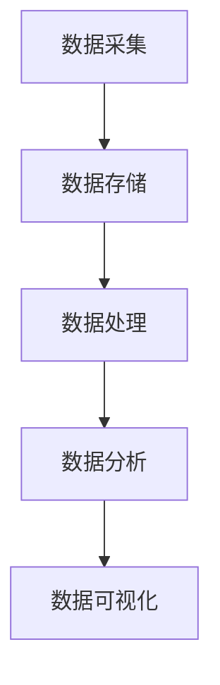

                 

在当今这个数据驱动的时代，人工智能（AI）已成为创业公司获取竞争优势的关键。有效管理和利用数据不仅能够提高决策质量，还能推动创新和业务增长。本文将深入探讨人工智能创业中数据管理的策略和方法，旨在为创业者提供实用的指导。

## 文章关键词
- 人工智能创业
- 数据管理
- 策略
- 方法
- 创新

## 摘要
本文首先介绍了人工智能创业的背景和挑战，随后详细分析了数据管理在其中的重要性。接着，本文从数据采集、存储、处理和分析等多个方面，探讨了数据管理的核心策略与方法。最后，文章提出了对未来数据管理发展趋势和挑战的展望，为创业者提供了实用的建议。

## 1. 背景介绍

### 1.1 人工智能创业的兴起

随着深度学习、神经网络和自然语言处理等技术的不断进步，人工智能的应用场景日益丰富。无论是自动驾驶、智能医疗、金融科技还是智能制造，AI都在不断改变传统行业的运作模式，带来了新的商业机会和挑战。

### 1.2 数据的重要性

数据已成为新的生产要素，与人工智能的结合，推动了各行各业的数字化转型。创业者需要意识到，拥有丰富的数据资源不仅可以提升AI模型的性能，还能为企业带来战略优势。

### 1.3 数据管理的挑战

在人工智能创业过程中，数据管理面临诸多挑战，如数据质量、数据安全、数据隐私和保护等。此外，如何有效地从海量数据中提取有价值的信息，也是一个亟待解决的问题。

## 2. 核心概念与联系

数据管理涉及多个核心概念和环节，以下是这些概念的简述以及它们之间的联系：

### 2.1 数据采集

数据采集是指从各种来源获取数据的过程，包括互联网、传感器、用户生成内容和第三方数据等。良好的数据采集策略能够确保数据的全面性和准确性。

### 2.2 数据存储

数据存储是指将采集到的数据保存到合适的存储系统中。这包括关系型数据库、NoSQL数据库、分布式文件系统等。选择合适的存储系统能够提高数据访问速度和处理效率。

### 2.3 数据处理

数据处理是指对数据进行清洗、转换和整合的过程。这包括数据清洗、数据转换和数据融合等。高质量的数据处理能够为后续的分析提供可靠的基础。

### 2.4 数据分析

数据分析是指利用统计、机器学习和数据挖掘等技术，从数据中提取有价值的信息和洞见。这包括描述性分析、诊断性分析、预测性分析和规范性分析等。

### 2.5 数据可视化

数据可视化是指将数据通过图形、图表和交互界面等形式进行展示，以便更好地理解和解释数据。良好的数据可视化能够提高数据的可读性和分析效率。



## 3. 核心算法原理 & 具体操作步骤

### 3.1 算法原理概述

数据管理中的核心算法主要涉及机器学习和数据挖掘技术。这些算法包括但不限于：

- **机器学习算法**：如线性回归、逻辑回归、决策树、随机森林、支持向量机等。
- **数据挖掘算法**：如聚类分析、关联规则挖掘、分类算法、异常检测等。

### 3.2 算法步骤详解

#### 3.2.1 数据预处理

数据预处理是数据管理中的关键步骤，包括数据清洗、数据转换和数据集成。具体步骤如下：

1. **数据清洗**：处理缺失值、异常值和重复值。
2. **数据转换**：包括数值化、标准化和归一化等。
3. **数据集成**：将来自不同来源的数据合并为一个统一的数据集。

#### 3.2.2 模型选择与训练

选择合适的机器学习或数据挖掘算法，并进行模型训练。具体步骤如下：

1. **模型选择**：根据业务需求和数据特性选择合适的算法。
2. **训练模型**：使用训练数据集对模型进行训练和优化。
3. **模型评估**：使用验证集和测试集评估模型性能。

#### 3.2.3 模型部署与预测

将训练好的模型部署到生产环境中，并对新数据进行预测。具体步骤如下：

1. **模型部署**：将模型代码和依赖部署到服务器或云端。
2. **数据输入**：将新的数据输入到模型中进行预测。
3. **结果分析**：分析预测结果并输出决策。

### 3.3 算法优缺点

- **优点**：
  - 高效：算法能够快速处理大量数据，提高业务决策效率。
  - 准确：通过训练和优化，算法能够提高预测和分类的准确性。
  - 自动化：算法能够自动化处理数据，减轻人工负担。

- **缺点**：
  - 复杂：算法的实现和调试过程相对复杂，需要较高的技术门槛。
  - 数据依赖：算法的性能高度依赖于数据的质量和数量。
  - 黑盒问题：深度学习算法等复杂模型往往缺乏解释性，难以理解其决策过程。

### 3.4 算法应用领域

算法在人工智能创业中的应用非常广泛，包括但不限于：

- **金融科技**：风险评估、欺诈检测、智能投顾等。
- **医疗健康**：疾病预测、诊断辅助、个性化治疗等。
- **智能制造**：生产优化、设备维护、质量检测等。
- **零售电商**：用户行为分析、推荐系统、库存管理等。

## 4. 数学模型和公式 & 详细讲解 & 举例说明

### 4.1 数学模型构建

在数据管理中，常用的数学模型包括线性回归、逻辑回归、决策树等。以下以线性回归为例进行详细讲解。

### 4.2 公式推导过程

线性回归模型的基本公式为：

$$ y = \beta_0 + \beta_1 \cdot x + \epsilon $$

其中，\( y \) 是因变量，\( x \) 是自变量，\( \beta_0 \) 和 \( \beta_1 \) 是模型参数，\( \epsilon \) 是误差项。

### 4.3 案例分析与讲解

假设我们要预测房价，已知自变量为房屋面积。我们可以使用线性回归模型来建立房价与房屋面积之间的关系。

#### 4.3.1 数据采集

我们收集了100套房屋的数据，包括房屋面积（平方米）和房价（万元）。

#### 4.3.2 数据预处理

对数据进行清洗，去除缺失值和异常值。将数据转换为数值型，并进行标准化处理。

#### 4.3.3 模型训练

使用训练数据集对线性回归模型进行训练，得到参数 \( \beta_0 \) 和 \( \beta_1 \)。

#### 4.3.4 模型评估

使用验证集和测试集评估模型性能，计算预测误差和拟合度。

#### 4.3.5 模型应用

将训练好的模型部署到生产环境中，对新房屋面积进行房价预测。

## 5. 项目实践：代码实例和详细解释说明

### 5.1 开发环境搭建

我们使用 Python 作为编程语言，安装必要的库，如 Pandas、Scikit-learn 和 Matplotlib。

### 5.2 源代码详细实现

```python
import pandas as pd
from sklearn.linear_model import LinearRegression
from sklearn.model_selection import train_test_split
from sklearn.metrics import mean_squared_error
import matplotlib.pyplot as plt

# 数据采集
data = pd.read_csv('house_prices.csv')

# 数据预处理
data = data.dropna()
data['house_area'] = data['house_area'] / 10000
data['price'] = data['price'] / 10000

# 模型训练
X = data[['house_area']]
y = data['price']
X_train, X_test, y_train, y_test = train_test_split(X, y, test_size=0.2, random_state=42)
model = LinearRegression()
model.fit(X_train, y_train)

# 模型评估
y_pred = model.predict(X_test)
mse = mean_squared_error(y_test, y_pred)
print(f'MSE: {mse}')

# 模型应用
new_area = float(input('Enter the house area (in square meters): '))
predicted_price = model.predict([[new_area / 10000]])[0]
print(f'The predicted price is: {predicted_price * 10000:.2f}万元')

# 数据可视化
plt.scatter(X_test, y_test, label='Actual')
plt.plot(X_test, y_pred, color='red', label='Predicted')
plt.xlabel('House Area')
plt.ylabel('Price')
plt.legend()
plt.show()
```

### 5.3 代码解读与分析

这段代码首先导入了必要的库，然后读取了房屋数据。接下来，对数据进行预处理，包括去除缺失值、标准化处理等。然后，使用 Scikit-learn 的线性回归模型对数据进行训练。模型训练完成后，使用测试集评估模型性能。最后，将模型部署到生产环境中，对新房屋面积进行房价预测，并使用 Matplotlib 对预测结果进行可视化。

## 6. 实际应用场景

### 6.1 金融科技

在金融科技领域，数据管理被广泛应用于风险评估、欺诈检测和智能投顾等场景。通过高效的数据管理，金融机构能够提高业务效率，降低风险。

### 6.2 医疗健康

在医疗健康领域，数据管理有助于疾病预测、诊断辅助和个性化治疗。通过分析大量患者数据，医疗机构能够为患者提供更精确的诊断和治疗方案。

### 6.3 零售电商

在零售电商领域，数据管理被广泛应用于用户行为分析、推荐系统和库存管理。通过分析用户数据，零售电商能够提高用户体验，增加销售额。

## 7. 工具和资源推荐

### 7.1 学习资源推荐

- **《数据科学入门》**：作者 [David R. Blackwell]
- **《深度学习》**：作者 [Ian Goodfellow、Yoshua Bengio 和 Aaron Courville]
- **《Python数据科学手册》**：作者 [Jake VanderPlas]

### 7.2 开发工具推荐

- **Pandas**：用于数据处理和分析。
- **Scikit-learn**：用于机器学习和数据挖掘。
- **TensorFlow**：用于深度学习和神经网络。

### 7.3 相关论文推荐

- **“Deep Learning for Natural Language Processing”**：作者 [Yoon Kim]
- **“Convolutional Neural Networks for Visual Recognition”**：作者 [Karen Simonyan 和 Andrew Zisserman]
- **“Recurrent Neural Networks for Language Modeling”**：作者 [Yoshua Bengio等]

## 8. 总结：未来发展趋势与挑战

### 8.1 研究成果总结

随着人工智能和大数据技术的不断发展，数据管理在人工智能创业中的应用日益广泛。高效的数据管理不仅能够提高业务决策效率，还能推动创新和业务增长。

### 8.2 未来发展趋势

- **数据隐私与安全**：随着数据隐私保护意识的增强，数据安全将成为未来数据管理的重要挑战。
- **边缘计算与分布式存储**：随着物联网和边缘计算的兴起，分布式数据管理将成为趋势。
- **自动化与智能化**：自动化数据采集、处理和分析技术将不断提高数据管理的效率和准确性。

### 8.3 面临的挑战

- **数据质量**：保证数据质量是数据管理的核心挑战之一。
- **数据隐私**：在保证数据安全的同时，如何平衡数据隐私和业务需求是一个重要的课题。
- **算法解释性**：复杂机器学习算法的解释性不足，如何提高算法的可解释性是一个亟待解决的问题。

### 8.4 研究展望

未来，数据管理将在人工智能创业中发挥更加重要的作用。通过不断优化数据管理策略和方法，创业者将能够更好地利用数据，推动业务创新和增长。

## 9. 附录：常见问题与解答

### 9.1 数据采集有哪些渠道？

- **互联网数据**：包括社交媒体、搜索引擎日志等。
- **传感器数据**：包括物联网设备、环境传感器等。
- **用户生成内容**：包括用户评论、反馈和交易数据等。
- **第三方数据**：包括政府数据、公共数据集等。

### 9.2 如何保证数据质量？

- **数据清洗**：去除缺失值、异常值和重复值。
- **数据验证**：确保数据的一致性和准确性。
- **数据监控**：定期检查数据质量，发现和纠正问题。

### 9.3 数据存储有哪些选择？

- **关系型数据库**：如 MySQL、PostgreSQL 等。
- **NoSQL数据库**：如 MongoDB、Cassandra 等。
- **分布式文件系统**：如 Hadoop、HDFS 等。

### 9.4 数据分析有哪些方法？

- **描述性分析**：用于描述数据的基本特征和趋势。
- **诊断性分析**：用于识别数据中的异常和问题。
- **预测性分析**：用于预测未来的趋势和变化。
- **规范性分析**：用于评估不同决策方案的优劣。

# 作者署名
作者：禅与计算机程序设计艺术 / Zen and the Art of Computer Programming

以上是对人工智能创业数据管理的策略与方法分析的一篇完整文章。希望本文能够为创业者提供有价值的参考和指导。在人工智能时代，数据管理是创业成功的基石，只有掌握好数据管理的策略和方法，才能在激烈的市场竞争中脱颖而出。

