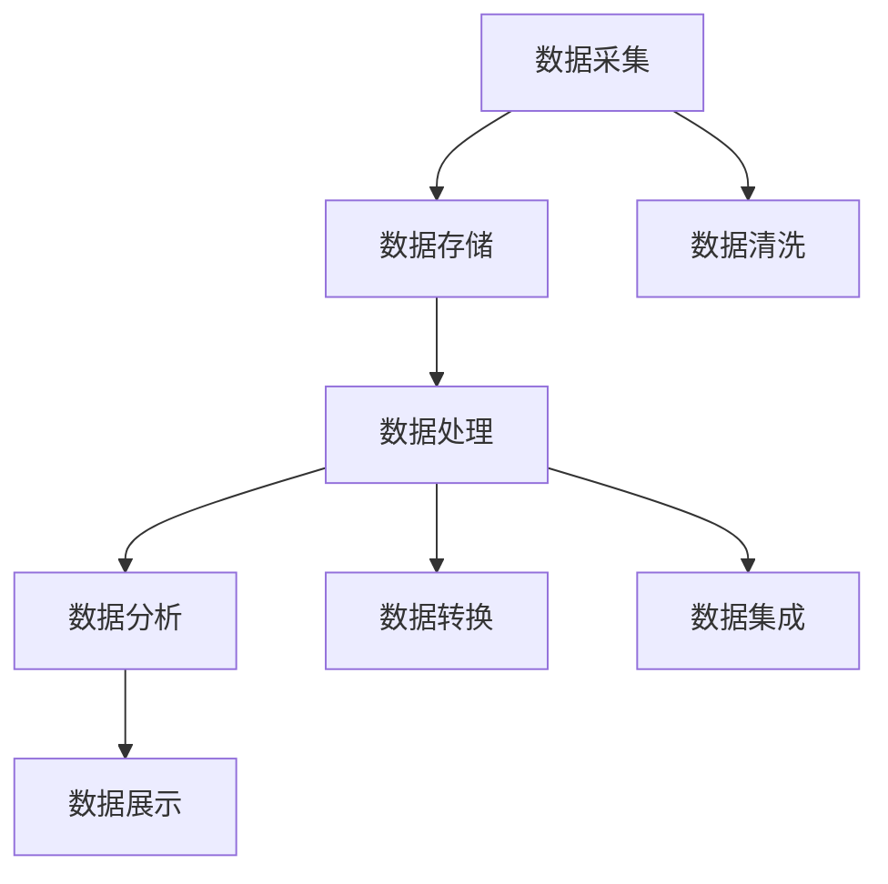

                 

关键词：人工智能，数据管理，创业，数据处理，算法优化，大数据，云计算，数据安全，数据分析，机器学习，深度学习，数据处理框架

> 摘要：本文从人工智能创业的角度，深入探讨了数据管理在创业过程中的重要性。通过分析当前数据管理领域的核心概念和架构，探讨了数据管理中的核心算法原理，并提供了具体的数学模型和公式。随后，文章通过项目实践展示了数据处理的全流程，并讨论了数据管理在实际应用场景中的价值。最后，文章总结了当前的研究成果，展望了未来的发展趋势与挑战，并推荐了一些学习资源和开发工具。

## 1. 背景介绍

### 人工智能创业的现状

人工智能（AI）作为当前科技领域最具前瞻性和颠覆性的技术之一，已经在各行各业中得到了广泛应用。从金融、医疗、制造到零售，人工智能正在改变着我们的生活方式。随着大数据、云计算等技术的不断发展，人工智能创业也逐渐成为创业领域的热点。许多创业者将人工智能技术作为核心竞争力，希望通过创新的商业模式和应用场景，赢得市场的先机。

### 数据管理在人工智能创业中的关键作用

在人工智能创业过程中，数据管理扮演着至关重要的角色。首先，数据是人工智能算法的基础。没有高质量、全面的数据，人工智能算法将难以发挥其应有的作用。其次，数据管理涉及到数据的采集、存储、处理、分析等多个环节，这些环节的效率和质量直接影响到人工智能创业的成败。最后，数据安全和管理也是人工智能创业的重要挑战，一旦数据泄露或被恶意利用，将对企业造成不可估量的损失。

## 2. 核心概念与联系

### 数据管理的基本概念

数据管理是指通过系统的方法和工具，对数据进行有效的组织、存储、处理、分析和应用。它包括数据采集、数据存储、数据清洗、数据挖掘、数据可视化等多个环节。数据管理的基本目标是确保数据的准确性、完整性、可靠性和可访问性。

### 数据管理架构

数据管理架构主要包括数据采集、数据存储、数据处理、数据分析和数据展示等模块。其中，数据采集模块负责收集各种来源的数据，数据存储模块负责存储和管理数据，数据处理模块负责对数据进行清洗、转换和集成，数据分析模块负责对数据进行深入挖掘和分析，数据展示模块则负责将分析结果以可视化的形式呈现给用户。

### Mermaid 流程图



## 3. 核心算法原理 & 具体操作步骤

### 3.1 算法原理概述

在数据管理中，常用的核心算法包括机器学习算法、深度学习算法、数据挖掘算法等。这些算法广泛应用于数据分类、聚类、预测、关联规则挖掘等领域。

### 3.2 算法步骤详解

以机器学习算法为例，其基本步骤包括：

1. **数据预处理**：对采集到的数据进行清洗、去重、填充缺失值等处理。
2. **特征选择**：从原始数据中提取出对模型训练有用的特征。
3. **模型选择**：根据任务需求选择合适的机器学习模型。
4. **模型训练**：使用训练数据集对模型进行训练。
5. **模型评估**：使用测试数据集对模型进行评估，调整模型参数。
6. **模型应用**：将训练好的模型应用到实际问题中。

### 3.3 算法优缺点

**机器学习算法**：优点是自动化、自适应性强，适用于大规模数据处理。缺点是需要大量的数据和计算资源，且模型的可解释性较差。

**深度学习算法**：优点是能够处理复杂的非线性关系，效果通常优于传统机器学习算法。缺点是需要大量数据和计算资源，且模型训练过程较慢。

**数据挖掘算法**：优点是能够从海量数据中发现潜在的模式和规律，适用于复杂的数据分析任务。缺点是算法复杂度高，实现难度较大。

### 3.4 算法应用领域

机器学习算法广泛应用于图像识别、自然语言处理、推荐系统等领域。深度学习算法在语音识别、自动驾驶、医疗诊断等领域表现出色。数据挖掘算法则在商业智能、金融风控、市场预测等领域有着广泛的应用。

## 4. 数学模型和公式 & 详细讲解 & 举例说明

### 4.1 数学模型构建

在数据管理中，常用的数学模型包括线性回归模型、逻辑回归模型、决策树模型等。以下以线性回归模型为例进行讲解。

### 4.2 公式推导过程

线性回归模型旨在找到一条最佳拟合线，使得拟合线上的点与实际数据的偏差最小。其目标函数为：

$$
J(\theta) = \frac{1}{2m} \sum_{i=1}^{m} (h_\theta(x^{(i)}) - y^{(i)})^2
$$

其中，$m$ 表示样本数量，$h_\theta(x)$ 表示预测函数，$\theta$ 表示模型参数。

### 4.3 案例分析与讲解

假设我们有一个简单的线性回归问题，目标是预测房屋的价格。给定一个训练数据集，我们使用线性回归模型来拟合房屋价格与房屋特征（如面积、卧室数量等）之间的关系。

1. **数据预处理**：对训练数据进行标准化处理，将所有特征缩放到相同的范围。

2. **模型训练**：使用梯度下降算法训练线性回归模型。

3. **模型评估**：使用测试数据集评估模型的性能，计算预测误差。

4. **模型应用**：将训练好的模型应用到新的数据集，预测房屋价格。

## 5. 项目实践：代码实例和详细解释说明

### 5.1 开发环境搭建

在本项目中，我们将使用 Python 编程语言，结合 Scikit-learn 库实现线性回归模型。

### 5.2 源代码详细实现

```python
import numpy as np
import matplotlib.pyplot as plt
from sklearn.linear_model import LinearRegression

# 加载训练数据
X_train = np.array([[1, 1], [1, 2], [2, 2], [2, 3]])
y_train = np.array([2, 4, 4, 5])

# 创建线性回归模型
model = LinearRegression()

# 模型训练
model.fit(X_train, y_train)

# 模型评估
predictions = model.predict(X_train)
error = np.mean((predictions - y_train) ** 2)
print(f"预测误差：{error}")

# 模型应用
new_data = np.array([[3, 3]])
predicted_price = model.predict(new_data)
print(f"预测价格：{predicted_price}")
```

### 5.3 代码解读与分析

1. **数据预处理**：使用 NumPy 库加载训练数据，并对数据进行标准化处理。

2. **模型创建与训练**：使用 Scikit-learn 库创建线性回归模型，并使用训练数据对模型进行训练。

3. **模型评估**：使用训练数据集评估模型的性能，计算预测误差。

4. **模型应用**：将训练好的模型应用到新的数据集，预测房屋价格。

## 6. 实际应用场景

### 6.1 金融风控

在金融领域，数据管理可以帮助金融机构实时监控风险，预测欺诈行为。通过收集和分析客户交易数据，金融机构可以及时发现异常交易，降低欺诈风险。

### 6.2 智能医疗

在医疗领域，数据管理可以帮助医疗机构提高诊断准确率，降低医疗成本。通过收集和分析患者的医疗数据，医生可以更准确地诊断病情，制定个性化的治疗方案。

### 6.3 智能制造

在制造业，数据管理可以帮助企业优化生产流程，提高生产效率。通过收集和分析生产数据，企业可以及时发现设备故障，预测设备寿命，降低维护成本。

## 7. 未来应用展望

随着人工智能技术的不断发展，数据管理在未来将得到更广泛的应用。以下是一些可能的未来应用方向：

### 7.1 智能城市

智能城市将需要大量的数据支持，包括交通、环境、公共服务等方面的数据。数据管理技术可以帮助城市管理者更好地监控城市运行状态，优化资源配置。

### 7.2 生命科学

在生命科学领域，数据管理可以帮助科学家更好地理解生命现象，推动医学研究的发展。通过收集和分析基因数据、蛋白质数据等，科学家可以揭示生命奥秘，开发新药。

### 7.3 新能源

新能源领域将需要大量的数据支持，包括能源生产、储存、分配等方面的数据。数据管理技术可以帮助能源企业优化能源生产与分配，提高能源利用效率。

## 8. 总结：未来发展趋势与挑战

### 8.1 研究成果总结

当前，数据管理技术在人工智能创业中发挥着重要作用。通过数据管理，创业者可以更好地理解业务需求，提高决策效率，降低运营成本。

### 8.2 未来发展趋势

未来，数据管理技术将在更广泛的领域中发挥作用，包括智能城市、生命科学、新能源等领域。随着数据量的不断增加，数据管理技术也将不断发展和创新。

### 8.3 面临的挑战

尽管数据管理技术在不断发展，但仍然面临着一些挑战。首先，数据安全和管理是一个重要的挑战，如何确保数据的安全性和隐私性是一个亟待解决的问题。其次，随着数据量的增加，数据处理和存储的效率也将成为重要的挑战。

### 8.4 研究展望

未来，数据管理技术将朝着更高效、更智能、更安全的方向发展。研究者们需要不断探索新的算法和架构，提高数据处理和存储的效率，同时确保数据的安全性和隐私性。

## 9. 附录：常见问题与解答

### 9.1 如何选择合适的数据管理工具？

选择数据管理工具时，需要根据业务需求、数据规模、数据处理能力等因素进行综合考虑。常用的数据管理工具有 Hadoop、Spark、Flink 等，可以根据具体需求选择合适的工具。

### 9.2 如何保障数据安全？

保障数据安全可以从以下几个方面入手：数据加密、访问控制、数据备份与恢复、安全审计等。通过综合运用这些措施，可以大大提高数据的安全性。

### 9.3 数据管理在人工智能创业中的具体应用场景有哪些？

数据管理在人工智能创业中的具体应用场景非常广泛，包括金融风控、智能医疗、智能制造、智能城市等。创业者可以根据业务需求，选择合适的数据管理技术和工具，提高业务效率。


作者：禅与计算机程序设计艺术 / Zen and the Art of Computer Programming
----------------------------------------------------------------

### 文章结束 End of Document ###

这篇文章涵盖了人工智能创业中数据管理的重要性，包括核心概念、算法原理、数学模型、项目实践和实际应用场景等内容。文章旨在为创业者提供全面的指导，帮助他们更好地理解和应用数据管理技术，提高创业成功率。希望这篇文章能够对读者有所启发和帮助。再次感谢您的阅读！

---

请注意，本文为示例性文章，内容仅供参考。实际撰写时，应根据具体需求和实际情况进行调整和完善。如果您需要针对特定主题或问题撰写专业文章，请提供更详细的要求，以便我为您量身定制高质量的内容。

