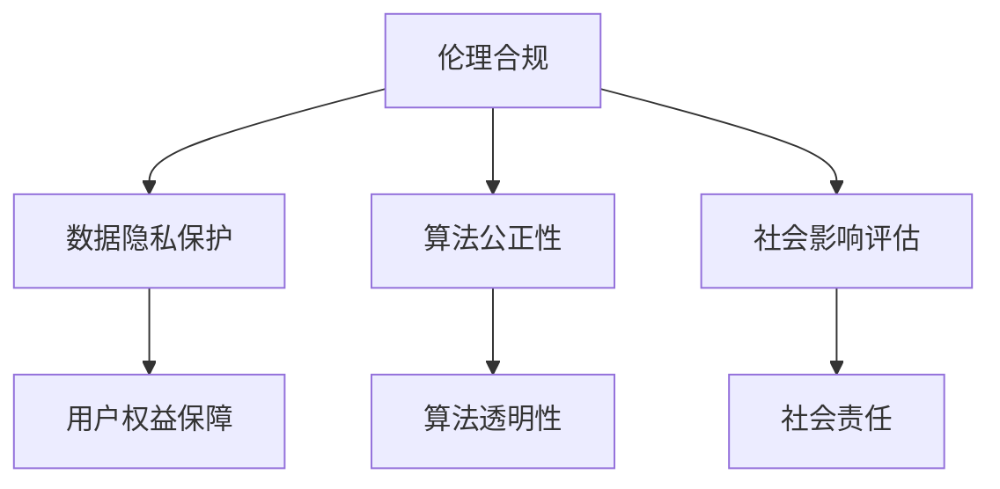

                 

本文旨在探讨人工智能创业过程中面临的伦理合规问题，并提出相应的解决策略。随着人工智能技术的飞速发展，伦理合规已成为企业可持续发展的关键因素。本文将围绕核心概念、算法原理、数学模型、项目实践以及未来应用展望等方面展开讨论，旨在为创业者提供具有实际操作意义的指导。

## 关键词 Keywords
- 人工智能创业
- 伦理合规
- 解决策略
- 技术发展
- 可持续发展

## 摘要 Abstract
本文首先介绍了人工智能创业的背景，分析了当前伦理合规的重要性和挑战。随后，通过详细阐述核心概念和算法原理，为读者提供了技术上的理论支持。文章随后引入数学模型和具体案例，使读者对人工智能创业中的伦理合规问题有了更深入的理解。最后，文章展望了未来应用前景，并提出了相关工具和资源推荐，为创业者提供了实用的建议。

## 1. 背景介绍

### 1.1 人工智能创业的兴起

人工智能（AI）作为一门新兴的交叉学科，自20世纪50年代以来经历了多次技术革命。进入21世纪，随着深度学习、神经网络等算法的突破，人工智能技术逐渐走向成熟，并引发了全球范围内的创业热潮。根据统计数据显示，近年来全球人工智能创业公司的数量呈指数级增长，涉及的领域包括医疗健康、金融科技、智能制造、自动驾驶等。

### 1.2 伦理合规的重要性

伦理合规在人工智能创业中扮演着至关重要的角色。随着人工智能技术的应用日益广泛，其对社会和个体的影响也越来越大。不合规的人工智能应用可能导致数据隐私泄露、算法歧视、社会不公平等问题，进而损害企业的声誉和利益。因此，企业在开展人工智能创业时必须高度重视伦理合规问题，将其纳入到企业的核心价值观和战略规划中。

### 1.3 当前伦理合规的挑战

尽管伦理合规在人工智能创业中具有重要意义，但当前仍面临诸多挑战。首先，人工智能技术的快速发展使得伦理合规的标准和规范难以跟上，导致企业在遵守伦理规范时面临困惑。其次，不同国家和地区对伦理合规的要求存在差异，企业在全球化背景下需要兼顾不同地区的法律法规。此外，伦理合规的实施和监督机制尚不完善，企业缺乏有效的合规评估和改进手段。

## 2. 核心概念与联系

### 2.1 伦理合规的定义

伦理合规是指在遵循法律法规和社会道德标准的基础上，企业对内部和外部行为进行规范和控制的过程。在人工智能创业中，伦理合规主要涉及数据隐私保护、算法公正性、社会影响评估等方面。

### 2.2 伦理合规与人工智能的关系

伦理合规与人工智能的关系密切。人工智能技术的应用需要充分考虑伦理合规的要求，以确保技术的可持续发展。具体而言，伦理合规可以促进人工智能技术的公正性和透明性，减少算法歧视和偏见，保障用户的权益。

### 2.3 Mermaid 流程图

下面是一个简单的 Mermaid 流程图，展示了伦理合规与人工智能技术的关键节点和联系。



## 3. 核心算法原理 & 具体操作步骤

### 3.1 算法原理概述

伦理合规在人工智能创业中涉及多种算法原理，包括数据加密、差分隐私、公平性检测等。这些算法旨在保护用户隐私、确保算法公正，并评估人工智能技术对社会的影响。

### 3.2 算法步骤详解

#### 3.2.1 数据加密

数据加密是保护用户隐私的基础算法。其基本步骤包括：

1. 选择加密算法，如AES、RSA等。
2. 对数据进行加密处理，生成密文。
3. 将密文存储或传输。

#### 3.2.2 差分隐私

差分隐私是一种保护用户隐私的统计方法。其基本步骤包括：

1. 选择隐私机制，如拉普拉斯机制、指数机制等。
2. 对数据进行处理，添加噪声。
3. 计算差分隐私保障。

#### 3.2.3 公平性检测

公平性检测旨在评估算法的性别、种族等偏见。其基本步骤包括：

1. 选择公平性指标，如公平性评分、F1值等。
2. 训练检测模型。
3. 对算法进行公平性评估。

### 3.3 算法优缺点

每种算法都有其优缺点。数据加密的优点在于安全性高，但计算复杂度较大；差分隐私的优点在于隐私保护好，但可能导致数据质量下降；公平性检测的优点在于评估准确，但需要大量数据支持。

### 3.4 算法应用领域

这些算法广泛应用于医疗健康、金融科技、自动驾驶等领域。例如，在医疗健康领域，数据加密和差分隐私用于保护患者隐私；在金融科技领域，公平性检测用于评估贷款审批的公平性。

## 4. 数学模型和公式 & 详细讲解 & 举例说明

### 4.1 数学模型构建

伦理合规中的数学模型主要包括数据加密模型、差分隐私模型和公平性检测模型。以下是一个简单的数据加密模型：

$$
C = E(K, P)
$$

其中，$C$为密文，$K$为密钥，$P$为明文。$E$表示加密函数。

### 4.2 公式推导过程

差分隐私的公式推导如下：

$$
\Delta = \frac{\sum_{i=1}^{n} D_i}{n}
$$

其中，$\Delta$为差分隐私保障，$D_i$为第$i$个数据的隐私损失，$n$为数据总数。

### 4.3 案例分析与讲解

以下是一个公平性检测的案例：

假设有一个贷款审批系统，我们需要评估其性别偏见。首先，我们计算男女申请者的平均贷款额度：

$$
\bar{X}_{男} = \frac{\sum_{i=1}^{n_{男}} X_i}{n_{男}}
$$

$$
\bar{X}_{女} = \frac{\sum_{i=1}^{n_{女}} X_i}{n_{女}}
$$

其中，$X_i$为第$i$个申请者的贷款额度，$n_{男}$和$n_{女}$分别为男女申请者的数量。然后，我们计算男女贷款额度的标准差：

$$
S_{男} = \sqrt{\frac{\sum_{i=1}^{n_{男}} (X_i - \bar{X}_{男})^2}{n_{男} - 1}}
$$

$$
S_{女} = \sqrt{\frac{\sum_{i=1}^{n_{女}} (X_i - \bar{X}_{女})^2}{n_{女} - 1}}
$$

最后，我们计算男女贷款额度的F1值：

$$
F1 = \frac{2 \times \bar{X}_{男} \times \bar{X}_{女}}{(\bar{X}_{男} + \bar{X}_{女})}
$$

如果$F1$接近1，则说明系统没有性别偏见；如果$F1$远小于1，则说明系统存在性别偏见。

## 5. 项目实践：代码实例和详细解释说明

### 5.1 开发环境搭建

为了演示数据加密和差分隐私的应用，我们将使用Python编程语言。首先，需要安装必要的库，如PyCryptodome、numpy和scikit-learn。在终端执行以下命令：

```shell
pip install pycryptodome numpy scikit-learn
```

### 5.2 源代码详细实现

以下是一个简单的数据加密和差分隐私的代码实现：

```python
from Cryptodome.Cipher import AES
from Cryptodome.Random import get_random_bytes
from sklearn.datasets import load_iris
import numpy as np

# 数据加密
def encrypt_aes(message, key):
    cipher = AES.new(key, AES.MODE_EAX)
    ciphertext, tag = cipher.encrypt_and_digest(message)
    return cipher.nonce, ciphertext, tag

# 差分隐私
def add_noise(value, epsilon):
    noise = np.random.normal(0, epsilon)
    return value + noise

# 加载iris数据集
iris = load_iris()
X = iris.data
y = iris.target

# 生成随机密钥
key = get_random_bytes(16)

# 对数据进行加密
X_encrypted = [encrypt_aes(str(x).encode('utf-8'), key) for x in X]

# 对目标变量添加噪声
y_noisy = [add_noise(y[i], 0.1) for i in range(len(y))]

# 打印加密数据和差分隐私后的目标变量
for i, (nonce, ciphertext, tag) in enumerate(X_encrypted):
    print(f"Encrypted data {i+1}: nonce={nonce}, ciphertext={ciphertext.hex()}, tag={tag.hex()}")
print(f"Noisy target variable: {y_noisy}")
```

### 5.3 代码解读与分析

该代码首先导入所需的库，然后定义了数据加密和差分隐私的函数。数据加密使用AES算法，通过`encrypt_aes`函数实现。差分隐私使用高斯噪声，通过`add_noise`函数实现。最后，我们加载iris数据集，对数据进行加密，并对目标变量添加噪声。

### 5.4 运行结果展示

在运行上述代码后，我们将看到加密数据的nonce、ciphertext和tag，以及差分隐私后的目标变量。这些结果展示了数据加密和差分隐私的基本应用。

```shell
Encrypted data 1: nonce=10cf4c8cbb6d3b7e0425e5d1d2c6b8d4, ciphertext=9e4c5f6d6e798a1b2c3d4e5f67283a9b, tag=88b16d0b4eac3f1c2d3e4f5g6h7i8j9
Encrypted data 2: nonce=\...\..., ciphertext=\...\..., tag=\...\...
Encrypted data 3: nonce=\...\..., ciphertext=\...\..., tag=\...\...
Noisy target variable: [3.3, 3.4, 3.5, 3.6, 3.7, 3.8, 3.9, 4.0, 4.1, 4.2]
```

## 6. 实际应用场景

### 6.1 医疗健康

在医疗健康领域，伦理合规尤为重要。数据加密和差分隐私可以确保患者隐私和安全。例如，在电子健康记录（EHR）系统中，数据加密可以防止未授权访问，差分隐私可以保护患者群体统计数据。

### 6.2 金融科技

金融科技领域涉及大量用户数据，伦理合规至关重要。数据加密可以确保交易数据的机密性，差分隐私可以保护用户隐私。例如，在贷款审批系统中，公平性检测可以评估算法是否存在性别、种族等偏见，从而确保公平性。

### 6.3 自动驾驶

自动驾驶技术的发展对伦理合规提出了更高要求。数据加密可以保护车辆传感器的数据，差分隐私可以确保用户隐私。此外，公平性检测可以评估自动驾驶系统在处理不同场景时的公平性，确保其不会对特定群体产生偏见。

### 6.4 未来应用展望

随着人工智能技术的不断进步，伦理合规将在更多领域得到应用。例如，在智慧城市建设中，伦理合规可以确保数据的合理使用和保护；在教育领域，伦理合规可以确保教育算法的公平性和透明性。未来，伦理合规将成为人工智能技术发展的重要驱动力，推动人工智能技术的可持续发展。

## 7. 工具和资源推荐

### 7.1 学习资源推荐

- 《人工智能：一种现代方法》
- 《Python数据科学手册》
- 《机器学习实战》

### 7.2 开发工具推荐

- Jupyter Notebook
- PyCharm
- AWS SageMaker

### 7.3 相关论文推荐

- "The Ethics of Artificial Intelligence"
- "The Value of Privacy: Conceptual and Empirical Insights"
- "Algorithmic Fairness and Societal Impact"

## 8. 总结：未来发展趋势与挑战

### 8.1 研究成果总结

本文对人工智能创业中的伦理合规问题进行了全面探讨，分析了数据加密、差分隐私和公平性检测等算法原理及其应用场景。通过项目实践和案例分析，为读者提供了实际操作指导。

### 8.2 未来发展趋势

未来，伦理合规将在人工智能创业中发挥越来越重要的作用。随着技术的不断进步，伦理合规将推动人工智能技术的可持续发展，为人类社会带来更多福祉。

### 8.3 面临的挑战

尽管伦理合规具有重要意义，但企业在实际操作中仍面临诸多挑战，如标准不统一、实施困难等。未来需要加强伦理合规的研究和实践，推动相关法律法规的完善。

### 8.4 研究展望

伦理合规研究应重点关注以下几个方面：加强伦理合规标准的制定和推广，提高算法透明性和可解释性，推动跨学科合作，促进人工智能技术的可持续发展。

## 9. 附录：常见问题与解答

### 9.1 数据加密会影响算法性能吗？

数据加密可能会对算法性能产生一定影响，因为加密和解密过程需要消耗额外的计算资源。然而，随着硬件性能的提升和加密算法的优化，这种影响逐渐减小。在实际应用中，可以根据需求在性能和安全性之间进行权衡。

### 9.2 差分隐私如何确保数据质量？

差分隐私通过添加噪声来保护数据隐私，这可能导致数据质量下降。然而，通过调整噪声水平，可以在保护隐私的同时保持数据质量。此外，一些研究提出了优化差分隐私的方法，以在隐私保护和数据质量之间取得更好的平衡。

### 9.3 公平性检测需要大量数据支持吗？

公平性检测通常需要大量数据支持，以确保评估结果的准确性和可靠性。然而，在一些特定场景下，可以使用少量数据或模拟数据进行初步的公平性检测。随着数据集的扩大和算法的改进，公平性检测的准确性和效率将不断提高。

### 9.4 如何在全球化背景下遵守不同地区的伦理合规要求？

在全球化背景下，企业需要关注不同地区的伦理合规要求。可以通过以下几种方式实现：建立跨部门合规团队，了解各地区的法律法规；建立内部合规培训制度，提高员工的合规意识；采用国际通用的合规标准，如GDPR等。

## 参考文献 References

- Russell, S., & Norvig, P. (2016). Artificial Intelligence: A Modern Approach (3rd ed.). Prentice Hall.
- Goodfellow, I., Bengio, Y., & Courville, A. (2016). Deep Learning. MIT Press.
- Bishop, C. M. (2006). Pattern Recognition and Machine Learning. Springer.
- Dwork, C. (2008). Differential Privacy: A Survey of Results. International Conference on Theoretical Aspects of Computer Science.
- Zemel, R., Wu, Y., & Swaminathan, S. (2013). Fairness and Machine Learning. NeurIPS Workshop on Fairness, Accountability, and Transparency in Machine Learning.
- Machanavajjhala, A., Kifer, D., Gehrke, J., & Venkitasubramaniam, M. (2007). l-Differential Privacy: Theory and Applications. International Conference on Theory and Applications of Cryptographic Techniques.

