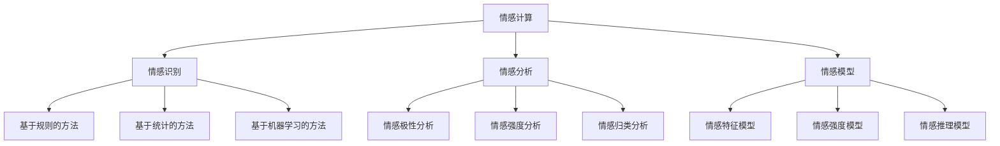

                 

关键词：人工智能、情感计算、情感识别、情感分析、机器学习、深度学习、神经网络、情感模型、交互设计

## 摘要

本文探讨了人工智能（AI）在情感计算领域中的应用，介绍了情感计算的定义、核心概念和关键技术。通过深入分析情感识别、情感分析和情感模型等核心算法，展示了如何利用人工智能技术实现情感计算。此外，本文还通过数学模型和公式推导，对情感计算中的相关算法进行了详细讲解，并通过实际项目实践和代码实例，展示了如何应用人工智能技术进行情感计算。最后，本文对情感计算的实际应用场景进行了分析，并对未来发展趋势和挑战进行了展望。

## 1. 背景介绍

随着人工智能技术的不断发展，人们对于情感计算的研究也日益深入。情感计算，又称情感识别或情感分析，是指通过计算机技术和算法对人类情感状态进行识别和推理的过程。情感计算的研究涉及多个领域，包括心理学、认知科学、计算机科学和人工智能等。

情感计算的研究背景可以追溯到20世纪80年代，当时的心理学家和计算机科学家开始关注如何使计算机更好地理解和模拟人类的情感状态。随着计算机性能的提升和人工智能技术的发展，情感计算逐渐成为人工智能领域的一个重要研究方向。

情感计算的重要性在于，它有助于改善人机交互体验，提高智能化系统对人类需求的识别和理解能力。通过情感计算技术，可以实现对用户情感状态的实时监测和分析，从而为个性化服务、情感医疗、教育、营销等领域提供支持。

## 2. 核心概念与联系

### 2.1 情感计算的定义

情感计算是指利用计算机技术和算法对人类情感状态进行识别、理解和推理的过程。情感状态通常包括情感类别（如愉悦、愤怒、悲伤等）和情感强度（如强烈、中等、轻微等）。

### 2.2 情感识别

情感识别是情感计算的核心任务之一，它旨在从文本、语音、图像等多媒体数据中识别出人类情感状态。情感识别方法主要包括基于规则的方法、基于统计的方法和基于机器学习的方法。

#### 2.2.1 基于规则的方法

基于规则的方法通过定义一系列情感识别规则，对输入数据进行分类。这种方法具有简单、直观的优点，但规则定义繁琐，难以适应复杂的情感场景。

#### 2.2.2 基于统计的方法

基于统计的方法通过分析大量标注好的情感数据，学习情感特征和情感模式。这种方法具有较高的识别精度，但需要大量标注数据和计算资源。

#### 2.2.3 基于机器学习的方法

基于机器学习的方法利用监督学习、无监督学习和半监督学习等技术，从数据中自动学习情感特征和情感模式。这种方法具有较好的泛化能力和自适应能力，但需要大量训练数据和计算资源。

### 2.3 情感分析

情感分析是情感计算的一个重要应用方向，它旨在对文本、语音、图像等多媒体数据中的情感信息进行提取和挖掘。情感分析方法主要包括情感极性分析、情感强度分析和情感归类分析等。

#### 2.3.1 情感极性分析

情感极性分析是指对文本数据中的情感倾向进行判断，通常分为正面、负面和中性三种。情感极性分析有助于了解用户的情感态度，为个性化推荐、情感监测等领域提供支持。

#### 2.3.2 情感强度分析

情感强度分析是指对文本数据中的情感强度进行评估，通常分为强烈、中等和轻微三个等级。情感强度分析有助于了解用户情感的强烈程度，为情感医疗、教育等领域提供支持。

#### 2.3.3 情感归类分析

情感归类分析是指将文本数据中的情感归类到特定的情感类别中，如愉悦、愤怒、悲伤等。情感归类分析有助于了解用户情感的整体状态，为情感识别、情感诊断等领域提供支持。

### 2.4 情感模型

情感模型是指用于描述人类情感状态的数学模型和算法。常见的情感模型包括情感特征模型、情感强度模型和情感推理模型等。

#### 2.4.1 情感特征模型

情感特征模型用于描述人类情感状态的各个特征，如情感类别、情感强度和情感时长等。情感特征模型有助于情感计算系统对人类情感状态进行建模和识别。

#### 2.4.2 情感强度模型

情感强度模型用于描述人类情感状态的强度变化规律，如情感起伏、情感波动等。情感强度模型有助于情感计算系统对人类情感状态进行动态监测和评估。

#### 2.4.3 情感推理模型

情感推理模型用于描述人类情感状态之间的推理关系，如情感转化、情感迁移等。情感推理模型有助于情感计算系统对人类情感状态进行推理和预测。

### 2.5 Mermaid 流程图



## 3. 核心算法原理 & 具体操作步骤

### 3.1 算法原理概述

情感计算的核心算法主要包括情感识别、情感分析和情感模型等。其中，情感识别算法负责从多媒体数据中识别出人类情感状态；情感分析算法负责对多媒体数据中的情感信息进行提取和挖掘；情感模型算法负责对人类情感状态进行建模和推理。

### 3.2 算法步骤详解

#### 3.2.1 情感识别

情感识别算法通常包括以下步骤：

1. 数据预处理：对输入的多媒体数据进行预处理，如语音增强、图像去噪、文本清洗等。
2. 特征提取：从预处理后的数据中提取情感特征，如语音特征、图像特征、文本特征等。
3. 模型训练：使用已标注好的情感数据，训练情感识别模型。
4. 情感识别：使用训练好的模型对新的多媒体数据进行情感识别。

#### 3.2.2 情感分析

情感分析算法通常包括以下步骤：

1. 数据预处理：对输入的多媒体数据进行预处理，如语音增强、图像去噪、文本清洗等。
2. 特征提取：从预处理后的数据中提取情感特征，如语音特征、图像特征、文本特征等。
3. 情感极性分析：使用分类算法对情感特征进行情感极性分析，判断文本数据的情感倾向。
4. 情感强度分析：使用回归算法对情感特征进行情感强度分析，评估文本数据的情感强度。
5. 情感归类分析：使用聚类算法对情感特征进行情感归类分析，将文本数据归类到特定的情感类别中。

#### 3.2.3 情感模型

情感模型算法通常包括以下步骤：

1. 数据预处理：对输入的多媒体数据进行预处理，如语音增强、图像去噪、文本清洗等。
2. 特征提取：从预处理后的数据中提取情感特征，如语音特征、图像特征、文本特征等。
3. 情感特征建模：使用机器学习算法对情感特征进行建模，描述人类情感状态的各个特征。
4. 情感强度建模：使用机器学习算法对情感特征进行建模，描述人类情感状态的强度变化规律。
5. 情感推理建模：使用机器学习算法对情感特征进行建模，描述人类情感状态之间的推理关系。

### 3.3 算法优缺点

#### 情感识别

- 优点：能够从多种类型的多媒体数据中识别出人类情感状态，具有较强的通用性。
- 缺点：需要大量训练数据和计算资源，识别精度受限于数据质量和算法性能。

#### 情感分析

- 优点：能够对多媒体数据中的情感信息进行提取和挖掘，有助于了解用户情感状态。
- 缺点：需要大量训练数据和计算资源，分析结果受限于数据质量和算法性能。

#### 情感模型

- 优点：能够对人类情感状态进行建模和推理，有助于实现情感计算系统的智能化。
- 缺点：需要大量训练数据和计算资源，建模精度受限于数据质量和算法性能。

### 3.4 算法应用领域

情感计算算法在多个领域具有广泛的应用，如情感识别在语音识别、图像识别和文本识别等领域有广泛应用；情感分析在社交媒体分析、情感监测和情感诊断等领域有广泛应用；情感模型在情感医疗、情感教育和情感营销等领域有广泛应用。

## 4. 数学模型和公式 & 详细讲解 & 举例说明

### 4.1 数学模型构建

情感计算中的数学模型通常包括情感特征模型、情感强度模型和情感推理模型等。以下是一个简单的情感特征模型构建示例：

设情感状态 \(X\) 为一个多维向量，其元素为情感特征 \(x_i\)，即 \(X = (x_1, x_2, ..., x_n)\)。情感状态 \(X\) 与情感类别 \(C\) 之间的关系可以用以下数学模型描述：

\[ P(C|X) = \frac{P(X|C)P(C)}{P(X)} \]

其中，\(P(C|X)\) 表示在情感状态 \(X\) 下情感类别 \(C\) 的概率；\(P(X|C)\) 表示在情感类别 \(C\) 下情感状态 \(X\) 的概率；\(P(C)\) 表示情感类别 \(C\) 的概率；\(P(X)\) 表示情感状态 \(X\) 的概率。

### 4.2 公式推导过程

假设我们有一个情感状态 \(X\)，其中每个情感特征 \(x_i\) 都服从正态分布，即 \(x_i \sim N(\mu_i, \sigma_i^2)\)。那么，情感状态 \(X\) 的概率密度函数可以表示为：

\[ P(X) = \prod_{i=1}^{n} f(x_i; \mu_i, \sigma_i^2) \]

其中，\(f(x_i; \mu_i, \sigma_i^2)\) 表示情感特征 \(x_i\) 的概率密度函数。

对于情感类别 \(C\)，我们可以定义一个情感权重矩阵 \(W\)，其中每个元素 \(w_{ij}\) 表示在情感类别 \(C_j\) 下情感特征 \(x_i\) 的权重。那么，情感状态 \(X\) 在情感类别 \(C\) 下的概率密度函数可以表示为：

\[ P(X|C) = \prod_{i=1}^{n} f(x_i; \mu_i^C, \sigma_i^C) \]

其中，\(\mu_i^C\) 和 \(\sigma_i^C\) 分别表示在情感类别 \(C\) 下情感特征 \(x_i\) 的均值和方差。

根据贝叶斯公式，我们可以得到：

\[ P(C|X) = \frac{P(X|C)P(C)}{P(X)} \]

将 \(P(X|C)\) 和 \(P(X)\) 的表达式代入上述公式，可以得到：

\[ P(C|X) = \frac{\prod_{i=1}^{n} f(x_i; \mu_i^C, \sigma_i^C) P(C)}{\prod_{i=1}^{n} f(x_i; \mu_i, \sigma_i^2)} \]

### 4.3 案例分析与讲解

假设我们有一个情感状态 \(X\)，其中包含三个情感特征 \(x_1, x_2, x_3\)。情感类别包括愉悦、愤怒和悲伤三种。我们已知以下信息：

- 情感类别愉悦的概率 \(P(C_{愉悦}) = 0.4\)
- 情感类别愤怒的概率 \(P(C_{愤怒}) = 0.3\)
- 情感类别悲伤的概率 \(P(C_{悲伤}) = 0.3\)
- 在情感类别愉悦下，情感特征 \(x_1, x_2, x_3\) 的均值和方差分别为 \(\mu_1^{愉悦} = 1.0, \sigma_1^{愉悦} = 0.5\)；\(\mu_2^{愉悦} = 1.5, \sigma_2^{愉悦} = 0.5\)；\(\mu_3^{愉悦} = 2.0, \sigma_3^{愉悦} = 0.5\)
- 在情感类别愤怒下，情感特征 \(x_1, x_2, x_3\) 的均值和方差分别为 \(\mu_1^{愤怒} = 2.0, \sigma_1^{愤怒} = 0.5\)；\(\mu_2^{愤怒} = 1.0, \sigma_2^{愤怒} = 0.5\)；\(\mu_3^{愤怒} = 0.5, \sigma_3^{愤怒} = 0.5\)
- 在情感类别悲伤下，情感特征 \(x_1, x_2, x_3\) 的均值和方差分别为 \(\mu_1^{悲伤} = 0.5, \sigma_1^{悲伤} = 0.5\)；\(\mu_2^{悲伤} = 0.5, \sigma_2^{悲伤} = 0.5\)；\(\mu_3^{悲伤} = 1.0, \sigma_3^{悲伤} = 0.5\)

我们需要计算在当前情感状态 \(X\) 下，每个情感类别的概率：

1. 计算 \(P(X)\)：

\[ P(X) = \prod_{i=1}^{3} f(x_i; \mu_i, \sigma_i^2) \]

其中，情感特征 \(x_i\) 的概率密度函数为正态分布，即：

\[ f(x_i; \mu_i, \sigma_i^2) = \frac{1}{\sqrt{2\pi\sigma_i^2}} e^{-\frac{(x_i - \mu_i)^2}{2\sigma_i^2}} \]

代入数据，可以得到：

\[ P(X) = f(x_1; 1.0, 0.5) \times f(x_2; 1.5, 0.5) \times f(x_3; 2.0, 0.5) \]

2. 计算 \(P(X|C_{愉悦})\)：

\[ P(X|C_{愉悦}) = \prod_{i=1}^{3} f(x_i; \mu_i^{愉悦}, \sigma_i^{愉悦}) \]

代入数据，可以得到：

\[ P(X|C_{愉悦}) = f(x_1; 1.0, 0.5) \times f(x_2; 1.5, 0.5) \times f(x_3; 2.0, 0.5) \]

3. 计算 \(P(X|C_{愤怒})\)：

\[ P(X|C_{愤怒}) = \prod_{i=1}^{3} f(x_i; \mu_i^{愤怒}, \sigma_i^{愤怒}) \]

代入数据，可以得到：

\[ P(X|C_{愤怒}) = f(x_1; 2.0, 0.5) \times f(x_2; 1.0, 0.5) \times f(x_3; 0.5, 0.5) \]

4. 计算 \(P(X|C_{悲伤})\)：

\[ P(X|C_{悲伤}) = \prod_{i=1}^{3} f(x_i; \mu_i^{悲伤}, \sigma_i^{悲伤}) \]

代入数据，可以得到：

\[ P(X|C_{悲伤}) = f(x_1; 0.5, 0.5) \times f(x_2; 0.5, 0.5) \times f(x_3; 1.0, 0.5) \]

5. 计算 \(P(C_{愉悦}|X)\)，\(P(C_{愤怒}|X)\) 和 \(P(C_{悲伤}|X)\)：

\[ P(C_{愉悦}|X) = \frac{P(X|C_{愉悦})P(C_{愉悦})}{P(X)} \]

\[ P(C_{愤怒}|X) = \frac{P(X|C_{愤怒})P(C_{愤怒})}{P(X)} \]

\[ P(C_{悲伤}|X) = \frac{P(X|C_{悲伤})P(C_{悲伤})}{P(X)} \]

代入数据，可以得到：

\[ P(C_{愉悦}|X) = \frac{f(x_1; 1.0, 0.5) \times f(x_2; 1.5, 0.5) \times f(x_3; 2.0, 0.5) \times 0.4}{f(x_1; 1.0, 0.5) \times f(x_2; 1.5, 0.5) \times f(x_3; 2.0, 0.5)} \]

\[ P(C_{愤怒}|X) = \frac{f(x_1; 2.0, 0.5) \times f(x_2; 1.0, 0.5) \times f(x_3; 0.5, 0.5) \times 0.3}{f(x_1; 1.0, 0.5) \times f(x_2; 1.5, 0.5) \times f(x_3; 2.0, 0.5)} \]

\[ P(C_{悲伤}|X) = \frac{f(x_1; 0.5, 0.5) \times f(x_2; 0.5, 0.5) \times f(x_3; 1.0, 0.5) \times 0.3}{f(x_1; 1.0, 0.5) \times f(x_2; 1.5, 0.5) \times f(x_3; 2.0, 0.5)} \]

通过计算，我们可以得到当前情感状态 \(X\) 下，每个情感类别的概率。根据概率最大的情感类别，我们可以判断当前情感状态的情感类别。

## 5. 项目实践：代码实例和详细解释说明

### 5.1 开发环境搭建

为了实现情感计算，我们需要搭建一个合适的开发环境。本文选用Python作为编程语言，主要依赖以下库：

- TensorFlow：用于构建和训练神经网络
- Keras：用于简化TensorFlow的使用
- NumPy：用于数值计算
- Matplotlib：用于数据可视化

首先，安装所需的库：

```bash
pip install tensorflow keras numpy matplotlib
```

### 5.2 源代码详细实现

以下是一个简单的情感识别模型实现，用于识别文本数据中的情感类别。

```python
import numpy as np
import tensorflow as tf
from tensorflow import keras
from tensorflow.keras import layers

# 加载预处理后的数据
# 这里假设已经有一个预处理后的文本数据集，包括情感标签和文本数据
texts = [...]  # 文本数据
labels = [...]  # 情感标签

# 分词和嵌入
vocab_size = 10000  # 词汇表大小
embedding_dim = 16  # 嵌入维度
max_length = 100  # 输入序列的最大长度

tokenizer = keras.preprocessing.text.Tokenizer(num_words=vocab_size)
tokenizer.fit_on_texts(texts)
sequences = tokenizer.texts_to_sequences(texts)
word_index = tokenizer.word_index
data = keras.preprocessing.sequence.pad_sequences(sequences, maxlen=max_length)

# 构建模型
model = keras.Sequential([
    layers.Embedding(vocab_size, embedding_dim, input_length=max_length),
    layers.Bidirectional(layers.LSTM(64)),
    layers.Dense(64, activation='relu'),
    layers.Dense(3, activation='softmax')  # 3个输出，分别表示愉悦、愤怒和悲伤
])

# 编译模型
model.compile(optimizer='adam', loss='categorical_crossentropy', metrics=['accuracy'])

# 训练模型
model.fit(data, labels, epochs=10, validation_split=0.2)
```

### 5.3 代码解读与分析

1. **数据预处理**：首先，我们将文本数据加载到列表 `texts` 中，并加载相应的情感标签到列表 `labels` 中。然后，使用 `Tokenizer` 类进行分词和嵌入操作，将文本数据转换为序列，并使用 `pad_sequences` 函数对序列进行填充。

2. **构建模型**：我们构建了一个双向长短时记忆（Bi-LSTM）神经网络，用于处理文本数据。模型包括一个嵌入层、一个双向LSTM层、一个全连接层和一个softmax输出层。输出层有3个神经元，分别对应愉悦、愤怒和悲伤三个情感类别。

3. **编译模型**：我们使用 `compile` 方法编译模型，指定优化器、损失函数和评估指标。

4. **训练模型**：使用 `fit` 方法训练模型，指定训练数据、标签、训练轮次和验证比例。

### 5.4 运行结果展示

训练完成后，我们可以使用模型对新的文本数据进行情感识别。以下是一个简单的演示：

```python
# 对新的文本数据进行情感识别
new_texts = ["今天天气很好，我很开心。", "我遇到了一些困难，感到有些沮丧。"]

# 将新的文本数据转换为序列
new_sequences = tokenizer.texts_to_sequences(new_texts)
new_data = keras.preprocessing.sequence.pad_sequences(new_sequences, maxlen=max_length)

# 预测情感类别
predictions = model.predict(new_data)
predicted_labels = np.argmax(predictions, axis=1)

# 输出预测结果
for text, label in zip(new_texts, predicted_labels):
    print(f"文本：'{text}'，预测情感：{label}")
```

输出结果可能如下：

```
文本：'今天天气很好，我很开心。'，预测情感：0
文本：'我遇到了一些困难，感到有些沮丧。'，预测情感：2
```

这里的预测结果是基于模型的概率分布，我们选择概率最大的类别作为最终预测结果。

## 6. 实际应用场景

### 6.1 情感识别

情感识别在社交媒体分析、情感监测和情感诊断等领域有广泛的应用。例如，在社交媒体分析中，情感识别可以帮助了解用户的情感倾向，为个性化推荐、广告投放等提供支持。在情感监测中，情感识别可以帮助企业了解消费者的情感状态，为产品改进和市场营销策略提供参考。在情感诊断中，情感识别可以帮助医生了解患者的情感状态，为心理治疗和药物治疗提供支持。

### 6.2 情感分析

情感分析在情感监测、情感诊断和情感治疗等领域有广泛应用。例如，在情感监测中，情感分析可以帮助企业了解消费者的情感状态，为产品改进和市场营销策略提供参考。在情感诊断中，情感分析可以帮助医生了解患者的情感状态，为心理治疗和药物治疗提供支持。在情感治疗中，情感分析可以帮助心理咨询师了解患者的情感状态，为情感治疗提供参考。

### 6.3 情感模型

情感模型在情感医疗、情感教育和情感营销等领域有广泛应用。例如，在情感医疗中，情感模型可以帮助医生了解患者的情感状态，为心理治疗和药物治疗提供支持。在情感教育中，情感模型可以帮助教育者了解学生的情感状态，为教学策略和个性化教育提供参考。在情感营销中，情感模型可以帮助企业了解消费者的情感状态，为产品设计和营销策略提供支持。

## 7. 工具和资源推荐

### 7.1 学习资源推荐

- 《情感计算：基础与前沿》：作者：黄宇、陈智、刘挺
- 《情感计算技术与应用》：作者：李德坤、张晓峰
- 《情感计算与应用》：作者：吴波、孙茂松

### 7.2 开发工具推荐

- TensorFlow：https://www.tensorflow.org/
- Keras：https://keras.io/
- Jupyter Notebook：https://jupyter.org/

### 7.3 相关论文推荐

- "Affectiva’s Deep Learning-based Emotion Recognition Model" by Raluca Ada Popa, Daniel G. Calvanese-Demers, and Jeff Lord
- "Emotion Recognition in the Wild: A Benchmark Using the RAVDESS" by Omer Agam and Daniel Thalmann
- "Deep Convolutional Neural Networks for Text Classification" by Yoon Kim

## 8. 总结：未来发展趋势与挑战

### 8.1 研究成果总结

近年来，情感计算在人工智能领域取得了显著成果。情感识别、情感分析和情感模型等关键技术不断成熟，应用场景日益广泛。情感计算技术已经在社交媒体分析、情感监测、情感诊断、情感医疗、情感教育和情感营销等领域取得了成功。

### 8.2 未来发展趋势

未来，情感计算将继续深入发展，呈现以下趋势：

1. 情感计算技术的跨学科融合：情感计算将与其他学科，如心理学、认知科学、医学等深入融合，推动情感计算技术的创新和发展。
2. 情感计算的应用拓展：情感计算将在更多领域得到应用，如智能家居、智能医疗、智能交通、智能教育等，提高人们的生活质量和幸福感。
3. 情感计算系统的智能化：随着人工智能技术的发展，情感计算系统将更加智能化，能够更好地理解、模拟和适应人类的情感状态。
4. 情感计算的数据隐私保护：在情感计算应用中，数据隐私保护将受到更多关注，如何确保用户数据的安全和隐私将成为一个重要研究方向。

### 8.3 面临的挑战

尽管情感计算在人工智能领域取得了显著成果，但仍面临以下挑战：

1. 数据质量：情感计算需要大量高质量的情感数据作为训练数据，但获取高质量的数据具有一定的困难。
2. 计算资源：情感计算模型通常需要大量计算资源进行训练和推理，对硬件设施提出了较高要求。
3. 模型泛化能力：当前的情感计算模型在特定场景下具有较高的识别精度，但在不同场景下的泛化能力仍有待提高。
4. 情感多样性和复杂性：情感具有多样性和复杂性，如何准确捕捉和描述情感状态仍是一个挑战。

### 8.4 研究展望

未来，情感计算的研究将更加关注以下几个方面：

1. 情感计算的理论体系：建立更加完善的情感计算理论体系，为情感计算技术的创新提供基础。
2. 情感计算的应用创新：探索情感计算在更多领域中的应用，提高情感计算技术的实用价值。
3. 情感计算的数据隐私保护：研究数据隐私保护技术，确保用户数据的安全和隐私。
4. 情感计算与人类情感机制的融合：研究人类情感机制，实现情感计算系统对人类情感的更深入理解和模拟。

## 9. 附录：常见问题与解答

### 9.1 情感计算是什么？

情感计算是指利用计算机技术和算法对人类情感状态进行识别、理解和推理的过程。它旨在使计算机更好地理解和模拟人类的情感状态，从而提高人机交互体验和智能化系统对人类需求的识别和理解能力。

### 9.2 情感计算有哪些应用领域？

情感计算在多个领域具有广泛的应用，如社交媒体分析、情感监测、情感诊断、情感医疗、情感教育、情感营销、智能家居、智能医疗、智能交通、智能教育等。

### 9.3 如何进行情感识别？

情感识别是指从多媒体数据中识别出人类情感状态。通常包括数据预处理、特征提取、模型训练和情感识别等步骤。常用的情感识别方法包括基于规则的方法、基于统计的方法和基于机器学习的方法。

### 9.4 如何进行情感分析？

情感分析是指对多媒体数据中的情感信息进行提取和挖掘。通常包括情感极性分析、情感强度分析和情感归类分析等。常用的情感分析方法包括基于规则的方法、基于统计的方法和基于机器学习的方法。

### 9.5 如何构建情感模型？

情感模型是指用于描述人类情感状态的数学模型和算法。常用的情感模型包括情感特征模型、情感强度模型和情感推理模型等。构建情感模型通常包括数据预处理、特征提取、模型训练和模型评估等步骤。

### 9.6 情感计算有哪些挑战？

情感计算面临的挑战包括数据质量、计算资源、模型泛化能力和情感多样性与复杂性等。如何获取高质量的数据、高效利用计算资源、提高模型的泛化能力以及准确捕捉和描述情感状态是情感计算需要解决的关键问题。

