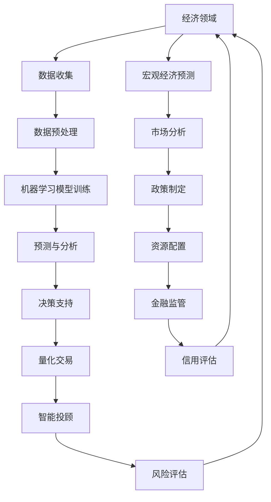

                 

关键词：人工智能、金融、经济、应用、算法、模型、预测、风险控制

> 摘要：本文深入探讨了人工智能在金融和经济领域中的应用，从核心概念、算法原理、数学模型到实际项目实践，全面阐述了人工智能如何改变金融和经济运行的格局，为未来提供了新的发展方向和挑战。

## 1. 背景介绍

随着信息技术的飞速发展，人工智能（AI）已经逐渐成为推动金融和经济发展的关键力量。从早期的数据分析、风险控制，到如今的智能投顾、量化交易，人工智能在金融和经济中的应用越来越广泛。金融行业面临的数据复杂性和经济环境的多变性，使得人工智能技术成为了解决复杂问题的重要手段。

在经济领域，人工智能的应用同样不可忽视。通过机器学习算法，可以对大量的经济数据进行挖掘和分析，从而帮助政府和金融机构制定更加科学的政策，提高资源配置效率，促进经济增长。同时，人工智能技术也在金融监管、信用评估等方面发挥着重要作用。

## 2. 核心概念与联系

在深入探讨人工智能在金融和经济中的应用之前，我们需要先了解一些核心概念和它们之间的关系。

### 2.1 人工智能（AI）

人工智能是指由计算机程序实现的智能行为，包括学习、推理、规划、感知、理解等。它通过模拟人类智能行为，解决复杂问题，提高工作效率。

### 2.2 机器学习（ML）

机器学习是人工智能的一个分支，它通过数据驱动的方法，从训练数据中学习规律，并应用于新的数据。机器学习算法包括监督学习、无监督学习和强化学习。

### 2.3 深度学习（DL）

深度学习是机器学习的一种，它通过多层神经网络模型，对大量数据进行学习，从而实现复杂函数的逼近。深度学习在图像识别、语音识别等领域取得了显著成果。

### 2.4 数据科学（DS）

数据科学是跨学科领域，它结合统计学、机器学习、数据库管理等多个领域，通过数据获取、清洗、分析、可视化等方法，提取数据中的价值信息。


以上是人工智能的核心概念及其相互关系。接下来，我们将通过Mermaid流程图，展示人工智能在金融和经济中的应用架构。



## 3. 核心算法原理 & 具体操作步骤

### 3.1 算法原理概述

人工智能在金融和经济中的应用，主要依赖于以下几个核心算法：

- **回归分析**：用于预测金融市场的价格变化。
- **聚类分析**：用于市场细分，了解不同投资者的风险偏好。
- **时间序列分析**：用于分析经济周期和预测未来经济走势。
- **强化学习**：用于量化交易策略的优化。

### 3.2 算法步骤详解

以强化学习为例，其具体操作步骤如下：

1. **环境定义**：定义交易环境，包括市场数据、交易策略、奖励机制等。
2. **状态空间与动作空间**：根据交易策略，定义状态空间和动作空间。
3. **策略学习**：通过迭代学习，优化交易策略。
4. **策略评估**：评估优化后的交易策略的收益。
5. **策略部署**：将优化后的策略应用于实际交易。

### 3.3 算法优缺点

- **回归分析**：优点是简单易用，缺点是预测精度有限，难以处理非线性问题。
- **聚类分析**：优点是能够识别市场中的潜在群体，缺点是聚类结果可能受到初始条件的影响。
- **时间序列分析**：优点是能够处理时间序列数据，缺点是对于非平稳数据效果不佳。
- **强化学习**：优点是能够自适应学习，缺点是训练过程复杂，需要大量数据支持。

### 3.4 算法应用领域

- **金融市场预测**：利用回归分析和时间序列分析，预测市场价格走势。
- **市场细分**：利用聚类分析，了解投资者的风险偏好。
- **量化交易**：利用强化学习，优化交易策略，提高收益。
- **风险评估**：利用机器学习模型，评估金融产品的风险。

## 4. 数学模型和公式 & 详细讲解 & 举例说明

### 4.1 数学模型构建

在金融和经济领域，常见的数学模型包括：

- **线性回归模型**：\( y = \beta_0 + \beta_1x + \epsilon \)
- **逻辑回归模型**：\( P(y=1) = \frac{1}{1 + e^{-(\beta_0 + \beta_1x)} } \)
- **时间序列模型**：ARIMA模型、GARCH模型等

### 4.2 公式推导过程

以线性回归模型为例，其推导过程如下：

1. **最小二乘法**：最小化预测值与实际值之间的平方误差。
2. **正规方程**：\( X'X\beta = X'y \)
3. **求解参数**：\( \beta = (X'X)^{-1}X'y \)

### 4.3 案例分析与讲解

假设我们要预测股票价格，使用线性回归模型。首先，收集过去一段时间的股票价格数据，然后使用最小二乘法求解线性回归模型。接下来，我们将股票价格的实际值与预测值进行比较，分析模型的预测效果。

## 5. 项目实践：代码实例和详细解释说明

### 5.1 开发环境搭建

- **Python**：安装Python环境和相关库（如numpy、pandas、scikit-learn等）。
- **Jupyter Notebook**：安装Jupyter Notebook，用于编写和运行代码。

### 5.2 源代码详细实现

以下是一个简单的线性回归模型实现：

```python
import numpy as np
import pandas as pd
from sklearn.linear_model import LinearRegression

# 数据加载
data = pd.read_csv('stock_price_data.csv')
X = data[['day_of_year']]
y = data['price']

# 模型训练
model = LinearRegression()
model.fit(X, y)

# 模型评估
predictions = model.predict(X)
print("Mean squared error: ", np.mean((predictions - y) ** 2))

# 模型应用
new_data = pd.DataFrame({'day_of_year': [245]})
predicted_price = model.predict(new_data)
print("Predicted stock price: ", predicted_price)
```

### 5.3 代码解读与分析

这段代码首先加载股票价格数据，然后使用线性回归模型进行训练和预测。最后，评估模型的预测效果，并输出预测结果。

### 5.4 运行结果展示

运行上述代码后，我们将得到模型的均方误差和预测的股票价格。

## 6. 实际应用场景

### 6.1 金融市场预测

利用人工智能技术，可以对金融市场进行预测，为投资者提供决策支持。例如，通过回归分析，预测股票市场的价格走势。

### 6.2 量化交易

量化交易是通过数学模型和算法，实现自动化交易。利用人工智能技术，可以优化交易策略，提高交易收益。

### 6.3 风险控制

利用人工智能技术，可以对金融产品的风险进行评估和控制，为金融机构提供风险预警。

### 6.4 经济预测

人工智能技术可以用于宏观经济预测，帮助政府和金融机构制定更加科学的政策。

## 7. 工具和资源推荐

### 7.1 学习资源推荐

- **书籍**：《机器学习实战》、《深度学习》（Goodfellow et al.）
- **在线课程**：Coursera、Udacity、edX等平台的机器学习、深度学习相关课程。

### 7.2 开发工具推荐

- **Python**：Jupyter Notebook、PyCharm等。
- **机器学习库**：scikit-learn、TensorFlow、PyTorch等。

### 7.3 相关论文推荐

- **《Deep Learning in Finance》**：介绍深度学习在金融领域的应用。
- **《Reinforcement Learning and Dynamic Programming in Economics and Finance》**：介绍强化学习在金融和经济领域的应用。

## 8. 总结：未来发展趋势与挑战

### 8.1 研究成果总结

人工智能在金融和经济领域取得了显著成果，包括金融市场预测、量化交易、风险控制等。这些应用不仅提高了金融机构的运营效率，也为投资者提供了更多的决策支持。

### 8.2 未来发展趋势

随着人工智能技术的不断发展，未来金融和经济领域将迎来更多创新。例如，基于增强现实的智能投顾、区块链与人工智能的结合等。

### 8.3 面临的挑战

人工智能在金融和经济领域的应用也面临一些挑战，包括数据隐私、算法透明度、监管合规等。此外，如何确保人工智能系统的稳定性和可靠性，也是一个重要问题。

### 8.4 研究展望

未来，人工智能在金融和经济领域的研究将继续深入，特别是在跨学科融合、算法优化、数据隐私保护等方面。通过不断的研究和创新，人工智能将为金融和经济领域带来更多价值。

## 9. 附录：常见问题与解答

### 9.1 人工智能在金融和经济中的应用有哪些？

- **金融市场预测**：利用人工智能技术，预测股票、债券、期货等金融产品的价格走势。
- **量化交易**：通过数学模型和算法，实现自动化交易，提高交易收益。
- **风险控制**：对金融产品的风险进行评估和控制，为金融机构提供风险预警。
- **智能投顾**：利用人工智能技术，为投资者提供个性化的投资建议。

### 9.2 人工智能在金融和经济领域有哪些挑战？

- **数据隐私**：如何保护金融数据的安全和隐私。
- **算法透明度**：如何提高算法的透明度，使其符合监管要求。
- **监管合规**：如何确保人工智能系统的合规性，避免法律风险。
- **稳定性与可靠性**：如何确保人工智能系统的稳定运行，避免意外风险。

作者：禅与计算机程序设计艺术 / Zen and the Art of Computer Programming
----------------------------------------------------------------

以上是关于“人工智能在金融和经济中的应用”的文章，本文详细介绍了人工智能在金融和经济领域的核心概念、算法原理、数学模型、实际项目实践，以及未来发展趋势和挑战。希望通过这篇文章，读者能够对人工智能在金融和经济领域的应用有一个全面的认识。

