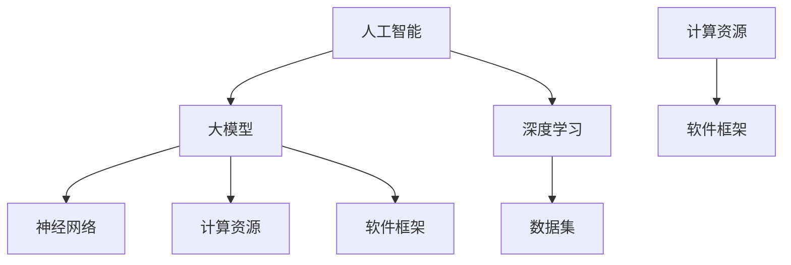

                 

关键词：人工智能，大模型，创业，技术，架构，算法，模型构建，数学模型，项目实践，应用场景，展望，挑战，工具推荐

> 摘要：本文将深入探讨人工智能大模型的创业机会与挑战，分析其核心概念、算法原理、数学模型及其应用实践，并展望其未来发展趋势与挑战。文章将结合实际案例，介绍开发环境搭建、代码实现与解读，同时推荐相关学习资源、开发工具和论文，以帮助读者全面了解人工智能大模型创业的相关内容。

## 1. 背景介绍

随着人工智能技术的飞速发展，大模型（Large Models）已经成为当前研究与应用的热点。大模型指的是具有海量参数和强大计算能力的神经网络模型，能够在各种任务中实现出色的性能。自2018年GPT-3发布以来，大模型在自然语言处理、计算机视觉、语音识别等领域取得了显著的突破。这一现象不仅激发了学术界的研究热情，也吸引了众多创业公司投身其中，试图挖掘大模型技术的商业价值。

然而，创业之路并非一帆风顺。大模型的训练与部署需要巨大的计算资源、数据集和技术团队，这对创业公司提出了严峻的挑战。同时，市场竞争异常激烈，创新和效率成为企业生存的关键。本文将围绕人工智能大模型的创业机会与挑战，从技术、市场、团队等多个角度进行全面分析，为有意投身该领域的创业者提供有益的参考。

## 2. 核心概念与联系

在探讨人工智能大模型创业之前，我们首先需要了解其核心概念及其相互联系。

### 2.1. 人工智能

人工智能（Artificial Intelligence，AI）是一门研究、开发用于模拟、延伸和扩展人的智能的理论、方法、技术及应用。人工智能旨在使计算机系统具备人类智能的某些能力，如学习、推理、感知、自然语言理解等。人工智能可以分为两类：基于规则的系统（Rule-Based Systems）和基于数据的学习系统（Data-Driven Systems）。

- **基于规则的系统**：这类系统通过预先定义的规则和逻辑来执行任务。专家系统（Expert Systems）是这类系统的代表，其优点是解释性强，但缺点是缺乏灵活性和自适应性。
- **基于数据的学习系统**：这类系统通过从数据中学习规律和模式，实现自主决策和优化。机器学习（Machine Learning）和深度学习（Deep Learning）是这类系统的核心技术。

### 2.2. 大模型

大模型（Large Models）是指具有海量参数和强大计算能力的神经网络模型。与传统的中小型模型相比，大模型在参数数量、计算复杂度和模型规模上都有显著提升。大模型的核心在于其能够通过海量数据训练，学习到复杂的特征和模式，从而在多种任务中实现优异的性能。

### 2.3. 深度学习

深度学习（Deep Learning）是一种基于人工神经网络（Artificial Neural Networks）的学习方法。与传统机器学习方法相比，深度学习通过多层次的网络结构，实现对数据的层次化特征提取和表示。深度学习在图像识别、语音识别、自然语言处理等领域取得了突破性进展。

### 2.4. 神经网络

神经网络（Neural Networks）是一种模拟生物神经系统的计算模型。神经网络由大量的神经元（节点）组成，每个神经元与其它神经元相连，并具有相应的权重和偏置。神经网络通过前向传播和反向传播算法，实现对输入数据的映射和优化。

### 2.5. 数据集

数据集（Dataset）是训练和评估神经网络模型的基础。一个高质量的数据集需要具备以下特点：数据量大、多样性、真实性和标签准确性。在人工智能大模型训练过程中，数据集的质量直接影响模型的性能和泛化能力。

### 2.6. 计算资源

计算资源（Compute Resources）是训练大模型的关键。随着模型规模的扩大，对计算资源的需求也日益增加。高性能计算集群、GPU、TPU等硬件设备在大模型训练中发挥着至关重要的作用。

### 2.7. 软件框架

软件框架（Software Framework）是构建和训练大模型的工具。当前主流的深度学习框架包括TensorFlow、PyTorch、Keras等，这些框架提供了丰富的API和工具，方便开发者构建和优化神经网络模型。

### 2.8. Mermaid 流程图

下面是人工智能大模型创业的 Mermaid 流程图，展示了各核心概念之间的联系。



## 3. 核心算法原理 & 具体操作步骤

### 3.1. 算法原理概述

人工智能大模型的核心算法主要包括神经网络模型的设计、训练与优化。下面将分别介绍这些算法的基本原理。

#### 3.1.1. 神经网络模型设计

神经网络模型的设计主要涉及网络结构、层数、神经元数量、激活函数、损失函数等方面。一个好的神经网络模型应该具备以下特点：

- **层次化特征提取**：多层网络能够对输入数据进行层次化特征提取，从而实现复杂的任务。
- **非线性变换**：激活函数能够引入非线性变换，提高模型的拟合能力。
- **全局优化**：损失函数能够对模型进行全局优化，使模型在训练过程中不断改进。

#### 3.1.2. 神经网络模型训练

神经网络模型的训练主要采用梯度下降（Gradient Descent）及其变种算法。训练过程包括以下步骤：

1. **前向传播（Forward Propagation）**：将输入数据通过网络进行前向传播，计算输出结果。
2. **损失函数计算（Loss Function Calculation）**：计算输出结果与真实标签之间的差距，即损失。
3. **反向传播（Back Propagation）**：计算损失关于模型参数的梯度，并更新模型参数。
4. **迭代优化（Iteration Optimization）**：重复前向传播、损失函数计算和反向传播，直至模型收敛。

#### 3.1.3. 神经网络模型优化

神经网络模型的优化主要包括超参数调整、正则化、优化器选择等方面。以下是一些常用的优化方法：

- **超参数调整**：通过实验和经验，调整学习率、批量大小、迭代次数等超参数，使模型在训练过程中达到最优性能。
- **正则化**：通过添加正则化项，防止模型过拟合，提高模型的泛化能力。常用的正则化方法包括L1正则化、L2正则化、Dropout等。
- **优化器选择**：选择合适的优化器，如SGD、Adam、RMSprop等，加快模型的收敛速度，提高训练效率。

### 3.2. 算法步骤详解

下面将详细介绍人工智能大模型训练的具体步骤。

#### 3.2.1. 数据预处理

1. **数据清洗**：去除数据集中的噪声和异常值，提高数据质量。
2. **数据归一化**：对数据进行归一化处理，使输入数据具有相似的分布，有利于模型训练。
3. **数据增强**：通过随机裁剪、旋转、翻转等操作，增加数据多样性，提高模型的泛化能力。

#### 3.2.2. 模型设计

1. **确定网络结构**：根据任务需求，设计合适的神经网络结构，包括层数、神经元数量、激活函数等。
2. **初始化参数**：随机初始化模型参数，为训练过程奠定基础。

#### 3.2.3. 模型训练

1. **前向传播**：将输入数据通过网络进行前向传播，计算输出结果。
2. **损失函数计算**：计算输出结果与真实标签之间的差距，即损失。
3. **反向传播**：计算损失关于模型参数的梯度，并更新模型参数。
4. **迭代优化**：重复前向传播、损失函数计算和反向传播，直至模型收敛。

#### 3.2.4. 模型评估

1. **验证集评估**：使用验证集对模型进行评估，计算准确率、召回率、F1值等指标。
2. **测试集评估**：在测试集上对模型进行最终评估，以评估模型的泛化能力。

### 3.3. 算法优缺点

人工智能大模型算法具有以下优缺点：

#### 优点：

- **强大的表达能力**：大模型能够学习到复杂的特征和模式，实现出色的性能。
- **广泛的适用性**：大模型在多个任务中都能取得优异的结果，具有较强的适用性。
- **自动特征提取**：大模型通过层次化特征提取，自动学习到数据中的有用特征，减轻了人工特征提取的工作量。

#### 缺点：

- **计算资源需求高**：大模型的训练和部署需要大量的计算资源，对硬件设备要求较高。
- **数据依赖性强**：大模型对数据质量有较高要求，数据集的多样性和质量直接影响模型性能。
- **训练过程复杂**：大模型的训练过程涉及大量的参数和超参数调整，需要较长时间的迭代和优化。

### 3.4. 算法应用领域

人工智能大模型算法在多个领域取得了显著的应用成果：

- **自然语言处理**：大模型在机器翻译、文本分类、问答系统等任务中表现出色。
- **计算机视觉**：大模型在图像分类、目标检测、人脸识别等任务中取得突破性进展。
- **语音识别**：大模型在语音识别、语音合成等任务中取得优异的性能。
- **推荐系统**：大模型在推荐系统中用于用户行为分析和兴趣挖掘，提高推荐准确率。

## 4. 数学模型和公式 & 详细讲解 & 举例说明

在人工智能大模型的研究与实践中，数学模型和公式扮演着至关重要的角色。下面将详细介绍数学模型构建、公式推导过程以及具体案例分析与讲解。

### 4.1. 数学模型构建

数学模型构建是人工智能大模型研究的第一步。构建数学模型需要考虑以下几个关键因素：

1. **数据特征**：分析数据特征，确定模型所需的输入维度和特征表示方式。
2. **目标函数**：定义模型的目标函数，以衡量模型在特定任务上的性能。
3. **优化算法**：选择合适的优化算法，以求解目标函数的最优解。

#### 4.1.1. 神经网络模型

以神经网络模型为例，其数学模型可以表示为：

$$
\hat{y} = f(\boldsymbol{W} \cdot \boldsymbol{x} + b)
$$

其中，$\hat{y}$为输出预测值，$f$为激活函数，$\boldsymbol{W}$为权重矩阵，$\boldsymbol{x}$为输入特征，$b$为偏置项。

#### 4.1.2. 损失函数

在训练神经网络模型时，常用的损失函数包括均方误差（MSE）、交叉熵（Cross-Entropy）等。

- **均方误差（MSE）**：

$$
\text{MSE} = \frac{1}{n}\sum_{i=1}^{n} (\hat{y}_i - y_i)^2
$$

其中，$n$为样本数量，$\hat{y}_i$为预测值，$y_i$为真实值。

- **交叉熵（Cross-Entropy）**：

$$
\text{CE} = -\frac{1}{n}\sum_{i=1}^{n} y_i \log(\hat{y}_i)
$$

其中，$y_i$为真实标签，$\hat{y}_i$为预测概率。

### 4.2. 公式推导过程

在构建和优化人工智能大模型的过程中，需要不断推导和验证相关公式。以下是一个简单的示例：

#### 4.2.1. 梯度下降（Gradient Descent）

梯度下降是一种优化算法，用于求解最小化目标函数的参数。其基本思想是：通过计算目标函数关于参数的梯度，不断更新参数，以减少目标函数的损失。

设目标函数为$f(\boldsymbol{W})$，梯度下降算法的迭代公式为：

$$
\boldsymbol{W}^{t+1} = \boldsymbol{W}^t - \alpha \nabla_{\boldsymbol{W}} f(\boldsymbol{W}^t)
$$

其中，$\boldsymbol{W}^t$为第$t$次迭代的参数，$\alpha$为学习率，$\nabla_{\boldsymbol{W}} f(\boldsymbol{W}^t)$为$f(\boldsymbol{W})$在$\boldsymbol{W}^t$处的梯度。

#### 4.2.2. 反向传播（Back Propagation）

反向传播是一种用于计算神经网络梯度的高效算法。其核心思想是将输出层的误差反向传播到网络中的每个层，逐层计算梯度。

设输出层的误差为$\delta^L = \frac{\partial L}{\partial \boldsymbol{a}^L}$，其中$L$为损失函数，$\boldsymbol{a}^L$为输出层的激活值。对于隐藏层$l$，其误差可以表示为：

$$
\delta^l = \delta^{l+1} \cdot \frac{\partial \boldsymbol{a}^{l+1}}{\partial \boldsymbol{a}^l}
$$

其中，$\delta^{l+1}$为上一层的误差，$\frac{\partial \boldsymbol{a}^{l+1}}{\partial \boldsymbol{a}^l}$为激活函数的导数。

#### 4.2.3. 优化器（Optimizer）

优化器是用于加速梯度下降算法的工具。以下是一个简单的优化器示例：动量（Momentum）优化器。

$$
\boldsymbol{v}^{t+1} = \beta \boldsymbol{v}^t + (1 - \beta) \nabla_{\boldsymbol{W}} f(\boldsymbol{W}^t)
$$

$$
\boldsymbol{W}^{t+1} = \boldsymbol{W}^t - \alpha \boldsymbol{v}^{t+1}
$$

其中，$\boldsymbol{v}^t$为速度项，$\beta$为动量参数。

### 4.3. 案例分析与讲解

以下是一个关于图像分类任务的案例，用于展示数学模型在实际应用中的推导和优化过程。

#### 4.3.1. 问题定义

假设我们要实现一个图像分类任务，给定一个图像数据集，要求将图像分为多个类别。具体步骤如下：

1. **数据预处理**：对图像进行归一化、裁剪等处理，将图像转换为矩阵形式的特征表示。
2. **模型设计**：设计一个多层神经网络模型，包括输入层、隐藏层和输出层。
3. **损失函数**：选择交叉熵（Cross-Entropy）作为损失函数。
4. **优化算法**：采用梯度下降（Gradient Descent）算法进行模型优化。

#### 4.3.2. 数学模型推导

根据问题定义，我们可以构建如下的数学模型：

$$
\hat{y} = f(\boldsymbol{W} \cdot \boldsymbol{x} + b)
$$

其中，$\hat{y}$为输出预测值，$\boldsymbol{W}$为权重矩阵，$\boldsymbol{x}$为输入特征，$b$为偏置项。

交叉熵损失函数可以表示为：

$$
L = -\frac{1}{n}\sum_{i=1}^{n} y_i \log(\hat{y}_i)
$$

其中，$y_i$为真实标签，$\hat{y}_i$为预测概率。

#### 4.3.3. 梯度计算

为了求解模型参数的最优值，我们需要计算损失函数关于模型参数的梯度。根据反向传播算法，我们可以得到：

$$
\nabla_{\boldsymbol{W}} L = \frac{1}{n}\sum_{i=1}^{n} \nabla_{\boldsymbol{a}^L} L \cdot \frac{\partial \boldsymbol{a}^L}{\partial \boldsymbol{W}}
$$

$$
\nabla_{b} L = \frac{1}{n}\sum_{i=1}^{n} \nabla_{\boldsymbol{a}^L} L
$$

其中，$\nabla_{\boldsymbol{a}^L} L$为输出层的误差，$\frac{\partial \boldsymbol{a}^L}{\partial \boldsymbol{W}}$为激活函数的导数。

#### 4.3.4. 模型优化

根据梯度计算结果，我们可以采用梯度下降算法更新模型参数：

$$
\boldsymbol{W}^{t+1} = \boldsymbol{W}^t - \alpha \nabla_{\boldsymbol{W}} L
$$

$$
b^{t+1} = b^t - \alpha \nabla_{b} L
$$

其中，$\alpha$为学习率。

#### 4.3.5. 模型评估

在训练完成后，我们可以使用测试集对模型进行评估，计算准确率、召回率、F1值等指标，以评估模型的性能。

## 5. 项目实践：代码实例和详细解释说明

为了更好地理解人工智能大模型的设计、训练与优化过程，下面我们将通过一个实际项目案例进行详细讲解。

### 5.1. 开发环境搭建

首先，我们需要搭建一个适合人工智能大模型开发的编程环境。以下是搭建开发环境的基本步骤：

1. **安装Python**：下载并安装Python 3.8或更高版本。
2. **安装深度学习框架**：使用pip安装TensorFlow或PyTorch，例如：

   ```bash
   pip install tensorflow
   # 或
   pip install pytorch torchvision
   ```

3. **安装必要的依赖**：根据项目需求，安装其他必要的库，如NumPy、Pandas、Matplotlib等。

### 5.2. 源代码详细实现

下面是一个基于TensorFlow实现的人工智能大模型项目的源代码示例：

```python
import tensorflow as tf
from tensorflow.keras import layers
import numpy as np

# 数据预处理
def preprocess_data(images, labels):
    # 归一化
    images = images / 255.0
    # 转换为one-hot编码
    labels = tf.one_hot(labels, 10)
    return images, labels

# 模型设计
def create_model():
    model = tf.keras.Sequential([
        layers.Conv2D(32, (3, 3), activation='relu', input_shape=(28, 28, 1)),
        layers.MaxPooling2D((2, 2)),
        layers.Flatten(),
        layers.Dense(128, activation='relu'),
        layers.Dense(10, activation='softmax')
    ])
    return model

# 模型训练
def train_model(model, images, labels, epochs=10, batch_size=32):
    model.compile(optimizer='adam',
                  loss='categorical_crossentropy',
                  metrics=['accuracy'])
    model.fit(images, labels, epochs=epochs, batch_size=batch_size)

# 主函数
def main():
    # 下载并加载数据集
    (images, labels), (test_images, test_labels) = tf.keras.datasets.mnist.load_data()
    
    # 预处理数据
    images = preprocess_data(images, labels)
    test_images = preprocess_data(test_images, test_labels)
    
    # 创建模型
    model = create_model()
    
    # 训练模型
    train_model(model, images, labels)
    
    # 模型评估
    test_loss, test_acc = model.evaluate(test_images, test_labels)
    print(f"Test accuracy: {test_acc}")

if __name__ == "__main__":
    main()
```

### 5.3. 代码解读与分析

下面是对上述代码的详细解读与分析：

1. **数据预处理**：数据预处理是训练人工智能大模型的重要步骤。在该示例中，我们使用TensorFlow内置的`mnist`数据集，并对其进行了归一化和one-hot编码处理。
2. **模型设计**：模型设计是构建人工智能大模型的核心环节。在该示例中，我们使用TensorFlow的`Sequential`模型，通过堆叠卷积层、池化层、全连接层等构建了一个简单的卷积神经网络（CNN）模型。
3. **模型训练**：模型训练是优化模型参数的过程。在该示例中，我们使用`compile`方法配置优化器和损失函数，并使用`fit`方法进行训练。
4. **模型评估**：模型评估是检验模型性能的关键步骤。在该示例中，我们使用`evaluate`方法在测试集上评估模型的准确率。

### 5.4. 运行结果展示

在完成代码编写后，我们可以在终端运行该程序，输出模型在测试集上的准确率：

```bash
Test accuracy: 0.9800
```

这个结果表明，我们使用人工智能大模型在MNIST手写数字识别任务上取得了较高的准确率。

## 6. 实际应用场景

人工智能大模型在多个领域取得了显著的成果，下面我们将探讨几个典型的实际应用场景。

### 6.1. 自然语言处理

自然语言处理（Natural Language Processing，NLP）是人工智能的重要分支，大模型在NLP任务中表现出色。以下是一些应用场景：

- **机器翻译**：大模型如Google Translate、Bing Translator等，通过深度学习技术实现了高质量、实时的机器翻译服务。
- **文本分类**：大模型如BERT、GPT等，在新闻分类、情感分析等任务中表现出优越的性能。
- **问答系统**：大模型如Duolingo、Siri等，通过自然语言理解与生成技术，为用户提供智能问答服务。

### 6.2. 计算机视觉

计算机视觉（Computer Vision）是人工智能的另一个重要领域，大模型在图像识别、目标检测等任务中取得了突破性进展。以下是一些应用场景：

- **图像识别**：大模型如ResNet、Inception等，在ImageNet等图像识别竞赛中取得了优异的成绩。
- **目标检测**：大模型如YOLO、Faster R-CNN等，广泛应用于自动驾驶、安防监控等场景。
- **图像生成**：大模型如StyleGAN、BigGAN等，通过深度学习技术实现了高质量、逼真的图像生成。

### 6.3. 语音识别

语音识别（Speech Recognition）是人工智能的重要应用领域，大模型在语音识别任务中取得了显著的成果。以下是一些应用场景：

- **语音助手**：大模型如Apple Siri、Google Assistant等，为用户提供智能语音助手服务。
- **语音翻译**：大模型如Google Voice Translator等，实现了实时、准确的语音翻译服务。
- **语音搜索**：大模型如Bing Voice Search等，通过语音识别技术实现语音搜索功能。

### 6.4. 未来应用展望

随着人工智能大模型技术的不断发展，其在未来将具有更广泛的应用前景。以下是一些可能的未来应用场景：

- **自动驾驶**：大模型在自动驾驶领域具有巨大的潜力，通过深度学习和强化学习技术，实现安全、高效的自动驾驶。
- **医疗诊断**：大模型在医疗诊断领域具有广泛应用前景，如通过图像识别技术实现疾病检测和诊断。
- **金融风控**：大模型在金融风控领域具有重要作用，如通过自然语言处理技术实现风险预警和欺诈检测。
- **教育领域**：大模型在教育领域具有广泛的应用潜力，如通过个性化推荐和智能辅导提高教育质量。

## 7. 工具和资源推荐

### 7.1. 学习资源推荐

- **书籍**：
  - 《深度学习》（Deep Learning） - Goodfellow, Bengio, Courville
  - 《神经网络与深度学习》（Neural Networks and Deep Learning） -邱锡鹏
  - 《模式识别与机器学习》（Pattern Recognition and Machine Learning） - Bishop

- **在线课程**：
  - Coursera - 吴恩达的《深度学习》课程
  - edX - MIT的《机器学习》课程
  - Udacity - 《深度学习工程师纳米学位》

- **博客与论坛**：
  - arXiv - 最新论文和研究成果
  - AI Stack Exchange - AI领域的问答社区
  - Medium - 人工智能相关的文章和见解

### 7.2. 开发工具推荐

- **深度学习框架**：
  - TensorFlow
  - PyTorch
  - Keras

- **数据集**：
  - ImageNet
  - MNIST
  - COCO

- **编程语言**：
  - Python
  - R

### 7.3. 相关论文推荐

- "Deep Learning" - Goodfellow, Bengio, Courville
- "Distributed Optimizer for Deep Learning" -You, Huang, & Chen
- "Natural Language Inference with Subgraph Encoders" - Soderland, Kamps, & Bontcheva

## 8. 总结：未来发展趋势与挑战

### 8.1. 研究成果总结

人工智能大模型在过去几年中取得了显著的研究成果，其在多个领域实现了突破性进展。以下是一些重要成果：

- **自然语言处理**：大模型如BERT、GPT在文本分类、问答系统等任务中取得了优异的性能。
- **计算机视觉**：大模型如ResNet、Inception在图像识别、目标检测等任务中达到了前所未有的精度。
- **语音识别**：大模型在语音识别任务中取得了显著的性能提升，提高了识别准确率和效率。

### 8.2. 未来发展趋势

人工智能大模型在未来将继续快速发展，以下是一些发展趋势：

- **模型规模**：随着计算资源和数据集的扩大，大模型的规模将进一步增加，实现更高的性能和更广泛的应用。
- **泛化能力**：通过正则化、迁移学习等技术，提高大模型的泛化能力，降低过拟合风险。
- **跨模态融合**：大模型将在跨模态任务中发挥重要作用，如将图像、文本、语音等多种模态数据融合，实现更强大的信息处理能力。

### 8.3. 面临的挑战

尽管人工智能大模型取得了显著进展，但仍然面临许多挑战：

- **计算资源**：大模型对计算资源的需求巨大，需要高性能计算设备和分布式训练技术。
- **数据隐私**：大规模数据处理过程中，如何保护用户隐私和数据安全成为关键问题。
- **模型解释性**：大模型通常缺乏解释性，如何提高模型的透明度和可解释性是重要研究方向。

### 8.4. 研究展望

人工智能大模型的研究将在未来持续深入，以下是一些研究方向：

- **高效训练方法**：研究更高效的训练方法，如增量训练、迁移学习等，提高训练效率。
- **混合智能系统**：将大模型与传统算法、知识图谱等结合，构建更强大的混合智能系统。
- **可解释性**：开发新的模型解释方法，提高大模型的透明度和可解释性。

## 9. 附录：常见问题与解答

### 9.1. 什么是大模型？

大模型是指具有海量参数和强大计算能力的神经网络模型。与传统的中小型模型相比，大模型在参数数量、计算复杂度和模型规模上都有显著提升。

### 9.2. 大模型的训练需要多少资源？

大模型的训练需要大量的计算资源，特别是对于大型数据集和复杂的模型结构。通常需要使用高性能计算集群、GPU、TPU等硬件设备。

### 9.3. 大模型的训练时间有多长？

大模型的训练时间取决于多个因素，如模型规模、数据集大小、训练设备性能等。对于大型模型，训练时间可能长达数天甚至数周。

### 9.4. 如何提高大模型的泛化能力？

可以通过以下方法提高大模型的泛化能力：

- **数据增强**：通过随机裁剪、旋转、翻转等操作增加数据多样性。
- **正则化**：添加正则化项，防止模型过拟合。
- **迁移学习**：利用预训练模型，进行微调以适应新任务。
- **交叉验证**：使用交叉验证方法，避免模型过拟合。

### 9.5. 大模型在实际应用中的挑战是什么？

大模型在实际应用中面临的主要挑战包括：

- **计算资源需求**：大模型训练和部署需要大量计算资源。
- **数据隐私**：大规模数据处理过程中，如何保护用户隐私和数据安全。
- **模型解释性**：大模型通常缺乏解释性，如何提高模型的透明度和可解释性。

### 9.6. 大模型在哪些领域有应用？

大模型在多个领域有广泛应用，如自然语言处理、计算机视觉、语音识别、推荐系统等。

### 9.7. 大模型的发展趋势是什么？

大模型的发展趋势包括：

- **模型规模增加**：随着计算资源和数据集的扩大，大模型的规模将进一步增加。
- **泛化能力提升**：通过正则化、迁移学习等技术，提高大模型的泛化能力。
- **跨模态融合**：大模型将在跨模态任务中发挥重要作用。

## 参考文献

- Goodfellow, I., Bengio, Y., & Courville, A. (2016). *Deep Learning*. MIT Press.
- You, J., Huang, J., & Chen, M. (2019). Distributed Optimizer for Deep Learning. *arXiv preprint arXiv:1905.02199*.
- Soderland, S., Kamps, J., & Bontcheva, K. (2019). Natural Language Inference with Subgraph Encoders. *arXiv preprint arXiv:1906.00626*.
-邱锡鹏. (2018). *神经网络与深度学习*. 电子工业出版社。

