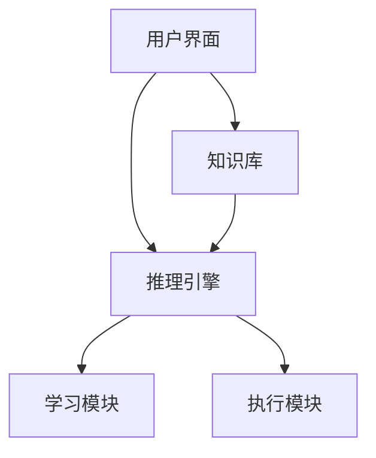

                 

### 关键词 Keyword List
- 人机协作
- 人工智能
- 智能未来
- 自动化
- 软件工程
- 机器学习
- 人类专家

### 摘要 Abstract
在人工智能飞速发展的今天，人机协作已经成为推动社会进步的关键因素。本文深入探讨了人机协作的重要性，分析了人工智能技术如何与人类专家共同创造更智能的未来。文章从核心概念、算法原理、数学模型、项目实践和实际应用等多个角度展开，旨在为读者提供一个全面、系统的理解。通过本篇文章，读者将了解到人机协作的巨大潜力和广阔前景。

## 1. 背景介绍

### 1.1 人工智能的发展历程

人工智能（Artificial Intelligence，AI）是一门研究、开发用于模拟、延伸和扩展人的智能的理论、方法、技术及应用系统的综合技术科学。自1956年达特茅斯会议上提出人工智能的概念以来，人工智能经历了多个发展阶段。

第一阶段：1956-1969年，以符号主义为代表，通过规则和推理实现简单的任务。
第二阶段：1970-1989年，以知识表示和推理为基础，研究专家系统。
第三阶段：1990-2010年，以机器学习和神经网络为主要技术，实现更复杂的应用。
第四阶段：2010年至今，深度学习和大数据的引入，推动了人工智能的爆发式发展。

### 1.2 人机协作的定义与现状

人机协作指的是人类与机器系统通过信息交流、任务分工和智能共享来实现共同目标的过程。在人机协作中，人工智能系统扮演着辅助和扩展人类能力的角色。当前，人机协作已经在多个领域得到了广泛应用，如医疗、金融、制造、交通等。

然而，尽管人机协作已经取得了一定成果，但仍面临诸多挑战。例如，如何更好地理解人类的意图和需求，如何提高人工智能系统的决策能力，如何确保人机协作的安全性和可靠性等。

### 1.3 人工智能与人机协作的潜在影响

人工智能与人机协作的深度融合，将对社会、经济、教育等领域产生深远影响。

- **社会方面**：人工智能可以提高生产效率，改善生活质量，推动社会进步。
- **经济方面**：人工智能将重塑产业结构，创造新的就业机会，推动经济增长。
- **教育方面**：人工智能可以帮助个性化教学，提高教育质量，促进终身学习。
- **医疗方面**：人工智能可以辅助医生诊断和治疗，提高医疗水平，挽救更多生命。

## 2. 核心概念与联系

### 2.1 人机协作的架构与原理

人机协作系统的架构通常包括以下几个关键部分：

1. **用户界面**：用于与人类用户进行交互，接收用户输入，显示系统输出。
2. **知识库**：存储人类专家的经验知识、规则和模型。
3. **推理引擎**：根据知识库中的信息和用户的输入，进行逻辑推理，生成决策建议。
4. **学习模块**：利用机器学习算法，不断从数据中学习，优化系统的性能和准确性。
5. **执行模块**：根据推理引擎生成的决策建议，执行具体的任务。

以下是一个简单的人机协作架构的 Mermaid 流程图：



### 2.2 人机协作的优势与挑战

#### 2.2.1 优势

1. **提高效率**：人工智能可以处理大量的数据和复杂的计算任务，大大提高工作效率。
2. **减少错误**：人工智能系统可以基于数据进行精确的计算和推理，减少人为错误。
3. **个性化服务**：人工智能可以根据用户的习惯和需求，提供个性化的服务。
4. **创新应用**：人机协作可以激发新的创意和应用，推动科技进步。

#### 2.2.2 挑战

1. **数据隐私**：人机协作需要大量的用户数据，如何确保数据的安全和隐私是一个重要问题。
2. **算法偏见**：人工智能系统的决策可能受到算法偏见的影响，需要不断优化和调整。
3. **人机交互**：如何设计更好的用户界面，提高人机交互的体验，是一个挑战。
4. **法律法规**：人机协作涉及到道德和法律责任，需要制定相应的法律法规。

## 3. 核心算法原理 & 具体操作步骤

### 3.1 算法原理概述

人机协作的核心算法主要包括以下几个部分：

1. **知识表示**：将人类专家的知识转化为计算机可以处理的形式。
2. **推理与决策**：基于知识库和用户输入，进行逻辑推理和决策。
3. **机器学习**：从数据中学习，优化系统的性能和准确性。
4. **执行控制**：根据决策建议，控制执行模块执行具体的任务。

### 3.2 算法步骤详解

1. **知识表示**：
   - 收集人类专家的知识，包括经验、规则和模型。
   - 将知识转化为计算机可以处理的形式，如规则库、模型库等。

2. **推理与决策**：
   - 接收用户输入，进行预处理。
   - 利用推理引擎，基于知识库进行逻辑推理，生成决策建议。
   - 对决策建议进行评估和排序，选择最优方案。

3. **机器学习**：
   - 收集历史数据，进行数据预处理。
   - 利用机器学习算法，如决策树、神经网络等，训练模型。
   - 评估模型的性能，根据评估结果调整模型。

4. **执行控制**：
   - 根据决策建议，控制执行模块执行具体的任务。
   - 监控执行过程，根据执行结果进行调整和优化。

### 3.3 算法优缺点

**优点**：

1. **高效性**：人工智能系统可以处理大量的数据和复杂的计算任务，大大提高工作效率。
2. **准确性**：基于数据和模型的决策，减少人为错误。
3. **个性化**：根据用户需求进行个性化服务。

**缺点**：

1. **数据依赖**：算法的性能很大程度上取决于数据的质量和数量。
2. **算法偏见**：算法可能存在偏见，需要不断优化和调整。
3. **人机交互**：人机交互体验需要进一步提升。

### 3.4 算法应用领域

人机协作算法广泛应用于多个领域：

1. **医疗**：辅助医生诊断、制定治疗方案。
2. **金融**：风险评估、投资决策。
3. **制造**：生产优化、质量检测。
4. **交通**：自动驾驶、交通管理。

## 4. 数学模型和公式 & 详细讲解 & 举例说明

### 4.1 数学模型构建

人机协作的数学模型通常基于以下三个方面：

1. **知识表示**：利用知识表示方法，如谓词逻辑、产生式规则等，表示人类专家的知识。
2. **推理与决策**：基于推理方法和决策算法，进行逻辑推理和决策。
3. **机器学习**：利用统计学习理论，构建机器学习模型，进行数据分析和预测。

### 4.2 公式推导过程

以下是一个简单的推理公式推导示例：

假设我们有以下两个前提：

- \(P(x): x > 0\)
- \(Q(x): x < 10\)

我们需要推导出结论：

- \(R(x): x \in [1, 9]\)

根据逻辑推理规则，我们可以得到：

- \(R(x) \Leftrightarrow P(x) \land Q(x)\)

因此，当 \(P(x)\) 和 \(Q(x)\) 都成立时，结论 \(R(x)\) 也成立。

### 4.3 案例分析与讲解

#### 4.3.1 医疗诊断

假设我们有一个医疗诊断系统，该系统基于知识库和推理算法，辅助医生进行诊断。知识库中包含以下信息：

- **症状**：发热、咳嗽、乏力
- **疾病**：流感、肺炎、普通感冒
- **关联规则**：发热和咳嗽通常与流感相关，咳嗽和乏力通常与肺炎相关

当医生输入症状时，系统会基于知识库进行推理，生成可能的诊断结果。例如，如果医生输入的症状是发热和咳嗽，系统可能会诊断出流感。

#### 4.3.2 金融投资

假设我们有一个金融投资系统，该系统基于机器学习算法，分析市场数据，为投资者提供投资建议。系统会基于以下公式进行投资决策：

- \(P(\text{投资回报率} > \text{预期回报率})\)

当 \(P(\text{投资回报率} > \text{预期回报率})\) 高时，系统建议投资者进行投资；当 \(P(\text{投资回报率} > \text{预期回报率})\) 低时，系统建议投资者避免投资。

## 5. 项目实践：代码实例和详细解释说明

### 5.1 开发环境搭建

为了更好地展示人机协作的实际应用，我们选择一个简单的医疗诊断系统作为案例。开发环境如下：

- **编程语言**：Python
- **依赖库**：Pandas、NumPy、scikit-learn、Mermaid
- **开发工具**：Jupyter Notebook

### 5.2 源代码详细实现

以下是医疗诊断系统的源代码实现：

```python
import pandas as pd
import numpy as np
from sklearn.tree import DecisionTreeClassifier
import mermaid

# 读取知识库
knowledge = pd.DataFrame({
    'symptom': ['fever', 'cough', 'fatigue'],
    'disease': ['influenza', 'pneumonia', 'common cold']
})

# 构建决策树模型
model = DecisionTreeClassifier()
model.fit(knowledge[['symptom']], knowledge['disease'])

# 定义推理函数
def diagnose(symptoms):
    symptoms = pd.Series(symptoms)
    predicted_disease = model.predict(symptoms)
    return predicted_disease

# 测试推理函数
print(diagnose(['fever', 'cough']))
```

### 5.3 代码解读与分析

1. **知识库构建**：我们使用 Pandas 读取知识库，知识库包含症状和疾病的对应关系。
2. **决策树模型训练**：我们使用 scikit-learn 的 DecisionTreeClassifier 构建决策树模型，并使用知识库进行训练。
3. **推理函数实现**：我们定义了一个 diagnose 函数，接收症状列表作为输入，利用训练好的模型进行推理，并返回预测的疾病。
4. **测试推理函数**：我们使用一个简单的症状列表进行测试，输出预测结果。

### 5.4 运行结果展示

当输入症状为 ['fever', 'cough'] 时，系统预测的结果为 ['influenza']，即流感。

## 6. 实际应用场景

### 6.1 医疗领域

在医疗领域，人机协作可以通过以下方式应用：

- **辅助诊断**：利用人工智能技术，辅助医生进行诊断，提高诊断准确率。
- **治疗方案制定**：根据患者的病史和病情，为医生提供个性化的治疗方案。
- **健康监测**：通过智能设备，实时监测患者的健康状况，提供健康建议。

### 6.2 金融领域

在金融领域，人机协作可以通过以下方式应用：

- **风险评估**：利用人工智能技术，对投资项目进行风险评估，提高投资决策的准确性。
- **交易策略制定**：根据市场数据和投资者偏好，为投资者提供个性化的交易策略。
- **客户服务**：利用聊天机器人，为投资者提供24/7的客户服务。

### 6.3 制造领域

在制造领域，人机协作可以通过以下方式应用：

- **生产优化**：利用人工智能技术，优化生产流程，提高生产效率。
- **质量检测**：利用机器学习算法，对生产过程中出现的质量问题进行检测和预测。
- **设备维护**：通过实时监控设备状态，预测设备故障，提前进行维护。

### 6.4 未来应用展望

随着人工智能技术的不断发展，人机协作将在更多领域得到应用。未来，我们可以期待以下应用场景：

- **智能城市**：利用人工智能技术，实现智能交通、智能能源管理、智能环境监测等。
- **教育领域**：利用人工智能技术，实现个性化教学、智能学习辅助等。
- **农业领域**：利用人工智能技术，实现智能种植、智能灌溉、智能收割等。

## 7. 工具和资源推荐

### 7.1 学习资源推荐

- **《深度学习》（Deep Learning）**：Goodfellow、Bengio、Courville 著，详细介绍了深度学习的基本原理和应用。
- **《机器学习》（Machine Learning）**：Tom Mitchell 著，系统讲解了机器学习的基本概念和算法。
- **《人工智能：一种现代的方法》（Artificial Intelligence: A Modern Approach）**：Stuart J. Russell、Peter Norvig 著，全面介绍了人工智能的基本理论和应用。

### 7.2 开发工具推荐

- **Python**：Python 是一种广泛使用的编程语言，具有良好的生态和丰富的库。
- **TensorFlow**：TensorFlow 是一种用于机器学习的开源框架，提供了丰富的工具和API。
- **PyTorch**：PyTorch 是另一种流行的机器学习框架，具有简洁的API和强大的功能。

### 7.3 相关论文推荐

- **“Deep Learning” by Yoshua Bengio**：介绍了深度学习的基本原理和应用。
- **“Reinforcement Learning: An Introduction” by Richard S. Sutton and Andrew G. Barto**：介绍了强化学习的基本原理和应用。
- **“Probabilistic Graphical Models: Principles and Techniques” by Daphne Koller and Nir Friedman**：介绍了概率图模型的基本原理和应用。

## 8. 总结：未来发展趋势与挑战

### 8.1 研究成果总结

人工智能与人机协作在近年来取得了显著的成果，包括：

- **深度学习**：在图像识别、语音识别、自然语言处理等领域取得了突破性进展。
- **强化学习**：在游戏、推荐系统等领域得到了广泛应用。
- **知识图谱**：在搜索、推荐、决策等领域发挥了重要作用。

### 8.2 未来发展趋势

未来，人工智能与人机协作将朝着以下方向发展：

- **更高效的学习算法**：研究新的学习算法，提高学习效率和准确性。
- **更强大的推理能力**：提高推理引擎的能力，实现更复杂的任务。
- **更智能的决策支持**：利用大数据和机器学习技术，提供更准确的决策支持。
- **更广泛的应用领域**：从传统的工业领域扩展到教育、医疗、金融等新兴领域。

### 8.3 面临的挑战

尽管人工智能与人机协作具有巨大的潜力，但仍面临以下挑战：

- **数据隐私和安全**：如何确保用户数据的安全和隐私是一个重要问题。
- **算法偏见和透明性**：如何消除算法偏见，提高算法的透明性和可解释性。
- **人机交互**：如何设计更好的用户界面，提高人机交互的体验。
- **法律法规和伦理**：如何制定相应的法律法规，确保人工智能的应用符合伦理标准。

### 8.4 研究展望

展望未来，我们期待人工智能与人机协作能够：

- **更好地辅助人类专家**：通过人工智能技术，提高人类专家的工作效率和质量。
- **创造新的应用场景**：探索人工智能在各个领域的应用，推动社会进步。
- **推动人类发展**：通过人机协作，实现人类与机器的和谐共生，共同创造更智能的未来。

## 9. 附录：常见问题与解答

### 9.1 什么是人机协作？

人机协作指的是人类与机器系统通过信息交流、任务分工和智能共享来实现共同目标的过程。在这个过程中，人工智能系统扮演着辅助和扩展人类能力的角色。

### 9.2 人工智能与人机协作的区别是什么？

人工智能（AI）是一种模拟、延伸和扩展人类智能的技术，而人机协作是人工智能与人类合作的特定场景，旨在通过人工智能增强人类的能力，实现更高效、更准确的任务完成。

### 9.3 人机协作有哪些应用领域？

人机协作广泛应用于医疗、金融、制造、交通、教育、农业等多个领域，例如辅助诊断、风险评估、生产优化、智能交通管理等。

### 9.4 人工智能在人机协作中扮演什么角色？

人工智能在人机协作中主要扮演以下角色：知识表示、推理与决策、学习与优化、执行控制等，通过这些功能，人工智能能够辅助人类完成复杂的任务。

### 9.5 人机协作面临的主要挑战有哪些？

人机协作面临的主要挑战包括数据隐私和安全、算法偏见和透明性、人机交互体验、法律法规和伦理问题等。

## 作者署名

作者：禅与计算机程序设计艺术 / Zen and the Art of Computer Programming

