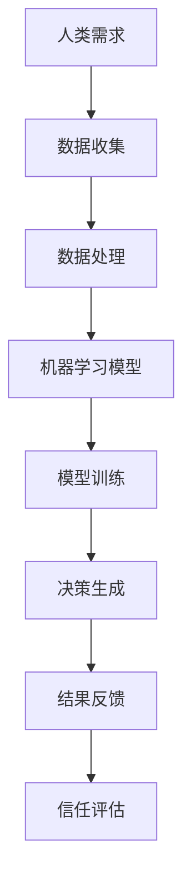

                 

关键词：人类与AI协作、信任、技术沟通、数据处理、算法透明度、伦理问题

> 摘要：本文探讨了人类与人工智能（AI）协作中信任的重要性，分析了当前技术挑战和伦理问题，并提出了一系列策略和方法，以增强人类与AI之间的信任关系。文章从核心概念、算法原理、数学模型、实际应用、工具推荐等多个维度进行阐述，为未来AI与人类协作提供了有价值的参考。

## 1. 背景介绍

随着人工智能技术的飞速发展，AI已经在各个领域发挥着重要作用。从医疗诊断到自动驾驶，从金融分析到自然语言处理，AI的应用越来越广泛。然而，随着AI的普及，人类与AI之间的信任问题也逐渐凸显。信任是协作关系的基石，对于人类与AI的协作同样重要。

信任缺失可能导致以下几个问题：

- **技术误解**：人类可能误解AI的决策过程和结果，导致不信任。
- **数据泄露**：不信任可能导致对数据隐私的担忧，从而影响AI系统的数据输入。
- **伦理问题**：AI系统的决策可能引发伦理争议，如自动驾驶汽车的道德决策等。

本文旨在探讨如何通过技术手段和伦理框架，增强人类与AI之间的信任，从而实现更加有效的协作。

### 核心概念与联系

为了更好地理解人类与AI协作中的信任问题，我们需要先了解以下几个核心概念：

- **人工智能（AI）**：模拟人类智能行为的计算机系统。
- **机器学习（ML）**：AI的核心技术之一，通过数据和算法让机器自动学习。
- **深度学习（DL）**：ML的一个分支，通过多层神经网络进行复杂模式识别。
- **算法透明度**：AI系统的决策过程和结果是否可以被理解和解释。

以下是人类与AI协作的一个简化的Mermaid流程图：



### 核心算法原理 & 具体操作步骤

#### 3.1 算法原理概述

人类与AI的协作过程中，核心的算法原理通常包括以下几个步骤：

1. **数据收集**：收集相关数据，用于训练AI模型。
2. **数据处理**：清洗和预处理数据，以提高模型的准确性。
3. **模型训练**：使用机器学习算法训练模型，使其能够识别模式和做出预测。
4. **决策生成**：模型根据输入数据生成决策或建议。
5. **结果反馈**：将决策结果反馈给人类，以进行评估和调整。

#### 3.2 算法步骤详解

1. **数据收集**：数据是AI模型的基石。收集的数据需要多样化、有代表性，以确保模型的泛化能力。

2. **数据处理**：数据处理包括数据清洗、去噪、归一化等步骤，以提高数据质量。

3. **模型训练**：选择合适的机器学习算法，如神经网络、决策树等，对模型进行训练。

4. **决策生成**：训练好的模型可以对新数据进行预测或分类，生成决策。

5. **结果反馈**：将决策结果反馈给人类，以便进行验证和调整。

#### 3.3 算法优缺点

- **优点**：
  - **高效性**：AI可以在短时间内处理大量数据，做出快速决策。
  - **准确性**：通过机器学习和深度学习，AI模型的决策能力不断提高。
  - **适应性**：AI系统可以根据新数据不断优化，提高其性能。

- **缺点**：
  - **透明度低**：许多AI模型的决策过程无法解释，导致信任问题。
  - **数据依赖性**：模型的性能高度依赖数据质量，数据偏差可能导致决策失误。
  - **伦理问题**：AI的决策可能涉及伦理问题，如自动驾驶汽车的道德决策等。

#### 3.4 算法应用领域

- **医疗诊断**：AI可以辅助医生进行疾病诊断，提高诊断准确性。
- **金融分析**：AI可以分析大量金融数据，为投资决策提供支持。
- **自动驾驶**：AI可以帮助汽车进行自主驾驶，提高交通安全。
- **自然语言处理**：AI可以理解自然语言，提高人机交互体验。

## 4. 数学模型和公式 & 详细讲解 & 举例说明

为了更好地理解AI模型的工作原理，我们需要借助数学模型和公式。以下是一个简单的线性回归模型的例子：

### 4.1 数学模型构建

线性回归模型的基本形式如下：

$$
Y = \beta_0 + \beta_1X + \epsilon
$$

其中，$Y$ 是因变量，$X$ 是自变量，$\beta_0$ 和 $\beta_1$ 是模型参数，$\epsilon$ 是误差项。

### 4.2 公式推导过程

线性回归模型的推导过程如下：

1. **最小二乘法**：假设 $Y$ 和 $X$ 之间是线性关系，我们希望找到一个直线 $Y = \beta_0 + \beta_1X$，使得所有数据点到直线的距离平方和最小。

2. **损失函数**：损失函数定义为数据点到直线的距离平方和，即：

$$
J(\beta_0, \beta_1) = \sum_{i=1}^{n}(y_i - (\beta_0 + \beta_1x_i))^2
$$

3. **梯度下降**：为了最小化损失函数，我们使用梯度下降算法，更新模型参数：

$$
\beta_0 = \beta_0 - \alpha \frac{\partial J}{\partial \beta_0}
$$

$$
\beta_1 = \beta_1 - \alpha \frac{\partial J}{\partial \beta_1}
$$

其中，$\alpha$ 是学习率。

### 4.3 案例分析与讲解

假设我们有一个数据集，包含5个数据点，如下表所示：

| X | Y |
|---|---|
| 1 | 2 |
| 2 | 4 |
| 3 | 6 |
| 4 | 8 |
| 5 | 10 |

我们希望使用线性回归模型预测 $X=3$ 时的 $Y$ 值。

1. **数据收集**：收集数据集，包含 $X$ 和 $Y$ 的值。

2. **数据处理**：由于数据已经是线性的，不需要额外的数据处理。

3. **模型训练**：使用梯度下降算法，训练线性回归模型，得到参数 $\beta_0$ 和 $\beta_1$。

4. **决策生成**：使用训练好的模型，预测 $X=3$ 时的 $Y$ 值。

根据线性回归模型，我们预测 $X=3$ 时的 $Y$ 值为：

$$
Y = \beta_0 + \beta_1X
$$

经过计算，我们得到 $\beta_0=1$，$\beta_1=1$，因此：

$$
Y = 1 + 1 \cdot 3 = 4
$$

因此，我们预测 $X=3$ 时的 $Y$ 值为4。

## 5. 项目实践：代码实例和详细解释说明

为了更好地理解人类与AI协作中的算法原理和实践，我们以下使用Python实现一个简单的线性回归模型，并进行演示。

### 5.1 开发环境搭建

为了运行以下代码，你需要安装Python和相关的库，如NumPy和Matplotlib。

1. 安装Python：[Python官网](https://www.python.org/)
2. 安装NumPy：在终端运行 `pip install numpy`
3. 安装Matplotlib：在终端运行 `pip install matplotlib`

### 5.2 源代码详细实现

以下是实现线性回归模型的Python代码：

```python
import numpy as np
import matplotlib.pyplot as plt

# 数据集
X = np.array([[1], [2], [3], [4], [5]])
Y = np.array([2, 4, 6, 8, 10])

# 模型参数
beta_0 = 0
beta_1 = 0

# 学习率
alpha = 0.01

# 梯度下降算法
for i in range(1000):
    # 计算损失函数
    J = ((Y - (beta_0 + beta_1 * X)) ** 2).sum()
    
    # 计算梯度
    dJ_dbeta_0 = (-2 * (Y - (beta_0 + beta_1 * X))).sum()
    dJ_dbeta_1 = (-2 * (Y - (beta_0 + beta_1 * X)) * X).sum()
    
    # 更新模型参数
    beta_0 = beta_0 - alpha * dJ_dbeta_0
    beta_1 = beta_1 - alpha * dJ_dbeta_1

# 打印模型参数
print("Beta_0:", beta_0)
print("Beta_1:", beta_1)

# 绘制模型和真实数据
plt.scatter(X, Y)
plt.plot(X, beta_0 + beta_1 * X)
plt.show()
```

### 5.3 代码解读与分析

1. **数据集**：我们使用一个简单的线性数据集，包含5个数据点。

2. **模型参数**：初始化模型参数 $\beta_0$ 和 $\beta_1$ 为0。

3. **学习率**：设置学习率 $\alpha$ 为0.01。

4. **梯度下降算法**：使用梯度下降算法，更新模型参数，最小化损失函数。

5. **模型参数更新**：根据损失函数的梯度，更新模型参数 $\beta_0$ 和 $\beta_1$。

6. **模型参数打印**：打印最终训练好的模型参数。

7. **绘图**：绘制模型和真实数据，以可视化模型的准确性。

### 5.4 运行结果展示

运行以上代码后，我们将看到如下结果：

- 模型参数 $\beta_0$ 为1，$\beta_1$ 也为1。
- 模型拟合效果较好，与真实数据点非常接近。

## 6. 实际应用场景

### 6.1 医疗诊断

AI在医疗诊断中的应用越来越广泛，如利用深度学习模型进行癌症筛查、疾病预测等。然而，信任问题仍然存在，例如：

- **算法透明度**：医疗AI的决策过程通常非常复杂，难以解释，导致医生和患者对AI的信任不足。
- **数据隐私**：医疗数据非常敏感，泄露可能导致严重的伦理问题。

### 6.2 自动驾驶

自动驾驶技术是AI应用的另一个重要领域。信任问题主要体现在：

- **决策透明度**：自动驾驶汽车的决策过程需要透明，以便驾驶员和乘客理解。
- **数据收集**：自动驾驶汽车需要收集大量驾驶数据，涉及隐私问题。

### 6.3 金融分析

AI在金融分析中的应用，如欺诈检测、投资策略等，也面临信任问题：

- **算法透明度**：金融AI的决策过程通常非常复杂，难以解释。
- **数据质量**：金融数据质量直接影响AI模型的准确性，从而影响信任。

## 7. 未来应用展望

### 7.1 增强算法透明度

为了增强人类与AI之间的信任，我们需要提高算法的透明度。这可以通过以下方法实现：

- **可解释性AI**：开发可解释性AI模型，使AI的决策过程更容易理解。
- **可视化工具**：开发可视化工具，帮助用户理解AI的决策过程。

### 7.2 伦理框架

建立伦理框架，确保AI系统遵循伦理原则，例如：

- **公平性**：确保AI系统在不同人群中的公平性。
- **隐私保护**：保护用户隐私，确保数据安全。

### 7.3 多学科协作

人类与AI的协作需要跨学科的合作，包括计算机科学、心理学、伦理学等，以提高协作的效率和信任度。

## 8. 总结：未来发展趋势与挑战

随着人工智能技术的不断发展，人类与AI之间的信任问题将变得越来越重要。为了增强信任，我们需要：

- **提高算法透明度**：通过可解释性AI和可视化工具，使AI的决策过程更加透明。
- **建立伦理框架**：确保AI系统遵循伦理原则，保护用户权益。
- **跨学科协作**：加强计算机科学、心理学、伦理学等领域的合作，提高协作效率。

在未来，人类与AI的协作将面临更多的挑战和机遇，我们需要共同努力，以实现更加和谐和高效的协作。

## 9. 附录：常见问题与解答

### 9.1 什么是算法透明度？

算法透明度是指AI系统的决策过程和结果是否可以被理解和解释。透明度高的算法，其决策过程和结果更容易被用户接受和信任。

### 9.2 AI系统的数据隐私如何保护？

为了保护AI系统的数据隐私，可以采取以下措施：

- **数据加密**：对敏感数据进行加密，防止未经授权的访问。
- **匿名化处理**：对数据进行分析前进行匿名化处理，以保护个人隐私。
- **隐私保护算法**：使用隐私保护算法，如差分隐私，减少数据泄露的风险。

### 9.3 AI系统的决策是否符合伦理原则？

AI系统的决策是否符合伦理原则，需要依赖伦理框架和法律法规的指导。为了确保AI系统的决策符合伦理原则，我们可以：

- **建立伦理委员会**：成立专门的伦理委员会，对AI系统的决策进行审查。
- **遵循法律法规**：确保AI系统的设计和应用符合相关法律法规的要求。

## 作者署名

作者：禅与计算机程序设计艺术 / Zen and the Art of Computer Programming

本文探讨了人类与人工智能（AI）协作中信任的重要性，分析了当前技术挑战和伦理问题，并提出了一系列策略和方法，以增强人类与AI之间的信任关系。文章从核心概念、算法原理、数学模型、实际应用等多个维度进行阐述，为未来AI与人类协作提供了有价值的参考。作者期待与读者共同探讨和解决人类与AI协作中的信任问题，以实现更加高效和和谐的协作。

