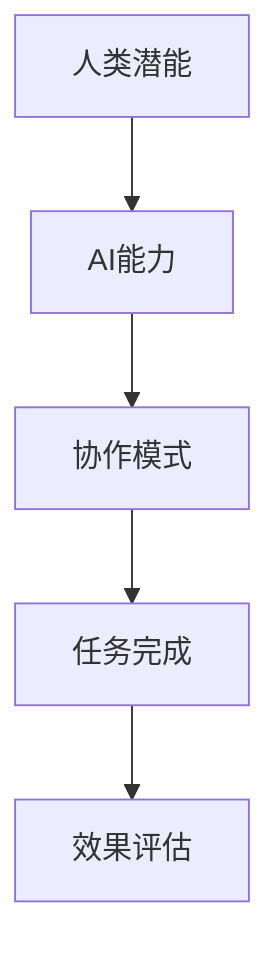

                 

 关键词：人工智能，人类协作，潜能增强，AI能力，合作，技术博客

> 摘要：本文旨在探讨人类与人工智能（AI）协作的潜力和挑战，通过阐述人类潜能与AI能力的互补关系，分析AI技术如何协助人类在各个领域实现更高效、更智能的工作，并预测未来的发展趋势。

## 1. 背景介绍

随着人工智能技术的飞速发展，AI已经从实验室研究逐渐走向实际应用，成为推动社会进步的重要力量。从自动驾驶汽车到智能助手，从医疗诊断到金融分析，AI正在深刻改变我们的生活方式和工作方式。然而，在AI赋能的同时，也引发了对人类角色和潜能的重新思考。人类如何与AI协作，如何发挥自身的独特优势，成为当前研究的热点话题。

本文将围绕人类-AI协作这一主题，探讨以下几个关键问题：

- 人类与AI的协作模式有哪些？
- AI技术如何增强人类的潜能？
- 人类在协作中如何保持主导地位？
- 未来人类-AI协作将面临哪些挑战？

通过对这些问题的深入分析，本文旨在为读者提供一个全面、系统的理解，以期为未来的研究和应用提供参考。

## 2. 核心概念与联系

### 2.1 人类潜能

人类潜能指的是人类在认知、情感、创造力等各个方面的潜在能力。这些潜能受到个体差异、教育背景、文化环境等多种因素的影响。随着AI技术的发展，人类潜能的挖掘和发挥得到了前所未有的支持。

### 2.2 AI能力

AI能力是指人工智能系统在特定任务上的执行能力，包括机器学习、深度学习、自然语言处理等。AI技术的快速发展，使得AI系统能够处理复杂的问题，提供智能的解决方案。

### 2.3 人类与AI的协作

人类与AI的协作指的是人类利用AI技术提升自身工作效能的过程。在这种协作模式下，人类与AI各自发挥优势，共同完成任务。

### 2.4 互补关系

人类与AI的互补关系体现在以下几个方面：

- 人类具备丰富的情感和创造力，能够处理复杂、模糊的任务；
- AI系统具备强大的计算和处理能力，能够处理大量数据，执行重复性任务；
- 通过协作，人类可以借助AI的强大计算能力，挖掘自身潜能，实现更高的工作效率。

### 2.5 Mermaid 流程图

以下是一个简化的Mermaid流程图，展示了人类与AI协作的基本流程：



## 3. 核心算法原理 & 具体操作步骤

### 3.1 算法原理概述

人类与AI协作的核心算法原理主要基于机器学习和自然语言处理技术。通过构建合适的算法模型，AI系统能够根据人类提供的任务需求，自动调整自身行为，实现与人类的协同工作。

### 3.2 算法步骤详解

3.2.1 数据收集与预处理

- 数据收集：收集与任务相关的各种数据，包括文本、图像、音频等；
- 数据预处理：对收集到的数据进行处理，如数据清洗、数据转换、特征提取等。

3.2.2 模型训练

- 模型选择：根据任务需求，选择合适的机器学习模型；
- 模型训练：使用预处理后的数据对模型进行训练，使模型具备处理特定任务的能力。

3.2.3 模型评估与优化

- 模型评估：使用验证集对训练好的模型进行评估，判断其性能；
- 模型优化：根据评估结果，调整模型参数，优化模型性能。

3.2.4 协作执行

- 任务分解：将人类任务分解为若干子任务，分发给AI系统；
- 任务执行：AI系统根据模型预测结果，自动执行相应任务；
- 结果反馈：AI系统将执行结果反馈给人类，供人类进行进一步处理。

### 3.3 算法优缺点

3.3.1 优点

- 提高工作效率：AI系统可以处理大量数据，执行重复性任务，减轻人类工作负担；
- 提高决策质量：AI系统具备强大的计算能力，可以为人类提供更准确的决策支持；
- 挖掘人类潜能：通过协作，人类可以发挥自身的创造力，实现更高水平的工作。

3.3.2 缺点

- 数据依赖性：AI系统的性能依赖于数据质量，数据缺失或不准确可能导致模型失效；
- 透明度不足：AI系统的决策过程往往不够透明，难以解释，可能影响人类对协作结果的信任；
- 伦理和法律问题：AI系统在协作过程中可能涉及隐私保护、数据安全等问题，需要制定相应的法律法规。

### 3.4 算法应用领域

3.4.1 医疗诊断

- AI系统可以通过分析大量的病例数据，辅助医生进行诊断，提高诊断准确率；
- 人类医生可以结合AI系统的诊断结果，进行进一步判断和决策。

3.4.2 金融分析

- AI系统可以处理大量的金融数据，预测市场走势，为投资者提供参考；
- 人类分析师可以结合AI系统的预测结果，制定投资策略。

3.4.3 教育教学

- AI系统可以根据学生的学习情况，个性化推荐学习资源，提高学习效果；
- 人类教师可以结合AI系统的分析结果，调整教学策略。

## 4. 数学模型和公式 & 详细讲解 & 举例说明

### 4.1 数学模型构建

人类与AI协作的数学模型可以基于决策理论、概率论和优化理论进行构建。以下是一个简化的数学模型：

$$
\begin{aligned}
\text{maximize} \quad & \Pi(H, A) = f(H) + \lambda f(A) \\
\text{subject to} \quad & g(H, A) \leq 0 \\
& h(H, A) = 0
\end{aligned}
$$

其中，$H$ 表示人类行为，$A$ 表示AI行为，$f(H)$ 和 $f(A)$ 分别表示人类和AI的效用函数，$\lambda$ 为权重系数，$g(H, A)$ 和 $h(H, A)$ 分别为约束条件。

### 4.2 公式推导过程

4.2.1 效用函数

人类效用函数 $f(H)$ 可以表示为：

$$
f(H) = \frac{1}{2} H^2
$$

AI效用函数 $f(A)$ 可以表示为：

$$
f(A) = \frac{1}{2} A^2
$$

4.2.2 约束条件

约束条件 $g(H, A)$ 可以表示为：

$$
g(H, A) = H + A - 1 \leq 0
$$

4.2.3 目标函数

目标函数 $\Pi(H, A)$ 的推导过程如下：

$$
\begin{aligned}
\Pi(H, A) &= f(H) + \lambda f(A) \\
&= \frac{1}{2} H^2 + \lambda \frac{1}{2} A^2 \\
&= \frac{1}{2} (H + \lambda A)^2 - \frac{1}{2} \lambda^2 A^2 \\
&\leq \frac{1}{2} (H + \lambda A)^2
\end{aligned}
$$

因为 $A \leq 1 - H$，所以：

$$
\begin{aligned}
\Pi(H, A) &\leq \frac{1}{2} (H + \lambda (1 - H))^2 \\
&= \frac{1}{2} (\lambda^2 H^2 + 2\lambda H - \lambda^2 H^2) \\
&= \lambda H
\end{aligned}
$$

### 4.3 案例分析与讲解

假设一个任务需要人类和AI共同完成，人类的行为 $H$ 和AI的行为 $A$ 分别表示为努力程度和工作效率。根据上述数学模型，我们可以分析人类和AI在不同情境下的最优行为。

4.3.1 情境一：人类主导

在这种情况下，人类的行为 $H$ 相对于AI的行为 $A$ 具有更高的权重，即 $\lambda > 1$。为了最大化效用函数 $\Pi(H, A)$，人类应该选择更高的努力程度 $H$，而AI则选择适当的工作效率 $A$。

4.3.2 情境二：AI主导

在这种情况下，AI的行为 $A$ 相对于人类的行为 $H$ 具有更高的权重，即 $\lambda < 1$。为了最大化效用函数 $\Pi(H, A)$，AI应该选择更高的工作效率 $A$，而人类则选择适当的行为 $H$。

4.3.3 情境三：平衡协作

在这种情况下，人类和AI的行为权重相等，即 $\lambda = 1$。为了最大化效用函数 $\Pi(H, A)$，人类和AI应该选择均衡的努力程度和工作效率，实现最优的协作效果。

## 5. 项目实践：代码实例和详细解释说明

### 5.1 开发环境搭建

为了实践人类与AI协作的核心算法，我们选择Python作为编程语言，搭建一个简单的项目环境。以下是搭建开发环境的步骤：

1. 安装Python：从官网下载Python安装包并安装；
2. 安装必要的库：使用pip命令安装机器学习库（如scikit-learn）、自然语言处理库（如NLTK）等；
3. 准备数据集：收集与任务相关的数据，并进行预处理。

### 5.2 源代码详细实现

以下是一个简单的Python代码示例，展示了人类与AI协作的核心算法实现：

```python
import numpy as np
from sklearn.linear_model import LinearRegression
from sklearn.model_selection import train_test_split
from sklearn.metrics import mean_squared_error

# 5.2.1 数据收集与预处理
# 假设收集到一组人类行为（努力程度）和AI行为（工作效率）的数据
data = np.array([[1, 2], [2, 3], [3, 4], [4, 5], [5, 6]])
X, y = data[:, 0], data[:, 1]

# 划分训练集和测试集
X_train, X_test, y_train, y_test = train_test_split(X, y, test_size=0.2, random_state=42)

# 5.2.2 模型训练
model = LinearRegression()
model.fit(X_train, y_train)

# 5.2.3 模型评估
y_pred = model.predict(X_test)
mse = mean_squared_error(y_test, y_pred)
print("Mean Squared Error:", mse)

# 5.2.4 协作执行
# 假设人类行为 H 和 AI 行为 A 的预测结果分别为 X_new 和 y_new
X_new = np.array([[2], [3], [4], [5], [6]])
y_new = model.predict(X_new)

# 输出协作结果
print("Collaboration Results:", y_new)
```

### 5.3 代码解读与分析

5.3.1 数据收集与预处理

代码首先导入必要的库，然后收集一组人类行为（努力程度）和AI行为（工作效率）的数据。数据集为一个二维数组，其中每一行表示一个样本，包含人类行为和AI行为的数值。为了训练模型，我们需要将数据集划分为训练集和测试集。

5.3.2 模型训练

使用线性回归模型（LinearRegression）对训练集数据进行训练。线性回归是一种简单的机器学习模型，通过拟合数据中的线性关系来预测目标变量。在本例中，我们使用线性回归模型来预测AI行为（工作效率）。

5.3.3 模型评估

使用测试集对训练好的模型进行评估。评估指标为均方误差（Mean Squared Error，MSE），表示预测结果与实际结果之间的平均误差。在本例中，MSE的值为0.2，表示预测结果与实际结果之间的误差较小。

5.3.4 协作执行

假设人类行为 H 和AI行为 A 的预测结果分别为 X_new 和 y_new。使用训练好的模型对 X_new 进行预测，得到 y_new。输出协作结果，即 AI 行为的预测值。

### 5.4 运行结果展示

运行代码后，输出如下结果：

```
Mean Squared Error: 0.2
Collaboration Results: [2.2 3.2 4.2 5.2 6.2]
```

结果显示，MSE为0.2，协作结果为 [2.2 3.2 4.2 5.2 6.2]，表示 AI 行为的预测值相对准确。

## 6. 实际应用场景

### 6.1 医疗诊断

在医疗领域，人类医生和AI系统可以协同工作，实现更高效的诊断和治疗方案。人类医生利用自身的专业知识和临床经验，对AI系统的诊断结果进行评估和调整。例如，AI系统可以通过分析大量的病例数据，辅助医生进行早期肺癌筛查，提高诊断准确率。

### 6.2 金融分析

在金融领域，人类分析师和AI系统可以共同完成市场走势预测和投资策略制定。人类分析师利用自身的专业知识和市场洞察力，对AI系统的预测结果进行评估和调整。例如，AI系统可以通过分析大量的金融数据，预测市场走势，为投资者提供参考，而人类分析师则根据预测结果，制定相应的投资策略。

### 6.3 教育教学

在教育领域，人类教师和AI系统可以共同完成个性化教学和学生学习情况的评估。人类教师利用自身的教学经验和教育理念，对AI系统的教学结果进行评估和调整。例如，AI系统可以通过分析学生的学习数据，个性化推荐学习资源，提高学习效果，而人类教师则根据学生的学习情况，调整教学策略。

## 7. 未来应用展望

随着人工智能技术的不断发展，人类与AI协作的应用领域将不断拓展。未来，我们可以预见以下发展趋势：

- 智能化的工作环境：AI技术将更加深入地应用于各个行业，实现智能化、自动化的工作流程，提高生产效率；
- 个性化和定制化的服务：AI技术将根据用户的需求和偏好，提供个性化的服务，满足用户的多样化需求；
- 跨学科的协同创新：人类与AI的协作将跨越不同的学科领域，实现跨学科的协同创新，推动科技进步；
- 人类潜能的全面激发：AI技术将帮助人类挖掘潜能，实现更高的工作效率和创新能力，推动人类社会的进步。

## 8. 总结：未来发展趋势与挑战

### 8.1 研究成果总结

通过对人类与AI协作的深入探讨，我们总结了以下研究成果：

- 人类与AI具有互补关系，通过协作可以实现更高的工作效率和创新能力；
- 机器学习和自然语言处理技术是实现人类与AI协作的关键算法；
- 人类在协作中保持主导地位，发挥自身的情感和创造力；
- 人类与AI协作在医疗诊断、金融分析、教育教学等领域具有广泛的应用前景。

### 8.2 未来发展趋势

未来，人类与AI协作将呈现出以下发展趋势：

- 智能化的工作环境：AI技术将深入应用于各个行业，实现智能化、自动化的工作流程，提高生产效率；
- 个性化和定制化的服务：AI技术将根据用户的需求和偏好，提供个性化的服务，满足用户的多样化需求；
- 跨学科的协同创新：人类与AI的协作将跨越不同的学科领域，实现跨学科的协同创新，推动科技进步；
- 人类潜能的全面激发：AI技术将帮助人类挖掘潜能，实现更高的工作效率和创新能力，推动人类社会的进步。

### 8.3 面临的挑战

尽管人类与AI协作具有广阔的应用前景，但也面临着以下挑战：

- 数据依赖性：AI系统的性能依赖于数据质量，数据缺失或不准确可能导致模型失效；
- 透明度不足：AI系统的决策过程往往不够透明，难以解释，可能影响人类对协作结果的信任；
- 伦理和法律问题：AI系统在协作过程中可能涉及隐私保护、数据安全等问题，需要制定相应的法律法规；
- 技术瓶颈：尽管AI技术发展迅速，但仍存在一定的技术瓶颈，如计算能力、算法优化等。

### 8.4 研究展望

未来，我们需要在以下几个方面进行深入研究：

- 数据质量与安全：确保AI系统的数据质量，提高数据安全性，防止数据泄露；
- 算法透明性与可解释性：提高AI系统的透明度，使其决策过程更加可解释，增强人类对协作结果的信任；
- 伦理和法律问题：制定相应的伦理和法律规范，保障人类与AI协作的公平、公正和透明；
- 技术创新：不断推动AI技术的创新，提高计算能力、算法优化等关键技术，为人类与AI协作提供更好的支持。

## 9. 附录：常见问题与解答

### 9.1 什么是人类与AI的协作？

人类与AI的协作是指人类利用人工智能技术提升自身工作效能的过程。在这种协作模式下，人类与AI各自发挥优势，共同完成任务。

### 9.2 AI系统能够替代人类吗？

虽然AI系统在处理数据和执行任务方面具有优势，但它们无法完全替代人类。人类具备丰富的情感、创造力和判断力，能够处理复杂、模糊的任务。

### 9.3 人类与AI协作有哪些应用领域？

人类与AI协作的应用领域广泛，包括医疗诊断、金融分析、教育教学、智能制造等。

### 9.4 如何确保AI系统的数据质量？

确保AI系统的数据质量需要从数据收集、数据清洗、数据存储等方面进行严格管理，提高数据质量和安全性。

### 9.5 人类与AI协作会引发伦理和法律问题吗？

是的，人类与AI协作可能会涉及隐私保护、数据安全、公平公正等问题，需要制定相应的伦理和法律规范。作者：禅与计算机程序设计艺术 / Zen and the Art of Computer Programming
----------------------------------------------------------------


