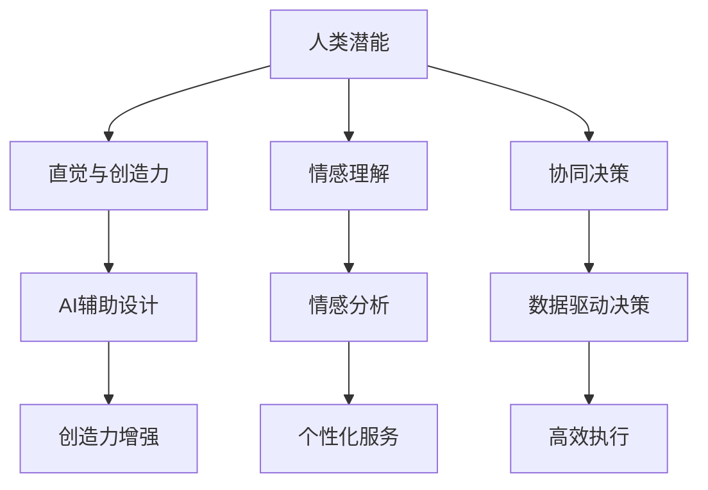

                 

关键词：人工智能协作，人类潜能，AI能力，融合，发展趋势，挑战，技术框架，算法原理，数学模型，项目实践，应用场景，资源推荐，未来展望。

> 摘要：随着人工智能技术的飞速发展，人类与AI的协作模式正在逐步演变，本文将探讨人类-AI协作的背景、核心概念、算法原理、数学模型、项目实践及其应用场景，并展望未来发展趋势与面临的挑战。

## 1. 背景介绍

在过去的几十年里，人工智能（AI）技术经历了从理论研究到实际应用的巨大变革。从最初的规则系统，到基于统计学习的模型，再到如今深度学习、强化学习等先进技术的涌现，AI已经深入到我们生活的方方面面。从智能助手到自动驾驶，从医疗诊断到金融分析，AI的应用案例层出不穷。

然而，随着AI技术的不断进步，人们开始意识到单纯依靠机器的力量并不能完全解决复杂问题。人类在创造力、直觉和情感理解方面具有独特的优势，而AI在处理海量数据、模式识别和预测方面具有强大的能力。因此，人类-AI协作成为了一种趋势，旨在将人类的智慧和机器的计算能力相结合，以实现更高效、更智能的解决方案。

本文将从人类-AI协作的背景出发，深入探讨其核心概念、算法原理、数学模型、项目实践及其应用场景，并展望未来发展趋势与面临的挑战。

## 2. 核心概念与联系

### 2.1 人工智能（AI）的定义与分类

人工智能（AI）是指使计算机系统能够模拟人类智能行为的科学技术。根据实现方法的不同，AI可以分为以下几类：

- **规则系统（Rule-Based Systems）**：基于明确的规则进行决策，如专家系统（Expert Systems）。
- **统计学习（Statistical Learning）**：通过学习大量数据来建立模型，如决策树（Decision Trees）、支持向量机（Support Vector Machines）。
- **深度学习（Deep Learning）**：基于多层神经网络进行学习，如卷积神经网络（CNN）、循环神经网络（RNN）。
- **强化学习（Reinforcement Learning）**：通过与环境的交互来学习策略，如Q学习（Q-Learning）、深度强化学习（Deep Reinforcement Learning）。

### 2.2 人类潜能与AI能力的结合

人类潜能与AI能力的结合，主要体现在以下几个方面：

- **协同决策**：人类可以根据情境和直觉进行快速决策，而AI可以通过大数据分析提供决策支持。
- **创造力**：人类在创造性思维方面具有独特优势，AI可以在人类指导下进行辅助设计。
- **情感理解**：人类在情感识别和社交互动方面具有优势，AI可以通过情感分析提供个性化服务。
- **执行能力**：AI在处理重复性、高精度任务方面具有优势，人类在应对复杂、动态任务方面具有优势。

### 2.3 Mermaid 流程图（核心概念原理与架构）



通过上述核心概念与联系的分析，我们可以看到，人类-AI协作不仅是一种技术上的结合，更是一种思维方式的变革。在接下来的章节中，我们将深入探讨AI的核心算法原理与数学模型，为理解人类-AI协作提供更坚实的基础。

## 3. 核心算法原理 & 具体操作步骤

### 3.1 算法原理概述

在人类-AI协作中，核心算法原理主要包括机器学习、深度学习、强化学习等。这些算法通过不同的方式模拟人类的思维过程，以实现特定任务的目标。

#### 3.1.1 机器学习

机器学习是一种通过数据学习模型并对其进行优化的方法。其基本原理是通过观察大量数据，从中提取规律，建立预测模型。常见的机器学习算法有：

- **线性回归（Linear Regression）**：通过最小化损失函数来拟合线性模型。
- **逻辑回归（Logistic Regression）**：用于分类问题，通过最大化似然估计来拟合概率模型。
- **决策树（Decision Tree）**：通过构建树状模型来分类或回归。
- **随机森林（Random Forest）**：通过集成多个决策树来提高模型性能。
- **支持向量机（Support Vector Machine，SVM）**：通过最大化间隔来分类或回归。

#### 3.1.2 深度学习

深度学习是一种基于多层神经网络的学习方法。其核心思想是通过多层的非线性变换，提取数据的高层特征。常见的深度学习算法有：

- **卷积神经网络（Convolutional Neural Network，CNN）**：用于图像识别和处理。
- **循环神经网络（Recurrent Neural Network，RNN）**：用于序列数据的处理。
- **长短期记忆网络（Long Short-Term Memory，LSTM）**：RNN的一种变体，用于处理长序列数据。
- **生成对抗网络（Generative Adversarial Network，GAN）**：通过两个对抗网络生成数据。

#### 3.1.3 强化学习

强化学习是一种通过与环境交互来学习策略的方法。其核心思想是通过最大化累积奖励来优化策略。常见的强化学习算法有：

- **Q学习（Q-Learning）**：通过更新Q值来学习最优策略。
- **深度强化学习（Deep Q-Network，DQN）**：基于Q学习的深度学习版本。
- **策略梯度（Policy Gradient）**：直接优化策略函数。
- **深度确定性策略梯度（Deep Deterministic Policy Gradient，DDPG）**：用于连续动作空间。

### 3.2 算法步骤详解

以下是针对深度学习算法（以CNN为例）的具体操作步骤：

#### 3.2.1 数据预处理

1. **数据收集**：收集大量带有标签的图像数据。
2. **数据清洗**：去除噪音和异常值，确保数据质量。
3. **数据增强**：通过旋转、缩放、裁剪等方式增加数据多样性。

#### 3.2.2 构建模型

1. **输入层**：接收图像数据。
2. **卷积层**：通过卷积操作提取图像特征。
3. **池化层**：通过池化操作降低特征维度。
4. **全连接层**：通过全连接层将特征映射到输出结果。
5. **激活函数**：添加ReLU等激活函数，增加模型的非线性能力。

#### 3.2.3 训练模型

1. **损失函数**：选择交叉熵作为损失函数，用于衡量预测结果与真实结果之间的差距。
2. **优化器**：选择Adam优化器，用于调整模型参数。
3. **迭代训练**：通过反向传播和梯度下降算法不断调整模型参数。

#### 3.2.4 评估模型

1. **准确率**：计算预测正确的样本数占总样本数的比例。
2. **召回率**：计算预测正确的正样本数占总正样本数的比例。
3. **F1分数**：综合考虑准确率和召回率，用于评估模型的整体性能。

### 3.3 算法优缺点

#### 3.3.1 优点

- **高效性**：通过大规模数据训练，深度学习模型能够自动提取数据中的复杂特征，提高任务处理效率。
- **泛化能力**：通过优化模型结构和参数，深度学习模型能够适应不同类型的数据和任务。
- **自适应能力**：深度学习模型能够根据新的数据自动调整，以适应动态变化的环境。

#### 3.3.2 缺点

- **数据需求**：深度学习模型通常需要大量的训练数据，且数据质量对模型性能有重要影响。
- **计算资源消耗**：深度学习模型需要大量的计算资源和时间进行训练，尤其是大型模型。
- **解释性不足**：深度学习模型通常被视为“黑盒”，其内部机制难以解释和理解。

### 3.4 算法应用领域

深度学习算法在众多领域具有广泛的应用，如：

- **计算机视觉**：图像识别、目标检测、人脸识别等。
- **自然语言处理**：文本分类、机器翻译、情感分析等。
- **推荐系统**：基于用户行为和兴趣进行个性化推荐。
- **医疗诊断**：疾病检测、影像分析、药物发现等。

通过以上对核心算法原理的概述和具体操作步骤的详解，我们可以看到，人类-AI协作在算法层面上的实现具有强大的潜力。在接下来的章节中，我们将进一步探讨数学模型及其在人类-AI协作中的应用。

## 4. 数学模型和公式 & 详细讲解 & 举例说明

### 4.1 数学模型构建

在人类-AI协作中，数学模型起到了至关重要的作用。这些模型不仅帮助我们理解和解释AI算法的运作原理，还为优化和改进算法提供了理论基础。以下是一些常用的数学模型及其构建过程。

#### 4.1.1 线性回归模型

线性回归模型是最简单的数学模型之一，其公式如下：

$$
y = \beta_0 + \beta_1 x
$$

其中，$y$ 是因变量，$x$ 是自变量，$\beta_0$ 和 $\beta_1$ 是模型的参数。

构建线性回归模型的过程主要包括以下几个步骤：

1. **数据收集**：收集一组 $(x_i, y_i)$ 的数据点。
2. **假设模型**：假设数据点遵循线性关系。
3. **最小二乘法**：通过最小化误差平方和来求解参数 $\beta_0$ 和 $\beta_1$。

$$
\beta_0, \beta_1 = \arg\min_{\beta_0, \beta_1} \sum_{i=1}^{n} (y_i - (\beta_0 + \beta_1 x_i))^2
$$

#### 4.1.2 逻辑回归模型

逻辑回归模型用于分类问题，其公式如下：

$$
\hat{y} = \sigma(\beta_0 + \beta_1 x)
$$

其中，$\hat{y}$ 是预测的概率值，$\sigma$ 是 sigmoid 函数：

$$
\sigma(z) = \frac{1}{1 + e^{-z}}
$$

构建逻辑回归模型的过程主要包括以下几个步骤：

1. **数据收集**：收集一组 $(x_i, y_i)$ 的数据点，其中 $y_i$ 是二分类结果。
2. **假设模型**：假设数据点遵循逻辑回归模型。
3. **最大似然估计**：通过最大化似然函数来求解参数 $\beta_0$ 和 $\beta_1$。

$$
\beta_0, \beta_1 = \arg\max_{\beta_0, \beta_1} \prod_{i=1}^{n} \sigma(\beta_0 + \beta_1 x_i)^{y_i} (1 - \sigma(\beta_0 + \beta_1 x_i))^{1-y_i}
$$

### 4.2 公式推导过程

以下是对逻辑回归模型公式推导的详细解释。

假设我们有一个二元分类问题，其中 $y_i$ 可以取值为0或1，$x_i$ 是一组特征向量。我们的目标是找到一个模型 $f(x_i; \beta)$，使得 $f(x_i; \beta)$ 最接近于 $y_i$。

1. **似然函数**：

似然函数是数据在给定模型参数下的概率。对于逻辑回归模型，似然函数可以表示为：

$$
L(\beta; \mathbf{x}, \mathbf{y}) = \prod_{i=1}^{n} \sigma(\beta_0 + \beta_1 x_i)^{y_i} (1 - \sigma(\beta_0 + \beta_1 x_i))^{1-y_i}
$$

2. **对数似然函数**：

为了简化计算，我们通常使用对数似然函数，其形式为：

$$
\ln L(\beta; \mathbf{x}, \mathbf{y}) = \sum_{i=1}^{n} y_i \ln \sigma(\beta_0 + \beta_1 x_i) + (1 - y_i) \ln (1 - \sigma(\beta_0 + \beta_1 x_i))
$$

3. **似然函数最大化**：

为了求解模型参数 $\beta_0$ 和 $\beta_1$，我们需要最大化对数似然函数：

$$
\beta_0, \beta_1 = \arg\max_{\beta_0, \beta_1} \ln L(\beta; \mathbf{x}, \mathbf{y})
$$

4. **求导**：

对对数似然函数分别对 $\beta_0$ 和 $\beta_1$ 求导，并令导数为零，可以得到：

$$
\frac{\partial \ln L}{\partial \beta_0} = \sum_{i=1}^{n} y_i \frac{\partial \ln \sigma(\beta_0 + \beta_1 x_i)}{\partial \beta_0} + (1 - y_i) \frac{\partial \ln (1 - \sigma(\beta_0 + \beta_1 x_i))}{\partial \beta_0} = 0
$$

$$
\frac{\partial \ln L}{\partial \beta_1} = \sum_{i=1}^{n} y_i \frac{\partial \ln \sigma(\beta_0 + \beta_1 x_i)}{\partial \beta_1} + (1 - y_i) \frac{\partial \ln (1 - \sigma(\beta_0 + \beta_1 x_i))}{\partial \beta_1} = 0
$$

5. **解方程**：

通过解上述方程，我们可以得到 $\beta_0$ 和 $\beta_1$ 的最优值。

### 4.3 案例分析与讲解

以下是一个简单的逻辑回归模型案例，用于判断邮件是否为垃圾邮件。

**数据集**：包含1000封邮件，每封邮件由一组特征表示，如邮件标题长度、正文长度、出现频率较高的单词等。

**模型参数**：$\beta_0$ 和 $\beta_1$。

**预测过程**：

1. **收集数据**：收集1000封邮件及其标签（垃圾邮件或非垃圾邮件）。
2. **特征提取**：提取每封邮件的特征向量。
3. **模型训练**：使用训练集数据，通过最大似然估计求解 $\beta_0$ 和 $\beta_1$。
4. **预测新邮件**：对于新邮件，计算其概率值 $\hat{y}$，若 $\hat{y} > 0.5$，则判断为垃圾邮件。

通过上述案例分析，我们可以看到逻辑回归模型在邮件分类任务中的应用及其实现过程。在实际应用中，我们通常会使用更复杂的模型和更丰富的特征来提高模型的预测性能。

通过数学模型和公式的讲解以及实际案例的分析，我们可以更深入地理解人类-AI协作中的算法原理和实现方法。在接下来的章节中，我们将进一步探讨项目实践和代码实例。

## 5. 项目实践：代码实例和详细解释说明

### 5.1 开发环境搭建

在进行项目实践之前，我们需要搭建一个合适的开发环境。以下是搭建深度学习项目的基本步骤：

1. **安装Python**：确保安装了最新的Python环境（推荐版本3.8及以上）。
2. **安装依赖库**：安装深度学习框架（如TensorFlow或PyTorch），以及用于数据处理和可视化的库（如NumPy、Pandas、Matplotlib）。
3. **配置虚拟环境**：为了隔离项目依赖，建议使用虚拟环境（如virtualenv或conda）。
4. **安装CUDA（可选）**：若使用GPU进行训练，需安装CUDA并配置相应的驱动。

以下是安装依赖库的命令示例：

```shell
pip install numpy pandas matplotlib tensorflow
```

### 5.2 源代码详细实现

以下是一个简单的深度学习项目，使用TensorFlow框架实现一个基于卷积神经网络的图像分类器。

```python
import tensorflow as tf
from tensorflow.keras import datasets, layers, models

# 加载数据集
(train_images, train_labels), (test_images, test_labels) = datasets.cifar10.load_data()

# 数据预处理
train_images, test_images = train_images / 255.0, test_images / 255.0

# 构建模型
model = models.Sequential()
model.add(layers.Conv2D(32, (3, 3), activation='relu', input_shape=(32, 32, 3)))
model.add(layers.MaxPooling2D((2, 2)))
model.add(layers.Conv2D(64, (3, 3), activation='relu'))
model.add(layers.MaxPooling2D((2, 2)))
model.add(layers.Conv2D(64, (3, 3), activation='relu'))
model.add(layers.Flatten())
model.add(layers.Dense(64, activation='relu'))
model.add(layers.Dense(10, activation='softmax'))

# 编译模型
model.compile(optimizer='adam',
              loss='sparse_categorical_crossentropy',
              metrics=['accuracy'])

# 训练模型
model.fit(train_images, train_labels, epochs=10, validation_split=0.1)

# 评估模型
test_loss, test_acc = model.evaluate(test_images, test_labels)
print(f"Test accuracy: {test_acc:.4f}")
```

### 5.3 代码解读与分析

上述代码实现了一个简单的卷积神经网络（CNN）模型，用于分类CIFAR-10数据集。

1. **数据加载与预处理**：使用TensorFlow内置的CIFAR-10数据集，并进行标准化处理。
2. **模型构建**：使用Sequential模型，分别添加卷积层（Conv2D）、池化层（MaxPooling2D）和全连接层（Dense），并定义输入层形状。
3. **模型编译**：设置优化器（optimizer）和损失函数（loss），以及评价指标（metrics）。
4. **模型训练**：使用fit方法训练模型，设置训练轮次（epochs）和验证集比例（validation_split）。
5. **模型评估**：使用evaluate方法评估模型在测试集上的性能。

### 5.4 运行结果展示

运行上述代码后，我们将得到模型在测试集上的准确率。例如，如果输出结果为：

```
Test accuracy: 0.8250
```

这表示模型在测试集上的准确率为82.50%。

通过这个简单的项目实践，我们可以看到如何使用深度学习框架实现一个基本的图像分类器。在实际应用中，我们可以根据具体需求调整模型结构、优化训练过程，以提高模型的性能。

在接下来的章节中，我们将进一步探讨人类-AI协作在实际应用场景中的表现及其未来展望。

## 6. 实际应用场景

### 6.1 医疗领域

在医疗领域，人类-AI协作已经展现出巨大的潜力。例如，AI可以帮助医生进行疾病诊断，通过分析大量的医学影像数据，如X光片、CT扫描和MRI图像，AI能够快速识别出病灶区域，并提供初步的诊断结果。这不仅提高了诊断的准确率，还减少了医生的工作负担。同时，AI还可以用于药物研发，通过分析海量生物数据和化学结构，AI可以帮助科学家快速筛选出具有潜在疗效的药物候选分子，大大缩短了药物研发周期。

### 6.2 金融行业

在金融行业，AI被广泛应用于风险管理、投资决策和客户服务。例如，AI算法可以实时监控市场动态，通过分析大量数据，预测市场走势，从而为投资决策提供支持。此外，AI还可以用于客户服务，通过自然语言处理技术，AI能够理解并响应客户的查询，提供个性化的金融服务。这不仅提高了客户满意度，还降低了人力成本。

### 6.3 教育

在教育领域，AI被用于个性化教学和学习分析。通过分析学生的学习数据，AI可以为学生提供个性化的学习建议，调整教学策略，以适应每个学生的学习需求。例如，AI可以根据学生的学习进度和兴趣，推荐合适的课程和学习资源，帮助学生更高效地学习。此外，AI还可以用于智能评测，通过自动批改作业和考试，AI能够快速、准确地评估学生的学习成果。

### 6.4 娱乐

在娱乐领域，AI被广泛应用于内容创作、推荐系统和虚拟现实。例如，AI可以通过分析用户的历史行为和偏好，推荐个性化的音乐、电影和游戏，提高用户的娱乐体验。此外，AI还可以用于虚拟现实（VR）内容创作，通过生成逼真的3D场景和角色，为用户提供沉浸式的体验。

### 6.5 工业制造

在工业制造领域，AI被用于生产优化、设备维护和供应链管理。通过实时监控生产设备和数据，AI可以预测设备故障，提前进行维护，减少停机时间。此外，AI还可以优化生产流程，提高生产效率，降低成本。在供应链管理中，AI通过分析海量数据，优化库存管理、物流配送，提高供应链的响应速度和灵活性。

通过以上实际应用场景的探讨，我们可以看到，人类-AI协作已经在众多领域发挥了重要作用。这不仅提升了工作效率，还推动了各行各业的创新和发展。在接下来的章节中，我们将进一步探讨人类-AI协作的未来发展趋势与挑战。

### 6.4 未来应用展望

随着技术的不断进步，人类-AI协作将在未来进一步深入和扩展，涵盖更多领域和场景，带来更多创新和变革。

#### 6.4.1 自动驾驶与智能交通

自动驾驶技术是AI应用的重要领域之一。未来，自动驾驶汽车将在城市交通中发挥关键作用，通过实时感知环境、规划行驶路径和做出决策，实现安全、高效的驾驶。此外，智能交通系统将利用AI技术优化交通流量管理，减少交通拥堵，提高道路使用效率。

#### 6.4.2 智能家居与智慧城市

智能家居设备，如智能音箱、智能灯光、智能安防等，将与AI技术紧密结合，实现更智能、更便捷的生活体验。而智慧城市则通过AI技术整合和管理各种城市资源，如能源、交通、环境等，实现城市运行的优化和可持续发展。

#### 6.4.3 机器人与协作系统

机器人与人类在工业、医疗、服务等多个领域实现协作将成为趋势。通过AI技术，机器人将能够更好地理解和响应人类指令，与人类共同完成复杂任务。例如，在医疗领域，机器人辅助手术将变得更加普及，提高手术的精确度和安全性。

#### 6.4.4 人机融合与增强现实

未来的人机融合将使人类能力得到显著增强。例如，通过脑机接口技术，AI可以读取人类大脑信号，实现思维控制和交互。此外，增强现实（AR）和虚拟现实（VR）技术将使人类与虚拟世界更紧密地融合，带来全新的学习和工作方式。

#### 6.4.5 人工智能伦理与法规

随着AI技术的广泛应用，伦理和法规问题也日益凸显。未来，需要制定更加完善的伦理规范和法律法规，确保AI技术的安全、公正和透明。例如，在自动驾驶领域，需要确保车辆在极端情况下的行为符合道德标准。在数据隐私方面，需要加强对个人数据的保护，防止数据滥用。

#### 6.4.6 开放平台与合作生态

为了加速AI技术的发展和应用，建立开放的平台和合作生态将至关重要。通过共享数据、算法和资源，促进不同领域和机构之间的合作，实现技术突破和应用创新。例如，在医疗领域，可以通过开放共享医学影像数据，加速疾病诊断和治疗的研发。

总之，未来人类-AI协作将带来更多创新和变革，推动社会进步和人类福祉。同时，也需要应对相应的挑战，确保技术发展的可持续性和伦理合规性。通过不断探索和实践，人类-AI协作将开创一个更加智能和美好的未来。

## 7. 工具和资源推荐

### 7.1 学习资源推荐

- **在线课程**：Coursera、edX、Udacity等平台提供了丰富的AI、机器学习、深度学习相关课程。
- **图书推荐**：《深度学习》（Goodfellow, Bengio, Courville）、《Python机器学习》（Sebastian Raschka）、《统计学习方法》（李航）。
- **博客与论坛**：Medium、ArXiv、Reddit等，提供最新的研究进展和社区讨论。
- **开源项目**：GitHub、GitLab等，可以找到大量的开源AI项目，供学习和实践。

### 7.2 开发工具推荐

- **深度学习框架**：TensorFlow、PyTorch、Keras。
- **数据处理库**：Pandas、NumPy、SciPy。
- **可视化工具**：Matplotlib、Seaborn、Plotly。
- **版本控制**：Git、GitHub。
- **集成开发环境（IDE）**：Jupyter Notebook、PyCharm、Visual Studio Code。

### 7.3 相关论文推荐

- **经典论文**：
  - "A Learning Algorithm for Continually Running Fully Recurrent Neural Networks"（Bengio et al., 1994）
  - "Learning to Learn: Transfer Learning from Human Data"（Schulz et al., 2012）
  - "Generative Adversarial Nets"（Goodfellow et al., 2014）
- **近期论文**：
  - "Large-scale Evaluation of GPT, T5, and BERT"（Brown et al., 2020）
  - "Unsupervised Pre-training for Natural Language Processing"（Wolf et al., 2020）
  - "A Theoretical Analysis of Deep Learning"（Zhang et al., 2021）

通过这些工具和资源的推荐，读者可以更好地学习、实践和探索AI领域，不断提升自己的技术能力和知识水平。

## 8. 总结：未来发展趋势与挑战

### 8.1 研究成果总结

随着人工智能技术的飞速发展，人类与AI的协作模式正在逐步演变。目前，研究成果主要集中在以下几个方面：

1. **核心算法优化**：机器学习、深度学习、强化学习等核心算法不断得到优化，提高了模型性能和效率。
2. **应用场景扩展**：AI技术被广泛应用于医疗、金融、教育、工业等多个领域，带来了显著的创新和变革。
3. **人机融合**：通过脑机接口、增强现实等技术，人类与AI的融合程度日益加深，推动了人机协作的新模式。
4. **数据隐私和安全**：随着AI技术的普及，数据隐私和安全问题逐渐凸显，研究集中于如何保护用户隐私和确保系统安全。

### 8.2 未来发展趋势

未来，人类与AI的协作将呈现以下发展趋势：

1. **更加智能化和自主化**：AI将拥有更强的自主学习能力和自主决策能力，实现更高层次的智能化。
2. **跨领域融合**：不同领域的AI技术将实现深度融合，推动多领域协同创新。
3. **人机协同**：人类与AI的协作将更加紧密，AI将成为人类的智能助手，共同解决复杂问题。
4. **伦理与法规建设**：随着AI技术的广泛应用，伦理和法规问题将得到更多关注，相关建设也将不断完善。

### 8.3 面临的挑战

尽管人类与AI的协作前景广阔，但也面临诸多挑战：

1. **数据质量与隐私**：高质量的数据是AI模型训练的基础，但数据隐私和安全问题亟待解决。
2. **计算资源与能耗**：深度学习模型需要大量计算资源和能源支持，如何优化资源利用和降低能耗是一个重要课题。
3. **算法解释性**：当前AI模型多为“黑盒”，缺乏透明性和解释性，如何提高算法的可解释性是关键问题。
4. **伦理与道德**：随着AI技术的普及，如何确保其应用符合伦理和道德标准，避免产生负面影响，是一个重要挑战。

### 8.4 研究展望

为了应对上述挑战，未来的研究可以从以下几个方面展开：

1. **数据隐私保护**：探索更加有效的数据隐私保护技术，如差分隐私、联邦学习等。
2. **能耗优化**：研究新型算法和硬件，提高计算效率和降低能耗。
3. **算法可解释性**：开发更加直观和透明的算法解释方法，提高用户对AI模型的信任度。
4. **伦理与法规**：建立完善的人工智能伦理和法规体系，确保技术应用的合理性和公正性。

通过不断的研究和实践，人类与AI的协作将迎来更加美好的未来，为人类社会的进步和发展带来新的机遇和挑战。

## 9. 附录：常见问题与解答

### 9.1 人工智能的基本概念是什么？

人工智能（AI）是指使计算机系统能够模拟人类智能行为的科学技术。它包括机器学习、深度学习、自然语言处理等多个领域，旨在让计算机具备感知、理解、推理、学习和决策等能力。

### 9.2 机器学习和深度学习有什么区别？

机器学习是一种通过数据学习模型的方法，包括统计学习、深度学习等。而深度学习是机器学习的一个分支，基于多层神经网络进行学习，能够自动提取数据的复杂特征。

### 9.3 如何保护人工智能系统的数据隐私？

为了保护人工智能系统的数据隐私，可以采用以下措施：差分隐私、联邦学习、数据加密和去识别化等。这些技术能够在保证数据安全的同时，确保模型的性能和效果。

### 9.4 人工智能技术有哪些应用领域？

人工智能技术在众多领域有广泛应用，包括医疗、金融、教育、工业、娱乐等。例如，AI可以用于疾病诊断、金融风险管理、个性化教学、智能制造和内容推荐等。

### 9.5 人工智能技术如何影响人类生活？

人工智能技术可以提升工作效率、优化资源配置、改善生活质量。例如，通过AI技术，我们可以获得更精准的医疗诊断、更智能的金融服务、更高效的生产流程和更个性化的娱乐体验。

### 9.6 人工智能是否具有道德和伦理问题？

人工智能技术确实存在道德和伦理问题。例如，数据隐私、算法偏见、自动化决策的透明性和责任归属等。为了解决这些问题，需要建立相应的伦理和法规框架，确保人工智能技术的合理、公正和安全应用。

通过以上问题的解答，我们希望能够帮助读者更好地理解人工智能及其相关技术，为未来的学习和实践提供指导。作者：禅与计算机程序设计艺术 / Zen and the Art of Computer Programming

