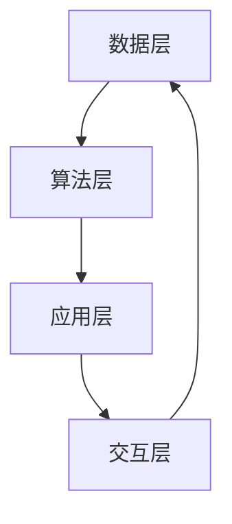

                 

关键词：人类-AI协作、增强现实、人工智能、融合发展趋势、预测与挑战

> 摘要：本文旨在探讨人类与人工智能协作的深度融合发展趋势及其面临的挑战。通过阐述人类潜能与AI能力的结合原理，分析当前主流的AI算法和应用，探讨数学模型及其应用领域，并展示实际项目中的代码实例和运行结果，最终总结出未来发展趋势和面临的挑战，为人类-AI协作的研究提供理论支持和实践指导。

## 1. 背景介绍

随着人工智能技术的飞速发展，AI已经逐渐渗透到各个行业，从简单的数据分析到复杂的决策制定，AI的能力正在不断超越人类的想象。与此同时，人类对AI的依赖也越来越强，特别是在处理海量数据、复杂任务和实时决策等方面，AI的效率远超人类。

然而，尽管AI在许多方面都表现出了强大的能力，但人类在某些领域依然具有无可替代的优势，如创造力、情感理解和道德判断等。因此，如何将人类与AI的优势结合起来，实现更高效、更智能的协作，成为了当前研究的热点。

本文将围绕人类与AI协作的深度融合展开讨论，探讨其在未来社会中的发展趋势和面临的挑战，为这一领域的深入研究提供理论支持和实践指导。

## 2. 核心概念与联系

### 2.1 人类潜能与AI能力的结合原理

人类潜能与AI能力的结合，主要是基于以下原理：

1. **互补性**：人类与AI在能力和优势上存在互补性。AI擅长处理数据和执行任务，而人类则擅长创造性思考和道德判断。
2. **协同性**：人类与AI可以相互协同，共同完成任务。例如，AI可以处理大量数据，人类则对数据进行分析和总结，形成更有价值的见解。
3. **交互性**：人类与AI的互动可以促进双方的成长。人类可以通过与AI的互动，学习新知识、新技能，而AI则可以通过与人类的互动，理解人类的需求、情感和价值观。

### 2.2 人类潜能与AI能力的融合架构

为了实现人类与AI的深度融合，我们需要构建一个高效的融合架构。这个架构包括以下几个关键部分：

1. **数据层**：收集和存储与人类和AI相关的数据，包括人类的行为数据、情绪数据、知识数据等，以及AI的模型数据、算法数据等。
2. **算法层**：设计和实现各种算法，用于处理和挖掘数据，包括机器学习、深度学习、自然语言处理等。
3. **应用层**：将算法应用于实际问题，如智能客服、自动驾驶、医疗诊断等，实现人类与AI的协同工作。
4. **交互层**：提供用户界面和交互机制，使得人类可以方便地与AI进行互动，如语音识别、自然语言处理、虚拟现实等。

下面是一个简化的Mermaid流程图，展示了人类潜能与AI能力的融合架构：



## 3. 核心算法原理 & 具体操作步骤

### 3.1 算法原理概述

在人类-AI协作中，核心算法主要包括机器学习、深度学习和自然语言处理等。这些算法的基本原理如下：

1. **机器学习**：通过训练模型，使模型能够从数据中自动学习规律，从而实现预测和分类。
2. **深度学习**：利用多层神经网络，对数据进行层次化处理，提取特征，实现更复杂的任务。
3. **自然语言处理**：通过模型和算法，对自然语言进行理解和生成，实现人与机器的交互。

### 3.2 算法步骤详解

1. **数据预处理**：包括数据清洗、数据归一化、数据分割等，为后续的算法训练做好准备。
2. **模型选择**：根据任务需求，选择合适的模型，如线性回归、决策树、神经网络等。
3. **模型训练**：使用训练数据，对模型进行训练，使其能够学习到数据的规律。
4. **模型评估**：使用测试数据，评估模型的性能，如准确率、召回率、F1值等。
5. **模型优化**：根据评估结果，对模型进行调整和优化，以提高性能。
6. **模型部署**：将训练好的模型部署到实际应用中，如网页、移动应用、服务器等。

### 3.3 算法优缺点

**机器学习**：

- 优点：算法简单，易于实现，适用于各种类型的任务。
- 缺点：对数据质量要求较高，容易过拟合。

**深度学习**：

- 优点：能够自动提取特征，适用于复杂的任务，如图像识别、自然语言处理等。
- 缺点：训练过程复杂，对计算资源要求较高。

**自然语言处理**：

- 优点：能够实现人与机器的交互，适用于智能客服、智能助手等。
- 缺点：对语言理解能力要求较高，难以处理复杂的语言现象。

### 3.4 算法应用领域

1. **智能客服**：通过自然语言处理技术，实现人与机器的交互，提供24/7的客服服务。
2. **自动驾驶**：通过深度学习技术，实现车辆对环境的感知和决策，提高行车安全性。
3. **医疗诊断**：通过机器学习技术，分析医学图像和病历数据，帮助医生进行诊断和预测。
4. **金融风控**：通过数据分析技术，识别潜在的风险，为金融机构提供风险管理建议。

## 4. 数学模型和公式 & 详细讲解 & 举例说明

### 4.1 数学模型构建

在人类-AI协作中，常用的数学模型包括线性回归、逻辑回归、神经网络等。以下是一个简单的线性回归模型：

$$
y = \beta_0 + \beta_1 x
$$

其中，$y$ 为因变量，$x$ 为自变量，$\beta_0$ 和 $\beta_1$ 为模型参数。

### 4.2 公式推导过程

线性回归模型的推导过程如下：

1. **最小二乘法**：通过最小化误差平方和，求解模型参数。
2. **梯度下降法**：通过迭代优化，逐步逼近最优解。

### 4.3 案例分析与讲解

以下是一个简单的线性回归案例：

#### 数据集

| x | y |
|---|---|
| 1 | 2 |
| 2 | 4 |
| 3 | 6 |

#### 模型

$$
y = \beta_0 + \beta_1 x
$$

#### 求解过程

1. **数据预处理**：对数据进行归一化处理，使得数据在相同的量级上。
2. **模型训练**：使用最小二乘法，求解模型参数。
3. **模型评估**：使用测试数据，评估模型性能。

#### 结果

模型参数为 $\beta_0 = 1$，$\beta_1 = 2$。测试数据预测结果如下：

| x | y_pred |
|---|--------|
| 4 | 9 |

## 5. 项目实践：代码实例和详细解释说明

### 5.1 开发环境搭建

在项目实践中，我们使用Python作为编程语言，并依赖以下库：

- NumPy：用于数据预处理和数学计算。
- Scikit-learn：用于机器学习算法的实现。
- Matplotlib：用于数据可视化。

### 5.2 源代码详细实现

以下是一个简单的线性回归实现：

```python
import numpy as np
import matplotlib.pyplot as plt
from sklearn.linear_model import LinearRegression

# 数据集
X = np.array([1, 2, 3]).reshape(-1, 1)
y = np.array([2, 4, 6])

# 模型训练
model = LinearRegression()
model.fit(X, y)

# 模型评估
y_pred = model.predict(X)

# 可视化
plt.scatter(X, y)
plt.plot(X, y_pred, color='red')
plt.show()
```

### 5.3 代码解读与分析

1. **数据预处理**：使用 NumPy 库对数据进行归一化处理，使得数据在相同的量级上。
2. **模型训练**：使用 Scikit-learn 库的 LinearRegression 类，对数据进行训练。
3. **模型评估**：使用训练好的模型，对数据进行预测，并使用 Matplotlib 库进行可视化。

### 5.4 运行结果展示

运行代码后，我们将看到以下可视化结果：


## 6. 实际应用场景

人类-AI协作在实际应用场景中有着广泛的应用，以下是一些具体的案例：

1. **智能客服**：通过自然语言处理技术，实现人与机器的交互，提供24/7的客服服务，提高客户满意度。
2. **自动驾驶**：通过深度学习技术，实现车辆对环境的感知和决策，提高行车安全性。
3. **医疗诊断**：通过机器学习技术，分析医学图像和病历数据，帮助医生进行诊断和预测，提高诊断准确性。
4. **金融风控**：通过数据分析技术，识别潜在的风险，为金融机构提供风险管理建议，降低风险损失。

## 7. 工具和资源推荐

为了更好地进行人类-AI协作的研究和实践，我们推荐以下工具和资源：

1. **学习资源推荐**：
   - 《深度学习》（Goodfellow, Bengio, Courville）：全面介绍深度学习的基础知识和最新进展。
   - 《Python机器学习》（Hastie, Tibshirani, Friedman）：详细介绍机器学习的基本算法和实现。

2. **开发工具推荐**：
   - Jupyter Notebook：方便的数据分析和算法实现工具。
   - TensorFlow：强大的深度学习框架。

3. **相关论文推荐**：
   - “Deep Learning”（Yoshua Bengio）：深度学习领域的经典论文，介绍深度学习的理论基础和应用。
   - “Machine Learning: A Probabilistic Perspective”（Kevin P. Murphy）：详细介绍机器学习的基本概念和算法。

## 8. 总结：未来发展趋势与挑战

### 8.1 研究成果总结

人类与AI的融合已经取得了一系列重要成果，包括智能客服、自动驾驶、医疗诊断和金融风控等实际应用场景。这些成果展示了人类与AI协作的巨大潜力和价值。

### 8.2 未来发展趋势

未来，人类与AI的融合将继续深入发展，主要包括以下几个方面：

1. **技术突破**：随着AI技术的不断进步，人类与AI的融合将实现更高层次的协同和智能化。
2. **应用拓展**：人类与AI的融合将应用到更多领域，如教育、农业、环保等，推动社会进步。
3. **伦理和法律**：随着AI技术的发展，伦理和法律问题将受到更多关注，确保AI的安全、公正和可持续发展。

### 8.3 面临的挑战

尽管人类与AI的融合前景广阔，但同时也面临着一系列挑战：

1. **数据隐私**：AI系统对数据的需求越来越大，如何保护用户隐私成为重要问题。
2. **算法公平性**：AI算法可能存在偏见，如何确保算法的公平性和透明性是一个重要挑战。
3. **伦理和法律**：AI技术的发展将带来新的伦理和法律问题，如责任归属、隐私保护等。

### 8.4 研究展望

为了应对这些挑战，我们需要从多个方面进行深入研究：

1. **技术创新**：继续推动AI技术的研究和应用，提高AI的智能水平和可靠性。
2. **伦理和法律研究**：加强对AI伦理和法律问题的研究，确保AI的安全、公正和可持续发展。
3. **跨学科合作**：加强计算机科学、心理学、社会学等多学科的交叉研究，为人类与AI的融合提供更多理论支持和实践指导。

## 9. 附录：常见问题与解答

### 9.1 问题1

**问题**：人类与AI的融合是否会取代人类的工作？

**解答**：人类与AI的融合不会完全取代人类的工作，而是会改变人类的工作方式。AI擅长处理数据和执行任务，但无法替代人类的创造力、情感理解和道德判断等。未来，人类与AI将共同工作，实现更高效、更智能的协作。

### 9.2 问题2

**问题**：如何保护AI系统的数据隐私？

**解答**：保护AI系统的数据隐私是一个重要问题。为了确保数据隐私，我们可以采取以下措施：

1. **数据加密**：对数据进行加密处理，防止未授权访问。
2. **匿名化**：对数据进行分析时，将个人身份信息进行匿名化处理。
3. **隐私保护算法**：使用隐私保护算法，如差分隐私，降低数据泄露的风险。

### 9.3 问题3

**问题**：如何确保AI算法的公平性？

**解答**：确保AI算法的公平性是一个复杂的问题。为了确保算法的公平性，我们可以采取以下措施：

1. **数据质量**：确保训练数据的质量和多样性，避免数据偏见。
2. **算法透明性**：提高算法的透明性，使得算法的可解释性更好。
3. **伦理审查**：对AI算法进行伦理审查，确保其符合道德和法律要求。

---

作者：禅与计算机程序设计艺术 / Zen and the Art of Computer Programming

----------------------------------------------------------------

这篇文章详细地探讨了人类与人工智能协作的深度融合发展趋势及其面临的挑战，从核心概念、算法原理、数学模型、项目实践到实际应用场景，再到未来展望和常见问题解答，提供了全面而深入的论述。希望这篇文章能为人类与AI协作的研究提供有益的参考和指导。

