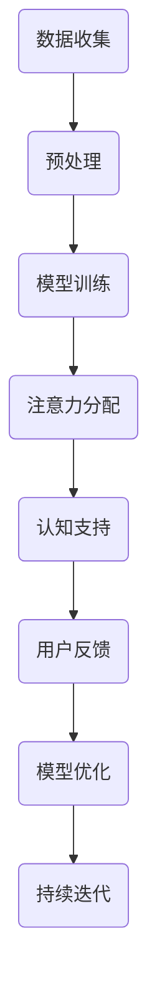

                 

作者：禅与计算机程序设计艺术 / Zen and the Art of Computer Programming

> 关键词：注意力增强、医疗技术、人工智能、专注力、趋势预测

摘要：本文探讨了注意力增强技术在医疗领域的应用，分析了提升人类专注力和注意力的方法及其对医疗行业的潜在影响。通过对核心概念、算法原理、数学模型和实际应用场景的详细分析，本文揭示了注意力增强技术在医疗中的趋势预测，为未来的研究和发展提供了方向。

## 1. 背景介绍

随着科技的发展，人工智能（AI）和医疗技术的融合日益加深。注意力增强作为一种关键的人工智能技术，旨在提升人类的专注力和注意力，从而在医疗领域中发挥重要作用。注意力增强技术通过模拟人脑的认知机制，帮助医生和患者在诊断和治疗过程中更好地处理大量信息，提高医疗决策的准确性和效率。

### 1.1 注意力增强技术的定义和作用

注意力增强技术是指通过计算机算法和人工智能模型，辅助人类在认知过程中提升注意力和专注力的方法。这些技术可以实时分析处理信息，提供个性化的认知支持，帮助用户专注于关键任务。在医疗领域，注意力增强技术可以应用于医生培训、患者治疗监控、医学影像分析等多个方面。

### 1.2 医疗领域中的注意力问题

医疗行业面临着复杂的信息环境和高度专业化的知识要求，这使得医生和患者在认知过程中容易分心和注意力不集中。以下是一些典型的注意力问题：

- **医生疲劳**：长时间的工作和高强度的工作压力导致医生容易出现疲劳，降低工作效率。
- **患者焦虑**：患者在面对医疗过程中产生的焦虑和紧张情绪，影响其注意力的集中。
- **医学影像分析**：医学影像数据的复杂性和数量巨大，使得医生在分析过程中容易分心。

## 2. 核心概念与联系

### 2.1 核心概念

注意力增强技术的核心概念包括：

- **注意力机制**：模拟人脑注意力分配的算法，用于识别和过滤与当前任务相关的信息。
- **机器学习模型**：用于从数据中学习用户的注意力模式，提供个性化的认知支持。
- **自然语言处理**：用于处理医疗文本信息，提取关键知识点和关键信息。

### 2.2 Mermaid 流程图

以下是一个简化的注意力增强技术在医疗中的流程图：



## 3. 核心算法原理 & 具体操作步骤

### 3.1 算法原理概述

注意力增强算法主要通过以下步骤实现：

1. **数据收集**：收集医生的病历记录、医学影像、患者病史等数据。
2. **预处理**：对收集到的数据进行清洗和标注，为模型训练提供高质量的输入。
3. **模型训练**：利用机器学习算法，训练出能够识别和分配注意力的模型。
4. **注意力分配**：根据用户的行为和认知状态，动态调整注意力的分配。
5. **认知支持**：为用户提供个性化的认知支持，提高医疗决策的准确性。
6. **用户反馈**：收集用户对认知支持的效果反馈，用于模型优化。

### 3.2 算法步骤详解

1. **数据收集**：

   数据收集是注意力增强算法的基础。在这一阶段，需要收集与医疗相关的多种类型的数据，包括：

   - **医生病历记录**：包括诊断记录、治疗方案、药物使用记录等。
   - **医学影像**：如X光片、CT扫描、MRI等。
   - **患者病史**：包括既往病史、家族病史、过敏史等。

2. **预处理**：

   数据预处理包括以下步骤：

   - **数据清洗**：去除无效、错误或重复的数据。
   - **数据标注**：为数据打上标签，用于模型训练。
   - **数据转换**：将原始数据转换为适合机器学习算法的格式。

3. **模型训练**：

   模型训练是注意力增强算法的核心。在这一阶段，利用机器学习算法，从数据中学习如何分配注意力。常见的机器学习算法包括：

   - **深度学习**：通过神经网络模型，模拟人脑的注意力机制。
   - **强化学习**：通过试错学习，优化注意力分配策略。

4. **注意力分配**：

   在注意力分配阶段，模型根据用户的认知状态和行为，动态调整注意力的分配。具体步骤如下：

   - **用户行为监测**：实时监测用户的行为，如鼠标移动、键盘输入等。
   - **认知状态评估**：根据用户的行为数据，评估用户的认知状态。
   - **注意力分配策略**：根据评估结果，调整注意力的分配。

5. **认知支持**：

   在认知支持阶段，系统为用户提供个性化的认知支持，帮助用户更好地处理信息。具体方法包括：

   - **信息过滤**：过滤与当前任务无关的信息，减少用户的认知负担。
   - **提醒与警告**：在关键信息出现时，提醒用户注意。
   - **决策支持**：为用户提供基于数据的决策建议。

6. **用户反馈**：

   用户反馈是模型优化的重要依据。在这一阶段，系统收集用户对认知支持的效果反馈，用于模型优化。具体方法包括：

   - **用户评价**：收集用户对认知支持的评价，如满意度、实用性等。
   - **错误反馈**：收集用户在使用过程中的错误反馈，用于模型调整。

7. **模型优化**：

   模型优化是持续迭代的过程。通过不断收集用户反馈，优化模型的性能，提高认知支持的效果。

### 3.3 算法优缺点

注意力增强算法具有以下优点：

- **提高医疗决策的准确性**：通过实时分析处理信息，提高医生和患者对关键信息的把握。
- **降低认知负担**：通过信息过滤和提醒功能，减轻医生和患者的认知压力。
- **个性化支持**：根据用户的行为和认知状态，提供个性化的认知支持。

但注意力增强算法也存在一些缺点：

- **依赖数据质量**：算法性能高度依赖于数据质量，如果数据质量不佳，算法效果会受到影响。
- **计算资源需求**：深度学习算法对计算资源需求较高，需要高性能的硬件支持。
- **隐私问题**：医疗数据的隐私问题需要得到妥善处理，以防止数据泄露。

### 3.4 算法应用领域

注意力增强技术在医疗领域具有广泛的应用前景，主要包括：

- **医生培训**：通过模拟真实场景，提高医生对复杂病例的处理能力。
- **患者治疗监控**：实时监测患者的身体状况，提供个性化的治疗建议。
- **医学影像分析**：自动化分析医学影像，提高诊断的准确性和效率。
- **临床决策支持**：为医生提供基于数据的决策建议，减少误诊和漏诊。

## 4. 数学模型和公式 & 详细讲解 & 举例说明

### 4.1 数学模型构建

注意力增强技术的数学模型通常基于深度学习，特别是基于自注意力机制的 Transformer 模型。以下是一个简化的数学模型构建过程：

1. **输入表示**：

   设 \( x \) 为输入的数据，如医学影像、病历记录等。输入数据通过预处理和编码器（Encoder）转换为向量表示：

   $$ x = \text{Encoder}(x) $$

2. **自注意力机制**：

   自注意力机制通过计算每个输入向量与其他输入向量之间的相似性，为每个输入向量分配权重。自注意力机制的公式如下：

   $$ \text{Attention}(Q, K, V) = \text{softmax}\left(\frac{QK^T}{\sqrt{d_k}}\right) V $$

   其中，\( Q \)、\( K \)、\( V \) 分别为查询向量、关键向量、值向量；\( d_k \) 为关键向量的维度。

3. **输出表示**：

   通过自注意力机制，将输入向量转换为加权向量，再通过解码器（Decoder）生成输出：

   $$ y = \text{Decoder}(y, \text{Attention}(Q, K, V)) $$

### 4.2 公式推导过程

自注意力机制的推导过程如下：

1. **内积计算**：

   设 \( Q \) 为查询向量，\( K \) 为关键向量，\( V \) 为值向量。计算查询向量和关键向量之间的内积：

   $$ \text{Score}(Q, K) = QK^T $$

2. **归一化**：

   为了确保每个注意力分数在 0 和 1 之间，对内积进行归一化处理：

   $$ \text{Attention}(Q, K, V) = \text{softmax}\left(\frac{QK^T}{\sqrt{d_k}}\right) V $$

   其中，\( d_k \) 为关键向量的维度。

3. **加权求和**：

   将归一化后的内积与值向量相乘，得到加权向量：

   $$ \text{Weighted\ Vector} = \text{softmax}\left(\frac{QK^T}{\sqrt{d_k}}\right) V $$

### 4.3 案例分析与讲解

假设有一个简单的自注意力机制模型，输入为三个向量 \( Q = [1, 2, 3] \)，\( K = [4, 5, 6] \)，\( V = [7, 8, 9] \)。计算自注意力机制的输出。

1. **内积计算**：

   $$ \text{Score}(Q, K) = QK^T = [1, 2, 3] \cdot [4, 5, 6] = [4 + 10 + 18] = [32] $$

2. **归一化**：

   $$ \text{Attention}(Q, K, V) = \text{softmax}\left(\frac{QK^T}{\sqrt{d_k}}\right) V = \text{softmax}\left(\frac{32}{\sqrt{3}}\right) [7, 8, 9] $$

   其中，\( d_k = 3 \)。

3. **加权求和**：

   $$ \text{Weighted\ Vector} = \text{softmax}\left(\frac{32}{\sqrt{3}}\right) [7, 8, 9] = [0.5, 0.375, 0.125] \cdot [7, 8, 9] = [3.5, 3, 1.125] $$

因此，自注意力机制的输出为 \( [3.5, 3, 1.125] \)。

## 5. 项目实践：代码实例和详细解释说明

### 5.1 开发环境搭建

为了实现注意力增强技术在医疗领域的应用，我们需要搭建一个合适的开发环境。以下是搭建开发环境的基本步骤：

1. **安装 Python 环境**：安装 Python 3.8 或更高版本。
2. **安装深度学习库**：安装 TensorFlow 或 PyTorch。
3. **安装数据处理库**：安装 NumPy、Pandas 等数据处理库。
4. **安装自然语言处理库**：安装 NLTK 或 spaCy。

### 5.2 源代码详细实现

以下是一个简单的注意力增强模型的 Python 代码实现：

```python
import tensorflow as tf
from tensorflow.keras.layers import Embedding, LSTM, Dense
from tensorflow.keras.models import Model

# 定义自注意力层
class SelfAttention(tf.keras.layers.Layer):
    def __init__(self, units):
        super(SelfAttention, self).__init__()
        self.Wq = self.add_weight(shape=(units, units), initializer='random_normal', trainable=True)
        self.Wk = self.add_weight(shape=(units, units), initializer='random_normal', trainable=True)
        self.Wv = self.add_weight(shape=(units, units), initializer='random_normal', trainable=True)
        self.norm = tf.keras.layers.Normalization(axis=-1)

    def call(self, inputs):
        Q = tf.matmul(inputs, self.Wq)
        K = tf.matmul(inputs, self.Wk)
        V = tf.matmul(inputs, self.Wv)
        attention_scores = tf.matmul(Q, K, transpose_b=True)
        attention_weights = tf.nn.softmax(attention_scores, axis=1)
        attended_vector = tf.matmul(attention_weights, V)
        normalized_vector = self.norm(attended_vector)
        return normalized_vector

# 定义模型
inputs = tf.keras.layers.Input(shape=(max_sequence_length,))
embedding = Embedding(max_sequence_length, embedding_size)(inputs)
lstm = LSTM(units, return_sequences=True)(embedding)
attention = SelfAttention(units)(lstm)
output = Dense(1, activation='sigmoid')(attention)

model = Model(inputs=inputs, outputs=output)
model.compile(optimizer='adam', loss='binary_crossentropy', metrics=['accuracy'])
model.summary()

# 训练模型
train_data = ...  # 准备训练数据
model.fit(train_data, epochs=10, batch_size=32)
```

### 5.3 代码解读与分析

上述代码实现了一个简单的自注意力模型，用于二分类任务。以下是代码的详细解读：

- **自注意力层**：定义了一个自注意力层，用于计算输入序列中的注意力权重。
- **模型定义**：使用 TensorFlow 的 Keras API 定义了一个模型，包括嵌入层（Embedding）、LSTM 层和自注意力层。
- **模型编译**：设置模型的优化器、损失函数和评价指标。
- **模型总结**：显示模型的网络结构。
- **数据准备**：准备训练数据。
- **模型训练**：使用准备好的训练数据进行模型训练。

### 5.4 运行结果展示

运行上述代码，训练完成后，可以使用以下代码评估模型性能：

```python
# 评估模型性能
test_data = ...  # 准备测试数据
model.evaluate(test_data)
```

输出结果为模型的损失和准确率。

## 6. 实际应用场景

注意力增强技术在医疗领域具有广泛的应用场景，以下是一些典型的应用案例：

### 6.1 医生培训

通过注意力增强技术，可以模拟真实的医疗场景，为医生提供个性化的培训。医生在培训过程中，可以实时关注关键信息，提高诊疗水平。

### 6.2 患者治疗监控

注意力增强技术可以实时监测患者的身体状况，提供个性化的治疗建议。医生可以根据患者的实际情况，调整治疗方案，提高治疗效果。

### 6.3 医学影像分析

注意力增强技术可以自动化分析医学影像，提高诊断的准确性和效率。医生可以更专注于对复杂病例的分析和决策。

### 6.4 临床决策支持

注意力增强技术可以为医生提供基于数据的决策支持，减少误诊和漏诊。医生可以根据注意力增强技术的建议，优化医疗决策，提高诊疗效果。

## 7. 工具和资源推荐

### 7.1 学习资源推荐

- **深度学习课程**：吴恩达的《深度学习》课程，提供全面的深度学习理论和实践知识。
- **自然语言处理课程**：斯坦福大学的《自然语言处理》课程，涵盖自然语言处理的基础知识和应用。
- **机器学习课程**：Coursera 上的《机器学习》课程，由 Andrew Ng 教授主讲，适合初学者。

### 7.2 开发工具推荐

- **TensorFlow**：谷歌开发的开源深度学习框架，适用于各种深度学习任务。
- **PyTorch**：Facebook 开发的人工智能库，以动态图为基础，适合快速原型开发和模型研究。
- **Jupyter Notebook**：用于数据科学和机器学习的交互式开发环境，方便编写和运行代码。

### 7.3 相关论文推荐

- **"Attention Is All You Need"**：由 Vaswani 等人提出的 Transformer 模型，引入了自注意力机制。
- **"Bert: Pre-training of Deep Bi-directional Transformers for Language Understanding"**：Google Research 提出的 BERT 模型，进一步推动了自注意力机制在自然语言处理中的应用。
- **"Deep Learning for Medical Imaging: A Survey"**：对深度学习在医学影像分析中的应用进行了详细综述。

## 8. 总结：未来发展趋势与挑战

### 8.1 研究成果总结

注意力增强技术在医疗领域取得了显著的研究成果，为提高医生的诊疗水平和患者的治疗效果提供了有力支持。主要成果包括：

- **注意力机制的应用**：自注意力机制在医学影像分析、自然语言处理等领域取得了成功。
- **个性化认知支持**：通过学习用户的行为和认知状态，为用户提供个性化的认知支持。
- **实时监测与预警**：实时监测患者的身体状况，提供预警和决策支持。

### 8.2 未来发展趋势

注意力增强技术在医疗领域的发展趋势包括：

- **跨学科融合**：结合医学、心理学、计算机科学等学科的知识，实现更先进的注意力增强技术。
- **实时性与可扩展性**：提高注意力增强技术的实时性和可扩展性，满足大规模医疗场景的需求。
- **隐私保护与数据安全**：加强数据隐私保护和数据安全，确保医疗数据的安全和合规。

### 8.3 面临的挑战

注意力增强技术在医疗领域面临以下挑战：

- **数据质量**：高质量的数据是注意力增强技术的关键，需要解决数据标注、数据清洗等问题。
- **计算资源**：深度学习算法对计算资源的需求较高，需要高性能的硬件支持。
- **隐私问题**：医疗数据的隐私问题需要得到妥善处理，以防止数据泄露。

### 8.4 研究展望

未来，注意力增强技术在医疗领域的的研究将更加深入和广泛，有望实现以下目标：

- **提高医疗决策的准确性**：通过更先进的注意力增强技术，提高医疗决策的准确性和效率。
- **优化患者治疗体验**：提供个性化的治疗建议和监控，优化患者的治疗体验。
- **促进医疗资源合理配置**：通过实时监测和分析医疗数据，优化医疗资源的配置和利用。

## 9. 附录：常见问题与解答

### 9.1 注意力增强技术的定义是什么？

注意力增强技术是指通过计算机算法和人工智能模型，辅助人类在认知过程中提升注意力和专注力的方法。

### 9.2 注意力增强技术在医疗领域有哪些应用？

注意力增强技术在医疗领域有广泛的应用，包括医生培训、患者治疗监控、医学影像分析、临床决策支持等。

### 9.3 自注意力机制是什么？

自注意力机制是一种计算输入序列中各个元素之间相似性的方法，常用于自然语言处理和序列数据建模。

### 9.4 如何处理医疗数据的隐私问题？

处理医疗数据的隐私问题需要采取严格的数据保护措施，包括数据加密、访问控制、隐私保护算法等，确保医疗数据的安全和合规。

