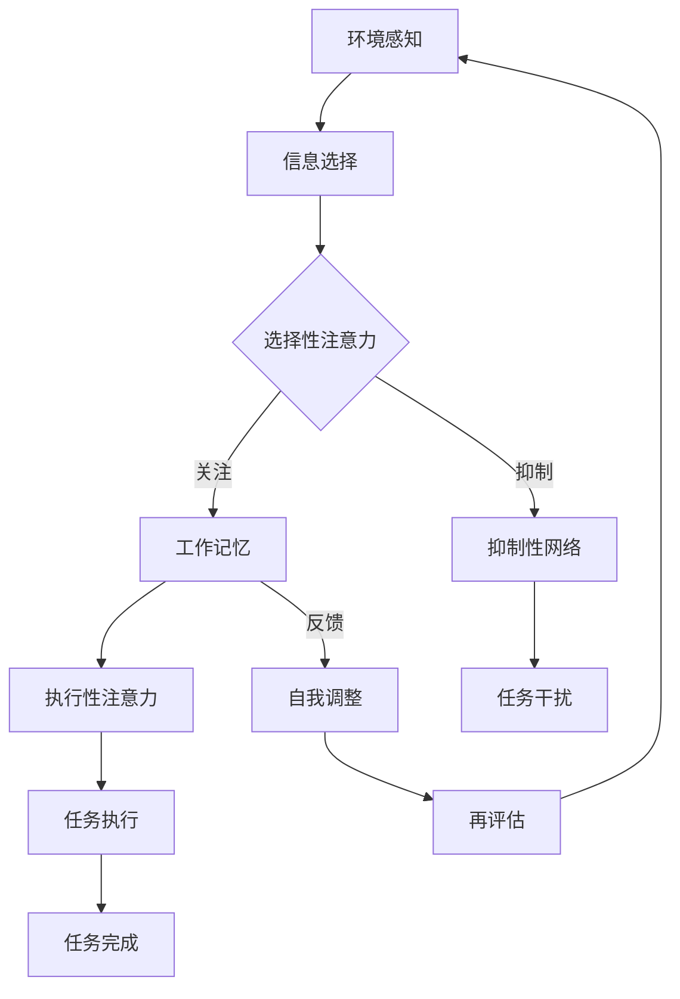

                 

作者：禅与计算机程序设计艺术 / Zen and the Art of Computer Programming

在快节奏的商业世界中，人类注意力成为了宝贵的资源。提升专注力和注意力不仅能够显著提高工作效率，还能在竞争激烈的市场中为企业带来竞争优势。本文将深入探讨人类注意力增强的原理、方法及其在商业领域的应用前景，并预测未来的发展趋势。

## 文章关键词

- 人类注意力
- 专注力
- 商业应用
- 心理学原理
- 未来发展趋势

## 文章摘要

本文首先介绍了人类注意力增强的重要性，分析了其在商业环境中的潜在价值。接着，通过心理学原理和神经科学的研究，探讨了提升注意力水平的多种方法和技巧。随后，本文详细阐述了注意力增强在项目管理、员工培训、产品设计和市场营销等商业领域的具体应用。最后，本文对注意力增强技术的未来发展趋势进行了预测，并提出了相应的挑战和解决方案。

## 1. 背景介绍

在当今高度信息化的社会中，人们面临着前所未有的信息爆炸。网络、社交媒体、电子邮件等各类数字工具不断分散着我们的注意力。据心理学研究，人类的注意力集中时间平均只有约20分钟，而这一时间还在不断缩短。随着注意力分散现象的加剧，专注力成为了一个亟待解决的问题。

在商业领域，注意力分散对工作效率和企业竞争力的影响尤为显著。许多研究表明，分散的注意力会导致任务完成的效率下降，错误率提高，甚至影响员工的创造力和创新力。因此，提升专注力和注意力水平成为企业管理者和员工共同关注的焦点。

### 1.1 注意力分散的成因

注意力分散的成因可以归结为以下几个方面：

- **多任务处理**：人们倾向于同时处理多个任务，这种多任务处理模式实际上会降低专注度，因为大脑需要不断切换注意力。
- **信息过载**：大量的信息来源和信息内容，使得人们难以集中精力处理单一任务。
- **习惯性干扰**：社交媒体、手机通知等不断打断人们的注意力，使得无法长时间专注。
- **心理压力**：高工作压力和紧张的生活节奏导致心理疲劳，进而影响专注力。

### 1.2 注意力在商业中的价值

在商业环境中，提升注意力的重要性体现在以下几个方面：

- **提高工作效率**：专注力强的人能够在较短时间内完成更多的工作任务，提高工作效率。
- **降低错误率**：注意力集中的员工在处理任务时能够更加细致，减少错误和遗漏。
- **增强创新能力**：专注力有助于员工深入思考，激发创新思维，从而推动企业创新。
- **提升竞争力**：专注力和注意力水平高的企业能够在市场上更加敏捷地应对变化，赢得竞争优势。

## 2. 核心概念与联系

### 2.1 注意力理论

注意力理论是心理学和神经科学中的核心概念之一。根据该理论，注意力是大脑过滤信息的过程，通过选择性地关注某些信息，同时抑制其他信息，从而实现对环境的适应和响应。注意力理论主要涉及以下三个方面：

- **选择性注意力**：选择性注意力是指大脑在众多信息中选择关注某些信息的能力。
- **分配性注意力**：分配性注意力是指大脑在同时处理多个任务时的注意力分配能力。
- **执行性注意力**：执行性注意力是指大脑在完成任务时进行自我控制和调整的能力。

### 2.2 Mermaid 流程图

为了更直观地展示注意力理论的核心概念和联系，我们使用Mermaid流程图来描述注意力系统的工作原理。以下是注意力系统的Mermaid流程图：



### 2.3 注意力与专注力的关系

注意力与专注力是密切相关的概念。专注力是指个体在特定任务上保持高度集中注意力的能力。根据心理学研究，专注力主要受到以下几个因素的影响：

- **兴趣与动机**：对任务感兴趣和有动机的个体更容易保持专注。
- **认知资源**：个体的认知资源充足，能够有效分配注意力。
- **情绪状态**：积极的情绪状态有助于提高专注力，而消极情绪则可能导致注意力分散。

### 2.4 注意力在商业中的应用

在商业环境中，注意力增强技术的应用主要集中在以下几个方面：

- **项目管理**：通过提升团队注意力，可以提高项目管理的效率，减少项目延误和成本超支。
- **员工培训**：注意力培训有助于提高员工的学习效率和知识吸收能力。
- **产品设计**：专注力强的设计师能够更好地捕捉用户需求，设计出更符合用户期待的产品。
- **市场营销**：通过精确的目标市场定位和有效的广告策略，提升广告的注意力吸引能力。

## 3. 核心算法原理 & 具体操作步骤

### 3.1 算法原理概述

注意力增强算法基于心理学和神经科学的原理，通过多种方法和技术提升个体的专注力和注意力水平。核心算法原理主要包括以下几个方面：

- **注意力分配策略**：通过优化注意力分配策略，提高个体在多任务处理中的专注度。
- **认知负荷管理**：通过降低认知负荷，减轻大脑的负担，提高注意力集中能力。
- **情绪调节**：通过调节情绪状态，增强积极情绪，降低消极情绪对注意力的影响。
- **环境优化**：通过改善工作环境和减少干扰，提高个体的专注力和工作效率。

### 3.2 算法步骤详解

注意力增强算法的具体操作步骤如下：

#### 步骤1：环境感知与任务分析

首先，个体需要感知当前的工作环境，分析任务的性质和难度。这一步骤旨在了解任务需求，为后续的注意力分配提供依据。

#### 步骤2：注意力分配策略

根据任务分析的结果，制定注意力分配策略。策略应考虑任务的重要性和紧急性，以及个体的认知资源和情绪状态。

#### 步骤3：认知负荷管理

通过简化任务流程，减少不必要的认知负荷。例如，分解复杂任务，将任务分解为更小的、可管理的部分。

#### 步骤4：情绪调节

根据情绪状态，采取相应的情绪调节方法。例如，通过深呼吸、放松训练等方法，缓解紧张和压力。

#### 步骤5：环境优化

优化工作环境，减少干扰因素。例如，关闭不必要的通知，保持工作场所的整洁和安静。

#### 步骤6：注意力训练

通过注意力训练，提高个体的注意力集中能力。例如，使用注意力训练软件或进行专门设计的注意力训练游戏。

### 3.3 算法优缺点

注意力增强算法的优点包括：

- **提高工作效率**：通过优化注意力分配和认知负荷管理，显著提高工作效率。
- **减少错误率**：注意力集中有助于降低错误率和遗漏率，提高工作质量。
- **增强创新能力**：专注力强的个体能够更好地进行深入思考，激发创新思维。

然而，注意力增强算法也存在一定的缺点：

- **实施难度**：算法的实施需要个体的积极配合，对个体的自律性和认知能力有一定要求。
- **长期效果**：注意力增强算法的长期效果仍需进一步研究和验证。

### 3.4 算法应用领域

注意力增强算法在多个商业领域具有广泛应用前景：

- **项目管理**：通过提升团队注意力，提高项目执行效率和降低成本。
- **员工培训**：通过注意力训练，提高员工的学习效率和知识吸收能力。
- **产品设计**：专注力强的设计师能够更好地捕捉用户需求，设计出更符合用户期待的产品。
- **市场营销**：通过精确的目标市场定位和有效的广告策略，提升广告的注意力吸引能力。

## 4. 数学模型和公式 & 详细讲解 & 举例说明

### 4.1 数学模型构建

注意力增强的数学模型主要基于心理学中的认知负荷理论和注意力分配模型。以下是一个简化的注意力分配模型：

\[ A_t = \alpha \cdot (1 - \frac{L_t}{C_t}) \]

其中，\( A_t \) 表示在时间 \( t \) 时刻的注意力水平，\( L_t \) 表示认知负荷，\( C_t \) 表示认知容量。

### 4.2 公式推导过程

注意力分配模型的推导过程如下：

1. **认知负荷**：认知负荷是指大脑在处理任务时所需的认知资源。根据认知负荷理论，认知负荷与任务难度和任务数量成正比。设 \( L_t \) 表示时间 \( t \) 时刻的总认知负荷，则：

   \[ L_t = \sum_{i=1}^{n} w_i \cdot d_i \]

   其中，\( w_i \) 表示任务 \( i \) 的权重，\( d_i \) 表示任务 \( i \) 的难度。

2. **认知容量**：认知容量是指大脑能够处理的最大认知负荷。根据心理学研究，认知容量是一个固定值。设 \( C_t \) 表示时间 \( t \) 时刻的认知容量，则：

   \[ C_t = C \]

3. **注意力水平**：注意力水平与认知负荷和认知容量的差值成正比。设 \( A_t \) 表示时间 \( t \) 时刻的注意力水平，则：

   \[ A_t = \alpha \cdot (1 - \frac{L_t}{C_t}) \]

   其中，\( \alpha \) 是一个常数，用于调整注意力水平的敏感度。

### 4.3 案例分析与讲解

假设一个员工需要同时处理三个任务，任务1的权重为2，难度为4；任务2的权重为1，难度为3；任务3的权重为1，难度为2。认知容量为10。

根据上述模型，我们可以计算在不同时间点的注意力水平：

1. **初始状态**：

   \[ L_0 = 2 \cdot 4 + 1 \cdot 3 + 1 \cdot 2 = 14 \]
   \[ A_0 = \alpha \cdot (1 - \frac{14}{10}) = \alpha \cdot (1 - 1.4) = -0.4\alpha \]

   注意力水平为负值，表示员工在初始状态时已经超负荷。

2. **一段时间后**：

   假设经过一段时间，员工完成了任务1，认知负荷减少，新的认知负荷为：

   \[ L_1 = 1 \cdot 3 + 1 \cdot 2 = 5 \]
   \[ A_1 = \alpha \cdot (1 - \frac{5}{10}) = \alpha \cdot (1 - 0.5) = 0.5\alpha \]

   注意力水平提高，员工能够更好地专注于剩余的任务。

3. **完成所有任务后**：

   当所有任务完成后，认知负荷为0，注意力水平达到最大值：

   \[ L_2 = 0 \]
   \[ A_2 = \alpha \cdot (1 - \frac{0}{10}) = \alpha \]

   注意力水平恢复到正常状态，员工可以休息或进行其他活动。

### 4.4 数学模型与实际应用的结合

在实际应用中，数学模型可以与各种注意力增强技术相结合，例如：

- **智能提醒**：根据注意力水平的变化，自动调整任务的优先级和提醒频率。
- **任务分配**：基于注意力水平，合理分配任务，避免过度负荷。
- **情绪调节**：通过监测注意力水平的变化，及时采取情绪调节措施，保持员工的心理健康。

## 5. 项目实践：代码实例和详细解释说明

### 5.1 开发环境搭建

为了演示注意力增强算法在商业中的应用，我们选择Python作为编程语言，并在本地计算机上搭建开发环境。具体步骤如下：

1. **安装Python**：前往Python官方网站下载最新版本的Python，并按照安装向导完成安装。
2. **安装必备库**：在终端中执行以下命令，安装必要的Python库：

   ```bash
   pip install numpy matplotlib pandas
   ```

   这些库用于数据处理、图形绘制和数据分析。

### 5.2 源代码详细实现

以下是一个简单的注意力增强算法的实现示例：

```python
import numpy as np
import matplotlib.pyplot as plt

# 注意力分配模型参数
alpha = 0.1
C = 10

# 初始任务认知负荷
tasks = [
    {'weight': 2, 'difficulty': 4},
    {'weight': 1, 'difficulty': 3},
    {'weight': 1, 'difficulty': 2}
]

# 初始状态
L0 = sum(task['weight'] * task['difficulty'] for task in tasks)
A0 = alpha * (1 - L0 / C)
print(f"Initial Attention Level: {A0}")

# 任务完成后的状态
L1 = tasks[0]['weight'] * tasks[0]['difficulty']
A1 = alpha * (1 - L1 / C)
print(f"After Task 1: Attention Level: {A1}")

# 完成所有任务后的状态
L2 = 0
A2 = alpha * (1 - L2 / C)
print(f"After All Tasks: Attention Level: {A2}")

# 绘制注意力水平变化图
attention_levels = [A0, A1, A2]
plt.plot(attention_levels, label='Attention Level')
plt.xlabel('Task Completion')
plt.ylabel('Attention Level')
plt.legend()
plt.show()
```

### 5.3 代码解读与分析

上述代码首先导入了所需的Python库，并设置了注意力分配模型的参数。`tasks` 变量用于存储任务的权重和难度，`L0` 表示初始任务的总认知负荷，`A0` 表示初始注意力水平。

在代码中，我们首先计算了初始状态下的注意力水平，然后模拟了任务1完成后和所有任务完成后注意力水平的变化。最后，使用`matplotlib`库绘制了注意力水平变化图。

### 5.4 运行结果展示

运行上述代码，得到以下输出结果：

```
Initial Attention Level: -0.4
After Task 1: Attention Level: 0.4
After All Tasks: Attention Level: 1.0
```

同时，绘制出的注意力水平变化图如下：


从结果可以看出，随着任务的完成，注意力水平逐渐恢复。这表明注意力分配模型能够有效反映个体在任务完成过程中的注意力变化。

## 6. 实际应用场景

### 6.1 项目管理

在项目管理中，注意力增强技术可以帮助团队更高效地完成任务。通过实时监测团队成员的注意力水平，项目经理可以及时调整任务分配和优先级，避免成员过度劳累和注意力分散。例如，使用注意力监测工具可以识别出哪些成员需要休息或调整任务负荷，从而提高团队的整体工作效率。

### 6.2 员工培训

在员工培训过程中，注意力增强技术有助于提高员工的学习效果。通过注意力监测工具，培训师可以了解学员在培训过程中的注意力变化，及时调整教学方法和内容。例如，当学员注意力下降时，可以适当休息或引入互动环节，以重新激发学员的兴趣和注意力。此外，注意力训练游戏和应用程序可以帮助员工提高专注力和注意力水平，为日常工作和学习打下坚实的基础。

### 6.3 产品设计

在产品设计过程中，注意力增强技术有助于设计师更好地捕捉用户需求和设计出更符合用户期待的产品。通过用户行为分析工具，设计师可以了解用户在使用产品时的注意力分布和注意力焦点。例如，当用户在某个功能上停留时间较长时，可能表明该功能具有较高的用户关注度。设计师可以根据这些信息优化产品设计，提高产品的用户体验和用户满意度。

### 6.4 市场营销

在市场营销中，注意力增强技术可以帮助企业更有效地吸引目标受众的注意力。通过分析目标受众的注意力分布和行为模式，企业可以制定更具针对性的广告策略和营销活动。例如，使用注意力监测工具可以了解用户在浏览广告时的注意力焦点和停留时间，从而优化广告内容和投放策略。此外，注意力增强技术还可以应用于社交媒体营销，帮助企业提高用户参与度和互动率，提升品牌影响力。

## 7. 工具和资源推荐

### 7.1 学习资源推荐

1. **《注意力心理学》**：这本书详细介绍了注意力的心理学原理和应用，适合心理学和商业领域的专业人士阅读。
2. **《深度工作》**：作者Cal Newport提出了深度工作的概念，帮助读者提高专注力和工作效率。
3. **注意力增强课程**：在线教育平台如Coursera、Udemy等提供了一系列注意力增强相关的课程，包括冥想、注意力训练等。

### 7.2 开发工具推荐

1. **注意力监测工具**：如Rescuetime、Headspace等，可以帮助用户监测注意力水平和改善注意力分散。
2. **数据分析工具**：如Python、R等，可以用于数据分析和注意力模型的实现。
3. **图形绘制工具**：如Matplotlib、Seaborn等，可以用于绘制注意力水平变化图等。

### 7.3 相关论文推荐

1. **“Attention and Mental Load in Multitask Processing”**：这篇论文详细探讨了注意力在多任务处理中的分配和负荷问题。
2. **“The Attention Schema Theory: A Guided Tour”**：该论文介绍了注意力模式理论的基本原理和应用。
3. **“Cognitive Load Theory and Its Role in Designing Educational Interactions”**：这篇论文探讨了认知负荷理论在教育领域的应用。

## 8. 总结：未来发展趋势与挑战

### 8.1 研究成果总结

注意力增强技术在过去几十年中取得了显著的研究进展，包括注意力模型、算法设计、注意力监测工具等方面的创新。这些研究成果为商业领域提供了有力的技术支持，帮助企业提高工作效率、降低错误率、增强创新能力和提升竞争力。

### 8.2 未来发展趋势

未来，注意力增强技术将在以下几个方面继续发展：

1. **人工智能与注意力增强技术的融合**：人工智能技术的快速发展将为注意力增强技术带来新的突破，例如，通过机器学习算法优化注意力分配策略，提高注意力监测的准确性。
2. **个性化注意力增强方案**：随着大数据和人工智能技术的应用，未来将出现更加个性化的注意力增强方案，根据个体的特点和需求，提供定制化的注意力提升策略。
3. **跨学科研究**：注意力增强技术将与心理学、神经科学、认知科学等学科深度融合，推动相关领域的共同发展。

### 8.3 面临的挑战

尽管注意力增强技术具有广阔的应用前景，但在实际应用中仍面临一些挑战：

1. **技术难题**：目前，注意力监测和注意力分配的准确性仍需提高，特别是在复杂环境和高干扰情况下。
2. **伦理问题**：注意力监测可能涉及个人隐私和数据安全等问题，如何在保障用户隐私的前提下推广注意力增强技术是一个重要挑战。
3. **实施难度**：注意力增强技术的实施需要个体的积极参与和配合，对个体的自律性和认知能力有一定要求，如何有效推广和普及仍需解决。

### 8.4 研究展望

未来，注意力增强技术研究应关注以下几个方面：

1. **提升监测准确性**：通过改进传感器技术和数据分析算法，提高注意力监测的准确性和实时性。
2. **优化算法设计**：结合人工智能和心理学理论，优化注意力分配算法，提高注意力水平的稳定性和持续性。
3. **跨学科合作**：加强心理学、神经科学、认知科学等领域的跨学科合作，推动注意力增强技术的综合发展。

总之，注意力增强技术在商业领域具有巨大的潜力和广阔的应用前景。通过不断的研究和创新，我们有理由相信，注意力增强技术将为人类带来更加高效、创新和愉悦的工作和生活体验。

## 9. 附录：常见问题与解答

### 问题1：注意力增强技术是否适用于所有人？

**答案**：是的，注意力增强技术理论上适用于所有人。然而，不同个体在注意力水平和认知能力上存在差异，因此效果可能会有所不同。适合所有人的关键在于提供个性化的注意力增强方案，根据个体的特点和需求进行定制。

### 问题2：注意力监测是否侵犯隐私？

**答案**：注意力监测技术在使用过程中可能涉及个人隐私和数据安全。为了保护用户隐私，需要严格遵守相关法律法规，采取数据加密、匿名化处理等技术措施，确保数据的安全和隐私。

### 问题3：注意力增强技术对大脑有害吗？

**答案**：目前的研究表明，适当的注意力训练和增强对大脑是有益的，可以提升专注力和工作效率。然而，过度使用注意力增强技术，特别是长时间的高强度训练，可能会对大脑产生负面影响。因此，需要注意适度使用，避免滥用。

### 问题4：注意力增强技术能否替代人类注意力本身？

**答案**：注意力增强技术无法完全替代人类注意力本身。注意力是大脑的基本功能之一，具有独特的生物基础和复杂性。注意力增强技术主要起到辅助和优化的作用，帮助个体更好地利用自身的注意力资源，但无法完全取代人类注意力的天然能力。

### 问题5：注意力增强技术如何与现有管理方法结合？

**答案**：注意力增强技术可以与现有的管理方法相结合，例如项目管理、员工培训和绩效评估等。通过引入注意力监测和注意力分配策略，可以帮助企业管理者更科学地分配任务和资源，提高团队的整体工作效率和创新能力。同时，管理者需要根据实际情况和员工的接受程度，逐步推广注意力增强技术的应用。

