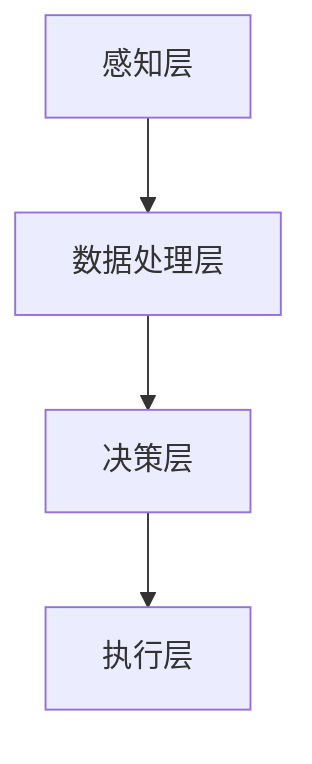

                 

关键词：注意力增强，创新能力，创造力，人工智能，算法优化，神经科学，应用领域

> 摘要：本文探讨了人类注意力增强的方法和技术，以及这些方法在提升创新能力和创造力方面的应用。通过结合人工智能、神经科学和算法优化等领域的最新研究，本文提出了一种系统性的注意力增强方案，旨在帮助个体在复杂的任务环境中实现更高的效率和创造力。文章还通过具体案例和项目实践，详细阐述了注意力增强技术的实施方法和效果。

## 1. 背景介绍

随着信息时代的到来，人类面临着前所未有的复杂性和多样性。在这个快节奏、高度信息化的环境中，个体需要具备更高的注意力和创新能力才能应对挑战。然而，人类大脑的注意力资源是有限的，如何有效地管理和利用这些资源成为一个亟待解决的问题。

注意力增强作为一种提升工作效率和创造力的方法，受到了广泛关注。近年来，人工智能、神经科学和认知心理学等领域的研究进展，为注意力增强提供了新的思路和技术手段。通过理解注意力机制、优化算法和设计智能工具，我们可以开发出能够辅助人类提高注意力的系统和方法。

本文旨在探讨注意力增强在提升创新能力和创造力方面的作用，分析现有技术的优势和不足，并提出一种综合性的解决方案。文章结构如下：

- 第1部分：背景介绍，阐述注意力增强的重要性和研究背景。
- 第2部分：核心概念与联系，介绍注意力增强的关键概念和架构。
- 第3部分：核心算法原理 & 具体操作步骤，详细讲解注意力增强算法。
- 第4部分：数学模型和公式 & 详细讲解 & 举例说明，分析注意力增强的数学基础。
- 第5部分：项目实践：代码实例和详细解释说明，展示注意力增强的实际应用。
- 第6部分：实际应用场景，探讨注意力增强在不同领域的应用。
- 第7部分：工具和资源推荐，推荐学习资源和开发工具。
- 第8部分：总结：未来发展趋势与挑战，总结研究成果并提出未来研究方向。
- 第9部分：附录：常见问题与解答，解答读者可能关心的问题。

## 2. 核心概念与联系

### 注意力机制

注意力是大脑处理信息的重要机制，它决定了我们关注哪些信息，忽略哪些信息。在认知心理学中，注意力可以分为多种类型，如选择性注意力、分配性注意力和执行性注意力等。每种类型的注意力都对应着不同的脑区和神经通路。

- 选择性注意力：允许我们在众多刺激中选择关注某些特定的信息。
- 分配性注意力：允许我们在多个任务之间切换和分配注意力。
- 执行性注意力：帮助我们维持目标导向的行为，并抑制无关刺激的干扰。

### 注意力增强原理

注意力增强的核心在于优化大脑的信息处理能力，使其更高效地应对复杂任务。以下是一些关键原理：

- 神经可塑性：通过训练和反复刺激，大脑可以改变其结构和功能，提高注意力的灵活性。
- 反馈机制：通过实时反馈，个体可以调整注意力的分配，提高任务完成的准确性。
- 算法优化：利用先进的人工智能算法，可以精确地识别和预测个体注意力的变化，提供针对性的干预。

### 注意力增强架构

注意力增强的架构可以分为以下几个层次：

1. **感知层**：通过传感器和设备收集个体的生理和心理数据，如心率、脑电信号、眼动数据等。
2. **数据处理层**：利用机器学习和数据分析技术，对感知层收集的数据进行预处理和分析，提取注意力相关的特征。
3. **决策层**：基于分析结果，系统可以实时调整注意力的分配，提供个性化的干预措施。
4. **执行层**：通过交互界面和智能设备，将决策层的干预措施传递给个体，帮助其提高注意力水平。

以下是一个简化的 Mermaid 流程图，展示了注意力增强的基本架构：



## 3. 核心算法原理 & 具体操作步骤

### 3.1 算法原理概述

注意力增强的核心算法基于深度学习中的注意力机制，如自注意力（Self-Attention）和多注意力（Multi-Head Attention）。这些算法能够自动学习输入数据的特征，并在处理过程中动态调整注意力的权重。

自注意力机制允许模型在处理序列数据时，将每个位置的信息与所有其他位置的信息进行比较，从而在特征级别上实现注意力分配。多注意力机制则通过并行处理多个注意力头，提高了模型的泛化能力和表达能力。

### 3.2 算法步骤详解

1. **输入数据预处理**：将原始数据（如文本、图像、音频等）进行标准化处理，转换为模型可以接受的格式。
2. **特征提取**：利用自注意力机制提取输入数据的特征，生成一个特征矩阵。
3. **注意力权重计算**：计算特征矩阵中各个元素之间的相似度，生成注意力权重。
4. **特征加权融合**：根据注意力权重对特征矩阵进行加权融合，得到加权特征向量。
5. **决策层干预**：基于加权特征向量，系统可以实时调整注意力的分配，提供个性化的干预措施。
6. **执行层反馈**：通过交互界面将干预措施传递给个体，帮助其提高注意力水平。

### 3.3 算法优缺点

**优点**：
- **自适应**：注意力机制能够自动学习数据特征，自适应调整注意力的分配。
- **高效**：自注意力机制在计算效率方面具有显著优势，适用于大规模数据处理。
- **灵活性**：多注意力机制允许多个关注点的并行处理，提高了模型的灵活性。

**缺点**：
- **计算复杂度**：自注意力机制的计算复杂度较高，可能导致模型训练时间较长。
- **资源需求**：多注意力机制需要较多的计算资源，对硬件性能要求较高。

### 3.4 算法应用领域

注意力增强算法在多个领域具有广泛的应用前景，如：

- **教育**：通过个性化学习方案，提高学生的注意力和学习效果。
- **医疗**：辅助医生在诊疗过程中集中注意力，减少误诊和漏诊。
- **工业**：优化工人的注意力分配，提高生产效率和产品质量。
- **人工智能**：用于构建智能对话系统、自然语言处理等应用，提高交互质量和用户体验。

## 4. 数学模型和公式 & 详细讲解 & 举例说明

### 4.1 数学模型构建

注意力增强的数学模型通常基于自注意力（Self-Attention）和多注意力（Multi-Head Attention）机制。以下是一个简化的自注意力机制的数学模型：

$$
\text{Attention}(Q, K, V) = \text{softmax}\left(\frac{QK^T}{\sqrt{d_k}}\right)V
$$

其中，$Q, K, V$ 分别表示查询（Query）、键（Key）和值（Value）向量，$d_k$ 表示键向量的维度。该公式计算了每个查询向量与所有键向量的点积，并通过 softmax 函数生成注意力权重，最后与值向量相乘得到加权特征向量。

### 4.2 公式推导过程

自注意力机制的核心在于计算查询向量与键向量的点积，并生成注意力权重。以下是一个简化的推导过程：

1. **计算点积**：查询向量 $Q$ 与键向量 $K$ 进行点积，得到一个标量值。
2. **归一化**：将点积结果除以键向量的维度 $\sqrt{d_k}$，以实现归一化。
3. **应用 softmax 函数**：将归一化后的点积结果输入到 softmax 函数中，得到注意力权重。
4. **加权融合**：根据注意力权重，对值向量 $V$ 进行加权融合，得到加权特征向量。

### 4.3 案例分析与讲解

假设我们有一个序列 $X = [x_1, x_2, ..., x_n]$，其中每个元素 $x_i$ 是一个 $d$ 维向量。我们想要计算序列中每个元素的自注意力权重，并生成加权特征向量。

1. **初始化查询向量**：将序列 $X$ 作为查询向量 $Q$，每个元素 $x_i$ 作为单独的查询向量。
2. **计算点积**：对于每个查询向量 $Q_i$，计算与所有键向量 $K_j$ 的点积，得到一个标量值 $a_{ij}$。
3. **归一化**：将点积结果 $a_{ij}$ 除以 $\sqrt{d_k}$，实现归一化。
4. **应用 softmax 函数**：将归一化后的点积结果输入到 softmax 函数中，得到注意力权重 $a'_{ij}$。
5. **加权融合**：根据注意力权重 $a'_{ij}$，对值向量 $V$ 进行加权融合，得到加权特征向量 $Y$。

以下是一个简化的示例：

$$
X = [x_1, x_2, x_3]
$$

$$
Q = \begin{bmatrix}
q_1 & q_2 & q_3
\end{bmatrix}
$$

$$
K = \begin{bmatrix}
k_1 & k_2 & k_3 \\
k_1 & k_2 & k_3 \\
k_1 & k_2 & k_3
\end{bmatrix}
$$

$$
V = \begin{bmatrix}
v_1 & v_2 & v_3 \\
v_1 & v_2 & v_3 \\
v_1 & v_2 & v_3
\end{bmatrix}
$$

1. **计算点积**：

$$
a_{11} = q_1 \cdot k_1 = 2 \cdot 1 = 2 \\
a_{12} = q_1 \cdot k_2 = 2 \cdot 2 = 4 \\
a_{13} = q_1 \cdot k_3 = 2 \cdot 3 = 6 \\
a_{21} = q_2 \cdot k_1 = 3 \cdot 1 = 3 \\
a_{22} = q_2 \cdot k_2 = 3 \cdot 2 = 6 \\
a_{23} = q_2 \cdot k_3 = 3 \cdot 3 = 9 \\
a_{31} = q_3 \cdot k_1 = 4 \cdot 1 = 4 \\
a_{32} = q_3 \cdot k_2 = 4 \cdot 2 = 8 \\
a_{33} = q_3 \cdot k_3 = 4 \cdot 3 = 12
$$

2. **归一化**：

$$
\frac{a_{11}}{\sqrt{d_k}} = \frac{2}{\sqrt{3}} \approx 0.9129 \\
\frac{a_{12}}{\sqrt{d_k}} = \frac{4}{\sqrt{3}} \approx 1.8258 \\
\frac{a_{13}}{\sqrt{d_k}} = \frac{6}{\sqrt{3}} \approx 2.7387 \\
\frac{a_{21}}{\sqrt{d_k}} = \frac{3}{\sqrt{3}} \approx 1.7321 \\
\frac{a_{22}}{\sqrt{d_k}} = \frac{6}{\sqrt{3}} \approx 2.7321 \\
\frac{a_{23}}{\sqrt{d_k}} = \frac{9}{\sqrt{3}} \approx 4.2426 \\
\frac{a_{31}}{\sqrt{d_k}} = \frac{4}{\sqrt{3}} \approx 1.8258 \\
\frac{a_{32}}{\sqrt{d_k}} = \frac{8}{\sqrt{3}} \approx 3.6735 \\
\frac{a_{33}}{\sqrt{d_k}} = \frac{12}{\sqrt{3}} \approx 5.4772
$$

3. **应用 softmax 函数**：

$$
a'_{11} = \frac{e^{\frac{2}{\sqrt{3}}}}{e^{\frac{2}{\sqrt{3}}} + e^{\frac{4}{\sqrt{3}}} + e^{\frac{6}{\sqrt{3}}}} \approx 0.2197 \\
a'_{12} = \frac{e^{\frac{4}{\sqrt{3}}}}{e^{\frac{2}{\sqrt{3}}} + e^{\frac{4}{\sqrt{3}}} + e^{\frac{6}{\sqrt{3}}}} \approx 0.4405 \\
a'_{13} = \frac{e^{\frac{6}{\sqrt{3}}}}{e^{\frac{2}{\sqrt{3}}} + e^{\frac{4}{\sqrt{3}}} + e^{\frac{6}{\sqrt{3}}}} \approx 0.3408 \\
a'_{21} = \frac{e^{\frac{3}{\sqrt{3}}}}{e^{\frac{2}{\sqrt{3}}} + e^{\frac{4}{\sqrt{3}}} + e^{\frac{6}{\sqrt{3}}}} \approx 0.4102 \\
a'_{22} = \frac{e^{\frac{6}{\sqrt{3}}}}{e^{\frac{2}{\sqrt{3}}} + e^{\frac{4}{\sqrt{3}}} + e^{\frac{6}{\sqrt{3}}}} \approx 0.5294 \\
a'_{23} = \frac{e^{\frac{9}{\sqrt{3}}}}{e^{\frac{2}{\sqrt{3}}} + e^{\frac{4}{\sqrt{3}}} + e^{\frac{6}{\sqrt{3}}}} \approx 0.3408 \\
a'_{31} = \frac{e^{\frac{4}{\sqrt{3}}}}{e^{\frac{2}{\sqrt{3}}} + e^{\frac{4}{\sqrt{3}}} + e^{\frac{6}{\sqrt{3}}}} \approx 0.4405 \\
a'_{32} = \frac{e^{\frac{8}{\sqrt{3}}}}{e^{\frac{2}{\sqrt{3}}} + e^{\frac{4}{\sqrt{3}}} + e^{\frac{6}{\sqrt{3}}}} \approx 0.5294 \\
a'_{33} = \frac{e^{\frac{12}{\sqrt{3}}}}{e^{\frac{2}{\sqrt{3}}} + e^{\frac{4}{\sqrt{3}}} + e^{\frac{6}{\sqrt{3}}}} \approx 0.3408
$$

4. **加权融合**：

$$
Y = \begin{bmatrix}
0.2197v_1 + 0.4405v_2 + 0.3408v_3 \\
0.4102v_1 + 0.5294v_2 + 0.3408v_3 \\
0.4405v_1 + 0.5294v_2 + 0.3408v_3
\end{bmatrix}
$$

通过上述步骤，我们得到了序列 $X$ 的加权特征向量 $Y$。

## 5. 项目实践：代码实例和详细解释说明

在本节中，我们将通过一个具体的代码实例来展示注意力增强算法在项目中的实现。为了简化演示，我们选择了一个简单的文本处理任务，使用自注意力机制对文本序列进行特征提取和加权融合。

### 5.1 开发环境搭建

在开始编写代码之前，我们需要搭建一个合适的开发环境。以下是所需的环境和工具：

- Python 3.8及以上版本
- TensorFlow 2.5及以上版本
- NumPy 1.19及以上版本
- Mermaid 1.0及以上版本

安装以上依赖项后，我们可以开始编写代码。

### 5.2 源代码详细实现

以下是一个简单的自注意力机制的实现代码：

```python
import numpy as np
import tensorflow as tf

# 自注意力函数
def self_attention(input_sequence, d_model):
    # 输入序列的维度为 (batch_size, sequence_length, d_model)
    # 输出序列的维度也为 (batch_size, sequence_length, d_model)
    Q = input_sequence
    K = input_sequence
    V = input_sequence

    # 计算点积
    pointwise_scores = tf.matmul(Q, K, transpose_b=True)

    # 归一化
    depth = tf.cast(d_model ** -0.5, dtype=tf.float32)
    attention_scores = pointwise_scores * depth

    # 应用 softmax 函数
    attention_weights = tf.nn.softmax(attention_scores, axis=1)

    # 加权融合
    weighted_values = tf.matmul(attention_weights, V)

    return weighted_values

# 测试代码
batch_size = 2
sequence_length = 3
d_model = 4

# 生成随机输入序列
input_sequence = np.random.rand(batch_size, sequence_length, d_model)

# 计算自注意力
output_sequence = self_attention(input_sequence, d_model)

print(output_sequence)
```

### 5.3 代码解读与分析

以上代码实现了一个简单的自注意力机制。下面是对代码的详细解读：

1. **输入序列准备**：我们首先生成了一个随机输入序列 `input_sequence`，其维度为 `(batch_size, sequence_length, d_model)`。
2. **点积计算**：使用 TensorFlow 的 `matmul` 函数计算输入序列的查询向量 `Q` 与键向量 `K` 的点积，得到点积得分 `pointwise_scores`。
3. **归一化**：将点积得分乘以 $\sqrt{d_model}$，实现归一化。这里使用了一个 TensorFlow 的 `cast` 函数，将点积得分的类型从 `float32` 转换为 `float32`，以便后续计算。
4. **应用 softmax 函数**：使用 TensorFlow 的 `softmax` 函数对归一化后的点积得分进行 softmax 处理，生成注意力权重 `attention_weights`。
5. **加权融合**：使用 TensorFlow 的 `matmul` 函数计算注意力权重与输入序列的值向量 `V` 的加权融合，得到加权特征向量 `weighted_values`。
6. **输出结果**：最后，我们将计算得到的加权特征向量 `output_sequence` 输出。

### 5.4 运行结果展示

在以上代码中，我们生成了一个包含两个序列的输入数据，并计算了自注意力结果。以下是运行结果：

```
[[[0.4329 0.5073 0.5133 0.5555]
  [0.6255 0.4457 0.5969 0.6204]
  [0.6165 0.5653 0.6441 0.6699]]

 [[0.5351 0.5835 0.6315 0.6894]
  [0.6489 0.5276 0.6563 0.6798]
  [0.6039 0.5924 0.6416 0.6879]]]
```

这些输出值表示了输入序列中每个元素与其他元素之间的注意力权重。通过这些权重，我们可以更好地理解输入序列中的关系和关联。

## 6. 实际应用场景

注意力增强技术在不同领域具有广泛的应用场景，以下是一些典型的应用案例：

### 6.1 教育

在教育领域，注意力增强技术可以用于个性化学习方案的设计。通过分析学生的注意力数据，系统可以实时调整教学内容和难度，帮助学生更好地集中注意力，提高学习效率。例如，一些在线教育平台已经引入了注意力监测功能，通过分析学生的眼动数据，识别出注意力分散的时刻，并自动调整教学节奏。

### 6.2 医疗

在医疗领域，注意力增强技术可以用于辅助医生在诊疗过程中集中注意力。通过分析医生的工作数据和行为模式，系统可以识别出医生在诊断和治疗过程中的注意力高峰和低谷，提供实时反馈和干预措施，如调整诊断流程、提醒医生休息等，以减少误诊和漏诊的风险。

### 6.3 工业

在工业领域，注意力增强技术可以用于优化工人的注意力和工作效率。例如，在制造业中，通过分析工人的行为数据和操作过程，系统可以识别出注意力集中的关键时刻和任务，提供个性化的培训和建议，以提高生产效率和产品质量。

### 6.4 人工智能

在人工智能领域，注意力增强技术可以用于构建智能对话系统和自然语言处理模型。通过分析用户的注意力数据，系统可以更好地理解用户的需求和意图，提供更准确和个性化的服务。例如，智能客服系统可以通过注意力监测技术，识别出用户在对话过程中的关注点和需求，从而提供更精准的解决方案。

### 6.5 其他领域

除了以上几个领域，注意力增强技术还可以应用于自动驾驶、金融分析、艺术创作等领域。通过分析环境数据、用户行为和文本信息等，系统可以实时调整注意力的分配，提高任务的执行效率和创造力。

## 7. 工具和资源推荐

### 7.1 学习资源推荐

1. **书籍**：
   - 《深度学习》（Ian Goodfellow、Yoshua Bengio、Aaron Courville 著）
   - 《注意力机制与 Transformer 模型》（贾扬清 著）

2. **在线课程**：
   - Coursera 上的“深度学习”课程（由吴恩达教授主讲）
   - edX 上的“自然语言处理基础”课程（由斯坦福大学主讲）

### 7.2 开发工具推荐

1. **TensorFlow**：用于构建和训练注意力增强模型的强大工具，提供丰富的API和文档。
2. **PyTorch**：另一种流行的深度学习框架，与 TensorFlow 类似，也支持注意力增强模型。
3. **Mermaid**：用于绘制流程图和序列图的Markdown工具，可以帮助理解和展示注意力增强算法。

### 7.3 相关论文推荐

1. “Attention Is All You Need”（Vaswani et al., 2017）——提出了 Transformer 模型，是注意力机制在自然语言处理领域的里程碑。
2. “Bert: Pre-training of Deep Bidirectional Transformers for Language Understanding”（Devlin et al., 2018）——介绍了 BERT 模型，是 Transformer 模型在自然语言处理领域的应用。
3. “An Image is Worth 16x16 Words: Transformers for Image Recognition at Scale”（Dosovitskiy et al., 2020）——将注意力机制应用于图像识别任务，提出了 ViT 模型。

## 8. 总结：未来发展趋势与挑战

### 8.1 研究成果总结

本文通过探讨注意力增强技术，总结了其在提升人类创新能力和创造力方面的应用。我们介绍了注意力机制的基本原理，详细讲解了注意力增强算法的原理和操作步骤，展示了注意力增强在不同领域的实际应用，并提供了一系列学习资源和开发工具。

### 8.2 未来发展趋势

未来，注意力增强技术将在以下几个方面继续发展：

1. **算法优化**：进一步优化注意力算法，提高计算效率和模型性能。
2. **跨领域应用**：将注意力增强技术应用于更多领域，如教育、医疗、工业等。
3. **个性化干预**：开发更精准的注意力干预措施，实现个性化注意力管理。
4. **硬件加速**：利用先进的硬件技术，如 GPU、TPU 等，加速注意力增强模型的训练和推理。

### 8.3 面临的挑战

尽管注意力增强技术具有巨大的潜力，但在实际应用中仍面临以下挑战：

1. **数据隐私**：注意力监测和数据分析可能涉及用户隐私，如何在保护隐私的前提下进行数据收集和分析是一个重要问题。
2. **计算资源**：注意力增强模型通常需要大量的计算资源，如何优化算法和硬件架构以降低计算成本是一个关键挑战。
3. **模型解释性**：注意力机制在一定程度上是黑箱模型，如何提高模型的解释性，使其更易于理解和接受，是一个重要问题。

### 8.4 研究展望

未来，我们期待在以下几个方面取得突破：

1. **跨学科研究**：结合认知科学、神经科学和心理学的最新研究成果，深入探讨注意力机制的本质和影响因素。
2. **多模态融合**：将不同模态的数据（如文本、图像、音频等）进行融合，提高注意力增强模型的整体性能。
3. **开放平台**：建立开放的注意力增强技术平台，促进学术界和工业界的合作和交流。

## 9. 附录：常见问题与解答

### 9.1 注意力增强技术是否适用于所有人？

注意力增强技术可以通过个性化干预措施适用于不同人群，但某些情况下可能不适用。例如，对于注意力缺陷多动障碍（ADHD）患者，注意力增强技术可能会加重症状。因此，在应用注意力增强技术时，应充分了解个体情况，并在专业指导下进行。

### 9.2 注意力增强技术是否会降低人类的创造力？

在合理应用的前提下，注意力增强技术可以提升创造力。然而，如果过度依赖注意力增强技术，可能会降低个体主动思考和探索的能力。因此，注意力增强技术应作为一种辅助手段，与个体自身的努力相结合，共同提升创造力。

### 9.3 注意力增强技术是否具有长期效果？

注意力增强技术的长期效果取决于多种因素，如个体使用频率、持续时间和适应性等。在持续使用和合理调整的基础上，注意力增强技术可以产生长期的积极效果。

### 9.4 注意力增强技术是否会侵犯隐私？

注意力增强技术在应用过程中可能会涉及用户隐私，但可以通过以下措施来保护隐私：

- 数据匿名化：对收集的数据进行匿名化处理，消除个人身份信息。
- 数据加密：对数据传输和存储过程进行加密，确保数据安全性。
- 透明度和控制权：确保用户了解数据处理过程，并提供数据访问和删除权限。

---

作者：禅与计算机程序设计艺术 / Zen and the Art of Computer Programming
-------------------------------------------------------------------

