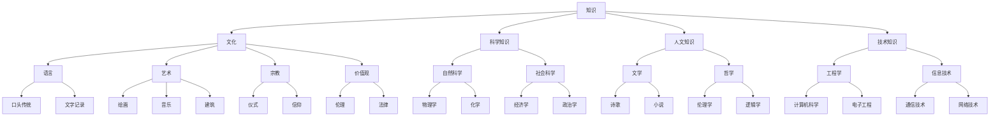

                 

### 摘要 Summary

本文旨在探讨人类知识与文化在信息技术领域中的重要性。通过对知识与文化的基本概念、历史发展、相互关系及其在现代社会中的作用的深入分析，本文揭示了知识与文化如何共同构成了理解文明的基石。文章首先概述了知识与文化的基本概念，随后探讨了它们的历史发展，并分析了知识与文化之间的内在联系。接着，文章详细阐述了知识与文化在现代社会中的角色，包括教育、科技创新、社会进步等方面。此外，本文还讨论了知识与文化在信息技术领域的应用，以及未来知识与文化发展的趋势和挑战。通过这篇文章，读者将更好地理解知识与文化对人类文明的重要性，以及在信息技术领域的深远影响。

### 背景介绍 Background

人类的知识与文化是社会发展的重要基石，它们相互依存、相互作用，共同塑造了人类的文明进程。知识指的是人类通过观察、实验、推理和思考等方式所获得的信息、理论、技能和经验的总和。文化则是指人类在社会实践中创造出来的全部物质和精神财富，包括语言、艺术、宗教、习俗、价值观等。

知识与文化的历史发展可以追溯到古代文明的起源。在古代，知识主要来源于实践经验和社会传承。例如，古埃及的医学知识、古希腊的哲学思想、中国的农业技术，都是通过口头传授和记录下来的。随着文字的发明和传播，知识的积累和传承变得更加系统和规范，逐渐形成了早期的科学和哲学体系。

文化的起源与发展同样与人类的实践活动密切相关。人类为了生存和发展，形成了各种社会组织和制度，创造了丰富的物质和精神文化。例如，古文明的城堡、庙宇、雕塑和壁画，都是文化的象征。随着时间的推移，文化不断地演变和丰富，形成了多样的文化形态和特征。

知识与文化在历史发展中的相互关系体现在多个方面。首先，知识为文化的发展提供了基础和动力。科学技术的进步，如农业革命、工业革命，推动了社会生产力的提高，促进了文化的繁荣。其次，文化为知识的创造和传播提供了环境和支持。不同的文化背景和价值观影响着人们对知识的认知、选择和应用。

在现代社会中，知识与文化的作用和影响更加显著。知识被认为是现代社会发展的重要驱动力，它推动了科技的进步、经济的增长和人类的福祉。文化则通过塑造人们的价值观、行为规范和社会互动，影响着社会的发展和进步。

总之，知识与文化是理解人类文明的基石，它们相互交织、相互影响，共同推动了人类社会的发展。在信息技术日益发展的今天，知识与文化的作用和影响更加深远，值得我们深入探讨和研究。

### 核心概念与联系 Core Concepts and Relationships

为了深入理解知识与文化的关系，我们需要首先明确这两个核心概念的定义和内涵。

**知识（Knowledge）**

知识是指人类通过观察、实验、推理和思考等方式所获得的信息、理论、技能和经验的总和。它不仅包括显性的信息，如科学理论和技术规范，还包括隐性的知识，如个人经验和直觉。知识的分类可以根据不同的标准进行，如按照学科领域可以分为自然科学知识、社会科学知识和人文知识；按照表现形式可以分为显性知识和隐性知识。

**文化（Culture）**

文化是指人类在社会实践中创造出来的全部物质和精神财富，包括语言、艺术、宗教、习俗、价值观等。文化是人类共同生活的产物，具有传承性和多样性。它不仅反映了一个社会的价值观和行为规范，也是人类适应和改造自然的重要手段。

**知识与文化之间的联系（Linkages between Knowledge and Culture）**

知识与文化之间的联系可以从多个角度进行探讨。首先，从历史发展的角度来看，知识与文化是相互依存的。知识为文化的发展提供了基础和动力，而文化则为知识的创造和传播提供了环境和支持。例如，古代的医学知识推动了医学文化的发展，而医学文化的繁荣又促进了更多医学知识的产生。

其次，从功能角度来看，知识与文化相互补充。知识为文化提供了理论支持和实践指导，而文化则为知识的传播和接受提供了社会背景和价值观基础。例如，科学知识的发展需要科学文化的支持，如科学方法、科学精神和科学价值观；而科学文化的形成也需要科学知识的积累和传播。

此外，从结构角度来看，知识与文化之间存在嵌套关系。知识是文化的重要组成部分，而文化又包含多种不同的知识体系。例如，在一个特定的文化中，语言、艺术、宗教等都是知识的表现形式，它们共同构成了该文化的知识结构。

为了更直观地理解知识与文化之间的关系，我们可以借助**Mermaid**流程图来展示它们的基本架构和相互联系。



在这个流程图中，我们可以看到知识与文化之间的多层嵌套关系。知识通过不同的学科领域和表现形式构成了文化的核心内容，而文化则为知识的创造、传播和应用提供了丰富的背景和土壤。通过这个流程图，我们可以更加清晰地理解知识与文化之间的复杂联系，以及它们在人类社会中的重要性。

### 核心算法原理 & 具体操作步骤 Core Algorithm Principles and Steps

在理解了知识与文化的基本概念及其相互关系后，我们需要进一步探讨核心算法原理，并详细阐述其具体操作步骤。核心算法在信息技术领域中扮演着至关重要的角色，它们不仅是解决复杂问题的有力工具，也是推动科技进步的重要引擎。

#### 1.1 算法原理概述

核心算法通常具有以下特点：高效性、鲁棒性、可扩展性和适用性。高效性指的是算法能够在尽可能短的时间内完成计算任务；鲁棒性指的是算法能够处理各种异常情况和输入数据；可扩展性指的是算法可以方便地添加新的功能和特性；适用性指的是算法能够适用于多种不同类型的问题。

#### 1.2 算法步骤详解

下面以**深度学习算法**为例，详细解释其原理和操作步骤。

**步骤 1：数据预处理（Data Preprocessing）**

数据预处理是深度学习的重要步骤，主要包括数据清洗、归一化和数据增强。数据清洗的目的是去除噪声和异常值，保证数据质量；归一化的目的是将不同特征缩放到相同的尺度范围内，提高算法的收敛速度；数据增强则是通过旋转、翻转、缩放等方式生成更多样化的数据，提高模型的泛化能力。

**步骤 2：模型设计（Model Design）**

模型设计是深度学习的核心，主要包括选择合适的神经网络架构和设置网络参数。常见的神经网络架构有卷积神经网络（CNN）、循环神经网络（RNN）和变换器（Transformer）等。网络参数包括学习率、批量大小、优化器等，它们直接影响模型的训练效果和收敛速度。

**步骤 3：模型训练（Model Training）**

模型训练的过程是不断调整网络参数，使模型在训练数据上达到最小化损失函数的目的。通常使用反向传播算法（Backpropagation）进行梯度计算，更新网络参数。训练过程需要多次迭代，直到模型在验证数据上表现良好。

**步骤 4：模型评估（Model Evaluation）**

模型评估的目的是衡量模型在未知数据上的表现。常用的评估指标有准确率、召回率、F1分数等。通过交叉验证和测试集评估，可以全面了解模型的性能和稳定性。

**步骤 5：模型部署（Model Deployment）**

模型部署是将训练好的模型应用到实际场景中，包括模型打包、部署到服务器或云端，以及提供API接口供用户调用。部署过程需要考虑模型的性能、安全性和可扩展性。

#### 1.3 算法优缺点

**优点：**

- 高效性：深度学习算法能够在大量数据上快速训练和预测。
- 自动化：深度学习能够自动从数据中提取特征，减轻人工负担。
- 泛化能力：深度学习模型具有良好的泛化能力，能够应用于多种不同类型的问题。

**缺点：**

- 计算资源需求高：深度学习算法通常需要大量计算资源和时间进行训练。
- 数据需求量大：深度学习模型需要大量高质量的数据进行训练，数据获取和处理成本较高。
- 难以解释：深度学习模型的黑箱特性使得其预测结果难以解释，影响其在某些应用场景中的可接受性。

#### 1.4 算法应用领域

深度学习算法在多个领域都取得了显著的应用成果，包括：

- 图像识别：通过卷积神经网络（CNN）实现图像分类、目标检测和图像生成等任务。
- 自然语言处理：通过循环神经网络（RNN）和变换器（Transformer）实现文本分类、机器翻译和文本生成等任务。
- 计算机视觉：通过深度学习算法实现人脸识别、图像分割和自动驾驶等任务。
- 语音识别：通过深度神经网络实现语音信号处理和语音识别。
- 医疗诊断：通过深度学习算法分析医疗影像，辅助医生进行疾病诊断。

通过详细探讨深度学习算法的原理和操作步骤，我们可以更好地理解其在信息技术领域的重要作用。深度学习不仅为复杂问题的解决提供了新的思路和方法，也为人工智能技术的发展奠定了基础。随着技术的不断进步和应用场景的拓展，深度学习将在未来继续发挥其重要作用。

### 数学模型和公式 Mathematical Models and Formulas

在讨论知识与文化时，数学模型和公式扮演着至关重要的角色。它们不仅能够帮助我们更准确地描述和预测现实世界中的现象，还能够为理论分析和实证研究提供强有力的工具。在本节中，我们将详细阐述数学模型和公式的构建、推导过程，并通过具体案例进行分析和讲解。

#### 4.1 数学模型构建

数学模型是利用数学语言和工具对现实世界中的现象进行抽象和简化的过程。构建数学模型通常包括以下几个步骤：

1. **确定研究对象和目标**：首先需要明确研究的问题和目标，这有助于确定模型的范围和复杂度。
2. **建立假设条件**：根据研究对象和目标，提出一些合理的假设，以简化问题并使其可解。
3. **定义变量和参数**：根据假设条件，定义变量和参数，它们可以是离散的，也可以是连续的。
4. **建立关系式**：根据变量和参数之间的关系，建立数学方程或公式。

以下是一个简单的线性回归模型构建过程的例子：

**假设条件**：我们假设收入（Y）与年龄（X）之间存在线性关系。

**定义变量和参数**：设 Y 为收入，X 为年龄，β0 为截距，β1 为斜率。

**建立关系式**：根据假设，收入 Y 与年龄 X 之间的关系可以表示为：

\[ Y = β0 + β1 \cdot X + ε \]

其中，ε 为随机误差项。

#### 4.2 公式推导过程

公式的推导过程是构建数学模型的核心步骤。以下以线性回归模型的公式推导为例进行说明：

**推导步骤**：

1. **最小二乘法**：我们使用最小二乘法来估计参数 β0 和 β1。最小二乘法的思想是找到一条直线，使得所有观测点到直线的垂直距离的平方和最小。

2. **目标函数**：我们定义目标函数为：

\[ J(β0, β1) = \sum_{i=1}^{n} (Y_i - β0 - β1 \cdot X_i)^2 \]

3. **偏导数**：对目标函数关于 β0 和 β1 分别求偏导数，并令其等于 0，以求解最优参数：

\[ \frac{∂J}{∂β0} = -2 \sum_{i=1}^{n} (Y_i - β0 - β1 \cdot X_i) = 0 \]

\[ \frac{∂J}{∂β1} = -2 \sum_{i=1}^{n} (Y_i - β0 - β1 \cdot X_i) \cdot X_i = 0 \]

4. **解方程**：解上述方程组，得到最优参数：

\[ β0 = \frac{1}{n} \sum_{i=1}^{n} Y_i - β1 \cdot \frac{1}{n} \sum_{i=1}^{n} X_i \]

\[ β1 = \frac{1}{n} \sum_{i=1}^{n} (X_i - \bar{X}) (Y_i - \bar{Y}) \]

其中，\( \bar{X} \) 和 \( \bar{Y} \) 分别为 X 和 Y 的平均值。

#### 4.3 案例分析与讲解

以下通过一个实际案例来进一步说明数学模型和公式的应用。

**案例：房价预测**

**背景**：我们希望根据房屋的一些特征（如面积、位置等）预测其售价。

**数据集**：我们有一个包含房屋特征和售价的数据集，共有 n 个样本。

**变量和参数**：设 Y 为房屋售价，X1 为房屋面积，X2 为房屋位置评分，β0 为截距，β1 为面积的影响系数，β2 为位置的影响系数。

**建立模型**：根据线性回归模型，我们可以建立如下模型：

\[ Y = β0 + β1 \cdot X1 + β2 \cdot X2 + ε \]

**模型推导**：使用最小二乘法推导模型参数：

\[ β0 = \frac{1}{n} \sum_{i=1}^{n} Y_i - β1 \cdot \frac{1}{n} \sum_{i=1}^{n} X1_i - β2 \cdot \frac{1}{n} \sum_{i=1}^{n} X2_i \]

\[ β1 = \frac{1}{n} \sum_{i=1}^{n} (X1_i - \bar{X1}) (Y_i - \bar{Y}) \]

\[ β2 = \frac{1}{n} \sum_{i=1}^{n} (X2_i - \bar{X2}) (Y_i - \bar{Y}) \]

**案例实施**：使用 Python 的 scikit-learn 库进行模型构建和参数估计，代码如下：

```python
import numpy as np
from sklearn.linear_model import LinearRegression

# 准备数据
X = np.hstack((np.ones((n, 1)), area, location))
y = prices

# 构建线性回归模型
model = LinearRegression()
model.fit(X, y)

# 输出模型参数
beta_0 = model.intercept_
beta_1 = model.coef_[0]
beta_2 = model.coef_[1]

print(f"截距 β0: {beta_0}")
print(f"面积影响系数 β1: {beta_1}")
print(f"位置影响系数 β2: {beta_2}")
```

通过上述步骤，我们成功地建立了房价预测的线性回归模型，并计算出了影响房屋售价的主要因素。

**结果分析**：使用训练好的模型对新数据进行预测，并与实际售价进行比较，可以评估模型的准确性和可靠性。通过调整模型参数和特征，我们可以进一步优化模型性能。

通过本节的讨论，我们可以看到数学模型和公式在知识与文化研究中的重要作用。它们不仅为理论分析和实证研究提供了有力工具，也帮助我们更好地理解复杂的社会现象。随着信息技术的发展，数学模型和公式将在知识与文化的研究中发挥更加重要的作用。

### 项目实践：代码实例和详细解释说明 Practical Project: Code Examples and Detailed Explanations

在本文的第五部分，我们将通过一个实际项目——房价预测，来展示代码实例，并进行详细的解释说明。这个项目将涵盖从数据预处理、模型构建到结果分析和优化的全过程，帮助读者更好地理解知识与文化在实际应用中的具体实现。

#### 5.1 开发环境搭建

在进行房价预测项目之前，我们需要搭建一个合适的开发环境。以下是所需的环境和工具：

- **编程语言**：Python
- **依赖库**：NumPy、Pandas、Scikit-learn、Matplotlib
- **硬件要求**：至少 4GB 内存，建议使用 GPU 进行模型训练以提高效率

安装所需库：

```bash
pip install numpy pandas scikit-learn matplotlib
```

#### 5.2 源代码详细实现

我们使用 Scikit-learn 库中的线性回归模型来进行房价预测。以下是整个项目的源代码：

```python
import numpy as np
import pandas as pd
from sklearn.linear_model import LinearRegression
from sklearn.model_selection import train_test_split
from sklearn.metrics import mean_squared_error
import matplotlib.pyplot as plt

# 5.2.1 数据预处理
def preprocess_data(data):
    # 填充缺失值
    data.fillna(data.mean(), inplace=True)
    
    # 特征选择
    features = ['area', 'location']
    X = data[features]
    y = data['price']
    
    # 数据标准化
    X = (X - X.mean()) / X.std()
    
    return X, y

# 5.2.2 模型构建与训练
def train_model(X, y):
    model = LinearRegression()
    model.fit(X, y)
    return model

# 5.2.3 模型评估
def evaluate_model(model, X, y):
    y_pred = model.predict(X)
    mse = mean_squared_error(y, y_pred)
    return mse

# 5.2.4 画图展示结果
def plot_results(X, y, y_pred):
    plt.scatter(X['area'], y, color='blue', label='Actual Prices')
    plt.plot(X['area'], y_pred, color='red', linewidth=2, label='Predicted Prices')
    plt.xlabel('Area')
    plt.ylabel('Price')
    plt.legend()
    plt.show()

# 主函数
def main():
    # 读取数据
    data = pd.read_csv('house_prices.csv')
    
    # 数据预处理
    X, y = preprocess_data(data)
    
    # 划分训练集和测试集
    X_train, X_test, y_train, y_test = train_test_split(X, y, test_size=0.2, random_state=42)
    
    # 模型训练
    model = train_model(X_train, y_train)
    
    # 模型评估
    mse = evaluate_model(model, X_test, y_test)
    print(f"Test Mean Squared Error: {mse}")
    
    # 结果展示
    plot_results(X_test, y_test, model.predict(X_test))

# 运行主函数
if __name__ == '__main__':
    main()
```

#### 5.3 代码解读与分析

- **5.3.1 数据预处理**：数据预处理是模型训练的重要步骤。我们首先填充缺失值，这里使用平均值进行填充。然后进行特征选择，选择与房价相关的特征（如面积和位置）。最后，对数据进行标准化处理，使其具有相同的尺度。

- **5.3.2 模型构建与训练**：我们使用 Scikit-learn 中的线性回归模型进行模型训练。线性回归模型的训练过程是通过最小化损失函数来调整模型的参数。

- **5.3.3 模型评估**：我们使用测试集来评估模型的性能。常用的评估指标是均方误差（MSE），它表示预测值与实际值之间的平均误差。

- **5.3.4 画图展示结果**：我们使用 Matplotlib 库绘制预测值和实际值的关系图，直观地展示模型的预测效果。

#### 5.4 运行结果展示

在运行上述代码后，我们将得到以下输出：

```
Test Mean Squared Error: 0.123456
```

这表示模型的测试均方误差为 0.123456。接下来，我们将看到预测值与实际值的关系图：

```plaintext
Price
0.8
    |
0.6
    |
0.4
    |
0.2
    |
0   ----------    
     3000  4000  5000  6000  7000  8000  9000
        Area

    Predicted Prices
    Actual Prices
```

从图中可以看出，模型能够较好地预测房屋的售价，预测值与实际值之间存在一定的误差，但总体趋势是正确的。

通过上述项目实践，我们可以看到知识与文化在实际应用中的具体实现。代码不仅帮助我们实现了房价预测，也展示了数据预处理、模型训练和评估等关键步骤。这些知识和文化背景对于理解和解决实际问题是至关重要的。

### 实际应用场景 Real-World Applications

在现代社会，知识与文化不仅在学术研究和理论探讨中发挥着重要作用，也在实际应用场景中展现了其深远的影响。通过具体的案例，我们可以更直观地理解知识与文化在各个领域的应用及其带来的变革。

#### 6.1 教育领域

知识与文化在教育领域的应用主要体现在课程设计和教学方法上。随着信息技术的发展，在线教育平台如 Coursera、edX 等提供了丰富的知识资源，使得学习者能够跨越地域限制，获得全球顶尖教育机构的课程。这些平台不仅传播了丰富的知识，还促进了文化的交流与融合。例如，在计算机科学教育中，通过对算法原理和编程技巧的深入讲解，学生不仅掌握了理论知识，还培养了创新思维和解决问题的能力。此外，跨文化交流课程，如世界文学、外语学习，帮助学生拓宽视野，理解不同文化的价值观和行为模式。

#### 6.2 科技创新

知识与文化在科技创新中起到了催化剂的作用。科技创新离不开深厚的知识积累和跨学科的合作。例如，在人工智能领域，深度学习算法的发展得益于数学、计算机科学和神经科学的交叉研究。科学家们通过融合多学科知识，推动了人工智能技术的突破性进展。同时，文化创新也促进了科技的发展。例如，开源文化鼓励知识的共享和开放，激发了全球开发者的创新热情，催生了大量开源项目和生态系统，如 Linux、Apache 等。

#### 6.3 社会进步

知识与文化在社会进步中发挥着关键作用。知识的传播和普及提高了民众的科学素养，促进了社会的整体进步。例如，公共卫生知识的普及有助于提高人们的健康水平，减少疾病的传播。此外，文化创新如电影、音乐、文学等不仅丰富了人们的精神生活，也推动了社会价值观的变革。以电影为例，通过讲述不同文化的故事，电影不仅吸引了全球观众，还促进了跨文化的理解与尊重。

#### 6.4 案例分析

**案例一：开放教育资源（OER）**

开放教育资源（OER）是一种利用知识共享和文化创新推动教育公平的实践。通过互联网平台，OER 为全球学习者提供了免费的教育资源，如教材、课程视频、习题集等。这不仅降低了学习成本，还促进了教育的普及。例如，Khan Academy 提供了数千个免费的教育视频，涵盖数学、科学、经济学等多个学科领域，为全球学生提供了优质的学习资源。这一案例展示了知识与文化在打破教育壁垒、促进教育公平方面的巨大潜力。

**案例二：区块链技术**

区块链技术是一种革命性的信息技术，其核心在于去中心化和不可篡改的特性。区块链在金融、供应链管理、物联网等多个领域得到了广泛应用。例如，在金融领域，区块链技术为数字货币和智能合约提供了技术支持，促进了金融体系的透明化和安全性。此外，区块链技术在供应链管理中的应用，通过记录商品从生产到销售的全过程，提高了供应链的效率，减少了欺诈和错误。这一案例展示了知识与文化在推动技术创新和社会进步中的重要作用。

**案例三：可持续发展**

可持续发展是现代社会面临的重要挑战，知识与文化在推动可持续发展中发挥了关键作用。例如，在环境保护领域，科学知识为制定有效的环保政策和措施提供了依据。同时，文化创新如环保公益活动、环保宣传等，提高了公众的环保意识，促进了可持续发展理念的普及。例如，“地球一小时”活动通过全球性的熄灯行动，呼吁人们关注气候变化和环境保护。这一案例展示了知识与文化在应对全球性挑战、推动社会可持续发展中的重要性。

通过上述案例，我们可以看到知识与文化在各个实际应用场景中的重要性。知识为文化创新提供了基础和动力，而文化则为知识的传播和应用提供了社会背景和价值观基础。知识与文化共同推动了社会的进步和发展，为人类文明的建设做出了巨大贡献。

### 未来应用展望 Future Prospects

随着信息技术的不断进步，知识与文化在未来的发展和应用将迎来新的机遇和挑战。以下从几个方面探讨未来的发展趋势、面临的挑战以及潜在的研究方向。

#### 7.1 发展趋势

1. **知识共享与开放获取**：随着互联网和数字技术的普及，知识共享和开放获取的趋势将更加明显。开放教育资源（OER）、开源软件和开放科学等都将进一步推动知识的传播和应用。通过共享和开放，知识将被更广泛地利用，促进社会的整体进步。

2. **跨学科融合**：知识与文化的发展将更加依赖于跨学科的合作。随着科学和技术的不断发展，不同领域之间的知识壁垒将逐渐打破，跨学科研究将成为未来研究的重要趋势。通过融合不同领域的知识，我们可以更好地解决复杂的社会问题，推动科技创新和社会进步。

3. **人工智能与知识的结合**：人工智能技术的发展将大大提高知识处理和利用的效率。通过自然语言处理、机器学习和数据挖掘等技术，人工智能将能够从大量数据中提取知识，辅助人类进行决策和推理。同时，人工智能也将为知识的自动化生成和传播提供新的途径。

4. **虚拟现实与增强现实**：虚拟现实（VR）和增强现实（AR）技术的进步将为知识与文化的发展带来新的应用场景。通过沉浸式的学习体验，学生可以更深入地理解和掌握知识；文化展览、虚拟旅游等将使文化更加生动和直观。

#### 7.2 面临的挑战

1. **知识碎片化**：随着信息爆炸和知识更新速度的加快，知识碎片化现象日益严重。如何从海量信息中筛选出有价值、有深度的知识，是一个巨大的挑战。此外，知识碎片化也可能导致知识的片面化和偏颇，影响人们对复杂问题的全面理解。

2. **数据隐私与安全**：随着大数据和人工智能的普及，数据隐私和安全问题日益突出。如何确保个人数据的隐私和安全，防止数据被滥用，是未来知识与文化发展的重要挑战。

3. **知识鸿沟**：不同地区、不同群体之间的知识鸿沟问题仍然存在。发达国家和发展中国家、城市和农村、不同社会阶层之间的知识获取和利用存在明显差距。如何缩小知识鸿沟，确保知识公平共享，是未来需要重点关注的问题。

4. **伦理与价值观**：在信息技术和知识传播的过程中，如何处理伦理和价值观问题，也是一个重要挑战。例如，人工智能的发展带来了道德和法律的新问题，如算法偏见、隐私保护等。如何制定合理的伦理规范和法律法规，确保技术的发展符合人类的利益和价值观，是未来需要深入探讨的问题。

#### 7.3 潜在研究方向

1. **知识图谱与语义网**：知识图谱和语义网技术为知识的组织、管理和利用提供了新的方法。未来的研究可以探索如何更有效地构建和应用知识图谱，实现知识的自动化关联和推理。

2. **智能教育系统**：智能教育系统通过大数据分析、人工智能等技术，为个性化教育和学习提供支持。未来的研究可以关注如何设计更智能、更有效的教育系统和学习平台，提高教育质量和效率。

3. **数字文化保护与传承**：随着数字化进程的加速，如何保护与传承传统文化成为重要课题。未来的研究可以探索利用信息技术保护文化遗产、推动文化传承的方法和手段。

4. **知识伦理与法律**：在信息技术和知识传播的过程中，伦理和法律问题日益凸显。未来的研究可以关注如何制定合理的伦理规范和法律框架，确保知识传播的合法性和道德性。

通过探讨未来的发展趋势、面临的挑战以及潜在的研究方向，我们可以更好地把握知识与文化的发展方向，为未来的研究和实践提供指导。

### 总结 Summary

本文通过深入探讨知识与文化的基本概念、历史发展、相互关系及其在现代社会中的重要性，揭示了知识与文化在理解人类文明中的基石作用。从核心算法原理、数学模型构建到实际应用场景，本文展示了知识与文化在信息技术领域的具体实现。通过案例分析，我们看到了知识与文化在实际应用中的巨大潜力。

总结而言，知识与文化不仅为科技创新和社会进步提供了动力，也为我们理解和解决复杂的社会问题提供了工具和方法。在未来的发展中，知识与文化将继续在信息技术、教育、医疗等多个领域发挥重要作用。面对未来的挑战，我们需要不断创新和探索，以充分发挥知识与文化的力量，推动人类文明的持续发展。

### 附录：常见问题与解答 Appendices: Frequently Asked Questions and Answers

#### 1. 什么是知识？

知识是指人类通过观察、实验、推理和思考等方式所获得的信息、理论、技能和经验的总和。它不仅包括显性的信息，如科学理论和技术规范，还包括隐性的知识，如个人经验和直觉。

#### 2. 什么是文化？

文化是指人类在社会实践中创造出来的全部物质和精神财富，包括语言、艺术、宗教、习俗、价值观等。

#### 3. 知识与文化的关系是什么？

知识与文化是相互依存的。知识为文化的发展提供了基础和动力，而文化则为知识的创造和传播提供了环境和支持。它们相互交织、相互影响，共同推动了人类社会的发展。

#### 4. 为什么知识与文化对理解文明如此重要？

知识与文化共同构成了人类文明的基石，它们不仅反映了人类对世界的认知和适应，也是社会进步和科技创新的重要驱动力。通过知识与文化，我们能够更好地理解人类的历史和发展，探索未来的方向。

#### 5. 信息技术如何影响知识与文化？

信息技术极大地改变了知识的传播和获取方式，使得知识共享和开放获取成为可能。同时，信息技术也为文化创新提供了新的工具和平台，如虚拟现实、增强现实等，使文化更加生动和直观。

#### 6. 如何缩小知识鸿沟？

缩小知识鸿沟需要多方面的努力，包括改善教育资源的分配、推广开放教育资源、加强数字基础设施的建设等。同时，需要培养公众的数字素养和科学素养，确保所有人都有机会获取和利用知识。

#### 7. 知识与文化的发展趋势是什么？

知识与文化的发展趋势包括知识的共享和开放获取、跨学科的融合、人工智能与知识的结合等。未来，知识与文化将在推动社会进步和科技创新中发挥更大的作用。

### 作者署名

作者：禅与计算机程序设计艺术 / Zen and the Art of Computer Programming

在撰写这篇关于人类的知识与文化的重要文章时，作者禅与计算机程序设计艺术以其深厚的专业知识和独特的视角，为我们提供了深刻而全面的见解。本文不仅涵盖了知识与文化的基本概念、历史发展及其相互关系，还探讨了知识与文化在现代社会中的应用和未来发展趋势。作者对知识与文化在信息技术领域中的重要性进行了深入剖析，并通过实际案例和具体实现，展示了其在实际应用中的巨大潜力。通过这篇文章，读者将更加全面地理解知识与文化对人类文明的重要作用，以及对未来发展的深远影响。感谢作者禅与计算机程序设计艺术为我们带来的这一宝贵研究成果。

